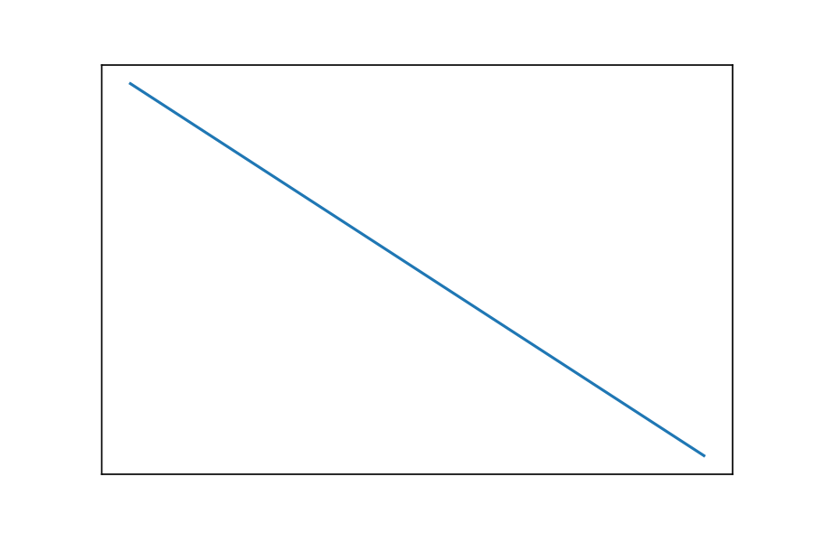

## On the adoption, usage and evolution of Kotlin Features on Android development

Here you can find more information about our study reliazed in our paper **On the adoption, usage and evolution of Kotlin Features on Android development** published on **TODO**.

If you want use this information, please cite this paper:

'''

'''

## Table of contents

1. [Abstract](#abstract)
2. [Research questions](#rqs)
3. [Data for replication](#replication)

---

### <a name="abstract">Abstract</a>

Currently, the Android platform is the largest mobile platform, with more than 2 million applications published in the official store, Google Play.
Although the majority of Android application has been written in Java, since 2017 when Google announced Kotlin as an official programming language of the Android platform, developers have an option of write applications using Kotlin, that combines object-oriented and functional features.

**Objective:** The goal of this paper is to understand the usage of Kotlin features. Particularly, we interested in four aspects of features usage:
i) **which** features are adopted,
ii) **what** is the degree of adoption,
iii) **when** these features are added into the Android applications for the first time
iv) **which** are the features first introduced,
and 
v) **how** they evolve along with applications' evolution.

**Method:** We first defined a method to identify from the abstract syntax tree the usage of features.
Then, we built a tool that analyses Kotlin code statically.
Finally, we conducted an empirical study over, 
the largest dataset of Android open-source applications written in Kotlin, to identify different evolution trends of Kotlin features usage.

**Results:** Our experiment showed that 15 out of 19 features are used on at least 50% of Android applications written in Kotlin.
Moreover, we found that *type inference*, *lambda* and *safe call* are the most used features, being found on 98%, 93% and 84% of applications, respectively. 
Also, we observed that the most used Kotlin features are introduced at the very beginning of Kotlin's history.
Moreover, the most used feature, *type inference*, is always one of the first three added features. 
Finally, we reported that the majority of applications tend to increase the number of instances of 18 out of 19 studied features along with the evolution of Android applications.

### <a name="rqs">Research Questions</a>

#### RQ1: What features of Kotlin are adopted by Android developers?

> Response to RQ 1: 
We studied 19 Kotlin features in our experiment, and as a result, we found three groups of features:
i) 6 features used on at least 80% of applications;
ii)9 features used in more than 50% and less than 80% of applications;
iii) 4 features used in less than 40%.

>Furthermore, we found that *type inference*, *lambdas* and *safe calls*  are the most used features, being found on 98%, 93% and 84% of applications, respectively.

Percentage of applications that uses a specific Kotlin feature. Each bar corresponds to a feature and contains in the top the number of applications that use that feature.

Distribution of the number of instances of the studied features in FAMAZOA's applications.

Kotlin features normalized. The first box (right) shows the distribution of the number of *extension functions* divided by the number of functions.

#### RQ2: When do Android developers introduce Kotlin features during applications' evolution? 

Distributions of the number of commits that introduce the first instance of a Kotlin feature. The number of commits is normalized: 0 means the first commit, 1 means the last commit.

#### RQ3: What is the order of addition of Kotlin features and to what proportion these features are added together?

> Response to RQ 3: 
We found that 5 features, *type inference*, *lambda*, *when expression*, *companion object* and *unsafe call*, tend to be the first introduced feature in at least 50% of the applications.

>Moreover, *type inference* is always one of the three first introduced features and 69% of applications introduced it together with *lambdas*.
Regarding *lambda*, it is one of the three first introduced features in 75% of applications.
Also, we observed that in 69% of applications *type inference* and *lambda* are introduced into the applications on the same commit and that the most used features are often added together.

Ranking of introduction of Kotlin features studied. The first violin (left) shows that *type inference* is one of the first 3 added features and that mostly, it is the first added feature.
The width of the violins is scaled according to the number of observations in each position.

Percentage of times that a feature *f1* (row) and a feature *f2* (column) are introduced in the same moment (commit). For instance, we found that *type inference* and *lambdas* are added together in 68% of applications that have both features.

Percentage of times that a feature *f1*  is introduced before a feature *f2* (column). For instance, *type inference* is added before *inline functions* in 86% of applications that have both features.

#### RQ4: How the adoption of Kotlin features evolves along the evolution of Android applications?  

> Response to RQ 4: 
Developers tend to more instances along the evolution of Android applications of 18 out of 19 (94%) features studied. 
The only exception is the feature *Unsafe call* that was better described by the instability trend.
Moreover, we found that 9 out of 19 features are better described by the trend *Constant rise*.

| Evolution Trends / Features                |    CR                                       |      CD                   |          SR               |   SD                      |        SRP                 |     PGR                    |  PGD                       |            PSR             |      PSD                    |    I                      |    INC       |     DEC     |  Total of Apps   |
| :---------------------- | :---------------------------------------: | :---------------------: | :---------------------: | :---------------------: | :---------------------: | :---------------------: | :---------------------: | :---------------------: | :----------------------: | :----------------------: | :-------: | :------: | :---: |
| Type Inference          |               **84 (36%)**                |         3 (1%)          |        34 (15%)         |         1 (0%)          |        35 (15%)         |         10 (4%)         |         0 (0%)          |         2 (1%)          |          1 (0%)          |         64 (27%)         | 165 (71%) |  5 (2%)  |  234  |
| Lambda                  |               **86 (39%)**                |         0 (0%)          |        42 (19%)         |         3 (1%)          |        22 (10%)         |         17 (8%)         |         0 (0%)          |         13 (6%)         |          3 (1%)          |         36 (16%)         | 180 (81%) |  6 (3%)  |  222  |
| Safe Call               |               **63 (32%)**                |         2 (1%)          |        34 (17%)         |         8 (4%)          |        28 (14%)         |         17 (9%)         |         0 (0%)          |         14 (7%)         |          5 (3%)          |         24 (12%)         | 156 (80%) | 15 (8%)  |  195  |
| When Expr               |               **58 (31%)**                |         5 (3%)          |        21 (11%)         |         1 (1%)          |        20 (11%)         |        44 (24%)         |         0 (0%)          |        19 (10%)         |          6 (3%)          |         12 (6%)          | 162 (87%) | 12 (6%)  |  186  |
| Companion Object        |               **44 (24%)**                |         6 (3%)          |        20 (11%)         |         4 (2%)          |        21 (12%)         |      **44 (24%)**       |         2 (1%)          |        18 (10%)         |          3 (2%)          |         20 (11%)         | 147 (81%) | 15 (8%)  |  182  |
| Unsafe Call             |                 37 (19%)                  |         10 (5%)         |        27 (14%)         |        22 (11%)         |         16 (8%)         |        22 (11%)         |         1 (1%)          |         13 (7%)         |          4 (2%)          |       **45 (23%)**       | 115 (58%) | 37 (19%) |  197  |
| String Template         |               **46 (25%)**                |         3 (2%)          |        23 (13%)         |         4 (2%)          |        23 (13%)         |        38 (21%)         |         2 (1%)          |         15 (8%)         |          3 (2%)          |         26 (14%)         | 145 (79%) | 12 (7%)  |  183  |
| Func With Default Value |                 39 (27%)                  |         3 (2%)          |        19 (13%)         |         3 (2%)          |         7 (5%)          |      **45 (31%)**       |         1 (1%)          |        16 (11%)         |          5 (3%)          |          7 (5%)          | 126 (87%) | 12 (8%)  |  145  |
| Singleton                 |                 17 (12%)                  |         3 (2%)          |        21 (14%)         |         1 (1%)          |        14 (10%)         |      **39 (27%)**       |         4 (3%)          |        23 (16%)         |         16 (11%)         |          7 (5%)          | 114 (79%) | 24 (17%) |  145  |
| Smart Cast                |                 25 (19%)                  |         4 (3%)          |        19 (15%)         |         2 (2%)          |        17 (13%)         |      **28 (21%)**       |         2 (2%)          |        19 (15%)         |         10 (8%)          |          5 (4%)          | 108 (82%) | 18 (14%) |  131  |
| Range Expr                |                 21 (16%)                  |         6 (5%)          |        17 (13%)         |         3 (2%)          |         9 (7%)          |        27 (21%)         |         1 (1%)          |      **31 (24%)**       |          9 (7%)          |          4 (3%)          | 105 (82%) | 19 (15%) |  128  |
| Func Call With Named Arg  |               **33 (25%)**                |         3 (2%)          |        26 (20%)         |         3 (2%)          |         11 (8%)         |        30 (23%)         |         0 (0%)          |        18 (14%)         |          2 (2%)          |          7 (5%)          | 118 (89%) |  8 (6%)  |  133  |
| Data Class                |                 29 (23%)                  |         1 (1%)          |        14 (11%)         |         4 (3%)          |         11 (9%)         |      **32 (26%)**       |         0 (0%)          |        24 (19%)         |          3 (2%)          |          6 (5%)          | 110 (89%) |  8 (6%)  |  124  |
| Extension Function        |               **35 (29%)**                |         5 (4%)          |        20 (17%)         |         6 (5%)          |         8 (7%)          |        21 (18%)         |         1 (1%)          |        15 (12%)         |          5 (4%)          |          4 (3%)          | 99 (82%)  | 17 (14%) |  120  |
| Property Delegation       |               **28 (25%)**                |         7 (6%)          |        19 (17%)         |         3 (3%)          |         9 (8%)          |        15 (13%)         |         2 (2%)          |        14 (12%)         |          5 (4%)          |         11 (10%)         | 85 (75%)  | 17 (15%) |  113  |
| Destructuring Declaration |                 11 (13%)                  |         5 (6%)          |        11 (13%)         |         3 (4%)          |         2 (2%)          |      **18 (21%)**       |         2 (2%)          |      **18 (21%)**       |         10 (12%)         |          4 (5%)          | 60 (71%)  | 20 (24%) |  84   |
| Inline Func               |                  3 (6%)                   |         2 (4%)          |         5 (10%)         |         2 (4%)          |         3 (6%)          |      **14 (29%)**       |         2 (4%)          |        11 (22%)         |         7 (14%)          |          0 (0%)          | 36 (73%)  | 13 (27%) |  49   |
| Overloaded Op             |                  4 (11%)                  |         1 (3%)          |         5 (14%)         |         2 (6%)          |         3 (8%)          |         6 (17%)         |         0 (0%)          |      **10 (28%)**       |         4 (11%)          |          1 (3%)          | 28 (78%)  | 7 (19%)  |  36   |
| Super Delegation |                  0 (0%)                   |         0 (0%)          |         0 (0%)          |         1 (8%)          |         0 (0%)          |         4 (31%)         |         0 (0%)          |       **6 (46%)**       |         2 (15%)          |          0 (0%)          | 10 (77%) | 3 (23%) |  13   |
| **Total**    |                     **9**                     |            0            |            0            |            0            |            0            |            **7**            |            0            |            **4**            |            0             |            **1**             | \-  | \-  |  \-   |

       
                 
Distribution of the coefficient of determination, R-square, considering the best function fitted for each feature. The median value is 0.89 (R-square equal to 1 means a perfect fitting).

Analyze data result grouped by:

* [Application](appendix/apps_summary.md)
* [Feature](appendix/features_summary.md)
* [Evolution trend](appendix/trends_summary.md)

### <a name="replication">Data for replication</a>

* [Applications](appendix/dataset/dataset.txt)
* [Feature adoption](appendix/data/features)
* [Evolution trend](appendix/data/evolution_trends)
