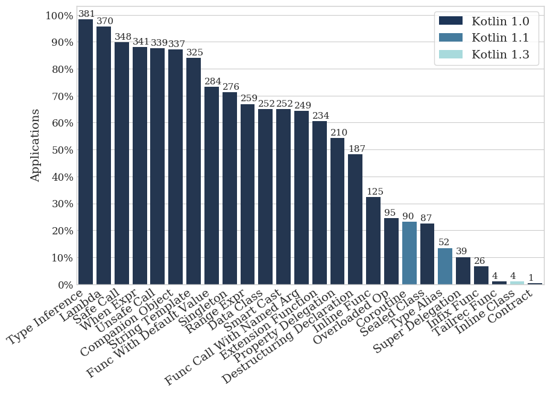
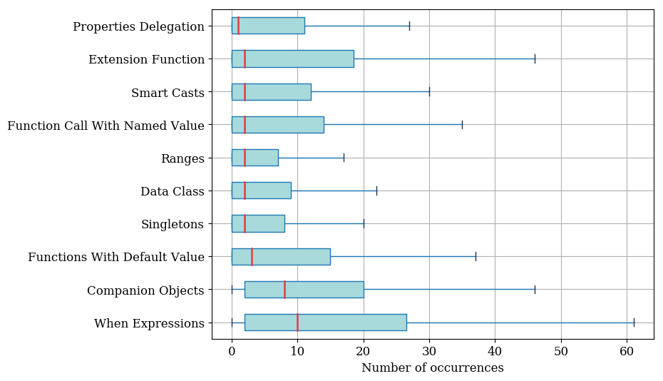
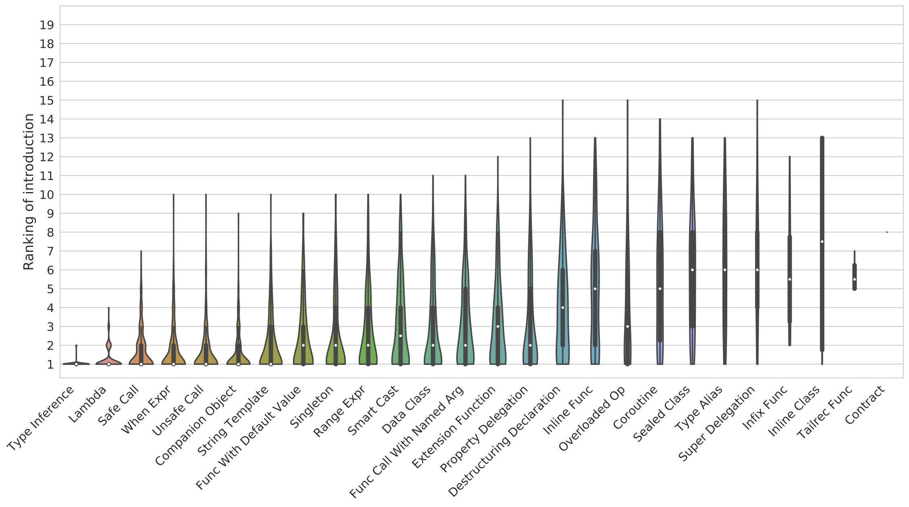
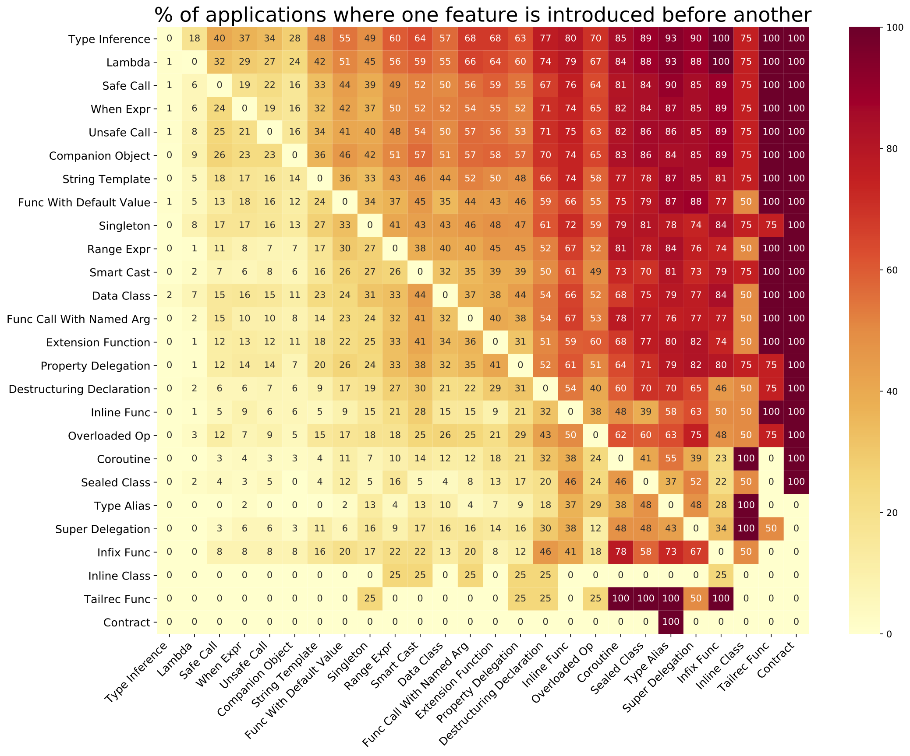

## On the adoption, usage and evolution of Kotlin Features on Android development


Here you can find more information about our study reliazed in our paper **On the adoption, usage and evolution of Kotlin Features on Android development**

<!--If you want use this information, please cite this paper:
```
@misc{1907.09003,
Author = {Bruno Góis Mateus and Matias Martinez},
Title = {On the adoption, usage and evolution of Kotlin Features on Android development},
Year = {2019},
Eprint = {arXiv:1907.09003},
}

```
-->


## Table of contents

1. [Abstract](#abstract)
2. [Research questions](#rqs)
3. [Data for replication](#replication)
4. [Validation](appendix/validation)

---

### <a name="abstract">Abstract</a>

**Background:** Google announced Kotlin as an Android official programming language in 2017, giving developers an option of writing applications using a language that combines object-oriented and functional features.

**Aims:** The goal of this work is to understand the usage of Kotlin features considering four aspects:
i) which features are adopted, ii) what is the degree of adoption, iii) when are these features added into Android applications for the first time, and iv) how the usage of features evolves along with applications' evolution.


**Method:** Exploring the source code of 387 Android applications, we identify the usage of Kotlin features on each version application's version and compute the moment that each feature is used for the first time.  
Finally, we identify the evolution trend that better describes the usage of these features.

**Results:** 5 out of 26 features are used on at least 50% of applications.
Moreover, we found that *type inference*, *lambda* and *safe call* are the most used features.
Also, we observed that the most used Kotlin features are those first included on Android applications.
Finally, we report that the majority of applications tend to add more instances of 24 out of 26 features along with their evolution.

**Conclusions:** Our study 
 generates 7 main findings. We present their implications, which are addressed to developers, researchers and tool builders in order to foster the use of Kotlin features to develop Android applications.


### <a name="rqs">Research Questions</a>

#### RQ1: Which Kotlin features are adopted by Android developers?

> Response to RQ 1: 
> We studied 26 Kotlin features in our experiment, and as a result, we found that all features are used. Furthermore, we identified three groups of features:
We studied 19 Kotlin features in our experiment, and as a result, we found three groups of features:
i) 7 features used in at least 80% of applications;
ii) 9 features used in more than 48% and less than 80% of applications;
iii) 10 features used in less than 33%.

>Furthermore, we found that *type inference*, *lambdas* and *safe calls*  are the most used features, being found on 98%, 95% and 89% of applications, respectively.



Percentage of applications that uses a specific Kotlin feature. Each bar corresponds to a feature and contains in the top the number of applications that use that feature.





Distribution of the number of instances of the studied features in FAMAZOA's applications.


Kotlin features normalized. The first box (right) shows the distribution of the number of *extension functions* divided by the number of functions.


#### RQ2: When do Android developers introduce Kotlin features during applications' evolution? 


<!--
#### RQ3: What is the order of addition of Kotlin features and to what proportion these features are added together?

> Response to RQ 3: 
We found that 6 features, *type inference*, *lambda*, *when expression*, *unsafe call*, *companion object* and *string tempalte*, tend to be the first introduced feature in at least 50% of the applications.
Moreover, *type inference* is always one of the two first introduced features.
Regarding *lambda*, it is one of the three first introduced features in 75% of applications.
Also, we observed that in 82% of applications *type inference* and *lambda* are introduced on the same commit.
Finally, we conclude that the most used features are often added together.



Ranking of introduction of Kotlin features studied. The first violin (left) shows that *type inference* is one of the first 2 added feature. The width of the violins is scaled according to the number of observations in each position.


Percentage of times that a feature *f1* (row) and a feature *f2* (column) are introduced in the same moment (commit). For instance, we found that *type inference* and *lambdas* are added together in 82% of applications that have both features.



Percentage of times that a feature *f1*  is introduced before a feature *f2* (column). For instance, *type inference* is added before *inline functions* in 80% of applications that have both features.
-->

#### RQ3: How the adoption of Kotlin features evolves along the evolution of Android applications?  


> Response to RQ 3: 
Developers tend to more instances along the evolution of Android applications of 18 out of 19 (94%) features studied. 
The only exception is the feature *Unsafe call* that was better described by the instability trend.
Moreover, we found that 9 out of 19 features are better described by the trend *Constant rise*.

| Evolution Trends / Features                |    CR                                       |      CD                   |          SR               |   SD                      |        SRP                 |     PGR                    |  PGD                       |            PSR             |      PSD                    |    I                      |    INC       |     DEC     |  Total of Apps   |
| :---------------------- | :---------------------------------------: | :---------------------: | :---------------------: | :---------------------: | :---------------------: | :---------------------: | :---------------------: | :---------------------: | :----------------------: | :----------------------: | :-------: | :------: | :---: |
| Type Inference            | **128 (36%)** | 3 (1%)   | 0 (0%) | 60 (17%) | 1 (0%)  | 53 (15%)             | 10 (3%)              | 0 (0%) | 5 (1%)               | 4 (1%)              | 91 (26%) | 256 (72%) | 8 (2%)   | 355 |
| Lambda                    | **124 (36%)** | 2 (1%)   | 0 (0%) | 67 (20%) | 4 (1%)  | 31 (9%)              | 36 (10%)             | 0 (0%) | 14 (4%)              | 4 (1%)              | 61 (18%) | 272 (79%) | 10 (3%)  | 343 |
| Safe Call                 | **94 (30%)**  | 2 (1%)   | 0 (0%) | 64 (20%) | 3 (1%)  | 38 (12%)             | 33 (10%)             | 1 (0%) | 21 (7%)              | 9 (3%)              | 51 (16%) | 250 (79%) | 15 (5%)  | 316 |
| When Expr                 | **85 (29%)**  | 3 (1%)   | 0 (0%) | 47 (16%) | 2 (1%)  | 28 (10%)             | 72 (24%)             | 0 (0%) | 29 (10%)             | 5 (2%)              | 23 (8%)  | 261 (89%) | 10 (3%)  | 294 |
| Unsafe Call               | **60 (19%)**  | 32 (10%) | 0 (0%) | 54 (17%) | 19 (6%) | 25 (8%)              | 41 (13%)             | 3 (1%) | 17 (5%)              | 11 (4%)             | 51 (16%) | 197 (63%) | 65 (21%) | 313 |
| Companion Object          | **75 (26%)**  | 11 (4%)  | 0 (0%) | 38 (13%) | 8 (3%)  | 33 (11%)             | 57 (20%)             | 2 (1%) | 39 (13%)             | 5 (2%)              | 22 (8%)  | 242 (83%) | 26 (9%)  | 290 |
| String Template           | **80 (27%)**  | 5 (2%)   | 0 (0%) | 39 (13%) | 6 (2%)  | 32 (11%)             | 59 (20%)             | 1 (0%) | 28 (9%)              | 7 (2%)              | 38 (13%) | 238 (81%) | 19 (6%)  | 295 |
| Func With Default Value   | 50 (21%)              | 3 (1%)   | 0 (0%) | 41 (18%) | 4 (2%)  | 19 (8%)              | **64 (27%)** | 3 (1%) | 27 (12%)             | 6 (3%)              | 17 (7%)  | 201 (86%) | 16 (7%)  | 234 |
| Singleton                 | 33 (15%)              | 6 (3%)   | 0 (0%) | 36 (16%) | 7 (3%)  | 25 (11%)             | **51 (22%)** | 3 (1%) | 29 (13%)             | 24 (11%)            | 13 (6%)  | 174 (77%) | 40 (18%) | 227 |
| Range Expr                | 30 (14%)              | 14 (7%)  | 0 (0%) | 28 (13%) | 5 (2%)  | 17 (8%)              | **47 (22%)** | 6 (3%) | 38 (18%)             | 14 (7%)             | 12 (6%)  | 160 (76%) | 39 (18%) | 211 |
| Smart Cast                | 38 (18%)              | 14 (7%)  | 0 (0%) | 35 (17%) | 8 (4%)  | 20 (10%)             | **40 (19%)** | 4 (2%) | 25 (12%)             | 14 (7%)             | 10 (5%)  | 158 (76%) | 40 (19%) | 208 |
| Data Class                | 44 (22%)              | 2 (1%)   | 0 (0%) | 28 (14%) | 5 (2%)  | 19 (9%)              | **51 (25%)** | 0 (0%) | 35 (17%)             | 6 (3%)              | 14 (7%)  | 177 (87%) | 13 (6%)  | 204 |
| Func Call With Named Arg  | **48 (22%)**  | 2 (1%)   | 0 (0%) | 40 (19%) | 6 (3%)  | 20 (9%)              | 41 (19%)             | 1 (0%) | 30 (14%)             | 8 (4%)              | 19 (9%)  | 179 (83%) | 17 (8%)  | 215 |
| Extension Function        | **47 (23%)**  | 4 (2%)   | 0 (0%) | 32 (16%) | 7 (3%)  | 23 (11%)             | 42 (21%)             | 1 (0%) | 22 (11%)             | 7 (3%)              | 16 (8%)  | 166 (83%) | 19 (9%)  | 201 |
| Property Delegation       | **40 (22%)**  | 11 (6%)  | 0 (0%) | 32 (18%) | 8 (4%)  | 22 (12%)             | 23 (13%)             | 3 (2%) | 18 (10%)             | 5 (3%)              | 17 (9%)  | 135 (75%) | 27 (15%) | 179 |
| Destructuring Declaration | 23 (16%)              | 9 (6%)   | 0 (0%) | 14 (10%) | 5 (3%)  | 9 (6%)               | **33 (23%)** | 4 (3%) | 25 (17%)             | 16 (11%)            | 5 (3%)   | 104 (73%) | 34 (24%) | 143 |
| Inline Func               | 11 (12%)              | 5 (5%)   | 0 (0%) | 11 (12%) | 5 (5%)  | 5 (5%)               | 17 (18%)             | 2 (2%) | **20 (21%)** | 14 (15%)            | 5 (5%)   | 64 (67%)  | 26 (27%) | 95  |
| Overloaded Op             | 9 (14%)               | 3 (5%)   | 0 (0%) | 5 (8%)   | 2 (3%)  | 5 (8%)               | 11 (17%)             | 2 (3%) | **15 (23%)** | 11 (17%)            | 1 (2%)   | 45 (70%)  | 18 (28%) | 64  |
| Coroutine                 | **17 (22%)**  | 1 (1%)   | 0 (0%) | 12 (16%) | 1 (1%)  | 8 (11%)              | 16 (21%)             | 0 (0%) | 6 (8%)               | 1 (1%)              | 14 (18%) | 59 (78%)  | 3 (4%)   | 76  |
| Sealed Class              | 6 (9%)                | 3 (5%)   | 0 (0%) | 10 (15%) | 1 (2%)  | 5 (8%)               | 7 (11%)              | 0 (0%) | **26 (40%)** | 3 (5%)              | 4 (6%)   | 54 (83%)  | 7 (11%)  | 65  |
| Type Alias                | 2 (7%)                | 1 (3%)   | 0 (0%) | 6 (20%)  | 1 (3%)  | 0 (0%)               | 8 (27%)              | 0 (0%) | **10 (33%)** | 2 (7%)              | 0 (0%)   | 26 (87%)  | 4 (13%)  | 30  |
| Super Delegation          | 3 (10%)               | 0 (0%)   | 0 (0%) | 1 (3%)   | 3 (10%) | 4 (14%)              | 3 (10%)              | 0 (0%) | **10 (34%)** | 4 (14%)             | 1 (3%)   | 21 (72%)  | 7 (24%)  | 29  |
| Infix Func                | 3 (19%)               | 0 (0%)   | 0 (0%) | 0 (0%)   | 1 (6%)  | 0 (0%)               | 3 (19%)              | 0 (0%) | 3 (19%)              | **6 (38%)** | 0 (0%)   | 9 (56%)   | 7 (44%)  | 16  |
| Inline Klass              | 0 (0%)                | 0 (0%)   | 0 (0%) | 0 (0%)   | 0 (0%)  | **1 (100%)** | 0 (0%)               | 0 (0%) | 0 (0%)               | 0 (0%)              | 0 (0%)   | 1 (100%)  | 0 (0%)   | 1   |
| Tailrec Func              | 0 (0%)                | 0 (0%)   | 0 (0%) | 0 (0%)   | 0 (0%)  | 0 (0%)               | 0 (0%)               | 0 (0%) | **1 (50%)**  | **1 (50%)** | 0 (0%)   | 1 (50%)   | 1 (50%ç  | 2   |
| Contract                  | 0 (0%)                | 0 (0%)   | 0 (0%) | 0 (0%)   | 0 (0%)  | 0 (0%)               | 0 (0%)               | 0 (0%) | **1 (100%)** | 0 (0%)              | 0 (0%)   | 1 (100%)  | 0 (0%)   | 1   |
| Total                     | 11                        | 0            | 0          | 0            | 0           | 1                        | 6                        | 0          | 7                        | 2                       | 0            | \-            | \-           | \-  |


       
                 
Distribution of the coefficient of determination, R-square, considering the best function fitted for each feature. The median value is 0.88 (R-square equal to 1 means a perfect fitting).


Analyze data result grouped by:

* [Application](appendix/apps_summary.md)
* [Feature](appendix/features_summary.md)
* [Evolution trend](appendix/trends_summary.md)

### <a name="replication">Data for replication</a>

* [Applications](appendix/dataset/dataset.txt)
* [Feature adoption](appendix/data/features)
* [Evolution trend](appendix/data/evolution_trends)
