## AIDEA775-UNCmorfi
----
#### Metrics provided by Detekt
* Number of lines of code 2516
* Number of Kotlin files: 28
* Cyclomatic complexity: 361
* Cyclomatic complexity by thousands of lines: 262 

----
**12** features analyzed

*	<a href="#type_inference">Type Inference</a> 
*	<a href="#lambda">Lambda</a> 
*	<a href="#safe_call">Safe Call</a> 
*	<a href="#when_expr">When expression</a> 
*	<a href="#companion_object">Companion Object</a> 
*	<a href="#unsafe_call">Unsafe Call</a> 
*	<a href="#string_template">String Template</a> 
*	<a href="#func_with_default_value">Function with Default Value</a> 
*	<a href="#singleton">Singleton</a> 
*	<a href="#range_expr">Range Expression</a> 
*	<a href="#extension_function">Extension Function</a> 
*	<a href="#property_delegation">Property Delegation</a> 

### <a name="type_inference">Type Inference</a>
----
#### Functions
* **Instability - Polinomial 4:** 
    * **R_Squared:** 0.96945127
* **Sudden Rise Plateau - Logarithm:** 
    * **R_Squared:** 0.81220417
* **Constant Rise - Linear:** 
    * **R_Squared:** 0.70204537

**Plots** :chart_with_upwards_trend:
-----

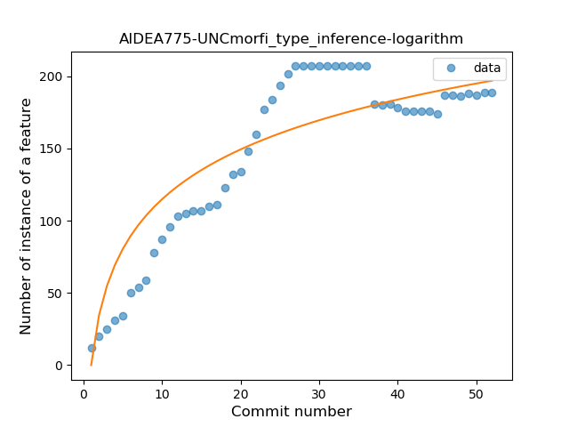
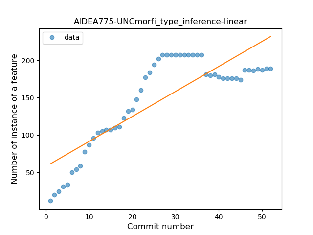
### <a name="lambda">Lambda</a>
----
#### Functions
* **Sudden Rise - Exponential:** 
    * **R_Squared:** 0.95127895
* **Constant Rise - Linear:** 
    * **R_Squared:** 0.87092672
* **Sudden Rise Plateau - Logarithm:** 
    * **R_Squared:** 0.39465988

**Plots** :chart_with_upwards_trend:
-----

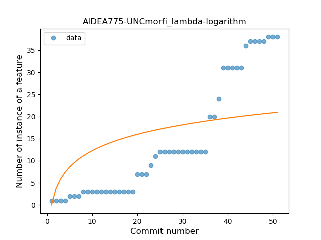
### <a name="safe_call">Safe Call</a>
----
#### Functions
* **Constant Rise - Linear:** 
    * **R_Squared:** 0.91968698
* **Sudden Rise Plateau - Logarithm:** 
    * **R_Squared:** 0.65528108

**Plots** :chart_with_upwards_trend:
-----

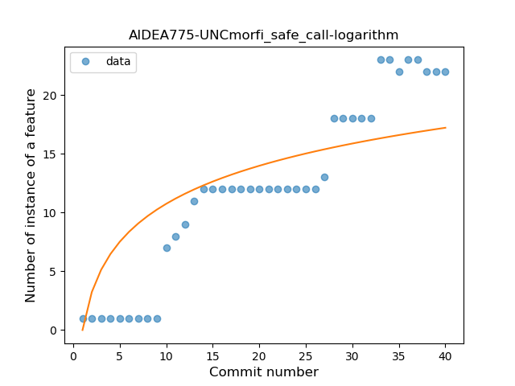
### <a name="when_expr">When expression</a>
----
#### Functions
* **Constant Rise - Linear:** 
    * **R_Squared:** 0.97315879
* **Sudden Rise - Exponential:** 
    * **R_Squared:** 0.9763351
* **Plateau Gradual Rise - Sigmoid:** 
    * **R_Squared:** 0.97680987
* **Sudden Rise Plateau - Logarithm:** 
    * **R_Squared:** 0.66865526

**Plots** :chart_with_upwards_trend:
-----

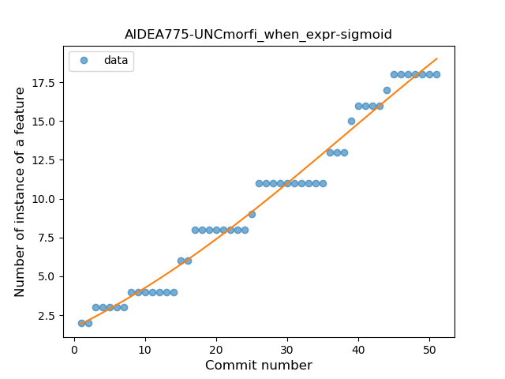
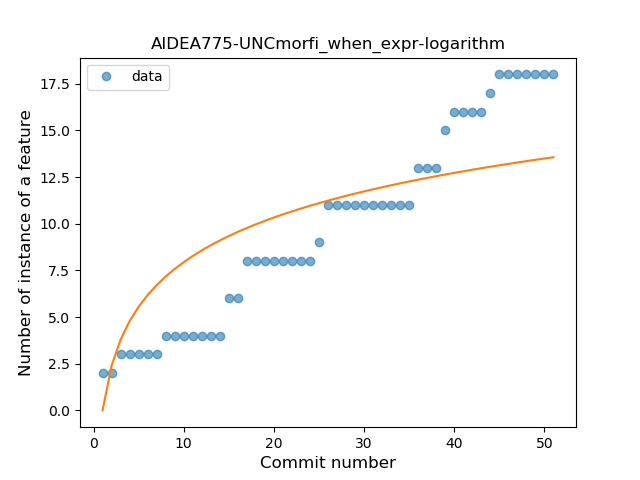
### <a name="companion_object">Companion Object</a>
----
#### Functions
* **Plateau Gradual Rise - Sigmoid:** 
    * **R_Squared:** 0.95561789
* **Sudden Rise Plateau - Logarithm:** 
    * **R_Squared:** 0.80301514
* **Constant Rise - Linear:** 
    * **R_Squared:** 0.79136557

**Plots** :chart_with_upwards_trend:
-----

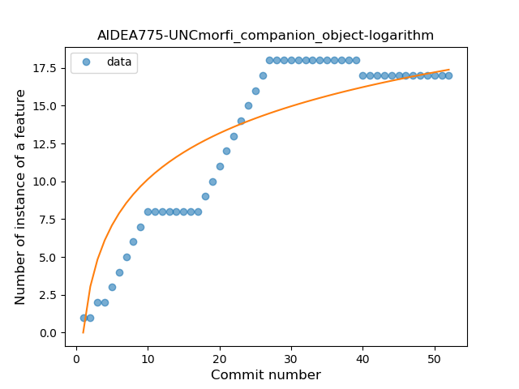
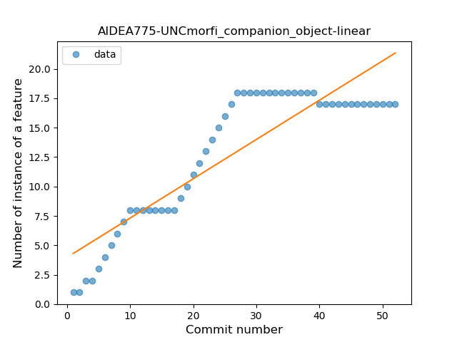
### <a name="unsafe_call">Unsafe Call</a>
----
#### Functions
* **Plateau Gradual Rise - Sigmoid:** 
    * **R_Squared:** 0.69943362
* **Constant Rise - Linear:** 
    * **R_Squared:** 0.59700025
* **Sudden Rise Plateau - Logarithm:** 
    * **R_Squared:** 0.5867939

**Plots** :chart_with_upwards_trend:
-----

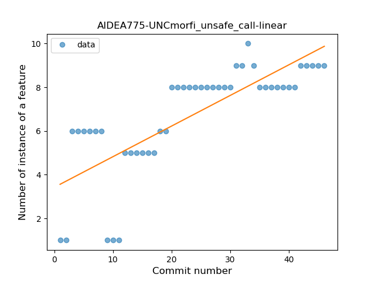
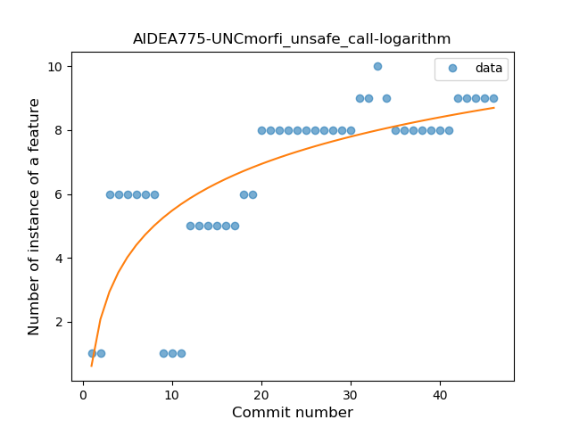
### <a name="string_template">String Template</a>
----
#### Functions
* **Sudden Rise Plateau - Logarithm:** 
    * **R_Squared:** 0.78989365
* **Constant Rise - Linear:** 
    * **R_Squared:** 0.66380564

**Plots** :chart_with_upwards_trend:
-----

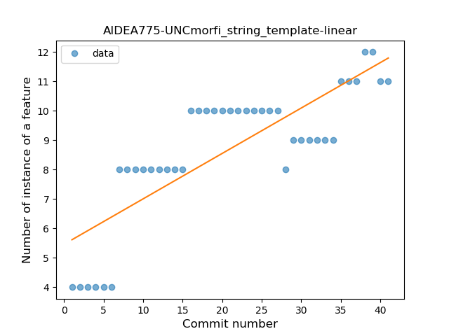
### <a name="func_with_default_value">Function with Default Value</a>
----
#### Functions
* **Instability - Polinomial 3:** )
    * **R_Squared:** 0.89336821
* **Sudden Rise Plateau - Logarithm:** 
    * **R_Squared:** 0.84366082
* **Constant Rise - Linear:** 
    * **R_Squared:** 0.64285714

**Plots** :chart_with_upwards_trend:
-----

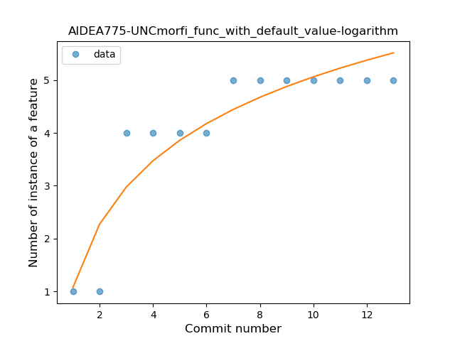
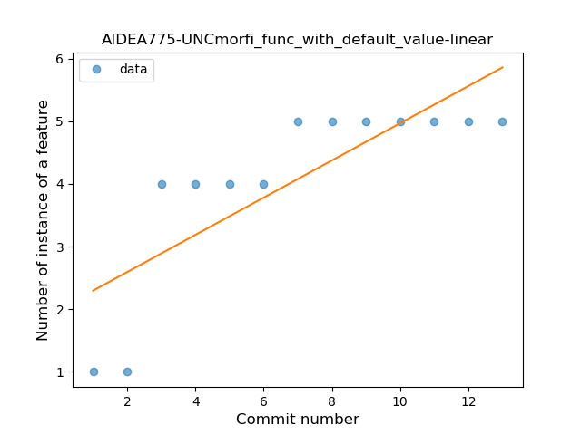
### <a name="singleton">Singleton</a>
----
#### Functions
* **Constant Decline - Linear:** 
    * **R_Squared:** 0.25368729
* **Sudden Rise Plateau - Logarithm:** 
    * **R_Squared:** -0.0

**Plots** :chart_with_upwards_trend:
-----

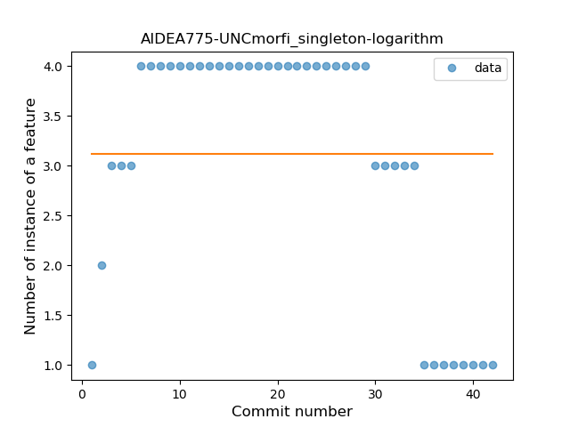
### <a name="range_expr">Range Expression</a>
----
#### Functions
* **Plateau Gradual Rise - Sigmoid:** 
    * **R_Squared:** 0.71194832
* **Sudden Rise Plateau - Logarithm:** 
    * **R_Squared:** 0.54981317
* **Constant Rise - Linear:** 
    * **R_Squared:** 0.28282301

**Plots** :chart_with_upwards_trend:
-----

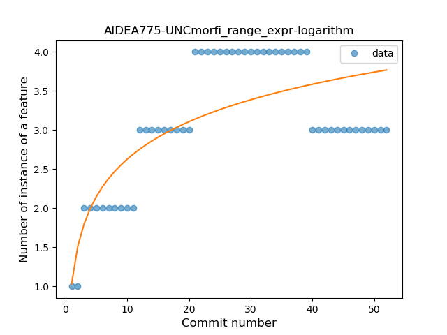
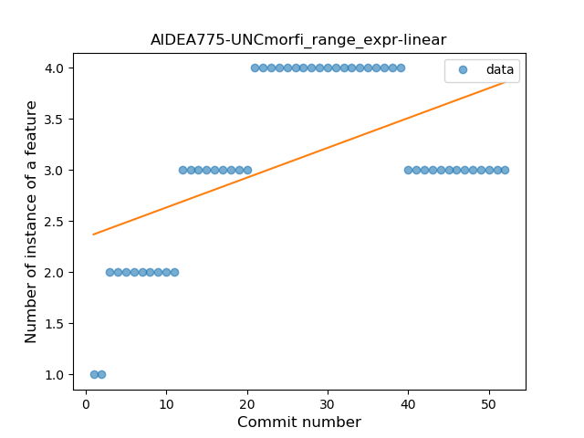
### <a name="extension_function">Extension Function</a>
----
#### Functions
* **Plateau Gradual Rise - Sigmoid:** 
    * **R_Squared:** 0.97171625
* **Instability - Polinomial 3:** )
    * **R_Squared:** 0.92259733
* **Sudden Rise - Exponential:** 
    * **R_Squared:** 0.89248357
* **Constant Rise - Linear:** 
    * **R_Squared:** 0.57347681
* **Sudden Rise Plateau - Logarithm:** 
    * **R_Squared:** 0.17744065

**Plots** :chart_with_upwards_trend:
-----

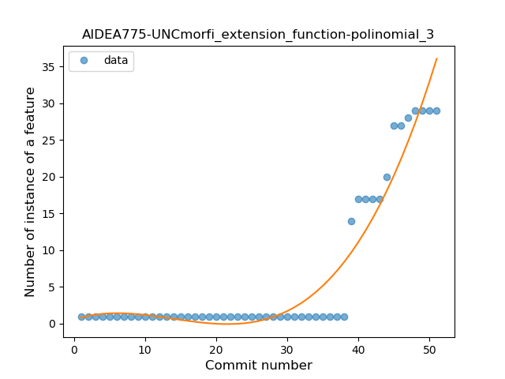
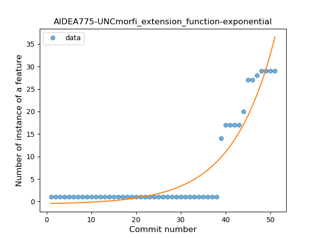
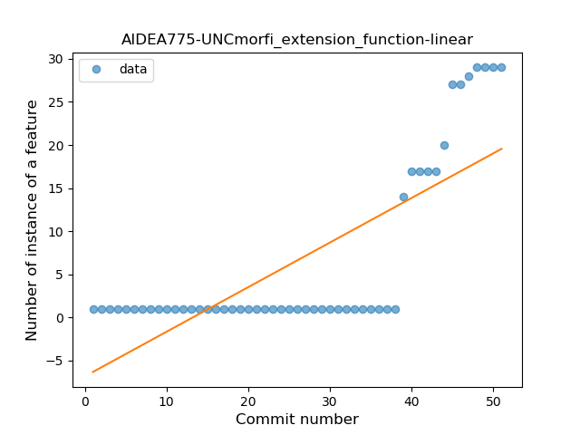
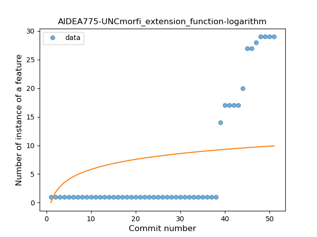
### <a name="property_delegation">Property Delegation</a>
----
#### Functions
* **Constant Decline - Linear:** 
    * **R_Squared:** 0.29520413
* **Sudden Rise Plateau - Logarithm:** 
    * **R_Squared:** -0.0

**Plots** :chart_with_upwards_trend:
-----

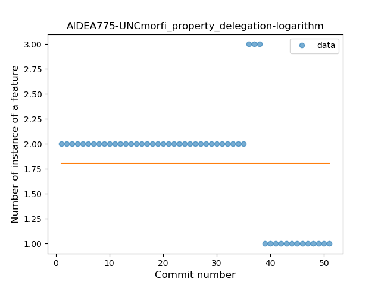
