## AkshayChordiya-gofun-android
----
#### Metrics provided by Detekt
* Number of lines of code 1118
* Number of Kotlin files: 20
* Cyclomatic complexity: 126
* Cyclomatic complexity by thousands of lines: 288 

----
**8** features analyzed

*	<a href="#type_inference">Type Inference</a> 
*	<a href="#lambda">Lambda</a> 
*	<a href="#safe_call">Safe Call</a> 
*	<a href="#when_expr">When expression</a> 
*	<a href="#companion_object">Companion Object</a> 
*	<a href="#func_with_default_value">Function with Default Value</a> 
*	<a href="#extension_function">Extension Function</a> 
*	<a href="#inline_func">Inline Function</a> 

### <a name="type_inference">Type Inference</a>
----
#### Functions
* **Sudden Rise Plateau - Logarithm:** 
    * **R_Squared:** 0.88221551
* **Constant Rise - Linear:** 
    * **R_Squared:** 0.8072531

**Plots** :chart_with_upwards_trend:
-----

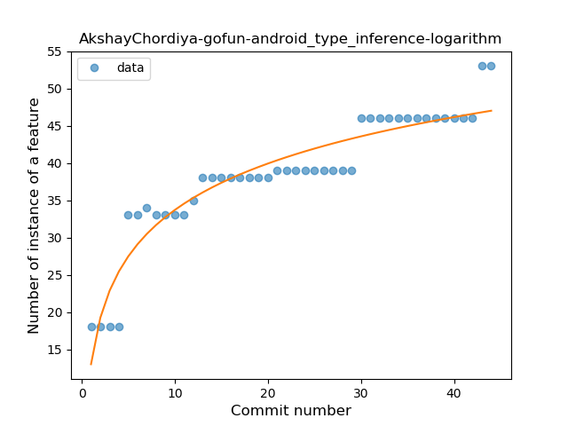
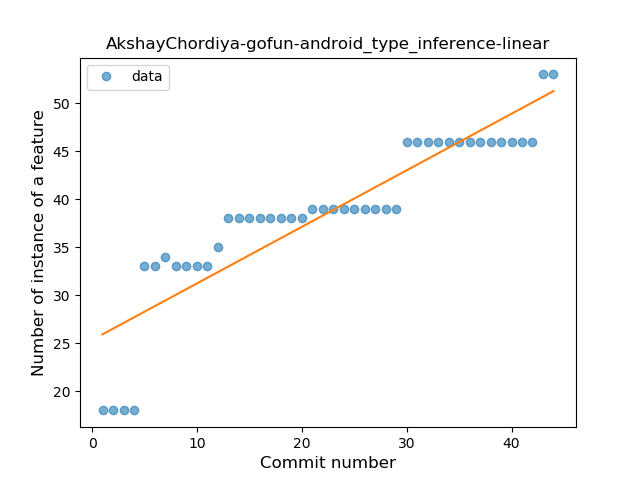
### <a name="lambda">Lambda</a>
----
#### Functions
* **Instability - Polinomial 3:** )
    * **R_Squared:** 0.96631988
* **Sudden Rise Plateau - Logarithm:** 
    * **R_Squared:** 0.85478075
* **Constant Rise - Linear:** 
    * **R_Squared:** 0.52925486
* **Plateau Sudden Rise - Binary Sigmoid:** 
    * **R_Squared:** 0.11431846

**Plots** :chart_with_upwards_trend:
-----

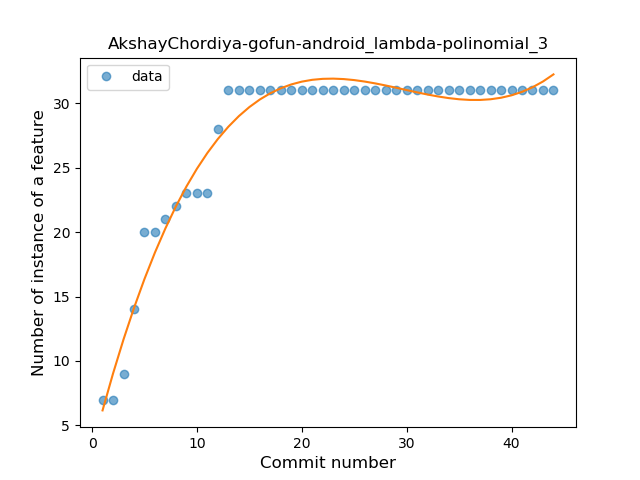
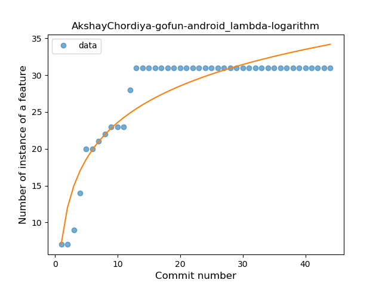
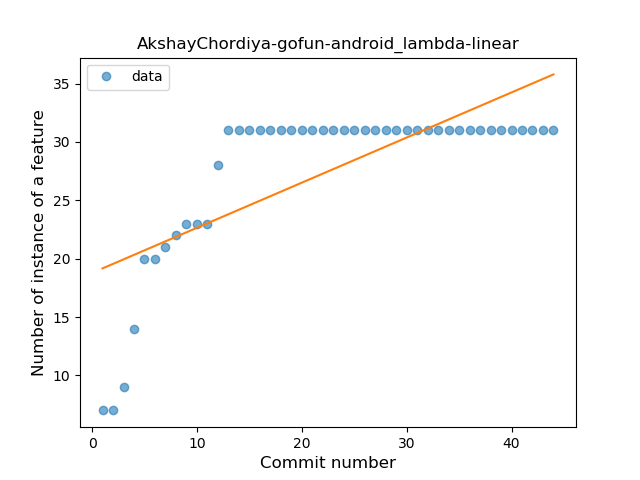
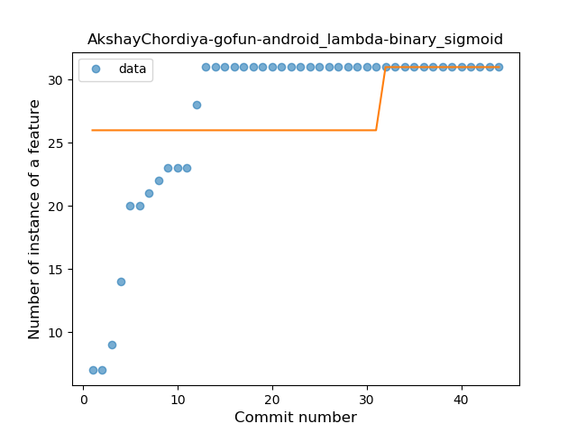
### <a name="safe_call">Safe Call</a>
----
#### Functions
* **Plateau Gradual Rise - Sigmoid:** 
    * **R_Squared:** 0.75463161
* **Sudden Rise Plateau - Logarithm:** 
    * **R_Squared:** 0.34726514
* **Constant Rise - Linear:** 
    * **R_Squared:** 0.08434751

**Plots** :chart_with_upwards_trend:
-----

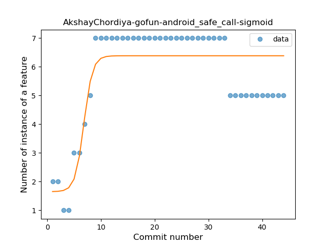
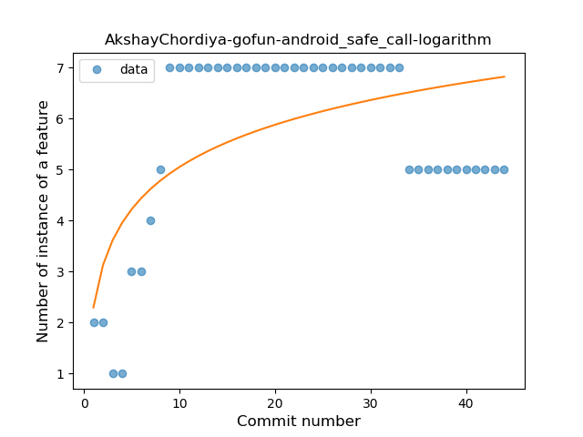
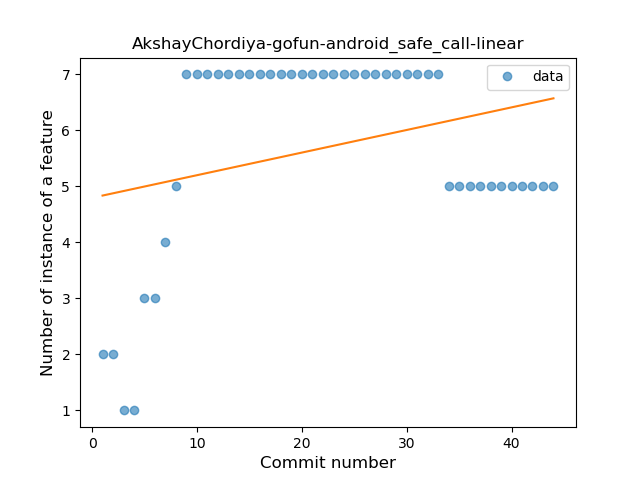
### <a name="when_expr">When expression</a>
----
#### Functions
* **Plateau Sudden Rise - Binary Sigmoid:** 
    * **R_Squared:** 0.96388847
* **Instability - Polinomial 3:** )
    * **R_Squared:** 0.90815193
* **Sudden Rise Plateau - Logarithm:** 
    * **R_Squared:** 0.73997311
* **Constant Rise - Linear:** 
    * **R_Squared:** 0.38440298

**Plots** :chart_with_upwards_trend:
-----

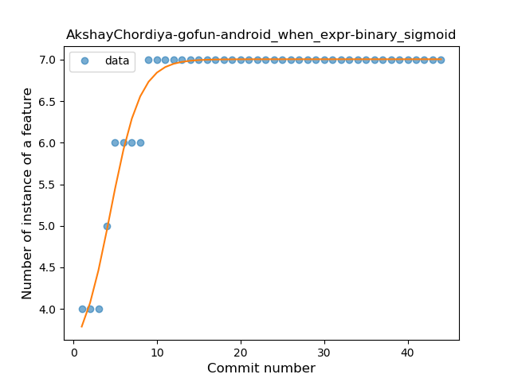
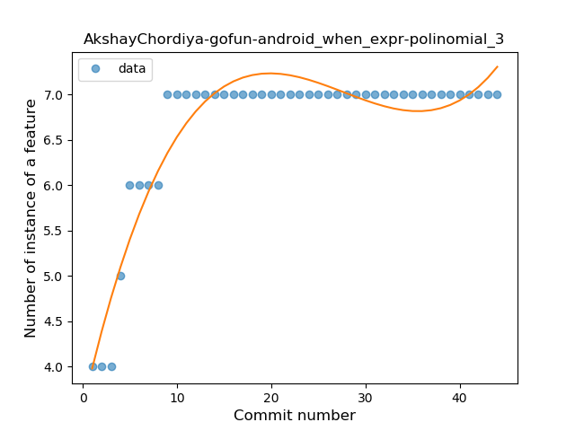
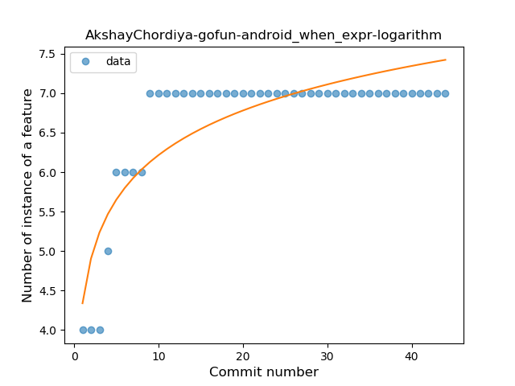
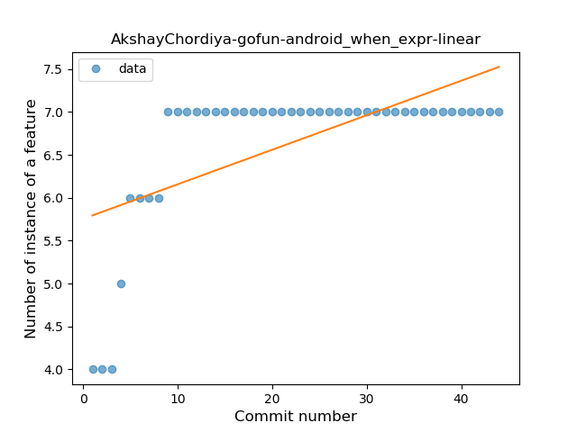
### <a name="companion_object">Companion Object</a>
----
#### Functions
* **Instability - Polinomial 3:** )
    * **R_Squared:** 0.21297611
* **Plateau Gradual Rise - Sigmoid:** 
    * **R_Squared:** 0.19333333
* **Constant Rise - Linear:** 
    * **R_Squared:** 0.05023256
* **Sudden Rise Plateau - Logarithm:** 
    * **R_Squared:** 0.04772847

**Plots** :chart_with_upwards_trend:
-----

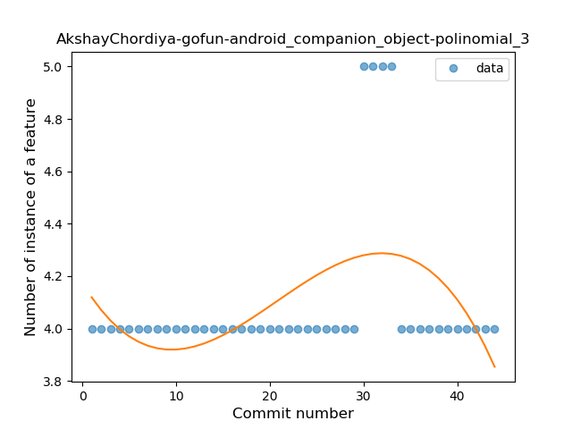

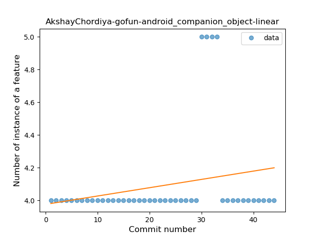

### <a name="func_with_default_value">Function with Default Value</a>
----
#### Functions
* **Plateau Sudden Rise - Binary Sigmoid:** 
    * **R_Squared:** 0.84848485
* **Instability - Polinomial 3:** )
    * **R_Squared:** 0.64367193
* **Sudden Rise Plateau - Logarithm:** 
    * **R_Squared:** 0.55902033
* **Constant Rise - Linear:** 
    * **R_Squared:** 0.39668462

**Plots** :chart_with_upwards_trend:
-----

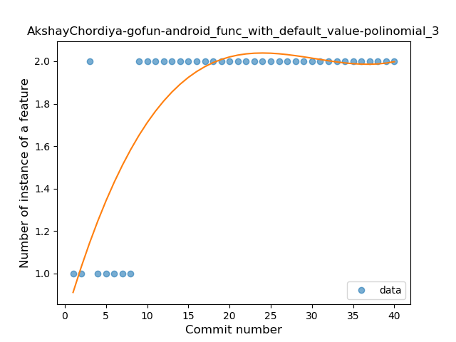
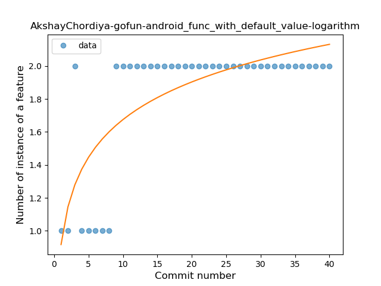
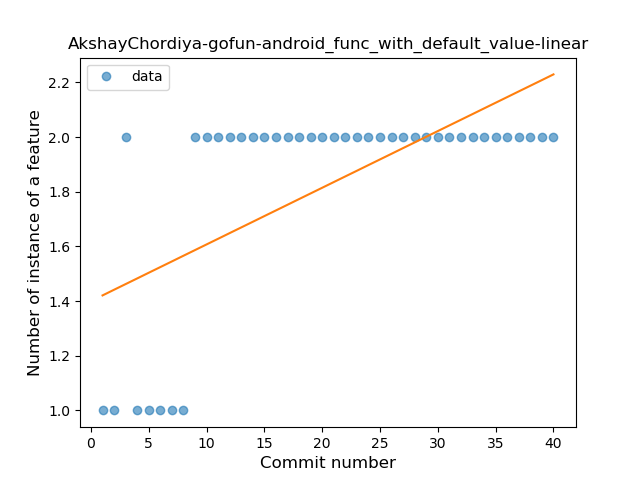
### <a name="extension_function">Extension Function</a>
----
#### Functions
* **Instability - Polinomial 3:** )
    * **R_Squared:** 0.93585017
* **Sudden Rise Plateau - Logarithm:** 
    * **R_Squared:** 0.89616768
* **Constant Rise - Linear:** 
    * **R_Squared:** 0.6599698

**Plots** :chart_with_upwards_trend:
-----

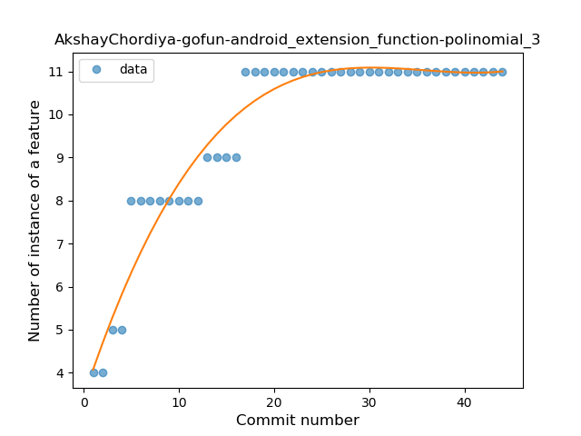
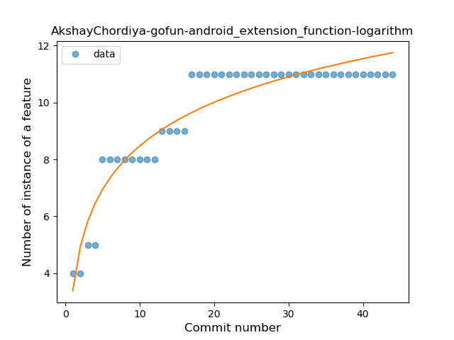
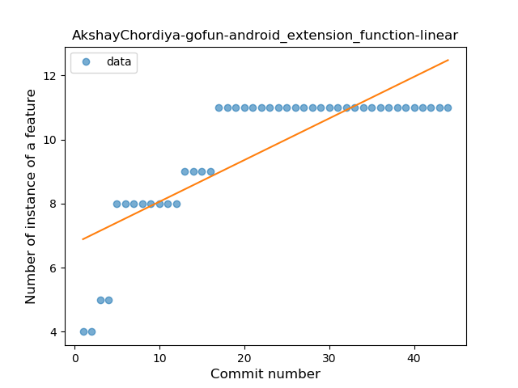
### <a name="inline_func">Inline Function</a>
----
#### Functions
* **Plateau Sudden Rise - Binary Sigmoid:** 
    * **R_Squared:** 0.95338983
* **Instability - Polinomial 3:** )
    * **R_Squared:** 0.75662776
* **Constant Rise - Linear:** 
    * **R_Squared:** 0.6187886
* **Sudden Rise Plateau - Logarithm:** 
    * **R_Squared:** 0.49128632

**Plots** :chart_with_upwards_trend:
-----

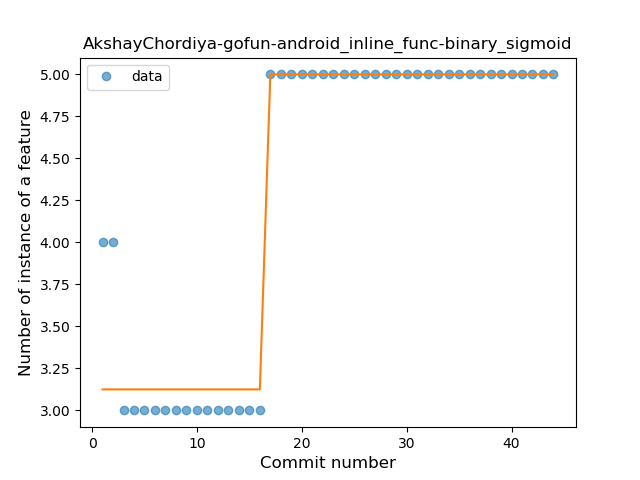
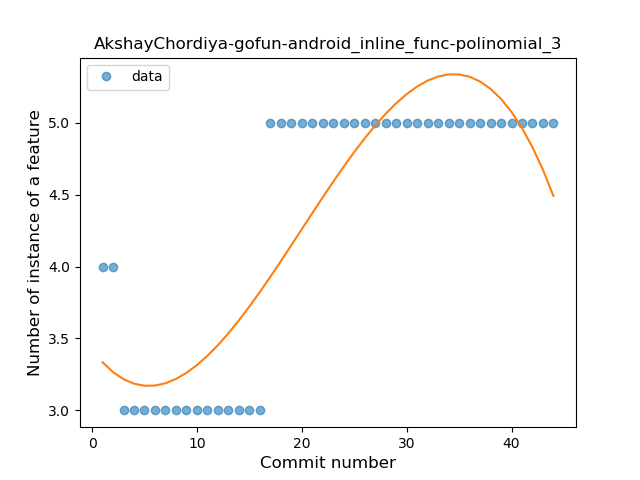
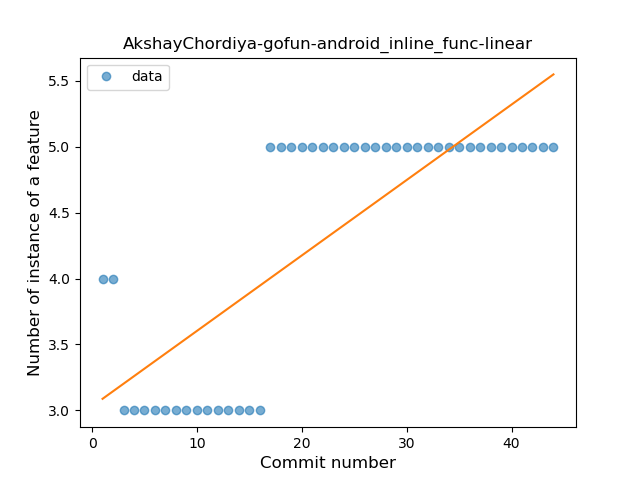
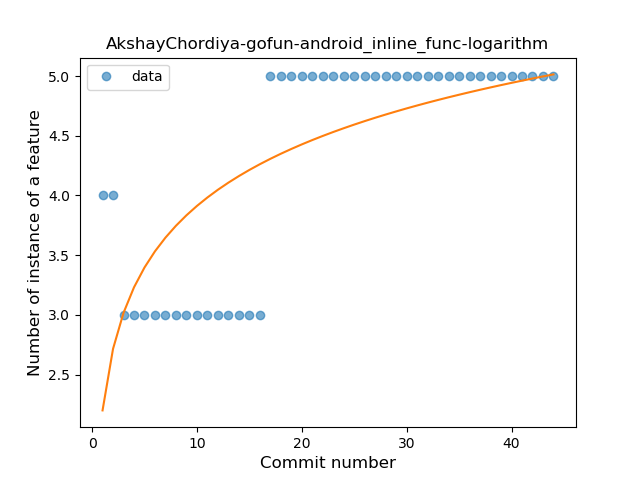
