## AllanWang-Frost-for-Facebook
----
#### Metrics provided by Detekt
* Number of lines of code 11878
* Number of Kotlin files: 123
* Cyclomatic complexity: 1543
* Cyclomatic complexity by thousands of lines: 255 

----
**19** features analyzed

*	<a href="#type_inference">Type Inference</a> 
*	<a href="#lambda">Lambda</a> 
*	<a href="#safe_call">Safe Call</a> 
*	<a href="#when_expr">When expression</a> 
*	<a href="#companion_object">Companion Object</a> 
*	<a href="#unsafe_call">Unsafe Call</a> 
*	<a href="#string_template">String Template</a> 
*	<a href="#func_with_default_value">Function with Default Value</a> 
*	<a href="#singleton">Singleton</a> 
*	<a href="#smart_cast">Smart Cast</a> 
*	<a href="#range_expr">Range Expression</a> 
*	<a href="#func_call_with_named_arg">Function call with Named Argument</a> 
*	<a href="#data_class">Data Class</a> 
*	<a href="#extension_function">Extension Function</a> 
*	<a href="#property_delegation">Property Delegation</a> 
*	<a href="#destructuring_declaration">Destructuring Declaration</a> 
*	<a href="#inline_func">Inline Function</a> 
*	<a href="#overloaded_op">Overloaded Operator</a> 
*	<a href="#super_delegation">Super Delegation</a> 

### <a name="type_inference">Type Inference</a>
----
#### Functions
* **Sudden Rise - Exponential:** 
    * **R_Squared:** 0.97245012
* **Constant Rise - Linear:** 
    * **R_Squared:** 0.94475905
* **Plateau Sudden Rise - Binary Sigmoid:** 
    * **R_Squared:** 0.70742652
* **Sudden Rise Plateau - Logarithm:** 
    * **R_Squared:** 0.44168741

**Plots** :chart_with_upwards_trend:
-----

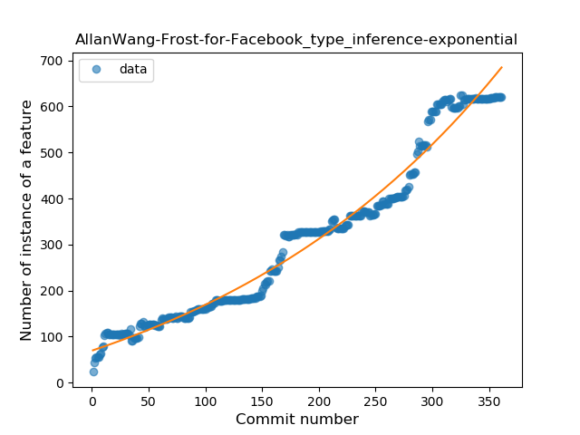
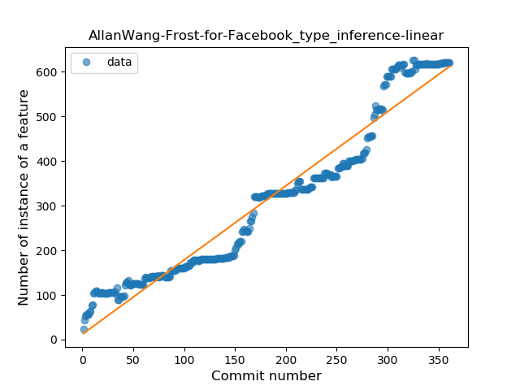
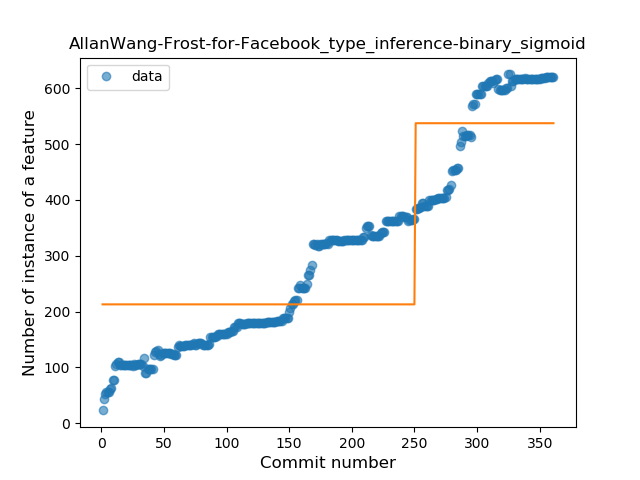
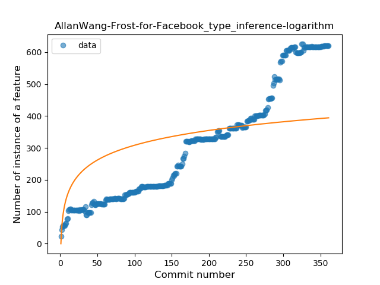
### <a name="lambda">Lambda</a>
----
#### Functions
* **Constant Rise - Linear:** 
    * **R_Squared:** 0.96139769
* **Plateau Sudden Rise - Binary Sigmoid:** 
    * **R_Squared:** 0.71058065
* **Sudden Rise Plateau - Logarithm:** 
    * **R_Squared:** 0.50251843

**Plots** :chart_with_upwards_trend:
-----

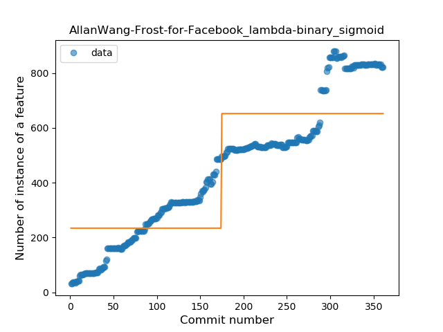
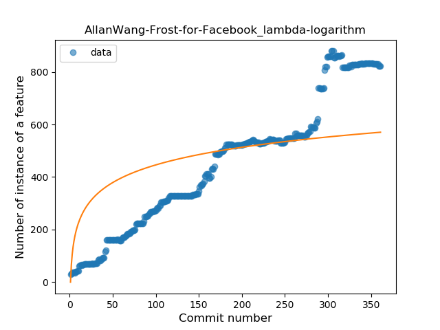
### <a name="safe_call">Safe Call</a>
----
#### Functions
* **Constant Rise - Linear:** 
    * **R_Squared:** 0.94411627
* **Plateau Sudden Rise - Binary Sigmoid:** 
    * **R_Squared:** 0.72976481
* **Sudden Rise Plateau - Logarithm:** 
    * **R_Squared:** 0.56159662

**Plots** :chart_with_upwards_trend:
-----

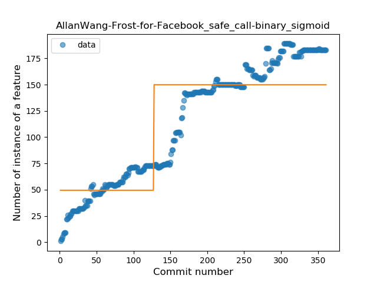
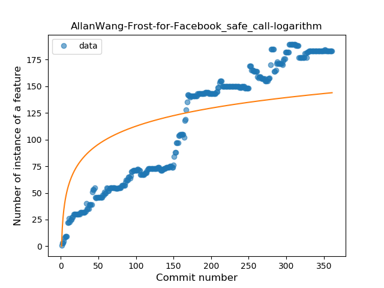
### <a name="when_expr">When expression</a>
----
#### Functions
* **Sudden Rise - Exponential:** 
    * **R_Squared:** 0.77592671
* **Constant Rise - Linear:** 
    * **R_Squared:** 0.74697624
* **Sudden Rise Plateau - Logarithm:** 
    * **R_Squared:** 0.53028047
* **Plateau Sudden Rise - Binary Sigmoid:** 
    * **R_Squared:** 0.02993807

**Plots** :chart_with_upwards_trend:
-----

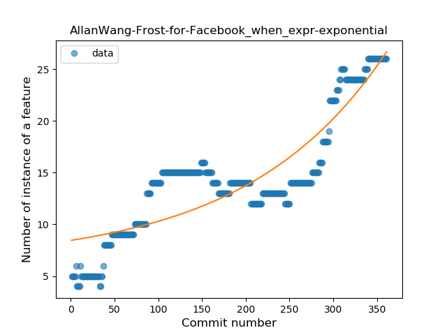

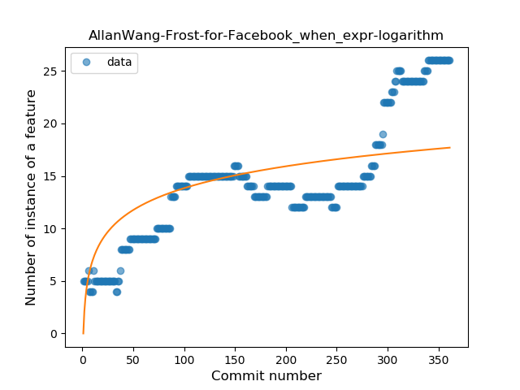
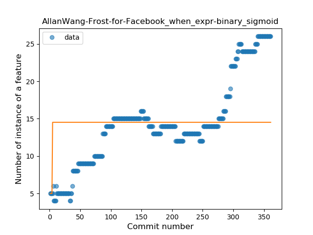
### <a name="companion_object">Companion Object</a>
----
#### Functions
* **Sudden Rise - Exponential:** 
    * **R_Squared:** 0.89893046
* **Constant Rise - Linear:** 
    * **R_Squared:** 0.72849243
* **Sudden Rise Plateau - Logarithm:** 
    * **R_Squared:** 0.37466065
* **Plateau Sudden Rise - Binary Sigmoid:** 
    * **R_Squared:** 0.13064548

**Plots** :chart_with_upwards_trend:
-----

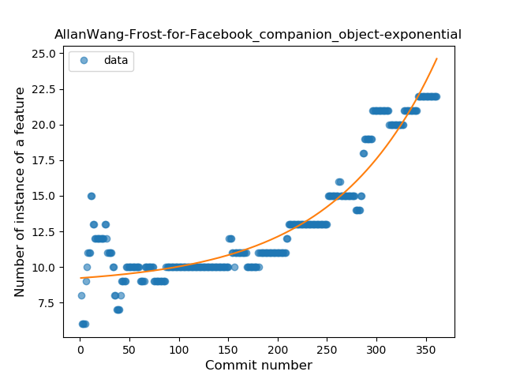
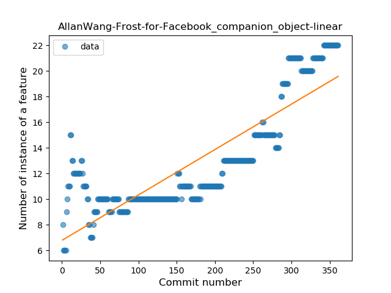
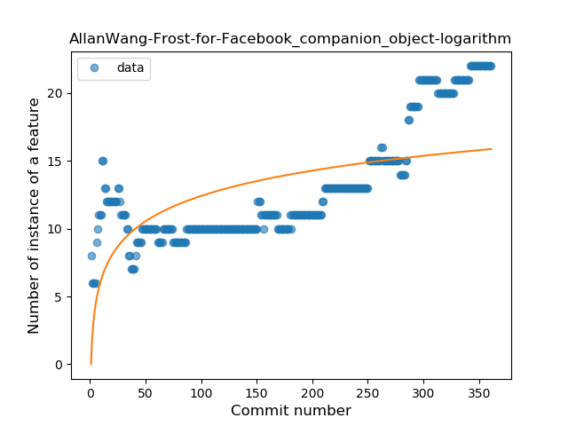
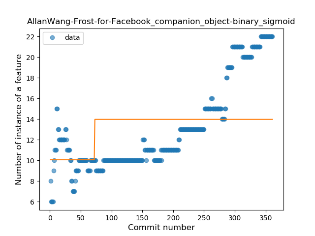
### <a name="unsafe_call">Unsafe Call</a>
----
#### Functions
* **Sudden Rise Plateau - Logarithm:** 
    * **R_Squared:** 0.52332727
* **Constant Rise - Linear:** 
    * **R_Squared:** 0.31209897

**Plots** :chart_with_upwards_trend:
-----

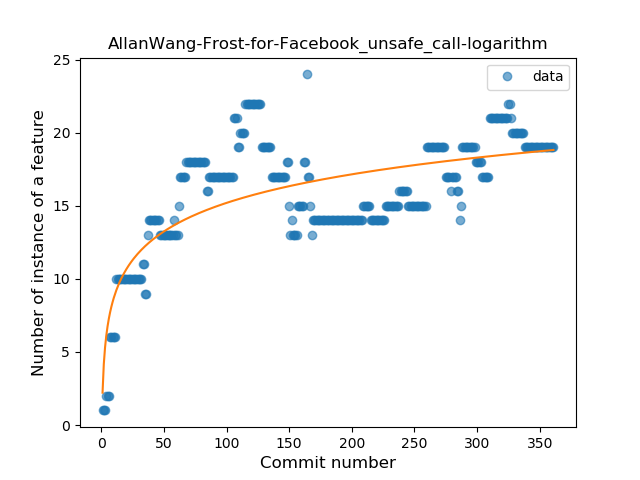
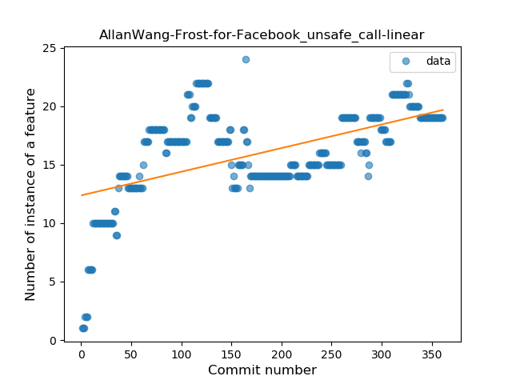
### <a name="string_template">String Template</a>
----
#### Functions
* **Sudden Rise - Exponential:** 
    * **R_Squared:** 0.93818556
* **Constant Rise - Linear:** 
    * **R_Squared:** 0.83603615
* **Sudden Rise Plateau - Logarithm:** 
    * **R_Squared:** 0.37777033
* **Plateau Sudden Rise - Binary Sigmoid:** 
    * **R_Squared:** 0.28082597

**Plots** :chart_with_upwards_trend:
-----

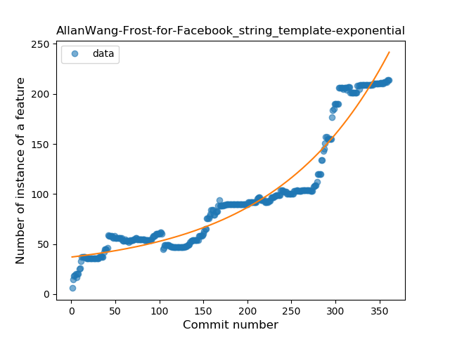
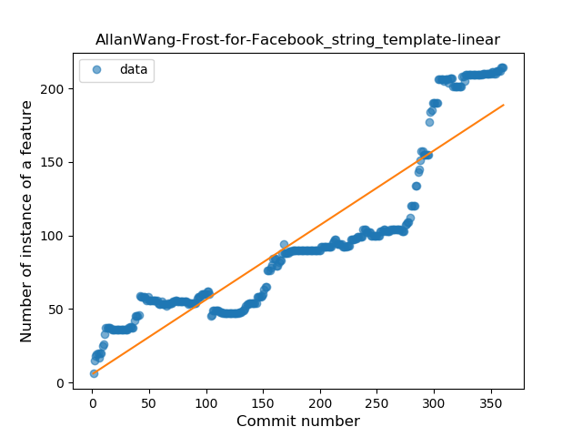
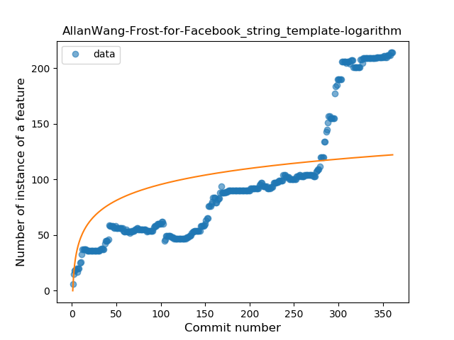
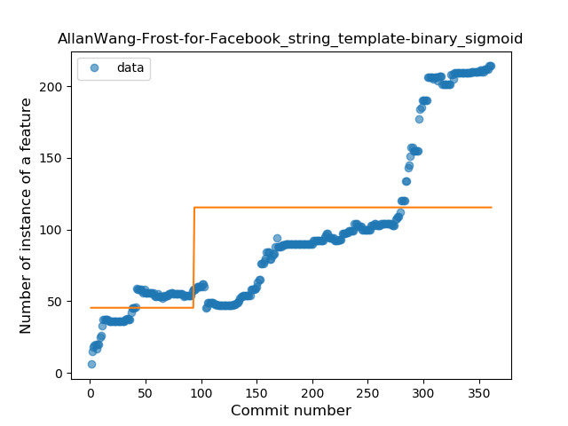
### <a name="func_with_default_value">Function with Default Value</a>
----
#### Functions
* **Sudden Rise - Exponential:** 
    * **R_Squared:** 0.90003718
* **Constant Rise - Linear:** 
    * **R_Squared:** 0.86816722
* **Sudden Rise Plateau - Logarithm:** 
    * **R_Squared:** 0.62129246

**Plots** :chart_with_upwards_trend:
-----

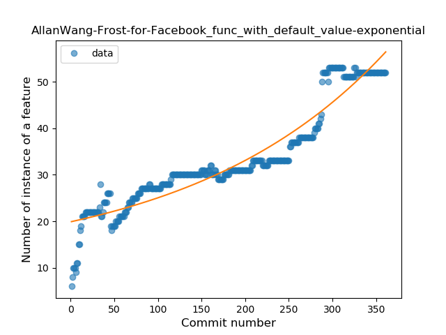
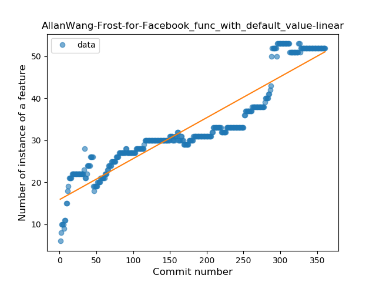

### <a name="singleton">Singleton</a>
----
#### Functions
* **Plateau Gradual Rise - Sigmoid:** 
    * **R_Squared:** 0.83886169
* **Sudden Rise - Exponential:** 
    * **R_Squared:** 0.72667692
* **Constant Rise - Linear:** 
    * **R_Squared:** 0.53706407
* **Sudden Rise Plateau - Logarithm:** 
    * **R_Squared:** 0.22646831

**Plots** :chart_with_upwards_trend:
-----

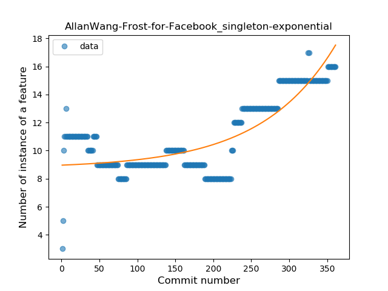
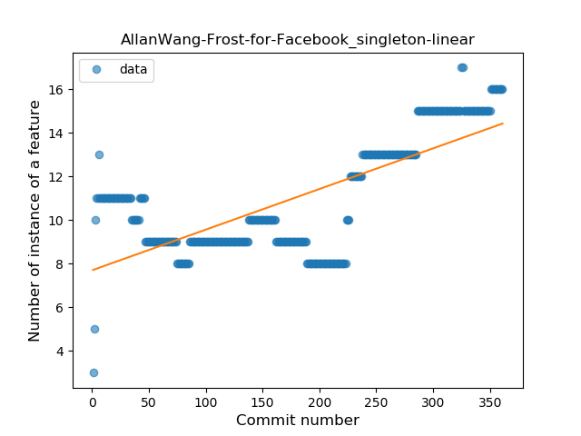
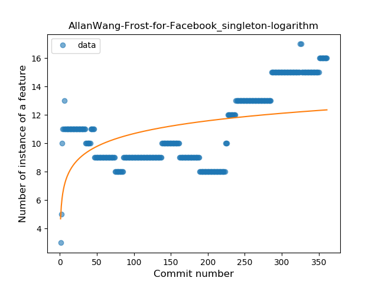
### <a name="smart_cast">Smart Cast</a>
----
#### Functions
* **Sudden Rise - Exponential:** 
    * **R_Squared:** 0.94043219
* **Constant Rise - Linear:** 
    * **R_Squared:** 0.8277115
* **Sudden Rise Plateau - Logarithm:** 
    * **R_Squared:** 0.25238581

**Plots** :chart_with_upwards_trend:
-----

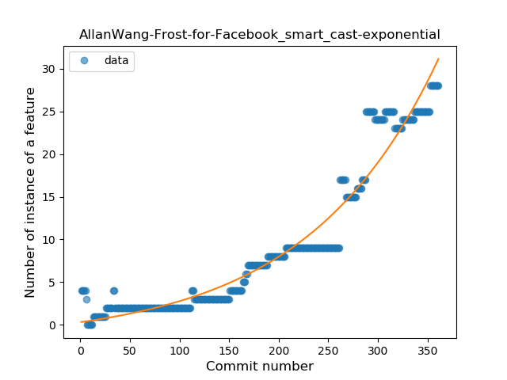
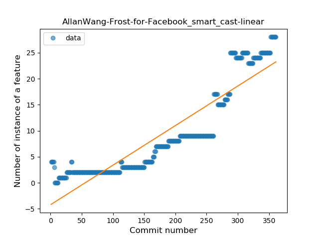
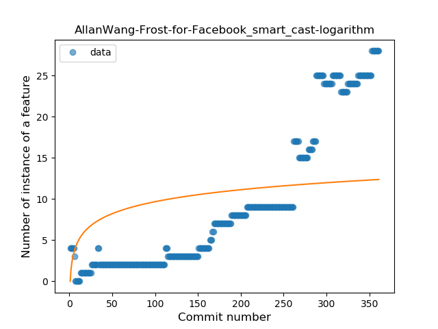
### <a name="range_expr">Range Expression</a>
----
#### Functions
* **Constant Rise - Linear:** 
    * **R_Squared:** 0.88637136
* **Plateau Gradual Rise - Sigmoid:** 
    * **R_Squared:** 0.89584438
* **Sudden Rise Plateau - Logarithm:** 
    * **R_Squared:** 0.57618329

**Plots** :chart_with_upwards_trend:
-----

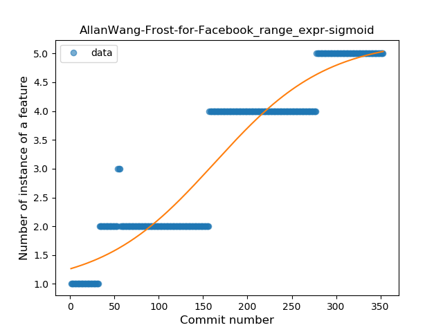
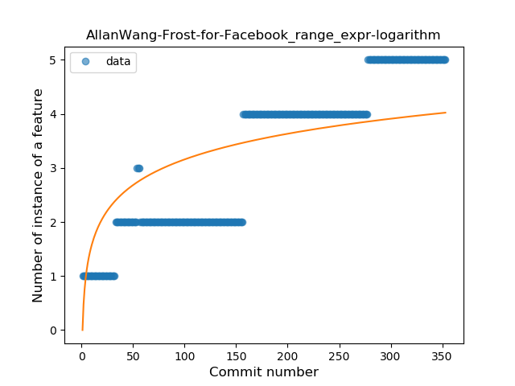
### <a name="func_call_with_named_arg">Function call with Named Argument</a>
----
#### Functions
* **Constant Rise - Linear:** 
    * **R_Squared:** 0.85537861
* **Sudden Rise Plateau - Logarithm:** 
    * **R_Squared:** 0.72438918
* **Plateau Gradual Rise - Sigmoid:** 
    * **R_Squared:** 0.43927197

**Plots** :chart_with_upwards_trend:
-----

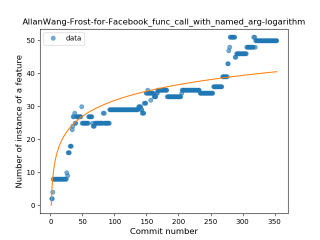
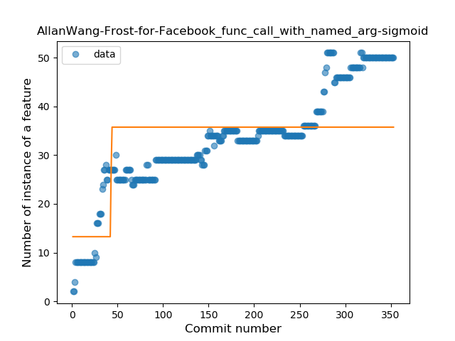
### <a name="data_class">Data Class</a>
----
#### Functions
* **Plateau Gradual Rise - Sigmoid:** 
    * **R_Squared:** 0.97215939
* **Sudden Rise - Exponential:** 
    * **R_Squared:** 0.87311412
* **Constant Rise - Linear:** 
    * **R_Squared:** 0.63419149
* **Sudden Rise Plateau - Logarithm:** 
    * **R_Squared:** 0.21049665

**Plots** :chart_with_upwards_trend:
-----

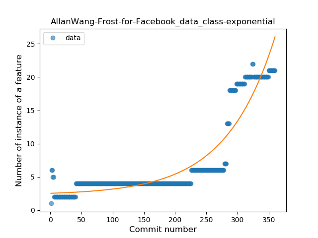
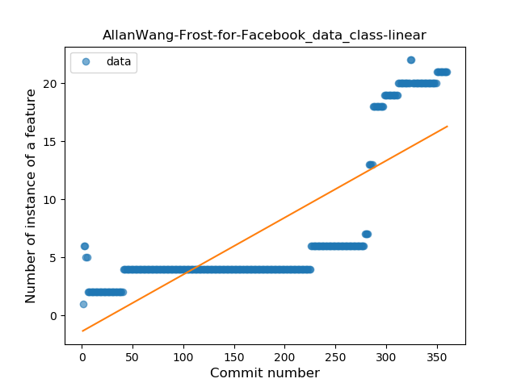
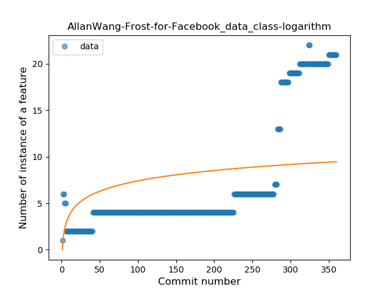
### <a name="extension_function">Extension Function</a>
----
#### Functions
* **Sudden Rise - Exponential:** 
    * **R_Squared:** 0.84758333
* **Constant Rise - Linear:** 
    * **R_Squared:** 0.83064159
* **Sudden Rise Plateau - Logarithm:** 
    * **R_Squared:** 0.39319893

**Plots** :chart_with_upwards_trend:
-----

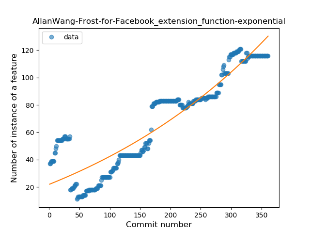
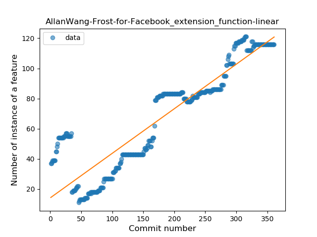
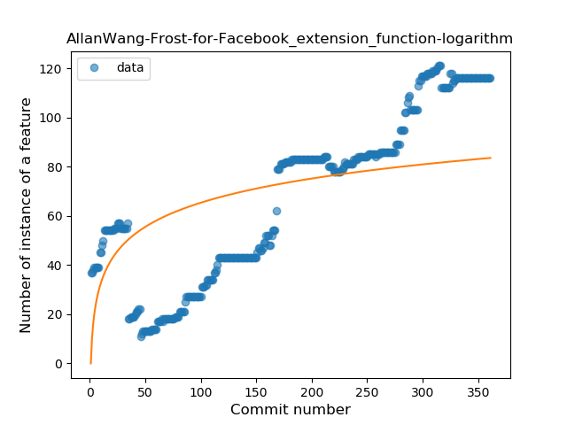
### <a name="property_delegation">Property Delegation</a>
----
#### Functions
* **Constant Rise - Linear:** 
    * **R_Squared:** 0.97133581
* **Plateau Sudden Rise - Binary Sigmoid:** 
    * **R_Squared:** 0.57333809
* **Sudden Rise Plateau - Logarithm:** 
    * **R_Squared:** 0.55731981

**Plots** :chart_with_upwards_trend:
-----

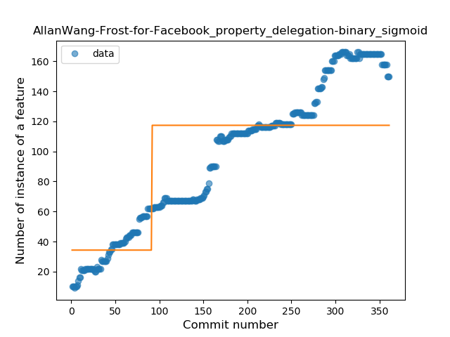

### <a name="destructuring_declaration">Destructuring Declaration</a>
----
#### Functions
* **Constant Rise - Linear:** 
    * **R_Squared:** 0.83060873
* **Sudden Rise Plateau - Logarithm:** 
    * **R_Squared:** 0.74926815

**Plots** :chart_with_upwards_trend:
-----

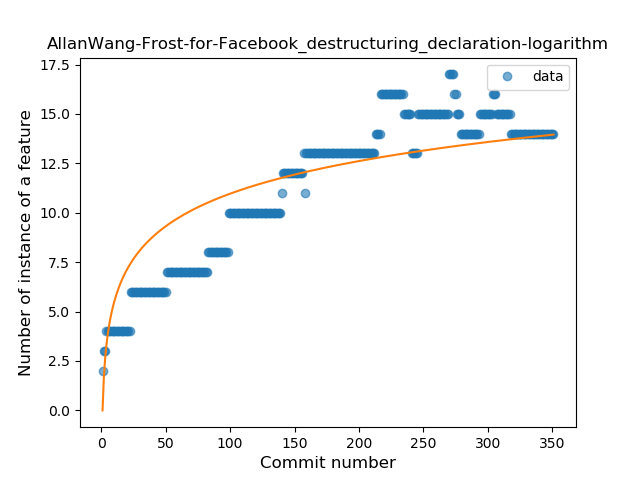
### <a name="inline_func">Inline Function</a>
----
#### Functions
* **Plateau Gradual Rise - Sigmoid:** 
    * **R_Squared:** 0.97922303
* **Sudden Rise - Exponential:** 
    * **R_Squared:** 0.90811106
* **Constant Rise - Linear:** 
    * **R_Squared:** 0.65331884
* **Sudden Rise Plateau - Logarithm:** 
    * **R_Squared:** 0.15380598

**Plots** :chart_with_upwards_trend:
-----

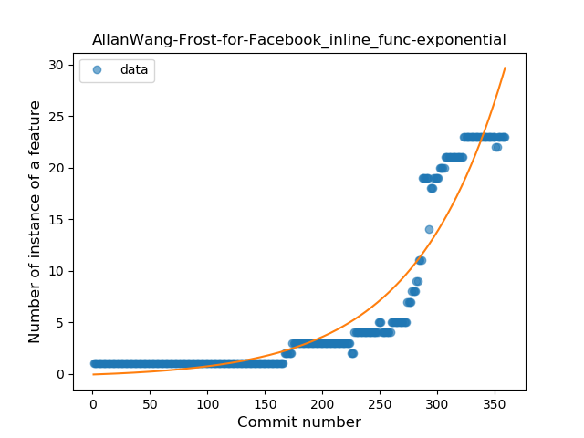

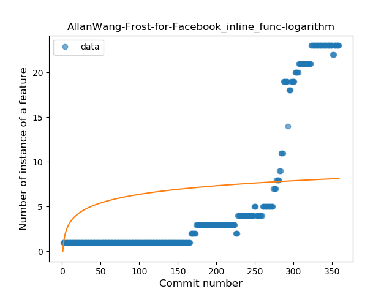
### <a name="overloaded_op">Overloaded Operator</a>
----
#### Functions
* **Sudden Rise - Exponential:** 
    * **R_Squared:** 0.88733434
* **Constant Rise - Linear:** 
    * **R_Squared:** 0.81108289
* **Sudden Rise Plateau - Logarithm:** 
    * **R_Squared:** 0.42937487

**Plots** :chart_with_upwards_trend:
-----

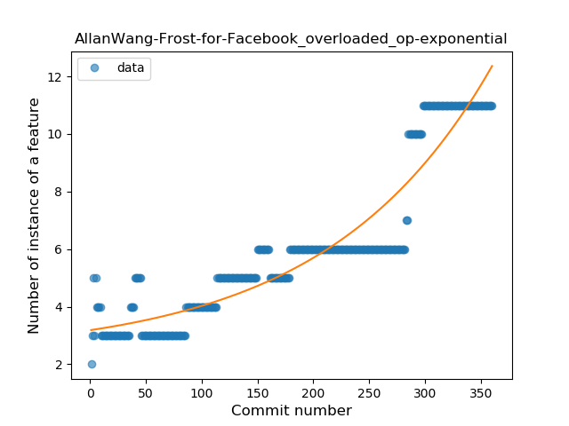
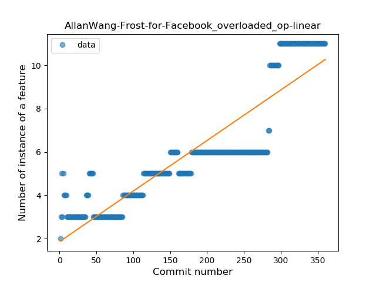
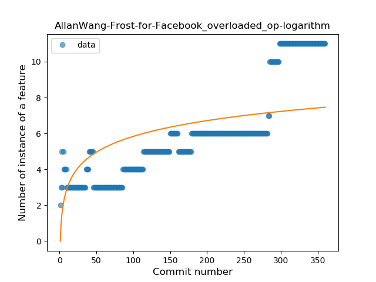
### <a name="super_delegation">Super Delegation</a>
----
#### Functions
* **Plateau Gradual Rise - Sigmoid:** 
    * **R_Squared:** 0.87755065
* **Constant Rise - Linear:** 
    * **R_Squared:** 0.65843819
* **Sudden Rise Plateau - Logarithm:** 
    * **R_Squared:** 0.63041493

**Plots** :chart_with_upwards_trend:
-----

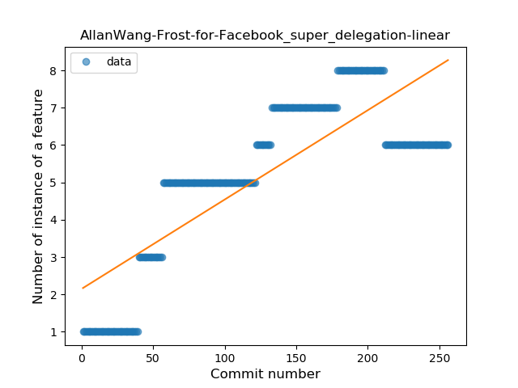
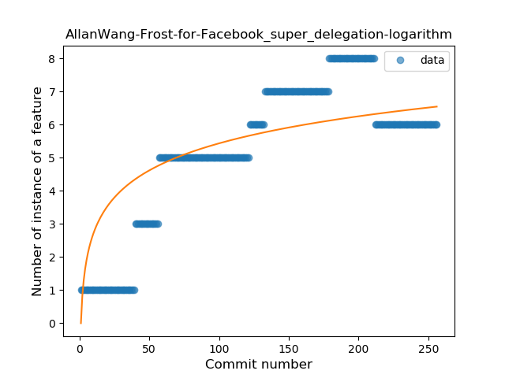
