## Apolline-Lille-apolline-android
----
#### Metrics provided by Detekt
* Number of lines of code 4650
* Number of Kotlin files: 44
* Cyclomatic complexity: 541
* Cyclomatic complexity by thousands of lines: 231 

----
**14** features analyzed

*	<a href="#type_inference">Type Inference</a> 
*	<a href="#lambda">Lambda</a> 
*	<a href="#safe_call">Safe Call</a> 
*	<a href="#when_expr">When expression</a> 
*	<a href="#companion_object">Companion Object</a> 
*	<a href="#unsafe_call">Unsafe Call</a> 
*	<a href="#string_template">String Template</a> 
*	<a href="#singleton">Singleton</a> 
*	<a href="#smart_cast">Smart Cast</a> 
*	<a href="#range_expr">Range Expression</a> 
*	<a href="#func_call_with_named_arg">Function call with Named Argument</a> 
*	<a href="#data_class">Data Class</a> 
*	<a href="#property_delegation">Property Delegation</a> 
*	<a href="#destructuring_declaration">Destructuring Declaration</a> 

### <a name="type_inference">Type Inference</a>
----
#### Functions
* **Sudden Rise - Exponential:** 
    * **R_Squared:** 0.92128715
* **Constant Rise - Linear:** 
    * **R_Squared:** 0.85270019
* **Sudden Rise Plateau - Logarithm:** 
    * **R_Squared:** 0.35421523

**Plots** :chart_with_upwards_trend:
-----

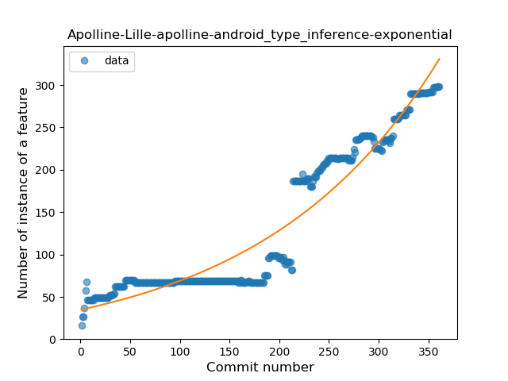
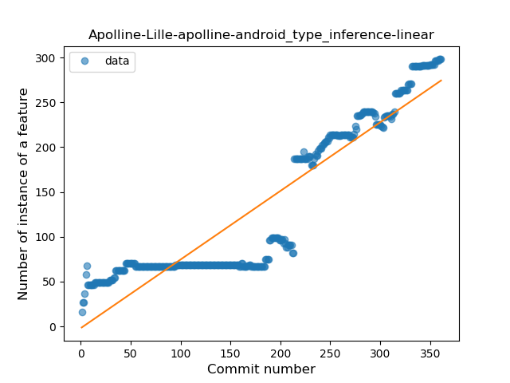
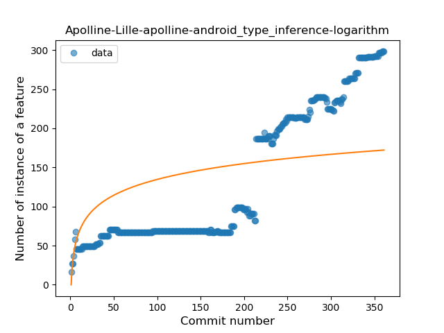
### <a name="lambda">Lambda</a>
----
#### Functions
* **Sudden Rise - Exponential:** 
    * **R_Squared:** 0.98251516
* **Constant Rise - Linear:** 
    * **R_Squared:** 0.71216427
* **Sudden Rise Plateau - Logarithm:** 
    * **R_Squared:** 0.15210628

**Plots** :chart_with_upwards_trend:
-----

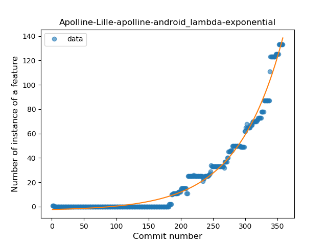
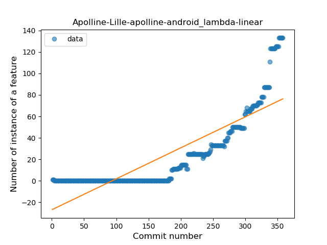
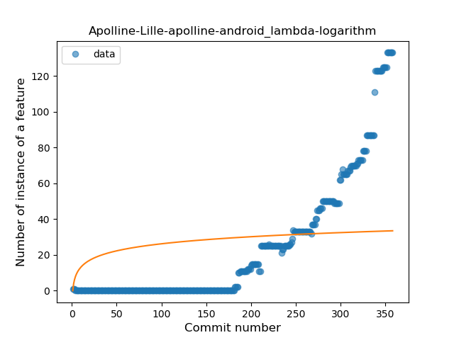
### <a name="safe_call">Safe Call</a>
----
#### Functions
* **Constant Rise - Linear:** 
    * **R_Squared:** 0.82266165
* **Sudden Rise Plateau - Logarithm:** 
    * **R_Squared:** 0.6503251

**Plots** :chart_with_upwards_trend:
-----

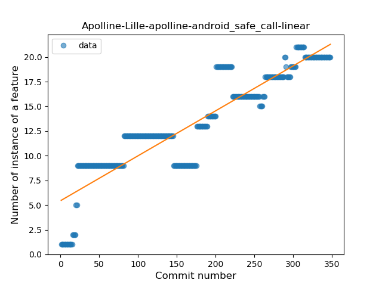
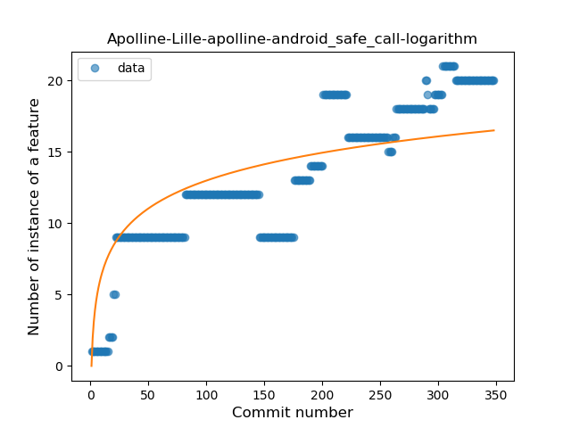
### <a name="when_expr">When expression</a>
----
#### Functions
* **Plateau Gradual Rise - Sigmoid:** 
    * **R_Squared:** 0.9832174
* **Sudden Rise - Exponential:** 
    * **R_Squared:** 0.88524033
* **Constant Rise - Linear:** 
    * **R_Squared:** 0.6707779
* **Sudden Rise Plateau - Logarithm:** 
    * **R_Squared:** 0.24547013

**Plots** :chart_with_upwards_trend:
-----

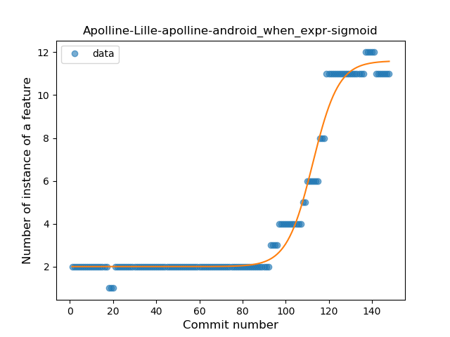
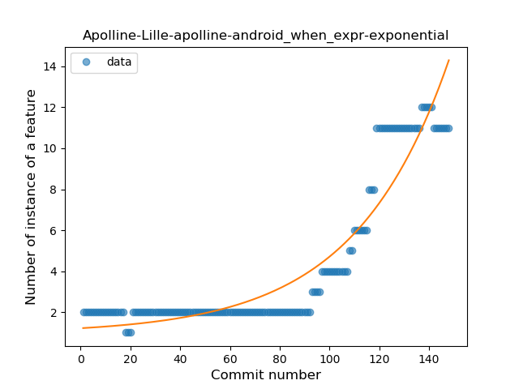
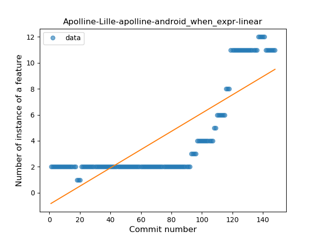
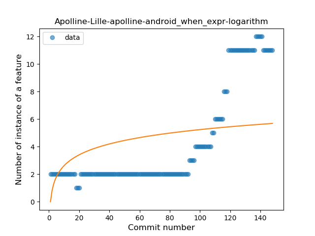
### <a name="companion_object">Companion Object</a>
----
#### Functions
* **Plateau Gradual Rise - Sigmoid:** 
    * **R_Squared:** 0.97677106
* **Sudden Rise - Exponential:** 
    * **R_Squared:** 0.9481881
* **Constant Rise - Linear:** 
    * **R_Squared:** 0.74001954
* **Sudden Rise Plateau - Logarithm:** 
    * **R_Squared:** 0.21158643

**Plots** :chart_with_upwards_trend:
-----

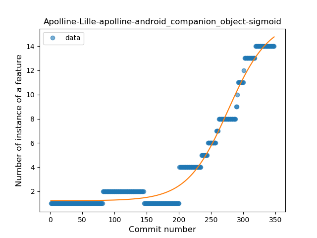

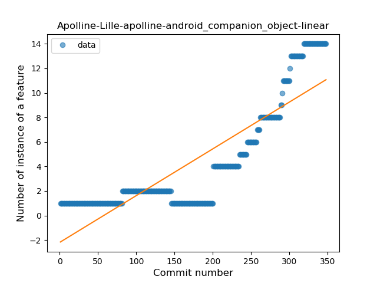
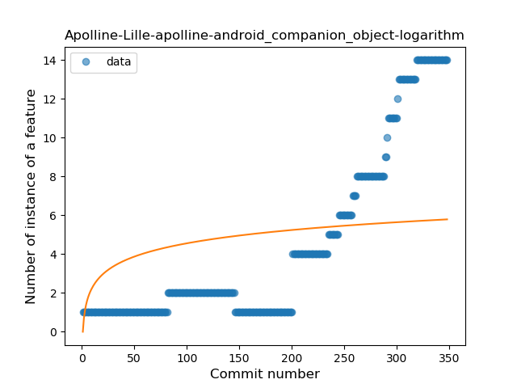
### <a name="unsafe_call">Unsafe Call</a>
----
#### Functions
* **Plateau Gradual Rise - Sigmoid:** 
    * **R_Squared:** 0.90426012
* **Sudden Rise - Exponential:** 
    * **R_Squared:** 0.66778145
* **Constant Rise - Linear:** 
    * **R_Squared:** 0.65227022
* **Sudden Rise Plateau - Logarithm:** 
    * **R_Squared:** 0.22679322

**Plots** :chart_with_upwards_trend:
-----

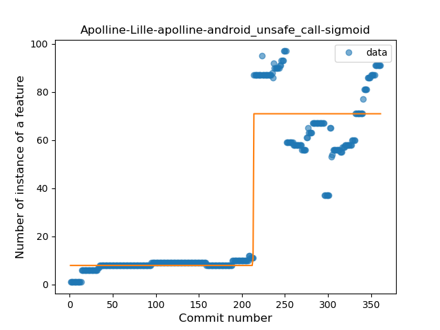
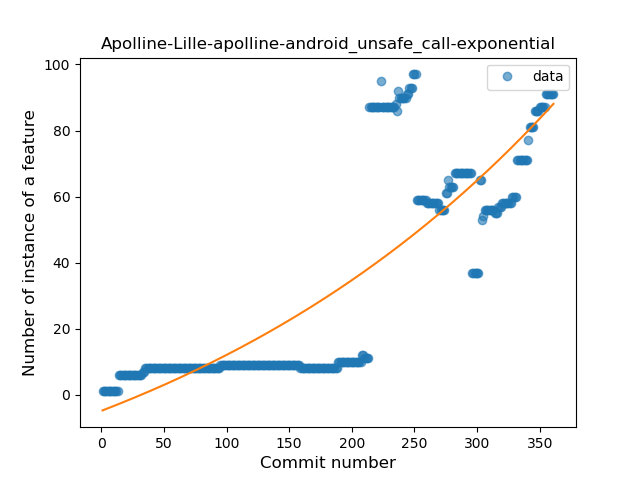
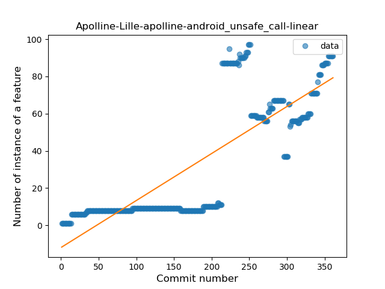
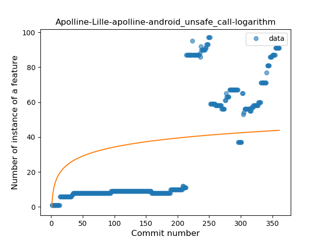
### <a name="string_template">String Template</a>
----
#### Functions
* **Sudden Rise - Exponential:** 
    * **R_Squared:** 0.88016613
* **Constant Rise - Linear:** 
    * **R_Squared:** 0.70106101
* **Sudden Rise Plateau - Logarithm:** 
    * **R_Squared:** 0.28932577

**Plots** :chart_with_upwards_trend:
-----

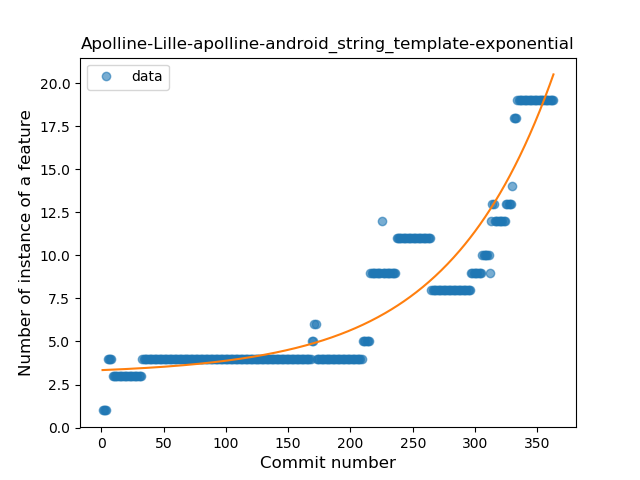
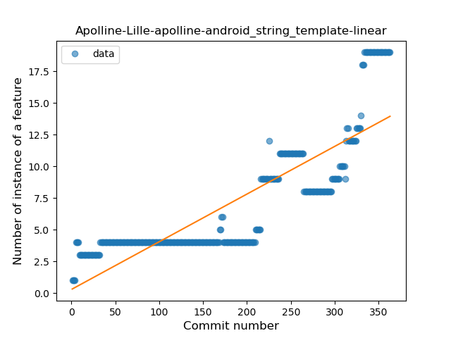
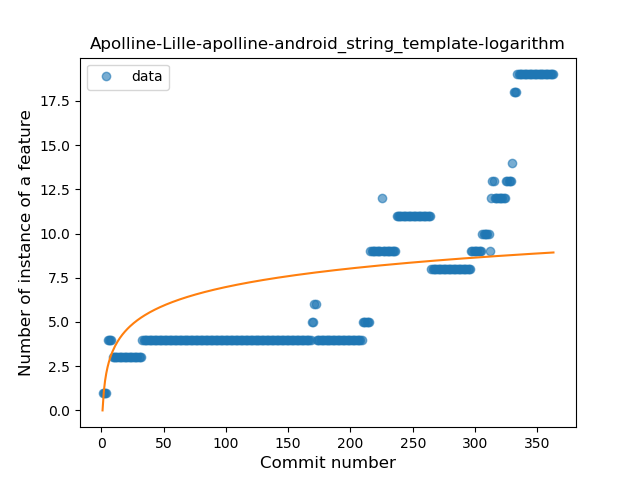
### <a name="singleton">Singleton</a>
----
#### Functions
* **Plateau Gradual Rise - Sigmoid:** 
    * **R_Squared:** 0.88857693
* **Constant Rise - Linear:** 
    * **R_Squared:** 0.72525371
* **Sudden Rise - Exponential:** 
    * **R_Squared:** 0.73268632
* **Sudden Rise Plateau - Logarithm:** 
    * **R_Squared:** 0.51240811

**Plots** :chart_with_upwards_trend:
-----

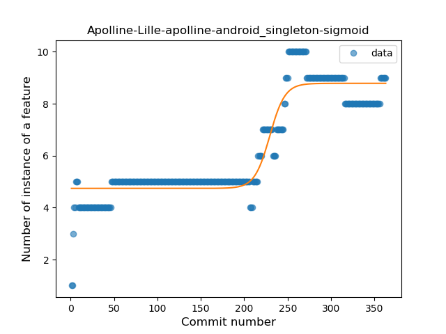
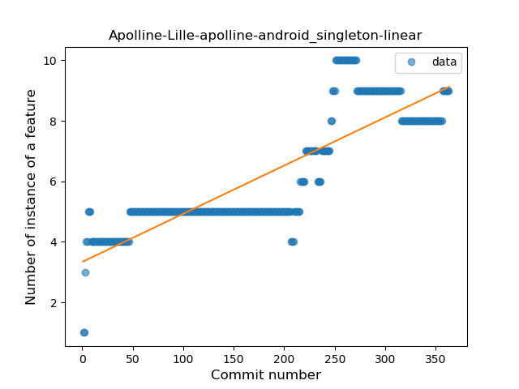
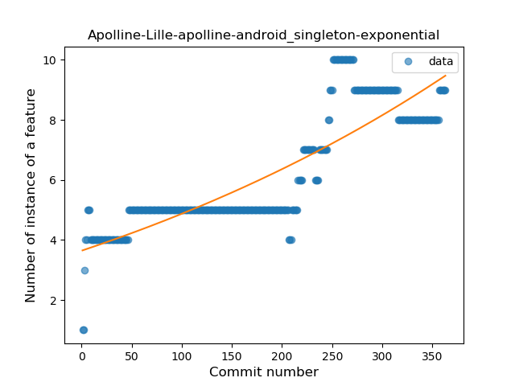
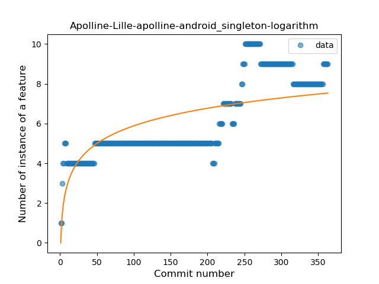
### <a name="smart_cast">Smart Cast</a>
----
#### Functions
* **Plateau Sudden Rise - Binary Sigmoid:** 
    * **R_Squared:** 1.0
* **Instability - Polinomial 3:** )
    * **R_Squared:** 0.85895903
* **Constant Rise - Linear:** 
    * **R_Squared:** 0.74933095
* **Sudden Rise Plateau - Logarithm:** 
    * **R_Squared:** 0.5544395

**Plots** :chart_with_upwards_trend:
-----

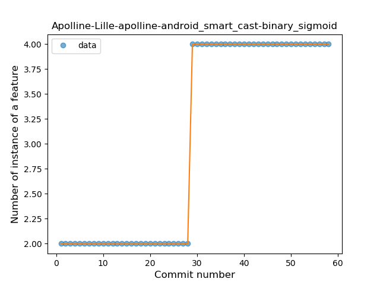
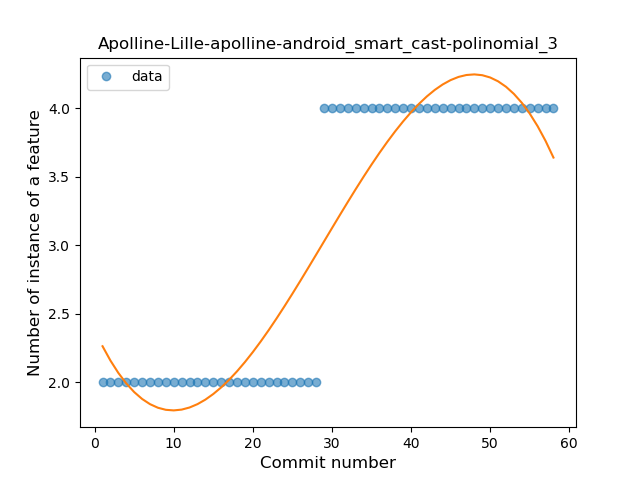
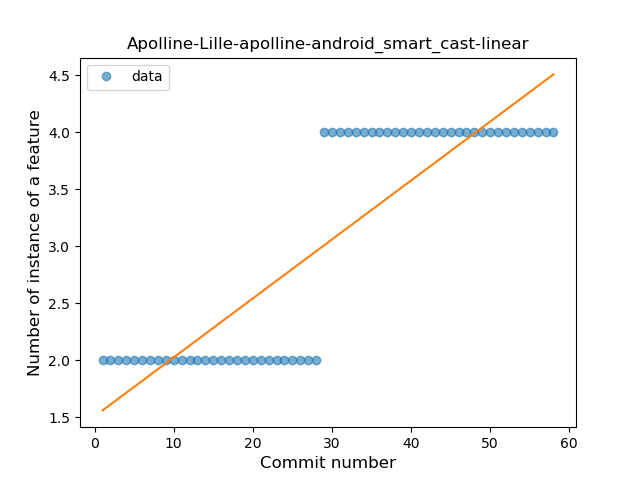
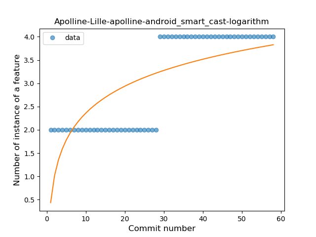
### <a name="range_expr">Range Expression</a>
----
#### Functions
* **Constant Rise - Linear:** 
    * **R_Squared:** 0.60503065
* **Sudden Rise Plateau - Logarithm:** 
    * **R_Squared:** 0.61213536

**Plots** :chart_with_upwards_trend:
-----

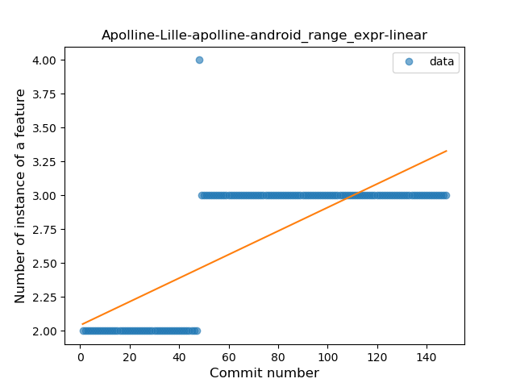
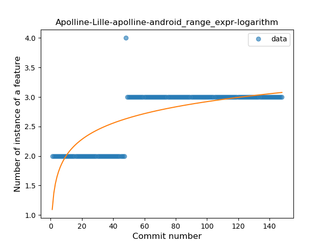
### <a name="func_call_with_named_arg">Function call with Named Argument</a>
----
#### Functions
* **Plateau Gradual Rise - Sigmoid:** 
    * **R_Squared:** 0.95712715
* **Sudden Rise - Exponential:** 
    * **R_Squared:** 0.93204496
* **Constant Rise - Linear:** 
    * **R_Squared:** 0.91236193
* **Sudden Rise Plateau - Logarithm:** 
    * **R_Squared:** 0.65067141

**Plots** :chart_with_upwards_trend:
-----

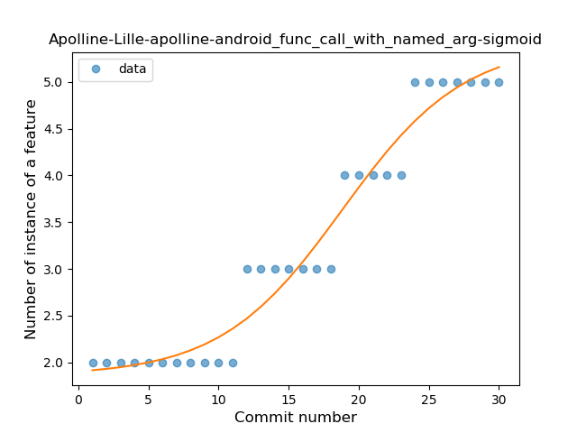
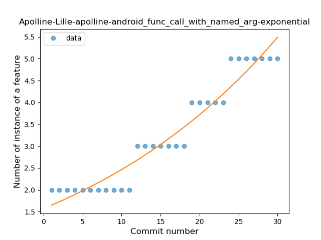
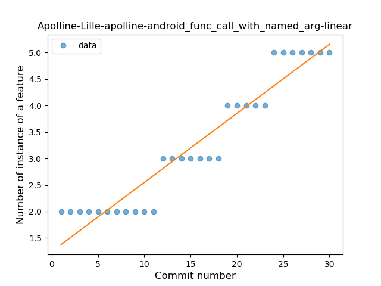
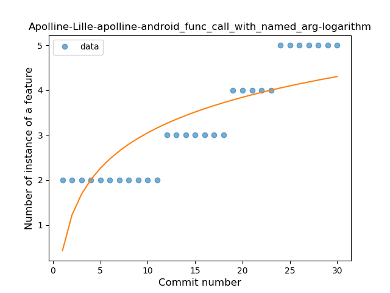
### <a name="data_class">Data Class</a>
----
#### Functions
* **Plateau Sudden Rise - Binary Sigmoid:** 
    * **R_Squared:** 0.73695652
* **Sudden Rise Plateau - Logarithm:** 
    * **R_Squared:** 0.43590451
* **Constant Rise - Linear:** 
    * **R_Squared:** 0.13758582

**Plots** :chart_with_upwards_trend:
-----

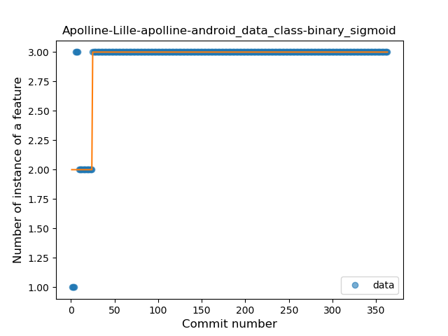
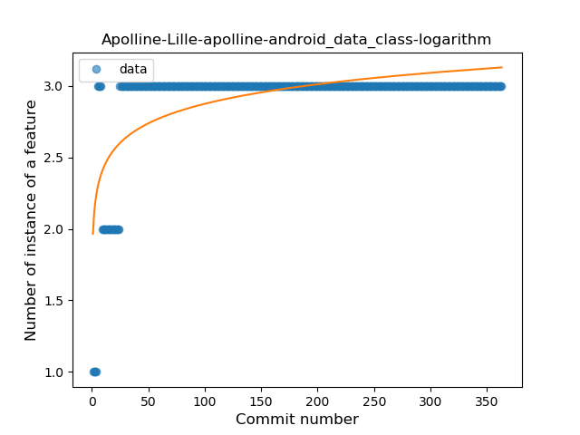
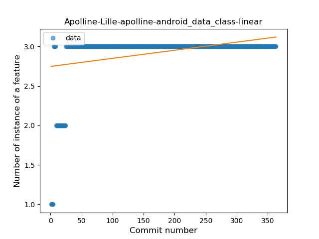
### <a name="property_delegation">Property Delegation</a>
----
#### Functions
* **Constant Rise - Linear:** 
    * **R_Squared:** 0.91923929
* **Plateau Gradual Rise - Sigmoid:** 
    * **R_Squared:** 0.9192471
* **Sudden Rise Plateau - Logarithm:** 
    * **R_Squared:** 0.75390636

**Plots** :chart_with_upwards_trend:
-----

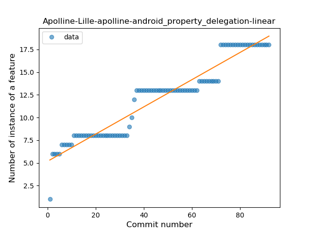

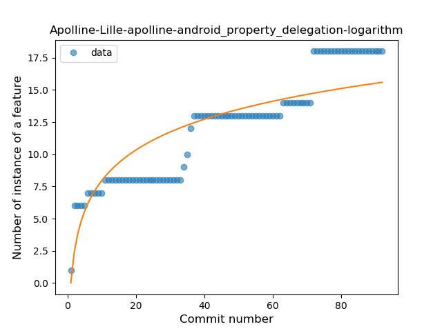
### <a name="destructuring_declaration">Destructuring Declaration</a>
----
#### Functions
* **Plateau Sudden Decline - Binary Sigmoid:** 
    * **R_Squared:** 1.0
* **Sudden Decline - Exponential:** 
    * **R_Squared:** 0.81478145
* **Constant Decline - Linear:** 
    * **R_Squared:** 0.04903315
* **Sudden Rise Plateau - Logarithm:** 
    * **R_Squared:** -0.0

**Plots** :chart_with_upwards_trend:
-----

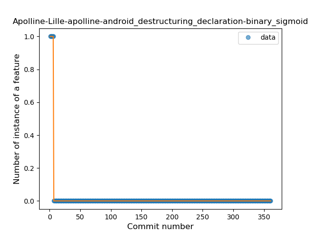

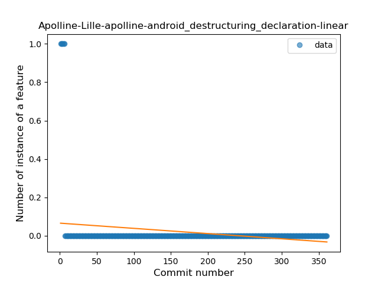
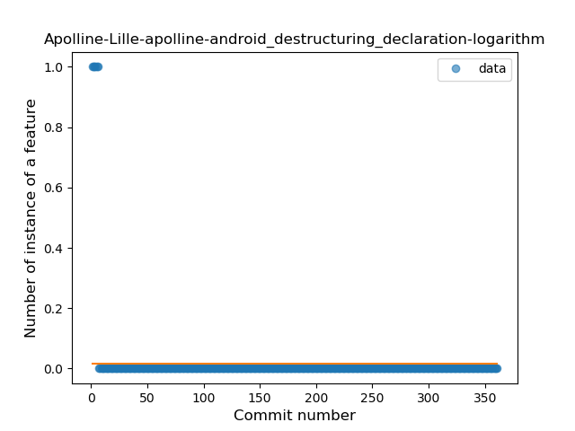
