## BijoySingh-Material-Notes-Android-App
----
#### Metrics provided by Detekt
* Number of lines of code 14648
* Number of Kotlin files: 187
* Cyclomatic complexity: 2147
* Cyclomatic complexity by thousands of lines: 252 

----
**15** features analyzed

*	<a href="#type_inference">Type Inference</a> 
*	<a href="#lambda">Lambda</a> 
*	<a href="#safe_call">Safe Call</a> 
*	<a href="#when_expr">When expression</a> 
*	<a href="#companion_object">Companion Object</a> 
*	<a href="#unsafe_call">Unsafe Call</a> 
*	<a href="#string_template">String Template</a> 
*	<a href="#func_with_default_value">Function with Default Value</a> 
*	<a href="#singleton">Singleton</a> 
*	<a href="#smart_cast">Smart Cast</a> 
*	<a href="#range_expr">Range Expression</a> 
*	<a href="#func_call_with_named_arg">Function call with Named Argument</a> 
*	<a href="#data_class">Data Class</a> 
*	<a href="#extension_function">Extension Function</a> 
*	<a href="#property_delegation">Property Delegation</a> 

### <a name="type_inference">Type Inference</a>
----
#### Functions
* **Constant Rise - Linear:** 
    * **R_Squared:** 0.98816268
* **Plateau Sudden Rise - Binary Sigmoid:** 
    * **R_Squared:** 0.74770838
* **Sudden Rise Plateau - Logarithm:** 
    * **R_Squared:** 0.50517284

**Plots** :chart_with_upwards_trend:
-----

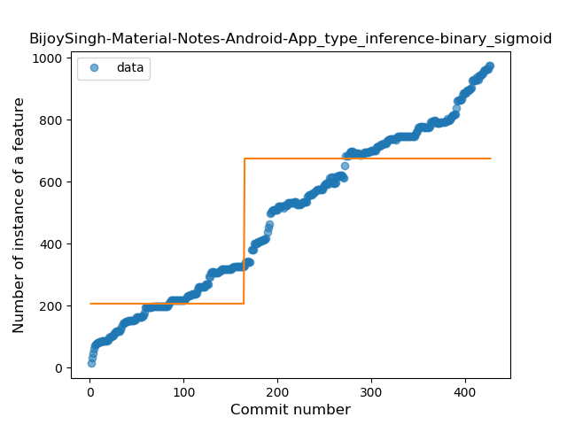
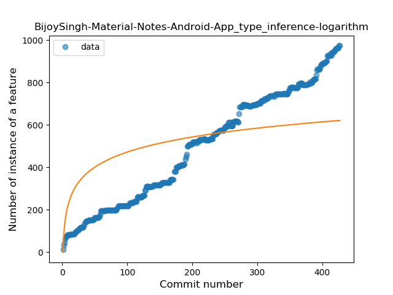
### <a name="lambda">Lambda</a>
----
#### Functions
* **Sudden Rise - Exponential:** 
    * **R_Squared:** 0.96468819
* **Constant Rise - Linear:** 
    * **R_Squared:** 0.95305427
* **Plateau Sudden Rise - Binary Sigmoid:** 
    * **R_Squared:** 0.60238062
* **Sudden Rise Plateau - Logarithm:** 
    * **R_Squared:** 0.44612321

**Plots** :chart_with_upwards_trend:
-----

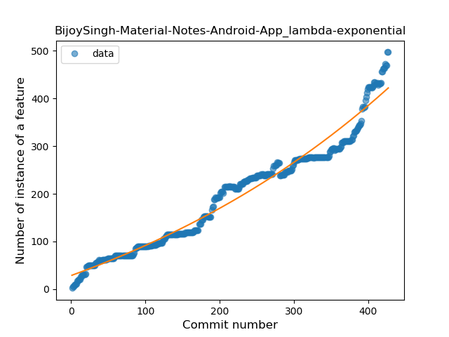
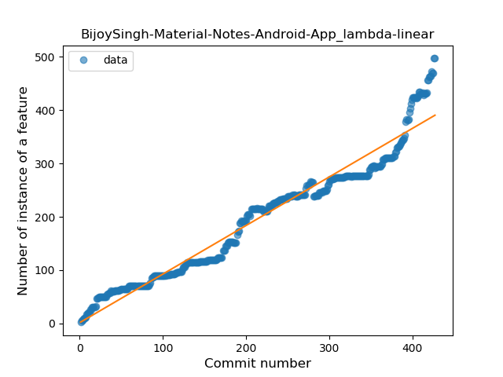
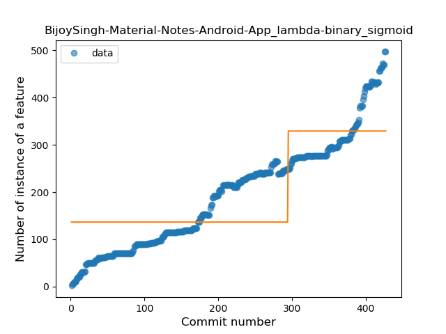
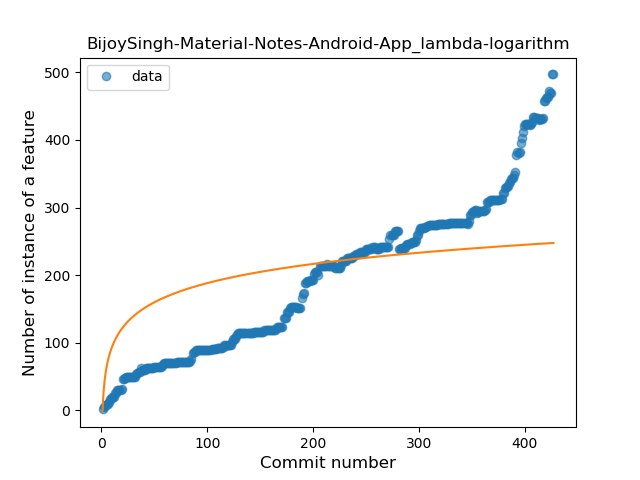
### <a name="safe_call">Safe Call</a>
----
#### Functions
* **Sudden Rise - Exponential:** 
    * **R_Squared:** 0.97056948
* **Plateau Gradual Rise - Sigmoid:** 
    * **R_Squared:** 0.9784681
* **Constant Rise - Linear:** 
    * **R_Squared:** 0.86622058
* **Sudden Rise Plateau - Logarithm:** 
    * **R_Squared:** 0.23053545

**Plots** :chart_with_upwards_trend:
-----

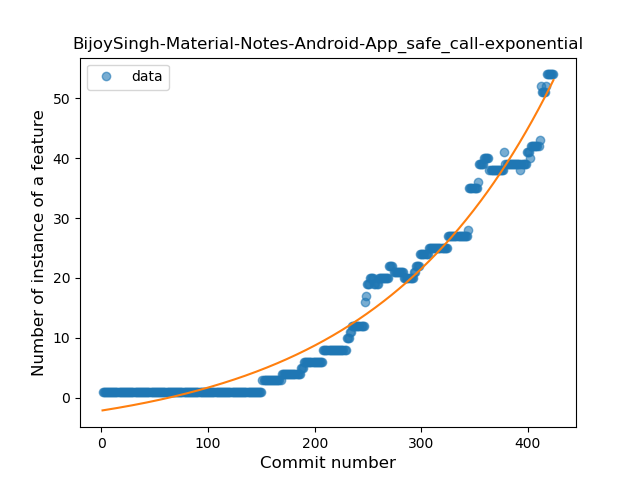
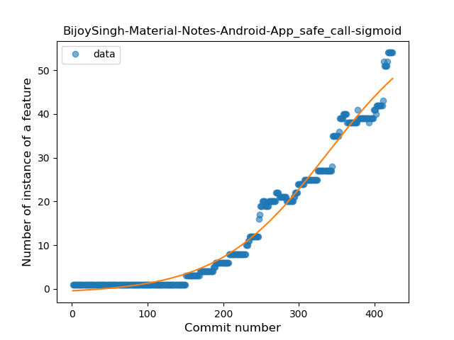
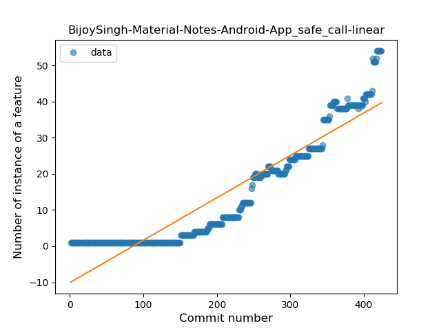
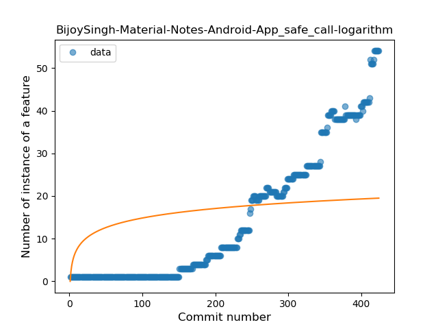
### <a name="when_expr">When expression</a>
----
#### Functions
* **Sudden Rise - Exponential:** 
    * **R_Squared:** 0.96480429
* **Constant Rise - Linear:** 
    * **R_Squared:** 0.94015829
* **Sudden Rise Plateau - Logarithm:** 
    * **R_Squared:** 0.32680049

**Plots** :chart_with_upwards_trend:
-----

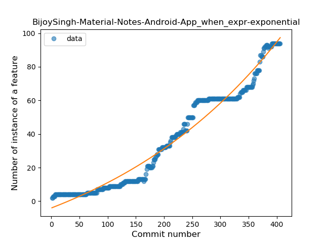

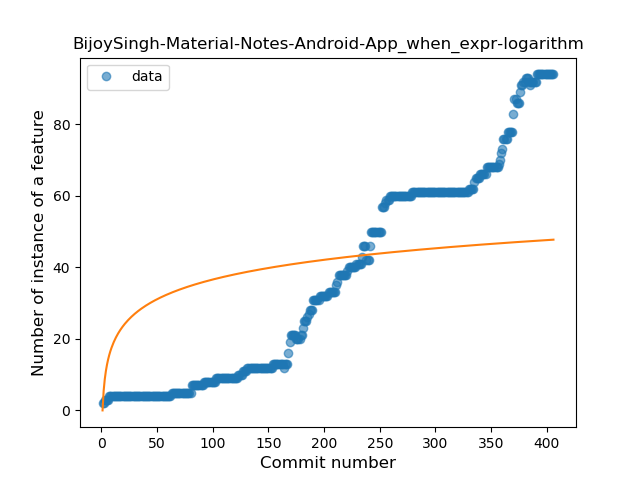
### <a name="companion_object">Companion Object</a>
----
#### Functions
* **Constant Rise - Linear:** 
    * **R_Squared:** 0.93326315
* **Sudden Rise Plateau - Logarithm:** 
    * **R_Squared:** 0.64032345
* **Plateau Gradual Rise - Sigmoid:** 
    * **R_Squared:** 0.25351963

**Plots** :chart_with_upwards_trend:
-----

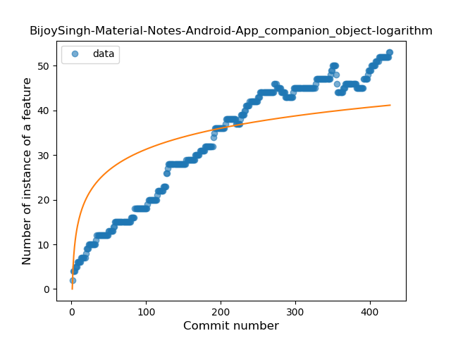
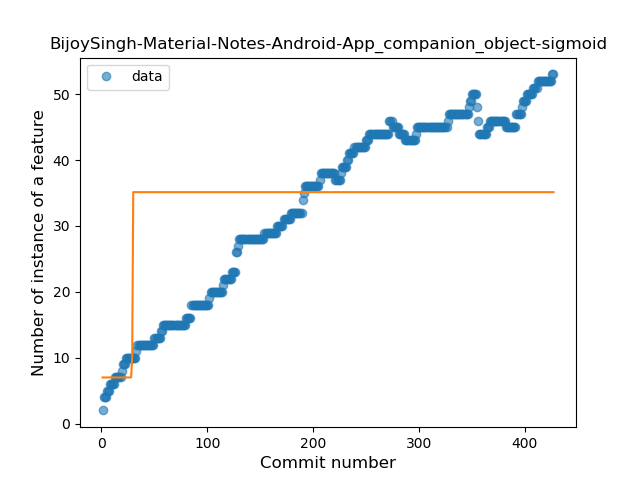
### <a name="unsafe_call">Unsafe Call</a>
----
#### Functions
* **Constant Rise - Linear:** 
    * **R_Squared:** 0.89371914
* **Plateau Gradual Rise - Sigmoid:** 
    * **R_Squared:** 0.45299253
* **Sudden Rise Plateau - Logarithm:** 
    * **R_Squared:** 0.42116681

**Plots** :chart_with_upwards_trend:
-----

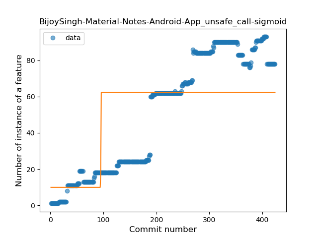

### <a name="string_template">String Template</a>
----
#### Functions
* **Plateau Gradual Rise - Sigmoid:** 
    * **R_Squared:** 0.89706298
* **Constant Rise - Linear:** 
    * **R_Squared:** 0.8382022
* **Sudden Rise Plateau - Logarithm:** 
    * **R_Squared:** 0.44190527

**Plots** :chart_with_upwards_trend:
-----

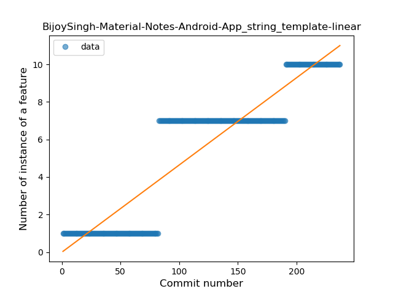
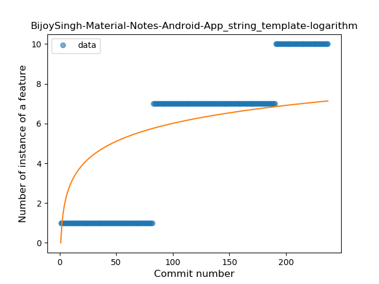
### <a name="func_with_default_value">Function with Default Value</a>
----
#### Functions
* **Sudden Rise - Exponential:** 
    * **R_Squared:** 0.95660024
* **Constant Rise - Linear:** 
    * **R_Squared:** 0.89149468
* **Sudden Rise Plateau - Logarithm:** 
    * **R_Squared:** 0.30137496

**Plots** :chart_with_upwards_trend:
-----

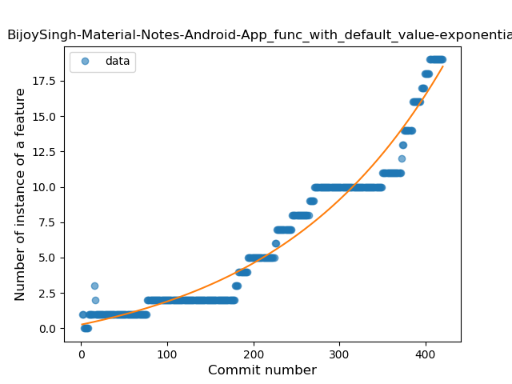
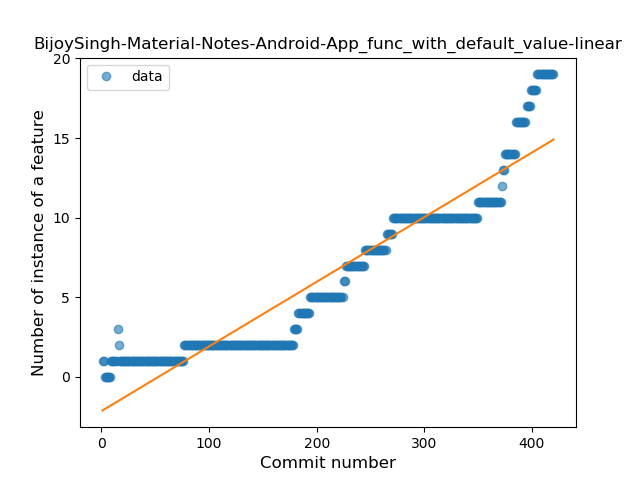
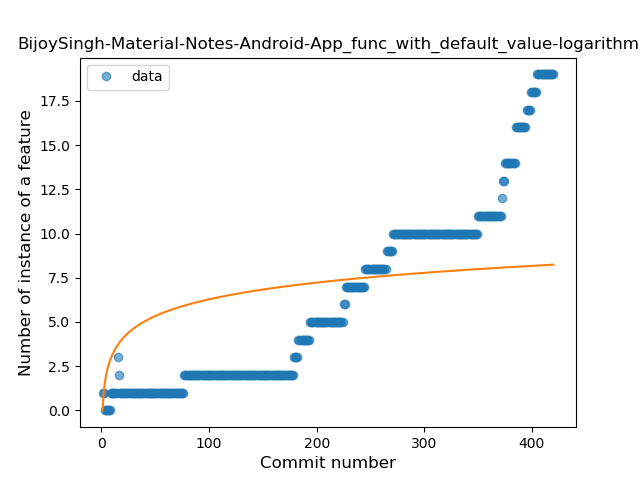
### <a name="singleton">Singleton</a>
----
#### Functions
* **Plateau Sudden Rise - Binary Sigmoid:** 
    * **R_Squared:** 1.0
* **Sudden Rise - Exponential:** 
    * **R_Squared:** 0.77212421
* **Constant Rise - Linear:** 
    * **R_Squared:** 0.55434783
* **Sudden Rise Plateau - Logarithm:** 
    * **R_Squared:** 0.28348059

**Plots** :chart_with_upwards_trend:
-----

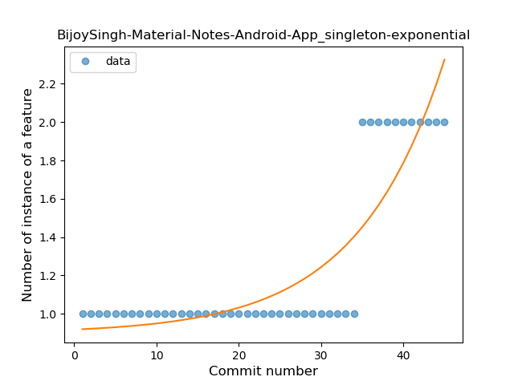
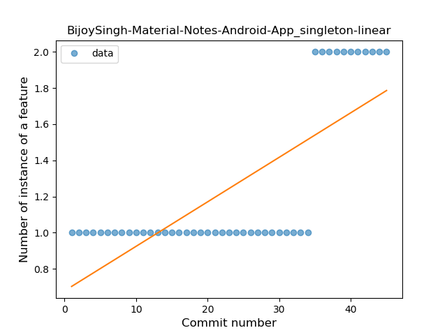
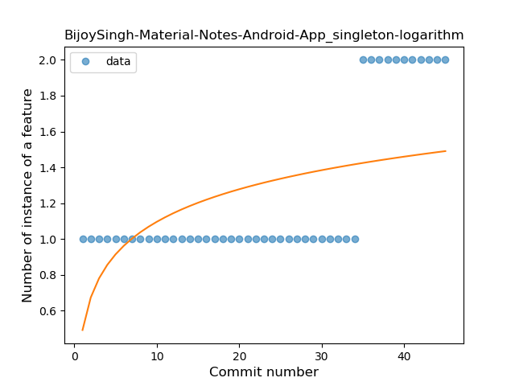
### <a name="smart_cast">Smart Cast</a>
----
#### Functions
* **Sudden Rise - Exponential:** 
    * **R_Squared:** 0.9011184
* **Constant Rise - Linear:** 
    * **R_Squared:** 0.7538618
* **Sudden Rise Plateau - Logarithm:** 
    * **R_Squared:** 0.28168344

**Plots** :chart_with_upwards_trend:
-----

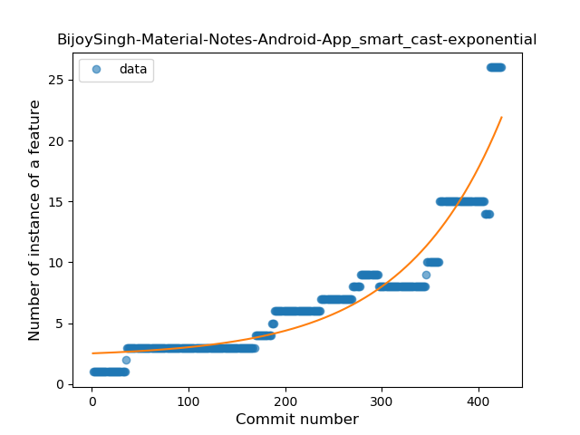
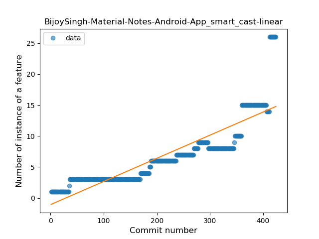
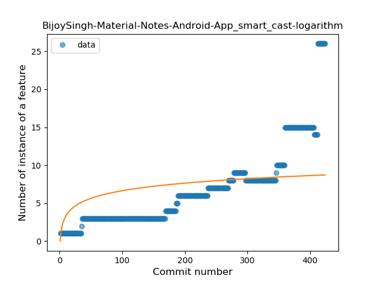
### <a name="range_expr">Range Expression</a>
----
#### Functions
* **Constant Rise - Linear:** 
    * **R_Squared:** 0.84293444
* **Sudden Rise Plateau - Logarithm:** 
    * **R_Squared:** 0.38959429

**Plots** :chart_with_upwards_trend:
-----

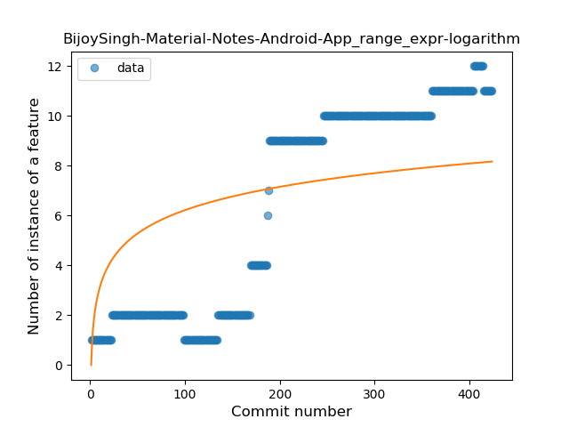
### <a name="func_call_with_named_arg">Function call with Named Argument</a>
----
#### Functions
* **Constant Rise - Linear:** 
    * **R_Squared:** 0.94209788
* **Sudden Rise Plateau - Logarithm:** 
    * **R_Squared:** 0.65059162
* **Plateau Sudden Rise - Binary Sigmoid:** 
    * **R_Squared:** 0.48492736

**Plots** :chart_with_upwards_trend:
-----

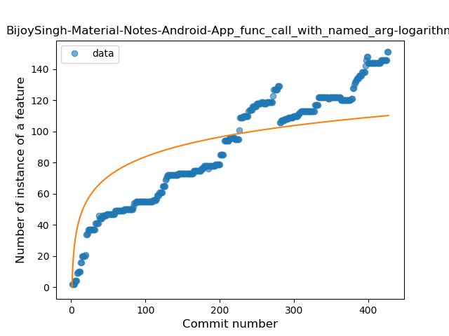
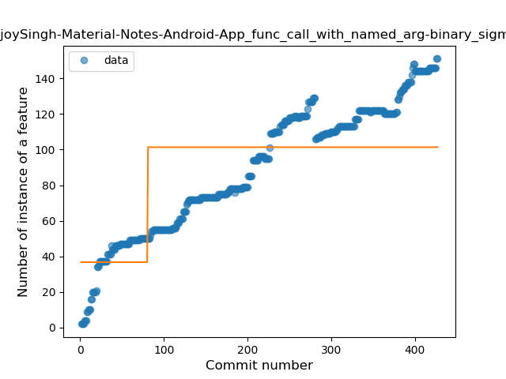
### <a name="data_class">Data Class</a>
----
#### Functions
* **Constant Rise - Linear:** 
    * **R_Squared:** 0.46901727
* **Sudden Rise - Exponential:** 
    * **R_Squared:** 0.47004414
* **Sudden Rise Plateau - Logarithm:** 
    * **R_Squared:** 0.17048078

**Plots** :chart_with_upwards_trend:
-----

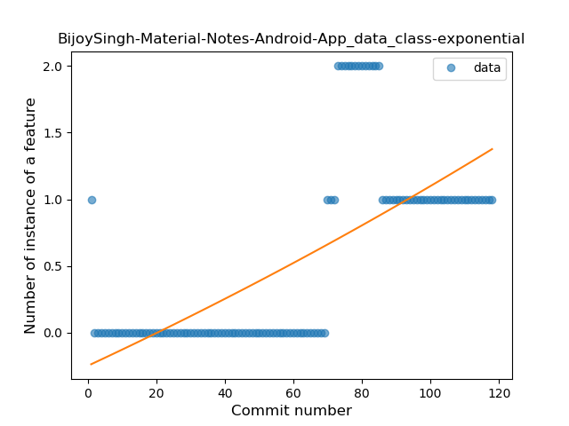
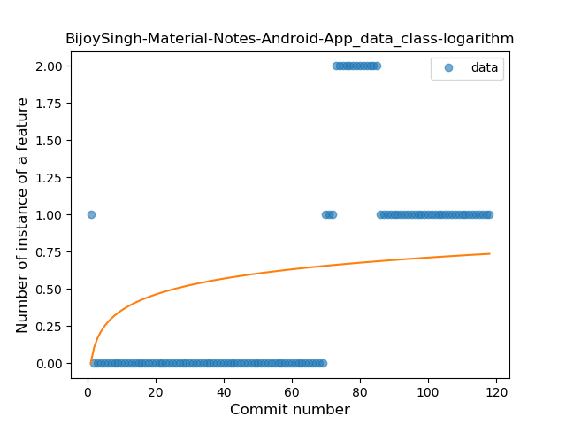
### <a name="extension_function">Extension Function</a>
----
#### Functions
* **Constant Rise - Linear:** 
    * **R_Squared:** 0.73789793
* **Sudden Rise Plateau - Logarithm:** 
    * **R_Squared:** 0.40161266
* **Plateau Sudden Rise - Binary Sigmoid:** 
    * **R_Squared:** 0.331246

**Plots** :chart_with_upwards_trend:
-----

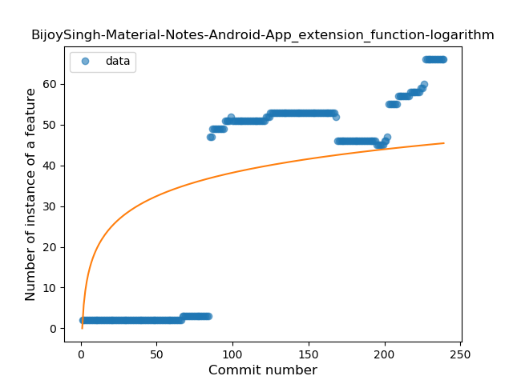
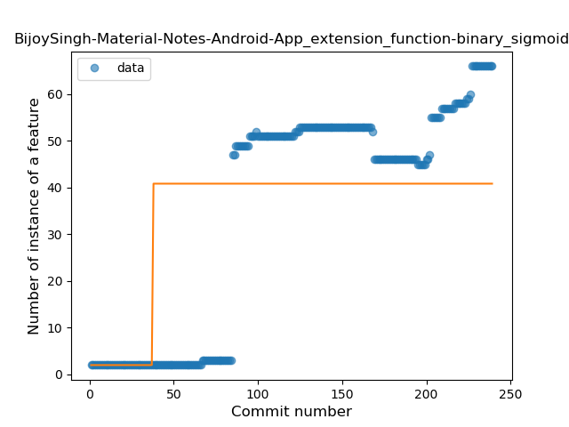
### <a name="property_delegation">Property Delegation</a>
----
#### Functions
* **Plateau Gradual Rise - Sigmoid:** 
    * **R_Squared:** 0.77234106
* **Constant Rise - Linear:** 
    * **R_Squared:** 0.73204669
* **Sudden Rise - Exponential:** 
    * **R_Squared:** 0.73668339
* **Sudden Rise Plateau - Logarithm:** 
    * **R_Squared:** 0.59574849

**Plots** :chart_with_upwards_trend:
-----

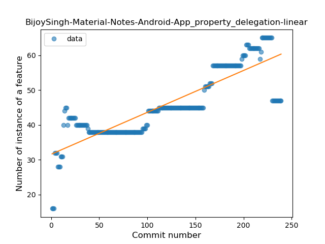
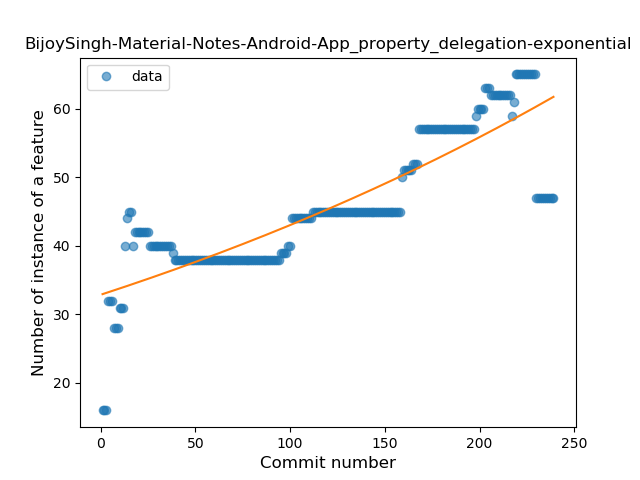
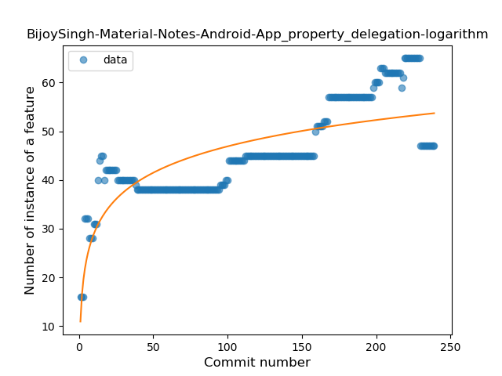
