## Commit451-LabCoat
----
#### Metrics provided by Detekt
* Number of lines of code 20808
* Number of Kotlin files: 267
* Cyclomatic complexity: 2510
* Cyclomatic complexity by thousands of lines: 227 

----
**14** features analyzed

*	<a href="#type_inference">Type Inference</a> 
*	<a href="#lambda">Lambda</a> 
*	<a href="#safe_call">Safe Call</a> 
*	<a href="#when_expr">When expression</a> 
*	<a href="#companion_object">Companion Object</a> 
*	<a href="#unsafe_call">Unsafe Call</a> 
*	<a href="#string_template">String Template</a> 
*	<a href="#func_with_default_value">Function with Default Value</a> 
*	<a href="#singleton">Singleton</a> 
*	<a href="#smart_cast">Smart Cast</a> 
*	<a href="#range_expr">Range Expression</a> 
*	<a href="#func_call_with_named_arg">Function call with Named Argument</a> 
*	<a href="#extension_function">Extension Function</a> 
*	<a href="#property_delegation">Property Delegation</a> 

### <a name="type_inference">Type Inference</a>
----
#### Functions
* **Sudden Rise Plateau - Logarithm:** 
    * **R_Squared:** 0.88201214
* **Constant Rise - Linear:** 
    * **R_Squared:** 0.64890455

**Plots** :chart_with_upwards_trend:
-----

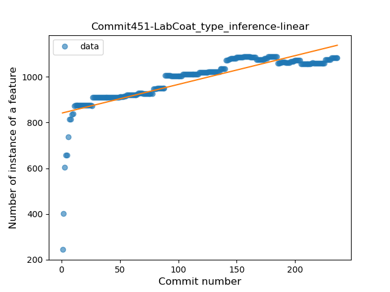
### <a name="lambda">Lambda</a>
----
#### Functions
* **Sudden Rise Plateau - Logarithm:** 
    * **R_Squared:** 0.80426942
* **Constant Rise - Linear:** 
    * **R_Squared:** 0.72737859
* **Plateau Gradual Decline - Sigmoid:** 
    * **R_Squared:** 0.0

**Plots** :chart_with_upwards_trend:
-----

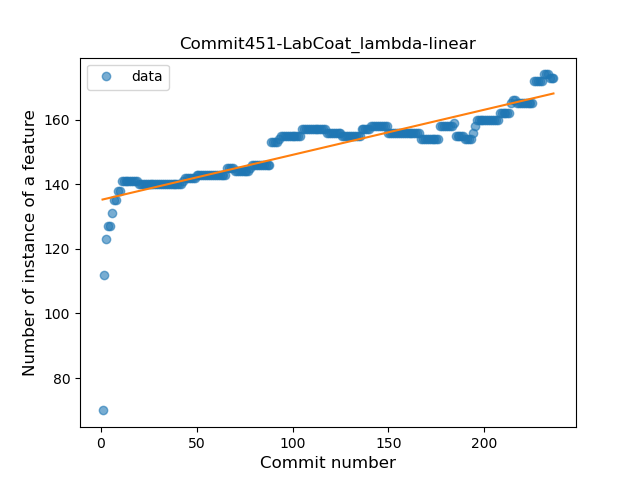
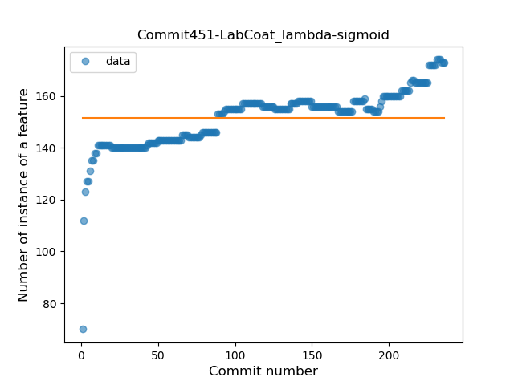
### <a name="safe_call">Safe Call</a>
----
#### Functions
* **Sudden Rise - Exponential:** 
    * **R_Squared:** 0.91545841
* **Constant Rise - Linear:** 
    * **R_Squared:** 0.79401549
* **Sudden Rise Plateau - Logarithm:** 
    * **R_Squared:** 0.33922327
* **Plateau Sudden Rise - Binary Sigmoid:** 
    * **R_Squared:** 0.2554349

**Plots** :chart_with_upwards_trend:
-----

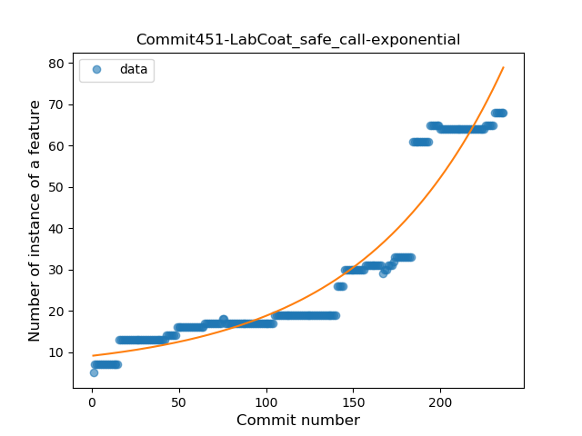
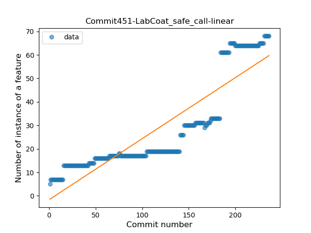
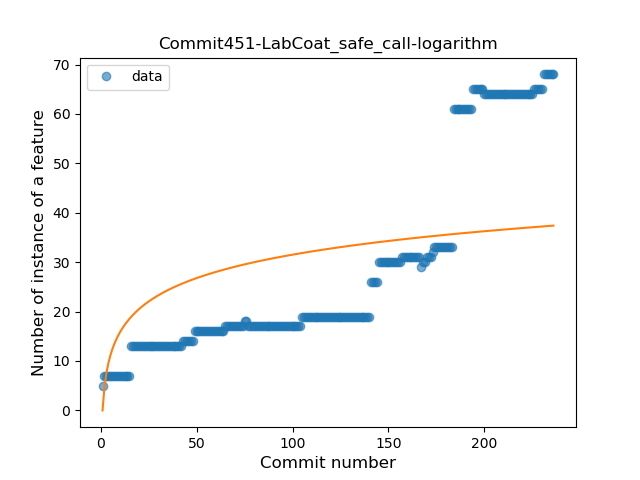
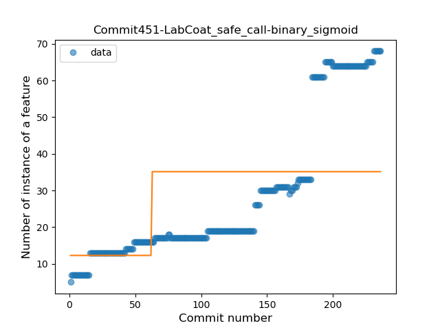
### <a name="when_expr">When expression</a>
----
#### Functions
* **Sudden Rise Plateau - Logarithm:** 
    * **R_Squared:** 0.6739673
* **Constant Rise - Linear:** 
    * **R_Squared:** 0.49191912

**Plots** :chart_with_upwards_trend:
-----

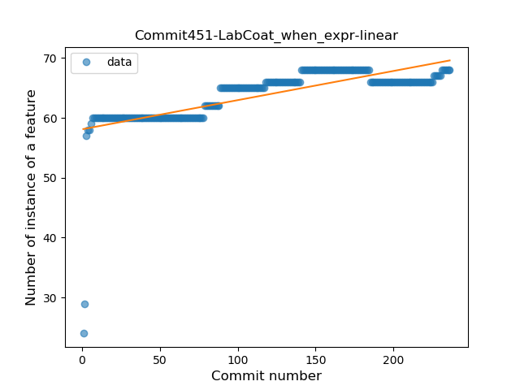
### <a name="companion_object">Companion Object</a>
----
#### Functions
* **Sudden Rise Plateau - Logarithm:** 
    * **R_Squared:** 0.74038225
* **Constant Rise - Linear:** 
    * **R_Squared:** 0.5080674
* **Plateau Sudden Rise - Binary Sigmoid:** 
    * **R_Squared:** 0.45434352

**Plots** :chart_with_upwards_trend:
-----

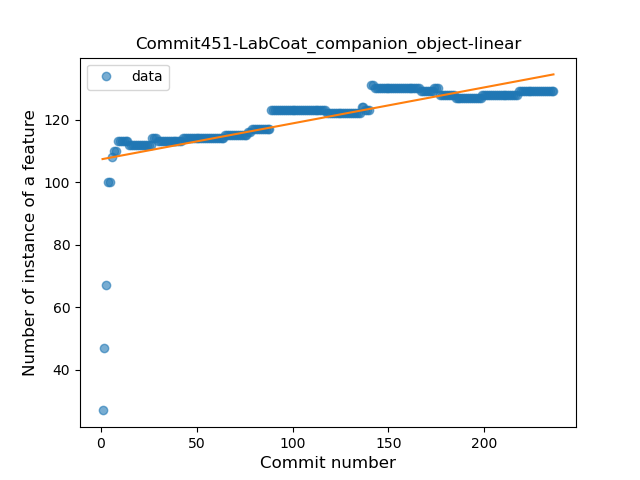
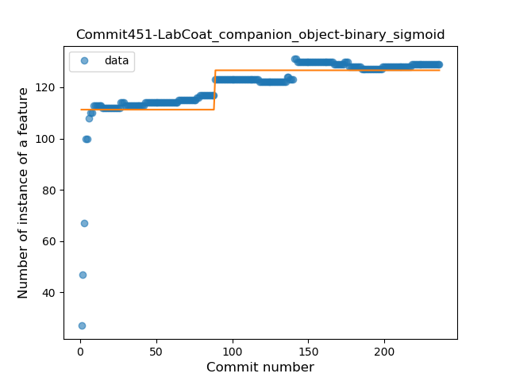
### <a name="unsafe_call">Unsafe Call</a>
----
#### Functions
* **Sudden Rise Plateau - Logarithm:** 
    * **R_Squared:** 0.41935683
* **Constant Rise - Linear:** 
    * **R_Squared:** 0.1440581
* **Plateau Sudden Decline - Binary Sigmoid:** 
    * **R_Squared:** 0.03959385

**Plots** :chart_with_upwards_trend:
-----

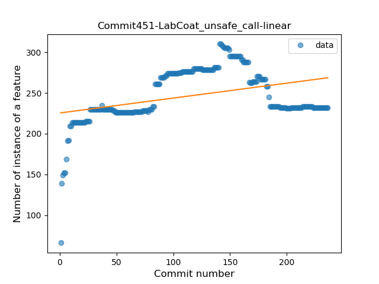
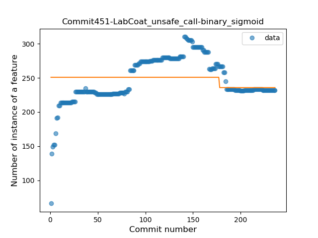
### <a name="string_template">String Template</a>
----
#### Functions
* **Plateau Gradual Rise - Sigmoid:** 
    * **R_Squared:** 0.43412277
* **Sudden Rise - Exponential:** 
    * **R_Squared:** 0.20021267
* **Constant Rise - Linear:** 
    * **R_Squared:** 0.17091768
* **Sudden Rise Plateau - Logarithm:** 
    * **R_Squared:** 0.04799709

**Plots** :chart_with_upwards_trend:
-----

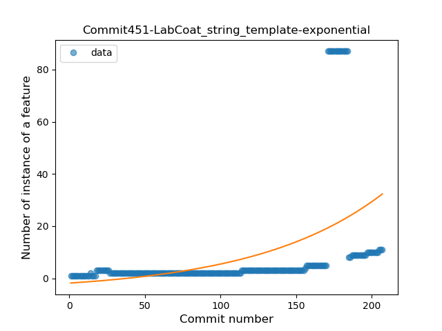
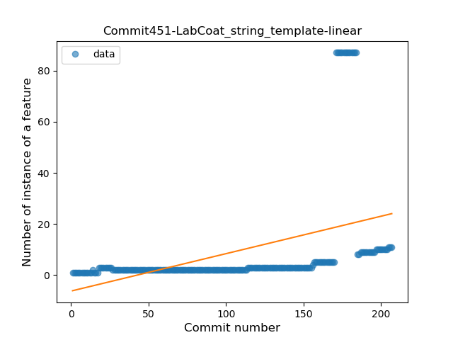
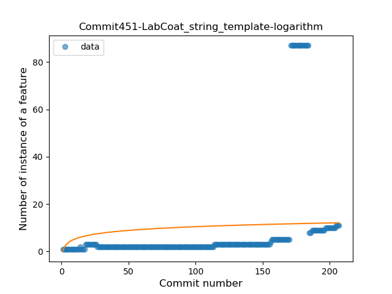
### <a name="func_with_default_value">Function with Default Value</a>
----
#### Functions
* **Constant Rise - Linear:** 
    * **R_Squared:** 0.91011258
* **Sudden Rise Plateau - Logarithm:** 
    * **R_Squared:** 0.64383439

**Plots** :chart_with_upwards_trend:
-----

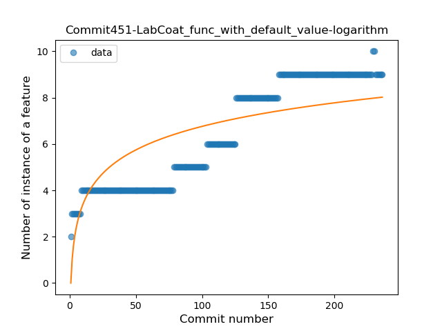
### <a name="singleton">Singleton</a>
----
#### Functions
* **Sudden Rise Plateau - Logarithm:** 
    * **R_Squared:** 0.76556588
* **Constant Rise - Linear:** 
    * **R_Squared:** 0.53030839
* **Plateau Sudden Rise - Binary Sigmoid:** 
    * **R_Squared:** 0.36683789

**Plots** :chart_with_upwards_trend:
-----

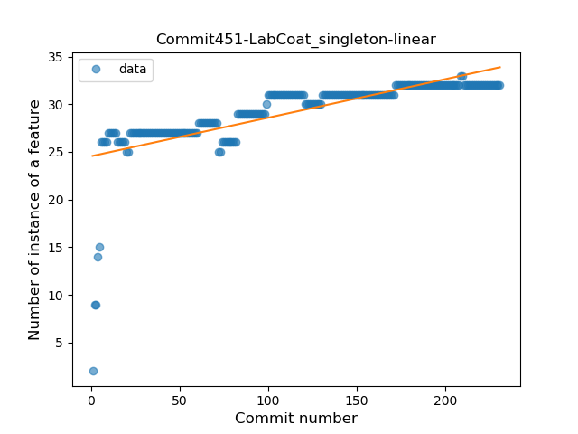
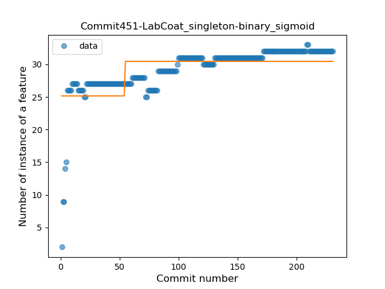
### <a name="smart_cast">Smart Cast</a>
----
#### Functions
* **Sudden Rise Plateau - Logarithm:** 
    * **R_Squared:** 0.06936857
* **Constant Decline - Linear:** 
    * **R_Squared:** 0.00853355

**Plots** :chart_with_upwards_trend:
-----

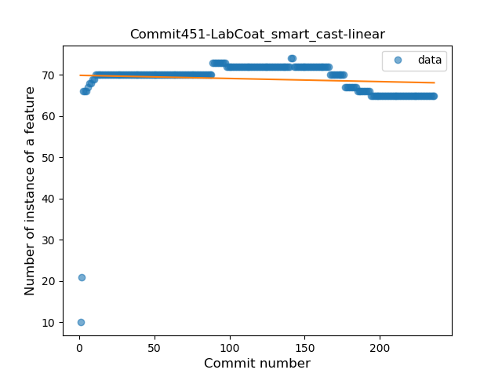
### <a name="range_expr">Range Expression</a>
----
#### Functions
* **Plateau Sudden Decline - Binary Sigmoid:** 
    * **R_Squared:** 1.0
* **Constant Decline - Linear:** 
    * **R_Squared:** 0.13439869
* **Sudden Rise Plateau - Logarithm:** 
    * **R_Squared:** -0.0

**Plots** :chart_with_upwards_trend:
-----

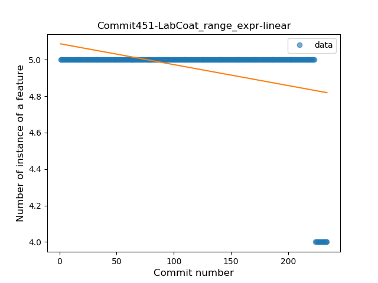
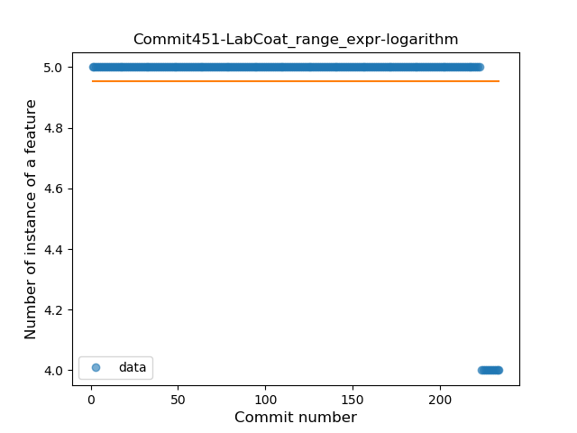
### <a name="func_call_with_named_arg">Function call with Named Argument</a>
----
#### Functions
* **Plateau Sudden Decline - Binary Sigmoid:** 
    * **R_Squared:** 1.0
* **Constant Decline - Linear:** 
    * **R_Squared:** 0.5153784
* **Sudden Rise Plateau - Logarithm:** 
    * **R_Squared:** 0.0

**Plots** :chart_with_upwards_trend:
-----

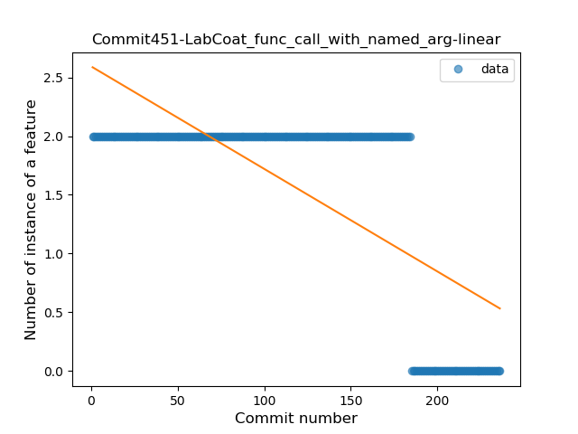
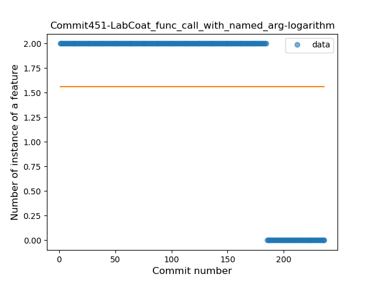
### <a name="extension_function">Extension Function</a>
----
#### Functions
* **Constant Rise - Linear:** 
    * **R_Squared:** 0.94146177
* **Sudden Rise Plateau - Logarithm:** 
    * **R_Squared:** 0.68507138

**Plots** :chart_with_upwards_trend:
-----

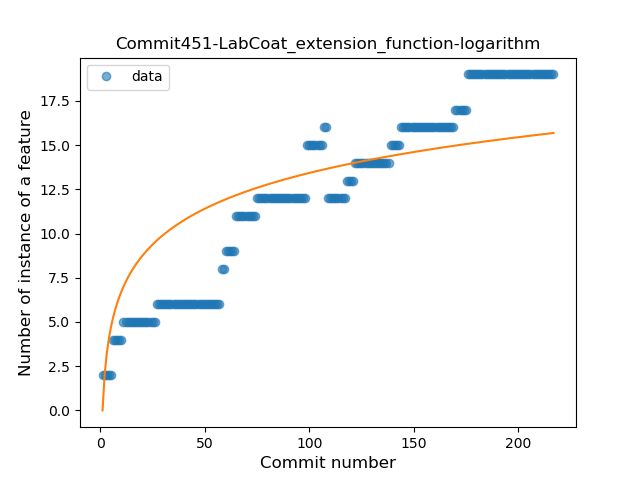
### <a name="property_delegation">Property Delegation</a>
----
#### Functions
* **Constant Rise - Linear:** 
    * **R_Squared:** 0.95005212
* **Sudden Rise - Exponential:** 
    * **R_Squared:** 0.95805081
* **Plateau Gradual Rise - Sigmoid:** 
    * **R_Squared:** 0.96088377
* **Sudden Rise Plateau - Logarithm:** 
    * **R_Squared:** 0.46941679

**Plots** :chart_with_upwards_trend:
-----

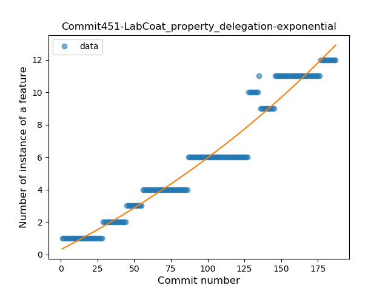

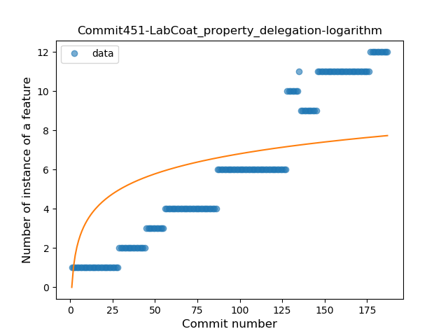
