## CypherpunkArmory-UserLAnd
----
#### Metrics provided by Detekt
* Number of lines of code 6016
* Number of Kotlin files: 56
* Cyclomatic complexity: 801
* Cyclomatic complexity by thousands of lines: 227 

----
**17** features analyzed

*	<a href="#type_inference">Type Inference</a> 
*	<a href="#lambda">Lambda</a> 
*	<a href="#safe_call">Safe Call</a> 
*	<a href="#when_expr">When expression</a> 
*	<a href="#companion_object">Companion Object</a> 
*	<a href="#unsafe_call">Unsafe Call</a> 
*	<a href="#string_template">String Template</a> 
*	<a href="#func_with_default_value">Function with Default Value</a> 
*	<a href="#singleton">Singleton</a> 
*	<a href="#smart_cast">Smart Cast</a> 
*	<a href="#range_expr">Range Expression</a> 
*	<a href="#func_call_with_named_arg">Function call with Named Argument</a> 
*	<a href="#data_class">Data Class</a> 
*	<a href="#extension_function">Extension Function</a> 
*	<a href="#property_delegation">Property Delegation</a> 
*	<a href="#destructuring_declaration">Destructuring Declaration</a> 
*	<a href="#overloaded_op">Overloaded Operator</a> 

### <a name="type_inference">Type Inference</a>
----
#### Functions
* **Sudden Rise - Exponential:** 
    * **R_Squared:** 0.98774292
* **Constant Rise - Linear:** 
    * **R_Squared:** 0.9714166
* **Plateau Sudden Rise - Binary Sigmoid:** 
    * **R_Squared:** 0.68628981
* **Sudden Rise Plateau - Logarithm:** 
    * **R_Squared:** 0.40603434

**Plots** :chart_with_upwards_trend:
-----

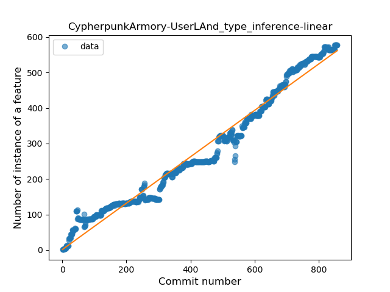
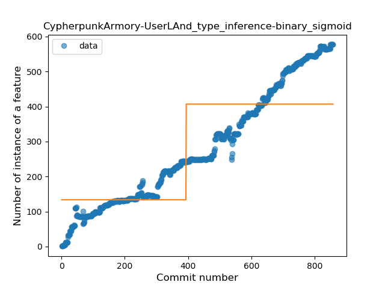
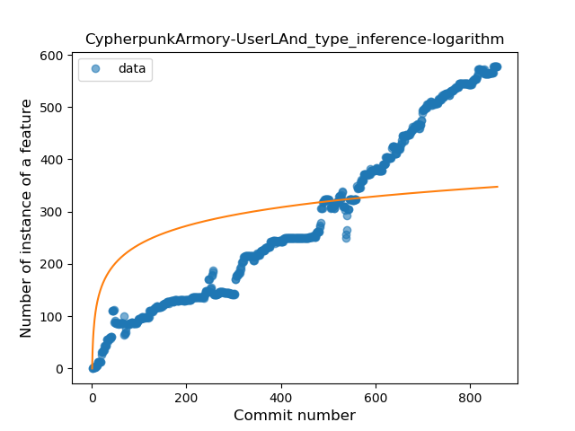
### <a name="lambda">Lambda</a>
----
#### Functions
* **Constant Rise - Linear:** 
    * **R_Squared:** 0.95229493
* **Sudden Rise Plateau - Logarithm:** 
    * **R_Squared:** 0.58165234
* **Plateau Sudden Rise - Binary Sigmoid:** 
    * **R_Squared:** 0.45486538

**Plots** :chart_with_upwards_trend:
-----

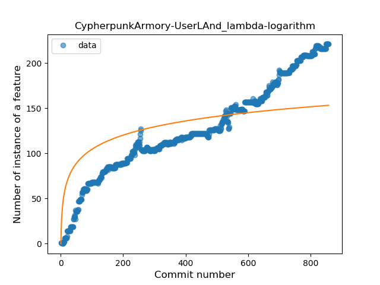
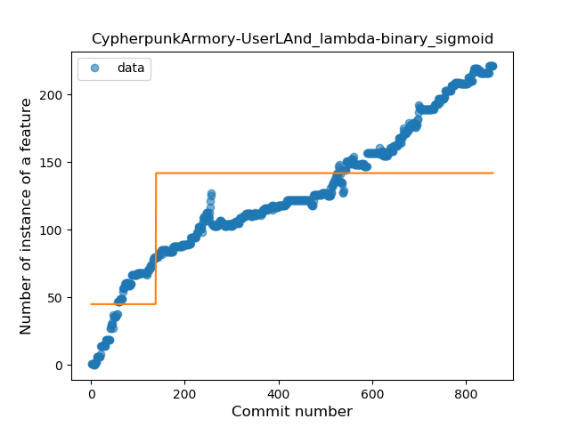
### <a name="safe_call">Safe Call</a>
----
#### Functions
* **Sudden Rise - Exponential:** 
    * **R_Squared:** 0.87846776
* **Constant Rise - Linear:** 
    * **R_Squared:** 0.82378419
* **Sudden Rise Plateau - Logarithm:** 
    * **R_Squared:** 0.46935064
* **Plateau Sudden Rise - Binary Sigmoid:** 
    * **R_Squared:** 0.08408207

**Plots** :chart_with_upwards_trend:
-----

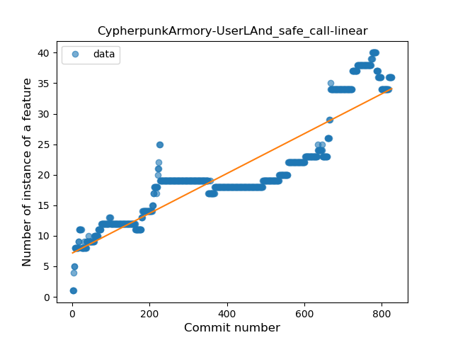
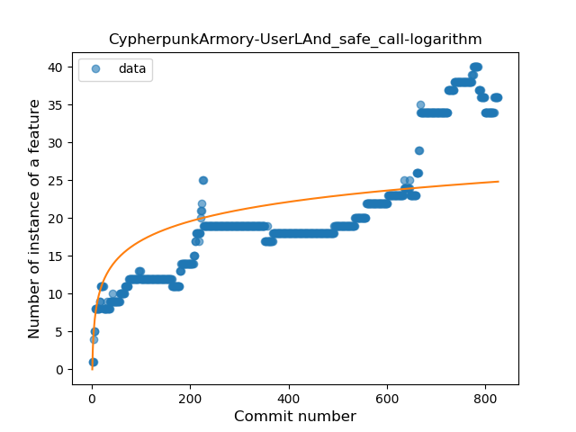
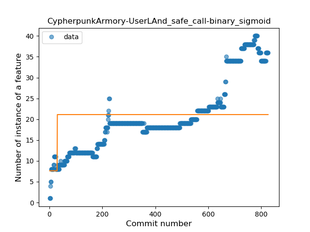
### <a name="when_expr">When expression</a>
----
#### Functions
* **Sudden Rise - Exponential:** 
    * **R_Squared:** 0.82001461
* **Constant Rise - Linear:** 
    * **R_Squared:** 0.72329915
* **Sudden Rise Plateau - Logarithm:** 
    * **R_Squared:** 0.39578016
* **Plateau Sudden Rise - Binary Sigmoid:** 
    * **R_Squared:** 0.08359834

**Plots** :chart_with_upwards_trend:
-----

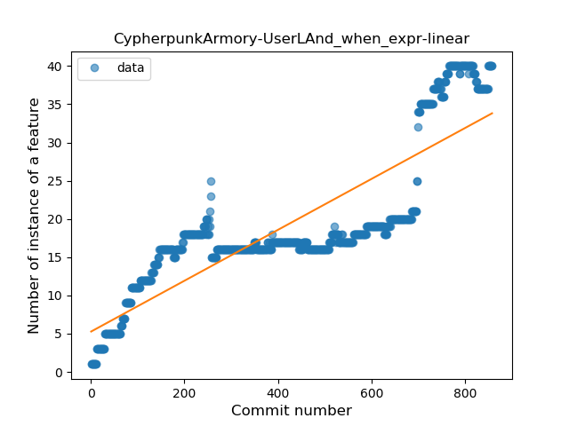
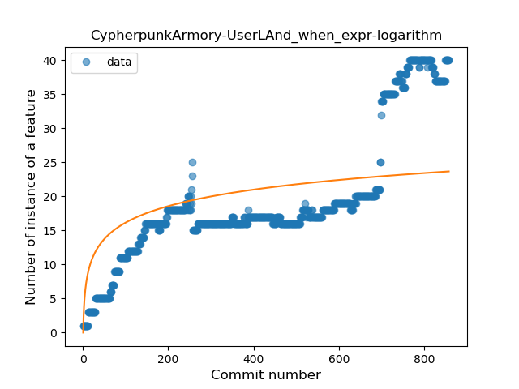
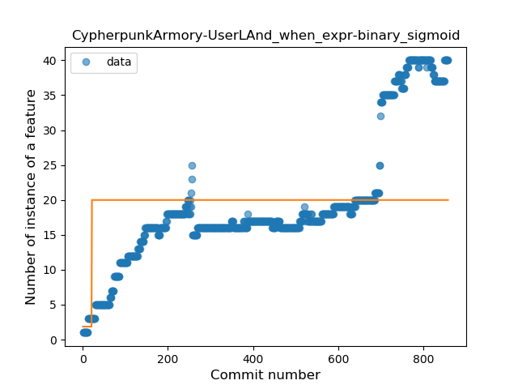
### <a name="companion_object">Companion Object</a>
----
#### Functions
* **Constant Rise - Linear:** 
    * **R_Squared:** 0.79568486
* **Sudden Rise Plateau - Logarithm:** 
    * **R_Squared:** 0.65752771

**Plots** :chart_with_upwards_trend:
-----

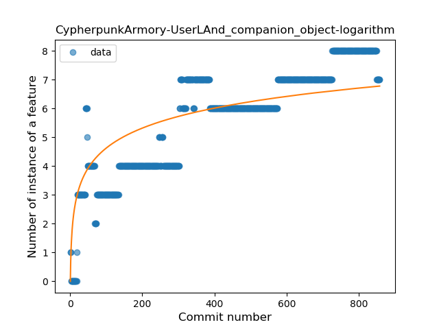
### <a name="unsafe_call">Unsafe Call</a>
----
#### Functions
* **Sudden Rise - Exponential:** 
    * **R_Squared:** 0.6344108
* **Constant Rise - Linear:** 
    * **R_Squared:** 0.61510499
* **Sudden Rise Plateau - Logarithm:** 
    * **R_Squared:** 0.28249091

**Plots** :chart_with_upwards_trend:
-----

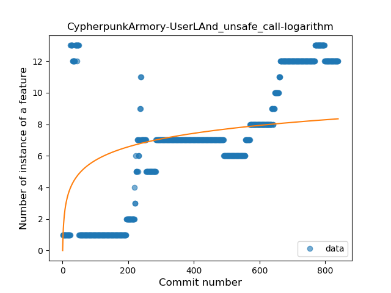
### <a name="string_template">String Template</a>
----
#### Functions
* **Constant Rise - Linear:** 
    * **R_Squared:** 0.93838022
* **Sudden Rise Plateau - Logarithm:** 
    * **R_Squared:** 0.49749304
* **Plateau Gradual Rise - Sigmoid:** 
    * **R_Squared:** 0.16146411

**Plots** :chart_with_upwards_trend:
-----

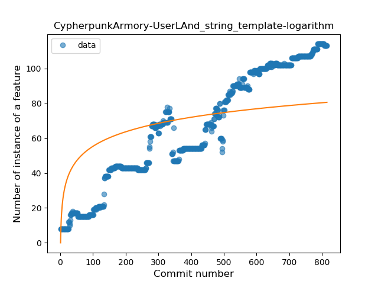
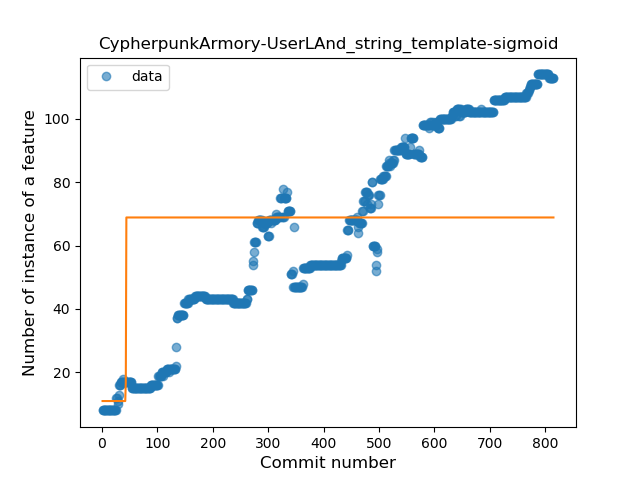
### <a name="func_with_default_value">Function with Default Value</a>
----
#### Functions
* **Sudden Rise - Exponential:** 
    * **R_Squared:** 0.95691932
* **Constant Rise - Linear:** 
    * **R_Squared:** 0.94568464
* **Sudden Rise Plateau - Logarithm:** 
    * **R_Squared:** 0.40914189
* **Plateau Gradual Decline - Sigmoid:** 
    * **R_Squared:** -0.0

**Plots** :chart_with_upwards_trend:
-----

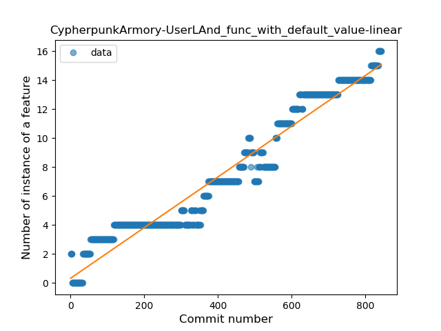
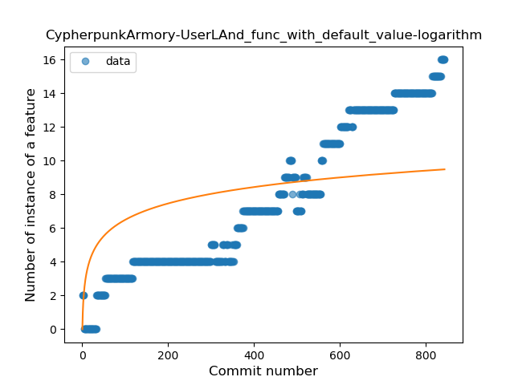
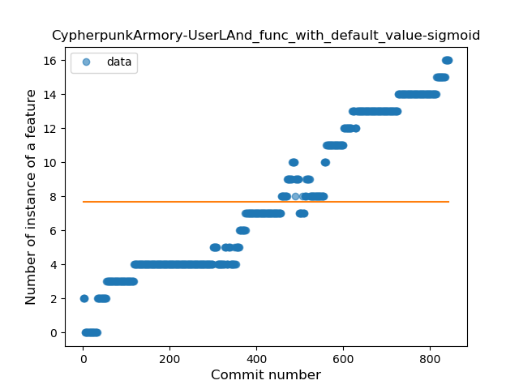
### <a name="singleton">Singleton</a>
----
#### Functions
* **Sudden Rise - Exponential:** 
    * **R_Squared:** 0.7509031
* **Plateau Sudden Decline - Binary Sigmoid:** 
    * **R_Squared:** 0.0638411
* **Constant Rise - Linear:** 
    * **R_Squared:** 0.00857569
* **Sudden Rise Plateau - Logarithm:** 
    * **R_Squared:** -0.0

**Plots** :chart_with_upwards_trend:
-----

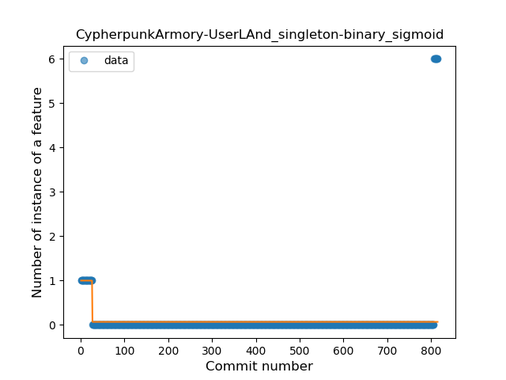
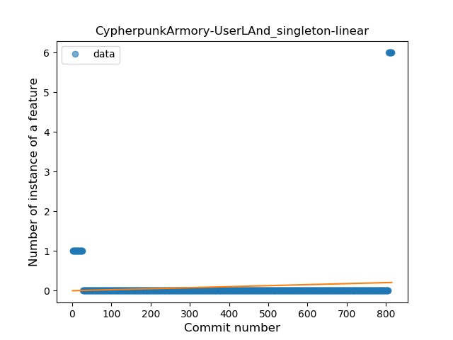

### <a name="smart_cast">Smart Cast</a>
----
#### Functions
* **Sudden Rise - Exponential:** 
    * **R_Squared:** 0.87185564
* **Constant Rise - Linear:** 
    * **R_Squared:** 0.64739405
* **Sudden Rise Plateau - Logarithm:** 
    * **R_Squared:** 0.13199574
* **Plateau Gradual Rise - Sigmoid:** 
    * **R_Squared:** 0.0

**Plots** :chart_with_upwards_trend:
-----

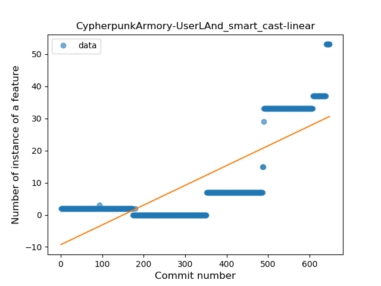

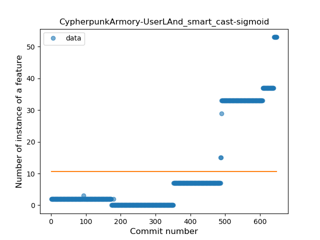
### <a name="range_expr">Range Expression</a>
----
#### Functions
* **Plateau Sudden Rise - Binary Sigmoid:** 
    * **R_Squared:** 0.72674589
* **Constant Rise - Linear:** 
    * **R_Squared:** 0.62474923
* **Sudden Rise Plateau - Logarithm:** 
    * **R_Squared:** 0.4846969

**Plots** :chart_with_upwards_trend:
-----

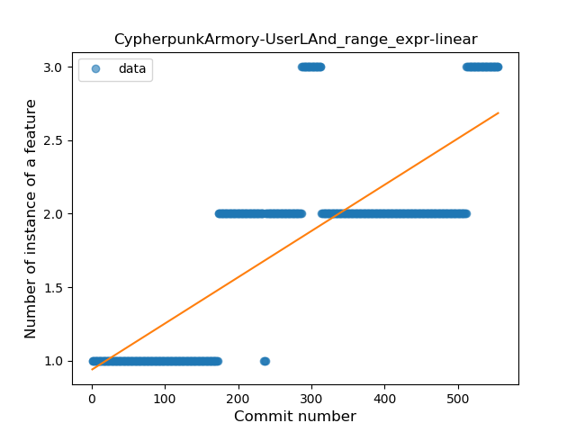
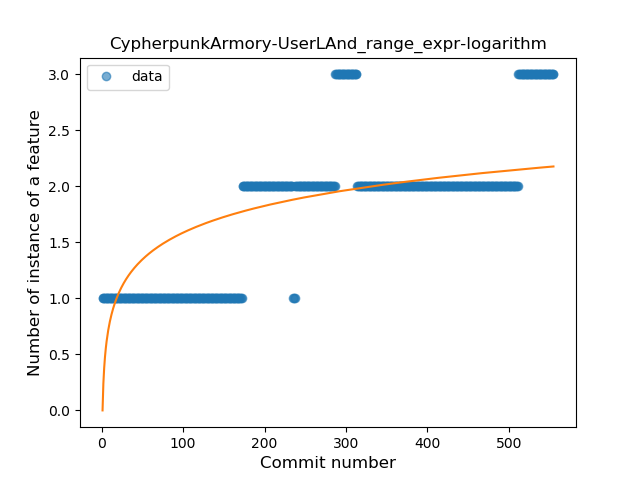
### <a name="func_call_with_named_arg">Function call with Named Argument</a>
----
#### Functions
* **Constant Rise - Linear:** 
    * **R_Squared:** 0.89275049
* **Sudden Rise - Exponential:** 
    * **R_Squared:** 0.89696893
* **Sudden Rise Plateau - Logarithm:** 
    * **R_Squared:** 0.33692043
* **Plateau Sudden Rise - Binary Sigmoid:** 
    * **R_Squared:** 0.08838085

**Plots** :chart_with_upwards_trend:
-----

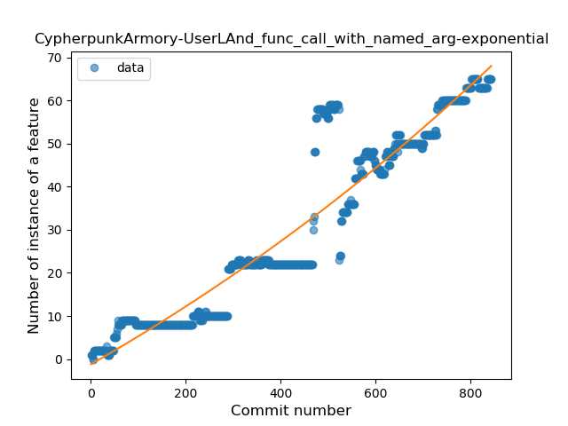
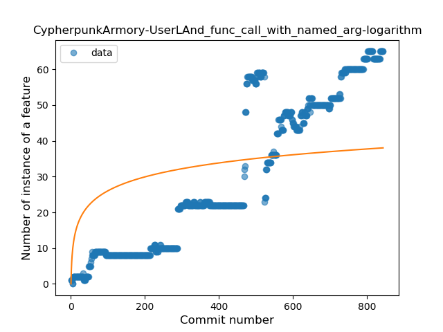
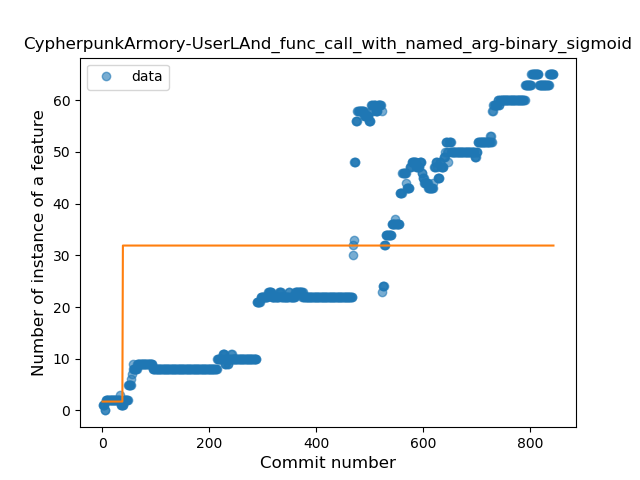
### <a name="data_class">Data Class</a>
----
#### Functions
* **Plateau Gradual Rise - Sigmoid:** 
    * **R_Squared:** 0.91334442
* **Sudden Rise - Exponential:** 
    * **R_Squared:** 0.89342031
* **Constant Rise - Linear:** 
    * **R_Squared:** 0.68429331
* **Sudden Rise Plateau - Logarithm:** 
    * **R_Squared:** 0.20415374

**Plots** :chart_with_upwards_trend:
-----

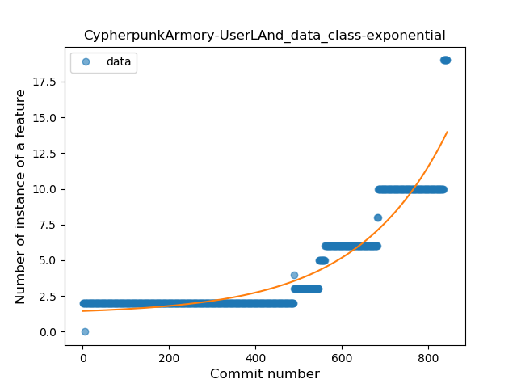
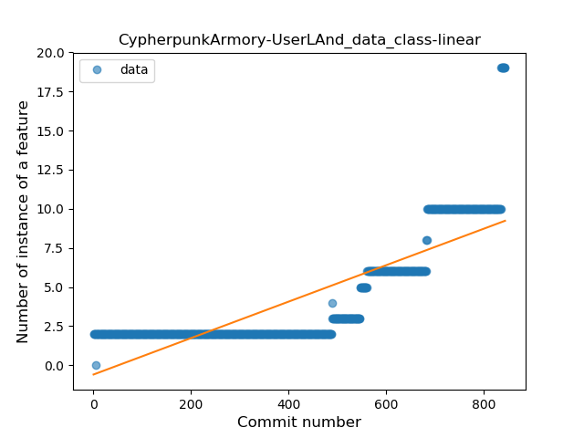
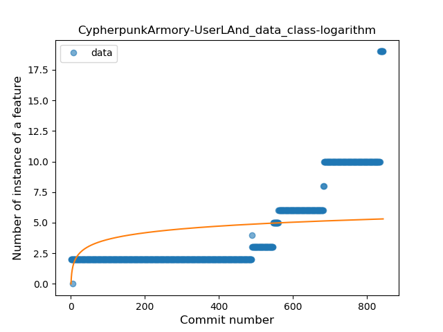
### <a name="extension_function">Extension Function</a>
----
#### Functions
* **Plateau Gradual Rise - Sigmoid:** 
    * **R_Squared:** 0.87970452
* **Sudden Rise Plateau - Logarithm:** 
    * **R_Squared:** 0.5252467
* **Constant Rise - Linear:** 
    * **R_Squared:** 0.41890935

**Plots** :chart_with_upwards_trend:
-----

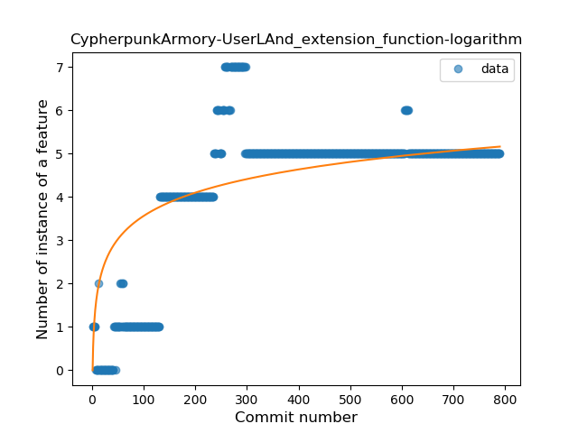

### <a name="property_delegation">Property Delegation</a>
----
#### Functions
* **Plateau Gradual Rise - Sigmoid:** 
    * **R_Squared:** 0.79293783
* **Sudden Rise Plateau - Logarithm:** 
    * **R_Squared:** 0.66757886
* **Constant Rise - Linear:** 
    * **R_Squared:** 0.40559917

**Plots** :chart_with_upwards_trend:
-----

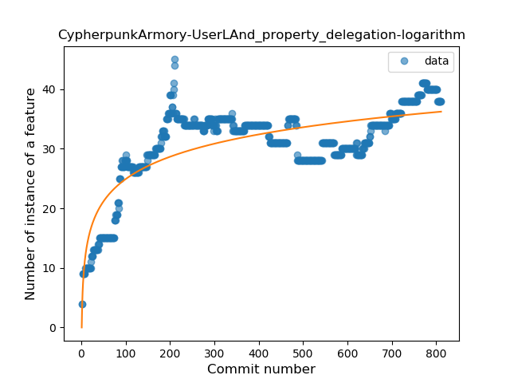
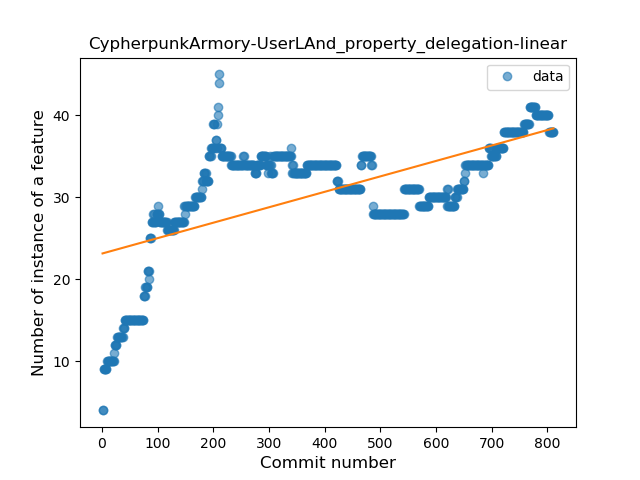
### <a name="destructuring_declaration">Destructuring Declaration</a>
----
#### Functions
* **Sudden Rise - Exponential:** 
    * **R_Squared:** 0.91263543
* **Constant Rise - Linear:** 
    * **R_Squared:** 0.83563543
* **Sudden Rise Plateau - Logarithm:** 
    * **R_Squared:** 0.44513361

**Plots** :chart_with_upwards_trend:
-----

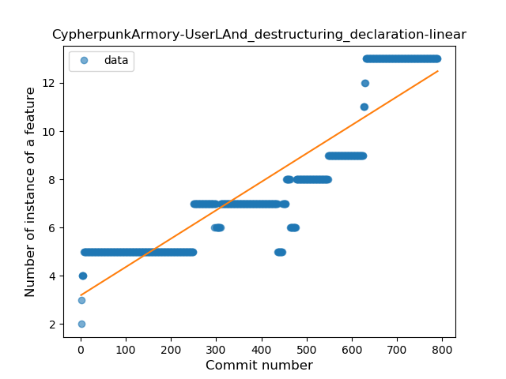
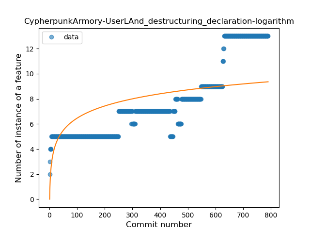
### <a name="overloaded_op">Overloaded Operator</a>
----
#### Functions
* **Plateau Sudden Rise - Binary Sigmoid:** 
    * **R_Squared:** 1.0
* **Sudden Rise Plateau - Logarithm:** 
    * **R_Squared:** 0.65307211
* **Constant Rise - Linear:** 
    * **R_Squared:** 0.3957797

**Plots** :chart_with_upwards_trend:
-----

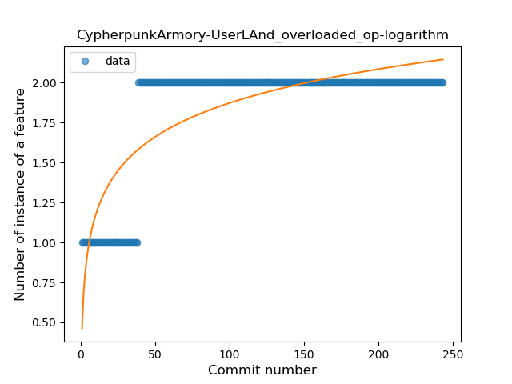
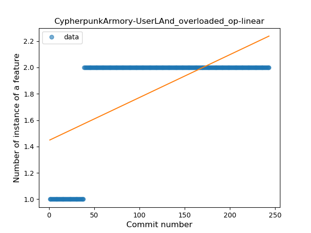
