## CzBiX-v2ex-android
----
#### Metrics provided by Detekt
* Number of lines of code 5061
* Number of Kotlin files: 45
* Cyclomatic complexity: 742
* Cyclomatic complexity by thousands of lines: 267 

----
**15** features analyzed

*	<a href="#type_inference">Type Inference</a> 
*	<a href="#lambda">Lambda</a> 
*	<a href="#safe_call">Safe Call</a> 
*	<a href="#when_expr">When expression</a> 
*	<a href="#companion_object">Companion Object</a> 
*	<a href="#unsafe_call">Unsafe Call</a> 
*	<a href="#string_template">String Template</a> 
*	<a href="#func_with_default_value">Function with Default Value</a> 
*	<a href="#singleton">Singleton</a> 
*	<a href="#smart_cast">Smart Cast</a> 
*	<a href="#func_call_with_named_arg">Function call with Named Argument</a> 
*	<a href="#data_class">Data Class</a> 
*	<a href="#extension_function">Extension Function</a> 
*	<a href="#destructuring_declaration">Destructuring Declaration</a> 
*	<a href="#inline_func">Inline Function</a> 

### <a name="type_inference">Type Inference</a>
----
#### Functions
* **Constant Rise - Linear:** 
    * **R_Squared:** 0.93571294
* **Sudden Rise Plateau - Logarithm:** 
    * **R_Squared:** 0.6959456

**Plots** :chart_with_upwards_trend:
-----

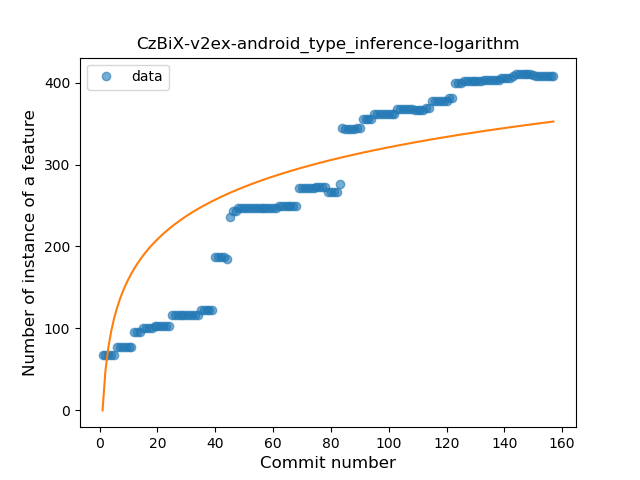
### <a name="lambda">Lambda</a>
----
#### Functions
* **Constant Rise - Linear:** 
    * **R_Squared:** 0.95136861
* **Plateau Gradual Rise - Sigmoid:** 
    * **R_Squared:** 0.73620429
* **Sudden Rise Plateau - Logarithm:** 
    * **R_Squared:** 0.68013199

**Plots** :chart_with_upwards_trend:
-----

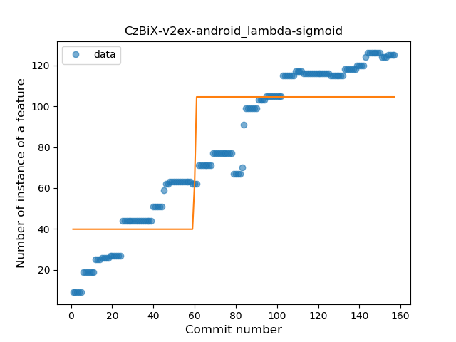
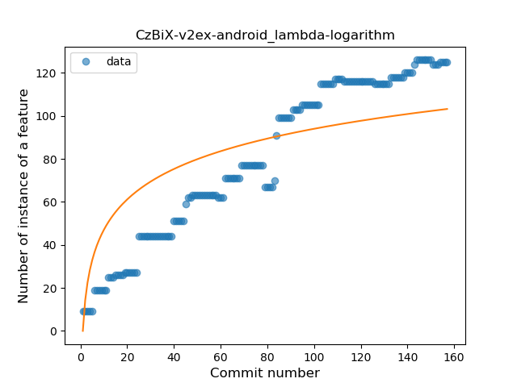
### <a name="safe_call">Safe Call</a>
----
#### Functions
* **Sudden Rise Plateau - Logarithm:** 
    * **R_Squared:** 0.8228827
* **Constant Rise - Linear:** 
    * **R_Squared:** 0.65372442

**Plots** :chart_with_upwards_trend:
-----

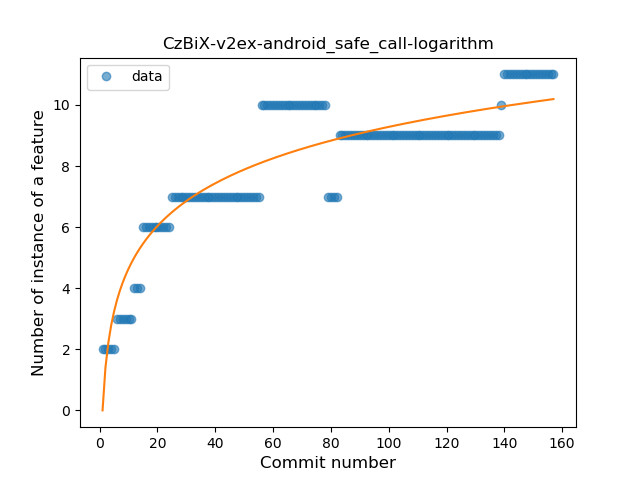
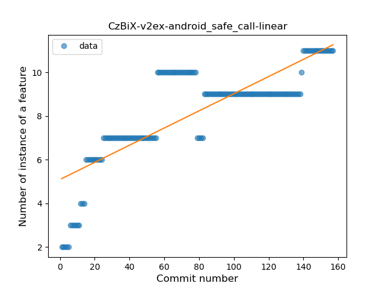
### <a name="when_expr">When expression</a>
----
#### Functions
* **Constant Rise - Linear:** 
    * **R_Squared:** 0.97650957
* **Sudden Rise Plateau - Logarithm:** 
    * **R_Squared:** 0.64997337

**Plots** :chart_with_upwards_trend:
-----

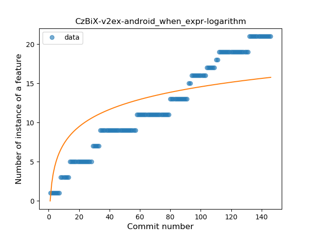
### <a name="companion_object">Companion Object</a>
----
#### Functions
* **Plateau Gradual Rise - Sigmoid:** 
    * **R_Squared:** 0.95800832
* **Constant Rise - Linear:** 
    * **R_Squared:** 0.91483727
* **Sudden Rise Plateau - Logarithm:** 
    * **R_Squared:** 0.62913368

**Plots** :chart_with_upwards_trend:
-----

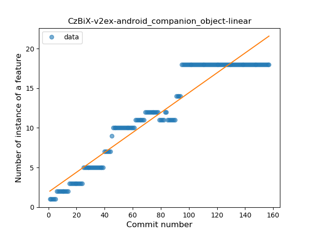
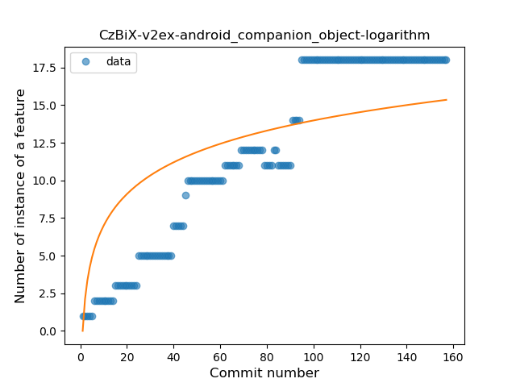
### <a name="unsafe_call">Unsafe Call</a>
----
#### Functions
* **Instability - Polinomial 3:** )
    * **R_Squared:** 0.84119336
* **Plateau Gradual Rise - Sigmoid:** 
    * **R_Squared:** 0.55799702
* **Sudden Rise Plateau - Logarithm:** 
    * **R_Squared:** 0.50350936
* **Constant Rise - Linear:** 
    * **R_Squared:** 0.47650596

**Plots** :chart_with_upwards_trend:
-----

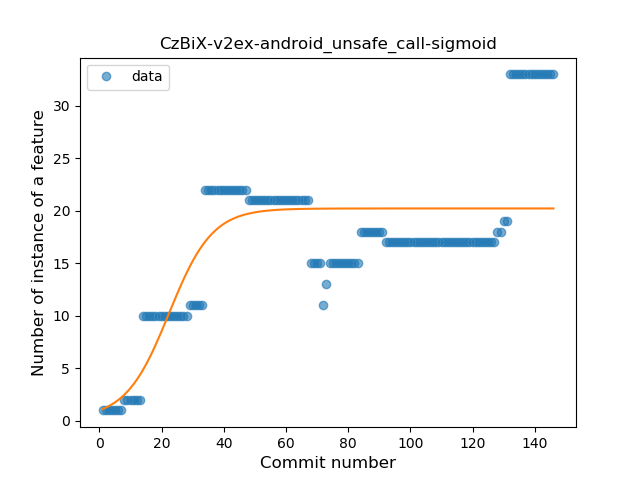
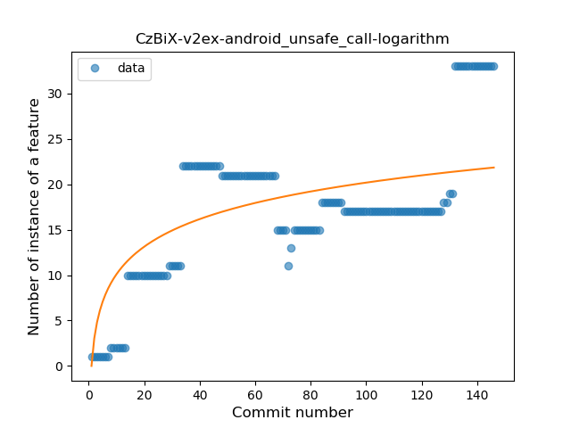
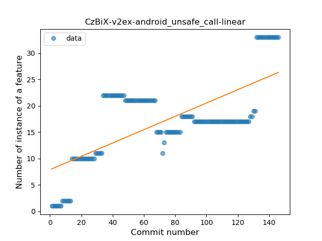
### <a name="string_template">String Template</a>
----
#### Functions
* **Constant Rise - Linear:** 
    * **R_Squared:** 0.62737075
* **Sudden Rise Plateau - Logarithm:** 
    * **R_Squared:** 0.61239581

**Plots** :chart_with_upwards_trend:
-----

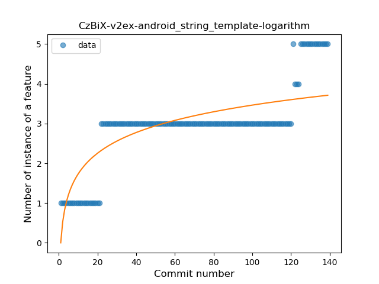
### <a name="func_with_default_value">Function with Default Value</a>
----
#### Functions
* **Plateau Gradual Rise - Sigmoid:** 
    * **R_Squared:** 0.96602281
* **Sudden Rise - Exponential:** 
    * **R_Squared:** 0.8904332
* **Constant Rise - Linear:** 
    * **R_Squared:** 0.87642841
* **Sudden Rise Plateau - Logarithm:** 
    * **R_Squared:** 0.51248411

**Plots** :chart_with_upwards_trend:
-----

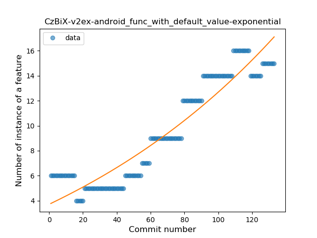
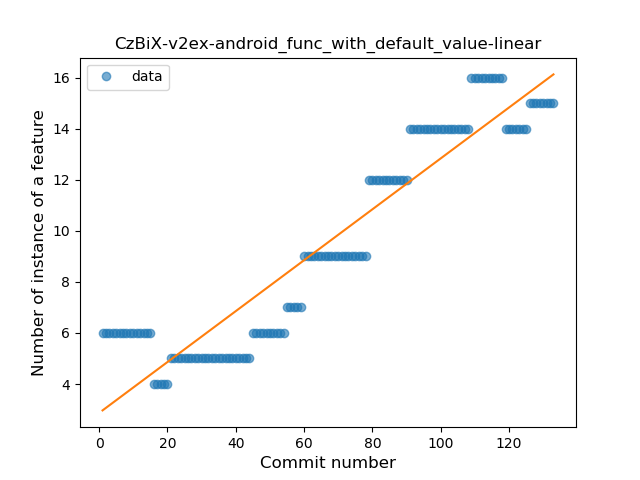
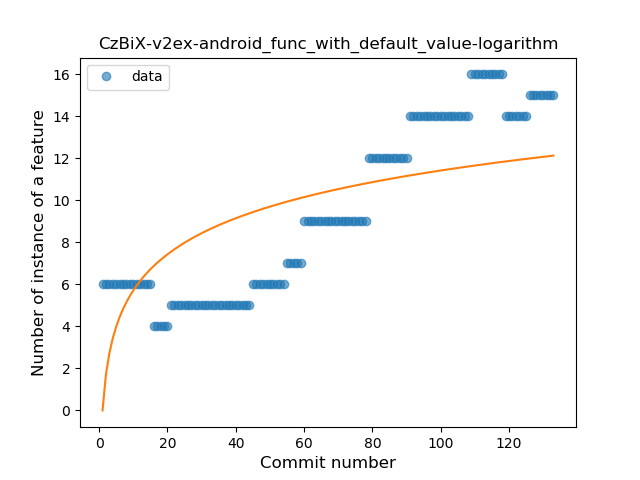
### <a name="singleton">Singleton</a>
----
#### Functions
* **Plateau Gradual Rise - Sigmoid:** 
    * **R_Squared:** 0.95572903
* **Constant Rise - Linear:** 
    * **R_Squared:** 0.87554185
* **Sudden Rise Plateau - Logarithm:** 
    * **R_Squared:** 0.77215425

**Plots** :chart_with_upwards_trend:
-----

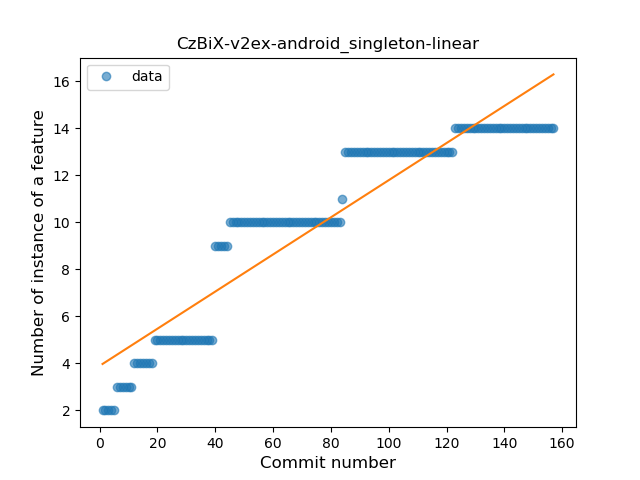
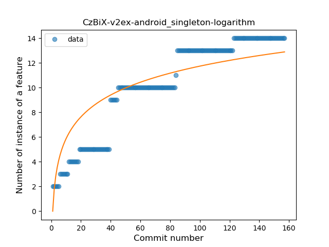
### <a name="smart_cast">Smart Cast</a>
----
#### Functions
* **Constant Rise - Linear:** 
    * **R_Squared:** 0.96740816
* **Sudden Rise Plateau - Logarithm:** 
    * **R_Squared:** 0.79446326
* **Plateau Gradual Rise - Sigmoid:** 
    * **R_Squared:** 0.33590885

**Plots** :chart_with_upwards_trend:
-----

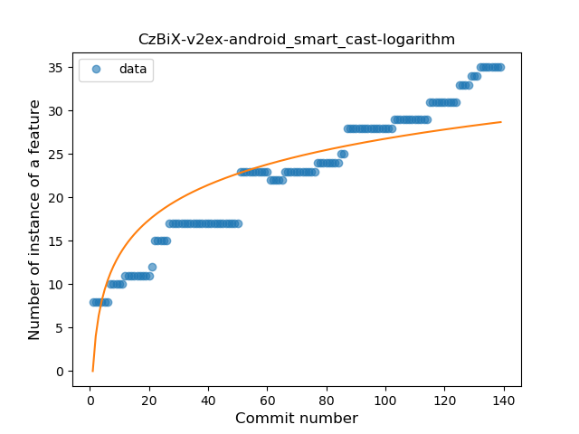
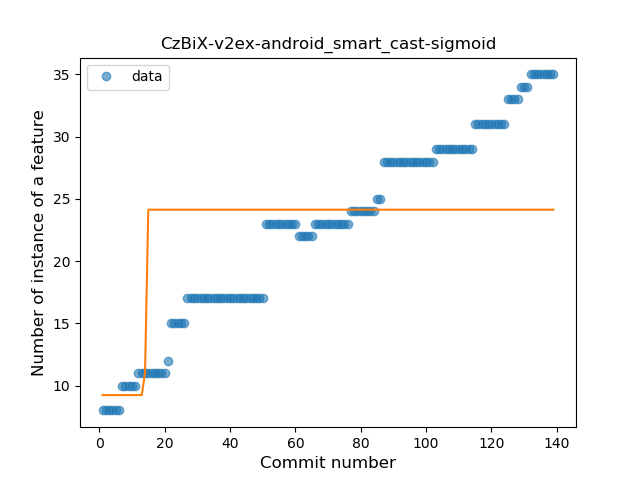
### <a name="func_call_with_named_arg">Function call with Named Argument</a>
----
#### Functions
* **Plateau Sudden Rise - Binary Sigmoid:** 
    * **R_Squared:** 0.95503508
* **Sudden Rise - Exponential:** 
    * **R_Squared:** 0.62787819
* **Constant Rise - Linear:** 
    * **R_Squared:** 0.57375922
* **Sudden Rise Plateau - Logarithm:** 
    * **R_Squared:** 0.2432855

**Plots** :chart_with_upwards_trend:
-----

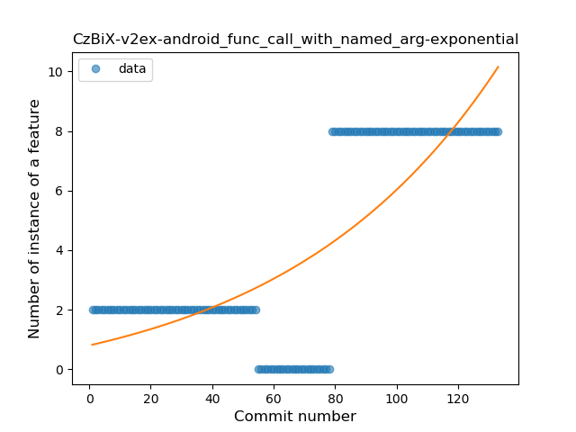
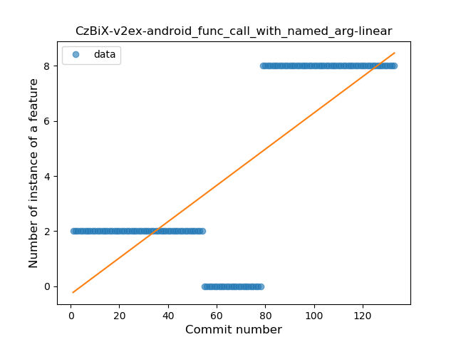
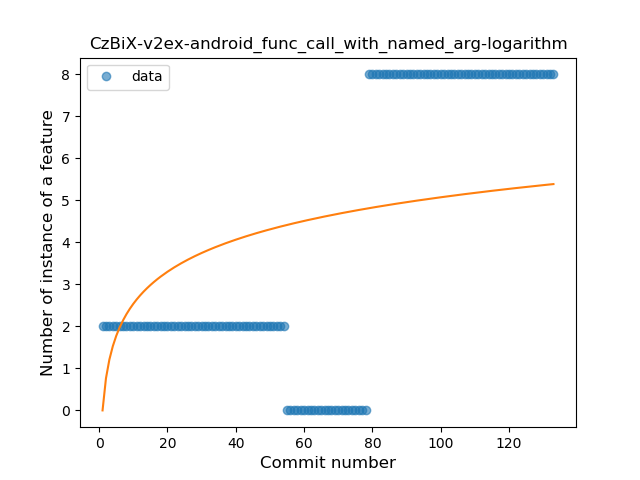
### <a name="data_class">Data Class</a>
----
#### Functions
* **Plateau Sudden Rise - Binary Sigmoid:** 
    * **R_Squared:** 0.89586642
* **Constant Rise - Linear:** 
    * **R_Squared:** 0.70943509
* **Sudden Rise Plateau - Logarithm:** 
    * **R_Squared:** 0.65364278

**Plots** :chart_with_upwards_trend:
-----

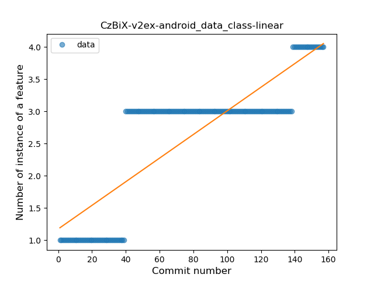

### <a name="extension_function">Extension Function</a>
----
#### Functions
* **Plateau Gradual Rise - Sigmoid:** 
    * **R_Squared:** 0.92795648
* **Constant Rise - Linear:** 
    * **R_Squared:** 0.61122521
* **Sudden Rise Plateau - Logarithm:** 
    * **R_Squared:** 0.56689091

**Plots** :chart_with_upwards_trend:
-----

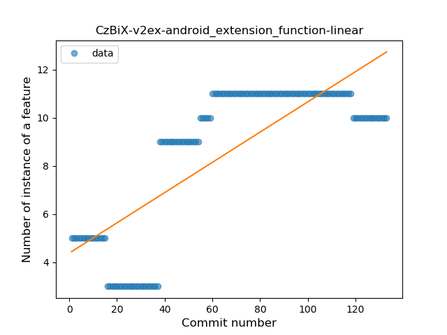
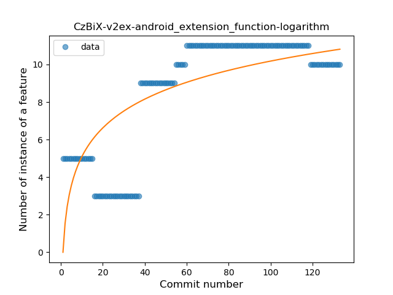
### <a name="destructuring_declaration">Destructuring Declaration</a>
----
#### Functions
* **Plateau Sudden Rise - Binary Sigmoid:** 
    * **R_Squared:** 1.0
* **Constant Rise - Linear:** 
    * **R_Squared:** 0.75
* **Sudden Rise Plateau - Logarithm:** 
    * **R_Squared:** 0.53114331

**Plots** :chart_with_upwards_trend:
-----

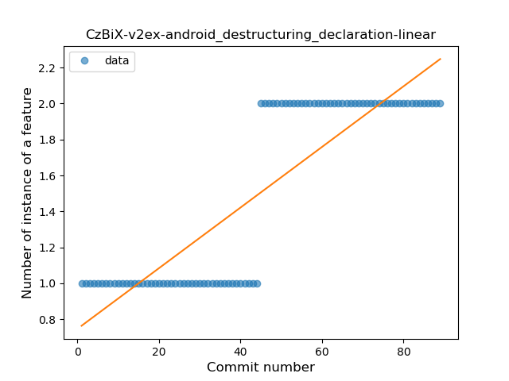
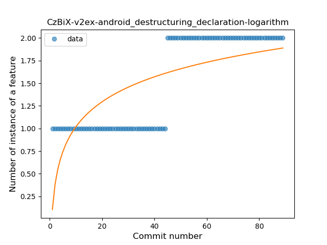
### <a name="inline_func">Inline Function</a>
----
#### Functions
* **Plateau Gradual Rise - Sigmoid:** 
    * **R_Squared:** 0.84757122
* **Constant Rise - Linear:** 
    * **R_Squared:** 0.6311486
* **Sudden Rise Plateau - Logarithm:** 
    * **R_Squared:** 0.5011965

**Plots** :chart_with_upwards_trend:
-----

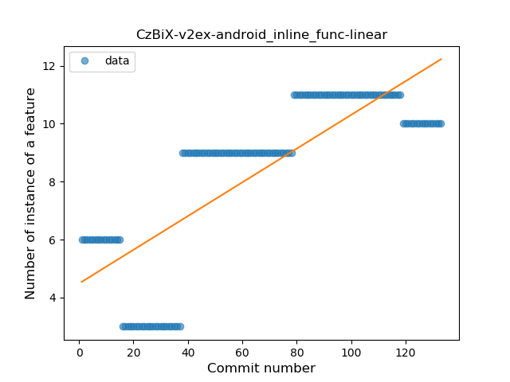
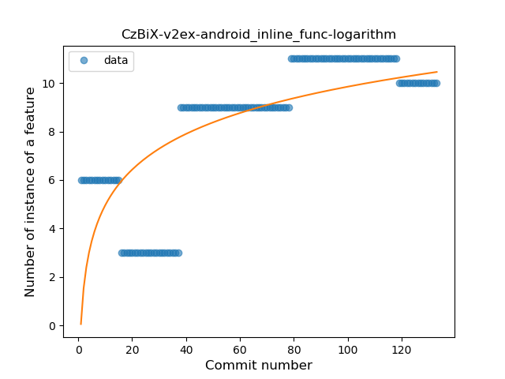
