## DSteve595-Put.io
----
#### Metrics provided by Detekt
* Number of lines of code 5808
* Number of Kotlin files: 53
* Cyclomatic complexity: 854
* Cyclomatic complexity by thousands of lines: 256 

----
**15** features analyzed

*	<a href="#type_inference">Type Inference</a> 
*	<a href="#lambda">Lambda</a> 
*	<a href="#safe_call">Safe Call</a> 
*	<a href="#when_expr">When expression</a> 
*	<a href="#companion_object">Companion Object</a> 
*	<a href="#unsafe_call">Unsafe Call</a> 
*	<a href="#string_template">String Template</a> 
*	<a href="#func_with_default_value">Function with Default Value</a> 
*	<a href="#smart_cast">Smart Cast</a> 
*	<a href="#range_expr">Range Expression</a> 
*	<a href="#func_call_with_named_arg">Function call with Named Argument</a> 
*	<a href="#data_class">Data Class</a> 
*	<a href="#extension_function">Extension Function</a> 
*	<a href="#property_delegation">Property Delegation</a> 
*	<a href="#destructuring_declaration">Destructuring Declaration</a> 

### <a name="type_inference">Type Inference</a>
----
#### Functions
* **Sudden Rise Plateau - Logarithm:** 
    * **R_Squared:** 0.9145533
* **Constant Rise - Linear:** 
    * **R_Squared:** 0.74909228

**Plots** :chart_with_upwards_trend:
-----

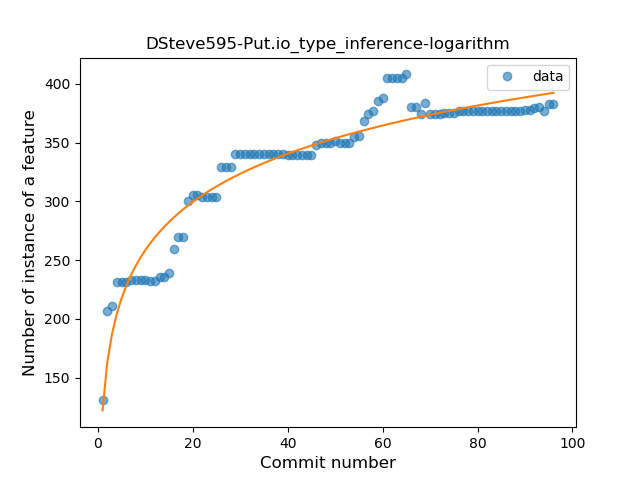
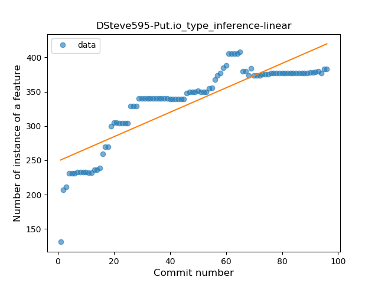
### <a name="lambda">Lambda</a>
----
#### Functions
* **Constant Rise - Linear:** 
    * **R_Squared:** 0.92491872
* **Sudden Rise Plateau - Logarithm:** 
    * **R_Squared:** 0.80904448

**Plots** :chart_with_upwards_trend:
-----

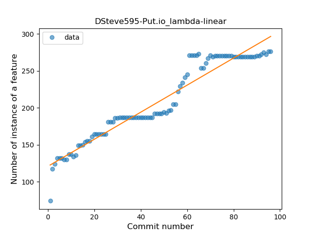
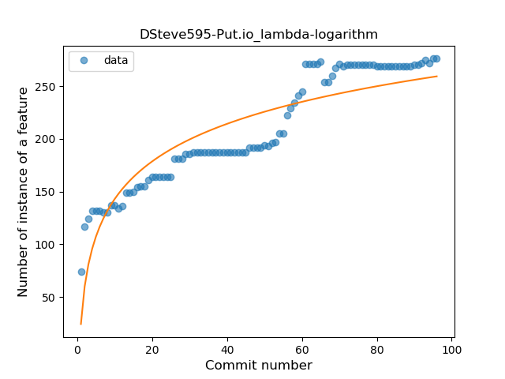
### <a name="safe_call">Safe Call</a>
----
#### Functions
* **Sudden Rise Plateau - Logarithm:** 
    * **R_Squared:** 0.88097689
* **Constant Rise - Linear:** 
    * **R_Squared:** 0.83353028

**Plots** :chart_with_upwards_trend:
-----

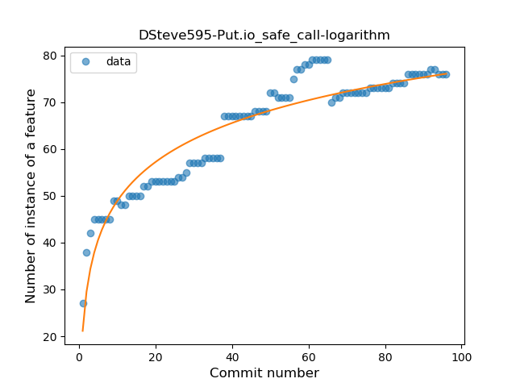
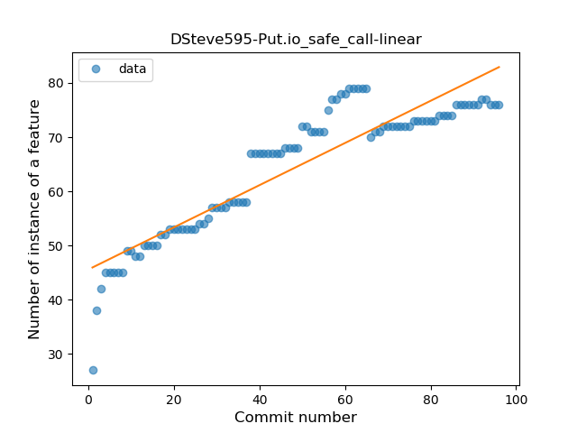
### <a name="when_expr">When expression</a>
----
#### Functions
* **Sudden Rise Plateau - Logarithm:** 
    * **R_Squared:** 0.93031151
* **Constant Rise - Linear:** 
    * **R_Squared:** 0.86317122

**Plots** :chart_with_upwards_trend:
-----

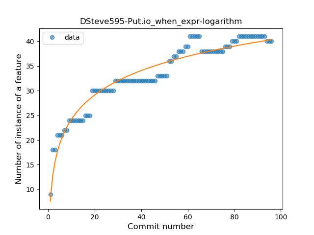
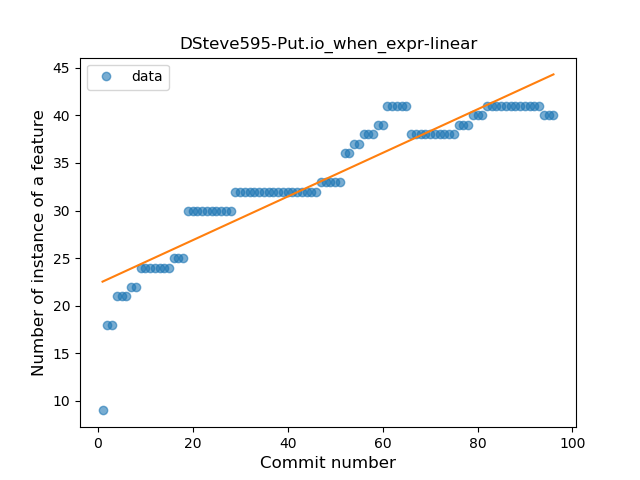
### <a name="companion_object">Companion Object</a>
----
#### Functions
* **Sudden Rise Plateau - Logarithm:** 
    * **R_Squared:** 0.88942287
* **Constant Rise - Linear:** 
    * **R_Squared:** 0.65058077

**Plots** :chart_with_upwards_trend:
-----

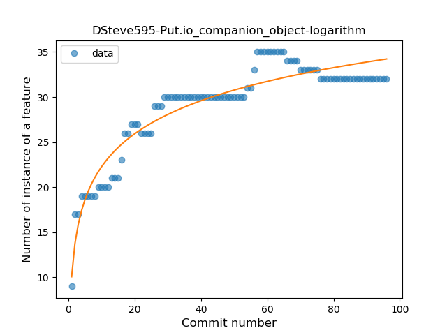
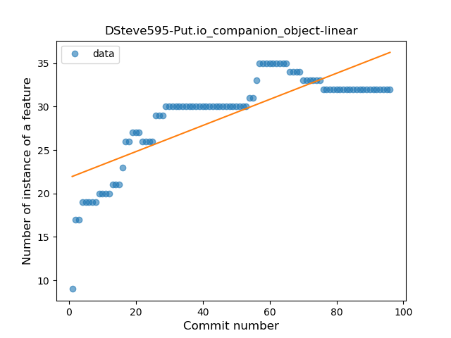
### <a name="unsafe_call">Unsafe Call</a>
----
#### Functions
* **Sudden Rise Plateau - Logarithm:** 
    * **R_Squared:** 0.82398389
* **Constant Rise - Linear:** 
    * **R_Squared:** 0.78609469
* **Plateau Sudden Rise - Binary Sigmoid:** 
    * **R_Squared:** 0.51063871

**Plots** :chart_with_upwards_trend:
-----

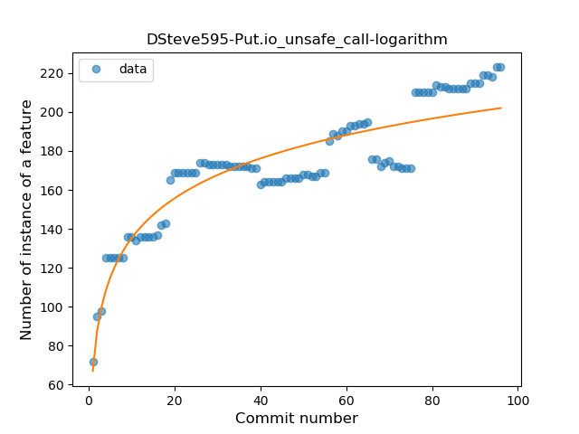
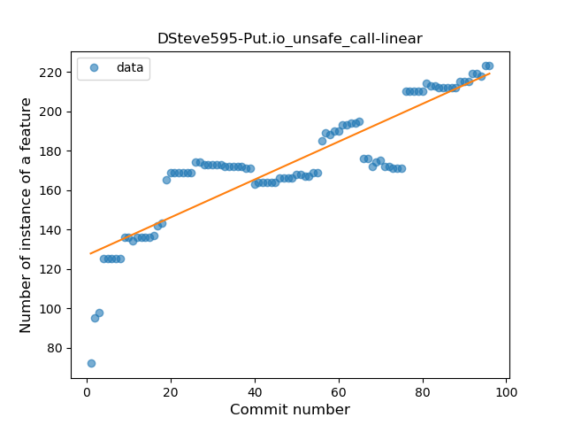
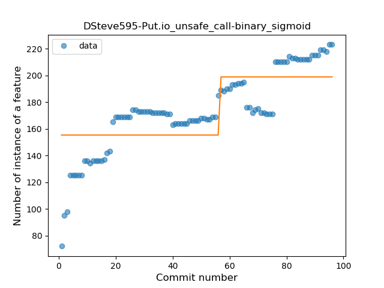
### <a name="string_template">String Template</a>
----
#### Functions
* **Plateau Gradual Rise - Sigmoid:** 
    * **R_Squared:** 0.94777368
* **Sudden Rise - Exponential:** 
    * **R_Squared:** 0.85813439
* **Constant Rise - Linear:** 
    * **R_Squared:** 0.84452668
* **Sudden Rise Plateau - Logarithm:** 
    * **R_Squared:** 0.59175717

**Plots** :chart_with_upwards_trend:
-----

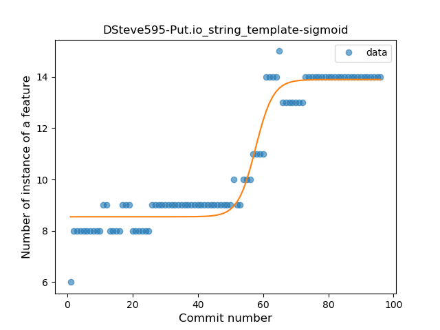
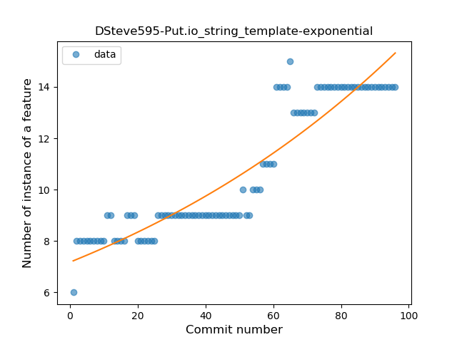
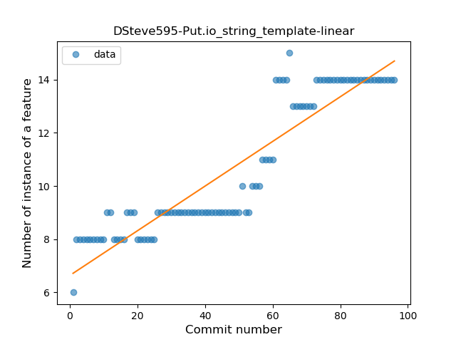
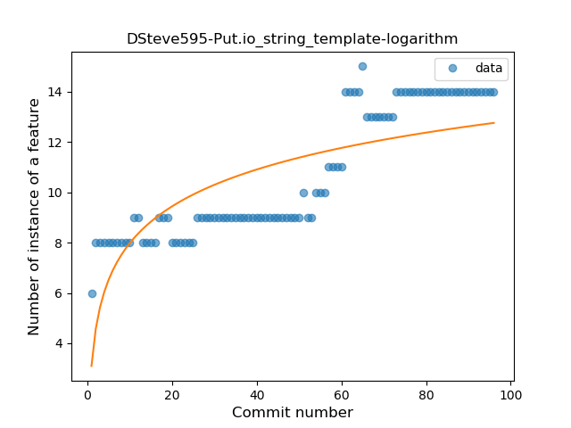
### <a name="func_with_default_value">Function with Default Value</a>
----
#### Functions
* **Constant Rise - Linear:** 
    * **R_Squared:** 0.84033836
* **Sudden Rise Plateau - Logarithm:** 
    * **R_Squared:** 0.80322421

**Plots** :chart_with_upwards_trend:
-----

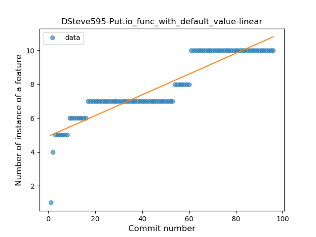
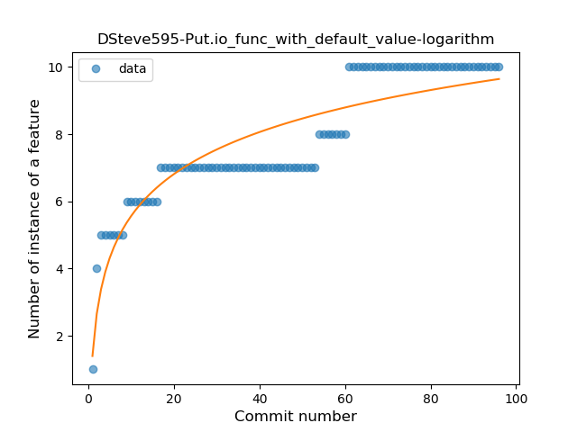
### <a name="smart_cast">Smart Cast</a>
----
#### Functions
* **Sudden Rise - Exponential:** 
    * **R_Squared:** 0.94099614
* **Constant Rise - Linear:** 
    * **R_Squared:** 0.92123513
* **Sudden Rise Plateau - Logarithm:** 
    * **R_Squared:** 0.57910945

**Plots** :chart_with_upwards_trend:
-----

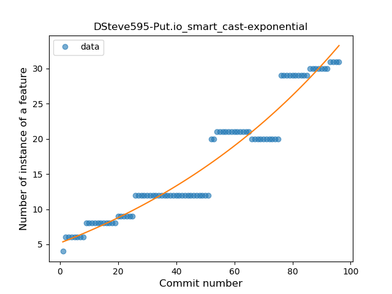
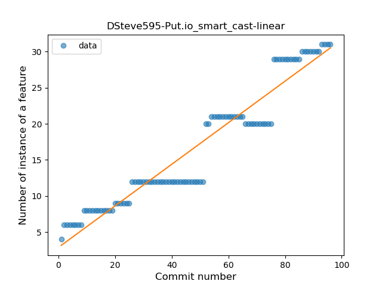
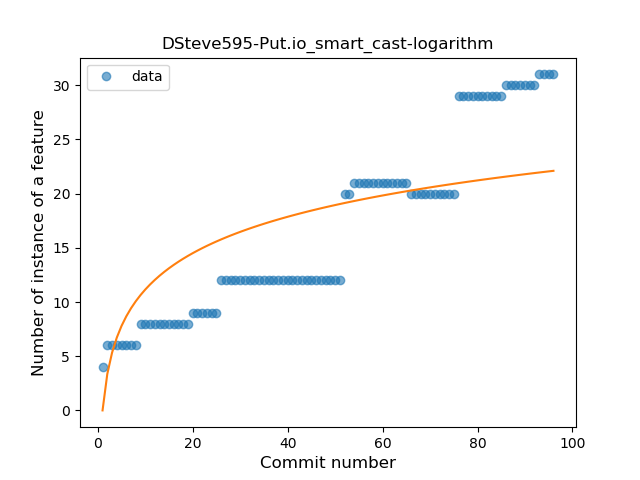
### <a name="range_expr">Range Expression</a>
----
#### Functions
* **Plateau Sudden Rise - Binary Sigmoid:** 
    * **R_Squared:** 1.0
* **Constant Rise - Linear:** 
    * **R_Squared:** 0.75
* **Sudden Rise Plateau - Logarithm:** 
    * **R_Squared:** 0.53893363

**Plots** :chart_with_upwards_trend:
-----

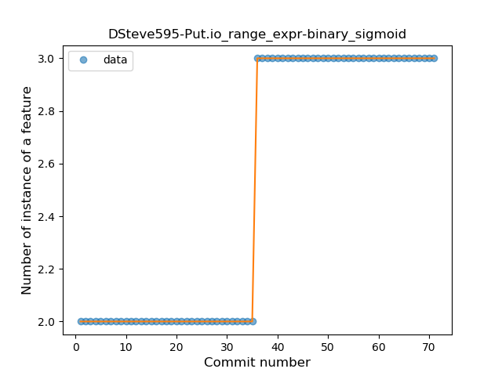
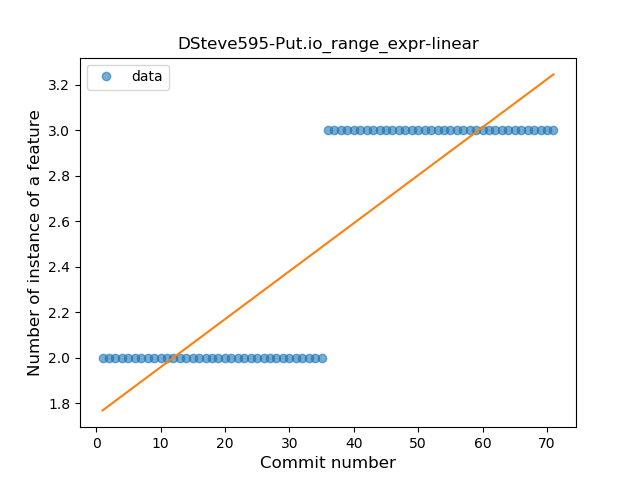
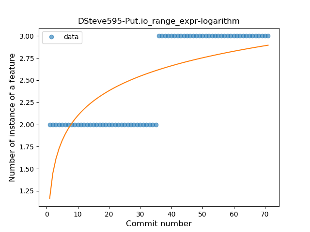
### <a name="func_call_with_named_arg">Function call with Named Argument</a>
----
#### Functions
* **Constant Rise - Linear:** 
    * **R_Squared:** 0.85287425
* **Sudden Rise Plateau - Logarithm:** 
    * **R_Squared:** 0.78372512

**Plots** :chart_with_upwards_trend:
-----

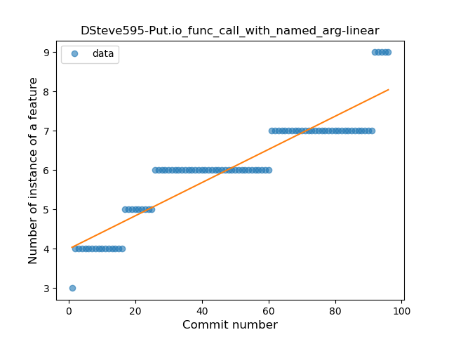
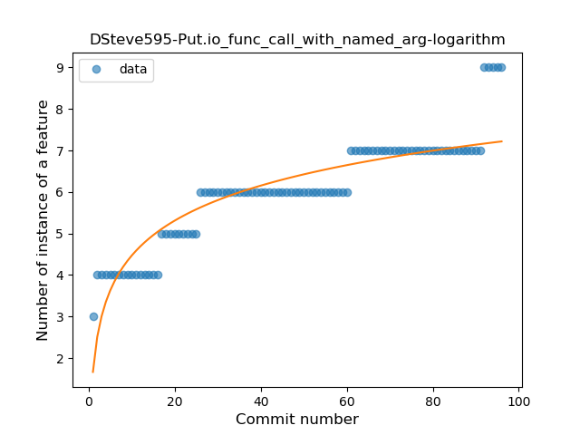
### <a name="data_class">Data Class</a>
----
#### Functions
* **Constant Rise - Linear:** 
    * **R_Squared:** 0.71281281
* **Sudden Rise - Exponential:** 
    * **R_Squared:** 0.71852373
* **Sudden Rise Plateau - Logarithm:** 
    * **R_Squared:** 0.56937059

**Plots** :chart_with_upwards_trend:
-----

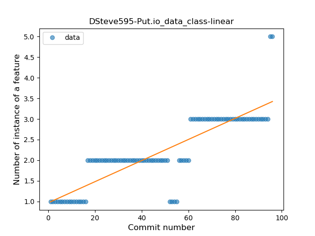
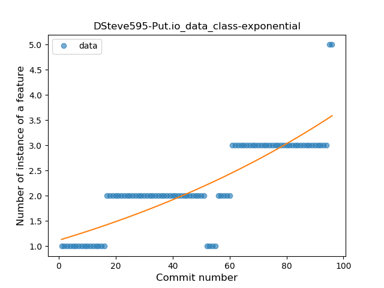
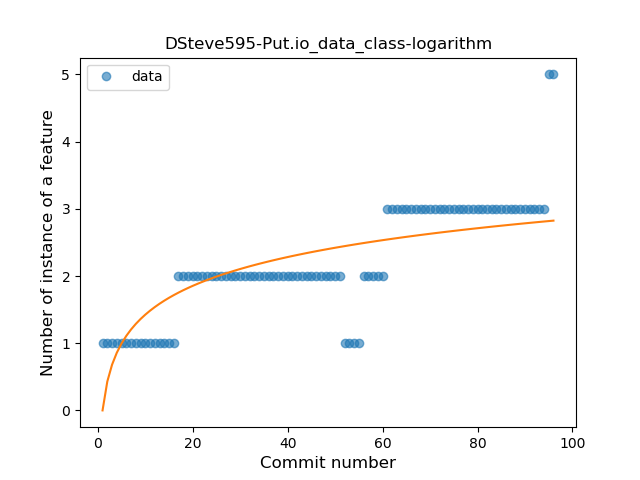
### <a name="extension_function">Extension Function</a>
----
#### Functions
* **Plateau Sudden Rise - Binary Sigmoid:** 
    * **R_Squared:** 0.89628427
* **Sudden Rise Plateau - Logarithm:** 
    * **R_Squared:** 0.66372235
* **Constant Rise - Linear:** 
    * **R_Squared:** 0.48030019

**Plots** :chart_with_upwards_trend:
-----

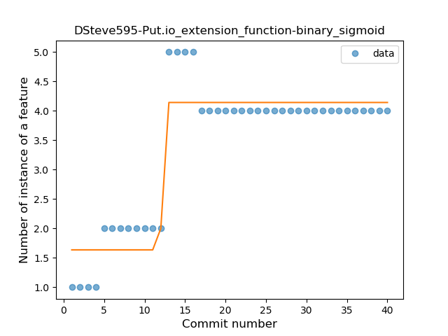

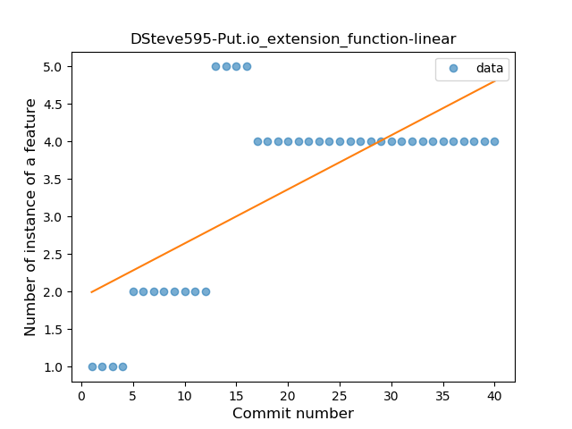
### <a name="property_delegation">Property Delegation</a>
----
#### Functions
* **Constant Rise - Linear:** 
    * **R_Squared:** 0.85045441
* **Sudden Rise Plateau - Logarithm:** 
    * **R_Squared:** 0.80674649

**Plots** :chart_with_upwards_trend:
-----

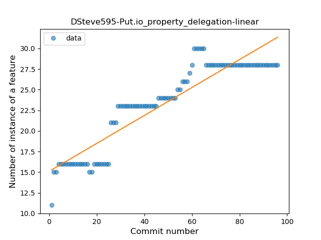
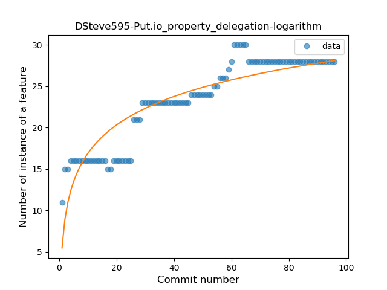
### <a name="destructuring_declaration">Destructuring Declaration</a>
----
#### Functions
* **Plateau Gradual Rise - Sigmoid:** 
    * **R_Squared:** 0.89448854
* **Constant Rise - Linear:** 
    * **R_Squared:** 0.87680656
* **Sudden Rise Plateau - Logarithm:** 
    * **R_Squared:** 0.725196

**Plots** :chart_with_upwards_trend:
-----

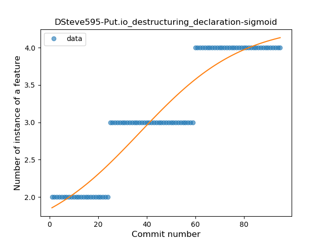
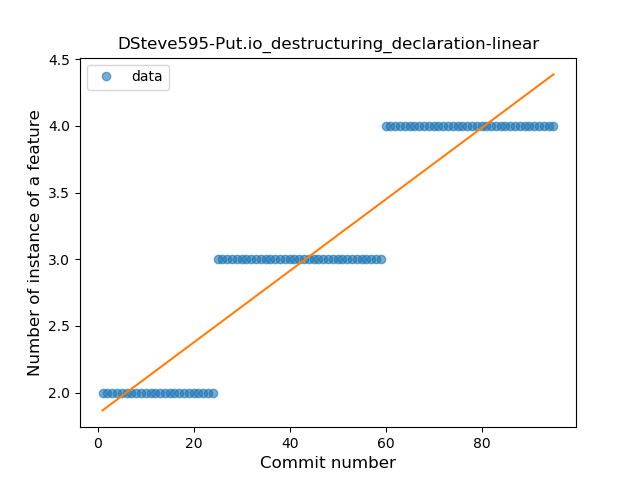
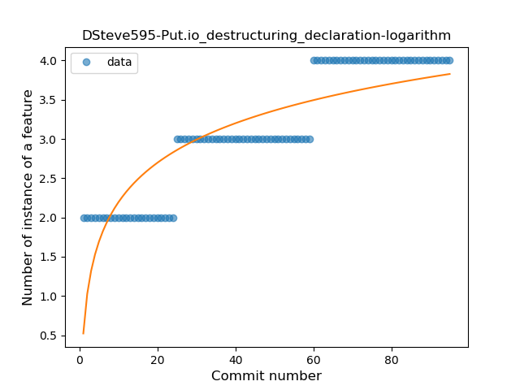
