## Depau-EtchDroid
----
#### Metrics provided by Detekt
* Number of lines of code 2331
* Number of Kotlin files: 45
* Cyclomatic complexity: 376
* Cyclomatic complexity by thousands of lines: 304 

----
**13** features analyzed

*	<a href="#type_inference">Type Inference</a> 
*	<a href="#lambda">Lambda</a> 
*	<a href="#safe_call">Safe Call</a> 
*	<a href="#when_expr">When expression</a> 
*	<a href="#unsafe_call">Unsafe Call</a> 
*	<a href="#string_template">String Template</a> 
*	<a href="#func_with_default_value">Function with Default Value</a> 
*	<a href="#smart_cast">Smart Cast</a> 
*	<a href="#range_expr">Range Expression</a> 
*	<a href="#func_call_with_named_arg">Function call with Named Argument</a> 
*	<a href="#data_class">Data Class</a> 
*	<a href="#extension_function">Extension Function</a> 
*	<a href="#destructuring_declaration">Destructuring Declaration</a> 

### <a name="type_inference">Type Inference</a>
----
#### Functions
* **Sudden Rise Plateau - Logarithm:** 
    * **R_Squared:** 0.90007002
* **Constant Rise - Linear:** 
    * **R_Squared:** 0.85938931

**Plots** :chart_with_upwards_trend:
-----

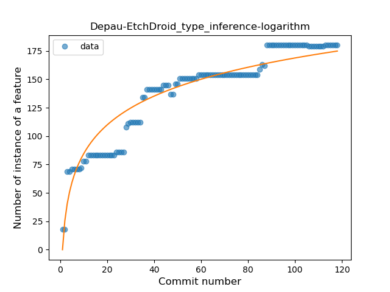
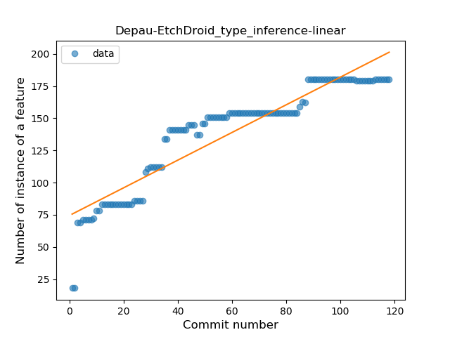
### <a name="lambda">Lambda</a>
----
#### Functions
* **Constant Rise - Linear:** 
    * **R_Squared:** 0.92956388
* **Plateau Gradual Rise - Sigmoid:** 
    * **R_Squared:** 0.93013699
* **Sudden Rise Plateau - Logarithm:** 
    * **R_Squared:** 0.7285239

**Plots** :chart_with_upwards_trend:
-----

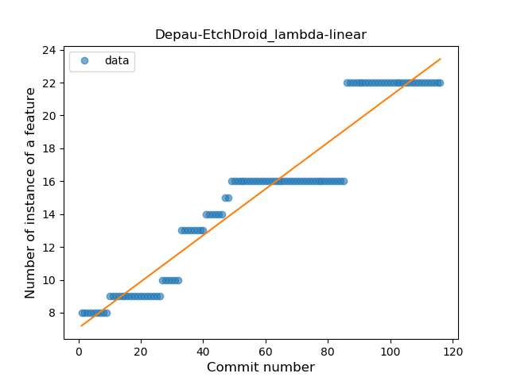
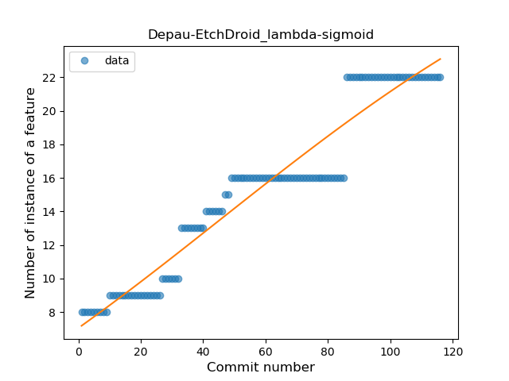
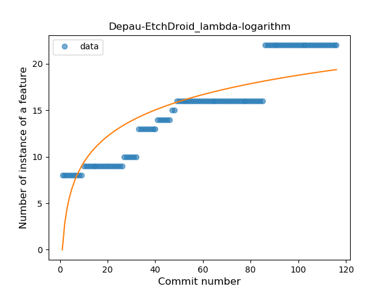
### <a name="safe_call">Safe Call</a>
----
#### Functions
* **Sudden Decline - Exponential:** 
    * **R_Squared:** 0.0354552
* **Constant Decline - Linear:** 
    * **R_Squared:** 0.01592017
* **Sudden Rise Plateau - Logarithm:** 
    * **R_Squared:** -0.0
* **Plateau Gradual Decline - Sigmoid:** 
    * **R_Squared:** 6.391e-05

**Plots** :chart_with_upwards_trend:
-----

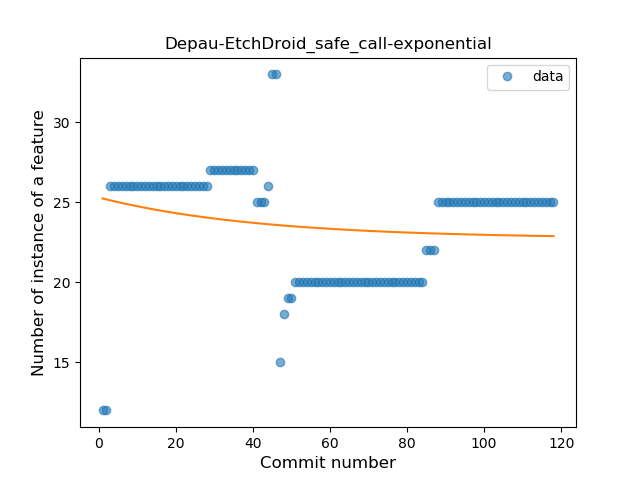
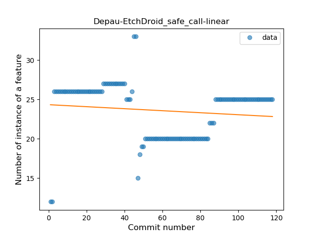

### <a name="when_expr">When expression</a>
----
#### Functions
* **Constant Rise - Linear:** 
    * **R_Squared:** 0.90140038
* **Sudden Rise Plateau - Logarithm:** 
    * **R_Squared:** 0.79920862

**Plots** :chart_with_upwards_trend:
-----

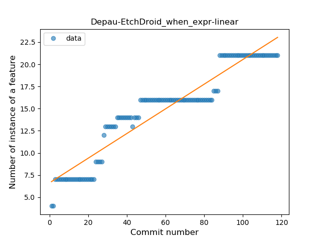
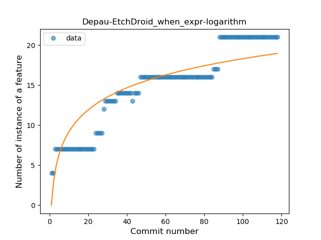
### <a name="unsafe_call">Unsafe Call</a>
----
#### Functions
* **Instability - Polinomial 3:** )
    * **R_Squared:** 0.61071743
* **Sudden Rise Plateau - Logarithm:** 
    * **R_Squared:** 0.49900397
* **Constant Rise - Linear:** 
    * **R_Squared:** 0.29541165
* **Plateau Sudden Rise - Binary Sigmoid:** 
    * **R_Squared:** 0.11820879

**Plots** :chart_with_upwards_trend:
-----

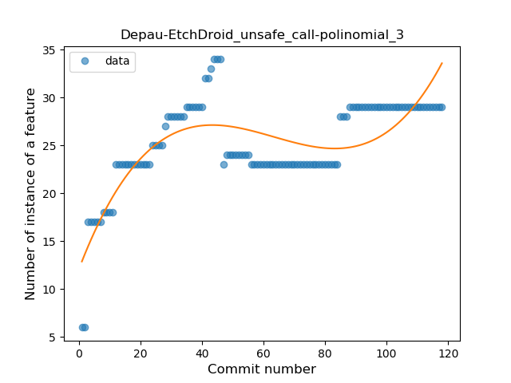
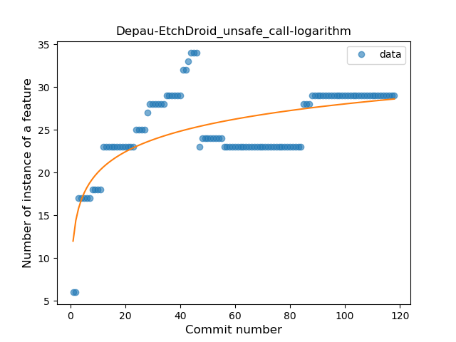
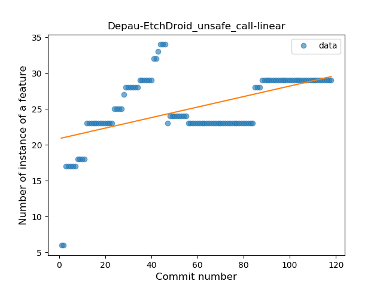
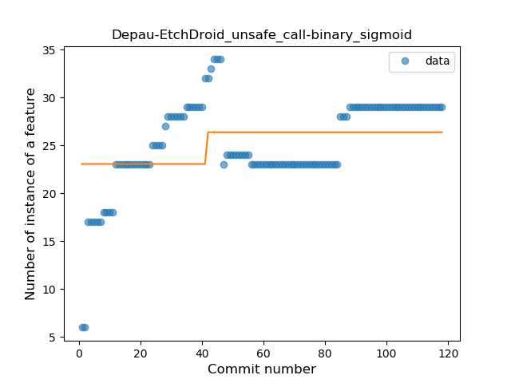
### <a name="string_template">String Template</a>
----
#### Functions
* **Sudden Rise Plateau - Logarithm:** 
    * **R_Squared:** 0.76917897
* **Plateau Sudden Rise - Binary Sigmoid:** 
    * **R_Squared:** 0.72991974
* **Constant Rise - Linear:** 
    * **R_Squared:** 0.38600566

**Plots** :chart_with_upwards_trend:
-----

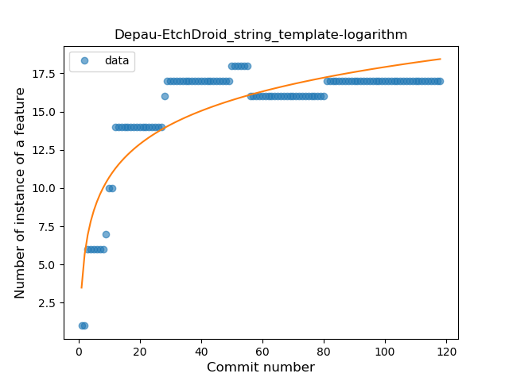

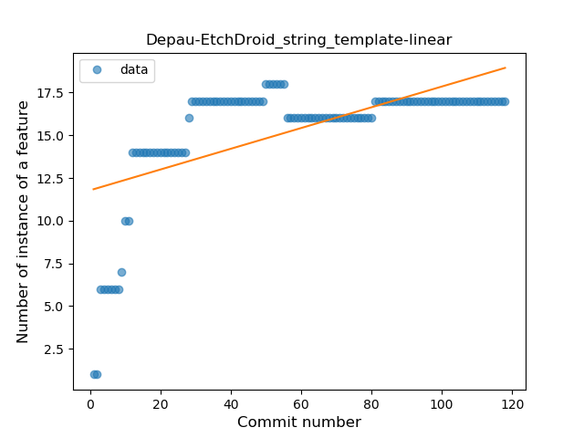
### <a name="func_with_default_value">Function with Default Value</a>
----
#### Functions
* **Sudden Rise Plateau - Logarithm:** 
    * **R_Squared:** 0.81246783
* **Constant Rise - Linear:** 
    * **R_Squared:** 0.75828305

**Plots** :chart_with_upwards_trend:
-----

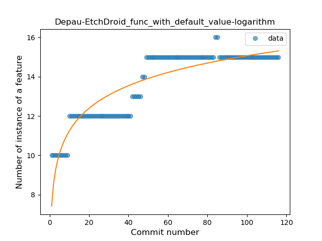
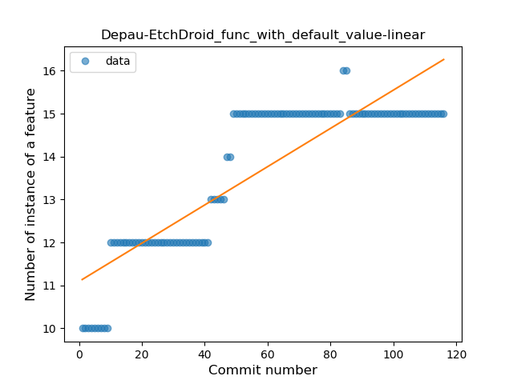
### <a name="smart_cast">Smart Cast</a>
----
#### Functions
* **Plateau Gradual Decline - Sigmoid:** 
    * **R_Squared:** 0.70158757
* **Constant Decline - Linear:** 
    * **R_Squared:** 0.38497554
* **Sudden Decline - Exponential:** 
    * **R_Squared:** 0.38511259
* **Sudden Rise Plateau - Logarithm:** 
    * **R_Squared:** -0.0

**Plots** :chart_with_upwards_trend:
-----

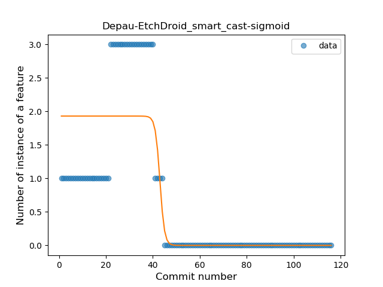
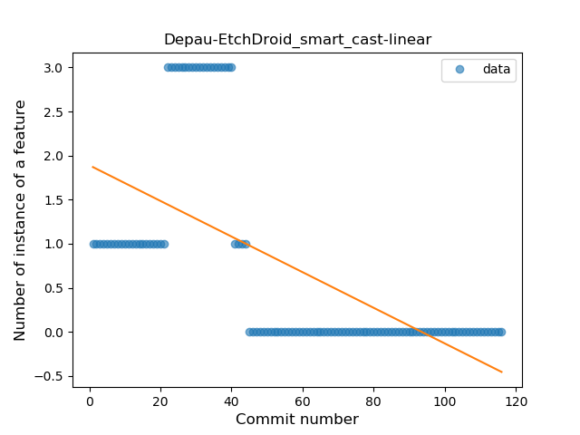
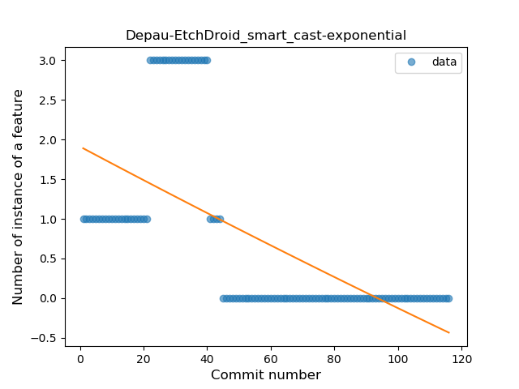
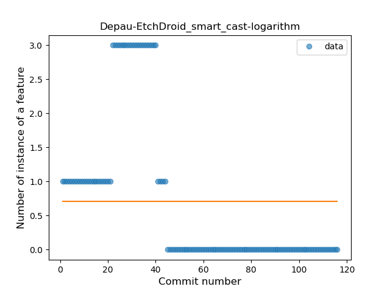
### <a name="range_expr">Range Expression</a>
----
#### Functions
* **Plateau Sudden Rise - Binary Sigmoid:** 
    * **R_Squared:** 0.92738375
* **Sudden Rise Plateau - Logarithm:** 
    * **R_Squared:** 0.76637329
* **Constant Rise - Linear:** 
    * **R_Squared:** 0.5332806

**Plots** :chart_with_upwards_trend:
-----

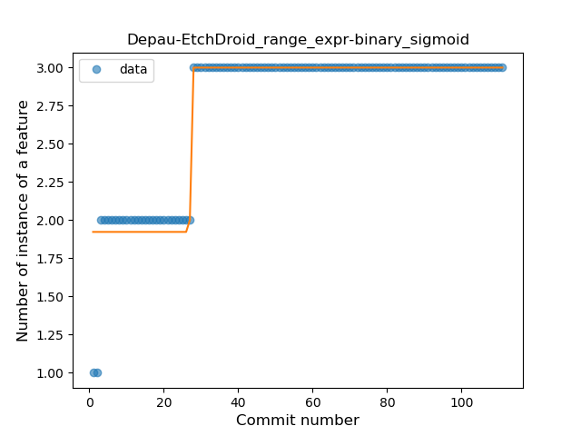
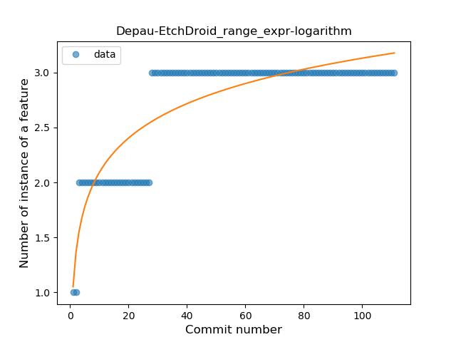
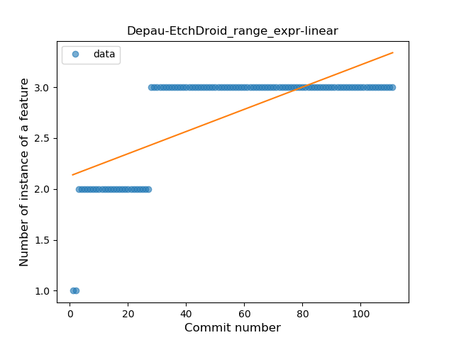
### <a name="func_call_with_named_arg">Function call with Named Argument</a>
----
#### Functions
* **Plateau Sudden Rise - Binary Sigmoid:** 
    * **R_Squared:** 1.0
* **Instability - Polinomial 3:** )
    * **R_Squared:** 0.8508975
* **Sudden Rise - Exponential:** 
    * **R_Squared:** 0.75124966
* **Constant Rise - Linear:** 
    * **R_Squared:** 0.74035517
* **Sudden Rise Plateau - Logarithm:** 
    * **R_Squared:** 0.41502738

**Plots** :chart_with_upwards_trend:
-----

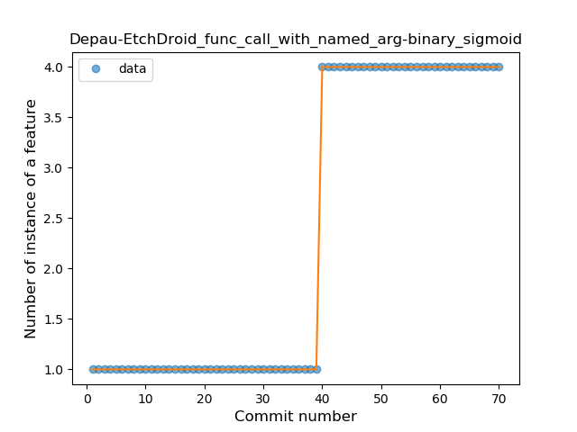

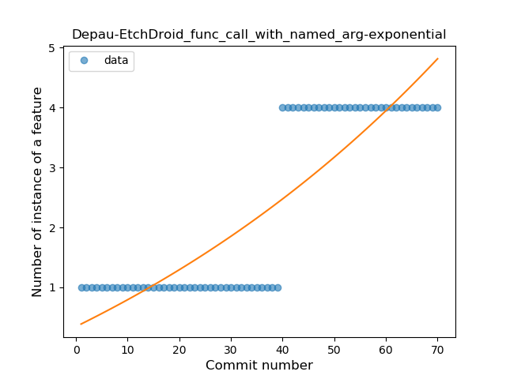
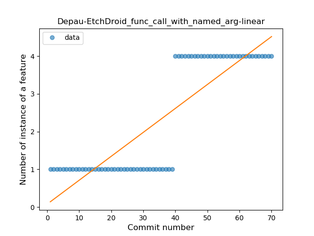
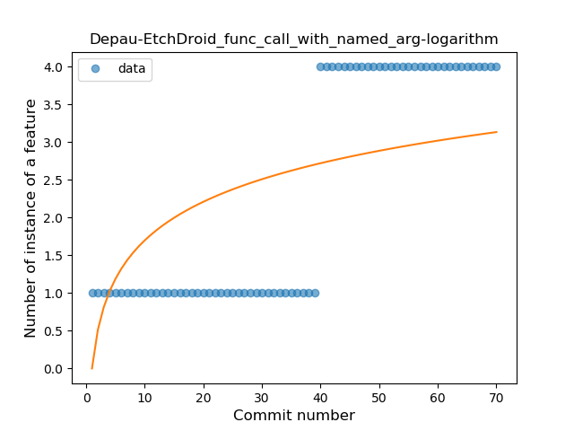
### <a name="data_class">Data Class</a>
----
#### Functions
* **Plateau Sudden Rise - Binary Sigmoid:** 
    * **R_Squared:** 1.0
* **Sudden Rise Plateau - Logarithm:** 
    * **R_Squared:** 0.67085511
* **Constant Rise - Linear:** 
    * **R_Squared:** 0.43478261

**Plots** :chart_with_upwards_trend:
-----

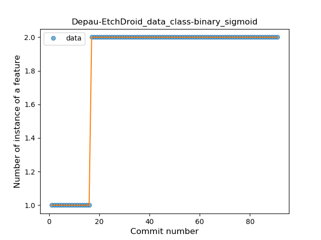
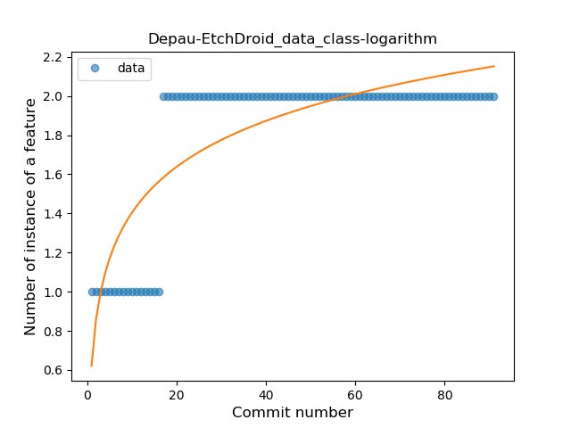
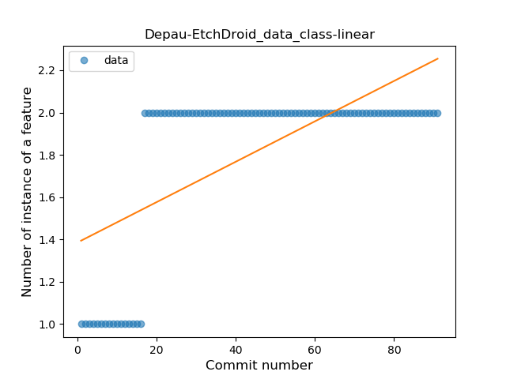
### <a name="extension_function">Extension Function</a>
----
#### Functions
* **Sudden Rise Plateau - Logarithm:** 
    * **R_Squared:** 0.82865101
* **Constant Rise - Linear:** 
    * **R_Squared:** 0.69794269

**Plots** :chart_with_upwards_trend:
-----

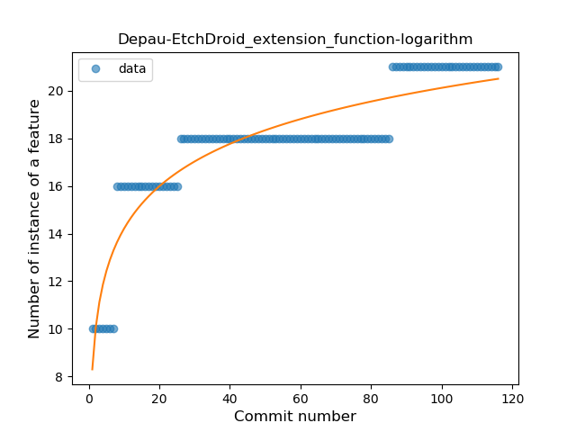
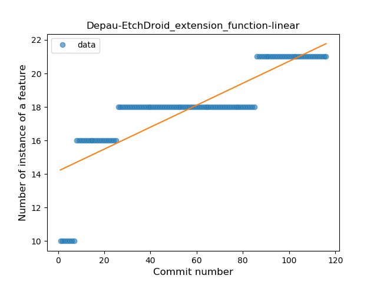
### <a name="destructuring_declaration">Destructuring Declaration</a>
----
#### Functions
* **Plateau Sudden Rise - Binary Sigmoid:** 
    * **R_Squared:** 1.0
* **Sudden Rise Plateau - Logarithm:** 
    * **R_Squared:** 0.53529377
* **Constant Rise - Linear:** 
    * **R_Squared:** 0.21304348

**Plots** :chart_with_upwards_trend:
-----

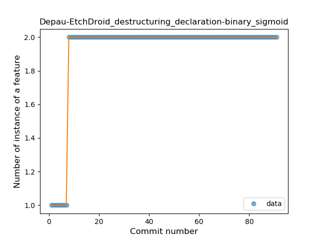
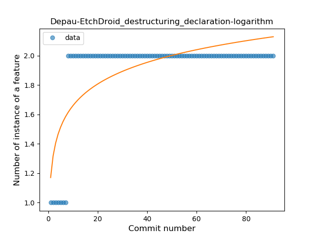
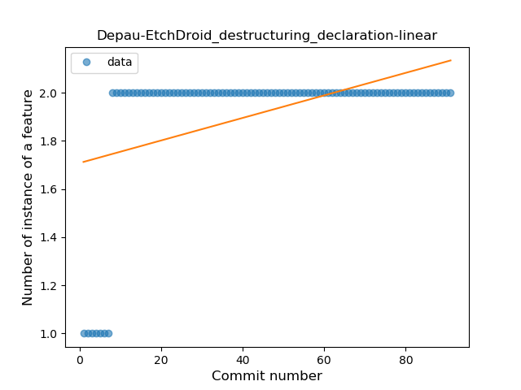
