## Doctoror-ParticleConstellationsLiveWallpaper
----
#### Metrics provided by Detekt
* Number of lines of code 15888
* Number of Kotlin files: 215
* Cyclomatic complexity: 1187
* Cyclomatic complexity by thousands of lines: 191 

----
**17** features analyzed

*	<a href="#type_inference">Type Inference</a> 
*	<a href="#lambda">Lambda</a> 
*	<a href="#safe_call">Safe Call</a> 
*	<a href="#when_expr">When expression</a> 
*	<a href="#companion_object">Companion Object</a> 
*	<a href="#unsafe_call">Unsafe Call</a> 
*	<a href="#string_template">String Template</a> 
*	<a href="#func_with_default_value">Function with Default Value</a> 
*	<a href="#singleton">Singleton</a> 
*	<a href="#smart_cast">Smart Cast</a> 
*	<a href="#range_expr">Range Expression</a> 
*	<a href="#func_call_with_named_arg">Function call with Named Argument</a> 
*	<a href="#data_class">Data Class</a> 
*	<a href="#extension_function">Extension Function</a> 
*	<a href="#property_delegation">Property Delegation</a> 
*	<a href="#destructuring_declaration">Destructuring Declaration</a> 
*	<a href="#inline_func">Inline Function</a> 

### <a name="type_inference">Type Inference</a>
----
#### Functions
* **Constant Rise - Linear:** 
    * **R_Squared:** 0.96188687
* **Sudden Rise Plateau - Logarithm:** 
    * **R_Squared:** 0.56353934
* **Plateau Sudden Rise - Binary Sigmoid:** 
    * **R_Squared:** 0.25279204

**Plots** :chart_with_upwards_trend:
-----

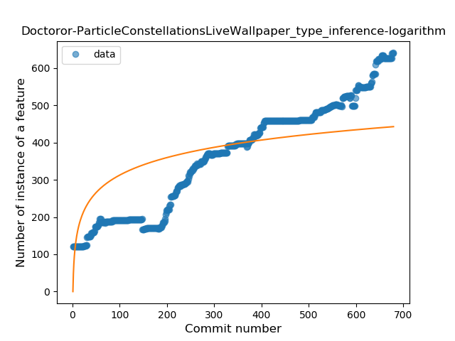
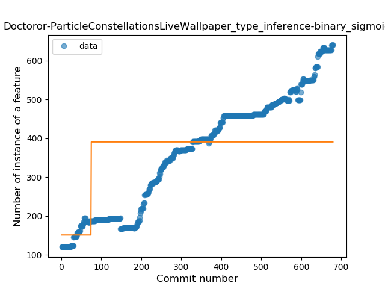
### <a name="lambda">Lambda</a>
----
#### Functions
* **Sudden Rise - Exponential:** 
    * **R_Squared:** 0.96957204
* **Constant Rise - Linear:** 
    * **R_Squared:** 0.85762936
* **Sudden Rise Plateau - Logarithm:** 
    * **R_Squared:** 0.33489037
* **Plateau Sudden Rise - Binary Sigmoid:** 
    * **R_Squared:** 0.07336517

**Plots** :chart_with_upwards_trend:
-----

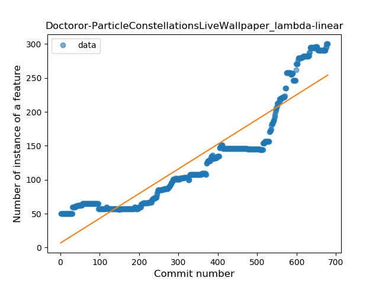

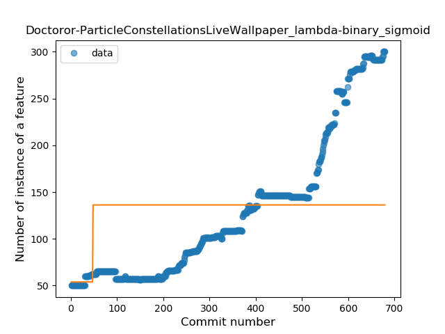
### <a name="safe_call">Safe Call</a>
----
#### Functions
* **Sudden Rise - Exponential:** 
    * **R_Squared:** 0.78205048
* **Constant Rise - Linear:** 
    * **R_Squared:** 0.7710768
* **Sudden Rise Plateau - Logarithm:** 
    * **R_Squared:** 0.60049789

**Plots** :chart_with_upwards_trend:
-----

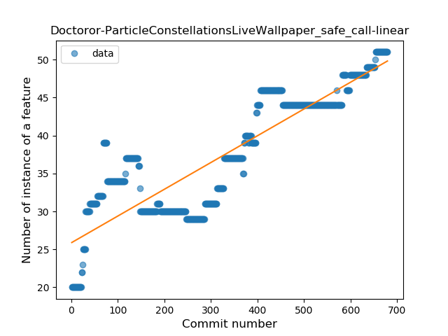
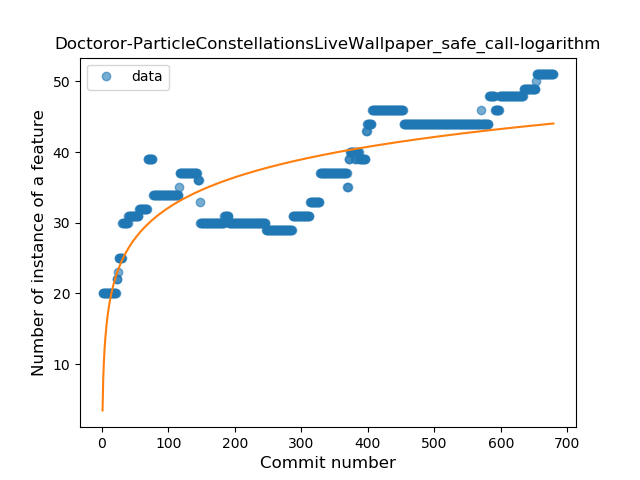
### <a name="when_expr">When expression</a>
----
#### Functions
* **Sudden Rise - Exponential:** 
    * **R_Squared:** 0.74534485
* **Constant Rise - Linear:** 
    * **R_Squared:** 0.4685318
* **Sudden Rise Plateau - Logarithm:** 
    * **R_Squared:** 0.28751314
* **Plateau Gradual Rise - Sigmoid:** 
    * **R_Squared:** 0.12991991

**Plots** :chart_with_upwards_trend:
-----

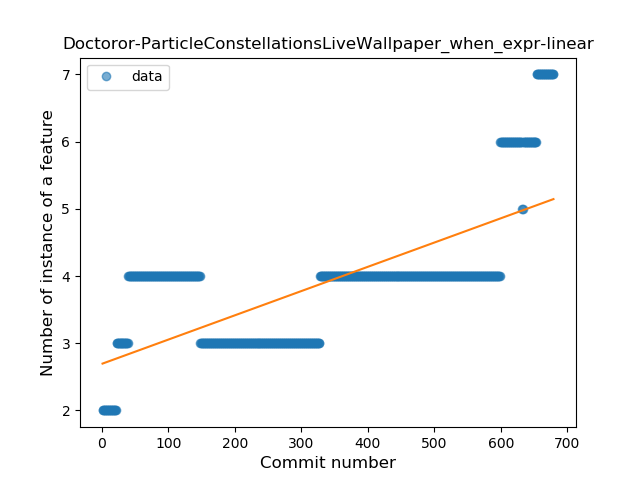
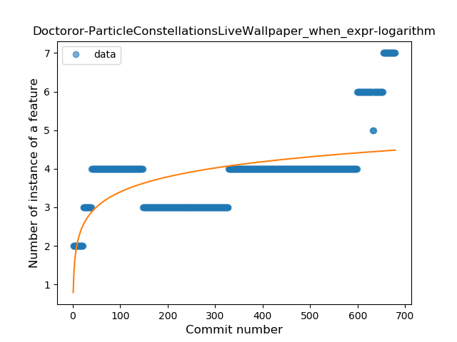
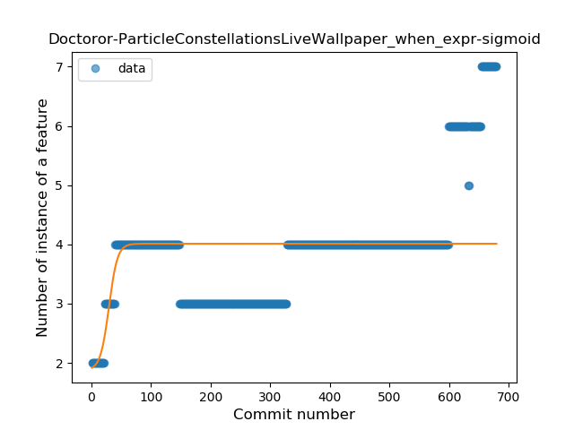
### <a name="companion_object">Companion Object</a>
----
#### Functions
* **Plateau Gradual Decline - Sigmoid:** 
    * **R_Squared:** 0.79219704
* **Sudden Decline - Exponential:** 
    * **R_Squared:** 0.6476419
* **Constant Decline - Linear:** 
    * **R_Squared:** 0.53502852
* **Sudden Rise Plateau - Logarithm:** 
    * **R_Squared:** 0.0

**Plots** :chart_with_upwards_trend:
-----

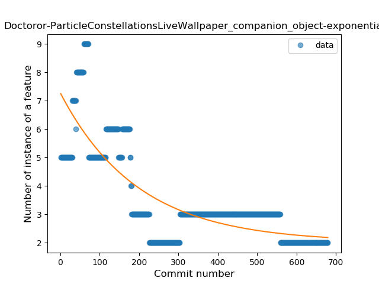
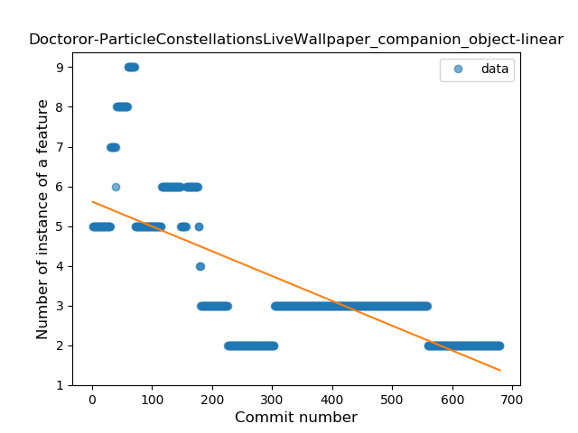
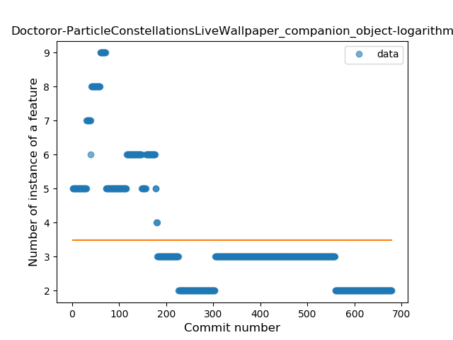
### <a name="unsafe_call">Unsafe Call</a>
----
#### Functions
* **Constant Rise - Linear:** 
    * **R_Squared:** 0.00908067
* **Sudden Rise - Exponential:** 
    * **R_Squared:** 0.00905973
* **Sudden Rise Plateau - Logarithm:** 
    * **R_Squared:** 0.00443116

**Plots** :chart_with_upwards_trend:
-----

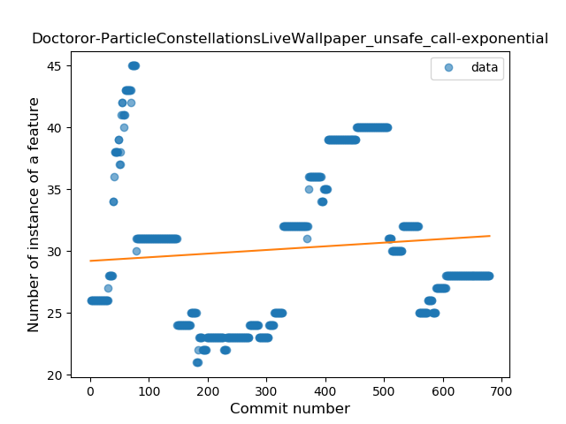
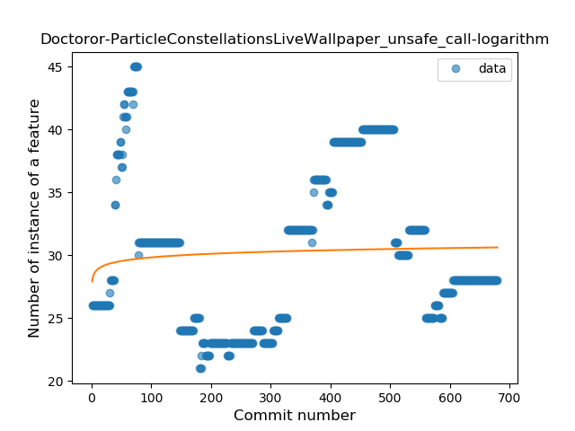
### <a name="string_template">String Template</a>
----
#### Functions
* **Plateau Gradual Rise - Sigmoid:** 
    * **R_Squared:** 0.84527731
* **Constant Rise - Linear:** 
    * **R_Squared:** 0.74365501
* **Sudden Rise Plateau - Logarithm:** 
    * **R_Squared:** 0.66940968

**Plots** :chart_with_upwards_trend:
-----

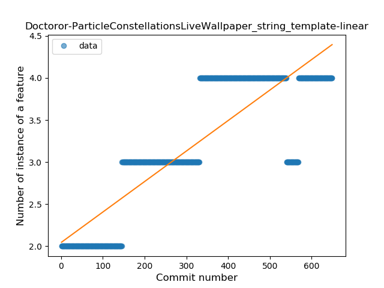
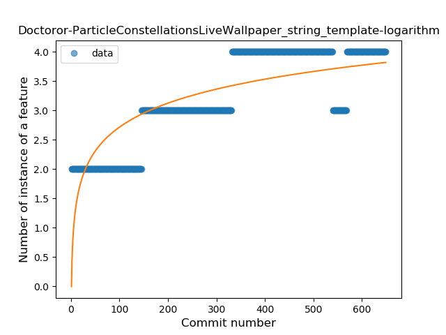
### <a name="func_with_default_value">Function with Default Value</a>
----
#### Functions
* **Constant Rise - Linear:** 
    * **R_Squared:** 0.85429764
* **Sudden Rise - Exponential:** 
    * **R_Squared:** 0.85598997
* **Sudden Rise Plateau - Logarithm:** 
    * **R_Squared:** 0.64257543

**Plots** :chart_with_upwards_trend:
-----

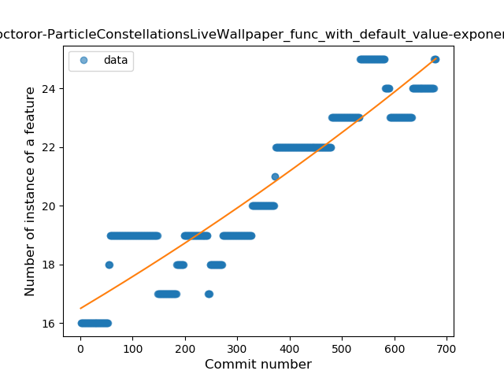
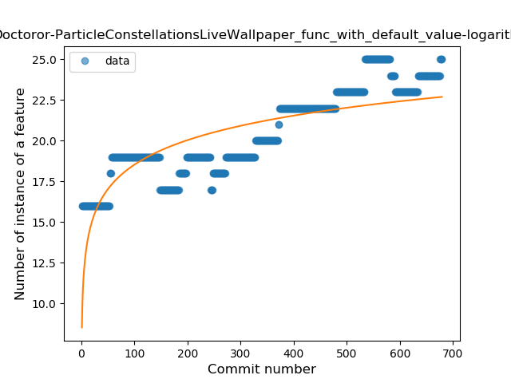
### <a name="singleton">Singleton</a>
----
#### Functions
* **Sudden Rise - Exponential:** 
    * **R_Squared:** 0.01620101
* **Constant Rise - Linear:** 
    * **R_Squared:** 0.00311715
* **Sudden Rise Plateau - Logarithm:** 
    * **R_Squared:** -0.0

**Plots** :chart_with_upwards_trend:
-----

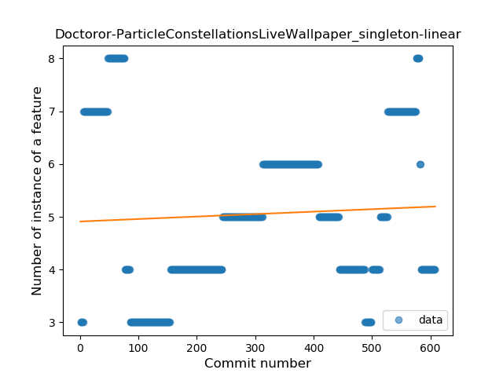
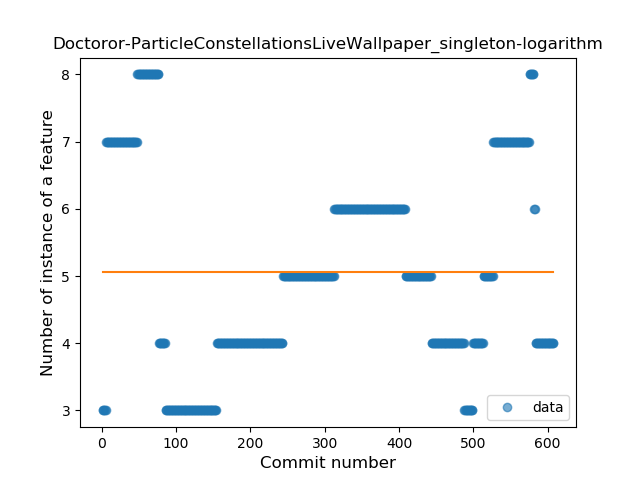
### <a name="smart_cast">Smart Cast</a>
----
#### Functions
* **Constant Rise - Linear:** 
    * **R_Squared:** 0.85519403
* **Sudden Rise Plateau - Logarithm:** 
    * **R_Squared:** 0.73521376
* **Plateau Gradual Rise - Sigmoid:** 
    * **R_Squared:** 0.34323516

**Plots** :chart_with_upwards_trend:
-----

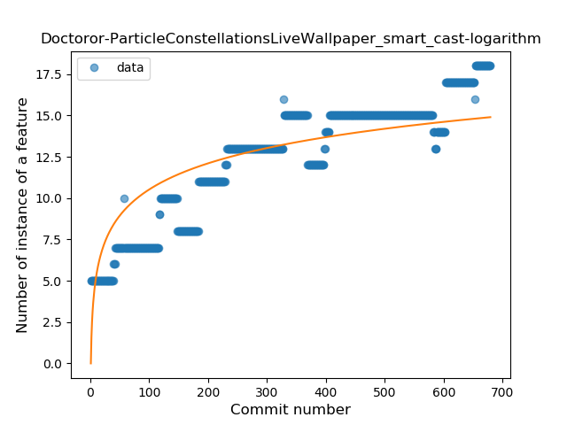
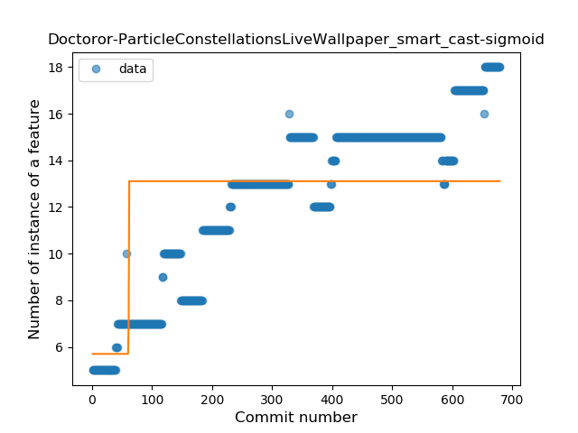
### <a name="range_expr">Range Expression</a>
----
#### Functions
* **Sudden Rise - Exponential:** 
    * **R_Squared:** 0.86599126
* **Constant Rise - Linear:** 
    * **R_Squared:** 0.81111383
* **Sudden Rise Plateau - Logarithm:** 
    * **R_Squared:** 0.39916244

**Plots** :chart_with_upwards_trend:
-----

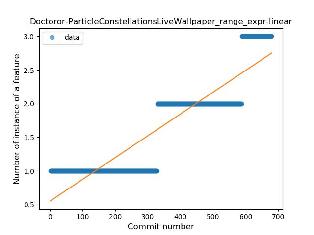
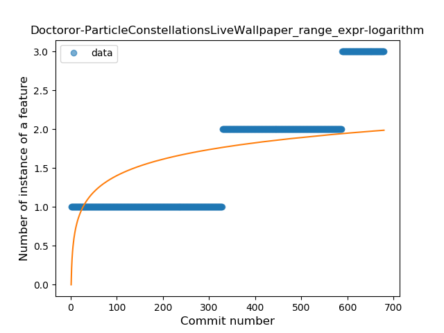
### <a name="func_call_with_named_arg">Function call with Named Argument</a>
----
#### Functions
* **Sudden Rise - Exponential:** 
    * **R_Squared:** 0.8716069
* **Constant Rise - Linear:** 
    * **R_Squared:** 0.63871197
* **Sudden Rise Plateau - Logarithm:** 
    * **R_Squared:** 0.11881285

**Plots** :chart_with_upwards_trend:
-----

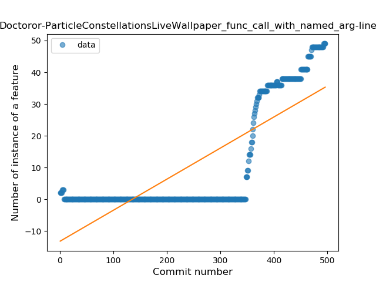
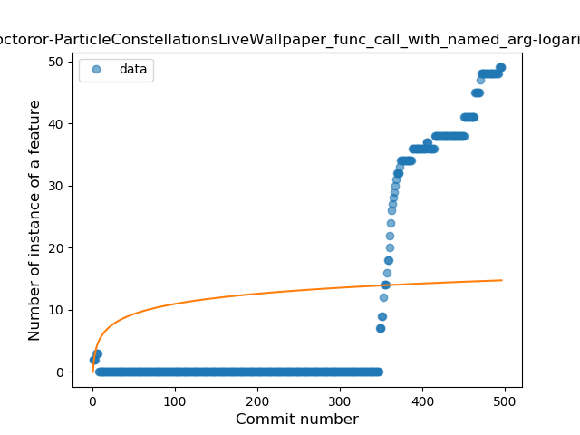
### <a name="data_class">Data Class</a>
----
#### Functions
* **Plateau Gradual Rise - Sigmoid:** 
    * **R_Squared:** 0.9378608
* **Sudden Rise - Exponential:** 
    * **R_Squared:** 0.88275051
* **Constant Rise - Linear:** 
    * **R_Squared:** 0.76164712
* **Sudden Rise Plateau - Logarithm:** 
    * **R_Squared:** 0.27948158

**Plots** :chart_with_upwards_trend:
-----

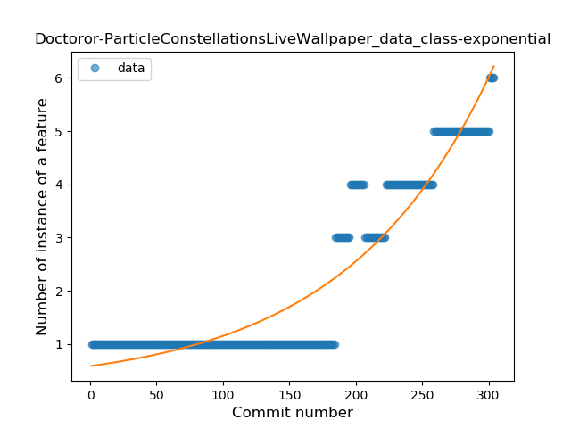
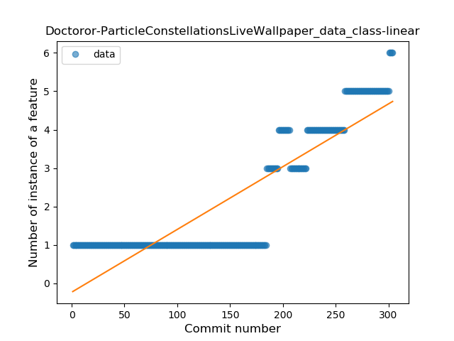

### <a name="extension_function">Extension Function</a>
----
#### Functions
* **Constant Rise - Linear:** 
    * **R_Squared:** 0.61751586
* **Sudden Rise - Exponential:** 
    * **R_Squared:** 0.62273386
* **Sudden Rise Plateau - Logarithm:** 
    * **R_Squared:** 0.58304326

**Plots** :chart_with_upwards_trend:
-----

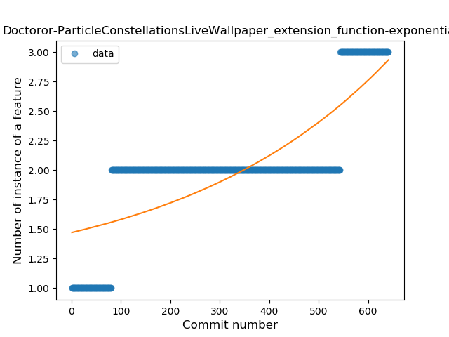
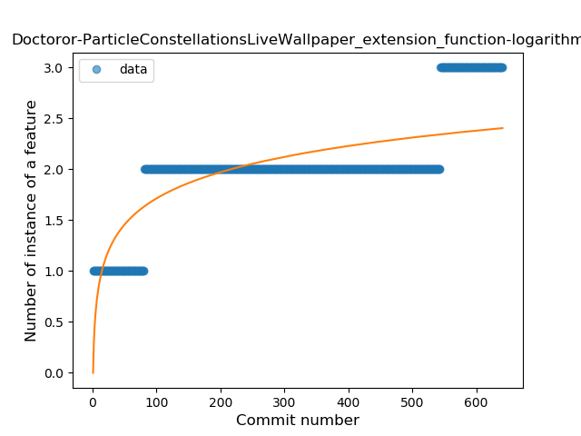
### <a name="property_delegation">Property Delegation</a>
----
#### Functions
* **Instability - Polinomial 3:** )
    * **R_Squared:** 0.69278787
* **Sudden Rise Plateau - Logarithm:** 
    * **R_Squared:** 0.42523348
* **Constant Rise - Linear:** 
    * **R_Squared:** 0.11211577
* **Plateau Gradual Rise - Sigmoid:** 
    * **R_Squared:** 0.00037929

**Plots** :chart_with_upwards_trend:
-----

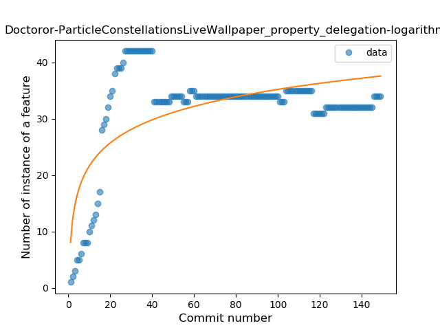
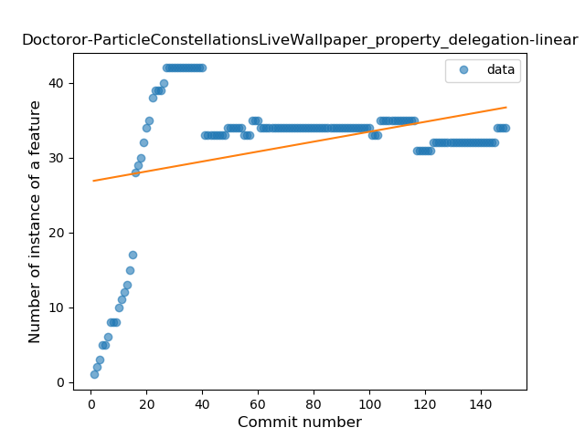

### <a name="destructuring_declaration">Destructuring Declaration</a>
----
#### Functions
* **Plateau Gradual Rise - Sigmoid:** 
    * **R_Squared:** 0.94204772
* **Sudden Rise - Exponential:** 
    * **R_Squared:** 0.91156492
* **Constant Rise - Linear:** 
    * **R_Squared:** 0.26689463
* **Sudden Rise Plateau - Logarithm:** 
    * **R_Squared:** 0.10075197

**Plots** :chart_with_upwards_trend:
-----

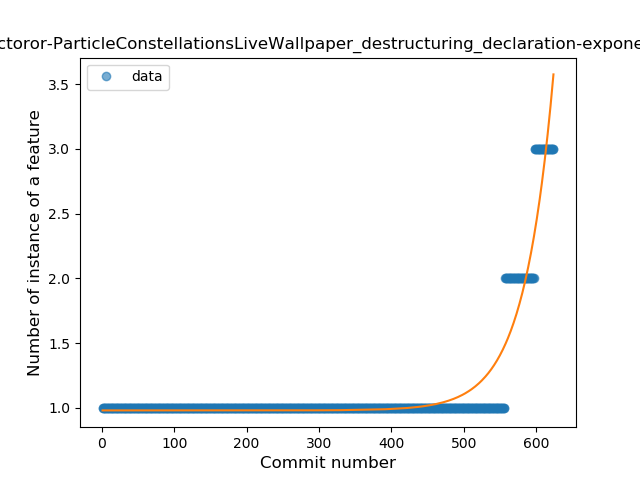
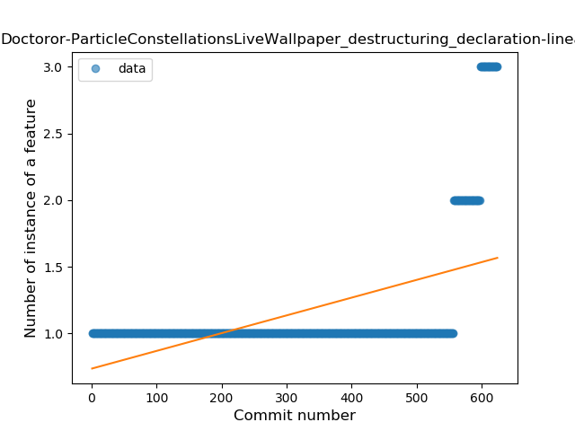
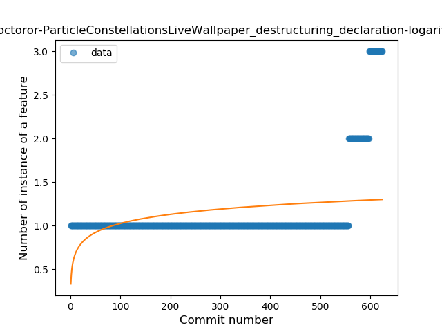
### <a name="inline_func">Inline Function</a>
----
#### Functions
* **Plateau Gradual Rise - Sigmoid:** 
    * **R_Squared:** 0.75508056
* **Constant Rise - Linear:** 
    * **R_Squared:** 0.67468122
* **Sudden Rise Plateau - Logarithm:** 
    * **R_Squared:** 0.43367598

**Plots** :chart_with_upwards_trend:
-----

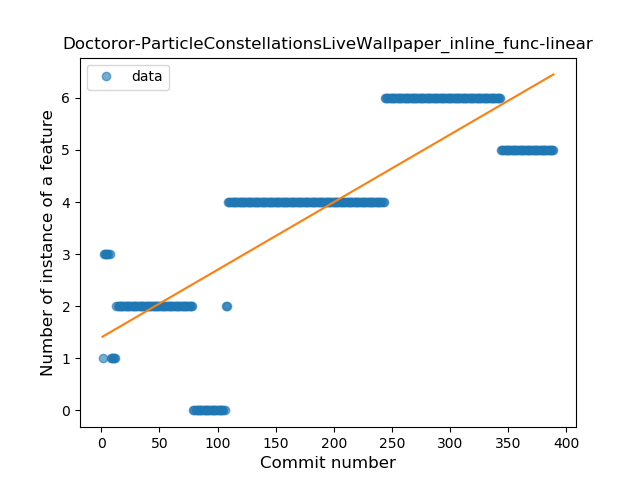
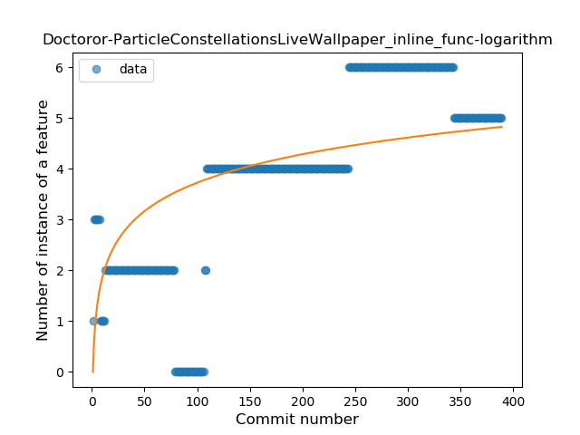
