## EventFahrplan-EventFahrplan
----
#### Metrics provided by Detekt
* Number of lines of code 2949
* Number of Kotlin files: 67
* Cyclomatic complexity: 311
* Cyclomatic complexity by thousands of lines: 175 

----
**11** features analyzed

*	<a href="#type_inference">Type Inference</a> 
*	<a href="#lambda">Lambda</a> 
*	<a href="#safe_call">Safe Call</a> 
*	<a href="#when_expr">When expression</a> 
*	<a href="#companion_object">Companion Object</a> 
*	<a href="#string_template">String Template</a> 
*	<a href="#func_with_default_value">Function with Default Value</a> 
*	<a href="#singleton">Singleton</a> 
*	<a href="#func_call_with_named_arg">Function call with Named Argument</a> 
*	<a href="#data_class">Data Class</a> 
*	<a href="#extension_function">Extension Function</a> 

### <a name="type_inference">Type Inference</a>
----
#### Functions
* **Constant Rise - Linear:** 
    * **R_Squared:** 0.90987929
* **Plateau Sudden Rise - Binary Sigmoid:** 
    * **R_Squared:** 0.71657901
* **Sudden Rise Plateau - Logarithm:** 
    * **R_Squared:** 0.5663928

**Plots** :chart_with_upwards_trend:
-----

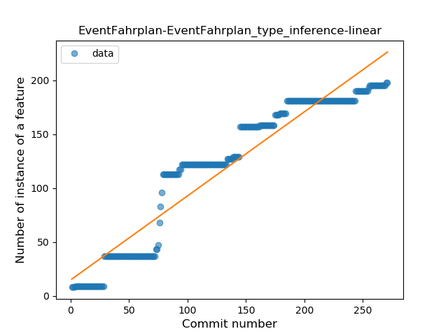
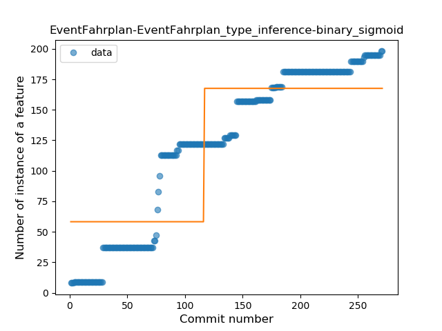
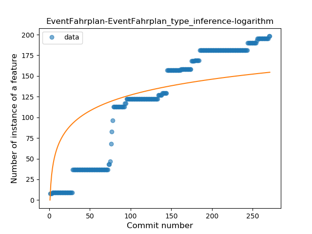
### <a name="lambda">Lambda</a>
----
#### Functions
* **Constant Rise - Linear:** 
    * **R_Squared:** 0.91399228
* **Sudden Rise Plateau - Logarithm:** 
    * **R_Squared:** 0.45319975

**Plots** :chart_with_upwards_trend:
-----

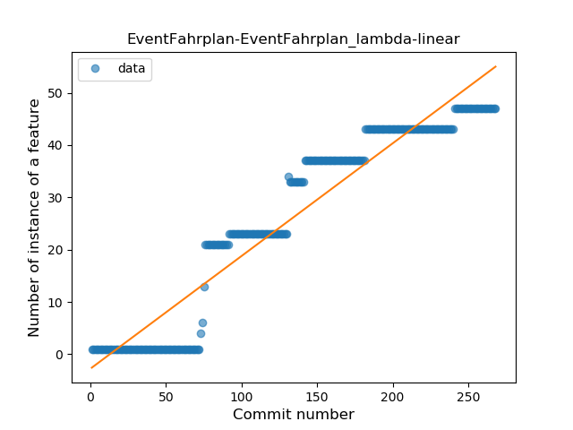
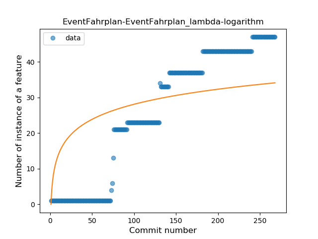
### <a name="safe_call">Safe Call</a>
----
#### Functions
* **Plateau Sudden Rise - Binary Sigmoid:** 
    * **R_Squared:** 1.0
* **Constant Rise - Linear:** 
    * **R_Squared:** 0.74107551
* **Sudden Rise Plateau - Logarithm:** 
    * **R_Squared:** 0.54731046

**Plots** :chart_with_upwards_trend:
-----

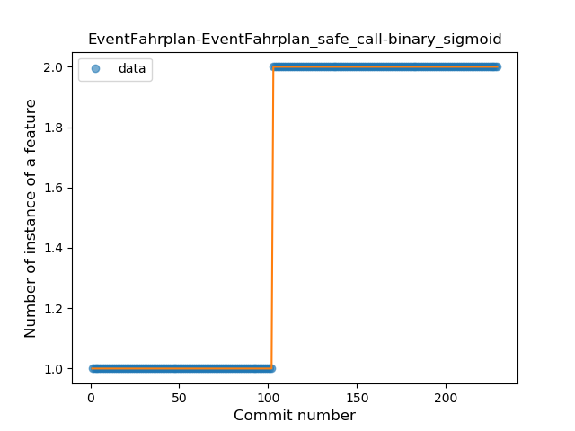
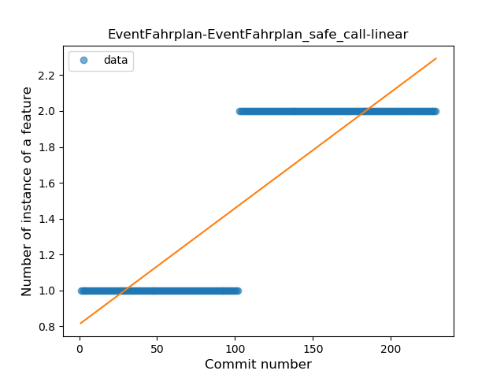
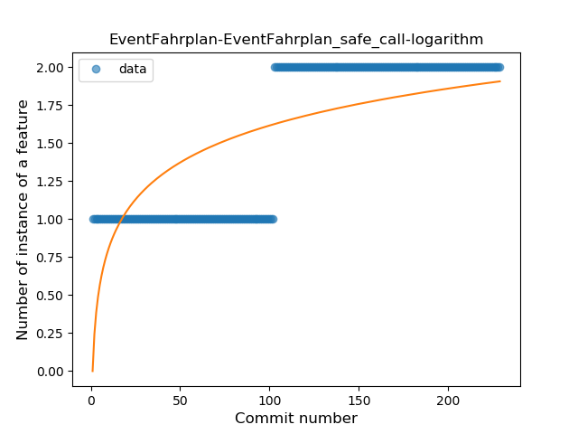
### <a name="when_expr">When expression</a>
----
#### Functions
* **Plateau Gradual Rise - Sigmoid:** 
    * **R_Squared:** 0.98752334
* **Constant Rise - Linear:** 
    * **R_Squared:** 0.77539757
* **Sudden Rise - Exponential:** 
    * **R_Squared:** 0.78227509
* **Sudden Rise Plateau - Logarithm:** 
    * **R_Squared:** 0.36119477

**Plots** :chart_with_upwards_trend:
-----

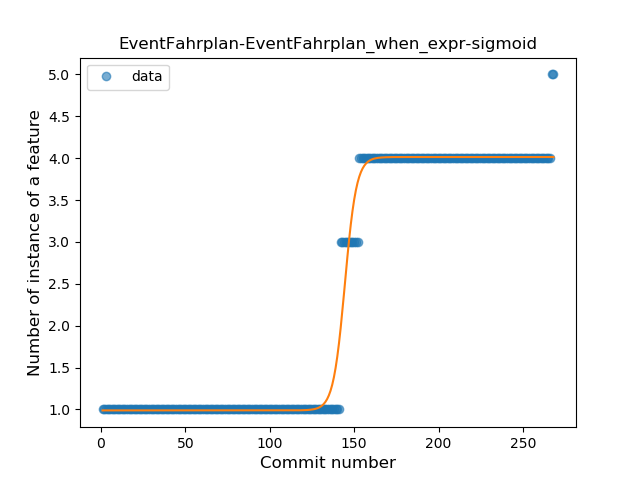
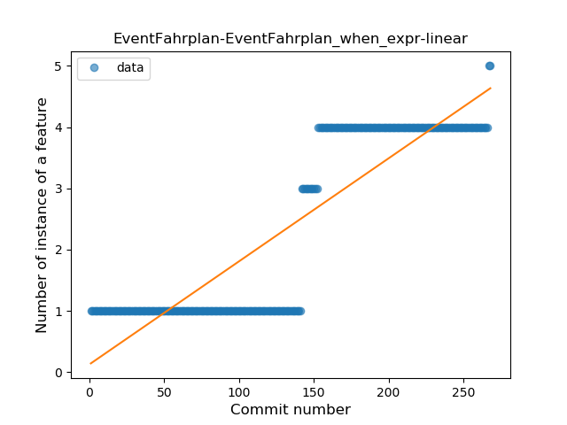
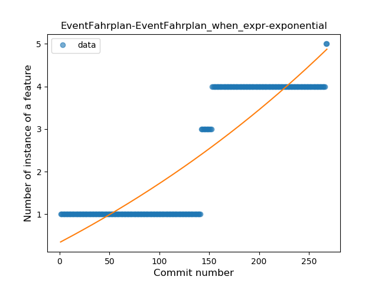
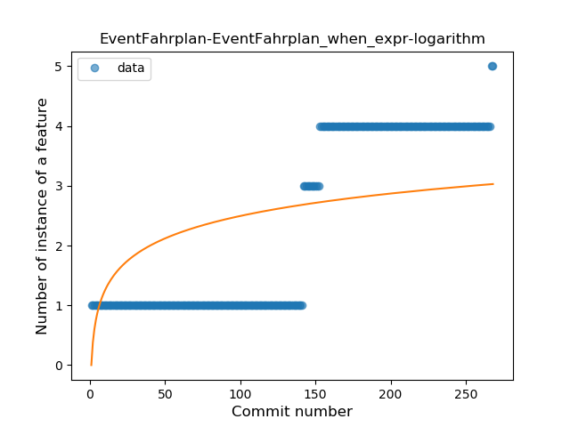
### <a name="companion_object">Companion Object</a>
----
#### Functions
* **Plateau Gradual Rise - Sigmoid:** 
    * **R_Squared:** 0.92432593
* **Constant Rise - Linear:** 
    * **R_Squared:** 0.85931878
* **Sudden Rise Plateau - Logarithm:** 
    * **R_Squared:** 0.7907614

**Plots** :chart_with_upwards_trend:
-----

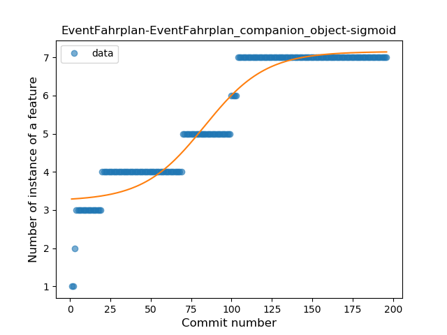
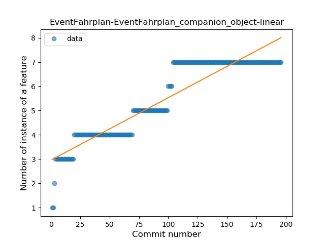
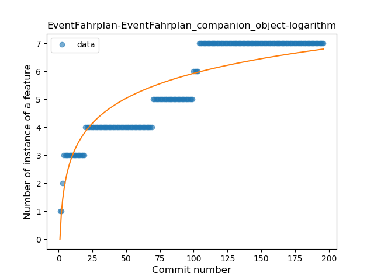
### <a name="string_template">String Template</a>
----
#### Functions
* **Constant Rise - Linear:** 
    * **R_Squared:** 0.86866951
* **Sudden Rise Plateau - Logarithm:** 
    * **R_Squared:** 0.77763802

**Plots** :chart_with_upwards_trend:
-----

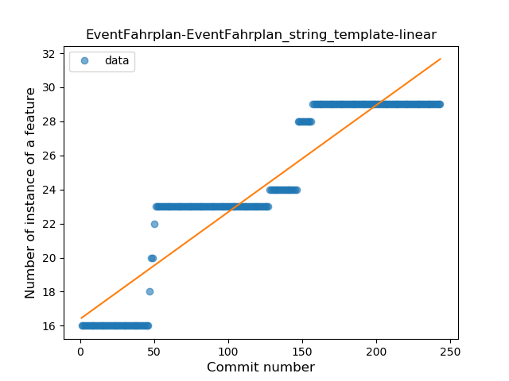
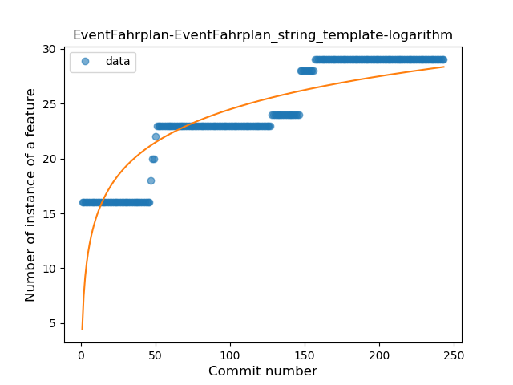
### <a name="func_with_default_value">Function with Default Value</a>
----
#### Functions
* **Constant Rise - Linear:** 
    * **R_Squared:** 0.83885167
* **Sudden Rise Plateau - Logarithm:** 
    * **R_Squared:** 0.48829885

**Plots** :chart_with_upwards_trend:
-----

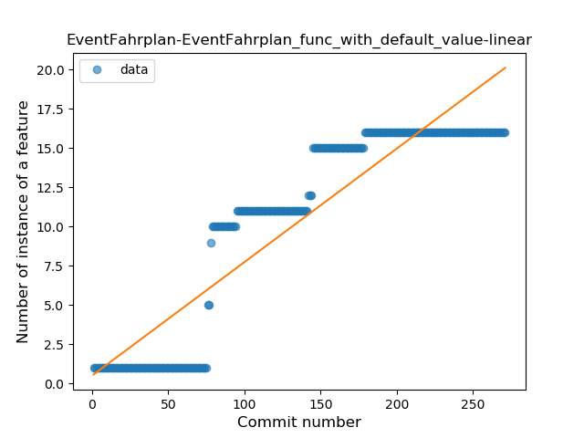
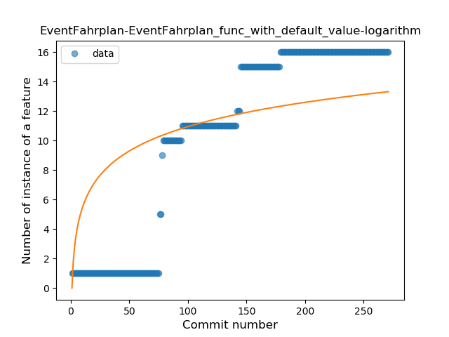
### <a name="singleton">Singleton</a>
----
#### Functions
* **Plateau Gradual Rise - Sigmoid:** 
    * **R_Squared:** 0.95731411
* **Constant Rise - Linear:** 
    * **R_Squared:** 0.84131402
* **Sudden Rise Plateau - Logarithm:** 
    * **R_Squared:** 0.58744346

**Plots** :chart_with_upwards_trend:
-----

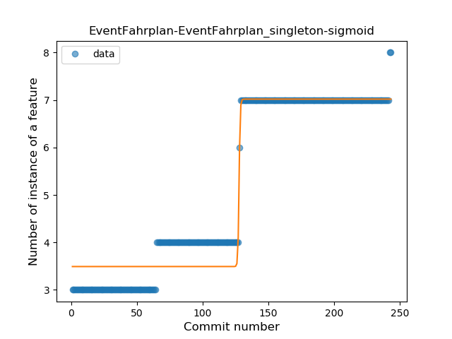
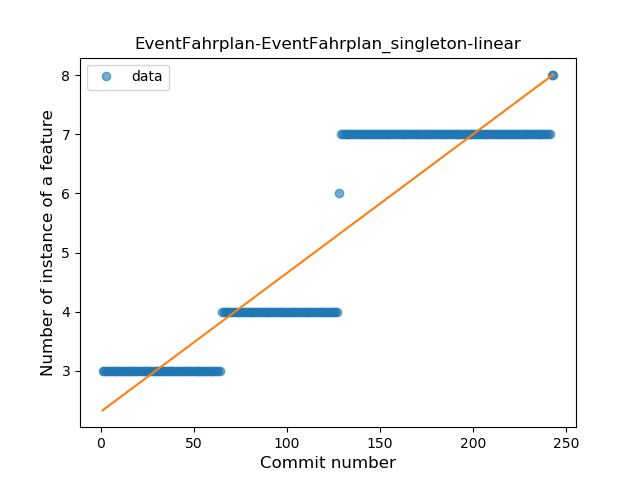
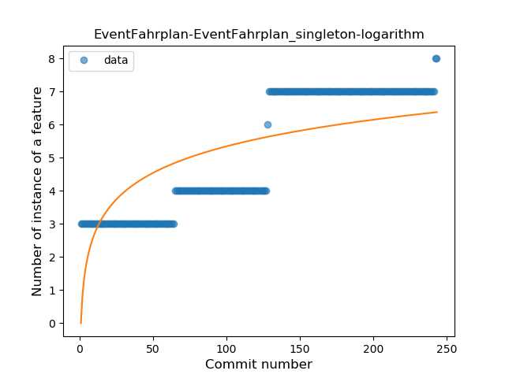
### <a name="func_call_with_named_arg">Function call with Named Argument</a>
----
#### Functions
* **Sudden Rise Plateau - Logarithm:** 
    * **R_Squared:** 0.66527296
* **Constant Rise - Linear:** 
    * **R_Squared:** 0.41999057

**Plots** :chart_with_upwards_trend:
-----

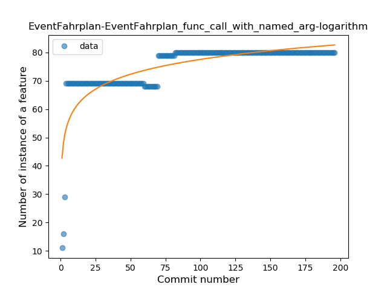
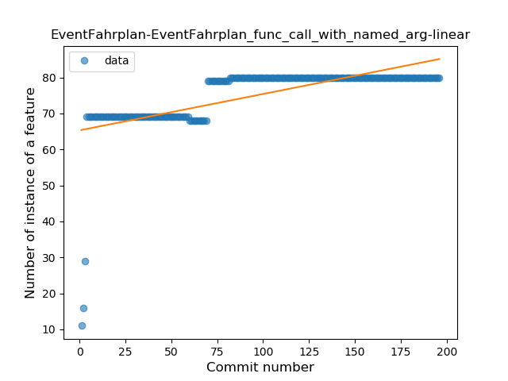
### <a name="data_class">Data Class</a>
----
#### Functions
* **Plateau Gradual Rise - Sigmoid:** 
    * **R_Squared:** 0.9326769
* **Constant Rise - Linear:** 
    * **R_Squared:** 0.76448389
* **Sudden Rise Plateau - Logarithm:** 
    * **R_Squared:** 0.75447085

**Plots** :chart_with_upwards_trend:
-----

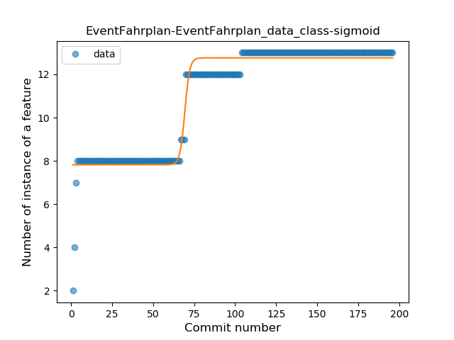
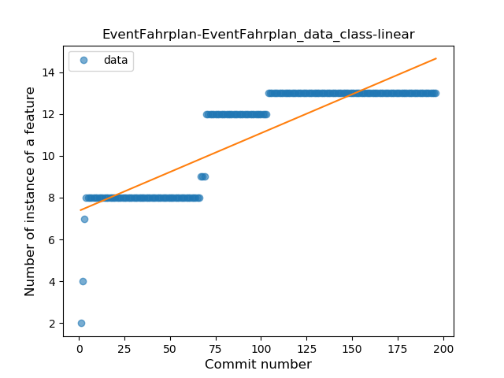
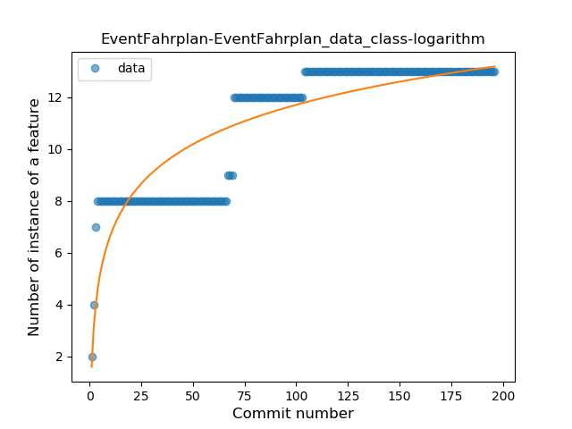
### <a name="extension_function">Extension Function</a>
----
#### Functions
* **Constant Rise - Linear:** 
    * **R_Squared:** 0.86664713
* **Sudden Rise Plateau - Logarithm:** 
    * **R_Squared:** 0.5475843

**Plots** :chart_with_upwards_trend:
-----

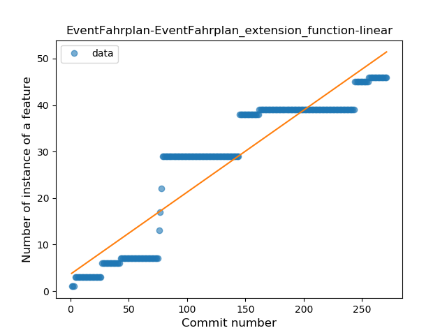
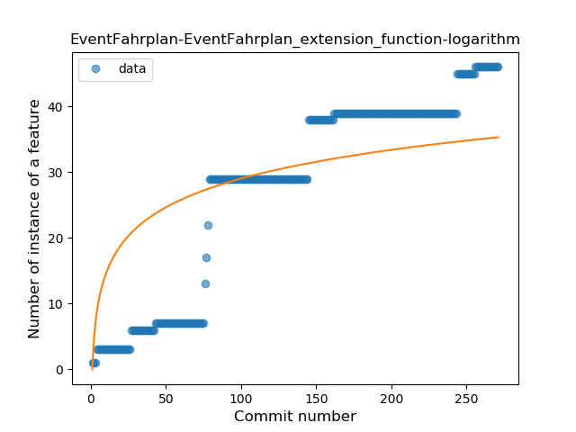
