## FredJul-Flym
----
#### Metrics provided by Detekt
* Number of lines of code 5008
* Number of Kotlin files: 43
* Cyclomatic complexity: 735
* Cyclomatic complexity by thousands of lines: 314 

----
**16** features analyzed

*	<a href="#type_inference">Type Inference</a> 
*	<a href="#lambda">Lambda</a> 
*	<a href="#safe_call">Safe Call</a> 
*	<a href="#when_expr">When expression</a> 
*	<a href="#companion_object">Companion Object</a> 
*	<a href="#unsafe_call">Unsafe Call</a> 
*	<a href="#string_template">String Template</a> 
*	<a href="#func_with_default_value">Function with Default Value</a> 
*	<a href="#singleton">Singleton</a> 
*	<a href="#smart_cast">Smart Cast</a> 
*	<a href="#range_expr">Range Expression</a> 
*	<a href="#func_call_with_named_arg">Function call with Named Argument</a> 
*	<a href="#data_class">Data Class</a> 
*	<a href="#extension_function">Extension Function</a> 
*	<a href="#property_delegation">Property Delegation</a> 
*	<a href="#inline_func">Inline Function</a> 

### <a name="type_inference">Type Inference</a>
----
#### Functions
* **Sudden Rise - Exponential:** 
    * **R_Squared:** 0.32473524
* **Constant Rise - Linear:** 
    * **R_Squared:** 0.17545328
* **Sudden Rise Plateau - Logarithm:** 
    * **R_Squared:** 0.01126469

**Plots** :chart_with_upwards_trend:
-----

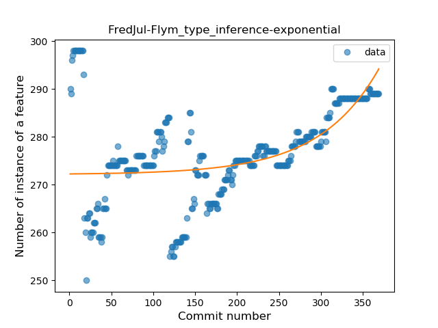
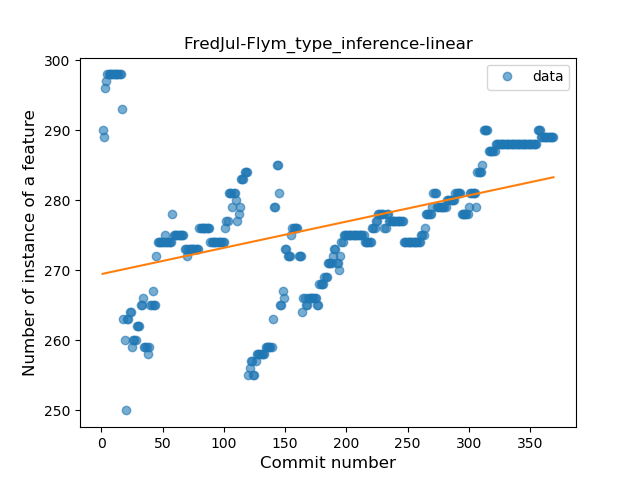
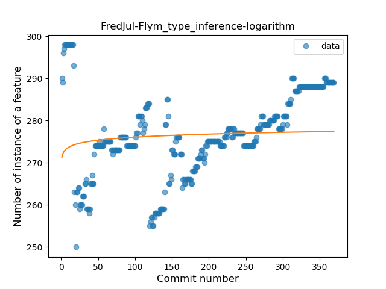
### <a name="lambda">Lambda</a>
----
#### Functions
* **Constant Rise - Linear:** 
    * **R_Squared:** 0.92914892
* **Sudden Rise Plateau - Logarithm:** 
    * **R_Squared:** 0.75563721
* **Plateau Sudden Rise - Binary Sigmoid:** 
    * **R_Squared:** 0.39912393

**Plots** :chart_with_upwards_trend:
-----

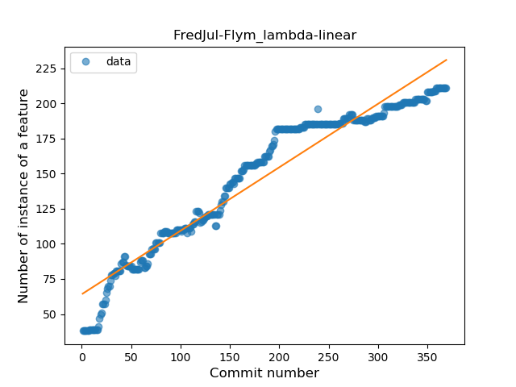
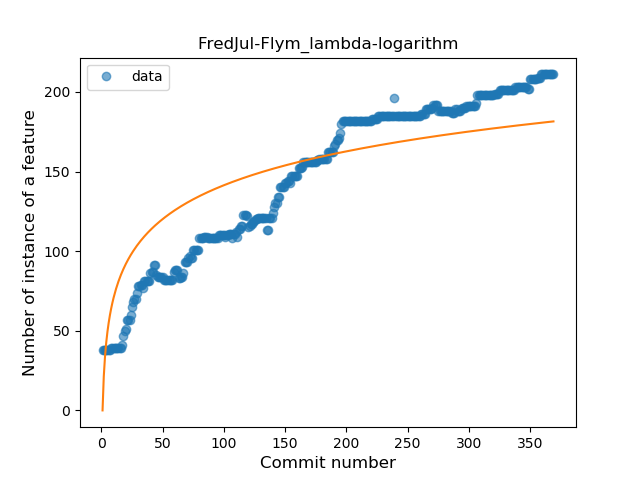
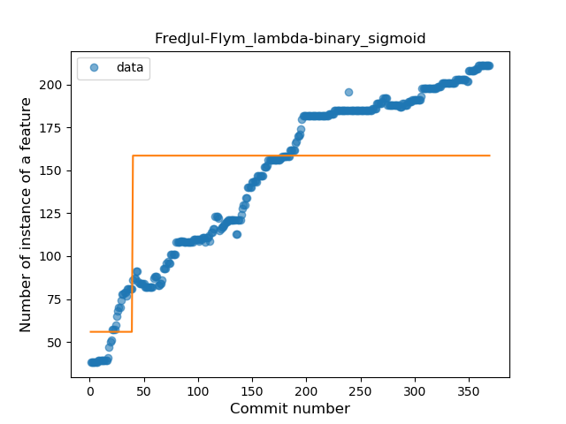
### <a name="safe_call">Safe Call</a>
----
#### Functions
* **Constant Rise - Linear:** 
    * **R_Squared:** 0.90182572
* **Sudden Rise Plateau - Logarithm:** 
    * **R_Squared:** 0.72658267
* **Plateau Sudden Rise - Binary Sigmoid:** 
    * **R_Squared:** 0.71644473

**Plots** :chart_with_upwards_trend:
-----

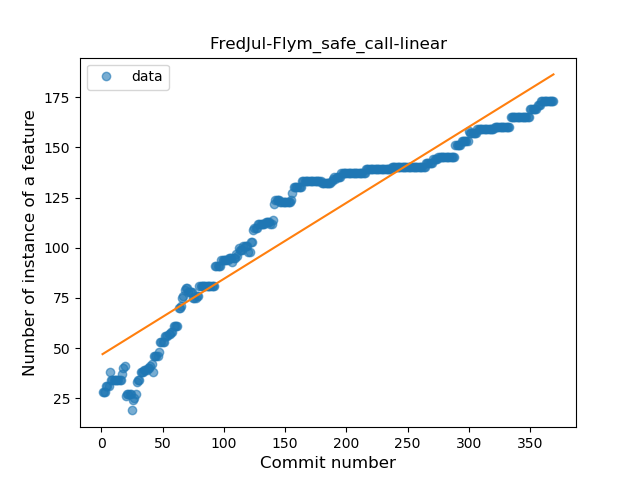
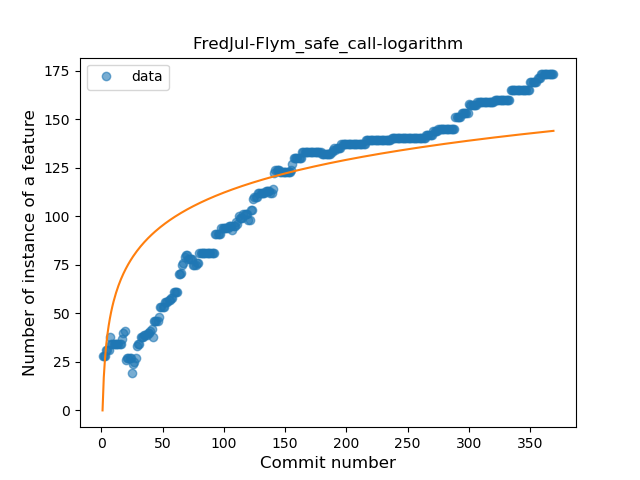
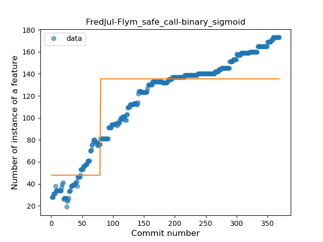
### <a name="when_expr">When expression</a>
----
#### Functions
* **Constant Rise - Linear:** 
    * **R_Squared:** 0.86723768
* **Sudden Rise Plateau - Logarithm:** 
    * **R_Squared:** 0.5541373

**Plots** :chart_with_upwards_trend:
-----

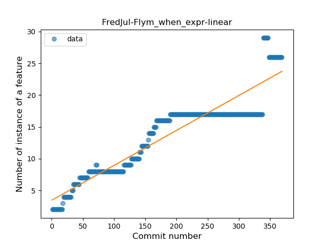
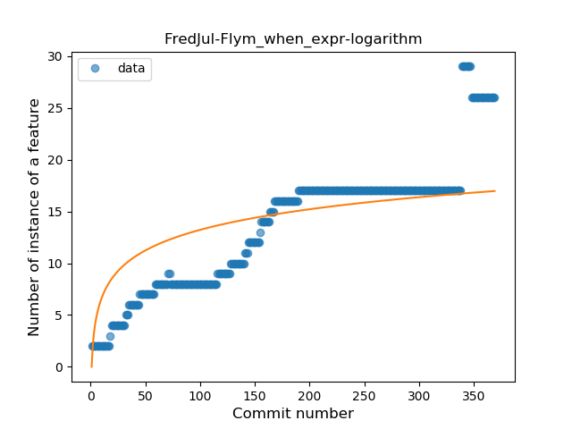
### <a name="companion_object">Companion Object</a>
----
#### Functions
* **Constant Decline - Linear:** 
    * **R_Squared:** 0.58712782
* **Sudden Rise Plateau - Logarithm:** 
    * **R_Squared:** -0.0

**Plots** :chart_with_upwards_trend:
-----

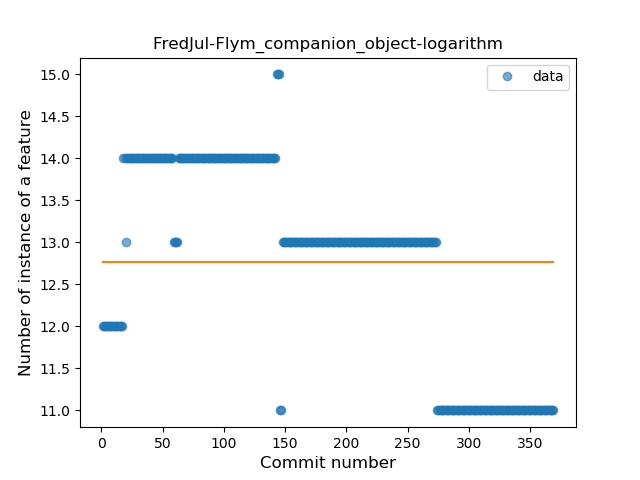
### <a name="unsafe_call">Unsafe Call</a>
----
#### Functions
* **Sudden Decline - Exponential:** 
    * **R_Squared:** 0.52527548
* **Constant Decline - Linear:** 
    * **R_Squared:** 0.00957321
* **Sudden Rise Plateau - Logarithm:** 
    * **R_Squared:** -0.0

**Plots** :chart_with_upwards_trend:
-----

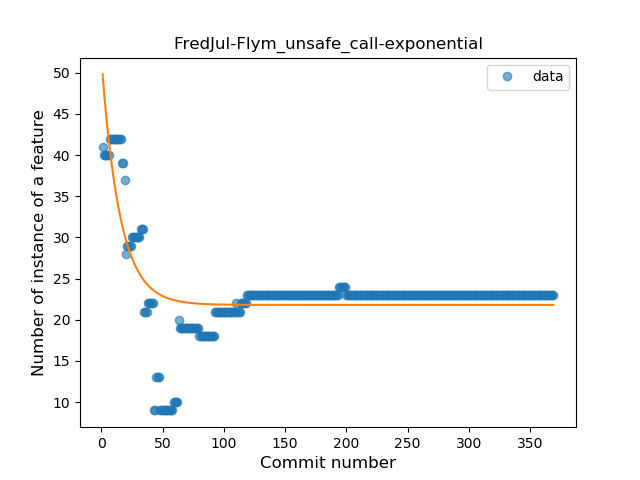
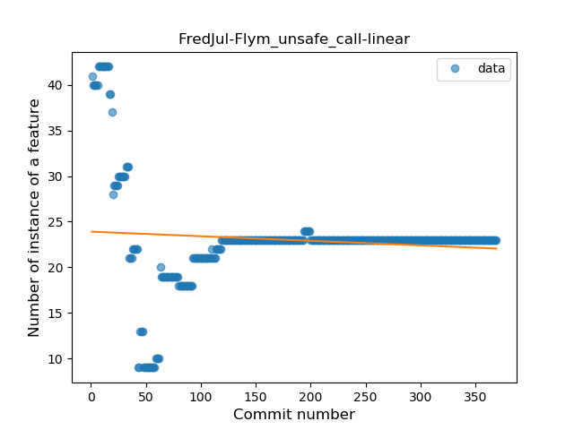
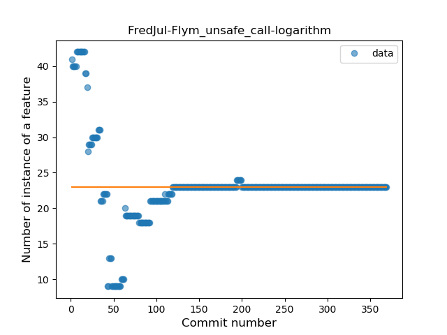
### <a name="string_template">String Template</a>
----
#### Functions
* **Constant Rise - Linear:** 
    * **R_Squared:** 0.66210824
* **Sudden Rise Plateau - Logarithm:** 
    * **R_Squared:** 0.55032504
* **Plateau Sudden Rise - Binary Sigmoid:** 
    * **R_Squared:** 0.28128883

**Plots** :chart_with_upwards_trend:
-----

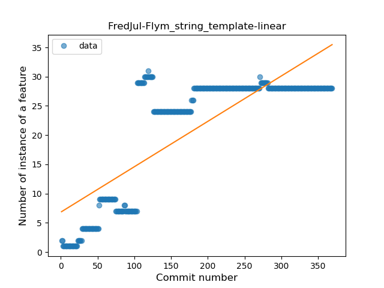
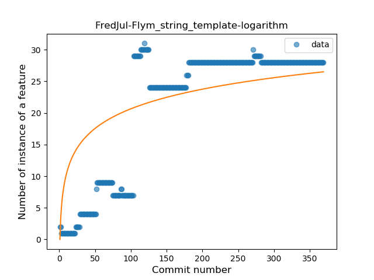
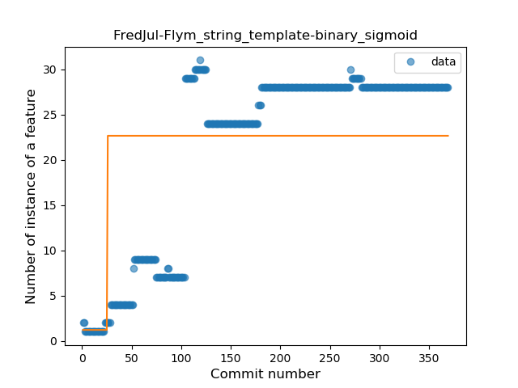
### <a name="func_with_default_value">Function with Default Value</a>
----
#### Functions
* **Constant Rise - Linear:** 
    * **R_Squared:** 0.89458164
* **Sudden Rise Plateau - Logarithm:** 
    * **R_Squared:** 0.76183299

**Plots** :chart_with_upwards_trend:
-----

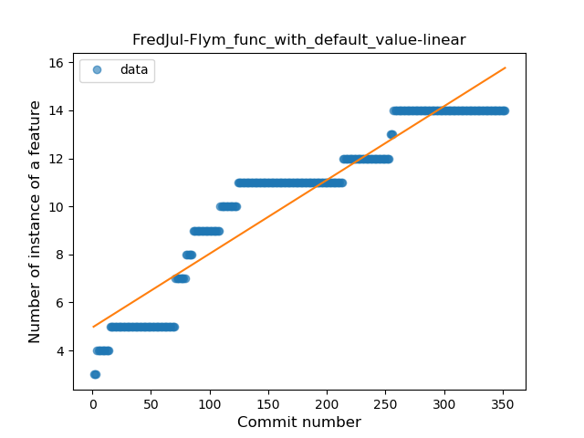
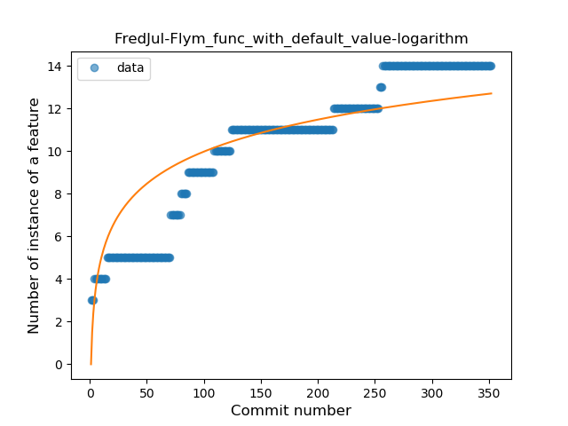
### <a name="singleton">Singleton</a>
----
#### Functions
* **Plateau Sudden Decline - Binary Sigmoid:** 
    * **R_Squared:** 0.88240344
* **Sudden Decline - Exponential:** 
    * **R_Squared:** 0.83453439
* **Constant Decline - Linear:** 
    * **R_Squared:** 0.63614988
* **Sudden Rise Plateau - Logarithm:** 
    * **R_Squared:** 0.0

**Plots** :chart_with_upwards_trend:
-----

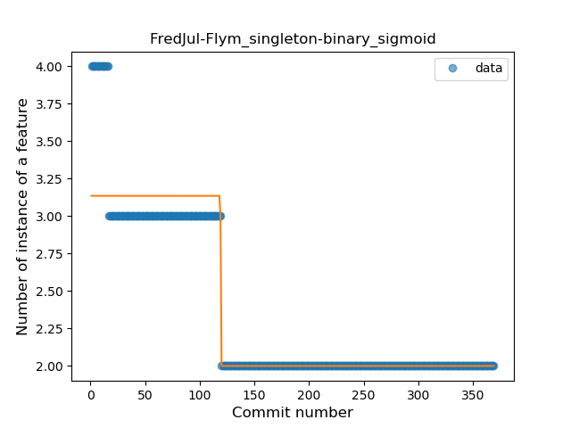
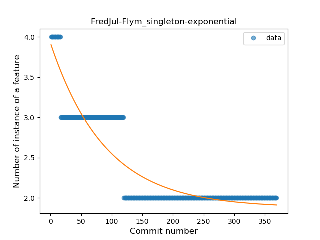
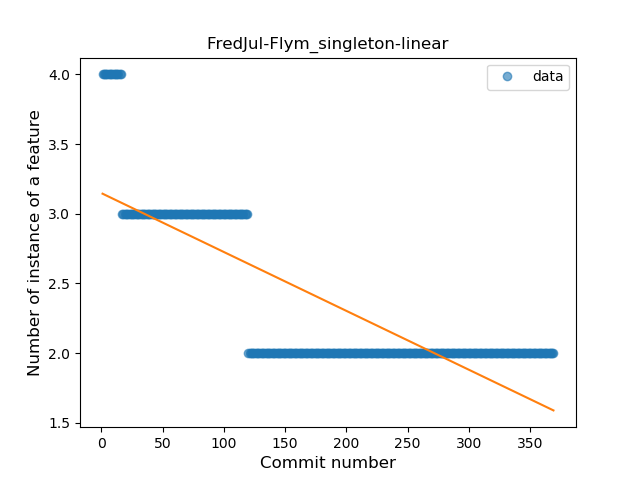
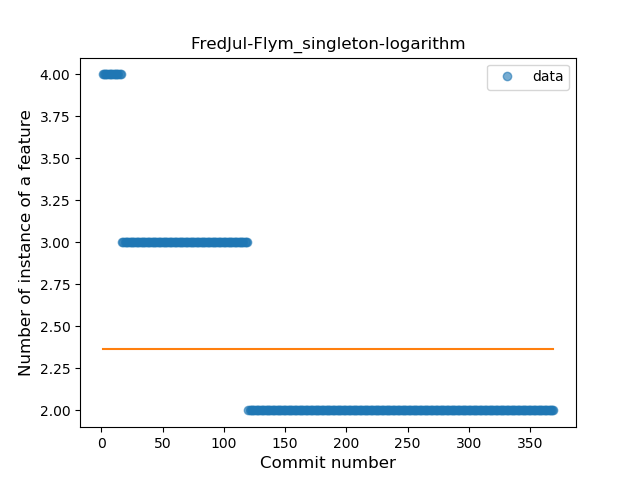
### <a name="smart_cast">Smart Cast</a>
----
#### Functions
* **Constant Rise - Linear:** 
    * **R_Squared:** 0.14957571
* **Sudden Rise - Exponential:** 
    * **R_Squared:** 0.15057816
* **Sudden Rise Plateau - Logarithm:** 
    * **R_Squared:** 0.04383431

**Plots** :chart_with_upwards_trend:
-----

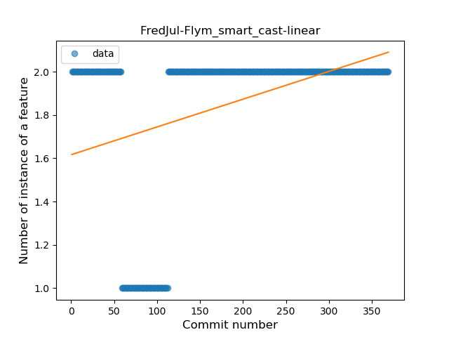
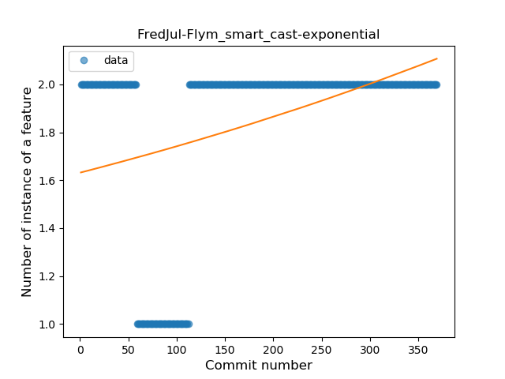
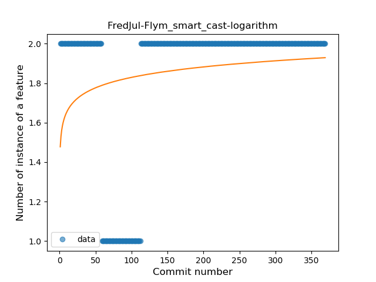
### <a name="range_expr">Range Expression</a>
----
#### Functions
* **Plateau Sudden Decline - Binary Sigmoid:** 
    * **R_Squared:** 0.78296315
* **Sudden Decline - Exponential:** 
    * **R_Squared:** 0.47383815
* **Constant Decline - Linear:** 
    * **R_Squared:** 0.30426025
* **Sudden Rise Plateau - Logarithm:** 
    * **R_Squared:** 0.0

**Plots** :chart_with_upwards_trend:
-----

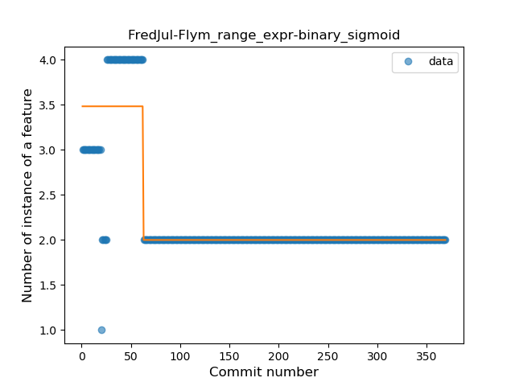
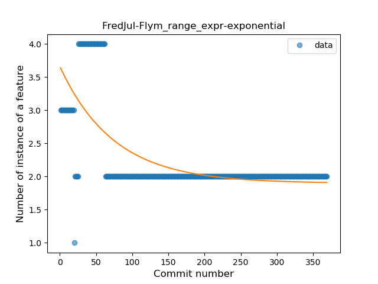
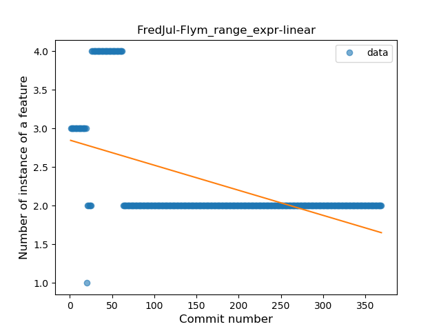
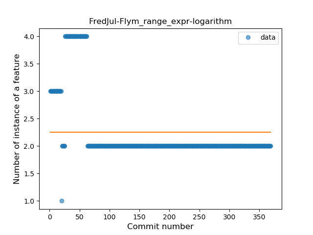
### <a name="func_call_with_named_arg">Function call with Named Argument</a>
----
#### Functions
* **Constant Rise - Linear:** 
    * **R_Squared:** 0.80796876
* **Sudden Rise Plateau - Logarithm:** 
    * **R_Squared:** 0.5308942

**Plots** :chart_with_upwards_trend:
-----

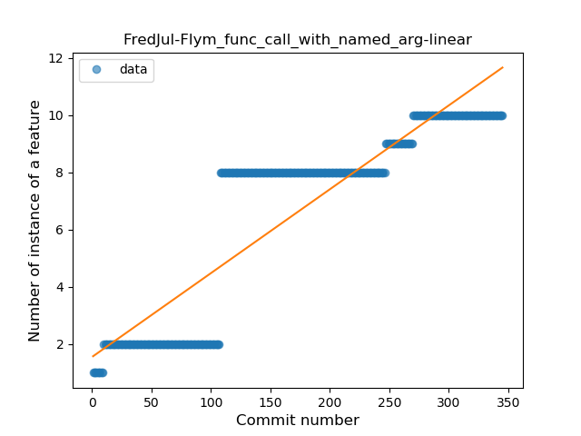
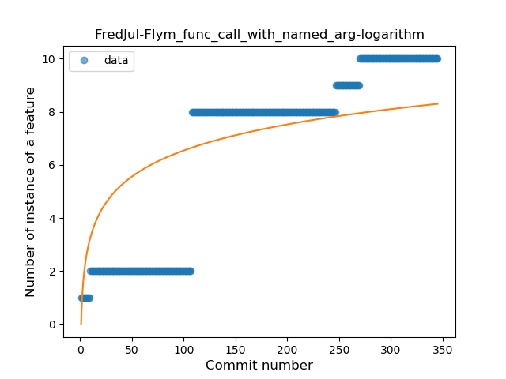
### <a name="data_class">Data Class</a>
----
#### Functions
* **Plateau Gradual Rise - Sigmoid:** 
    * **R_Squared:** 0.99449188
* **Sudden Rise - Exponential:** 
    * **R_Squared:** 0.77385574
* **Constant Rise - Linear:** 
    * **R_Squared:** 0.61106333
* **Sudden Rise Plateau - Logarithm:** 
    * **R_Squared:** 0.30110797

**Plots** :chart_with_upwards_trend:
-----

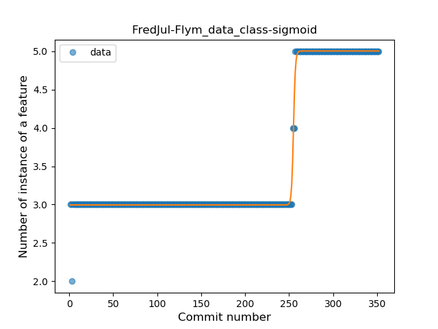
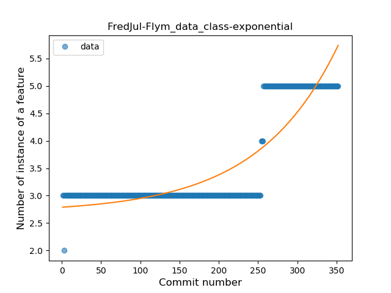
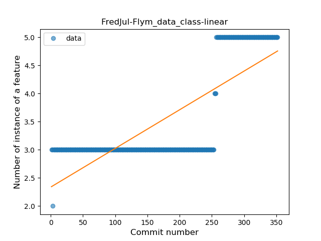
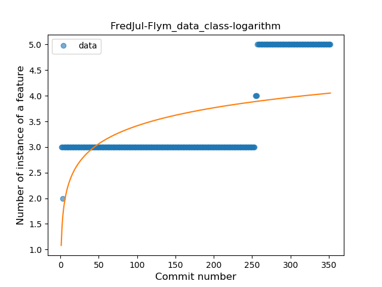
### <a name="extension_function">Extension Function</a>
----
#### Functions
* **Plateau Gradual Rise - Sigmoid:** 
    * **R_Squared:** 0.96877064
* **Sudden Rise - Exponential:** 
    * **R_Squared:** 0.81564979
* **Constant Rise - Linear:** 
    * **R_Squared:** 0.28266976
* **Sudden Rise Plateau - Logarithm:** 
    * **R_Squared:** 0.10691215

**Plots** :chart_with_upwards_trend:
-----

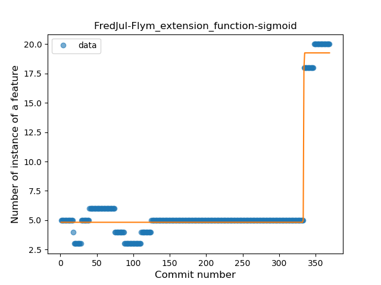
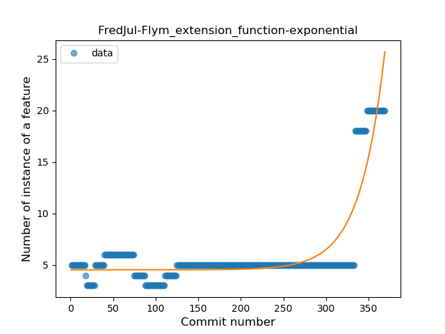
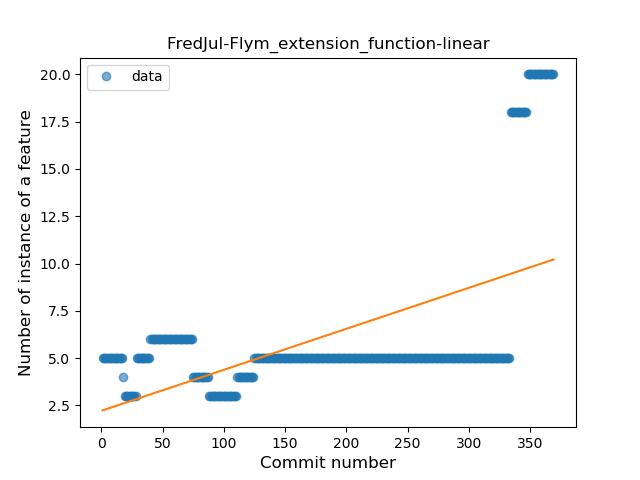

### <a name="property_delegation">Property Delegation</a>
----
#### Functions
* **Plateau Sudden Decline - Binary Sigmoid:** 
    * **R_Squared:** 1.0
* **Sudden Decline - Exponential:** 
    * **R_Squared:** 0.76707424
* **Constant Decline - Linear:** 
    * **R_Squared:** 0.59268508
* **Sudden Rise Plateau - Logarithm:** 
    * **R_Squared:** -0.0

**Plots** :chart_with_upwards_trend:
-----

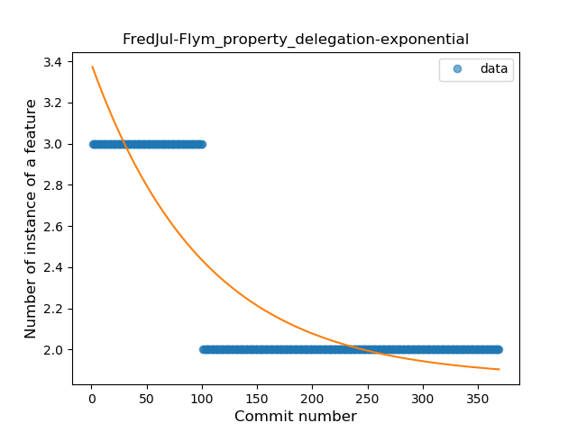
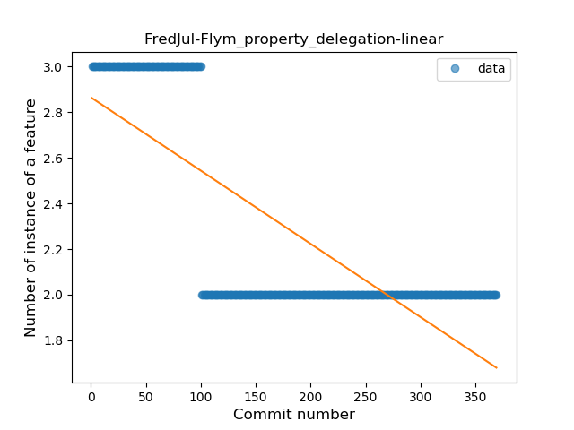
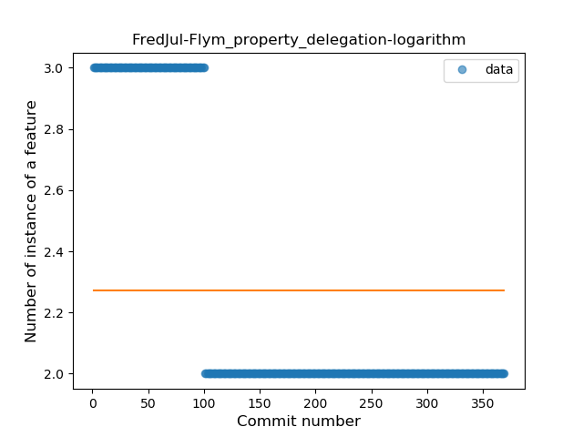
### <a name="inline_func">Inline Function</a>
----
#### Functions
* **Plateau Sudden Decline - Binary Sigmoid:** 
    * **R_Squared:** 1.0
* **Sudden Decline - Exponential:** 
    * **R_Squared:** 0.80412434
* **Constant Decline - Linear:** 
    * **R_Squared:** 0.17337461
* **Sudden Rise Plateau - Logarithm:** 
    * **R_Squared:** 0.0

**Plots** :chart_with_upwards_trend:
-----

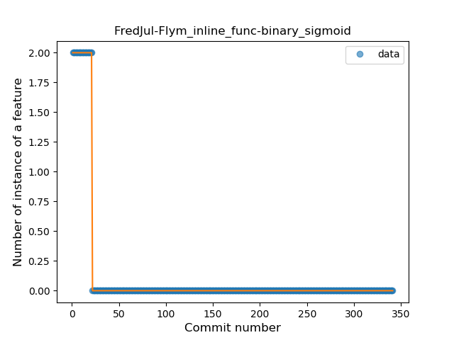
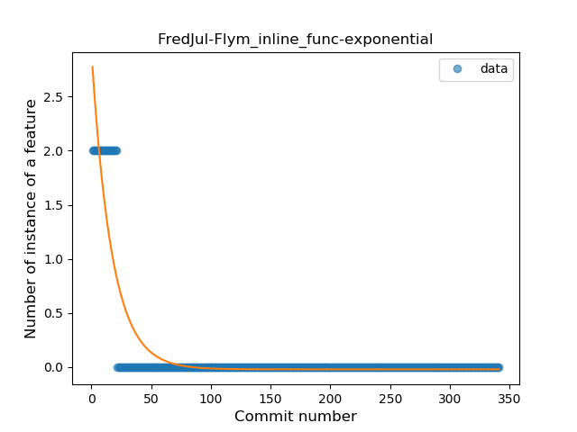
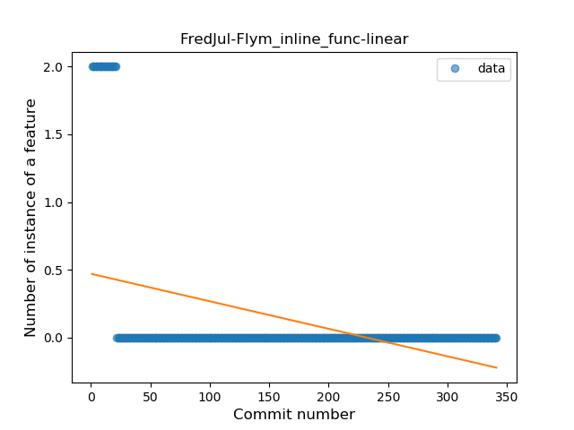
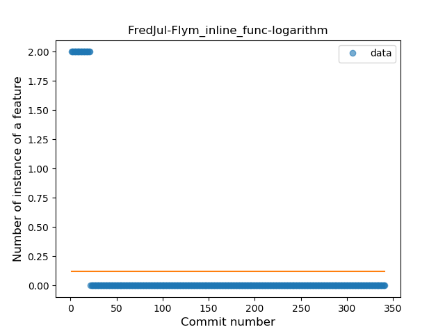
