## GreenLionSoft-madrid-pollution-android-app
----
#### Metrics provided by Detekt
* Number of lines of code 402
* Number of Kotlin files: 8
* Cyclomatic complexity: 45
* Cyclomatic complexity by thousands of lines: 231 

----
**3** features analyzed

*	<a href="#type_inference">Type Inference</a> 
*	<a href="#lambda">Lambda</a> 
*	<a href="#string_template">String Template</a> 

### <a name="type_inference">Type Inference</a>
----
#### Functions
* **Instability - Polinomial 4:** 
    * **R_Squared:** 0.86836586
* **Instability - Polinomial 3:** )
    * **R_Squared:** 0.84927453
* **Sudden Rise - Exponential:** 
    * **R_Squared:** 0.76172929
* **Constant Rise - Linear:** 
    * **R_Squared:** 0.74270724
* **Sudden Rise Plateau - Logarithm:** 
    * **R_Squared:** 0.51081099
* **Plateau Gradual Rise - Sigmoid:** 
    * **R_Squared:** -0.0

**Plots** :chart_with_upwards_trend:
-----

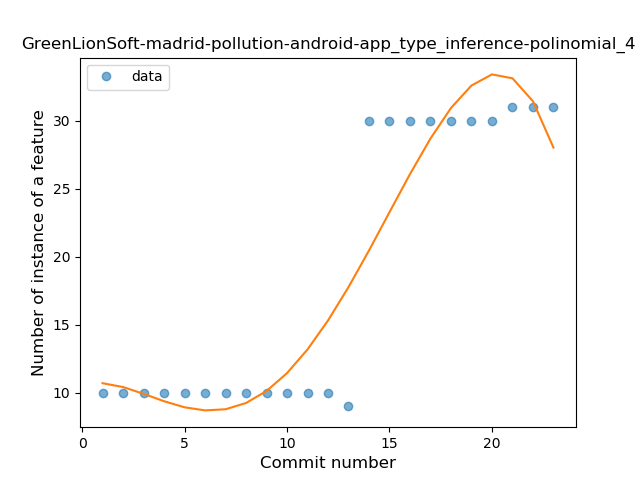
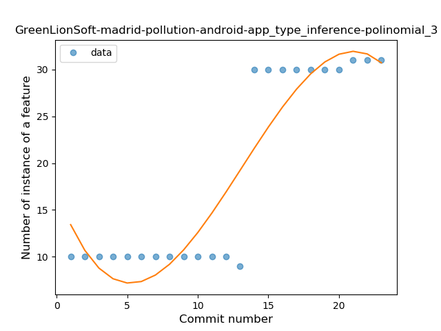
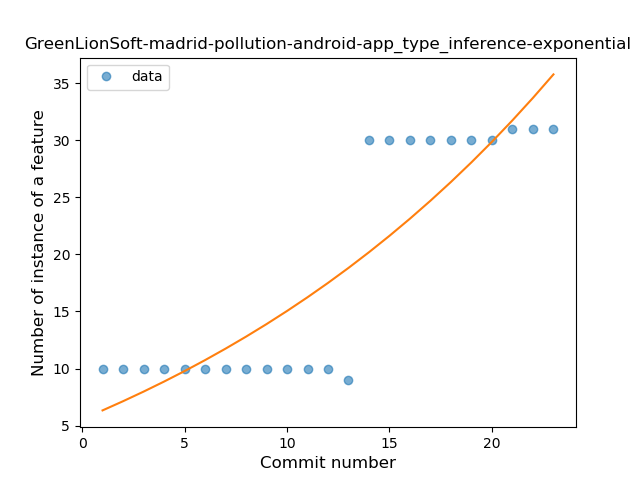
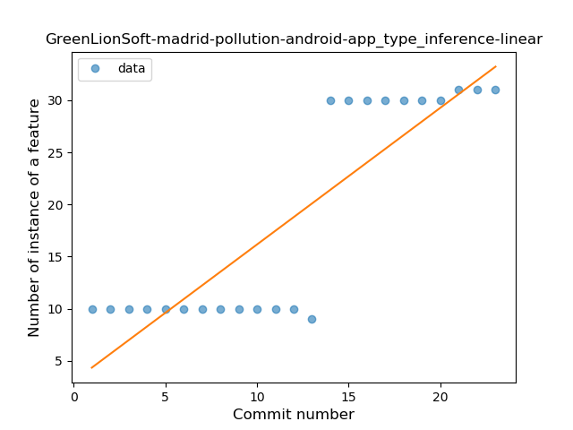
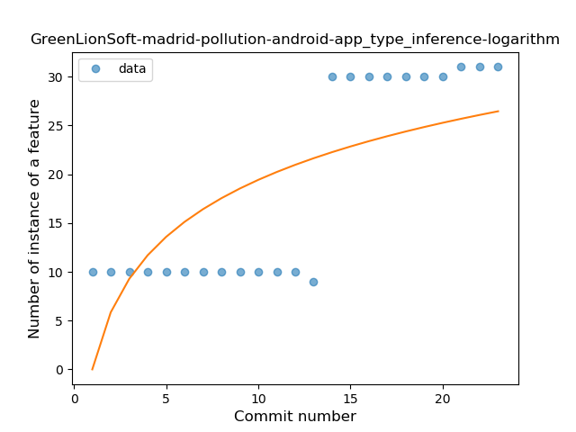
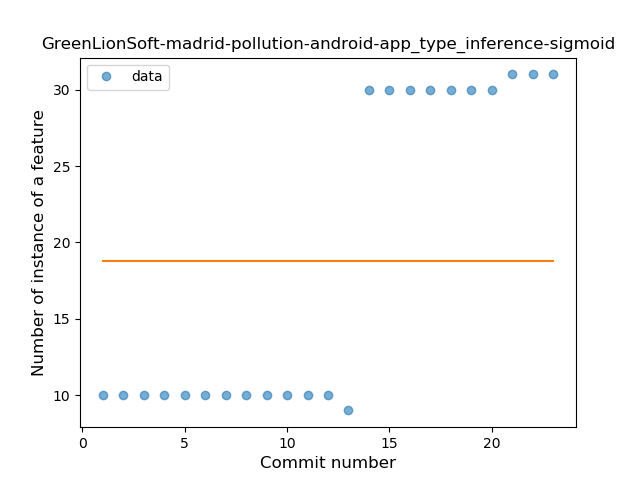
### <a name="lambda">Lambda</a>
----
#### Functions
* **Instability - Polinomial 4:** 
    * **R_Squared:** 0.77580923
* **Instability - Polinomial 3:** )
    * **R_Squared:** 0.73303539
* **Sudden Rise - Exponential:** 
    * **R_Squared:** 0.51608051
* **Constant Rise - Linear:** 
    * **R_Squared:** 0.02870813
* **Sudden Rise Plateau - Logarithm:** 
    * **R_Squared:** 0.00155786
* **Plateau Gradual Decline - Sigmoid:** 
    * **R_Squared:** 0.00956937

**Plots** :chart_with_upwards_trend:
-----

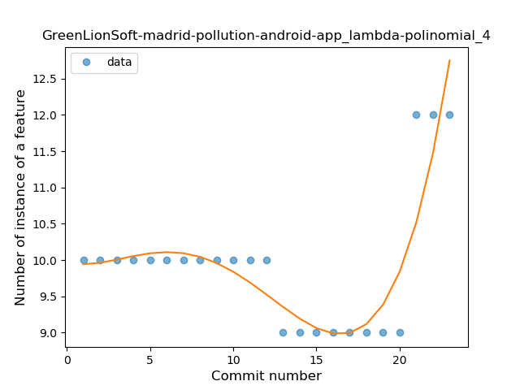
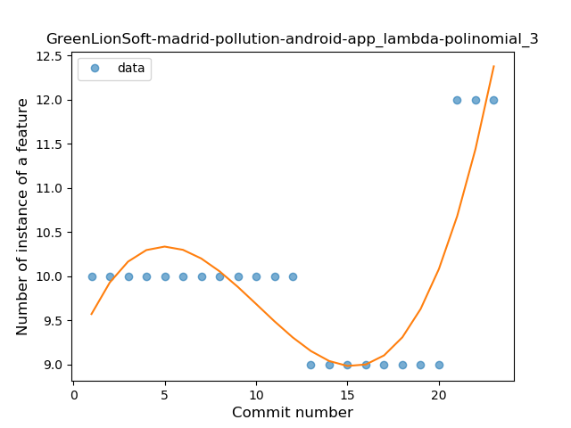

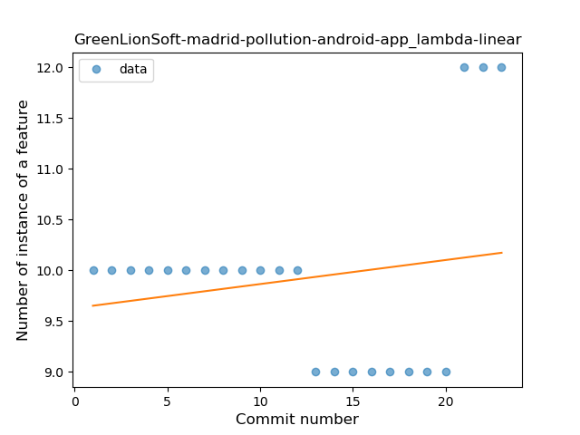
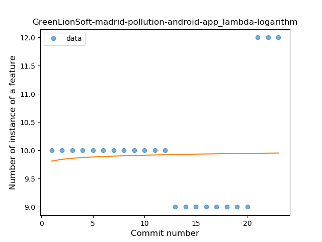
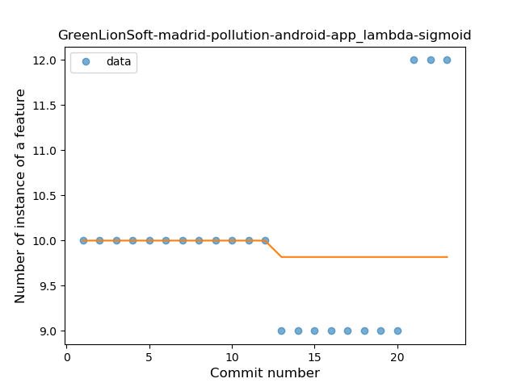
### <a name="string_template">String Template</a>
----
#### Functions
* **Plateau Sudden Rise - Binary Sigmoid:** 
    * **R_Squared:** 1.0
* **Instability - Polinomial 3:** )
    * **R_Squared:** 0.86071429
* **Constant Rise - Linear:** 
    * **R_Squared:** 0.75
* **Sudden Rise - Exponential:** 
    * **R_Squared:** 0.75159032
* **Sudden Rise Plateau - Logarithm:** 
    * **R_Squared:** 0.55817591

**Plots** :chart_with_upwards_trend:
-----

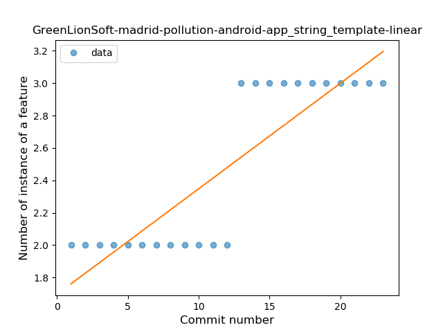
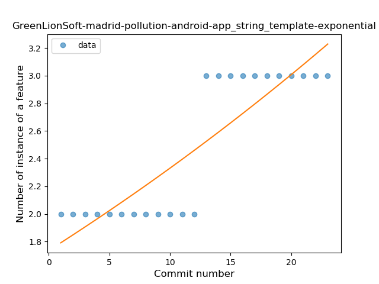

