## JanYoStudio-WhatAnime
----
#### Metrics provided by Detekt
* Number of lines of code 1225
* Number of Kotlin files: 33
* Cyclomatic complexity: 146
* Cyclomatic complexity by thousands of lines: 229 

----
**10** features analyzed

*	<a href="#type_inference">Type Inference</a> 
*	<a href="#lambda">Lambda</a> 
*	<a href="#safe_call">Safe Call</a> 
*	<a href="#when_expr">When expression</a> 
*	<a href="#companion_object">Companion Object</a> 
*	<a href="#unsafe_call">Unsafe Call</a> 
*	<a href="#string_template">String Template</a> 
*	<a href="#singleton">Singleton</a> 
*	<a href="#smart_cast">Smart Cast</a> 
*	<a href="#property_delegation">Property Delegation</a> 

### <a name="type_inference">Type Inference</a>
----
#### Functions
* **Instability - Polinomial 4:** 
    * **R_Squared:** 0.73192525
* **Instability - Polinomial 3:** )
    * **R_Squared:** 0.38919403
* **Constant Rise - Linear:** 
    * **R_Squared:** 0.23051722
* **Sudden Rise Plateau - Logarithm:** 
    * **R_Squared:** 0.11843295

**Plots** :chart_with_upwards_trend:
-----

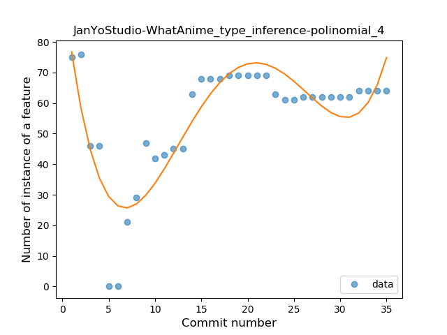
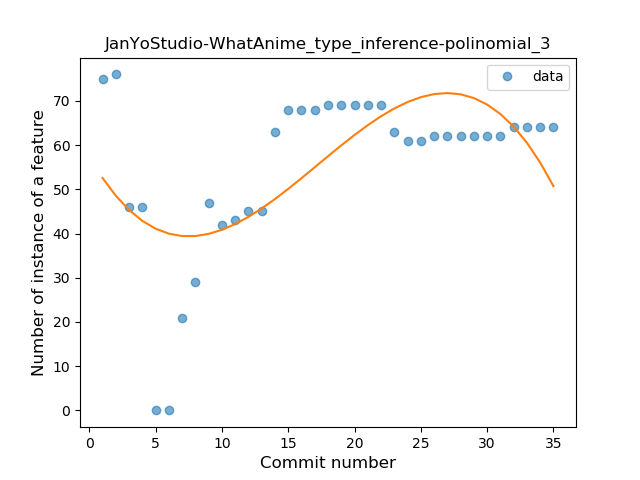
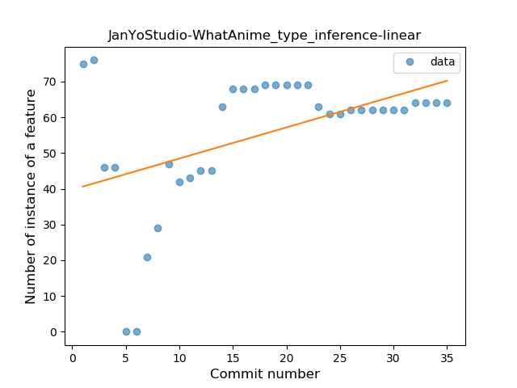
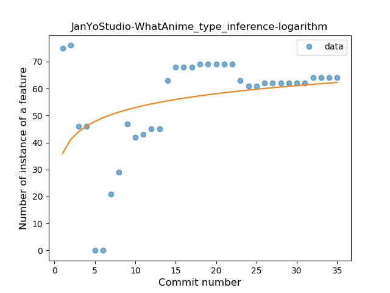
### <a name="lambda">Lambda</a>
----
#### Functions
* **Instability - Polinomial 4:** 
    * **R_Squared:** 0.84628005
* **Instability - Polinomial 3:** )
    * **R_Squared:** 0.5268546
* **Constant Rise - Linear:** 
    * **R_Squared:** 0.32153714
* **Sudden Rise - Exponential:** 
    * **R_Squared:** 0.32292455
* **Sudden Rise Plateau - Logarithm:** 
    * **R_Squared:** 0.13451866

**Plots** :chart_with_upwards_trend:
-----

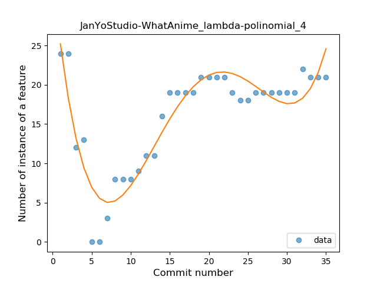
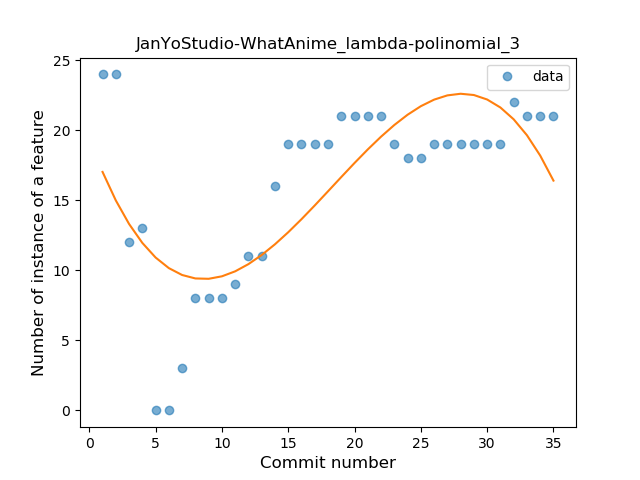
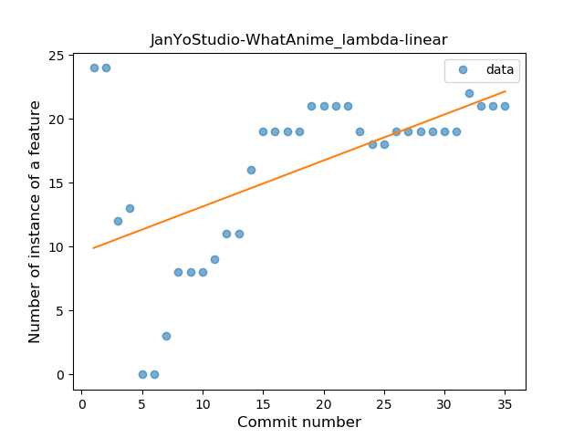
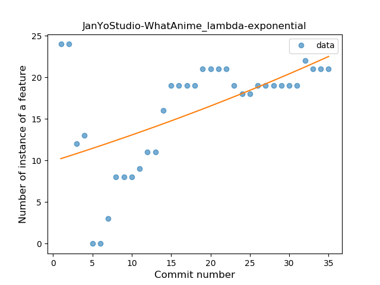
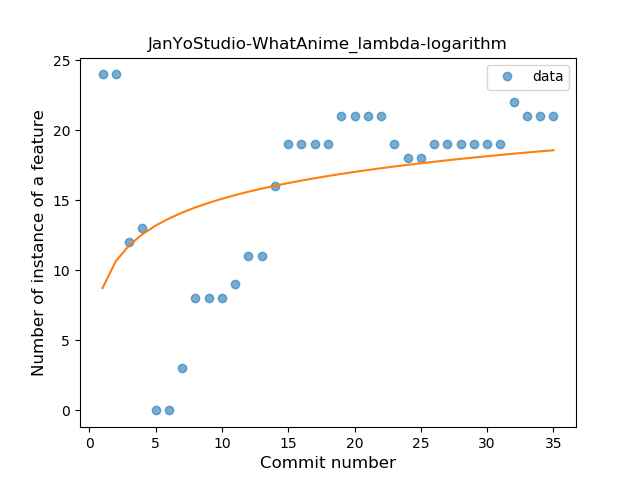
### <a name="safe_call">Safe Call</a>
----
#### Functions
* **Sudden Rise - Exponential:** 
    * **R_Squared:** 0.5839405
* **Constant Rise - Linear:** 
    * **R_Squared:** 0.51031702
* **Sudden Rise Plateau - Logarithm:** 
    * **R_Squared:** 0.29689127

**Plots** :chart_with_upwards_trend:
-----

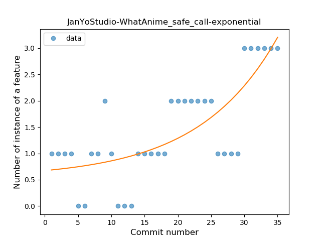
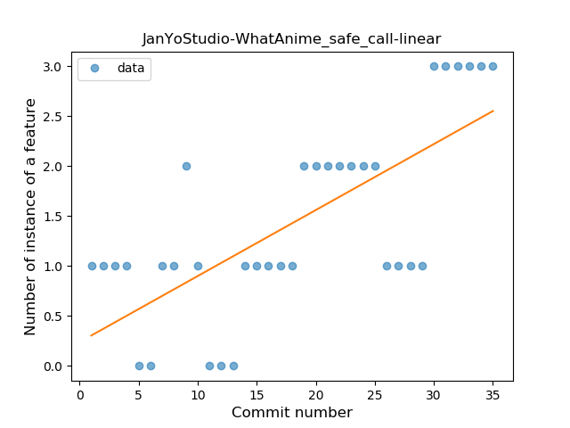
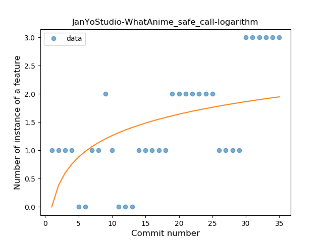
### <a name="when_expr">When expression</a>
----
#### Functions
* **Instability - Polinomial 3:** )
    * **R_Squared:** 0.86767006
* **Plateau Gradual Rise - Sigmoid:** 
    * **R_Squared:** 0.81750224
* **Constant Rise - Linear:** 
    * **R_Squared:** 0.75140583
* **Sudden Rise - Exponential:** 
    * **R_Squared:** 0.75601651
* **Sudden Rise Plateau - Logarithm:** 
    * **R_Squared:** 0.43748706

**Plots** :chart_with_upwards_trend:
-----

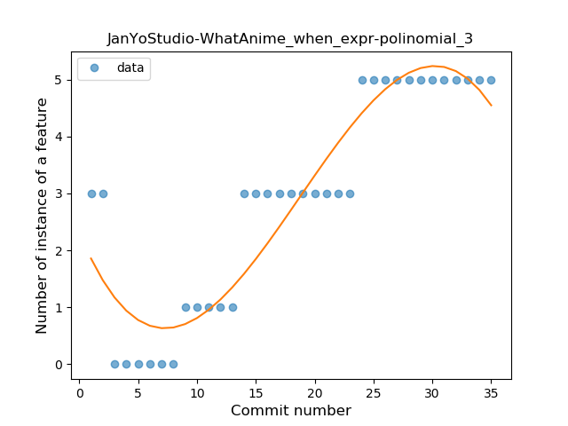

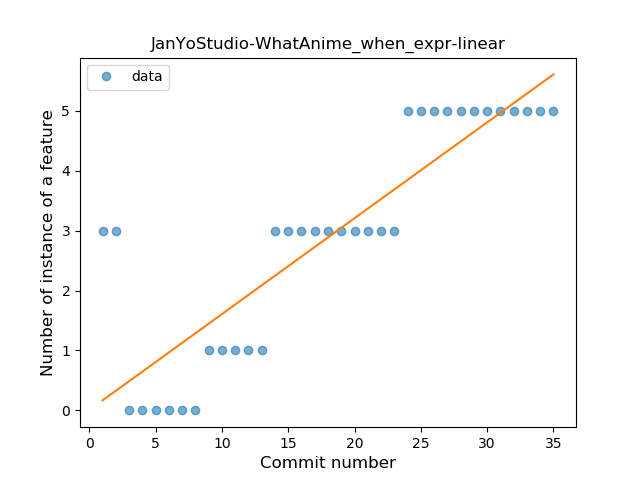
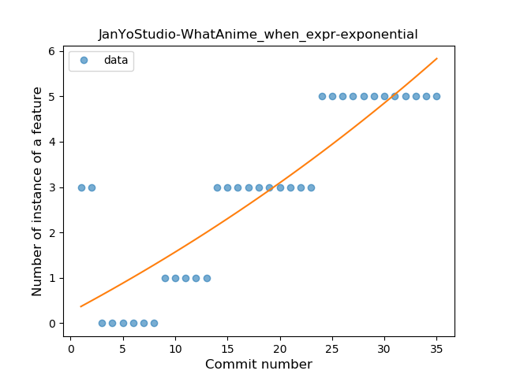
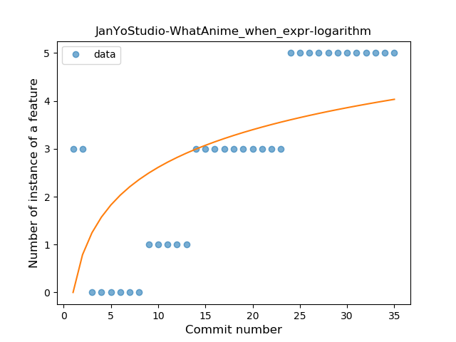
### <a name="companion_object">Companion Object</a>
----
#### Functions
* **Instability - Polinomial 3:** )
    * **R_Squared:** 0.27902922
* **Constant Rise - Linear:** 
    * **R_Squared:** 0.03482972
* **Sudden Rise Plateau - Logarithm:** 
    * **R_Squared:** 0.01323565

**Plots** :chart_with_upwards_trend:
-----

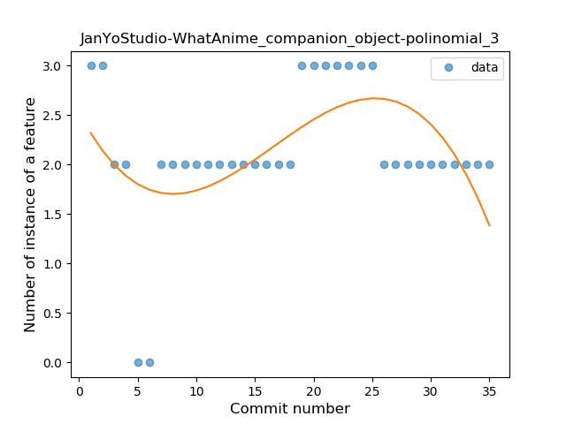
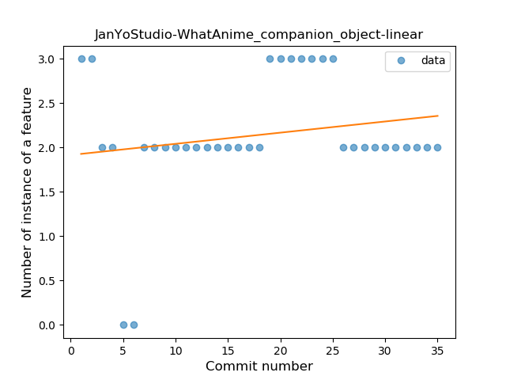
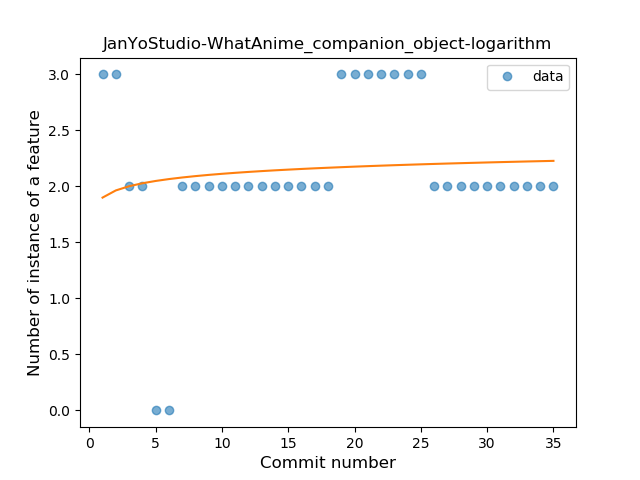
### <a name="unsafe_call">Unsafe Call</a>
----
#### Functions
* **Instability - Polinomial 4:** 
    * **R_Squared:** 0.85103091
* **Sudden Decline - Exponential:** 
    * **R_Squared:** 0.83600038
* **Instability - Polinomial 3:** )
    * **R_Squared:** 0.65625366
* **Constant Decline - Linear:** 
    * **R_Squared:** 0.11270569
* **Sudden Rise Plateau - Logarithm:** 
    * **R_Squared:** -0.0

**Plots** :chart_with_upwards_trend:
-----

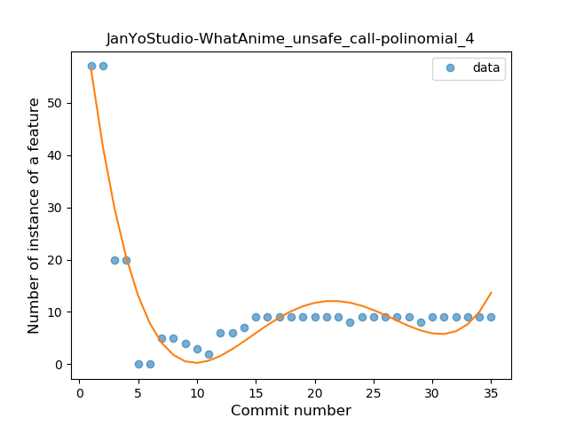
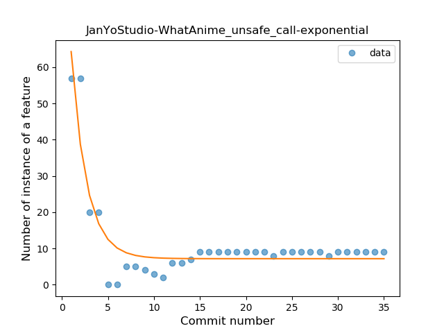
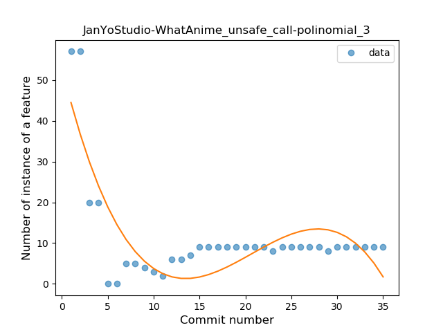
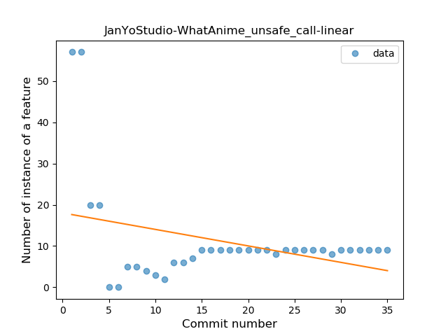
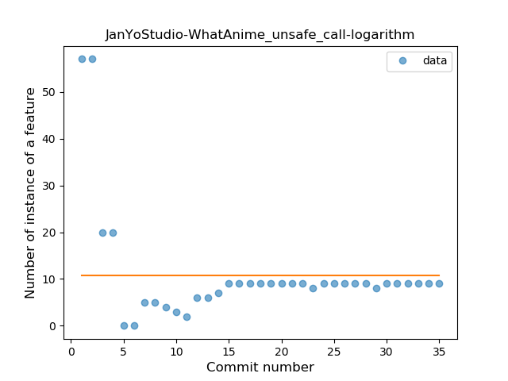
### <a name="string_template">String Template</a>
----
#### Functions
* **Instability - Polinomial 4:** 
    * **R_Squared:** 0.78858977
* **Plateau Sudden Rise - Binary Sigmoid:** 
    * **R_Squared:** 0.70367347
* **Sudden Rise Plateau - Logarithm:** 
    * **R_Squared:** 0.32736645
* **Constant Rise - Linear:** 
    * **R_Squared:** 0.14786386

**Plots** :chart_with_upwards_trend:
-----

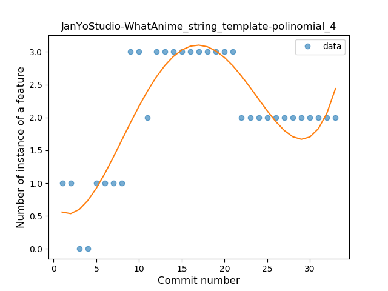
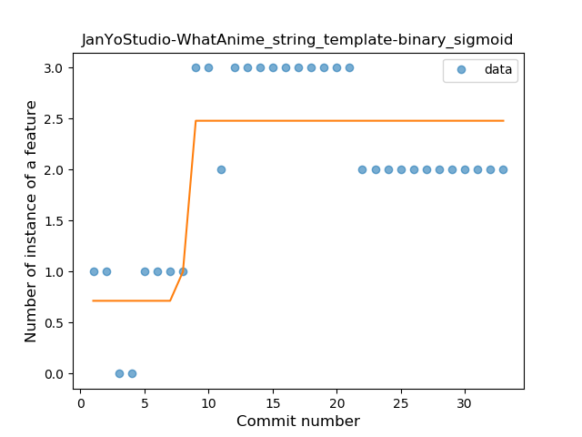
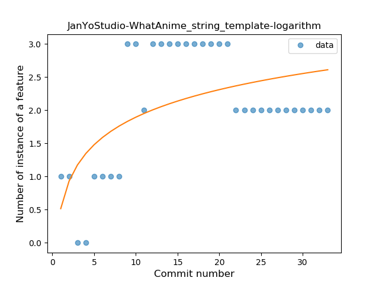
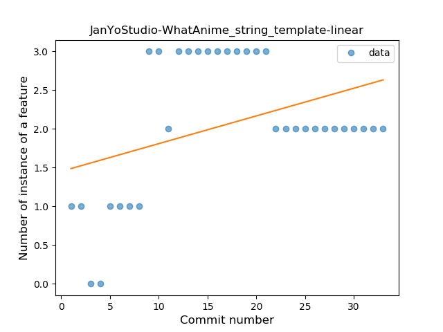
### <a name="singleton">Singleton</a>
----
#### Functions
* **Plateau Gradual Rise - Sigmoid:** 
    * **R_Squared:** 0.94807603
* **Instability - Polinomial 4:** 
    * **R_Squared:** 0.83973756
* **Sudden Rise Plateau - Logarithm:** 
    * **R_Squared:** 0.72953647
* **Constant Rise - Linear:** 
    * **R_Squared:** 0.5991148

**Plots** :chart_with_upwards_trend:
-----

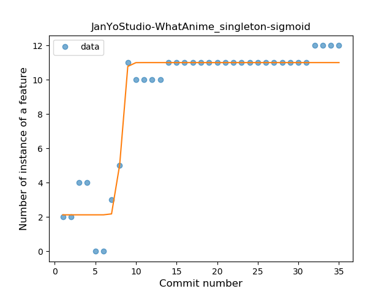
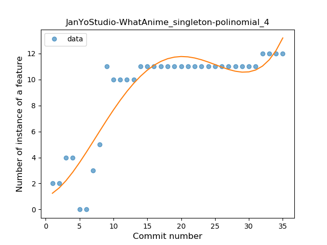
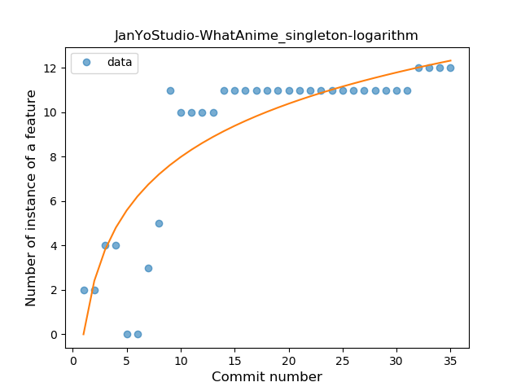
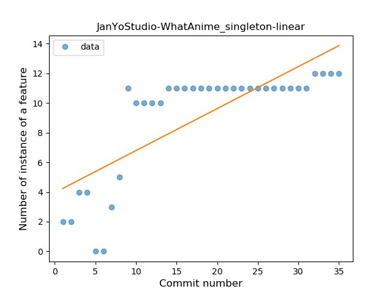
### <a name="smart_cast">Smart Cast</a>
----
#### Functions
* **Plateau Sudden Decline - Binary Sigmoid:** 
    * **R_Squared:** 1.0
* **Sudden Decline - Exponential:** 
    * **R_Squared:** 0.83538667
* **Instability - Polinomial 3:** )
    * **R_Squared:** 0.57805484
* **Constant Decline - Linear:** 
    * **R_Squared:** 0.16176471
* **Sudden Rise Plateau - Logarithm:** 
    * **R_Squared:** -0.0

**Plots** :chart_with_upwards_trend:
-----

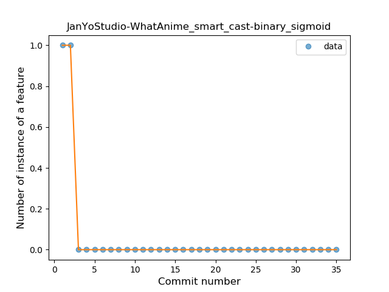
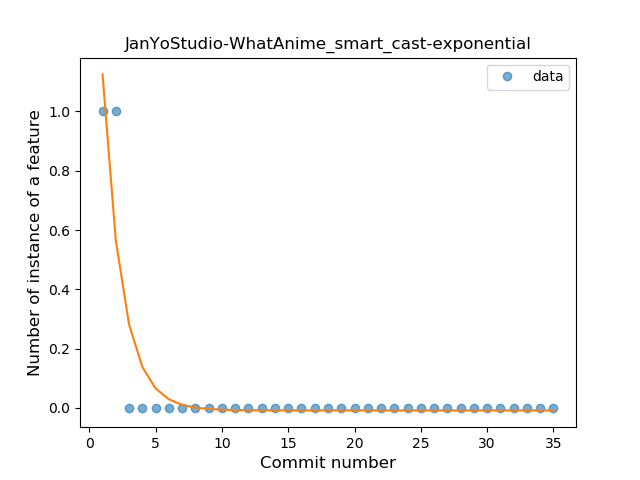
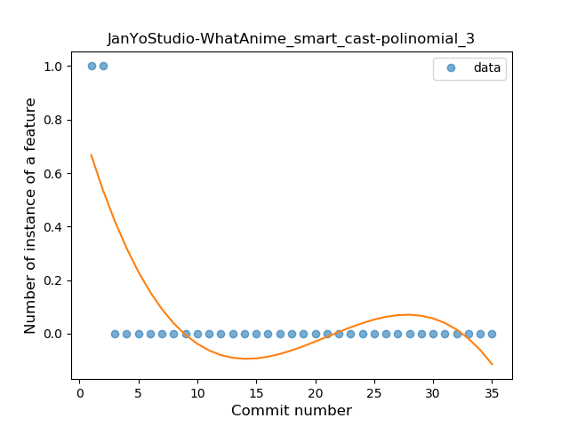
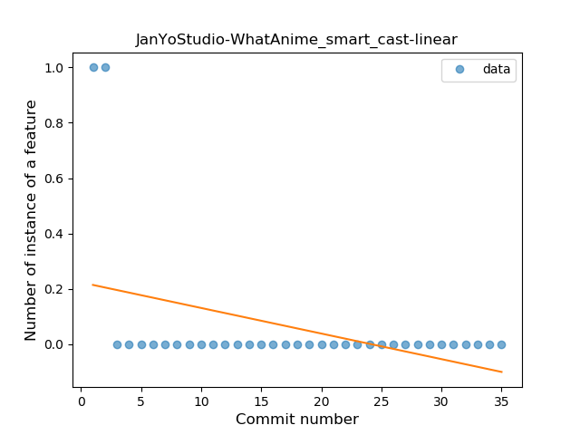
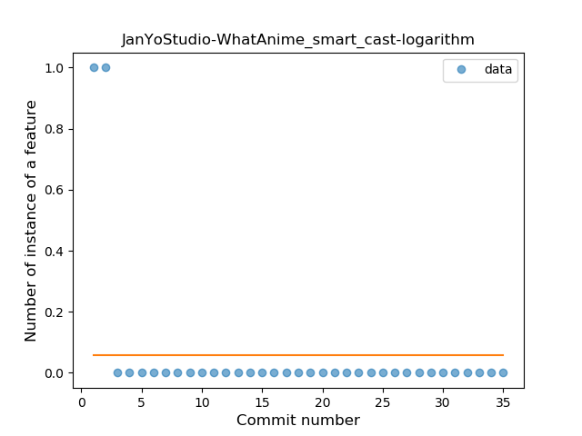
### <a name="property_delegation">Property Delegation</a>
----
#### Functions
* **Instability - Polinomial 3:** )
    * **R_Squared:** 0.82894737
* **Constant Decline - Linear:** 
    * **R_Squared:** 0.4375
* **Sudden Rise Plateau - Logarithm:** 
    * **R_Squared:** 0.0

**Plots** :chart_with_upwards_trend:
-----

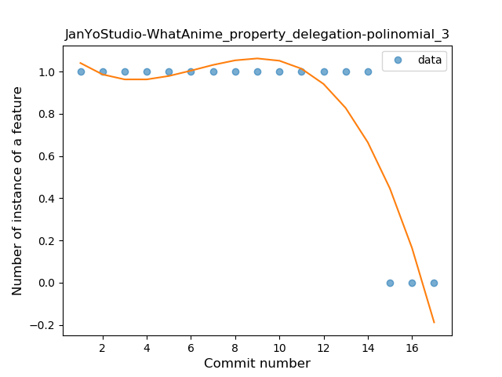
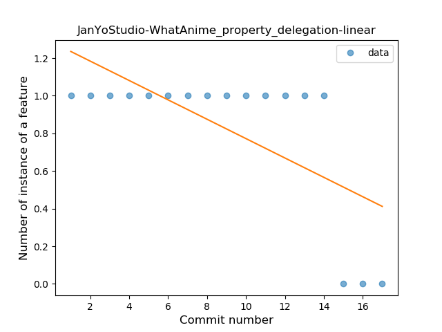
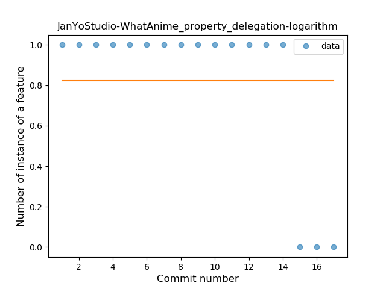
