## Jizzu-SimpleToDo
----
#### Metrics provided by Detekt
* Number of lines of code 2866
* Number of Kotlin files: 28
* Cyclomatic complexity: 343
* Cyclomatic complexity by thousands of lines: 234 

----
**7** features analyzed

*	<a href="#type_inference">Type Inference</a> 
*	<a href="#lambda">Lambda</a> 
*	<a href="#when_expr">When expression</a> 
*	<a href="#companion_object">Companion Object</a> 
*	<a href="#unsafe_call">Unsafe Call</a> 
*	<a href="#string_template">String Template</a> 
*	<a href="#property_delegation">Property Delegation</a> 

### <a name="type_inference">Type Inference</a>
----
#### Functions
* **Instability - Polinomial 4:** 
    * **R_Squared:** 0.54318421
* **Instability - Polinomial 3:** )
    * **R_Squared:** 0.4892621
* **Sudden Rise Plateau - Logarithm:** 
    * **R_Squared:** 0.28906841
* **Constant Rise - Linear:** 
    * **R_Squared:** 0.27571825

**Plots** :chart_with_upwards_trend:
-----

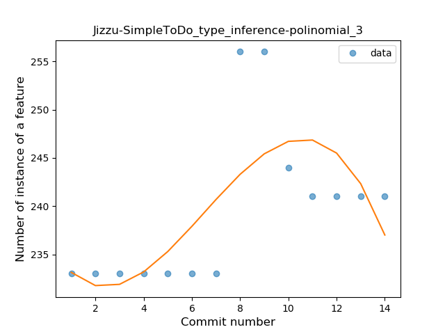
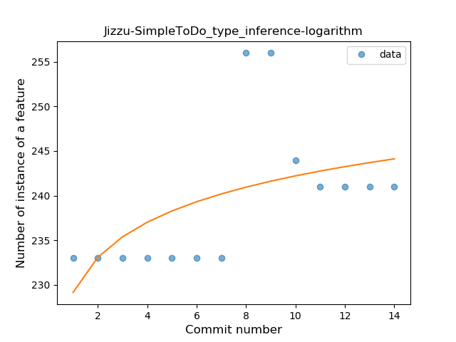
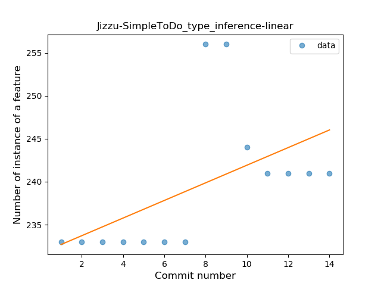
### <a name="lambda">Lambda</a>
----
#### Functions
* **Instability - Polinomial 4:** 
    * **R_Squared:** 0.25745111
* **Constant Decline - Linear:** 
    * **R_Squared:** -0.0
* **Sudden Rise - Exponential:** 
    * **R_Squared:** -0.0
* **Sudden Rise Plateau - Logarithm:** 
    * **R_Squared:** 0.00591341

**Plots** :chart_with_upwards_trend:
-----

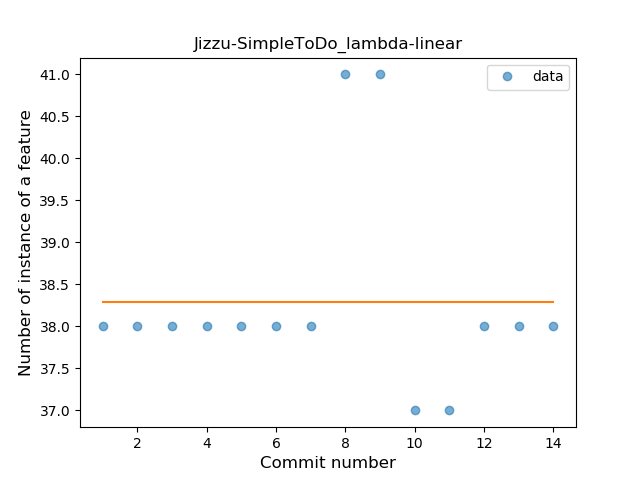
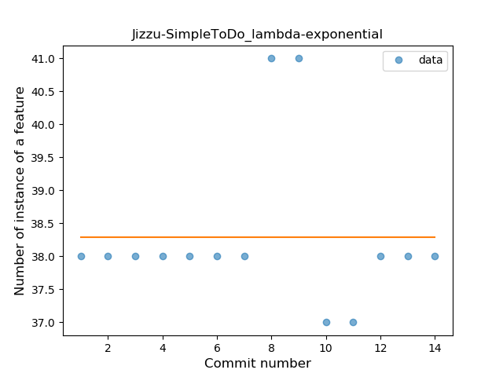
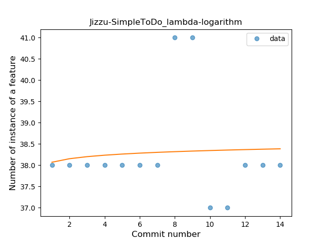
### <a name="when_expr">When expression</a>
----
#### Functions
* **Instability - Polinomial 3:** )
    * **R_Squared:** 0.86672151
* **Constant Rise - Linear:** 
    * **R_Squared:** 0.75384615
* **Sudden Rise Plateau - Logarithm:** 
    * **R_Squared:** 0.60767863

**Plots** :chart_with_upwards_trend:
-----

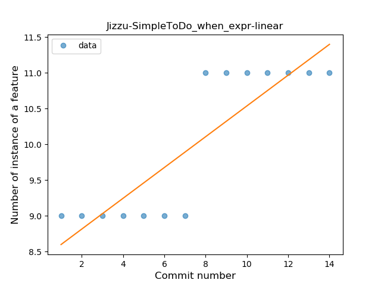
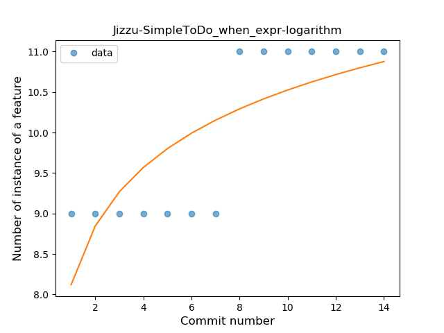
### <a name="companion_object">Companion Object</a>
----
#### Functions
* **Instability - Polinomial 3:** )
    * **R_Squared:** 0.86672151
* **Constant Rise - Linear:** 
    * **R_Squared:** 0.75384615
* **Sudden Rise Plateau - Logarithm:** 
    * **R_Squared:** 0.60767863

**Plots** :chart_with_upwards_trend:
-----

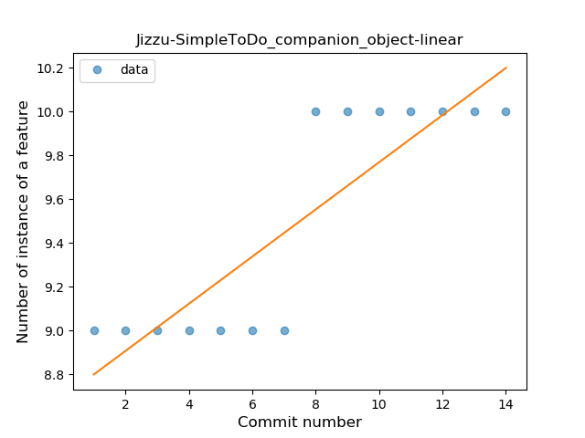
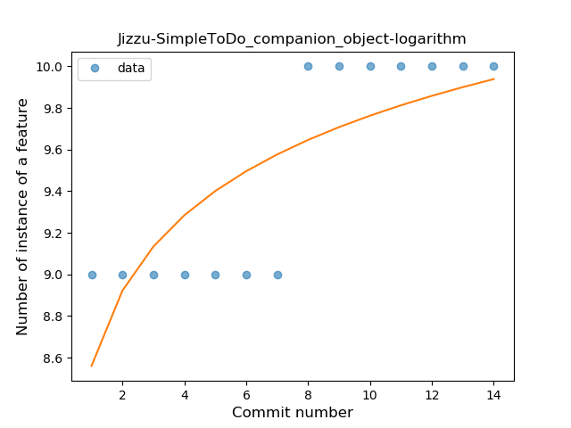
### <a name="unsafe_call">Unsafe Call</a>
----
#### Functions
* **Instability - Polinomial 4:** 
    * **R_Squared:** 0.89055944
* **Constant Decline - Linear:** 
    * **R_Squared:** 0.69230769
* **Sudden Rise Plateau - Logarithm:** 
    * **R_Squared:** -0.0

**Plots** :chart_with_upwards_trend:
-----

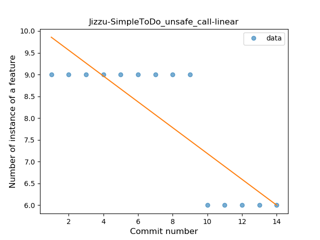
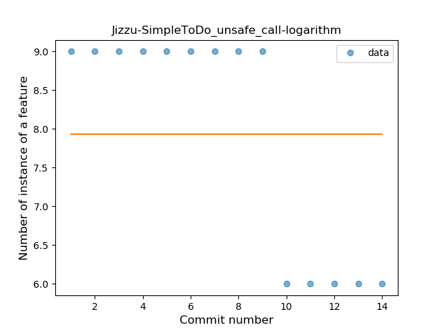
### <a name="string_template">String Template</a>
----
#### Functions
* **Instability - Polinomial 4:** 
    * **R_Squared:** 0.93179756
* **Constant Decline - Linear:** 
    * **R_Squared:** 0.68878113
* **Sudden Rise Plateau - Logarithm:** 
    * **R_Squared:** -0.0

**Plots** :chart_with_upwards_trend:
-----

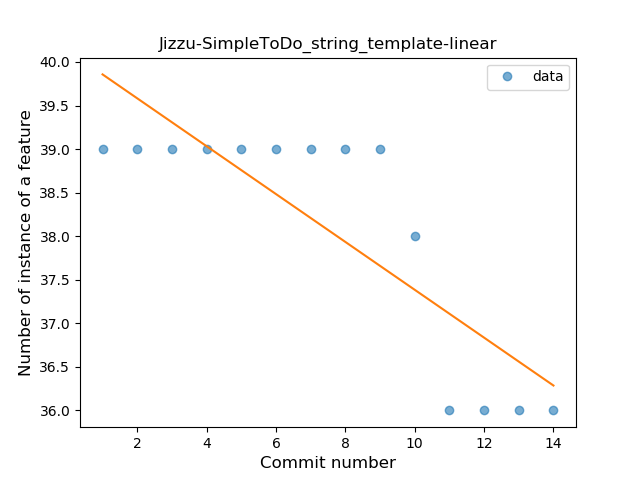
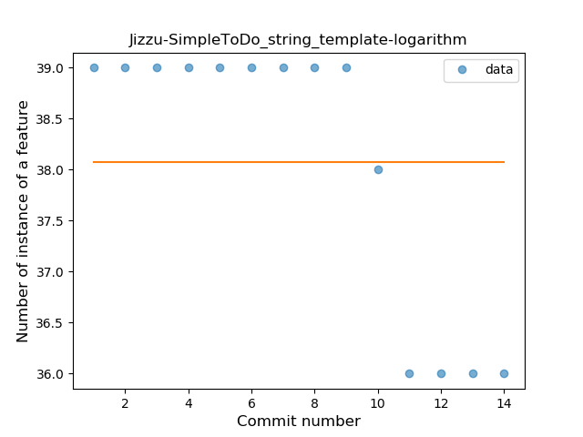
### <a name="property_delegation">Property Delegation</a>
----
#### Functions
* **Instability - Polinomial 4:** 
    * **R_Squared:** 0.89055944
* **Constant Decline - Linear:** 
    * **R_Squared:** 0.69230769
* **Sudden Rise Plateau - Logarithm:** 
    * **R_Squared:** -0.0

**Plots** :chart_with_upwards_trend:
-----

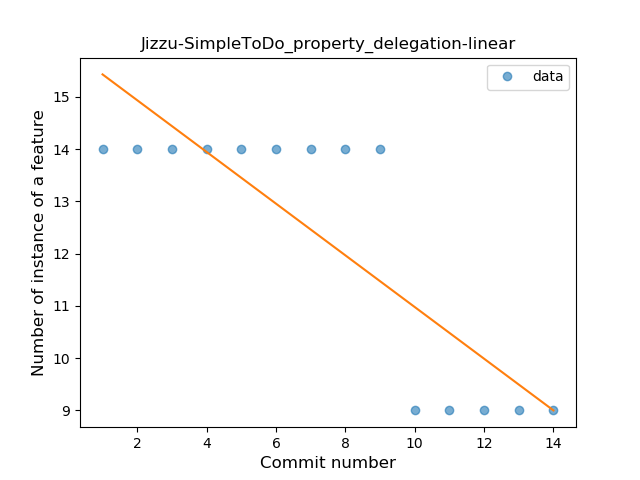
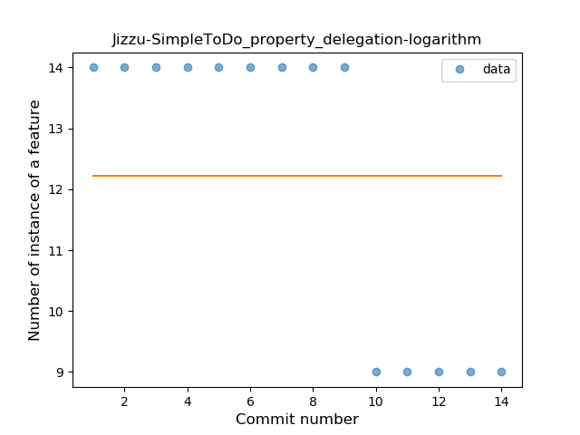
