## LISTEN-moe-android-app
----
#### Metrics provided by Detekt
* Number of lines of code 5781
* Number of Kotlin files: 81
* Cyclomatic complexity: 747
* Cyclomatic complexity by thousands of lines: 264 

----
**13** features analyzed

*	<a href="#type_inference">Type Inference</a> 
*	<a href="#lambda">Lambda</a> 
*	<a href="#safe_call">Safe Call</a> 
*	<a href="#when_expr">When expression</a> 
*	<a href="#companion_object">Companion Object</a> 
*	<a href="#unsafe_call">Unsafe Call</a> 
*	<a href="#string_template">String Template</a> 
*	<a href="#func_with_default_value">Function with Default Value</a> 
*	<a href="#singleton">Singleton</a> 
*	<a href="#smart_cast">Smart Cast</a> 
*	<a href="#range_expr">Range Expression</a> 
*	<a href="#data_class">Data Class</a> 
*	<a href="#extension_function">Extension Function</a> 

### <a name="type_inference">Type Inference</a>
----
#### Functions
* **Instability - Polinomial 4:** 
    * **R_Squared:** 0.84892091
* **Instability - Polinomial 3:** )
    * **R_Squared:** 0.75123372
* **Sudden Rise Plateau - Logarithm:** 
    * **R_Squared:** 0.56949056
* **Constant Rise - Linear:** 
    * **R_Squared:** 0.24846669

**Plots** :chart_with_upwards_trend:
-----

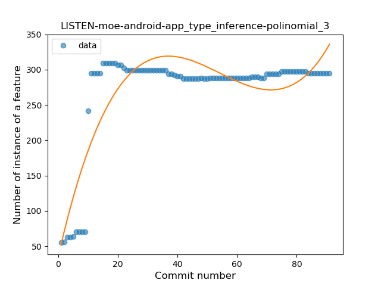
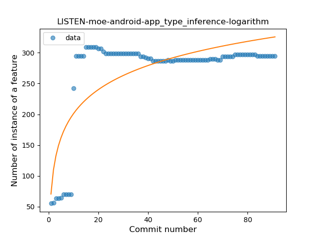
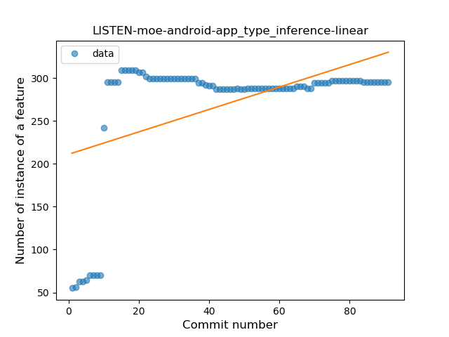
### <a name="lambda">Lambda</a>
----
#### Functions
* **Instability - Polinomial 3:** )
    * **R_Squared:** 0.84698633
* **Sudden Rise Plateau - Logarithm:** 
    * **R_Squared:** 0.72697089
* **Constant Rise - Linear:** 
    * **R_Squared:** 0.41178846
* **Plateau Sudden Rise - Binary Sigmoid:** 
    * **R_Squared:** 0.18160945

**Plots** :chart_with_upwards_trend:
-----

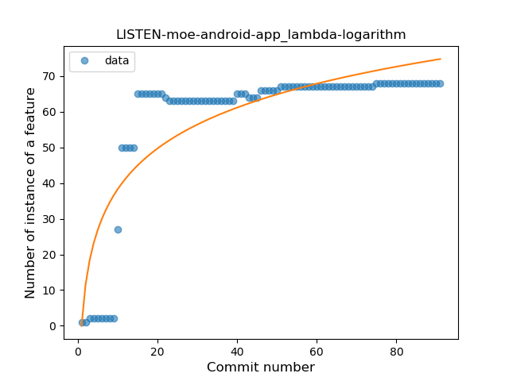
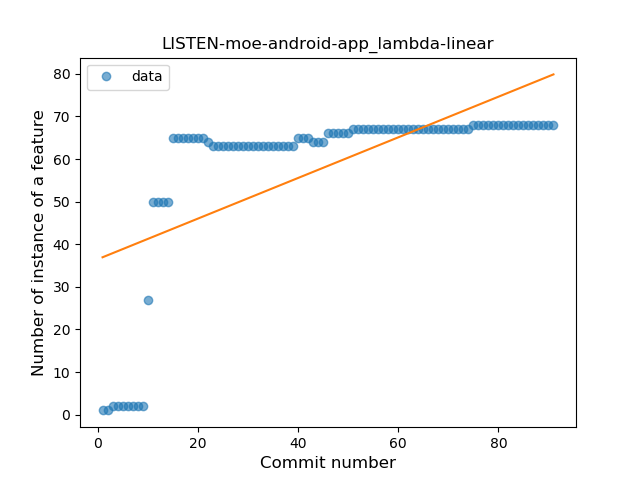
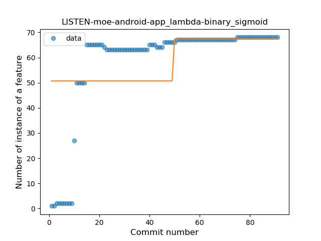
### <a name="safe_call">Safe Call</a>
----
#### Functions
* **Sudden Rise - Exponential:** 
    * **R_Squared:** 0.92900658
* **Constant Rise - Linear:** 
    * **R_Squared:** 0.89331594
* **Sudden Rise Plateau - Logarithm:** 
    * **R_Squared:** 0.48183411

**Plots** :chart_with_upwards_trend:
-----

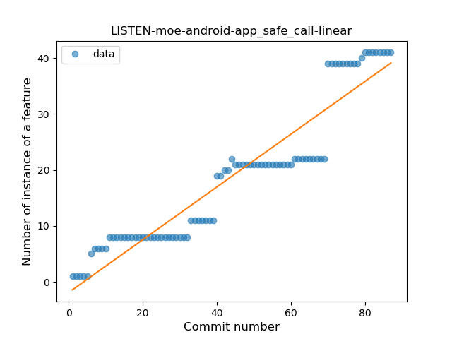
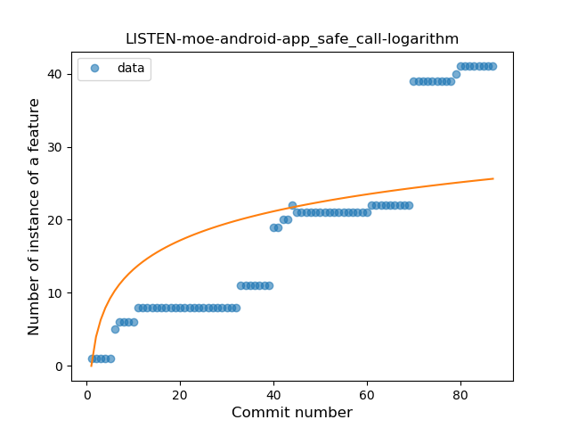
### <a name="when_expr">When expression</a>
----
#### Functions
* **Sudden Rise Plateau - Logarithm:** 
    * **R_Squared:** 0.03022781
* **Constant Decline - Linear:** 
    * **R_Squared:** 0.0011557
* **Sudden Decline - Exponential:** 
    * **R_Squared:** 0.00114917

**Plots** :chart_with_upwards_trend:
-----

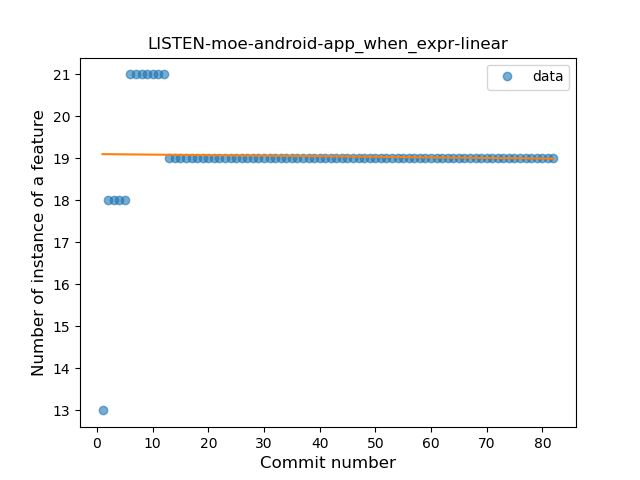
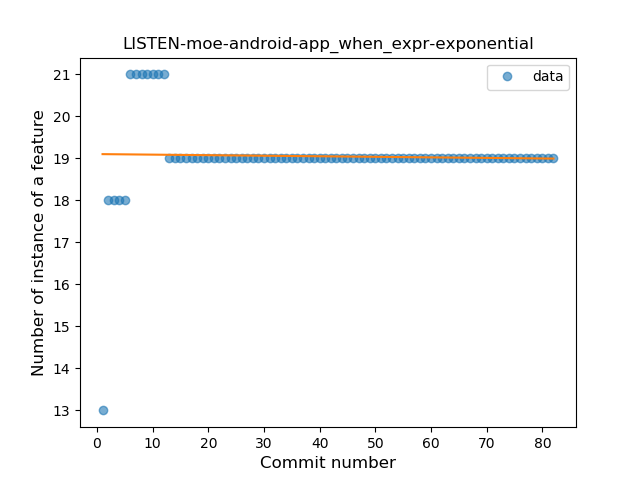
### <a name="companion_object">Companion Object</a>
----
#### Functions
* **Instability - Polinomial 3:** )
    * **R_Squared:** 0.82179786
* **Sudden Rise Plateau - Logarithm:** 
    * **R_Squared:** 0.77850116
* **Plateau Sudden Rise - Binary Sigmoid:** 
    * **R_Squared:** 0.63783468
* **Constant Rise - Linear:** 
    * **R_Squared:** 0.5016673

**Plots** :chart_with_upwards_trend:
-----

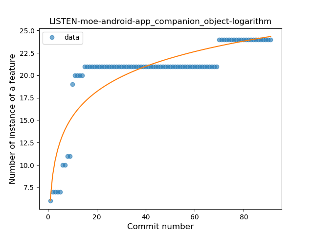
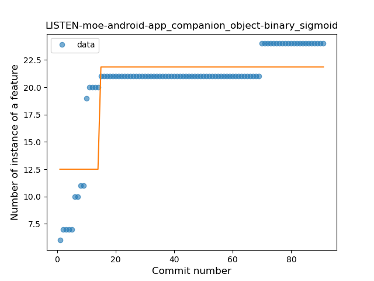
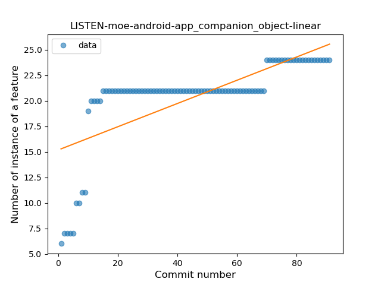
### <a name="unsafe_call">Unsafe Call</a>
----
#### Functions
* **Instability - Polinomial 4:** 
    * **R_Squared:** 0.82204899
* **Instability - Polinomial 3:** )
    * **R_Squared:** 0.73858605
* **Sudden Rise Plateau - Logarithm:** 
    * **R_Squared:** 0.34829706
* **Constant Rise - Linear:** 
    * **R_Squared:** 0.07737676

**Plots** :chart_with_upwards_trend:
-----

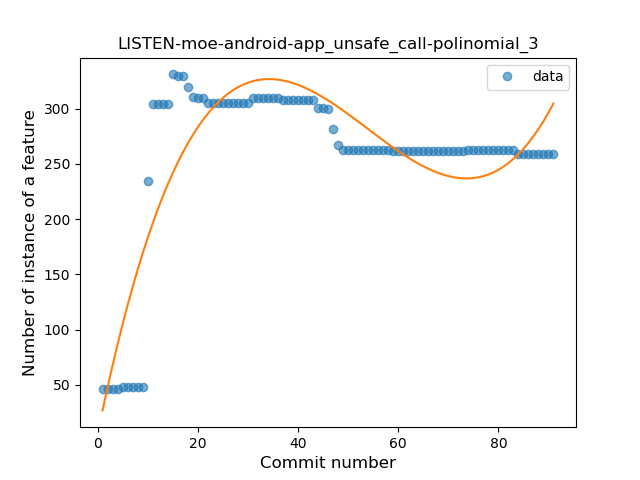
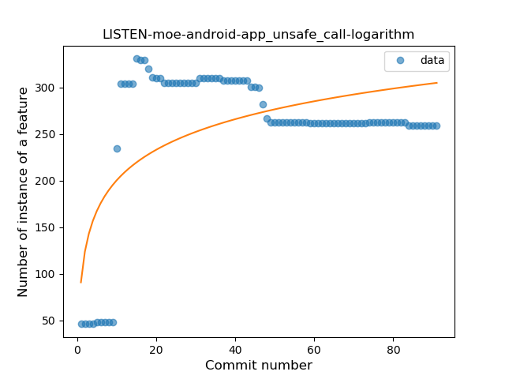
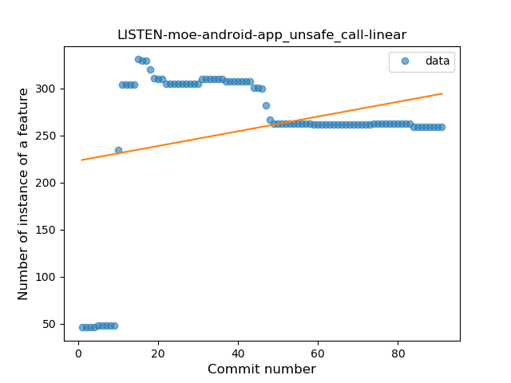
### <a name="string_template">String Template</a>
----
#### Functions
* **Instability - Polinomial 3:** )
    * **R_Squared:** 0.8639126
* **Sudden Rise Plateau - Logarithm:** 
    * **R_Squared:** 0.76011433
* **Constant Rise - Linear:** 
    * **R_Squared:** 0.61282508

**Plots** :chart_with_upwards_trend:
-----

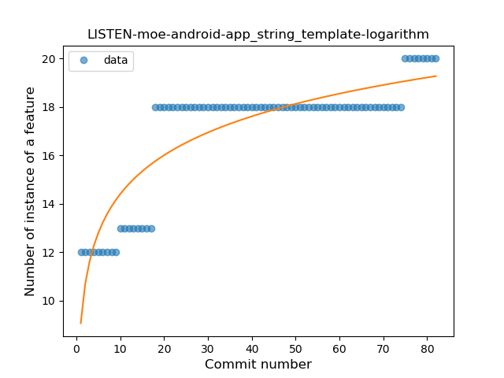
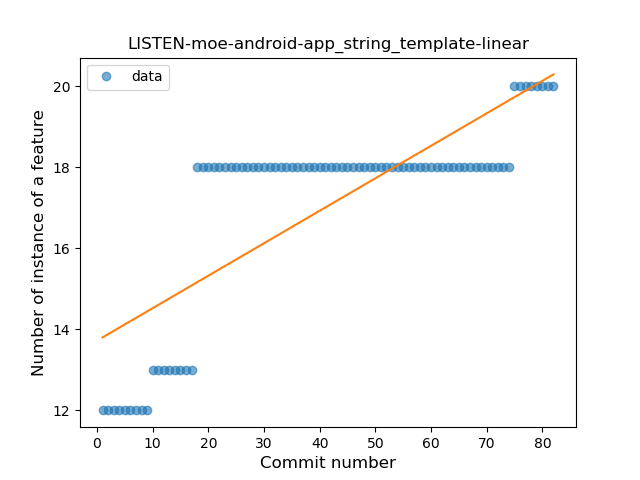
### <a name="func_with_default_value">Function with Default Value</a>
----
#### Functions
* **Plateau Sudden Rise - Binary Sigmoid:** 
    * **R_Squared:** 0.96060221
* **Sudden Rise Plateau - Logarithm:** 
    * **R_Squared:** 0.77018131
* **Constant Rise - Linear:** 
    * **R_Squared:** 0.66440889

**Plots** :chart_with_upwards_trend:
-----

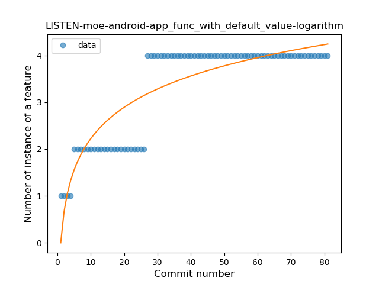
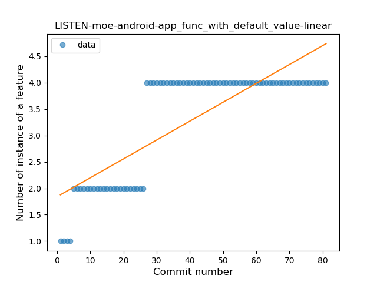
### <a name="singleton">Singleton</a>
----
#### Functions
* **Instability - Polinomial 3:** )
    * **R_Squared:** 0.5842663
* **Plateau Sudden Decline - Binary Sigmoid:** 
    * **R_Squared:** 0.22856604
* **Constant Decline - Linear:** 
    * **R_Squared:** 0.05763416
* **Sudden Rise Plateau - Logarithm:** 
    * **R_Squared:** 0.00441037

**Plots** :chart_with_upwards_trend:
-----

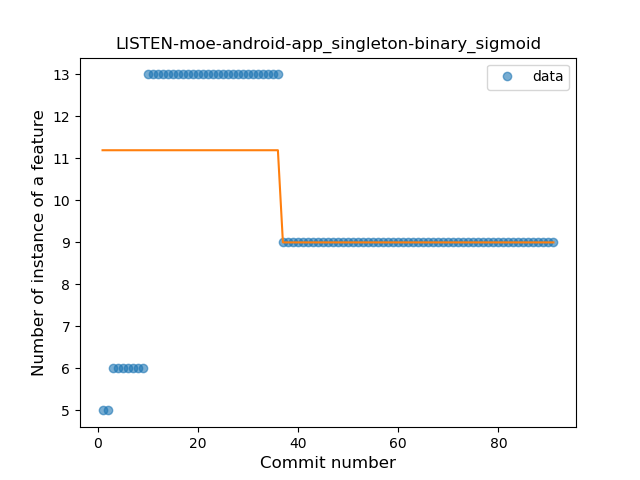
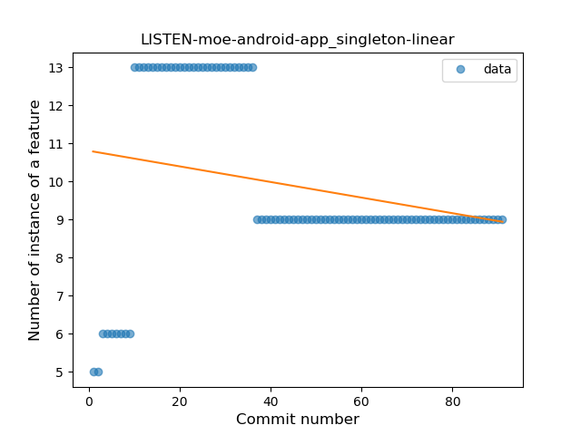
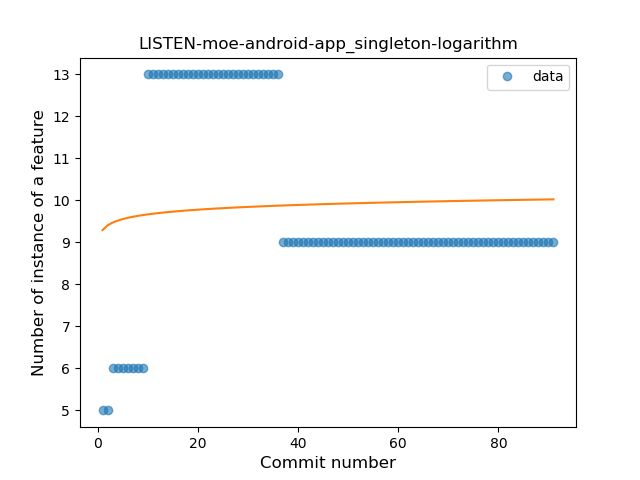
### <a name="smart_cast">Smart Cast</a>
----
#### Functions
* **Sudden Rise Plateau - Logarithm:** 
    * **R_Squared:** 0.17585611
* **Constant Rise - Linear:** 
    * **R_Squared:** 0.03614458

**Plots** :chart_with_upwards_trend:
-----

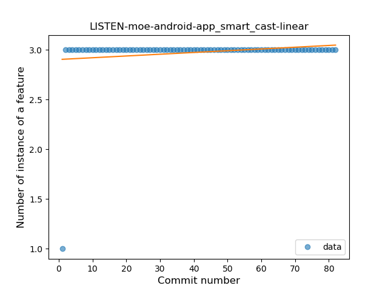
### <a name="range_expr">Range Expression</a>
----
#### Functions
* **Plateau Sudden Rise - Binary Sigmoid:** 
    * **R_Squared:** 1.0
* **Sudden Rise Plateau - Logarithm:** 
    * **R_Squared:** 0.65730925
* **Constant Rise - Linear:** 
    * **R_Squared:** 0.39057971

**Plots** :chart_with_upwards_trend:
-----

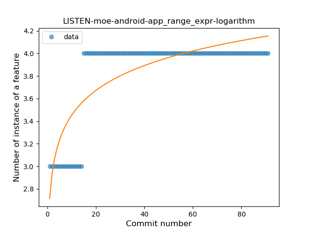
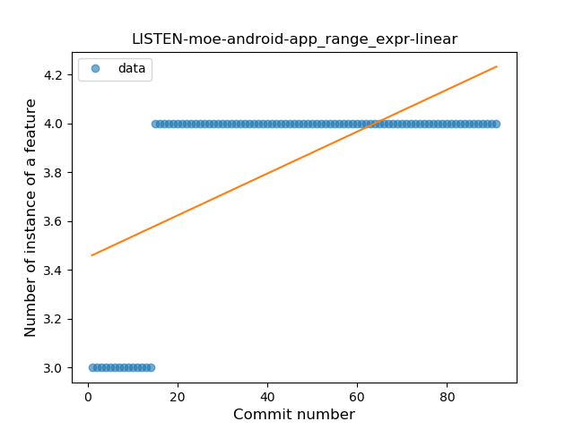
### <a name="data_class">Data Class</a>
----
#### Functions
* **Sudden Rise Plateau - Logarithm:** 
    * **R_Squared:** 0.18795156
* **Constant Rise - Linear:** 
    * **R_Squared:** 0.04054054

**Plots** :chart_with_upwards_trend:
-----

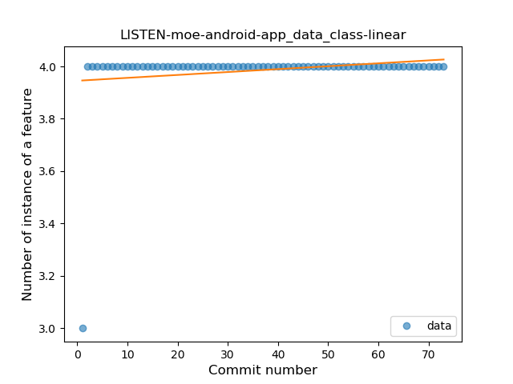
### <a name="extension_function">Extension Function</a>
----
#### Functions
* **Constant Decline - Linear:** 
    * **R_Squared:** 0.24845679
* **Plateau Sudden Rise - Binary Sigmoid:** 
    * **R_Squared:** 0.09465016
* **Sudden Rise Plateau - Logarithm:** 
    * **R_Squared:** -0.0

**Plots** :chart_with_upwards_trend:
-----

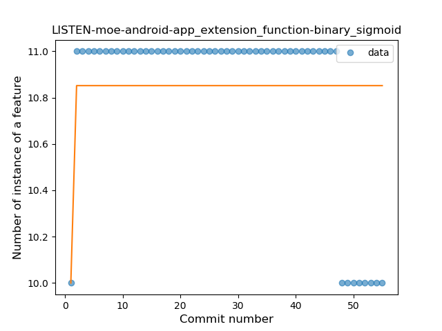
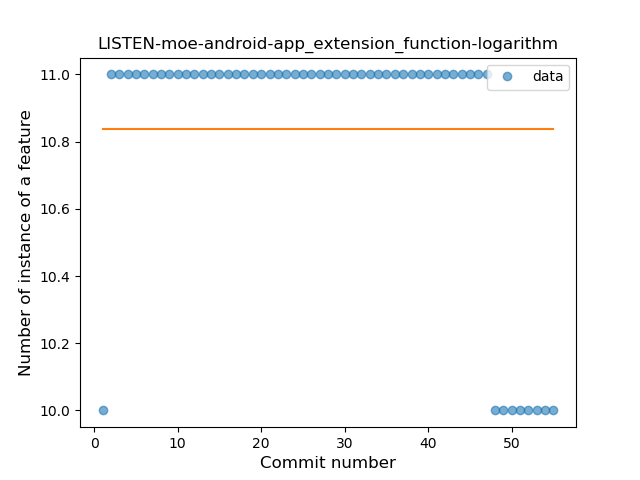
