## LaurentTreguier-deck
----
#### Metrics provided by Detekt
* Number of lines of code 744
* Number of Kotlin files: 8
* Cyclomatic complexity: 128
* Cyclomatic complexity by thousands of lines: 293 

----
**7** features analyzed

*	<a href="#type_inference">Type Inference</a> 
*	<a href="#lambda">Lambda</a> 
*	<a href="#safe_call">Safe Call</a> 
*	<a href="#when_expr">When expression</a> 
*	<a href="#companion_object">Companion Object</a> 
*	<a href="#unsafe_call">Unsafe Call</a> 
*	<a href="#extension_function">Extension Function</a> 

### <a name="type_inference">Type Inference</a>
----
#### Functions
* **Constant Rise - Linear:** 
    * **R_Squared:** 0.82788175
* **Sudden Rise Plateau - Logarithm:** 
    * **R_Squared:** 0.75990134

**Plots** :chart_with_upwards_trend:
-----

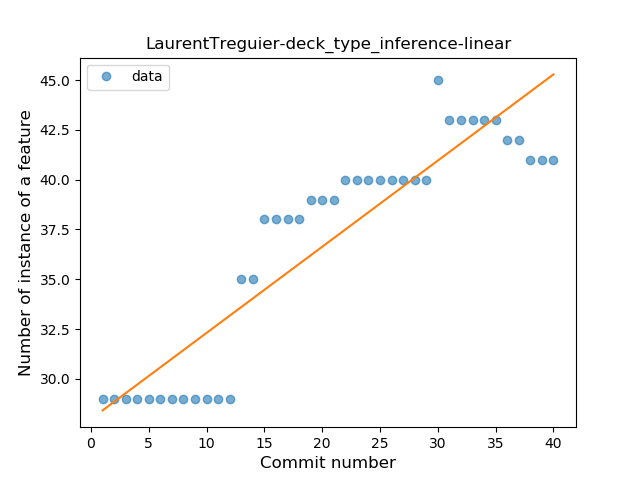
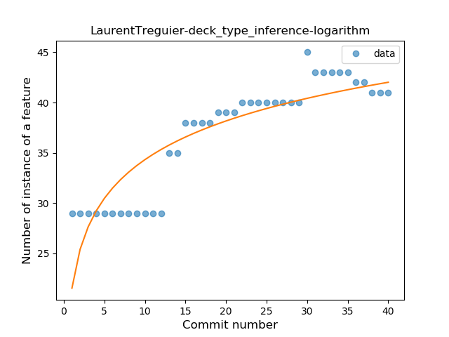
### <a name="lambda">Lambda</a>
----
#### Functions
* **Sudden Rise - Exponential:** 
    * **R_Squared:** 0.95291549
* **Constant Rise - Linear:** 
    * **R_Squared:** 0.92352242
* **Sudden Rise Plateau - Logarithm:** 
    * **R_Squared:** 0.63971654

**Plots** :chart_with_upwards_trend:
-----

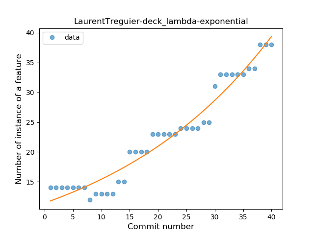
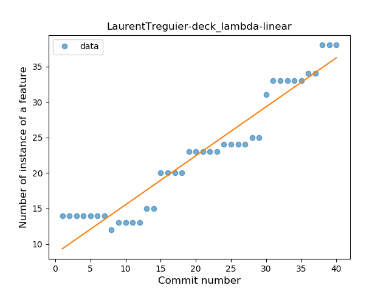
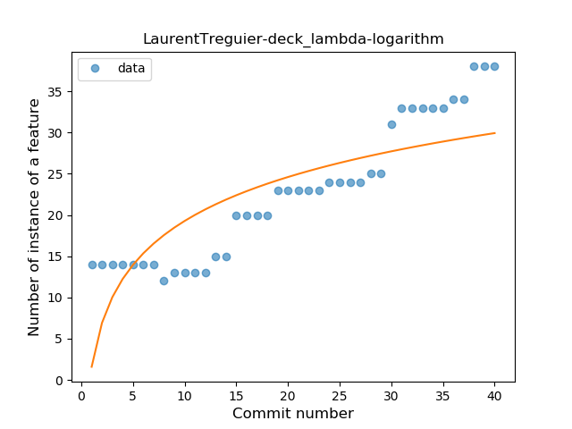
### <a name="safe_call">Safe Call</a>
----
#### Functions
* **Instability - Polinomial 3:** )
    * **R_Squared:** 0.85359093
* **Constant Rise - Linear:** 
    * **R_Squared:** 0.82380344
* **Sudden Rise Plateau - Logarithm:** 
    * **R_Squared:** 0.63211264

**Plots** :chart_with_upwards_trend:
-----

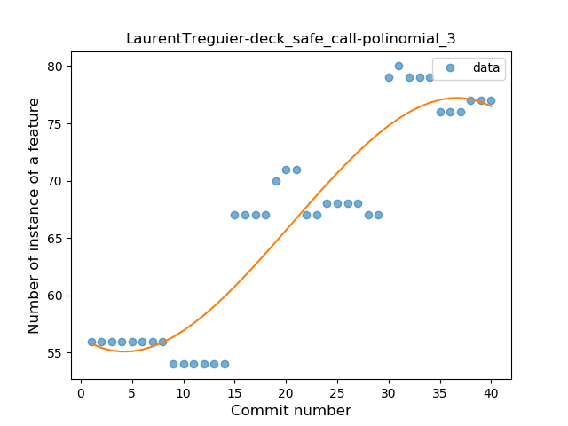
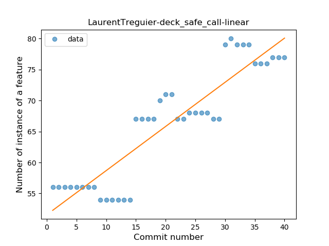
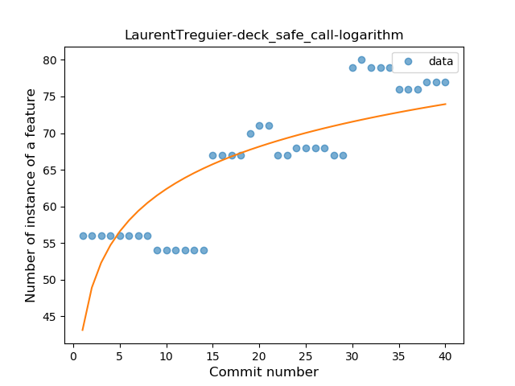
### <a name="when_expr">When expression</a>
----
#### Functions
* **Sudden Rise - Exponential:** 
    * **R_Squared:** 0.83019415
* **Constant Rise - Linear:** 
    * **R_Squared:** 0.74460044
* **Sudden Rise Plateau - Logarithm:** 
    * **R_Squared:** 0.50722139

**Plots** :chart_with_upwards_trend:
-----

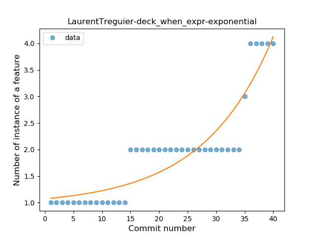
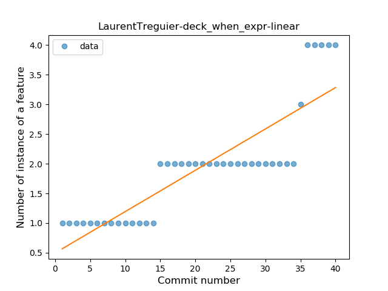
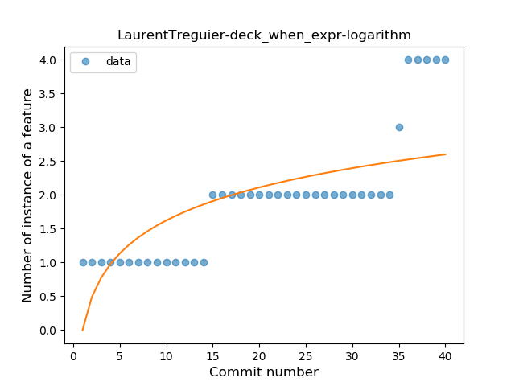
### <a name="companion_object">Companion Object</a>
----
#### Functions
* **Plateau Gradual Rise - Sigmoid:** 
    * **R_Squared:** 0.93805677
* **Constant Rise - Linear:** 
    * **R_Squared:** 0.81056381
* **Sudden Rise Plateau - Logarithm:** 
    * **R_Squared:** 0.73299627

**Plots** :chart_with_upwards_trend:
-----

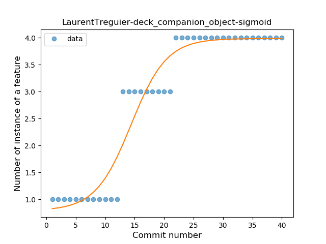
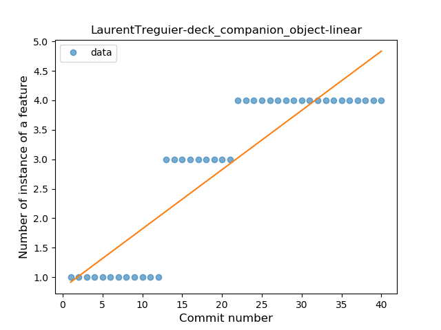
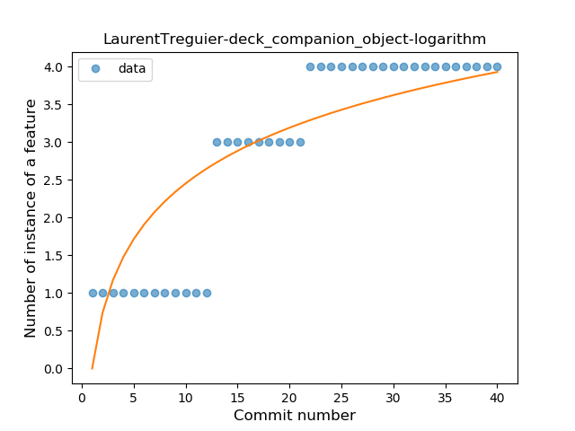
### <a name="unsafe_call">Unsafe Call</a>
----
#### Functions
* **Plateau Gradual Rise - Sigmoid:** 
    * **R_Squared:** 0.9367828
* **Constant Rise - Linear:** 
    * **R_Squared:** 0.92115835
* **Sudden Rise - Exponential:** 
    * **R_Squared:** 0.92248544
* **Sudden Rise Plateau - Logarithm:** 
    * **R_Squared:** 0.55700816

**Plots** :chart_with_upwards_trend:
-----

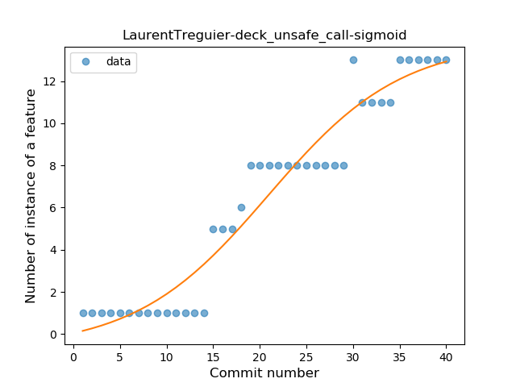
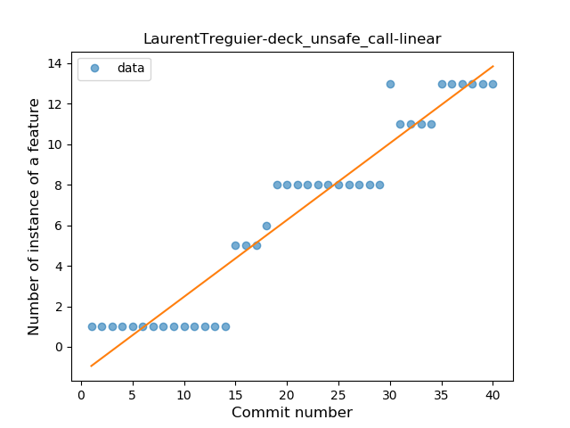
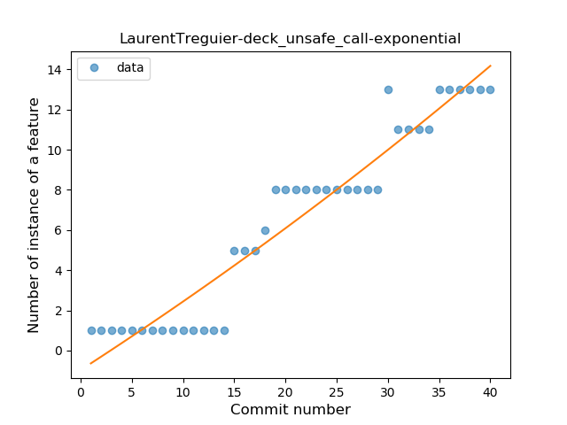
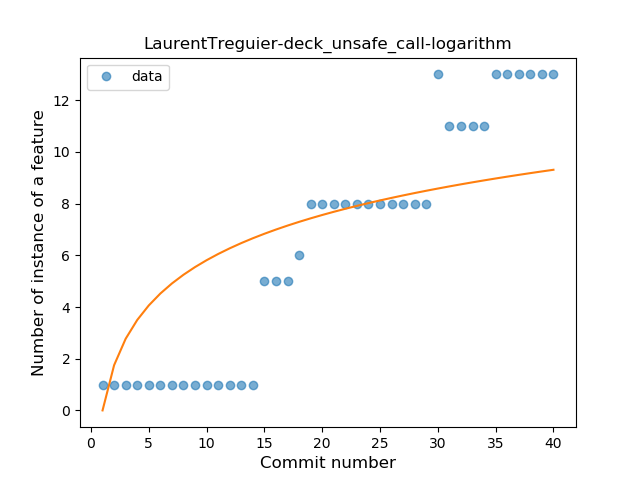
### <a name="extension_function">Extension Function</a>
----
#### Functions
* **Plateau Sudden Decline - Binary Sigmoid:** 
    * **R_Squared:** 1.0
* **Instability - Polinomial 3:** )
    * **R_Squared:** 0.83928571
* **Instability - Polinomial 4:** 
    * **R_Squared:** 0.8487395
* **Sudden Decline - Exponential:** 
    * **R_Squared:** 0.82003866
* **Constant Decline - Linear:** 
    * **R_Squared:** 0.39285714
* **Sudden Rise Plateau - Logarithm:** 
    * **R_Squared:** -0.0

**Plots** :chart_with_upwards_trend:
-----

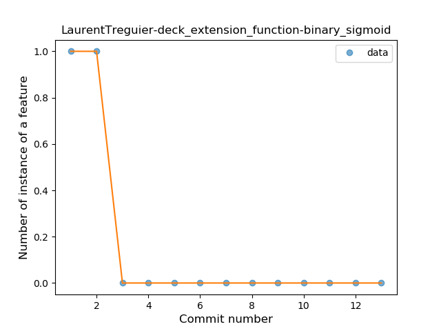
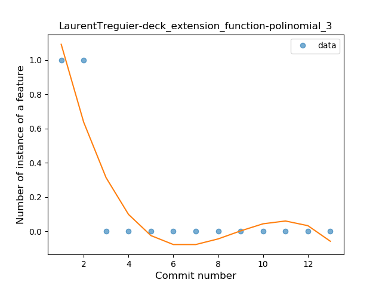
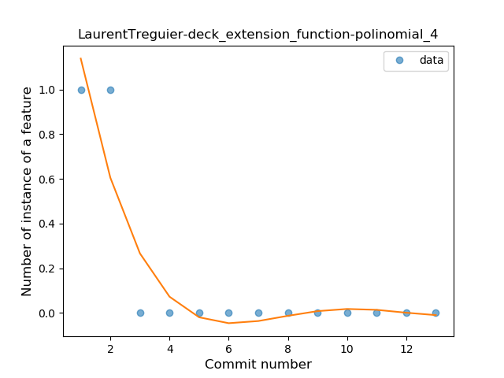
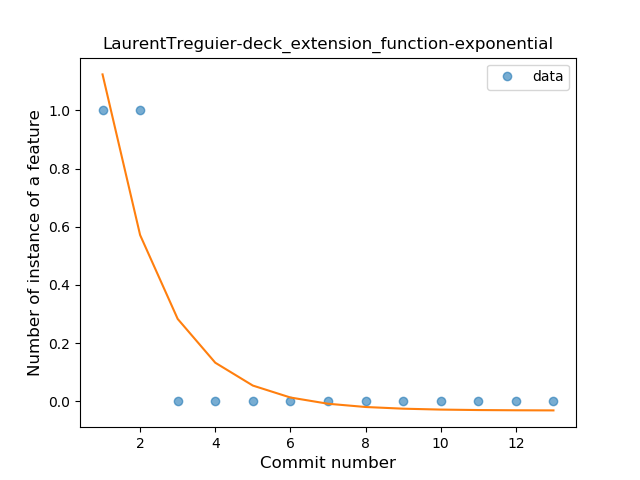
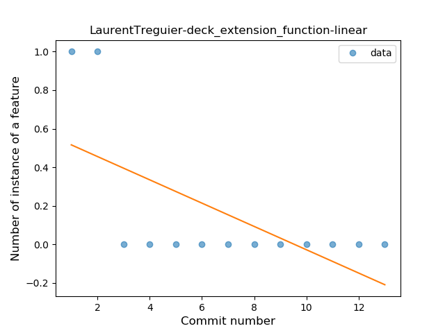
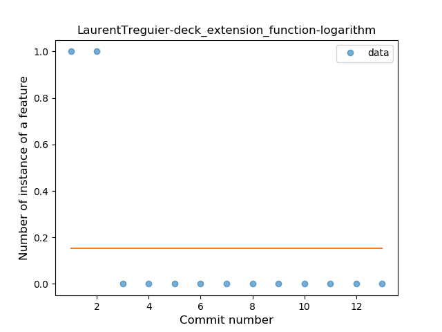
