## LawnchairLauncher-Lawnchair
----
#### Metrics provided by Detekt
* Number of lines of code 5896
* Number of Kotlin files: 58
* Cyclomatic complexity: 1029
* Cyclomatic complexity by thousands of lines: 300 

----
**16** features analyzed

*	<a href="#type_inference">Type Inference</a> 
*	<a href="#lambda">Lambda</a> 
*	<a href="#safe_call">Safe Call</a> 
*	<a href="#when_expr">When expression</a> 
*	<a href="#companion_object">Companion Object</a> 
*	<a href="#unsafe_call">Unsafe Call</a> 
*	<a href="#string_template">String Template</a> 
*	<a href="#func_with_default_value">Function with Default Value</a> 
*	<a href="#singleton">Singleton</a> 
*	<a href="#smart_cast">Smart Cast</a> 
*	<a href="#func_call_with_named_arg">Function call with Named Argument</a> 
*	<a href="#data_class">Data Class</a> 
*	<a href="#extension_function">Extension Function</a> 
*	<a href="#property_delegation">Property Delegation</a> 
*	<a href="#inline_func">Inline Function</a> 
*	<a href="#overloaded_op">Overloaded Operator</a> 

### <a name="type_inference">Type Inference</a>
----
#### Functions
* **Sudden Rise Plateau - Logarithm:** 
    * **R_Squared:** 0.78316421
* **Constant Rise - Linear:** 
    * **R_Squared:** 0.77212691
* **Plateau Sudden Rise - Binary Sigmoid:** 
    * **R_Squared:** 0.63228199

**Plots** :chart_with_upwards_trend:
-----

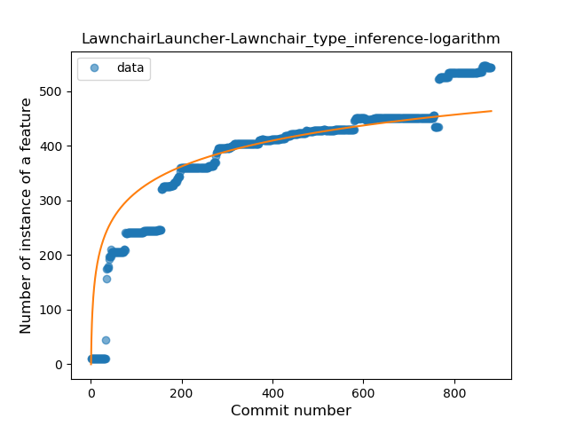
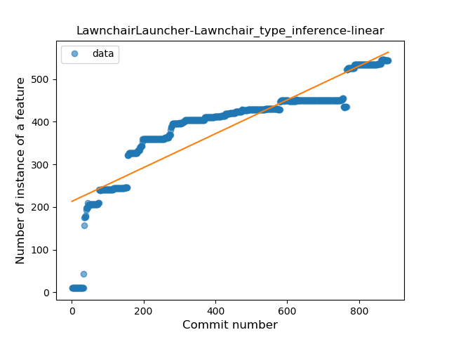
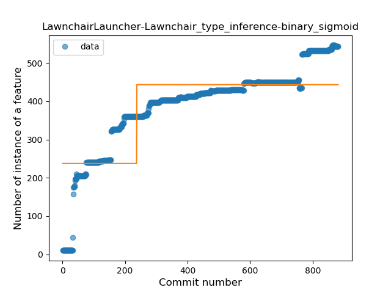
### <a name="lambda">Lambda</a>
----
#### Functions
* **Constant Rise - Linear:** 
    * **R_Squared:** 0.92181217
* **Sudden Rise - Exponential:** 
    * **R_Squared:** 0.92763559
* **Sudden Rise Plateau - Logarithm:** 
    * **R_Squared:** 0.42445808
* **Plateau Sudden Rise - Binary Sigmoid:** 
    * **R_Squared:** 0.10450153

**Plots** :chart_with_upwards_trend:
-----

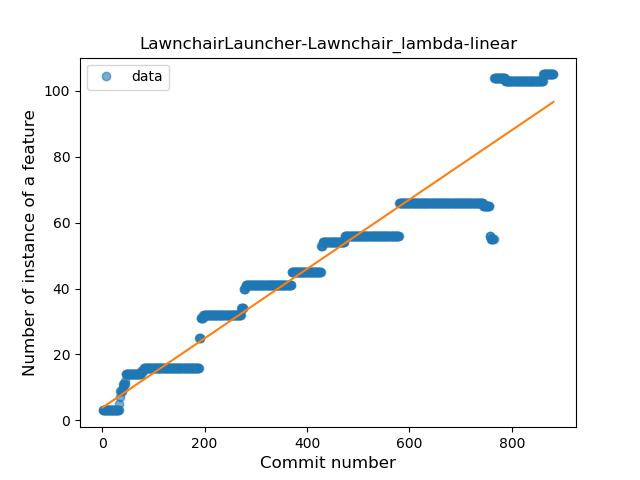
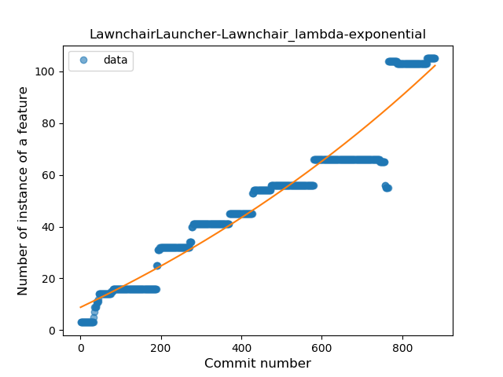
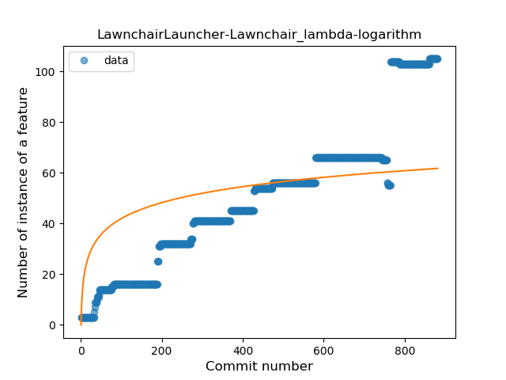
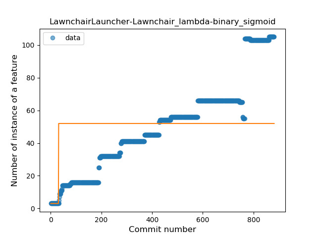
### <a name="safe_call">Safe Call</a>
----
#### Functions
* **Constant Rise - Linear:** 
    * **R_Squared:** 0.77693172
* **Sudden Rise Plateau - Logarithm:** 
    * **R_Squared:** 0.4676734

**Plots** :chart_with_upwards_trend:
-----

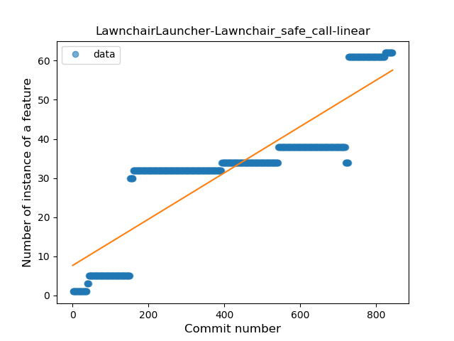
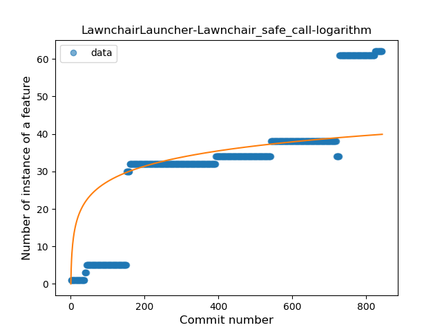
### <a name="when_expr">When expression</a>
----
#### Functions
* **Sudden Rise - Exponential:** 
    * **R_Squared:** 0.90798242
* **Constant Rise - Linear:** 
    * **R_Squared:** 0.78635299
* **Sudden Rise Plateau - Logarithm:** 
    * **R_Squared:** 0.3945167
* **Plateau Sudden Rise - Binary Sigmoid:** 
    * **R_Squared:** 0.06483007

**Plots** :chart_with_upwards_trend:
-----

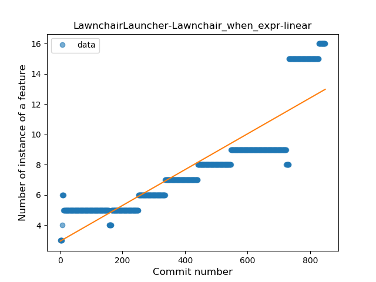
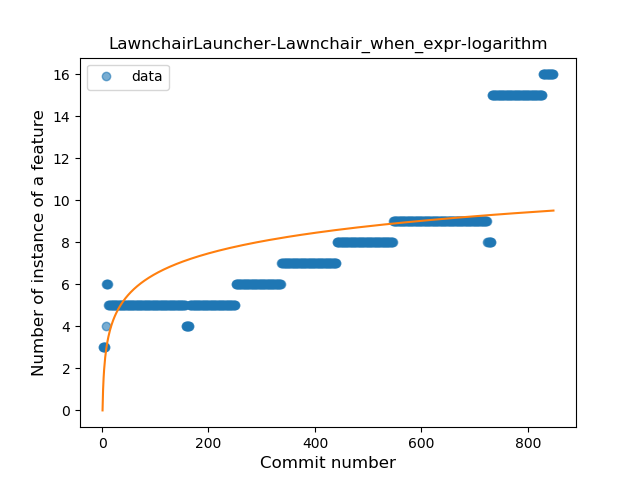
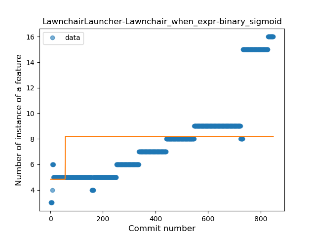
### <a name="companion_object">Companion Object</a>
----
#### Functions
* **Constant Rise - Linear:** 
    * **R_Squared:** 0.82066186
* **Sudden Rise Plateau - Logarithm:** 
    * **R_Squared:** 0.7780481

**Plots** :chart_with_upwards_trend:
-----

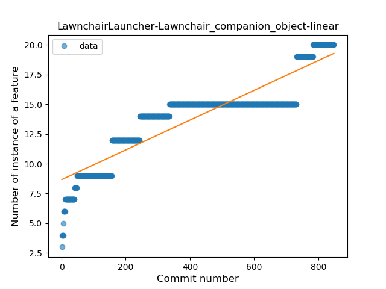
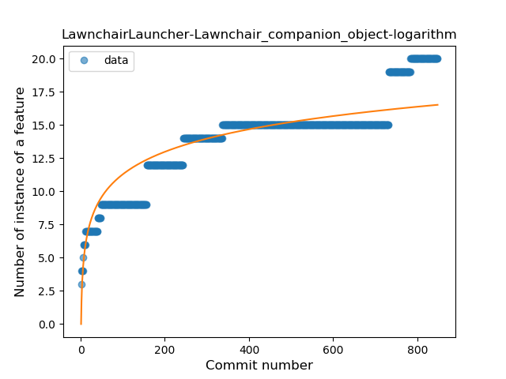
### <a name="unsafe_call">Unsafe Call</a>
----
#### Functions
* **Sudden Rise Plateau - Logarithm:** 
    * **R_Squared:** 0.83665997
* **Constant Rise - Linear:** 
    * **R_Squared:** 0.78048695

**Plots** :chart_with_upwards_trend:
-----

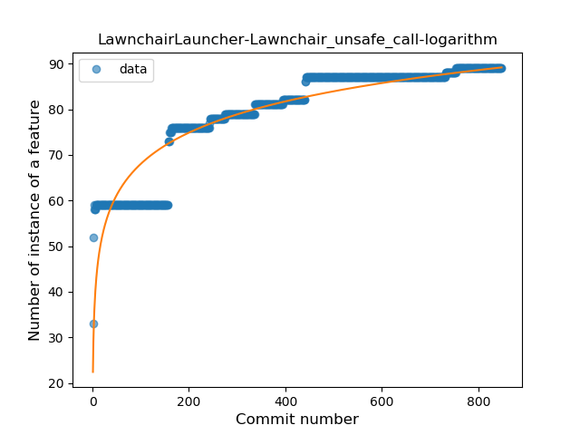
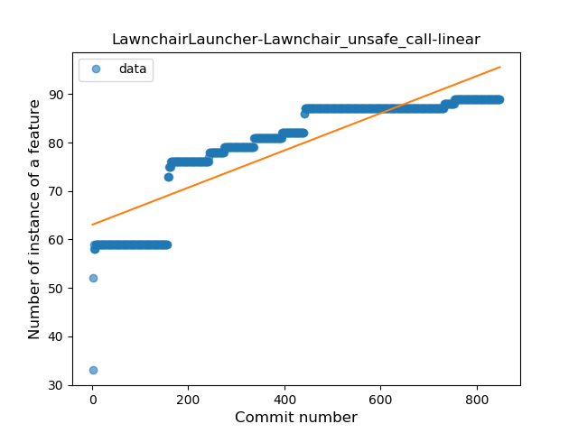
### <a name="string_template">String Template</a>
----
#### Functions
* **Sudden Rise - Exponential:** 
    * **R_Squared:** 0.69016442
* **Constant Rise - Linear:** 
    * **R_Squared:** 0.55607126
* **Sudden Rise Plateau - Logarithm:** 
    * **R_Squared:** 0.48767578

**Plots** :chart_with_upwards_trend:
-----

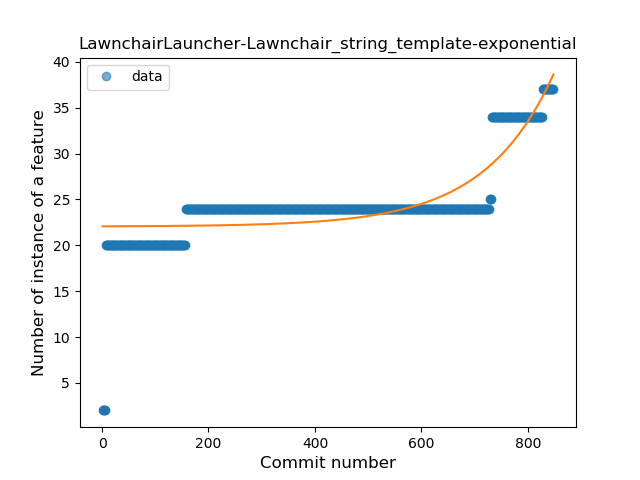
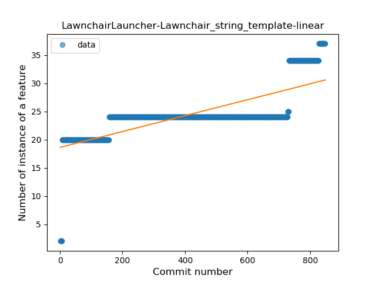
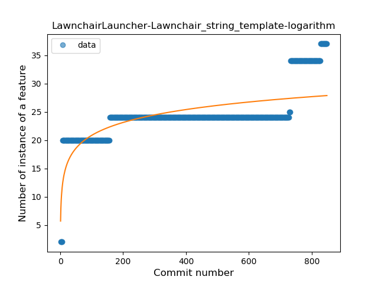
### <a name="func_with_default_value">Function with Default Value</a>
----
#### Functions
* **Plateau Sudden Rise - Binary Sigmoid:** 
    * **R_Squared:** 0.26093178
* **Sudden Rise Plateau - Logarithm:** 
    * **R_Squared:** 0.10912176
* **Constant Rise - Linear:** 
    * **R_Squared:** 0.02819031

**Plots** :chart_with_upwards_trend:
-----

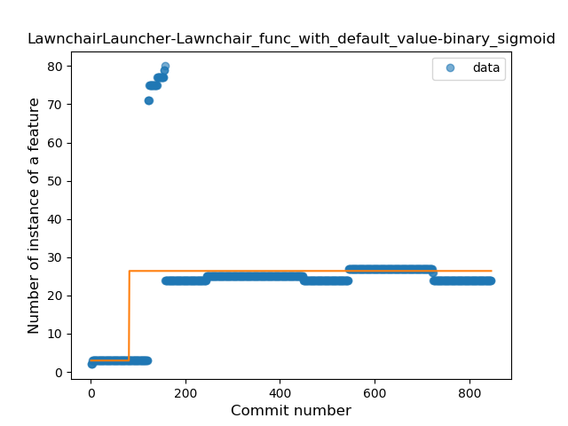
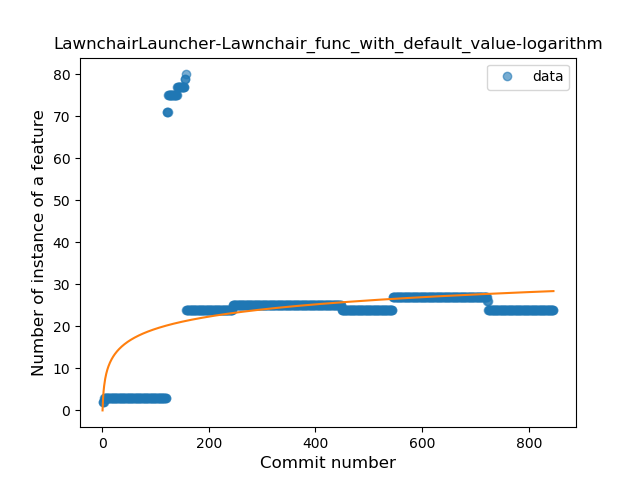
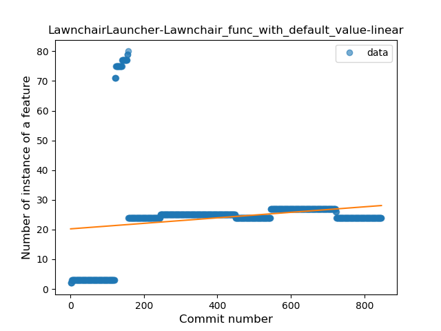
### <a name="singleton">Singleton</a>
----
#### Functions
* **Plateau Gradual Rise - Sigmoid:** 
    * **R_Squared:** 0.99067467
* **Sudden Rise Plateau - Logarithm:** 
    * **R_Squared:** 0.66026856
* **Constant Rise - Linear:** 
    * **R_Squared:** 0.39646427

**Plots** :chart_with_upwards_trend:
-----

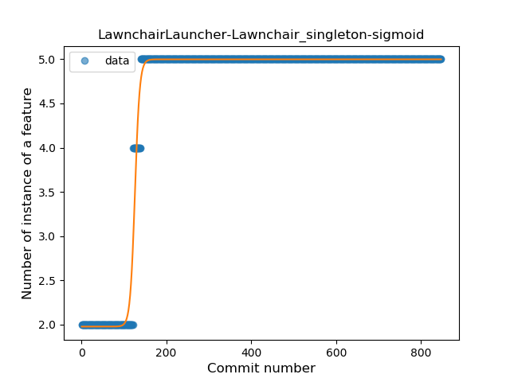
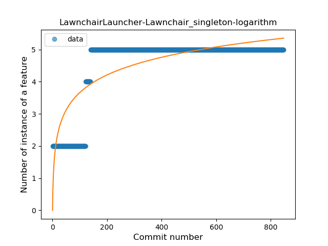
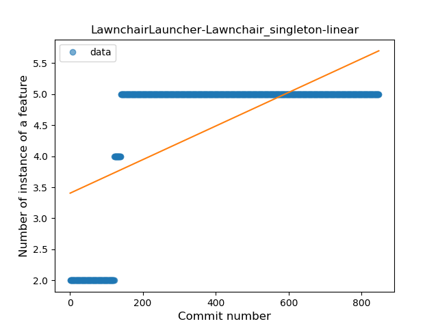
### <a name="smart_cast">Smart Cast</a>
----
#### Functions
* **Plateau Gradual Rise - Sigmoid:** 
    * **R_Squared:** 0.81290074
* **Constant Rise - Linear:** 
    * **R_Squared:** 0.6200133
* **Sudden Rise Plateau - Logarithm:** 
    * **R_Squared:** 0.47231356

**Plots** :chart_with_upwards_trend:
-----

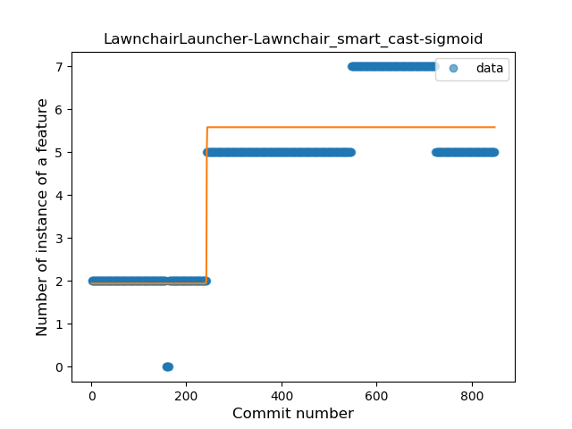
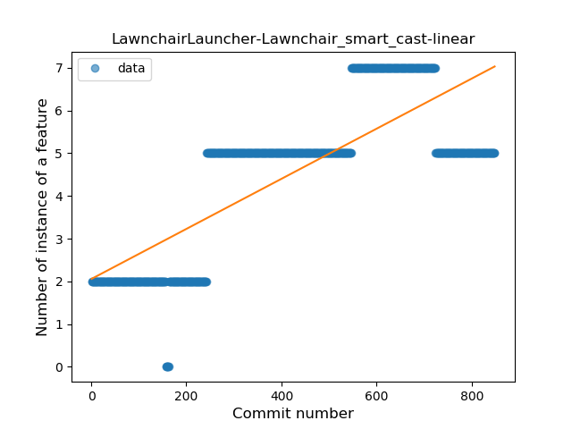
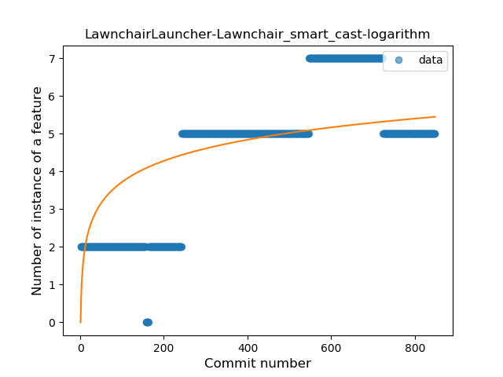
### <a name="func_call_with_named_arg">Function call with Named Argument</a>
----
#### Functions
* **Plateau Sudden Rise - Binary Sigmoid:** 
    * **R_Squared:** 0.89403805
* **Sudden Rise - Exponential:** 
    * **R_Squared:** 0.80903778
* **Constant Rise - Linear:** 
    * **R_Squared:** 0.69311748
* **Sudden Rise Plateau - Logarithm:** 
    * **R_Squared:** 0.39658371

**Plots** :chart_with_upwards_trend:
-----

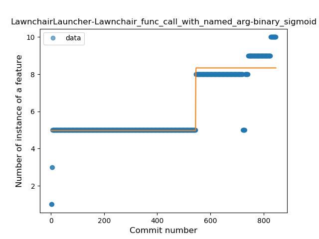
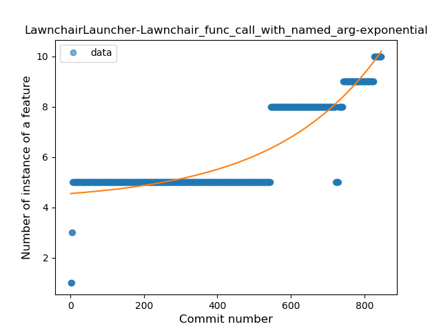
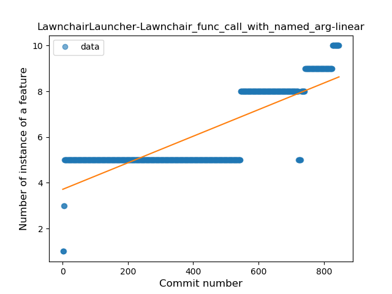
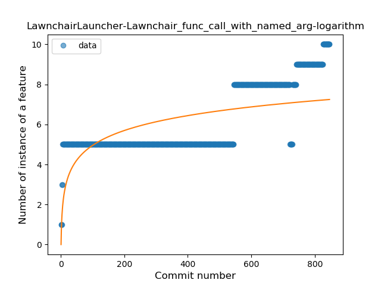
### <a name="data_class">Data Class</a>
----
#### Functions
* **Plateau Gradual Rise - Sigmoid:** 
    * **R_Squared:** 0.88451968
* **Constant Rise - Linear:** 
    * **R_Squared:** 0.86825619
* **Sudden Rise Plateau - Logarithm:** 
    * **R_Squared:** 0.52492144

**Plots** :chart_with_upwards_trend:
-----

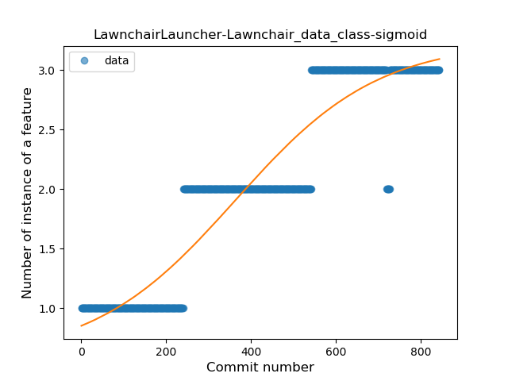
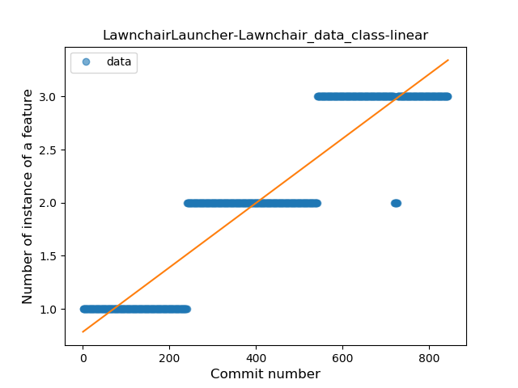
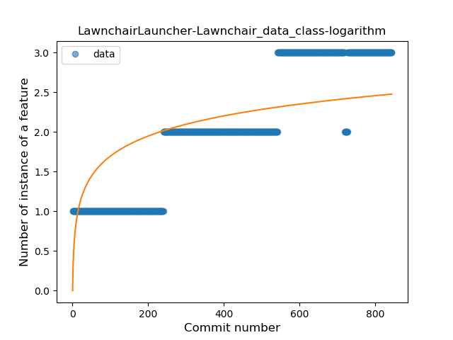
### <a name="extension_function">Extension Function</a>
----
#### Functions
* **Plateau Sudden Rise - Binary Sigmoid:** 
    * **R_Squared:** 0.4745168
* **Sudden Rise Plateau - Logarithm:** 
    * **R_Squared:** 0.31271346
* **Constant Rise - Linear:** 
    * **R_Squared:** 0.26901621

**Plots** :chart_with_upwards_trend:
-----

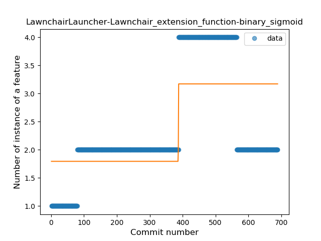
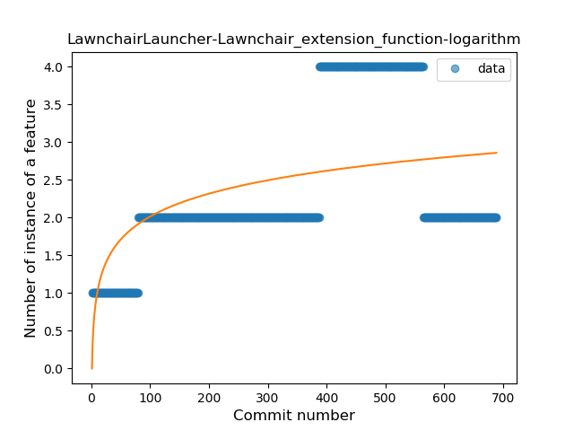
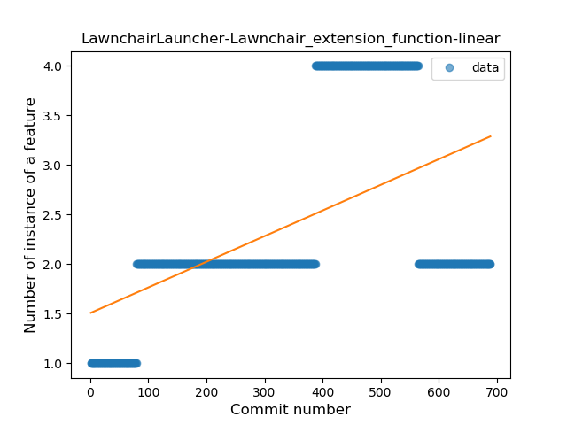
### <a name="property_delegation">Property Delegation</a>
----
#### Functions
* **Sudden Rise - Exponential:** 
    * **R_Squared:** 0.88775404
* **Constant Rise - Linear:** 
    * **R_Squared:** 0.77153507
* **Sudden Rise Plateau - Logarithm:** 
    * **R_Squared:** 0.49805395

**Plots** :chart_with_upwards_trend:
-----

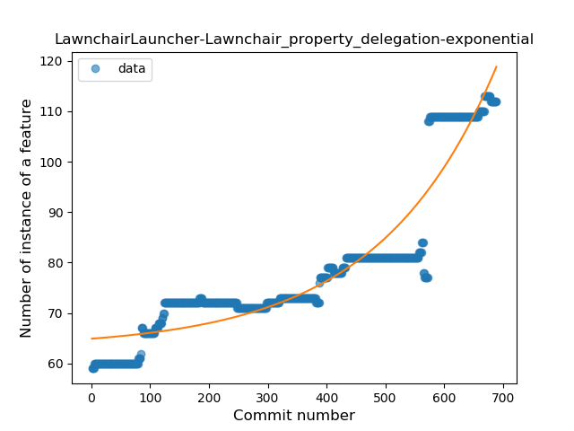

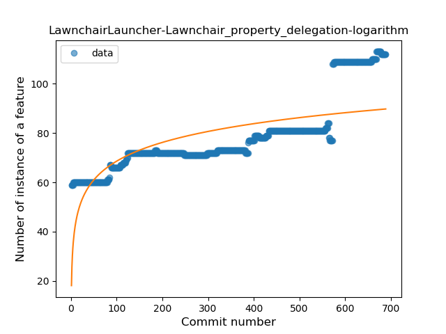
### <a name="inline_func">Inline Function</a>
----
#### Functions
* **Plateau Gradual Rise - Sigmoid:** 
    * **R_Squared:** 0.89492884
* **Sudden Rise Plateau - Logarithm:** 
    * **R_Squared:** 0.84507437
* **Constant Rise - Linear:** 
    * **R_Squared:** 0.65006414

**Plots** :chart_with_upwards_trend:
-----

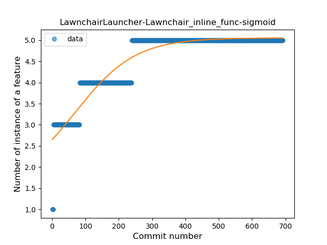
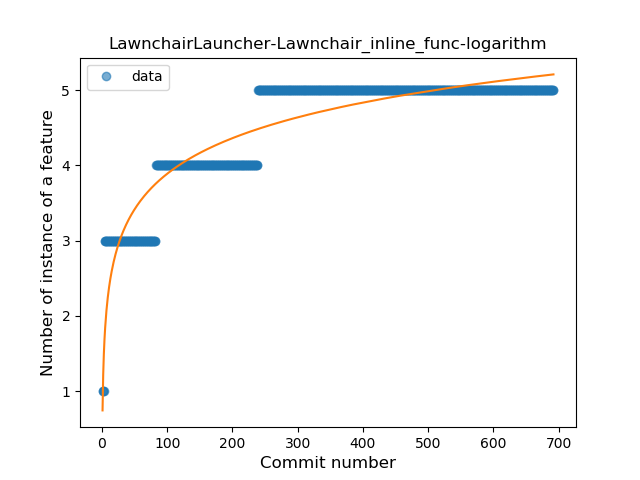
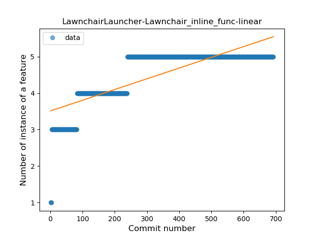
### <a name="overloaded_op">Overloaded Operator</a>
----
#### Functions
* **Plateau Sudden Rise - Binary Sigmoid:** 
    * **R_Squared:** 1.0
* **Sudden Rise - Exponential:** 
    * **R_Squared:** 0.78388659
* **Constant Rise - Linear:** 
    * **R_Squared:** 0.4229272
* **Sudden Rise Plateau - Logarithm:** 
    * **R_Squared:** 0.17419431

**Plots** :chart_with_upwards_trend:
-----

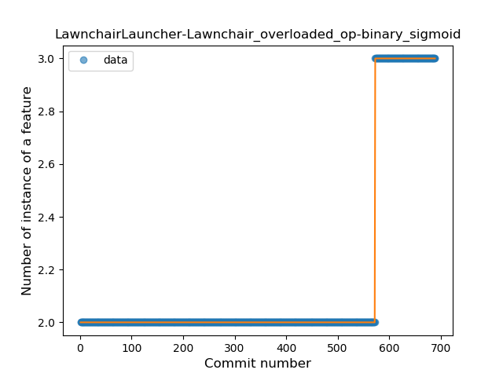
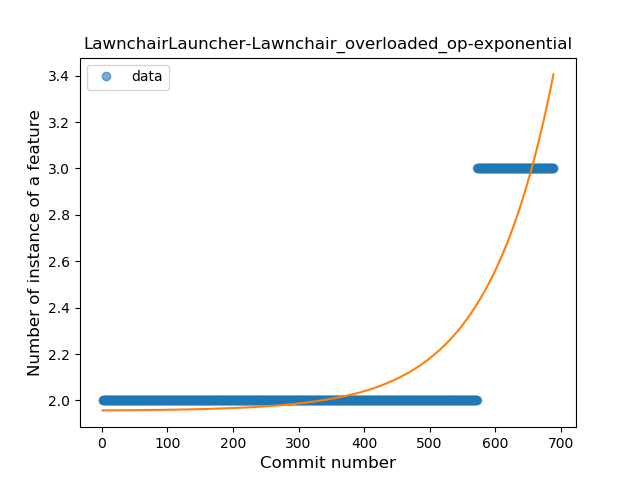
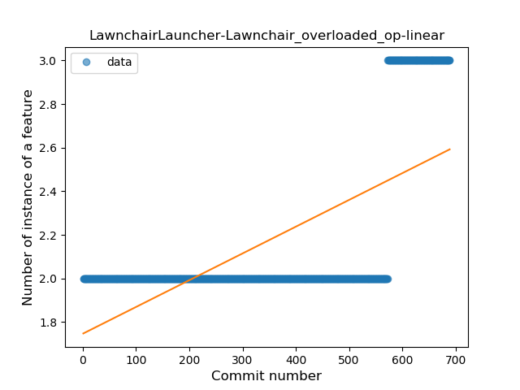
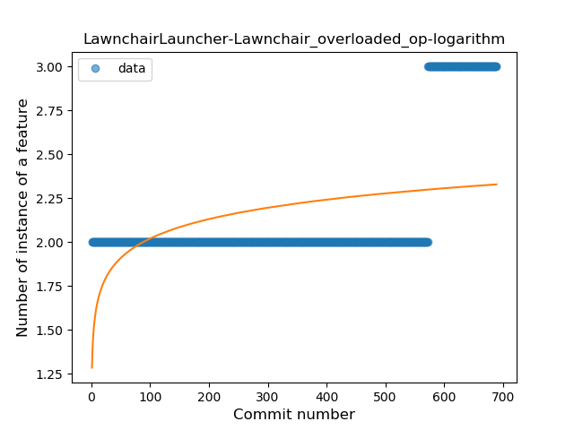
