## LiMium-mini-vector-android
----
#### Metrics provided by Detekt
* Number of lines of code 11179
* Number of Kotlin files: 65
* Cyclomatic complexity: 1322
* Cyclomatic complexity by thousands of lines: 318 

----
**16** features analyzed

*	<a href="#type_inference">Type Inference</a> 
*	<a href="#lambda">Lambda</a> 
*	<a href="#safe_call">Safe Call</a> 
*	<a href="#when_expr">When expression</a> 
*	<a href="#companion_object">Companion Object</a> 
*	<a href="#unsafe_call">Unsafe Call</a> 
*	<a href="#string_template">String Template</a> 
*	<a href="#func_with_default_value">Function with Default Value</a> 
*	<a href="#singleton">Singleton</a> 
*	<a href="#smart_cast">Smart Cast</a> 
*	<a href="#range_expr">Range Expression</a> 
*	<a href="#func_call_with_named_arg">Function call with Named Argument</a> 
*	<a href="#data_class">Data Class</a> 
*	<a href="#extension_function">Extension Function</a> 
*	<a href="#property_delegation">Property Delegation</a> 
*	<a href="#super_delegation">Super Delegation</a> 

### <a name="type_inference">Type Inference</a>
----
#### Functions
* **Constant Rise - Linear:** 
    * **R_Squared:** 0.79544738
* **Plateau Sudden Rise - Binary Sigmoid:** 
    * **R_Squared:** 0.70226507
* **Sudden Rise Plateau - Logarithm:** 
    * **R_Squared:** 0.56919524

**Plots** :chart_with_upwards_trend:
-----

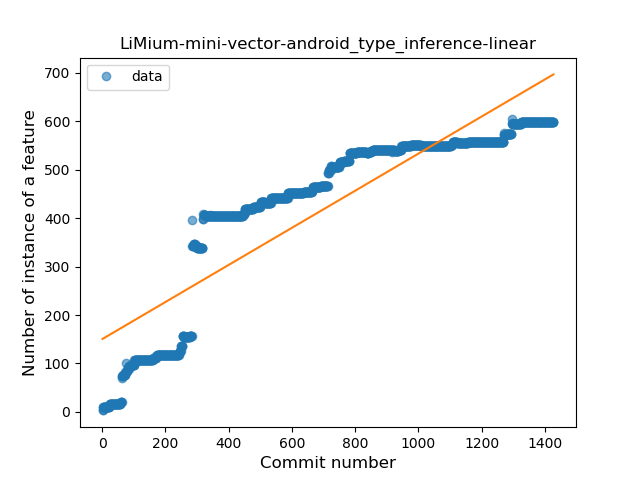
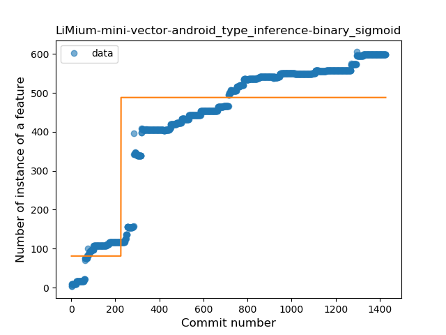
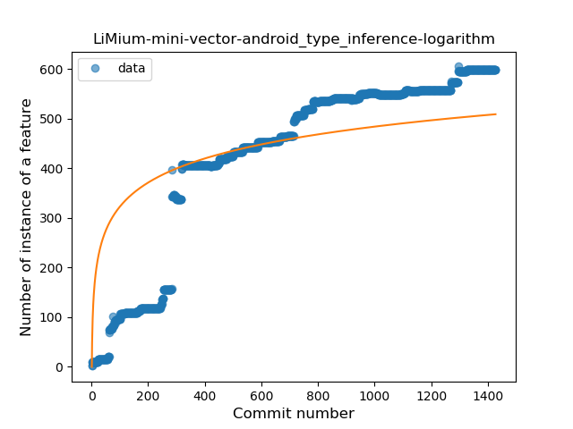
### <a name="lambda">Lambda</a>
----
#### Functions
* **Plateau Sudden Rise - Binary Sigmoid:** 
    * **R_Squared:** 0.85066349
* **Constant Rise - Linear:** 
    * **R_Squared:** 0.65120691
* **Sudden Rise Plateau - Logarithm:** 
    * **R_Squared:** 0.56298884

**Plots** :chart_with_upwards_trend:
-----

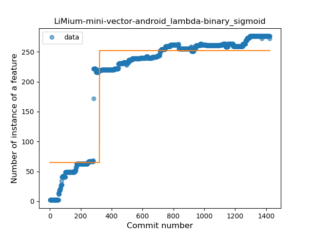
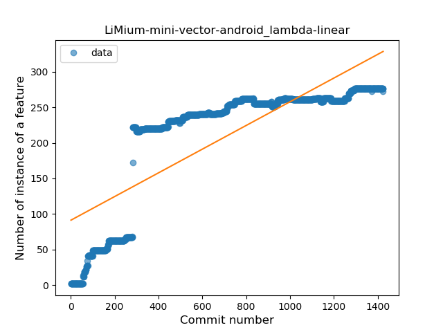
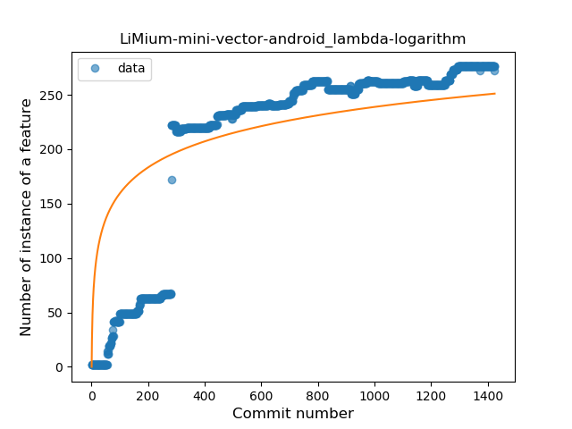
### <a name="safe_call">Safe Call</a>
----
#### Functions
* **Constant Rise - Linear:** 
    * **R_Squared:** 0.95535319
* **Sudden Rise Plateau - Logarithm:** 
    * **R_Squared:** 0.46190641

**Plots** :chart_with_upwards_trend:
-----

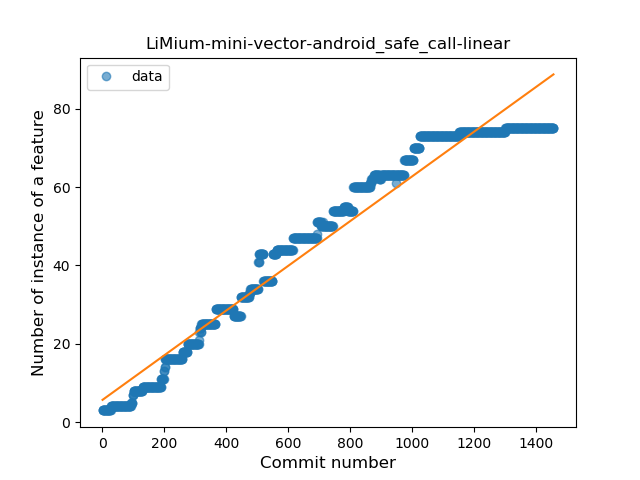
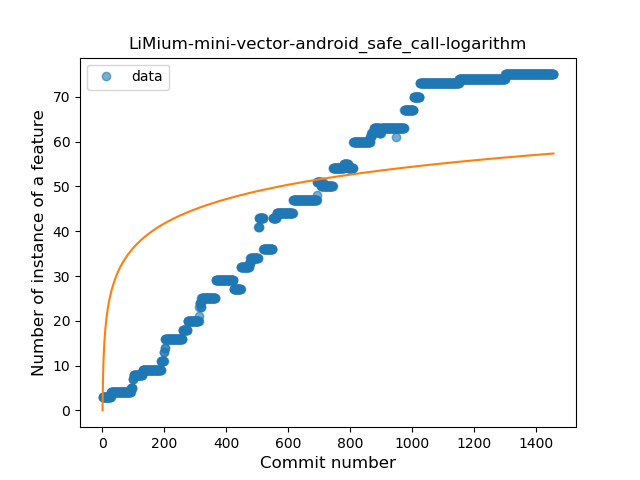
### <a name="when_expr">When expression</a>
----
#### Functions
* **Constant Rise - Linear:** 
    * **R_Squared:** 0.91849903
* **Sudden Rise Plateau - Logarithm:** 
    * **R_Squared:** 0.62287427

**Plots** :chart_with_upwards_trend:
-----

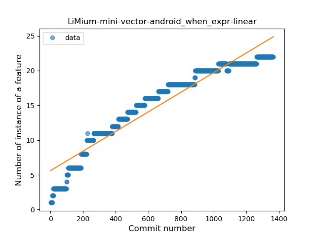
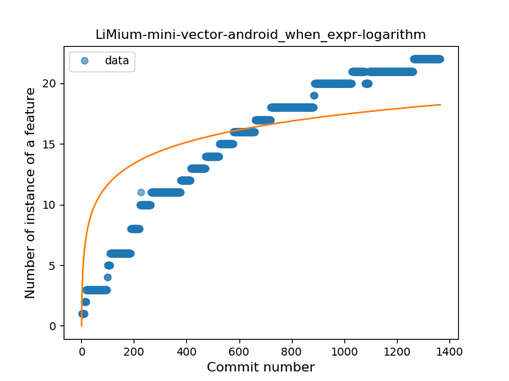
### <a name="companion_object">Companion Object</a>
----
#### Functions
* **Sudden Rise Plateau - Logarithm:** 
    * **R_Squared:** 0.82355896
* **Constant Rise - Linear:** 
    * **R_Squared:** 0.76211949

**Plots** :chart_with_upwards_trend:
-----

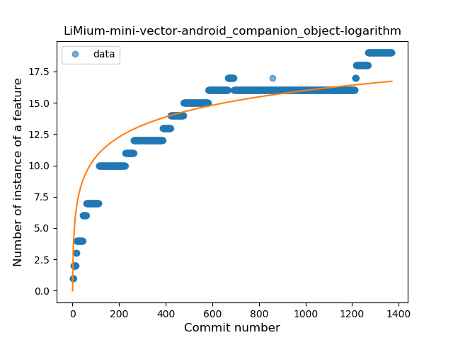
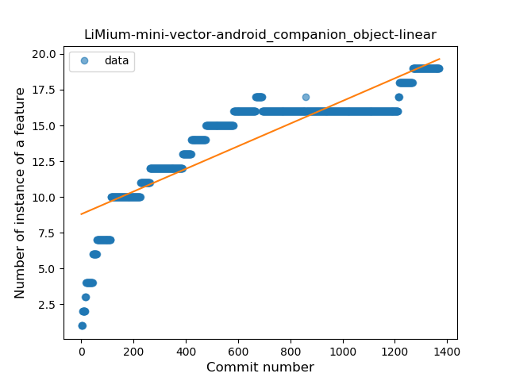
### <a name="unsafe_call">Unsafe Call</a>
----
#### Functions
* **Sudden Rise Plateau - Logarithm:** 
    * **R_Squared:** 0.73228434
* **Constant Rise - Linear:** 
    * **R_Squared:** 0.50868273
* **Plateau Sudden Rise - Binary Sigmoid:** 
    * **R_Squared:** 0.29373669

**Plots** :chart_with_upwards_trend:
-----

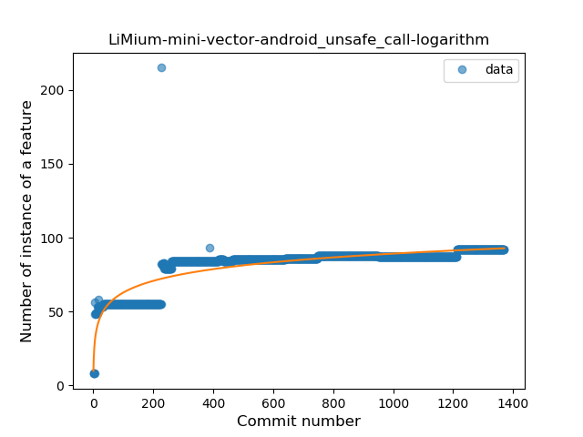
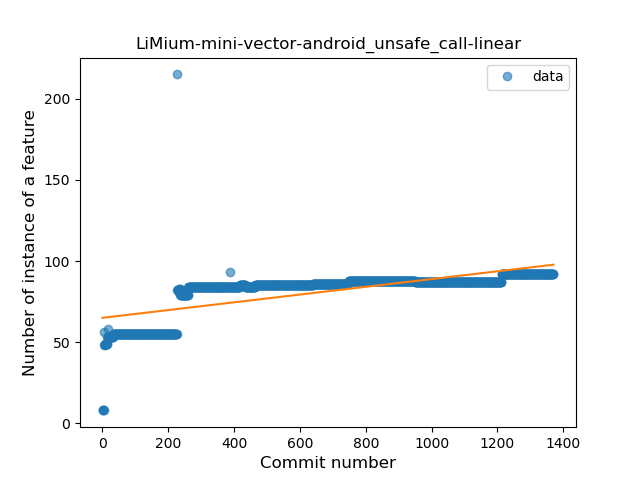
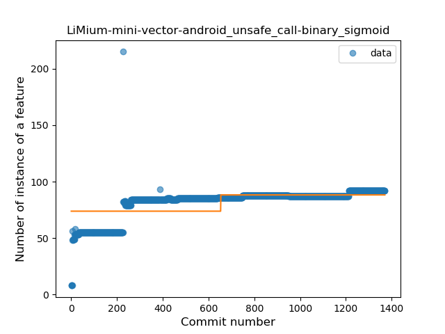
### <a name="string_template">String Template</a>
----
#### Functions
* **Constant Rise - Linear:** 
    * **R_Squared:** 0.84133952
* **Sudden Rise Plateau - Logarithm:** 
    * **R_Squared:** 0.77091186

**Plots** :chart_with_upwards_trend:
-----

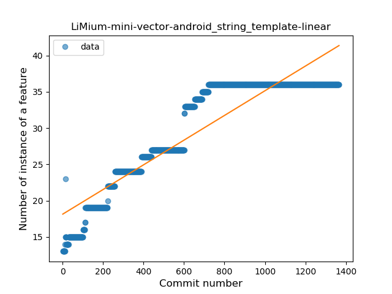
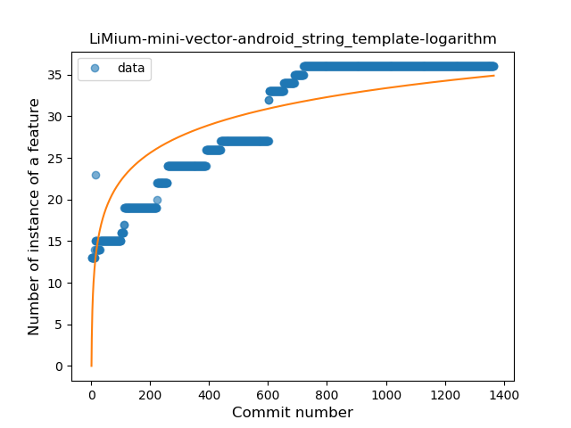
### <a name="func_with_default_value">Function with Default Value</a>
----
#### Functions
* **Constant Rise - Linear:** 
    * **R_Squared:** 0.86838103
* **Sudden Rise Plateau - Logarithm:** 
    * **R_Squared:** 0.38284407

**Plots** :chart_with_upwards_trend:
-----

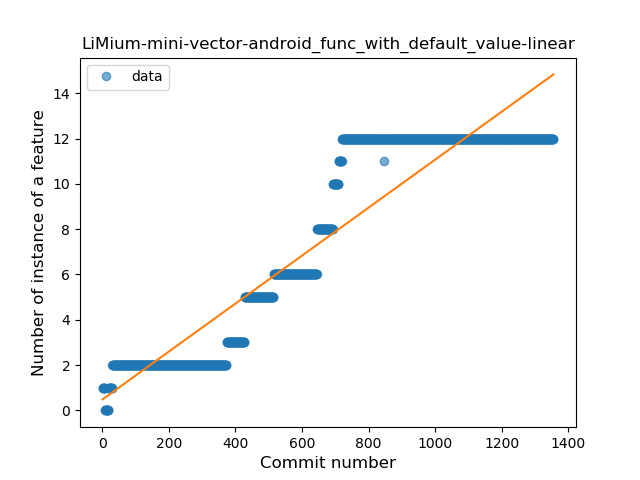
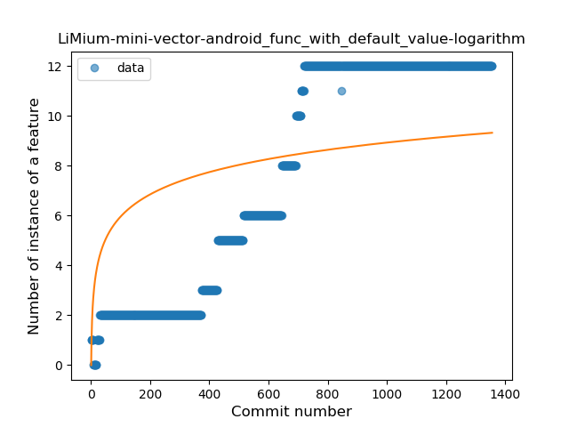
### <a name="singleton">Singleton</a>
----
#### Functions
* **Sudden Rise - Exponential:** 
    * **R_Squared:** 0.87477548
* **Constant Rise - Linear:** 
    * **R_Squared:** 0.79442663
* **Sudden Rise Plateau - Logarithm:** 
    * **R_Squared:** 0.26328656

**Plots** :chart_with_upwards_trend:
-----

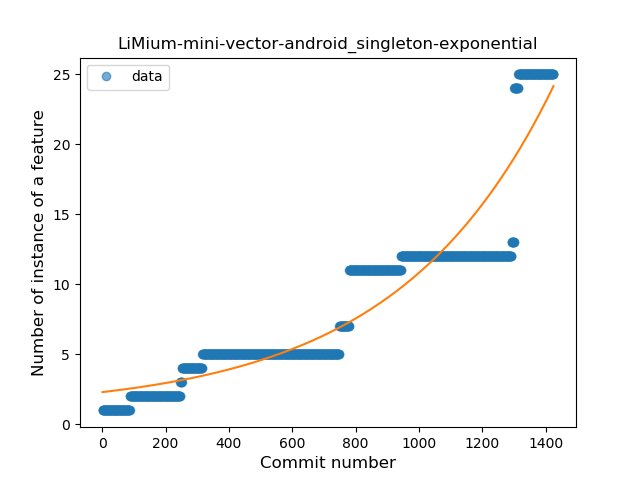
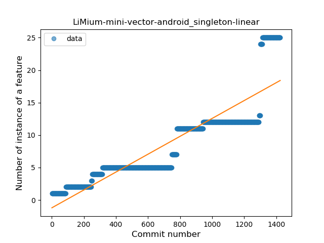
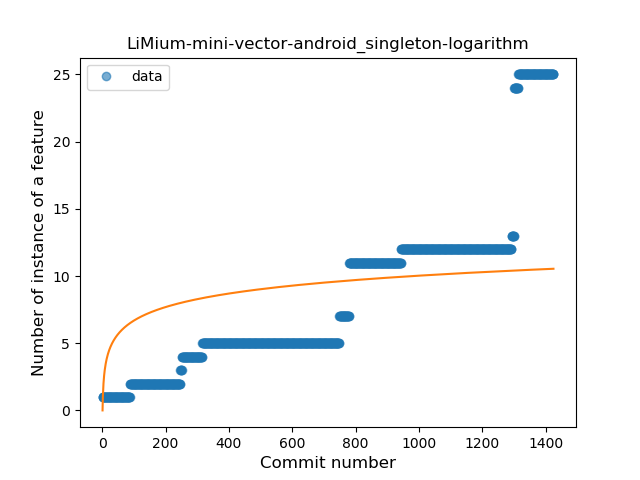
### <a name="smart_cast">Smart Cast</a>
----
#### Functions
* **Plateau Gradual Rise - Sigmoid:** 
    * **R_Squared:** 0.8546626
* **Constant Rise - Linear:** 
    * **R_Squared:** 0.82142831
* **Sudden Rise Plateau - Logarithm:** 
    * **R_Squared:** 0.50178398

**Plots** :chart_with_upwards_trend:
-----

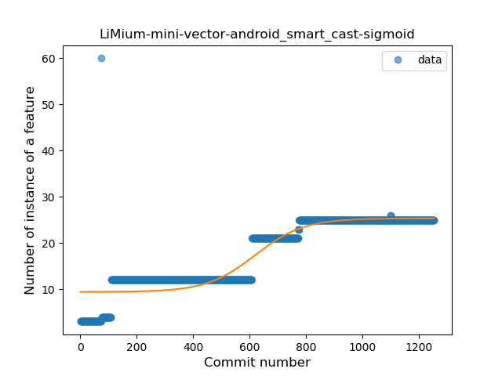
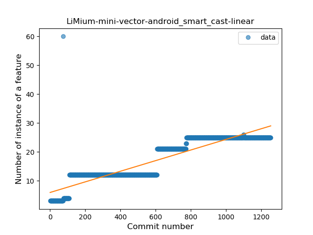
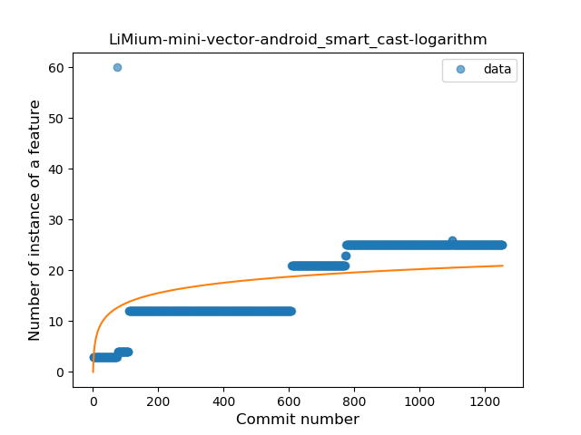
### <a name="range_expr">Range Expression</a>
----
#### Functions
* **Plateau Gradual Rise - Sigmoid:** 
    * **R_Squared:** 0.95415942
* **Sudden Rise Plateau - Logarithm:** 
    * **R_Squared:** 0.49363155
* **Constant Rise - Linear:** 
    * **R_Squared:** 0.13508696

**Plots** :chart_with_upwards_trend:
-----

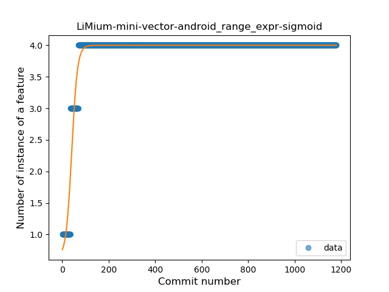
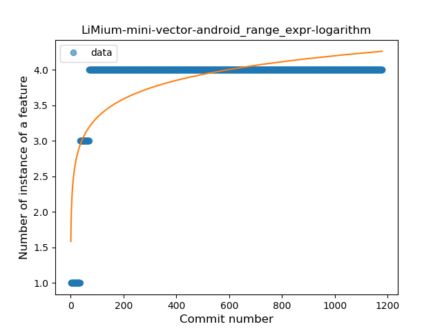
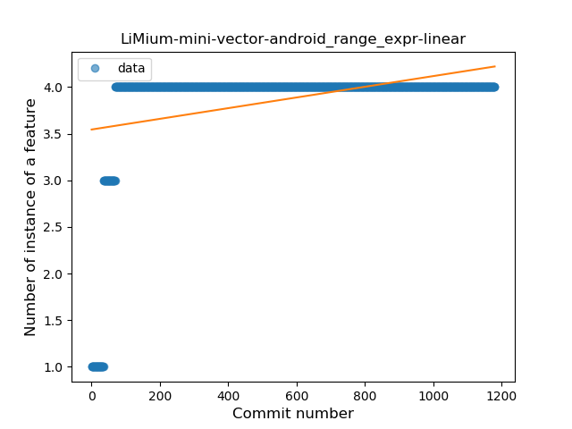
### <a name="func_call_with_named_arg">Function call with Named Argument</a>
----
#### Functions
* **Plateau Gradual Rise - Sigmoid:** 
    * **R_Squared:** 0.93530574
* **Constant Rise - Linear:** 
    * **R_Squared:** 0.84386225
* **Sudden Rise Plateau - Logarithm:** 
    * **R_Squared:** 0.43094034

**Plots** :chart_with_upwards_trend:
-----

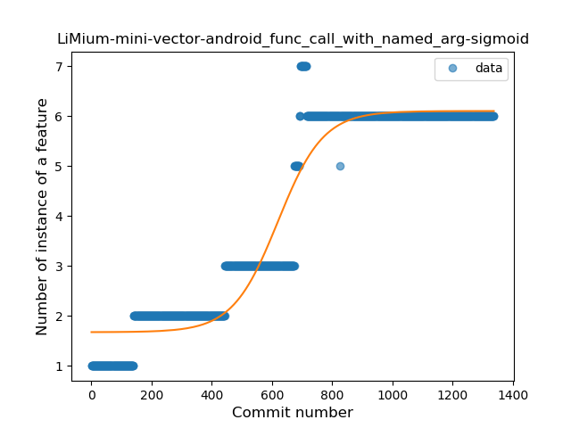
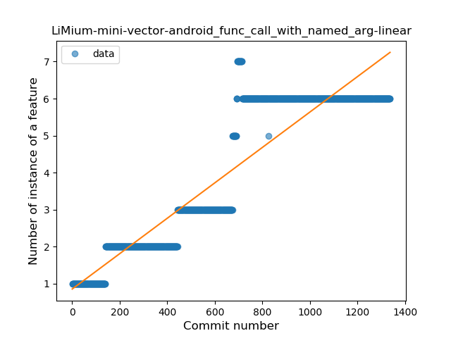
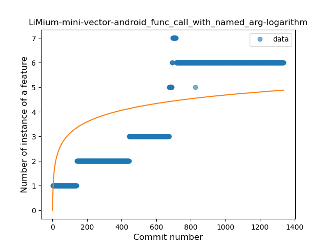
### <a name="data_class">Data Class</a>
----
#### Functions
* **Plateau Gradual Rise - Sigmoid:** 
    * **R_Squared:** 0.95206263
* **Sudden Rise Plateau - Logarithm:** 
    * **R_Squared:** 0.74719217
* **Constant Rise - Linear:** 
    * **R_Squared:** 0.72870942

**Plots** :chart_with_upwards_trend:
-----

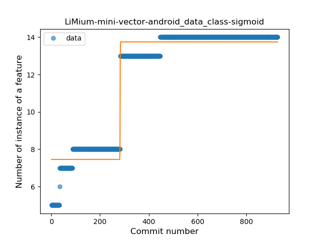
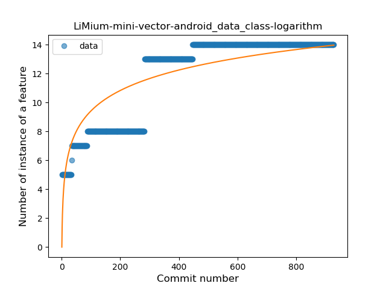
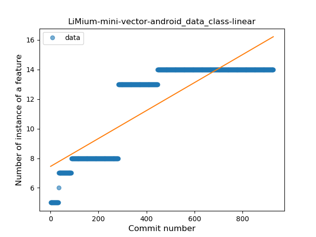
### <a name="extension_function">Extension Function</a>
----
#### Functions
* **Plateau Gradual Rise - Sigmoid:** 
    * **R_Squared:** 0.88091154
* **Constant Rise - Linear:** 
    * **R_Squared:** 0.69930272
* **Sudden Rise Plateau - Logarithm:** 
    * **R_Squared:** 0.63054322

**Plots** :chart_with_upwards_trend:
-----

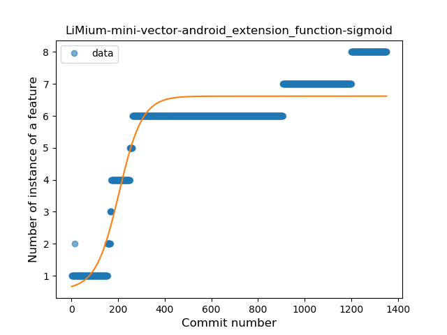
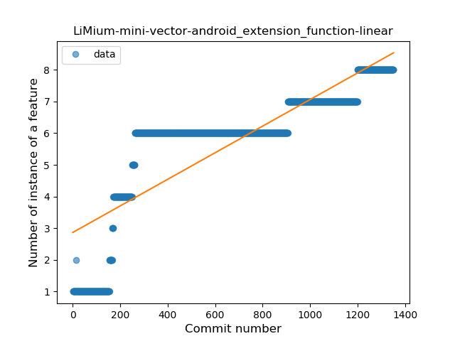
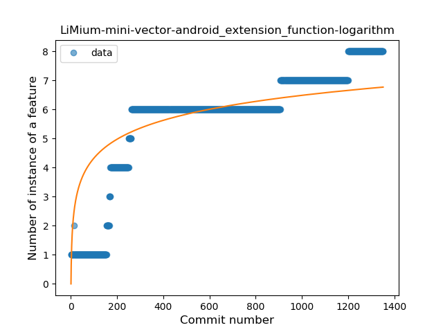
### <a name="property_delegation">Property Delegation</a>
----
#### Functions
* **Sudden Rise Plateau - Logarithm:** 
    * **R_Squared:** 0.51008268
* **Constant Rise - Linear:** 
    * **R_Squared:** 0.40256955
* **Plateau Sudden Rise - Binary Sigmoid:** 
    * **R_Squared:** 0.04729935

**Plots** :chart_with_upwards_trend:
-----

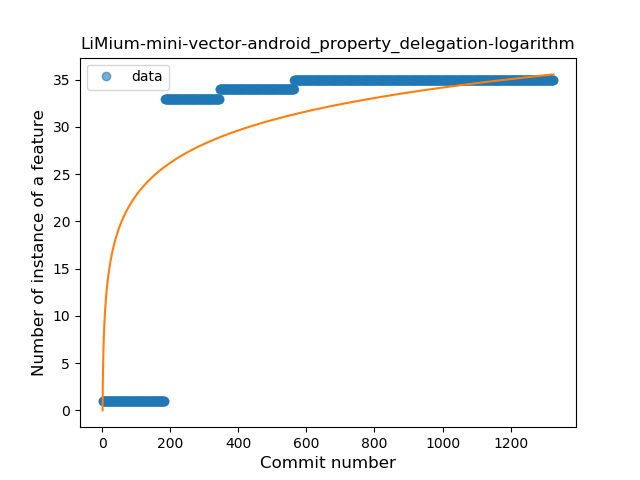
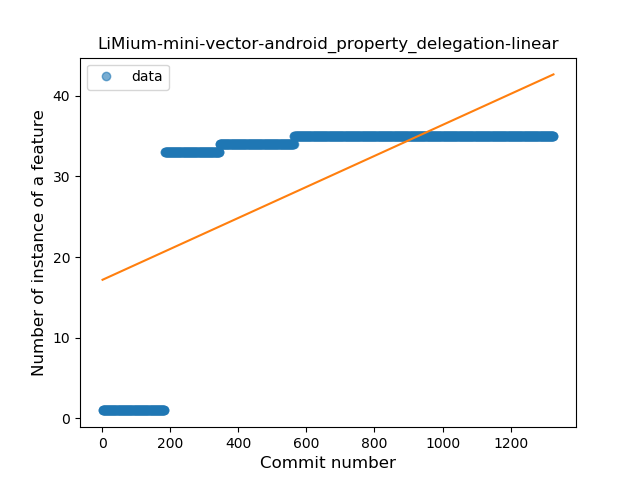
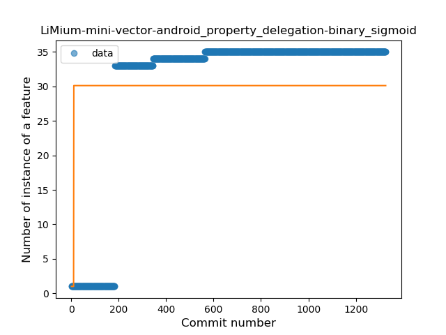
### <a name="super_delegation">Super Delegation</a>
----
#### Functions
* **Plateau Gradual Rise - Sigmoid:** 
    * **R_Squared:** 0.99670701
* **Sudden Rise Plateau - Logarithm:** 
    * **R_Squared:** 0.61065022
* **Constant Rise - Linear:** 
    * **R_Squared:** 0.30027567

**Plots** :chart_with_upwards_trend:
-----

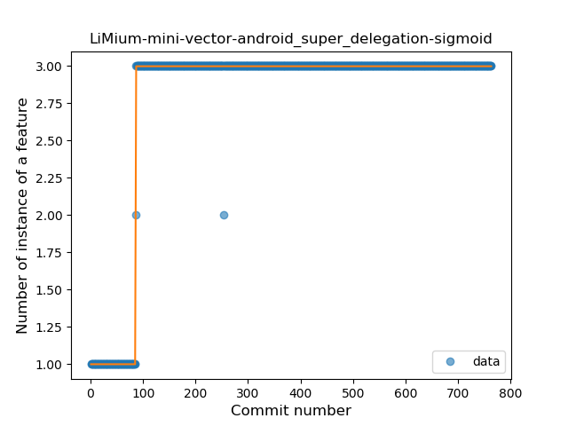

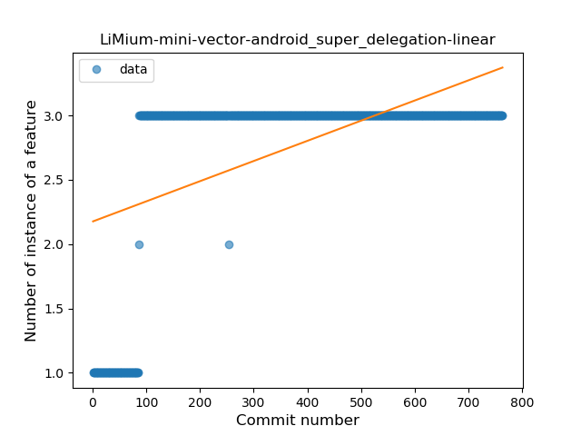
