## LittleLightCz-SheepsGoHome
----
#### Metrics provided by Detekt
* Number of lines of code 2803
* Number of Kotlin files: 56
* Cyclomatic complexity: 315
* Cyclomatic complexity by thousands of lines: 233 

----
**13** features analyzed

*	<a href="#type_inference">Type Inference</a> 
*	<a href="#lambda">Lambda</a> 
*	<a href="#safe_call">Safe Call</a> 
*	<a href="#when_expr">When expression</a> 
*	<a href="#companion_object">Companion Object</a> 
*	<a href="#string_template">String Template</a> 
*	<a href="#func_with_default_value">Function with Default Value</a> 
*	<a href="#singleton">Singleton</a> 
*	<a href="#smart_cast">Smart Cast</a> 
*	<a href="#range_expr">Range Expression</a> 
*	<a href="#func_call_with_named_arg">Function call with Named Argument</a> 
*	<a href="#property_delegation">Property Delegation</a> 
*	<a href="#destructuring_declaration">Destructuring Declaration</a> 

### <a name="type_inference">Type Inference</a>
----
#### Functions
* **Sudden Rise Plateau - Logarithm:** 
    * **R_Squared:** 0.80393627
* **Constant Rise - Linear:** 
    * **R_Squared:** 0.50314651

**Plots** :chart_with_upwards_trend:
-----

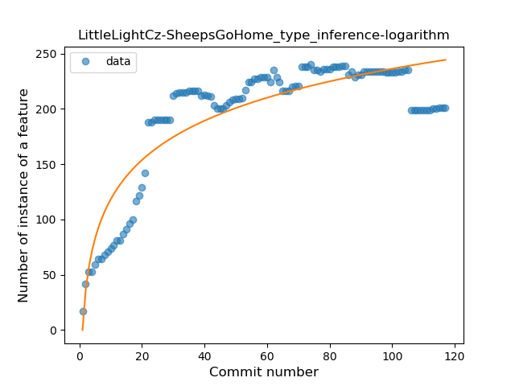
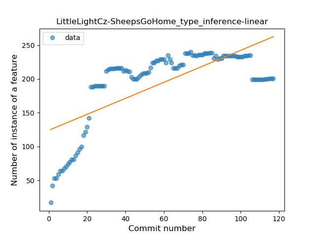
### <a name="lambda">Lambda</a>
----
#### Functions
* **Instability - Polinomial 3:** )
    * **R_Squared:** 0.99463247
* **Constant Rise - Linear:** 
    * **R_Squared:** 0.96049454
* **Plateau Sudden Rise - Binary Sigmoid:** 
    * **R_Squared:** 0.82723787
* **Sudden Rise Plateau - Logarithm:** 
    * **R_Squared:** 0.48951937

**Plots** :chart_with_upwards_trend:
-----

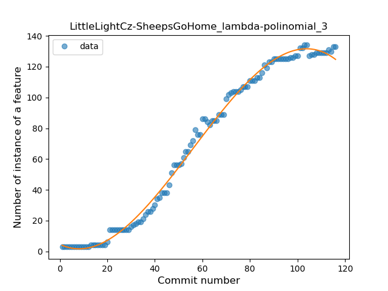
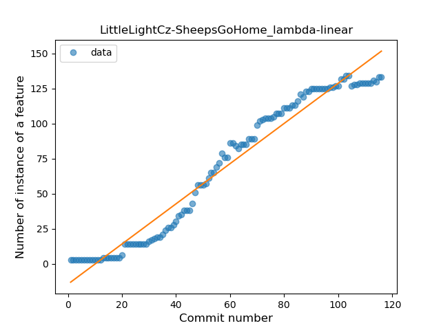
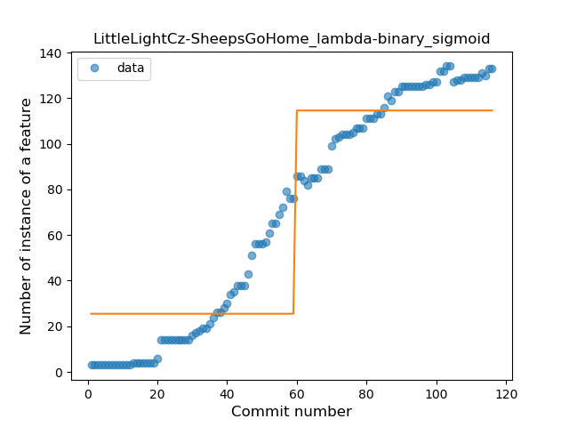
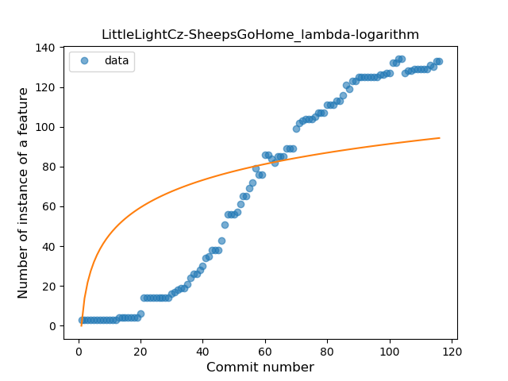
### <a name="safe_call">Safe Call</a>
----
#### Functions
* **Instability - Polinomial 3:** )
    * **R_Squared:** 0.71617316
* **Sudden Rise - Exponential:** 
    * **R_Squared:** 0.33538922
* **Plateau Gradual Rise - Sigmoid:** 
    * **R_Squared:** 0.34435199
* **Sudden Rise Plateau - Logarithm:** 
    * **R_Squared:** 0.20956823
* **Constant Rise - Linear:** 
    * **R_Squared:** 0.16999067

**Plots** :chart_with_upwards_trend:
-----

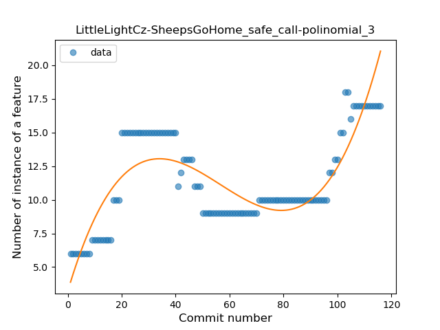
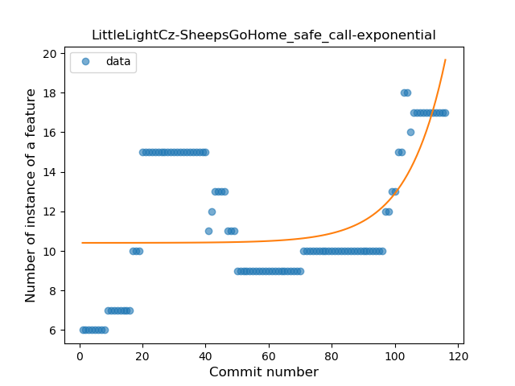
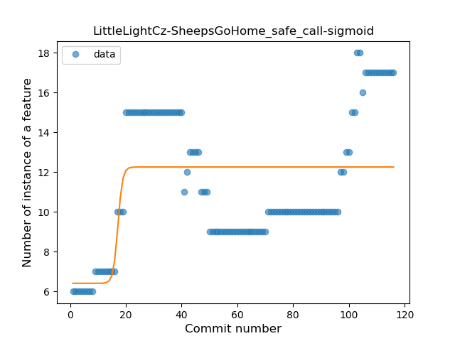
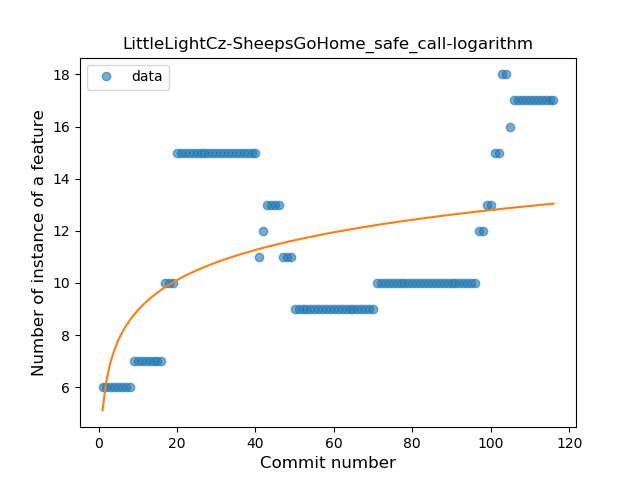
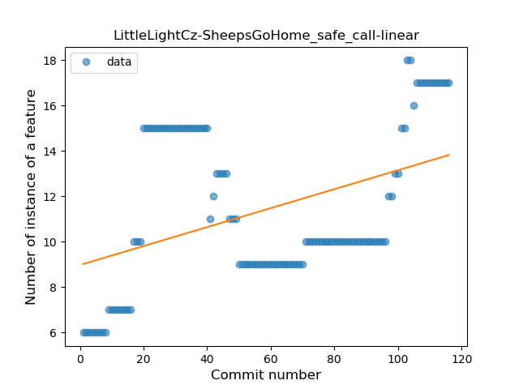
### <a name="when_expr">When expression</a>
----
#### Functions
* **Sudden Rise Plateau - Logarithm:** 
    * **R_Squared:** 0.74707114
* **Constant Rise - Linear:** 
    * **R_Squared:** 0.55724899
* **Plateau Sudden Rise - Binary Sigmoid:** 
    * **R_Squared:** 0.04739519

**Plots** :chart_with_upwards_trend:
-----

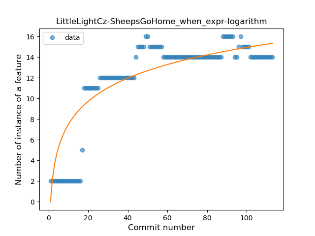
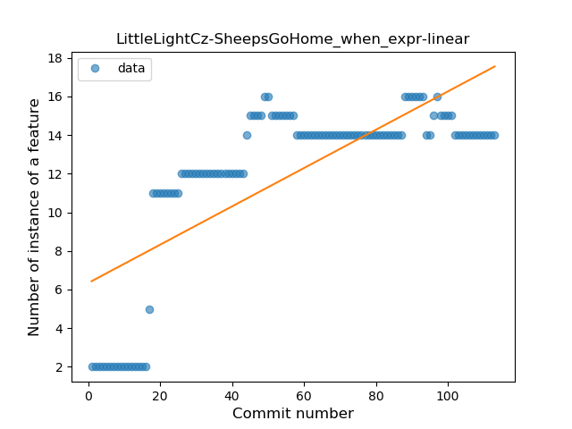
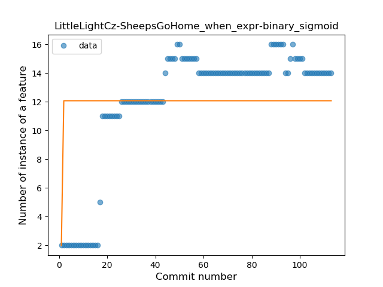
### <a name="companion_object">Companion Object</a>
----
#### Functions
* **Plateau Gradual Rise - Sigmoid:** 
    * **R_Squared:** 0.75864688
* **Sudden Rise Plateau - Logarithm:** 
    * **R_Squared:** 0.49375728
* **Constant Rise - Linear:** 
    * **R_Squared:** 0.20527908

**Plots** :chart_with_upwards_trend:
-----

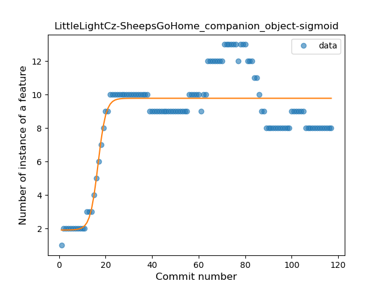
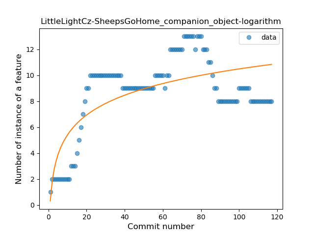
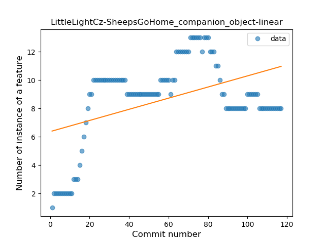
### <a name="string_template">String Template</a>
----
#### Functions
* **Plateau Sudden Rise - Binary Sigmoid:** 
    * **R_Squared:** 1.0
* **Sudden Rise Plateau - Logarithm:** 
    * **R_Squared:** 0.38820419
* **Constant Rise - Linear:** 
    * **R_Squared:** 0.11671233

**Plots** :chart_with_upwards_trend:
-----

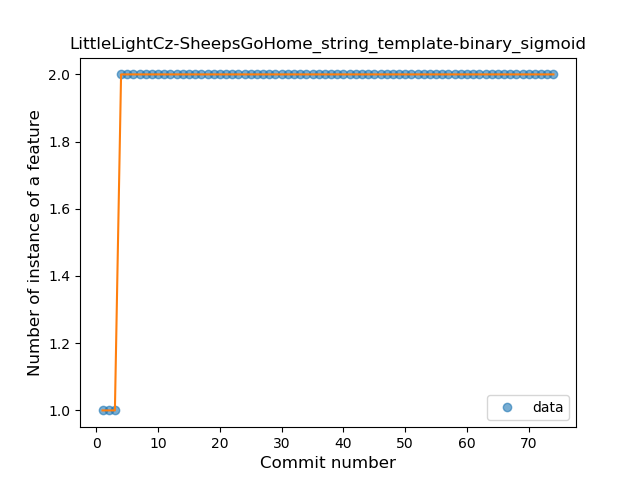

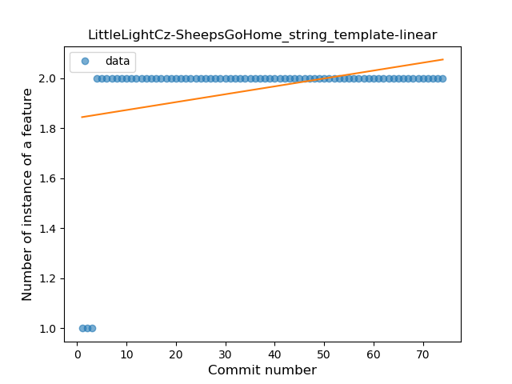
### <a name="func_with_default_value">Function with Default Value</a>
----
#### Functions
* **Plateau Sudden Rise - Binary Sigmoid:** 
    * **R_Squared:** 1.0
* **Sudden Rise - Exponential:** 
    * **R_Squared:** 0.80554604
* **Instability - Polinomial 3:** )
    * **R_Squared:** 0.73277293
* **Constant Rise - Linear:** 
    * **R_Squared:** 0.25324675
* **Sudden Rise Plateau - Logarithm:** 
    * **R_Squared:** 0.10991107

**Plots** :chart_with_upwards_trend:
-----

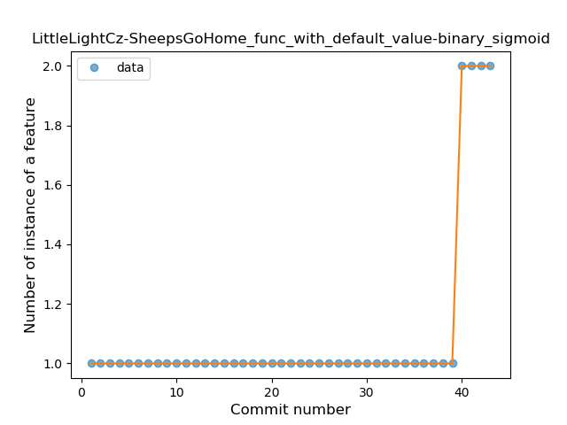
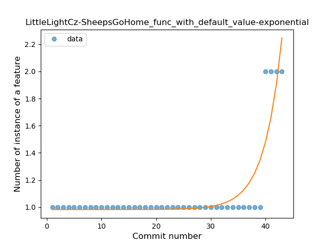
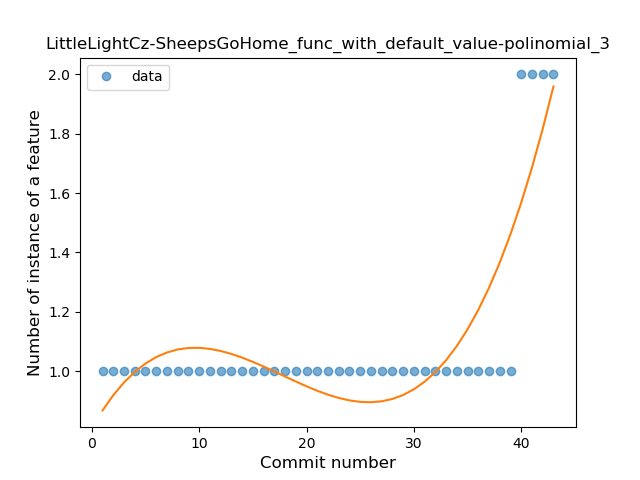
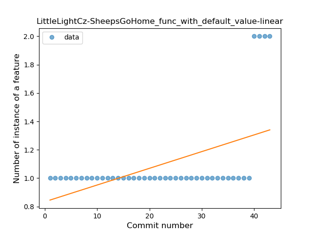
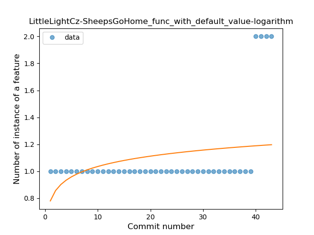
### <a name="singleton">Singleton</a>
----
#### Functions
* **Sudden Rise Plateau - Logarithm:** 
    * **R_Squared:** 0.05401663
* **Constant Decline - Linear:** 
    * **R_Squared:** 4.11e-05
* **Sudden Decline - Exponential:** 
    * **R_Squared:** 4.015e-05

**Plots** :chart_with_upwards_trend:
-----

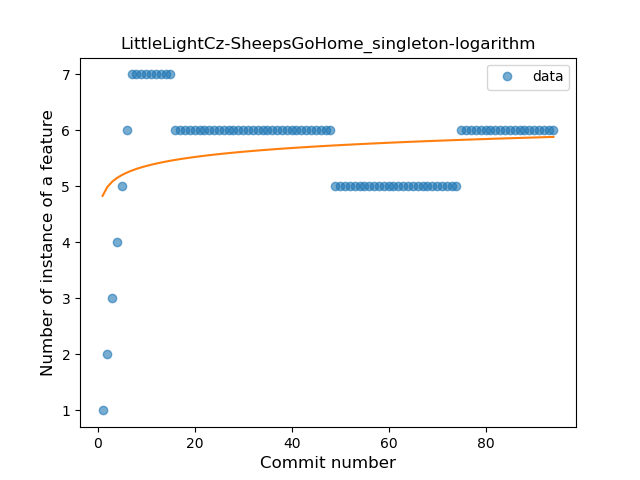
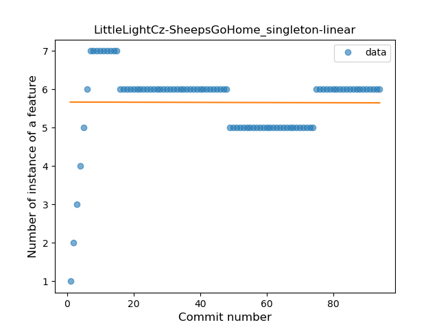

### <a name="smart_cast">Smart Cast</a>
----
#### Functions
* **Instability - Polinomial 3:** )
    * **R_Squared:** 0.80179345
* **Sudden Rise Plateau - Logarithm:** 
    * **R_Squared:** 0.64267767
* **Constant Rise - Linear:** 
    * **R_Squared:** 0.33285302

**Plots** :chart_with_upwards_trend:
-----

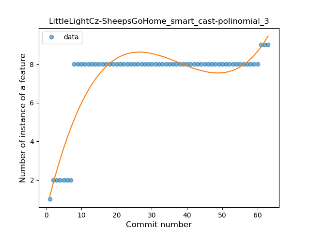
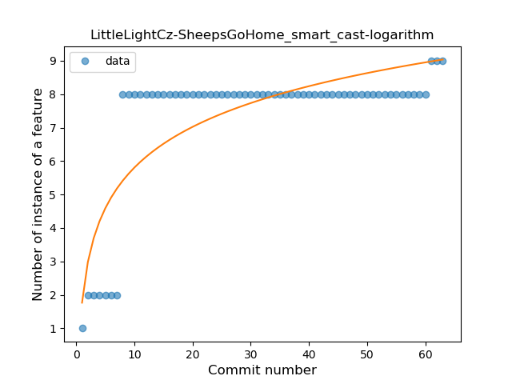
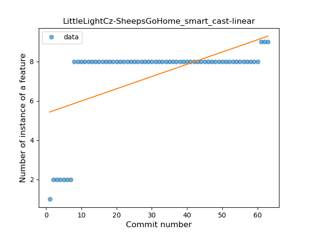
### <a name="range_expr">Range Expression</a>
----
#### Functions
* **Instability - Polinomial 3:** )
    * **R_Squared:** 0.7264818
* **Plateau Gradual Rise - Sigmoid:** 
    * **R_Squared:** 0.18179623
* **Constant Decline - Linear:** 
    * **R_Squared:** 0.10918747
* **Sudden Rise Plateau - Logarithm:** 
    * **R_Squared:** -0.0

**Plots** :chart_with_upwards_trend:
-----

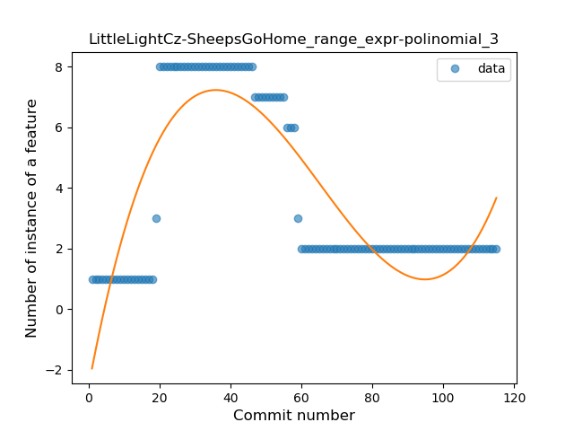
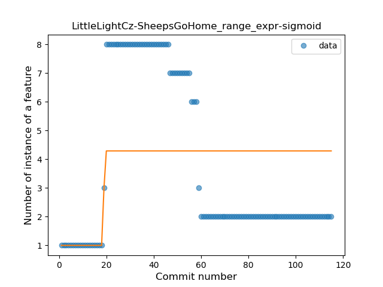
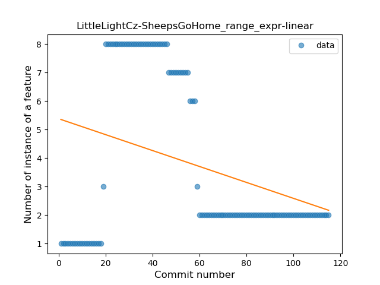
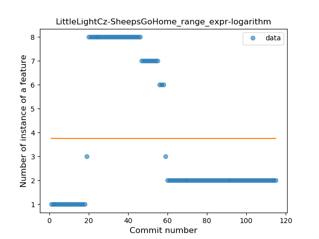
### <a name="func_call_with_named_arg">Function call with Named Argument</a>
----
#### Functions
* **Plateau Sudden Rise - Binary Sigmoid:** 
    * **R_Squared:** 1.0
* **Sudden Rise - Exponential:** 
    * **R_Squared:** 0.80865618
* **Constant Rise - Linear:** 
    * **R_Squared:** 0.20940171
* **Sudden Rise Plateau - Logarithm:** 
    * **R_Squared:** 0.0875881

**Plots** :chart_with_upwards_trend:
-----

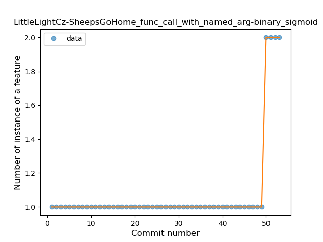
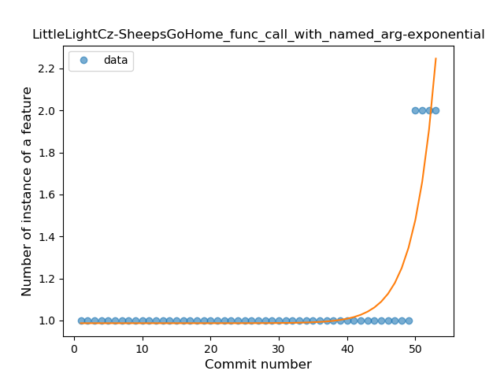
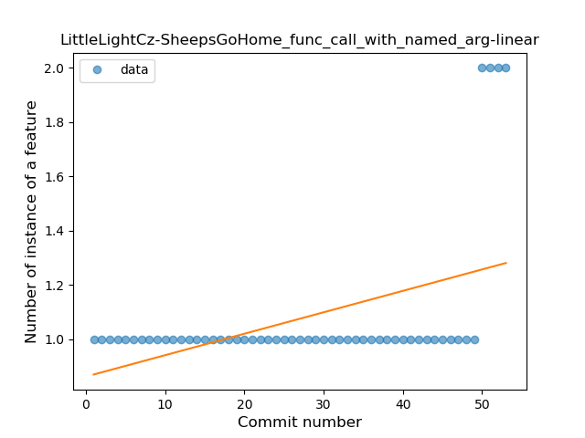
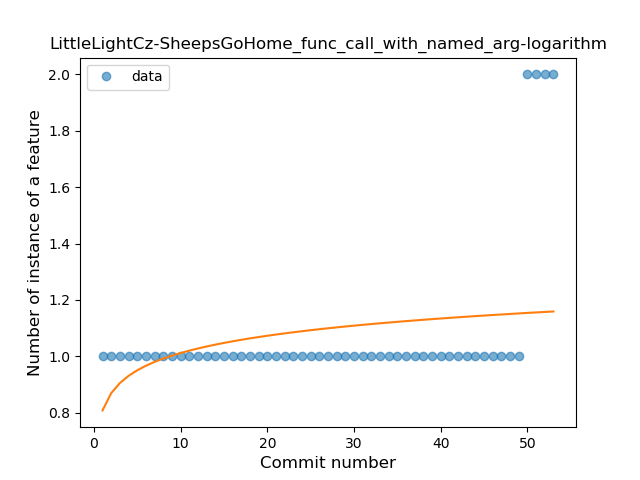
### <a name="property_delegation">Property Delegation</a>
----
#### Functions
* **Instability - Polinomial 3:** )
    * **R_Squared:** 0.83406973
* **Sudden Rise Plateau - Logarithm:** 
    * **R_Squared:** 0.38657639
* **Constant Rise - Linear:** 
    * **R_Squared:** 0.07553919

**Plots** :chart_with_upwards_trend:
-----

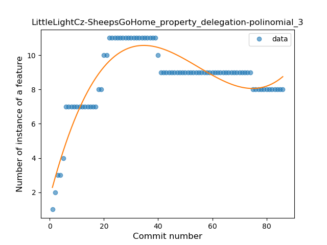
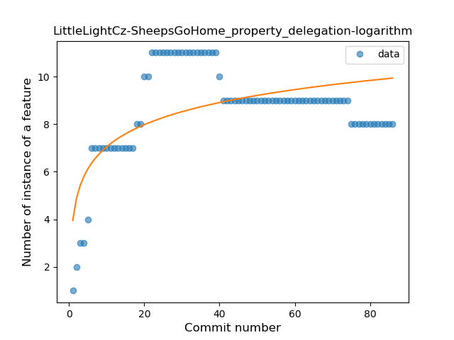
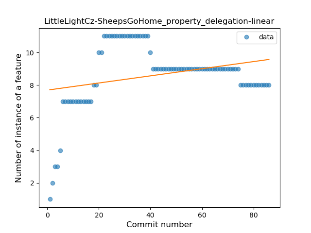
### <a name="destructuring_declaration">Destructuring Declaration</a>
----
#### Functions
* **Sudden Decline - Exponential:** 
    * **R_Squared:** 0.81824738
* **Instability - Polinomial 3:** )
    * **R_Squared:** 0.55340044
* **Constant Decline - Linear:** 
    * **R_Squared:** 0.15215311
* **Sudden Rise Plateau - Logarithm:** 
    * **R_Squared:** -0.0

**Plots** :chart_with_upwards_trend:
-----

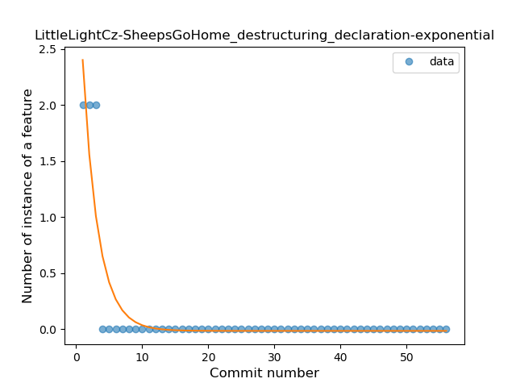
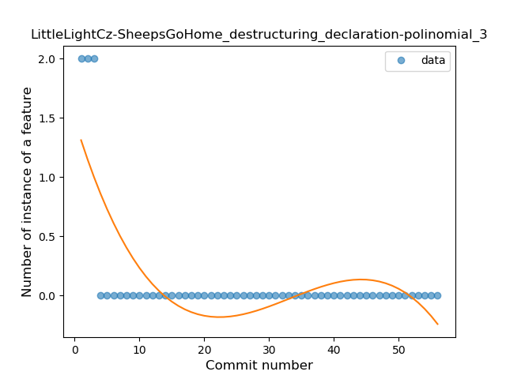
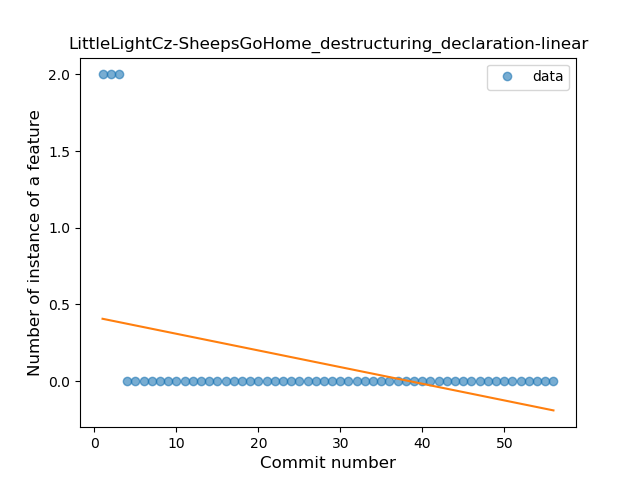
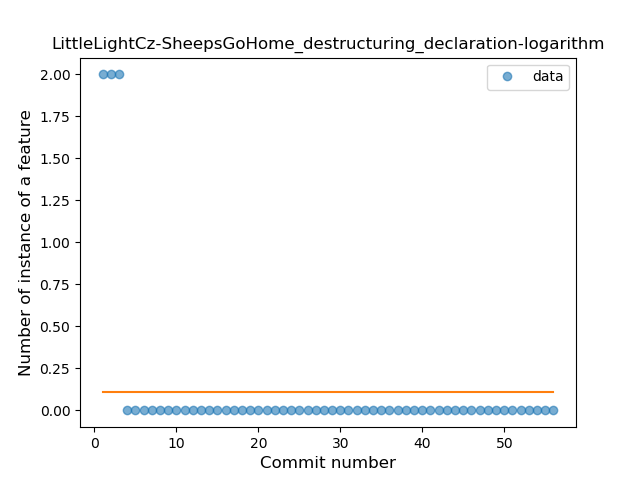
