## ManojMadanmohan-dlt
----
#### Metrics provided by Detekt
* Number of lines of code 1488
* Number of Kotlin files: 26
* Cyclomatic complexity: 234
* Cyclomatic complexity by thousands of lines: 282 

----
**5** features analyzed

*	<a href="#type_inference">Type Inference</a> 
*	<a href="#lambda">Lambda</a> 
*	<a href="#companion_object">Companion Object</a> 
*	<a href="#unsafe_call">Unsafe Call</a> 
*	<a href="#singleton">Singleton</a> 

### <a name="type_inference">Type Inference</a>
----
#### Functions
* **Instability - Polinomial 4:** 
    * **R_Squared:** 0.91871846
* **Instability - Polinomial 3:** )
    * **R_Squared:** 0.88214384
* **Sudden Rise Plateau - Logarithm:** 
    * **R_Squared:** 0.69781373
* **Constant Rise - Linear:** 
    * **R_Squared:** 0.39700987

**Plots** :chart_with_upwards_trend:
-----

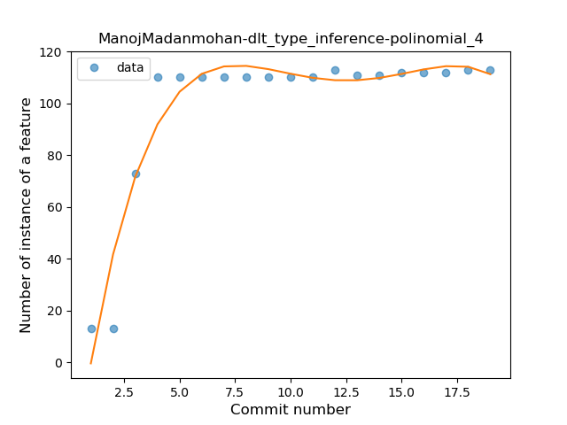
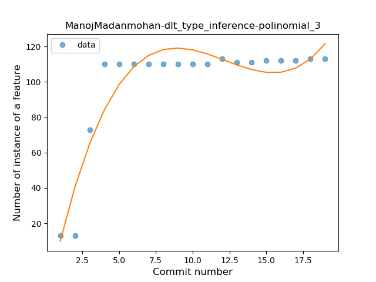
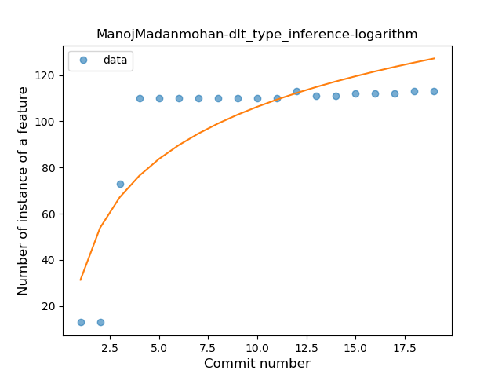
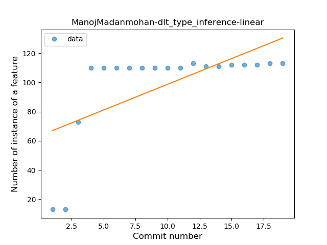
### <a name="lambda">Lambda</a>
----
#### Functions
* **Instability - Polinomial 4:** 
    * **R_Squared:** 0.76003945
* **Instability - Polinomial 3:** )
    * **R_Squared:** 0.60652717
* **Sudden Rise Plateau - Logarithm:** 
    * **R_Squared:** 0.28594147
* **Constant Rise - Linear:** 
    * **R_Squared:** 0.07653356

**Plots** :chart_with_upwards_trend:
-----

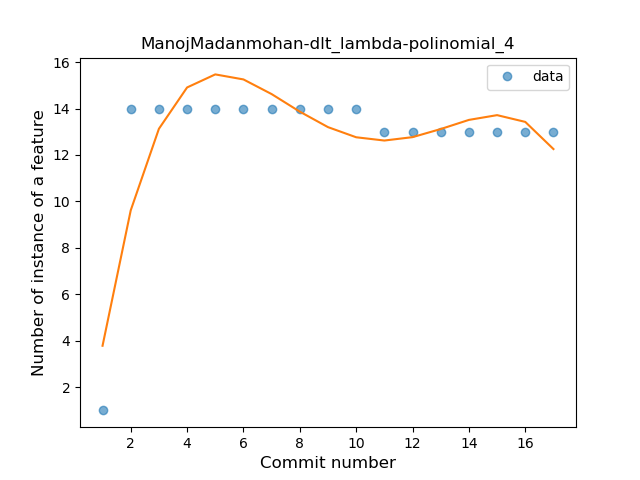
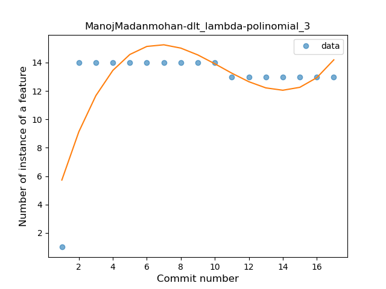
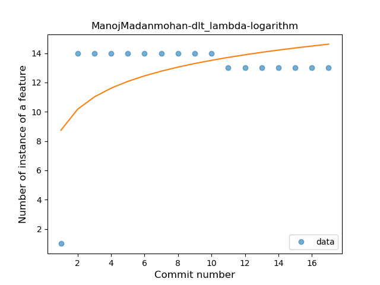
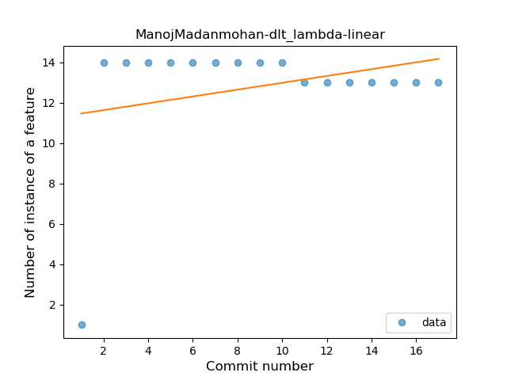
### <a name="companion_object">Companion Object</a>
----
#### Functions
* **Instability - Polinomial 4:** 
    * **R_Squared:** 0.90603429
* **Instability - Polinomial 3:** )
    * **R_Squared:** 0.85741429
* **Sudden Rise Plateau - Logarithm:** 
    * **R_Squared:** 0.64625884
* **Constant Rise - Linear:** 
    * **R_Squared:** 0.34340659

**Plots** :chart_with_upwards_trend:
-----

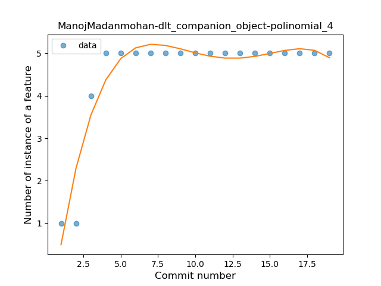
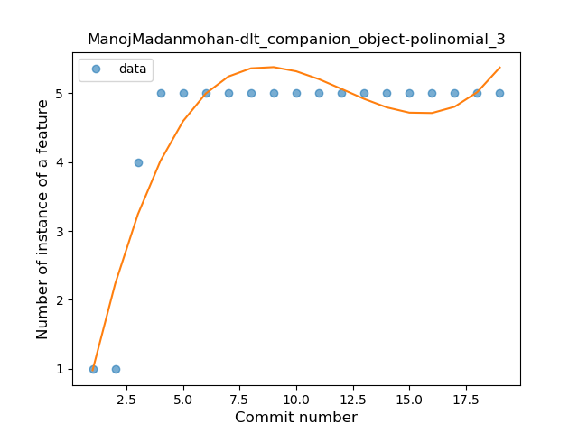
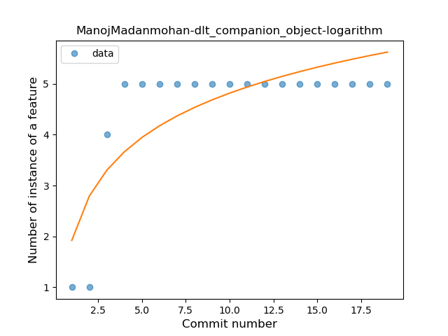
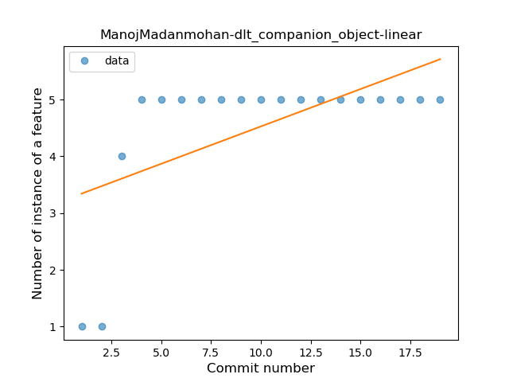
### <a name="unsafe_call">Unsafe Call</a>
----
#### Functions
* **Instability - Polinomial 4:** 
    * **R_Squared:** 0.81267879
* **Instability - Polinomial 3:** )
    * **R_Squared:** 0.68747934
* **Sudden Rise Plateau - Logarithm:** 
    * **R_Squared:** 0.58286538
* **Constant Rise - Linear:** 
    * **R_Squared:** 0.31127112

**Plots** :chart_with_upwards_trend:
-----

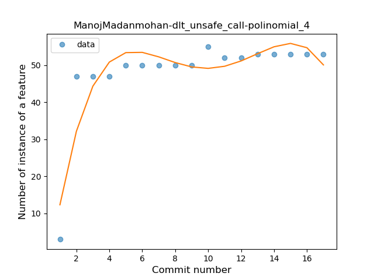
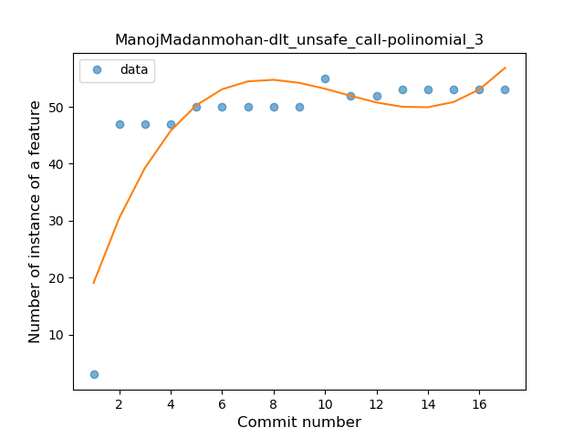
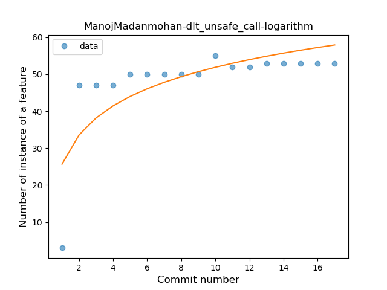
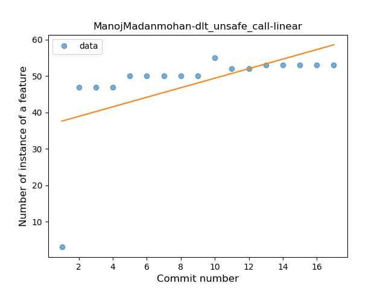
### <a name="singleton">Singleton</a>
----
#### Functions
* **Instability - Polinomial 3:** )
    * **R_Squared:** 0.85756743
* **Sudden Rise Plateau - Logarithm:** 
    * **R_Squared:** 0.81805712
* **Constant Rise - Linear:** 
    * **R_Squared:** 0.57192649

**Plots** :chart_with_upwards_trend:
-----

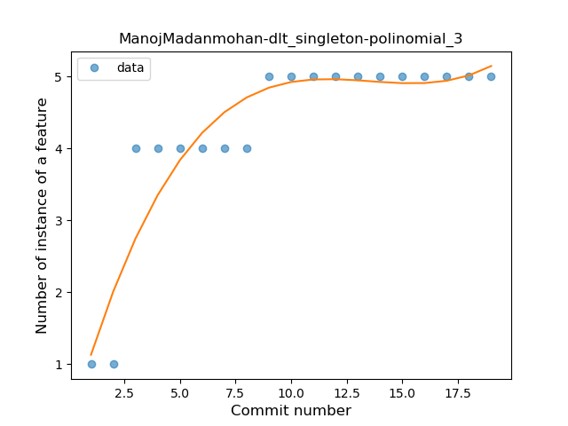
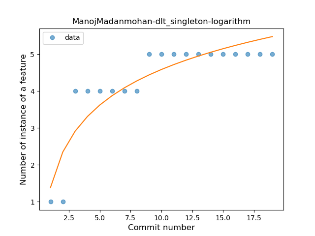
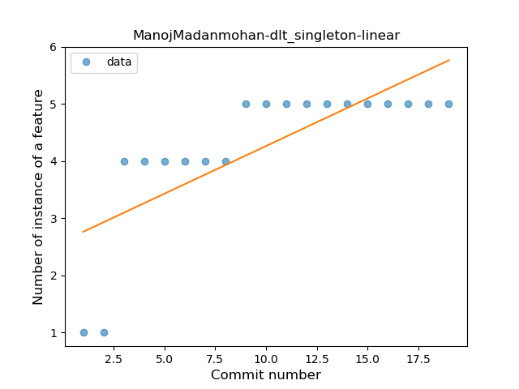
