## MartinStyk-AndroidApkAnalyzer
----
#### Metrics provided by Detekt
* Number of lines of code 9297
* Number of Kotlin files: 173
* Cyclomatic complexity: 1113
* Cyclomatic complexity by thousands of lines: 275 

----
**16** features analyzed

*	<a href="#type_inference">Type Inference</a> 
*	<a href="#lambda">Lambda</a> 
*	<a href="#safe_call">Safe Call</a> 
*	<a href="#when_expr">When expression</a> 
*	<a href="#companion_object">Companion Object</a> 
*	<a href="#unsafe_call">Unsafe Call</a> 
*	<a href="#string_template">String Template</a> 
*	<a href="#func_with_default_value">Function with Default Value</a> 
*	<a href="#singleton">Singleton</a> 
*	<a href="#smart_cast">Smart Cast</a> 
*	<a href="#range_expr">Range Expression</a> 
*	<a href="#func_call_with_named_arg">Function call with Named Argument</a> 
*	<a href="#data_class">Data Class</a> 
*	<a href="#extension_function">Extension Function</a> 
*	<a href="#property_delegation">Property Delegation</a> 
*	<a href="#destructuring_declaration">Destructuring Declaration</a> 

### <a name="type_inference">Type Inference</a>
----
#### Functions
* **Sudden Rise Plateau - Logarithm:** 
    * **R_Squared:** 0.44960566
* **Instability - Polinomial 3:** )
    * **R_Squared:** 0.32146162
* **Constant Rise - Linear:** 
    * **R_Squared:** 0.1670029
* **Plateau Sudden Rise - Binary Sigmoid:** 
    * **R_Squared:** 0.06723771

**Plots** :chart_with_upwards_trend:
-----

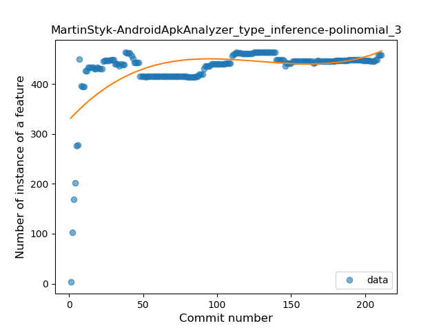
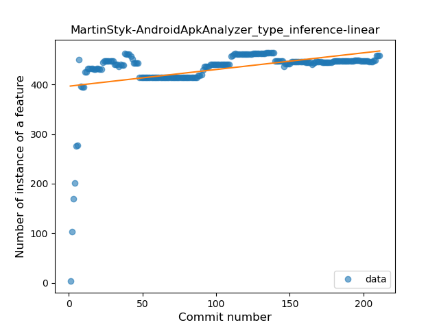
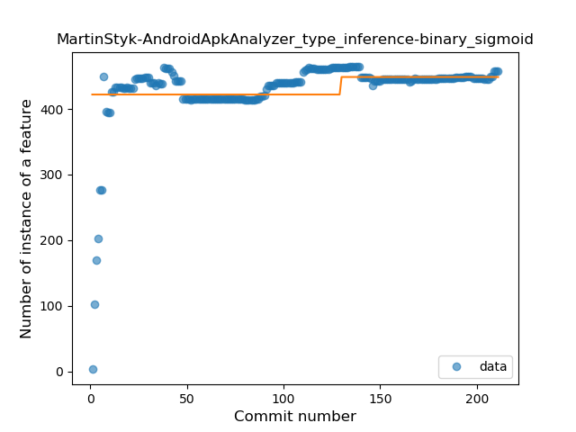
### <a name="lambda">Lambda</a>
----
#### Functions
* **Sudden Rise Plateau - Logarithm:** 
    * **R_Squared:** 0.89657883
* **Constant Rise - Linear:** 
    * **R_Squared:** 0.65358575

**Plots** :chart_with_upwards_trend:
-----

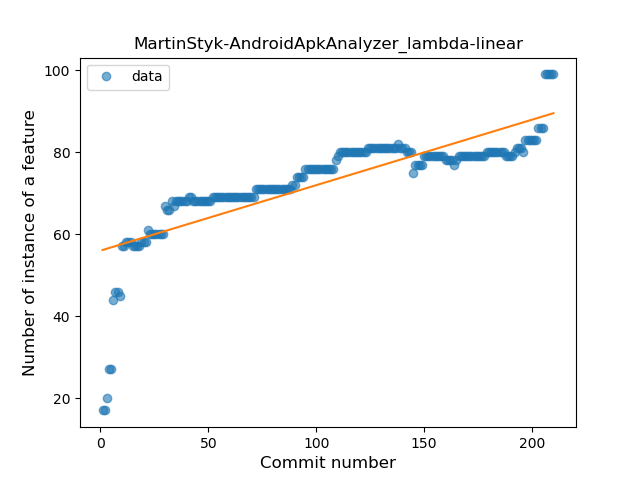
### <a name="safe_call">Safe Call</a>
----
#### Functions
* **Sudden Rise Plateau - Logarithm:** 
    * **R_Squared:** 0.90846163
* **Constant Rise - Linear:** 
    * **R_Squared:** 0.87989146
* **Plateau Sudden Rise - Binary Sigmoid:** 
    * **R_Squared:** 0.63216557

**Plots** :chart_with_upwards_trend:
-----

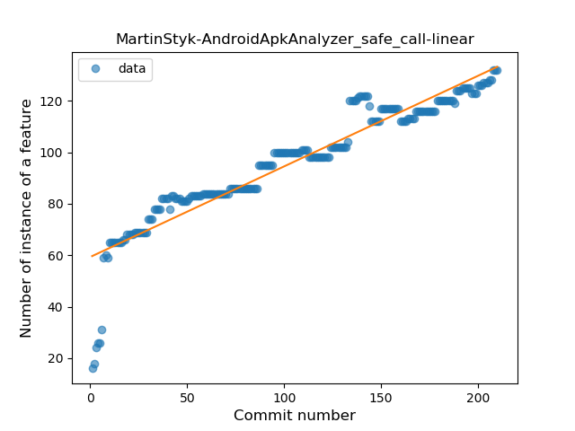
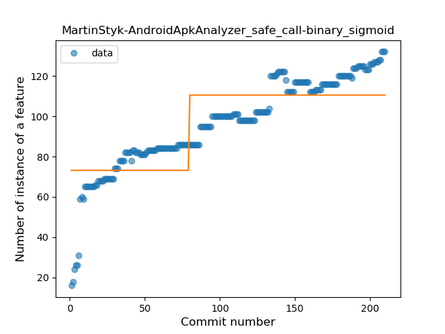
### <a name="when_expr">When expression</a>
----
#### Functions
* **Sudden Rise Plateau - Logarithm:** 
    * **R_Squared:** 0.65247663
* **Constant Rise - Linear:** 
    * **R_Squared:** 0.32110583

**Plots** :chart_with_upwards_trend:
-----

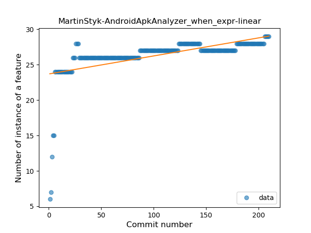
### <a name="companion_object">Companion Object</a>
----
#### Functions
* **Sudden Rise Plateau - Logarithm:** 
    * **R_Squared:** 0.69653346
* **Constant Rise - Linear:** 
    * **R_Squared:** 0.2758816

**Plots** :chart_with_upwards_trend:
-----

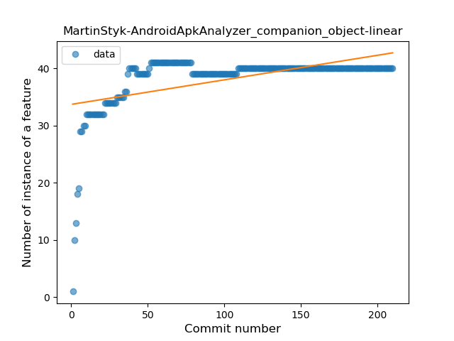
### <a name="unsafe_call">Unsafe Call</a>
----
#### Functions
* **Constant Decline - Linear:** 
    * **R_Squared:** 0.03650608
* **Sudden Rise - Exponential:** 
    * **R_Squared:** 5.742e-05
* **Sudden Rise Plateau - Logarithm:** 
    * **R_Squared:** -0.0
* **Plateau Gradual Rise - Sigmoid:** 
    * **R_Squared:** 0.00015851

**Plots** :chart_with_upwards_trend:
-----

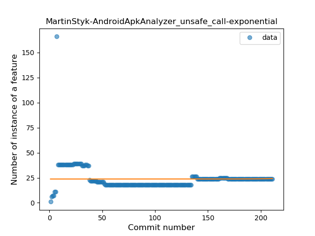

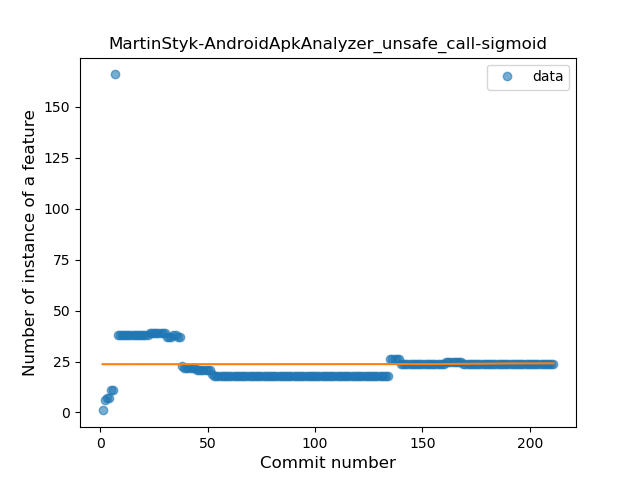
### <a name="string_template">String Template</a>
----
#### Functions
* **Plateau Gradual Rise - Sigmoid:** 
    * **R_Squared:** 0.90520699
* **Sudden Rise - Exponential:** 
    * **R_Squared:** 0.63622722
* **Constant Rise - Linear:** 
    * **R_Squared:** 0.6254317
* **Sudden Rise Plateau - Logarithm:** 
    * **R_Squared:** 0.3798243

**Plots** :chart_with_upwards_trend:
-----

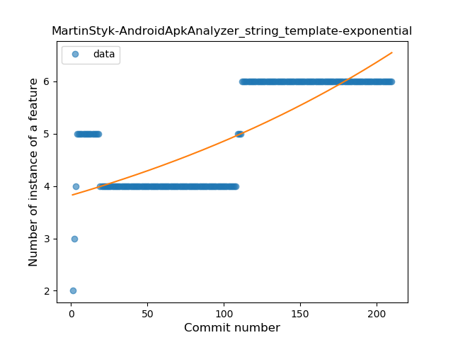
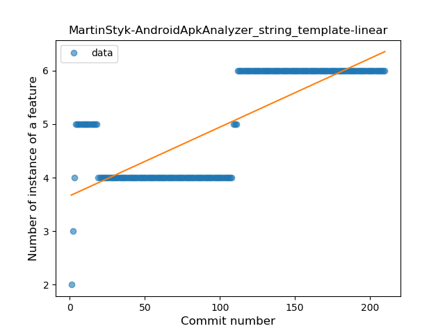
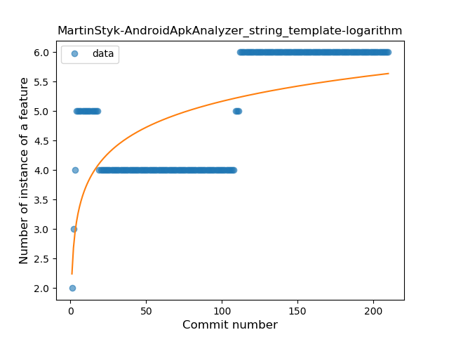
### <a name="func_with_default_value">Function with Default Value</a>
----
#### Functions
* **Sudden Rise Plateau - Logarithm:** 
    * **R_Squared:** 0.72535883
* **Constant Rise - Linear:** 
    * **R_Squared:** 0.38477269

**Plots** :chart_with_upwards_trend:
-----

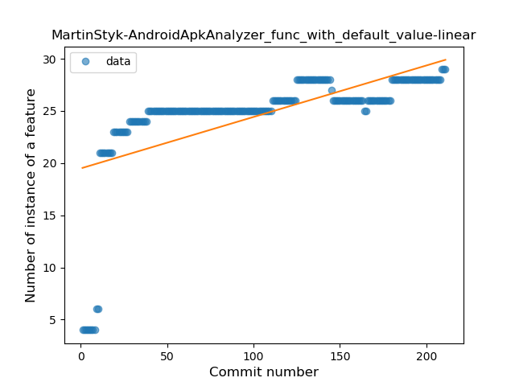
### <a name="singleton">Singleton</a>
----
#### Functions
* **Sudden Rise Plateau - Logarithm:** 
    * **R_Squared:** 0.43456749
* **Plateau Sudden Rise - Binary Sigmoid:** 
    * **R_Squared:** 0.24353185
* **Constant Rise - Linear:** 
    * **R_Squared:** 0.10848638

**Plots** :chart_with_upwards_trend:
-----

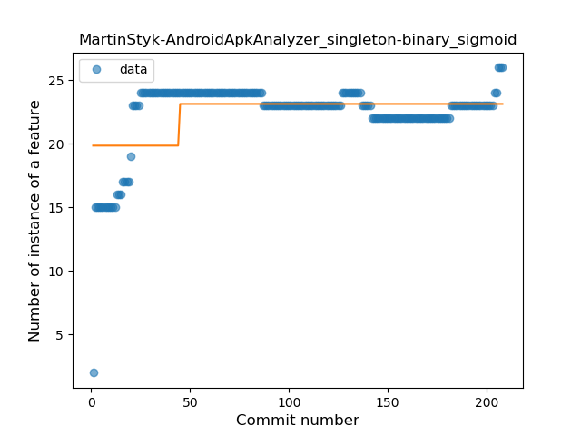
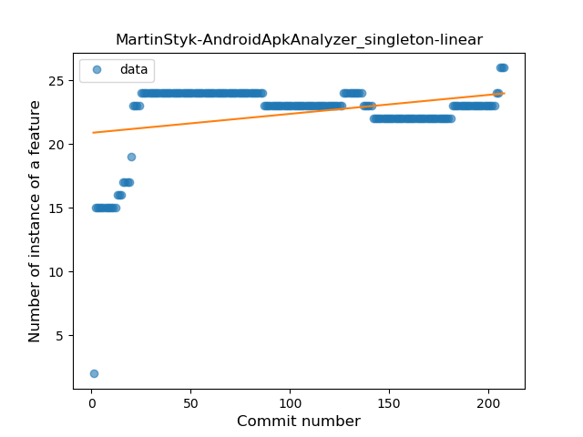
### <a name="smart_cast">Smart Cast</a>
----
#### Functions
* **Sudden Rise Plateau - Logarithm:** 
    * **R_Squared:** 0.62288383
* **Constant Rise - Linear:** 
    * **R_Squared:** 0.52222009

**Plots** :chart_with_upwards_trend:
-----

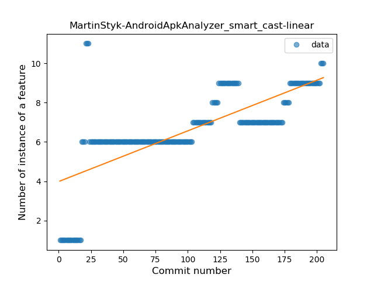
### <a name="range_expr">Range Expression</a>
----
#### Functions
* **Plateau Sudden Rise - Binary Sigmoid:** 
    * **R_Squared:** 0.9767855
* **Sudden Rise Plateau - Logarithm:** 
    * **R_Squared:** 0.30692997
* **Constant Rise - Linear:** 
    * **R_Squared:** 0.06408602

**Plots** :chart_with_upwards_trend:
-----

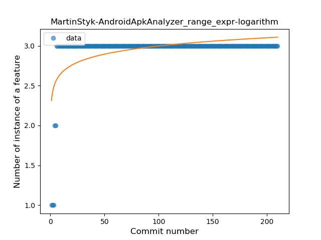
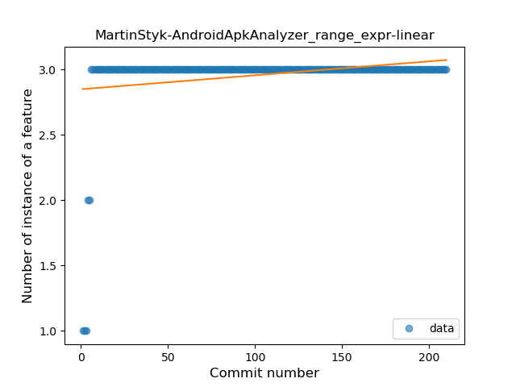
### <a name="func_call_with_named_arg">Function call with Named Argument</a>
----
#### Functions
* **Sudden Rise Plateau - Logarithm:** 
    * **R_Squared:** 0.3975907
* **Constant Rise - Linear:** 
    * **R_Squared:** 0.06748063

**Plots** :chart_with_upwards_trend:
-----

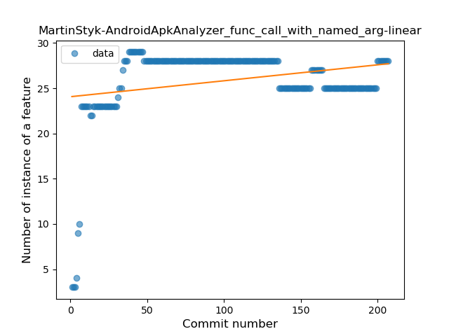
### <a name="data_class">Data Class</a>
----
#### Functions
* **Sudden Rise Plateau - Logarithm:** 
    * **R_Squared:** 0.18506003
* **Plateau Sudden Rise - Binary Sigmoid:** 
    * **R_Squared:** 0.05193676
* **Constant Rise - Linear:** 
    * **R_Squared:** 0.03716107

**Plots** :chart_with_upwards_trend:
-----

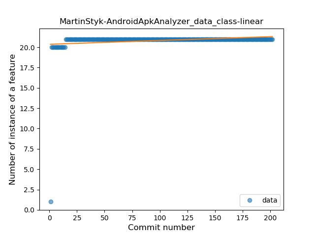
### <a name="extension_function">Extension Function</a>
----
#### Functions
* **Plateau Sudden Rise - Binary Sigmoid:** 
    * **R_Squared:** 0.86788939
* **Sudden Rise - Exponential:** 
    * **R_Squared:** 0.7797683
* **Constant Rise - Linear:** 
    * **R_Squared:** 0.75374043
* **Sudden Rise Plateau - Logarithm:** 
    * **R_Squared:** 0.46056644

**Plots** :chart_with_upwards_trend:
-----

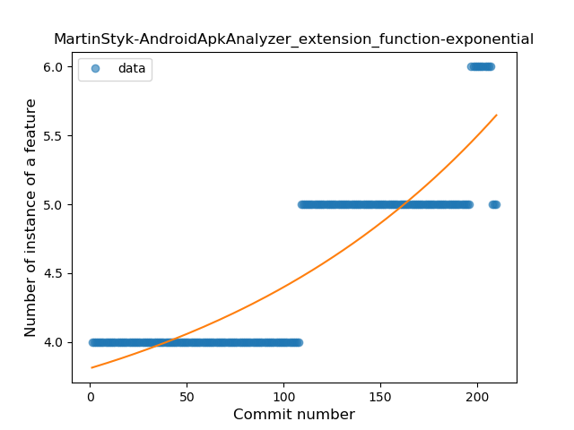
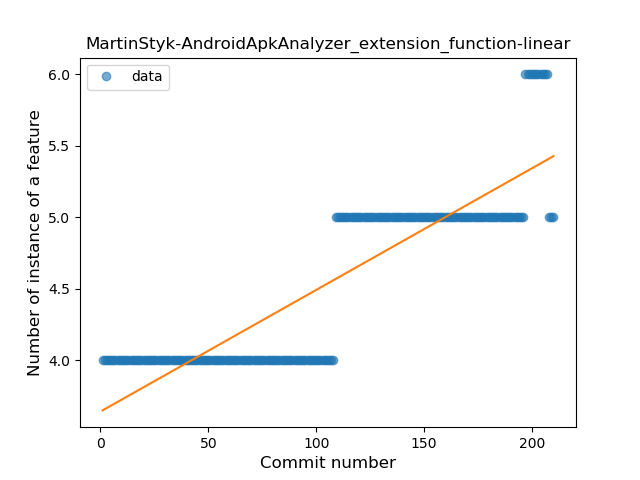
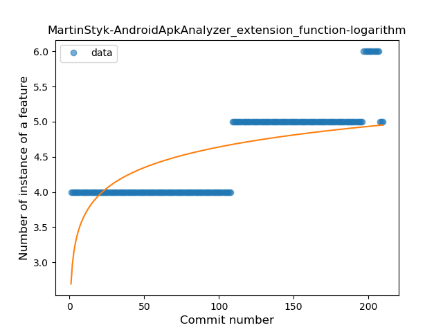
### <a name="property_delegation">Property Delegation</a>
----
#### Functions
* **Plateau Sudden Rise - Binary Sigmoid:** 
    * **R_Squared:** 0.85780886
* **Sudden Rise Plateau - Logarithm:** 
    * **R_Squared:** 0.56309829
* **Constant Rise - Linear:** 
    * **R_Squared:** 0.3852046

**Plots** :chart_with_upwards_trend:
-----

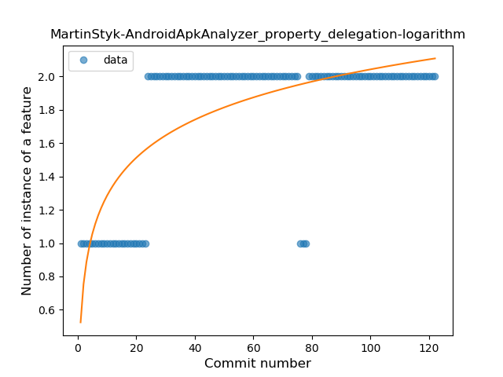
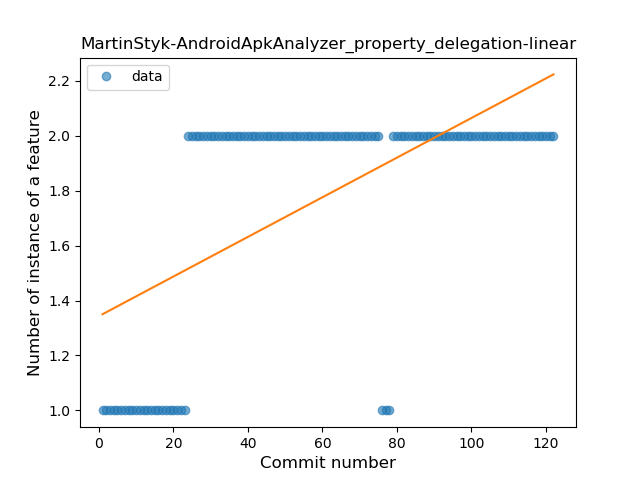
### <a name="destructuring_declaration">Destructuring Declaration</a>
----
#### Functions
* **Plateau Gradual Rise - Sigmoid:** 
    * **R_Squared:** 0.74378572
* **Constant Rise - Linear:** 
    * **R_Squared:** 0.46941584
* **Sudden Rise - Exponential:** 
    * **R_Squared:** 0.46981159
* **Sudden Rise Plateau - Logarithm:** 
    * **R_Squared:** 0.30615777

**Plots** :chart_with_upwards_trend:
-----

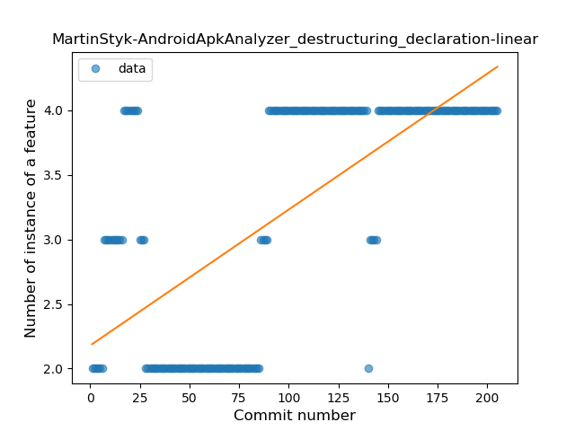
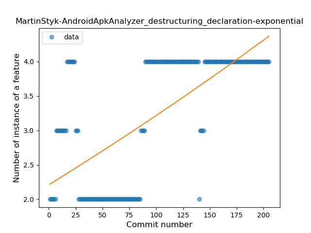
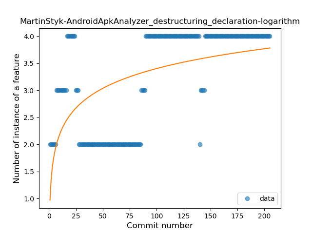
