## Maxr1998-MaxLock
----
#### Metrics provided by Detekt
* Number of lines of code 2700
* Number of Kotlin files: 27
* Cyclomatic complexity: 408
* Cyclomatic complexity by thousands of lines: 333 

----
**12** features analyzed

*	<a href="#type_inference">Type Inference</a> 
*	<a href="#lambda">Lambda</a> 
*	<a href="#safe_call">Safe Call</a> 
*	<a href="#when_expr">When expression</a> 
*	<a href="#companion_object">Companion Object</a> 
*	<a href="#unsafe_call">Unsafe Call</a> 
*	<a href="#string_template">String Template</a> 
*	<a href="#func_with_default_value">Function with Default Value</a> 
*	<a href="#singleton">Singleton</a> 
*	<a href="#smart_cast">Smart Cast</a> 
*	<a href="#extension_function">Extension Function</a> 
*	<a href="#property_delegation">Property Delegation</a> 

### <a name="type_inference">Type Inference</a>
----
#### Functions
* **Sudden Rise - Exponential:** 
    * **R_Squared:** 0.93467907
* **Constant Rise - Linear:** 
    * **R_Squared:** 0.79437376
* **Sudden Rise Plateau - Logarithm:** 
    * **R_Squared:** 0.33609558
* **Plateau Sudden Rise - Binary Sigmoid:** 
    * **R_Squared:** 0.07116304

**Plots** :chart_with_upwards_trend:
-----

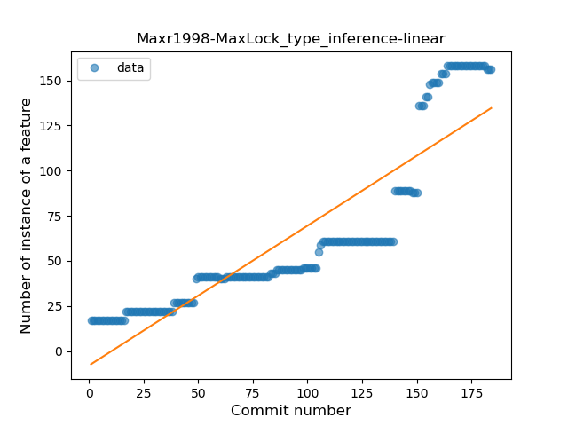
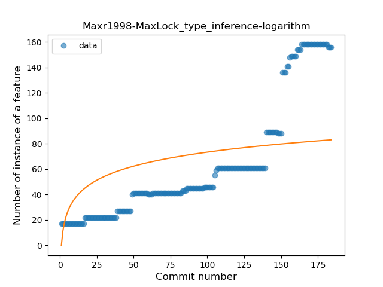
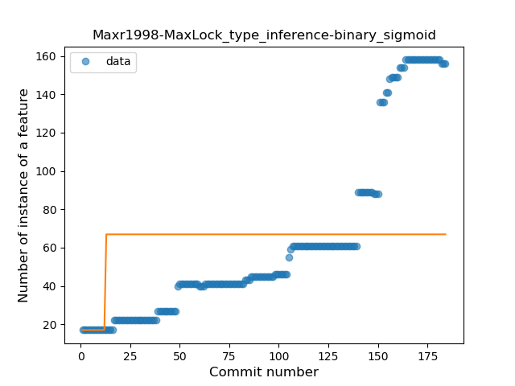
### <a name="lambda">Lambda</a>
----
#### Functions
* **Sudden Rise - Exponential:** 
    * **R_Squared:** 0.93104063
* **Constant Rise - Linear:** 
    * **R_Squared:** 0.88045034
* **Sudden Rise Plateau - Logarithm:** 
    * **R_Squared:** 0.4294826

**Plots** :chart_with_upwards_trend:
-----

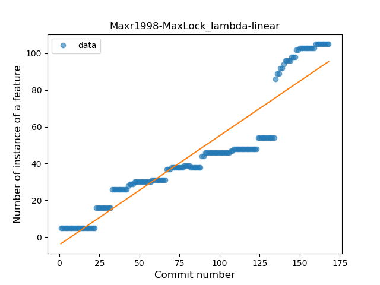
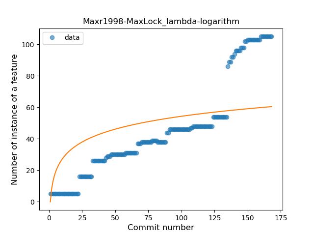
### <a name="safe_call">Safe Call</a>
----
#### Functions
* **Constant Rise - Linear:** 
    * **R_Squared:** 0.94239231
* **Sudden Rise Plateau - Logarithm:** 
    * **R_Squared:** 0.60666316

**Plots** :chart_with_upwards_trend:
-----

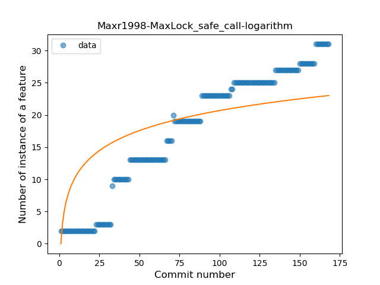
### <a name="when_expr">When expression</a>
----
#### Functions
* **Plateau Gradual Rise - Sigmoid:** 
    * **R_Squared:** 0.93785353
* **Sudden Rise - Exponential:** 
    * **R_Squared:** 0.91227933
* **Constant Rise - Linear:** 
    * **R_Squared:** 0.83847265
* **Sudden Rise Plateau - Logarithm:** 
    * **R_Squared:** 0.53301655

**Plots** :chart_with_upwards_trend:
-----

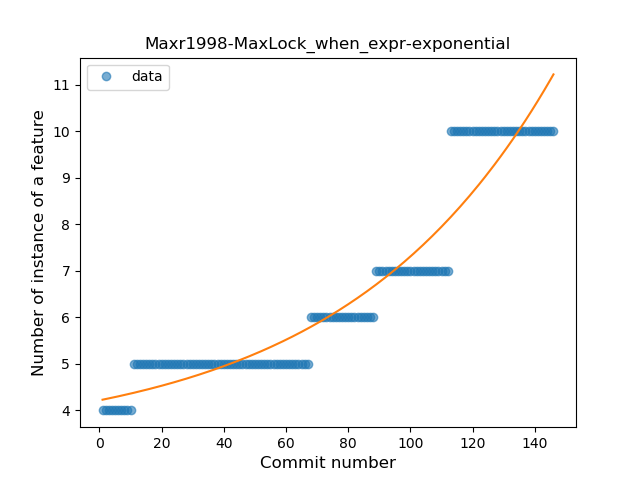
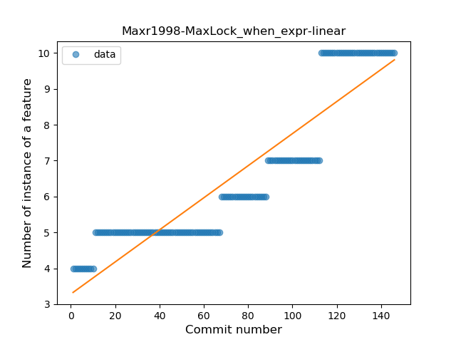
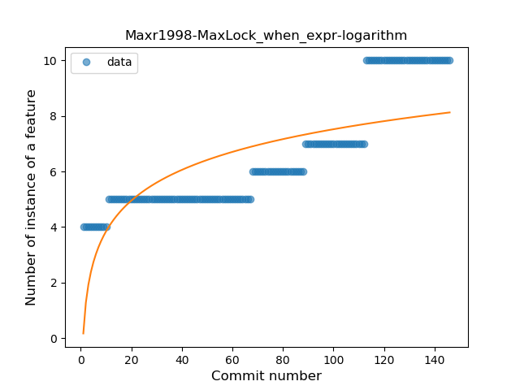
### <a name="companion_object">Companion Object</a>
----
#### Functions
* **Plateau Gradual Rise - Sigmoid:** 
    * **R_Squared:** 1.0
* **Constant Rise - Linear:** 
    * **R_Squared:** 0.73406416
* **Sudden Rise Plateau - Logarithm:** 
    * **R_Squared:** 0.53468702

**Plots** :chart_with_upwards_trend:
-----

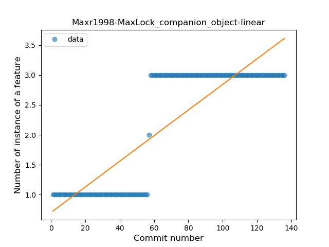
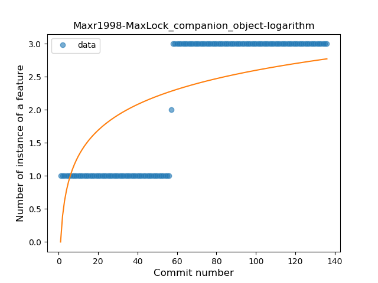
### <a name="unsafe_call">Unsafe Call</a>
----
#### Functions
* **Constant Rise - Linear:** 
    * **R_Squared:** 0.78088257
* **Sudden Rise Plateau - Logarithm:** 
    * **R_Squared:** 0.65662277

**Plots** :chart_with_upwards_trend:
-----

### <a name="string_template">String Template</a>
----
#### Functions
* **Sudden Rise Plateau - Logarithm:** 
    * **R_Squared:** 0.88729474
* **Constant Rise - Linear:** 
    * **R_Squared:** 0.69571635

**Plots** :chart_with_upwards_trend:
-----

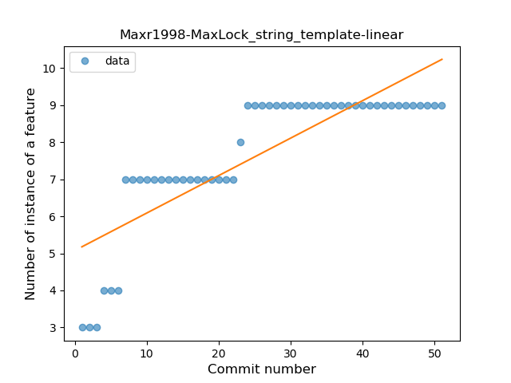
### <a name="func_with_default_value">Function with Default Value</a>
----
#### Functions
* **Plateau Gradual Rise - Sigmoid:** 
    * **R_Squared:** 0.98941813
* **Sudden Rise - Exponential:** 
    * **R_Squared:** 0.81065064
* **Constant Rise - Linear:** 
    * **R_Squared:** 0.56088231
* **Sudden Rise Plateau - Logarithm:** 
    * **R_Squared:** 0.25531114

**Plots** :chart_with_upwards_trend:
-----

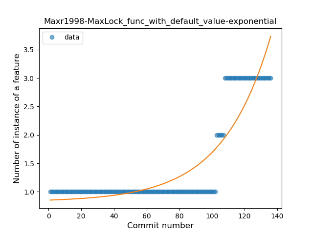
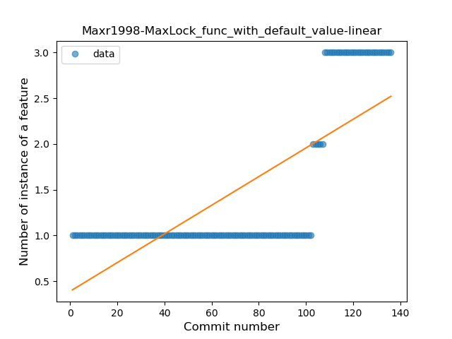
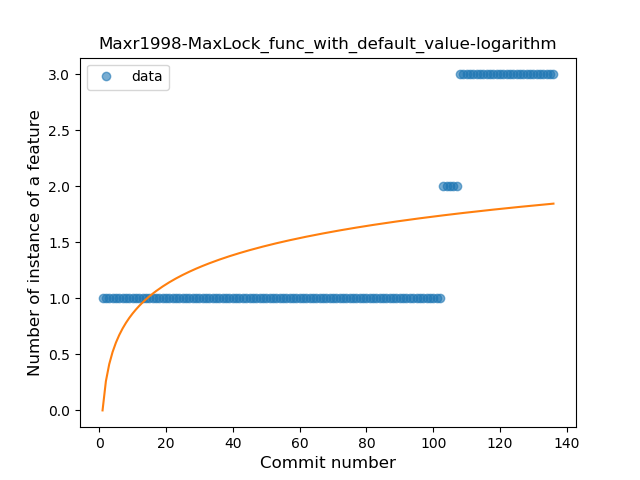
### <a name="singleton">Singleton</a>
----
#### Functions
* **Constant Rise - Linear:** 
    * **R_Squared:** 0.86785067
* **Sudden Rise - Exponential:** 
    * **R_Squared:** 0.86974786
* **Sudden Rise Plateau - Logarithm:** 
    * **R_Squared:** 0.58791848

**Plots** :chart_with_upwards_trend:
-----

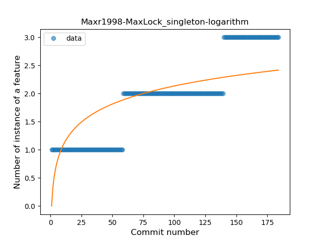
### <a name="smart_cast">Smart Cast</a>
----
#### Functions
* **Plateau Sudden Rise - Binary Sigmoid:** 
    * **R_Squared:** 1.0
* **Instability - Polinomial 3:** )
    * **R_Squared:** 0.82074176
* **Sudden Rise Plateau - Logarithm:** 
    * **R_Squared:** 0.67556331
* **Constant Rise - Linear:** 
    * **R_Squared:** 0.42857143

**Plots** :chart_with_upwards_trend:
-----

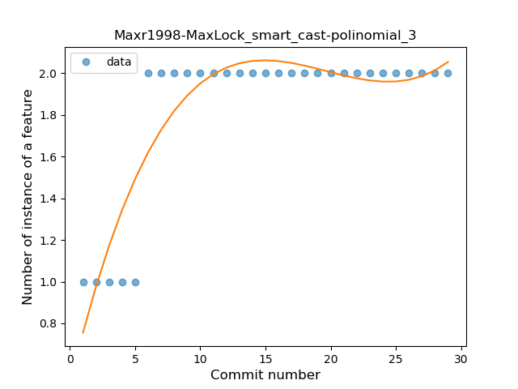
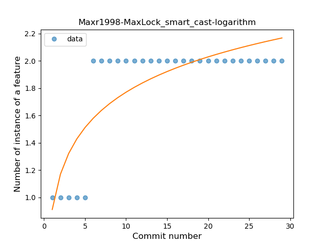
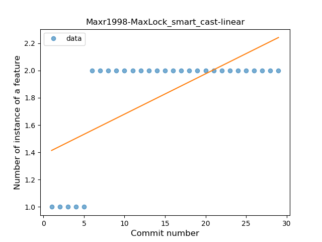
### <a name="extension_function">Extension Function</a>
----
#### Functions
* **Plateau Gradual Rise - Sigmoid:** 
    * **R_Squared:** 0.97870289
* **Instability - Polinomial 3:** )
    * **R_Squared:** 0.90921001
* **Sudden Rise - Exponential:** 
    * **R_Squared:** 0.83064576
* **Constant Rise - Linear:** 
    * **R_Squared:** 0.80067701
* **Sudden Rise Plateau - Logarithm:** 
    * **R_Squared:** 0.38034197

**Plots** :chart_with_upwards_trend:
-----

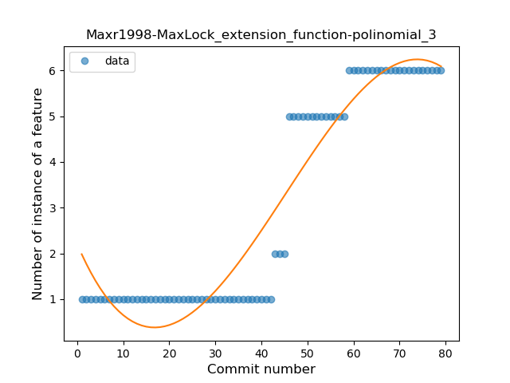
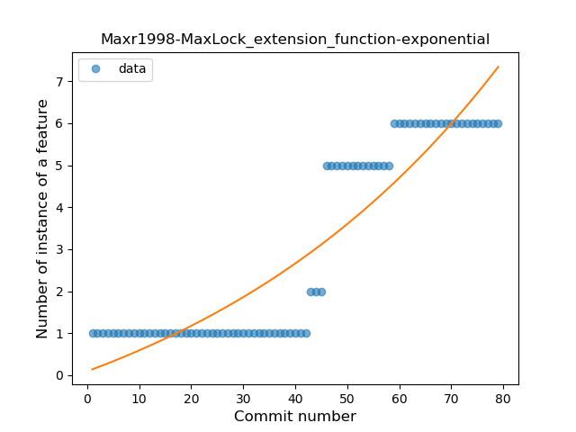
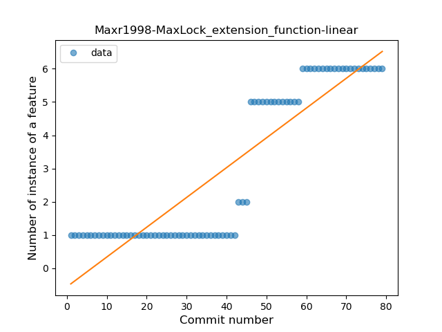
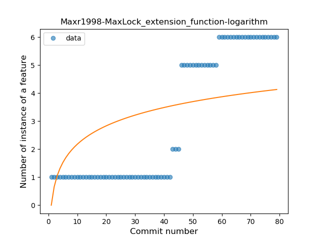
### <a name="property_delegation">Property Delegation</a>
----
#### Functions
* **Plateau Gradual Rise - Sigmoid:** 
    * **R_Squared:** 0.86685894
* **Sudden Rise Plateau - Logarithm:** 
    * **R_Squared:** 0.80027868
* **Constant Rise - Linear:** 
    * **R_Squared:** 0.65145858

**Plots** :chart_with_upwards_trend:
-----

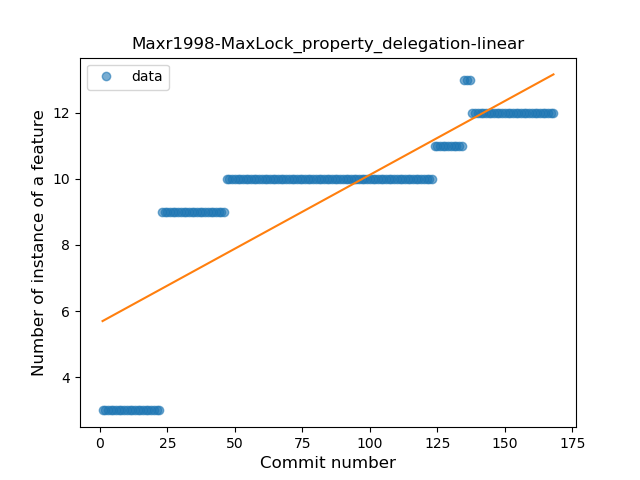
