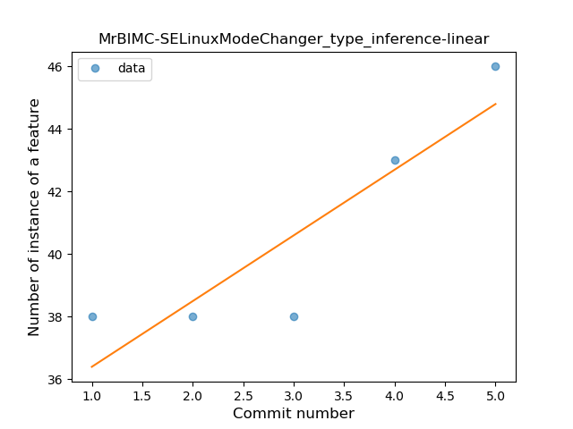
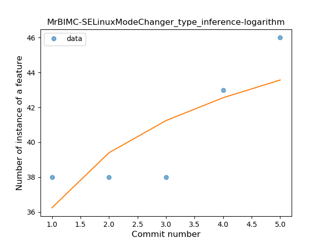
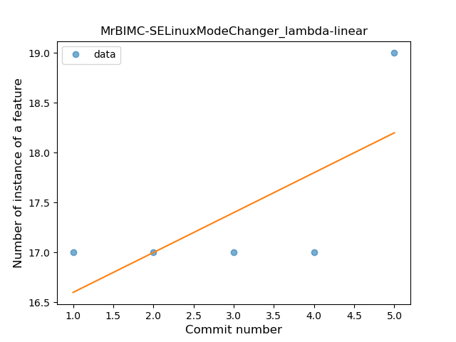
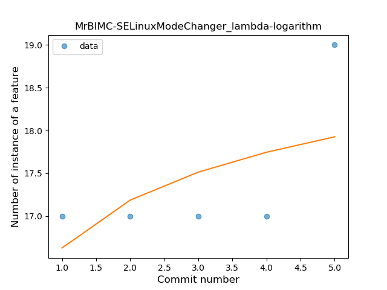
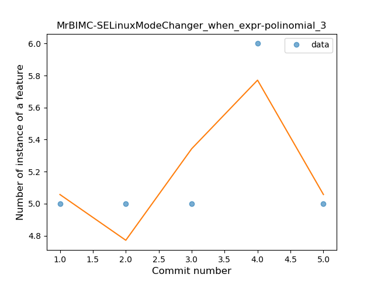
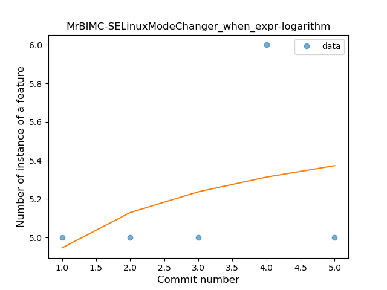
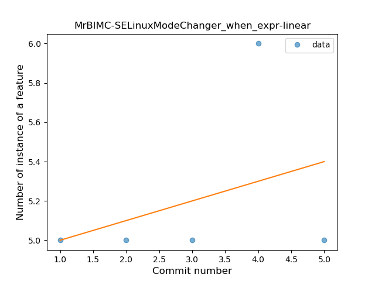

## MrBIMC-SELinuxModeChanger
----
#### Metrics provided by Detekt
* Number of lines of code 412
* Number of Kotlin files: 6
* Cyclomatic complexity: 54
* Cyclomatic complexity by thousands of lines: 267 

----
**3** features analyzed

*	<a href="#type_inference">Type Inference</a> 
*	<a href="#lambda">Lambda</a> 
*	<a href="#when_expr">When expression</a> 

### <a name="type_inference">Type Inference</a>
----
#### Functions
* **Sudden Rise - Exponential:** 
    * **R_Squared:** 0.9308057
* **Constant Rise - Linear:** 
    * **R_Squared:** 0.79891304
* **Sudden Rise Plateau - Logarithm:** 
    * **R_Squared:** 0.60736972

**Plots** :chart_with_upwards_trend:
-----

### <a name="lambda">Lambda</a>
----
#### Functions
* **Instability - Polinomial 3:** )
    * **R_Squared:** 0.98214286
* **Constant Rise - Linear:** 
    * **R_Squared:** 0.5
* **Sudden Rise Plateau - Logarithm:** 
    * **R_Squared:** 0.3288673

**Plots** :chart_with_upwards_trend:
-----

### <a name="when_expr">When expression</a>
----
#### Functions
* **Instability - Polinomial 4:** 
    * **R_Squared:** 1.0
* **Instability - Polinomial 3:** )
    * **R_Squared:** 0.71428571
* **Sudden Rise Plateau - Logarithm:** 
    * **R_Squared:** 0.14226809
* **Constant Rise - Linear:** 
    * **R_Squared:** 0.125

**Plots** :chart_with_upwards_trend:
-----

