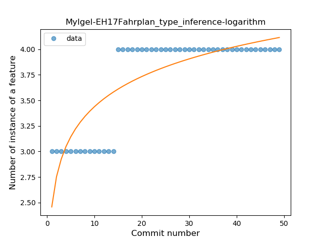
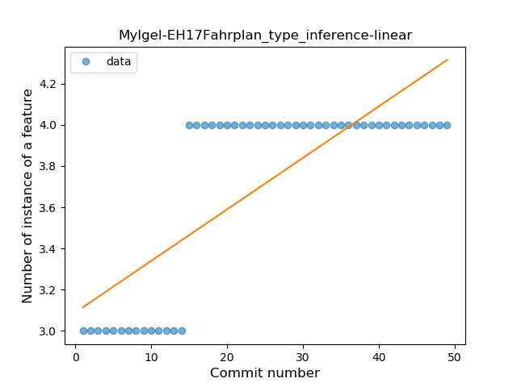

## MyIgel-EH17Fahrplan
----
#### Metrics provided by Detekt
* Number of lines of code 72
* Number of Kotlin files: 2
* Cyclomatic complexity: 8
* Cyclomatic complexity by thousands of lines: 186 

----
**1** features analyzed

*	<a href="#type_inference">Type Inference</a> 

### <a name="type_inference">Type Inference</a>
----
#### Functions
* **Plateau Sudden Rise - Binary Sigmoid:** 
    * **R_Squared:** 1.0
* **Sudden Rise Plateau - Logarithm:** 
    * **R_Squared:** 0.68626898
* **Constant Rise - Linear:** 
    * **R_Squared:** 0.6125

**Plots** :chart_with_upwards_trend:
-----

