## Mygod-VPNHotspot
----
#### Metrics provided by Detekt
* Number of lines of code 5037
* Number of Kotlin files: 64
* Cyclomatic complexity: 978
* Cyclomatic complexity by thousands of lines: 340 

----
**18** features analyzed

*	<a href="#type_inference">Type Inference</a> 
*	<a href="#lambda">Lambda</a> 
*	<a href="#safe_call">Safe Call</a> 
*	<a href="#when_expr">When expression</a> 
*	<a href="#companion_object">Companion Object</a> 
*	<a href="#unsafe_call">Unsafe Call</a> 
*	<a href="#string_template">String Template</a> 
*	<a href="#func_with_default_value">Function with Default Value</a> 
*	<a href="#singleton">Singleton</a> 
*	<a href="#smart_cast">Smart Cast</a> 
*	<a href="#range_expr">Range Expression</a> 
*	<a href="#func_call_with_named_arg">Function call with Named Argument</a> 
*	<a href="#data_class">Data Class</a> 
*	<a href="#extension_function">Extension Function</a> 
*	<a href="#property_delegation">Property Delegation</a> 
*	<a href="#destructuring_declaration">Destructuring Declaration</a> 
*	<a href="#inline_func">Inline Function</a> 
*	<a href="#overloaded_op">Overloaded Operator</a> 

### <a name="type_inference">Type Inference</a>
----
#### Functions
* **Constant Rise - Linear:** 
    * **R_Squared:** 0.96127463
* **Sudden Rise Plateau - Logarithm:** 
    * **R_Squared:** 0.58828872
* **Plateau Sudden Rise - Binary Sigmoid:** 
    * **R_Squared:** 0.45551973

**Plots** :chart_with_upwards_trend:
-----

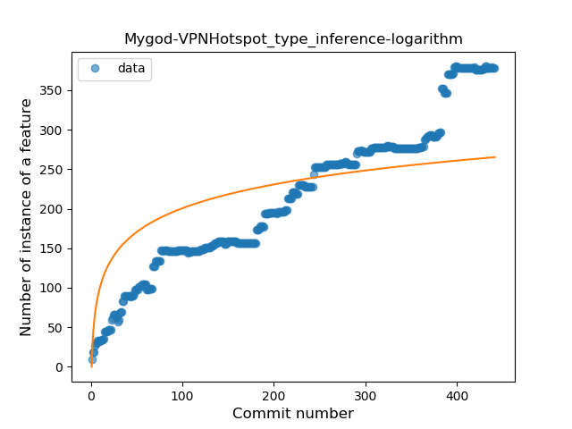
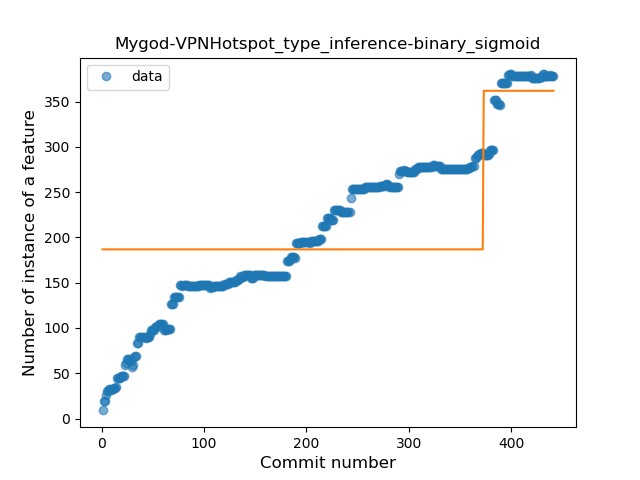
### <a name="lambda">Lambda</a>
----
#### Functions
* **Constant Rise - Linear:** 
    * **R_Squared:** 0.97130434
* **Sudden Rise - Exponential:** 
    * **R_Squared:** 0.97306586
* **Plateau Sudden Rise - Binary Sigmoid:** 
    * **R_Squared:** 0.57621355
* **Sudden Rise Plateau - Logarithm:** 
    * **R_Squared:** 0.53019306

**Plots** :chart_with_upwards_trend:
-----

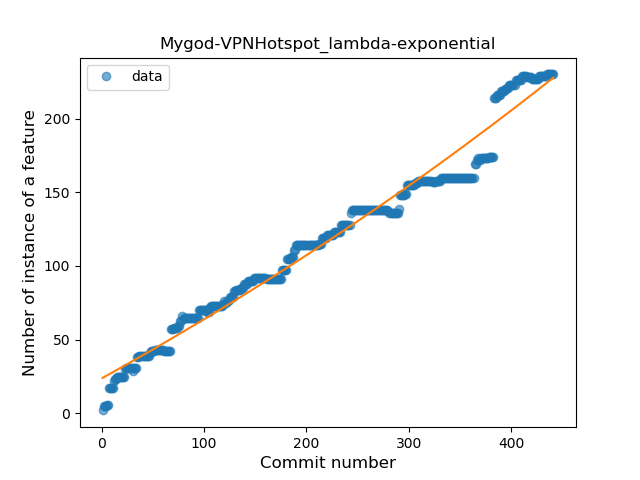
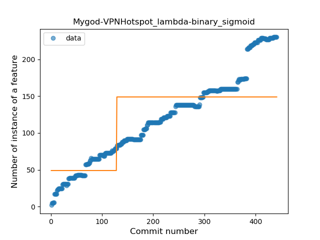
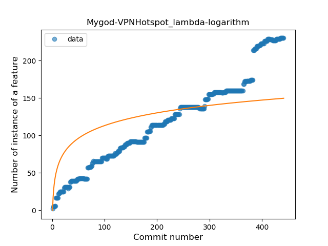
### <a name="safe_call">Safe Call</a>
----
#### Functions
* **Constant Rise - Linear:** 
    * **R_Squared:** 0.94755723
* **Sudden Rise Plateau - Logarithm:** 
    * **R_Squared:** 0.75875073
* **Plateau Gradual Rise - Sigmoid:** 
    * **R_Squared:** 0.3809138

**Plots** :chart_with_upwards_trend:
-----

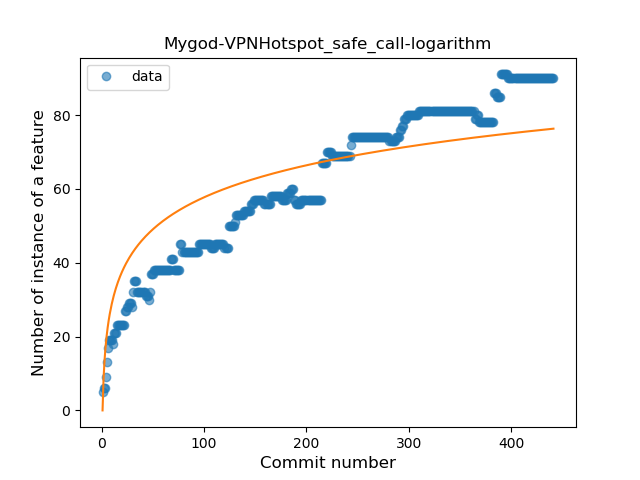
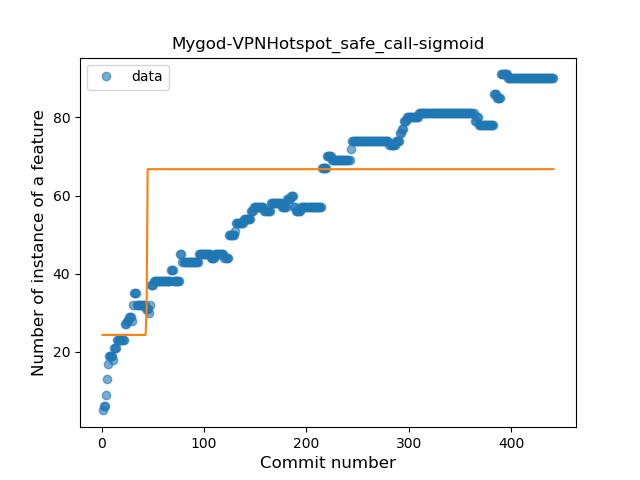
### <a name="when_expr">When expression</a>
----
#### Functions
* **Sudden Rise Plateau - Logarithm:** 
    * **R_Squared:** 0.76211121
* **Constant Rise - Linear:** 
    * **R_Squared:** 0.74760499
* **Plateau Sudden Rise - Binary Sigmoid:** 
    * **R_Squared:** 0.16502659

**Plots** :chart_with_upwards_trend:
-----

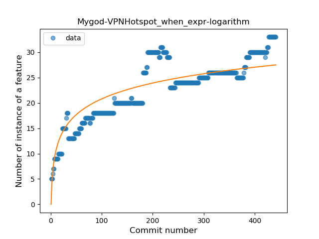
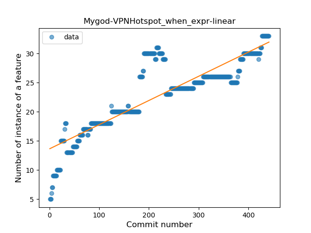
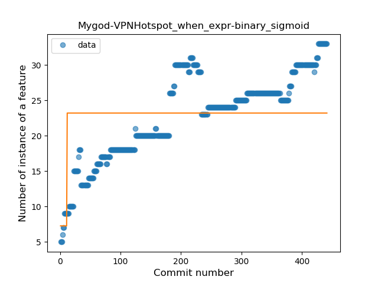
### <a name="companion_object">Companion Object</a>
----
#### Functions
* **Sudden Rise - Exponential:** 
    * **R_Squared:** 0.96996194
* **Constant Rise - Linear:** 
    * **R_Squared:** 0.94259197
* **Sudden Rise Plateau - Logarithm:** 
    * **R_Squared:** 0.43983152

**Plots** :chart_with_upwards_trend:
-----

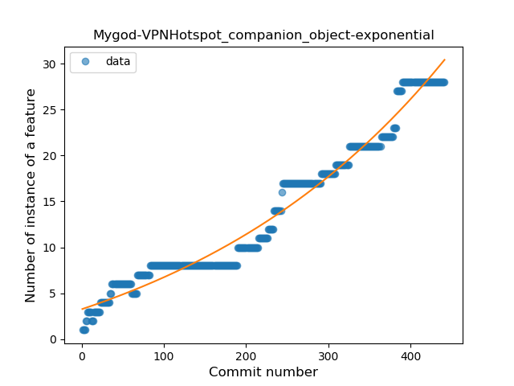
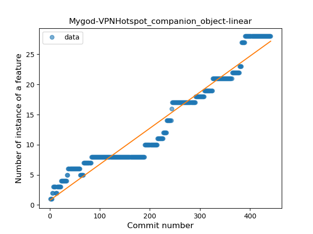
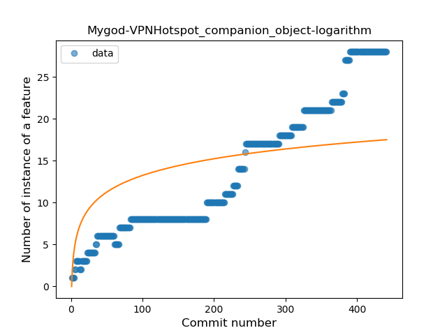
### <a name="unsafe_call">Unsafe Call</a>
----
#### Functions
* **Sudden Rise - Exponential:** 
    * **R_Squared:** 0.74666819
* **Constant Rise - Linear:** 
    * **R_Squared:** 0.36229187
* **Sudden Rise Plateau - Logarithm:** 
    * **R_Squared:** 0.16288023
* **Plateau Sudden Rise - Binary Sigmoid:** 
    * **R_Squared:** 0.02837141

**Plots** :chart_with_upwards_trend:
-----

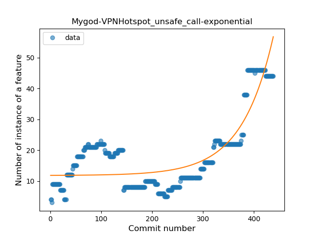
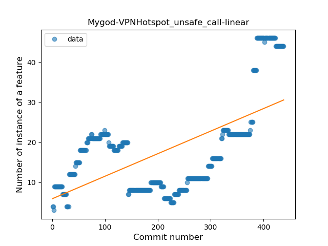
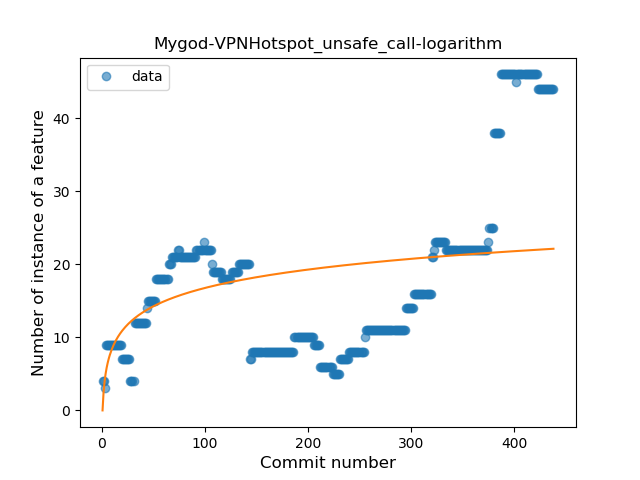
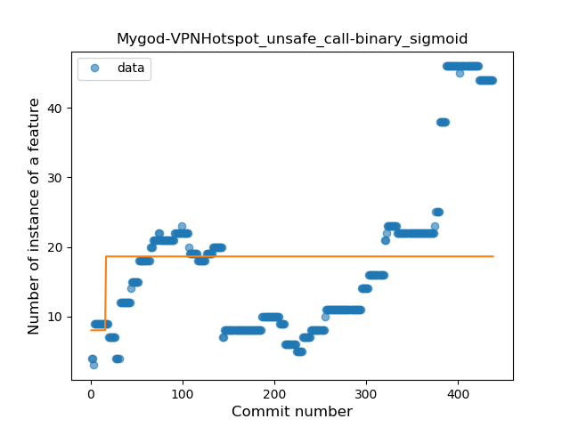
### <a name="string_template">String Template</a>
----
#### Functions
* **Plateau Gradual Rise - Sigmoid:** 
    * **R_Squared:** 0.96886675
* **Constant Rise - Linear:** 
    * **R_Squared:** 0.89405568
* **Sudden Rise Plateau - Logarithm:** 
    * **R_Squared:** 0.60600448

**Plots** :chart_with_upwards_trend:
-----

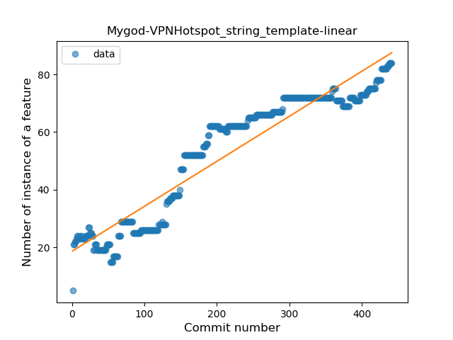
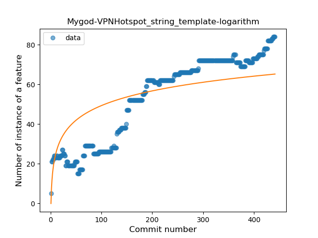
### <a name="func_with_default_value">Function with Default Value</a>
----
#### Functions
* **Plateau Gradual Rise - Sigmoid:** 
    * **R_Squared:** 0.98398252
* **Constant Rise - Linear:** 
    * **R_Squared:** 0.97227289
* **Sudden Rise Plateau - Logarithm:** 
    * **R_Squared:** 0.52818899

**Plots** :chart_with_upwards_trend:
-----

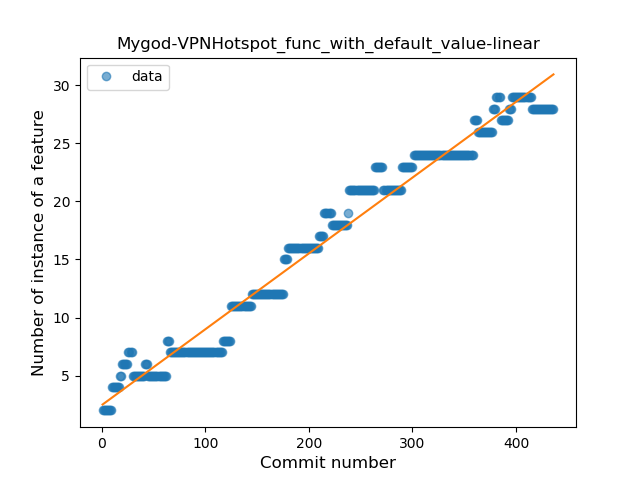
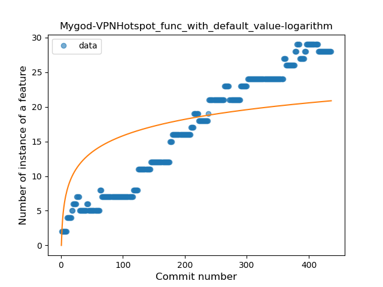
### <a name="singleton">Singleton</a>
----
#### Functions
* **Constant Rise - Linear:** 
    * **R_Squared:** 0.79211093
* **Sudden Rise - Exponential:** 
    * **R_Squared:** 0.7936976
* **Sudden Rise Plateau - Logarithm:** 
    * **R_Squared:** 0.58967568

**Plots** :chart_with_upwards_trend:
-----

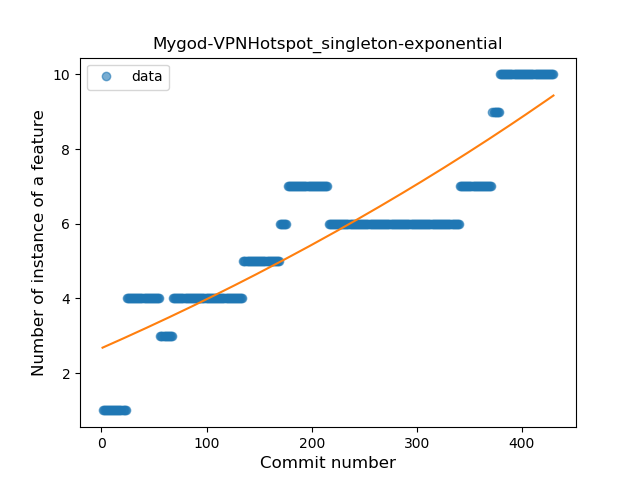
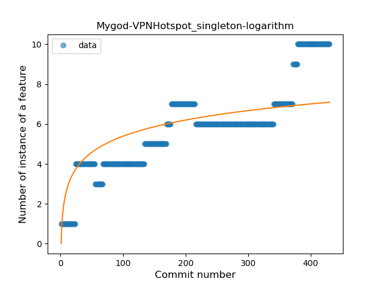
### <a name="smart_cast">Smart Cast</a>
----
#### Functions
* **Plateau Gradual Rise - Sigmoid:** 
    * **R_Squared:** 0.89167157
* **Constant Rise - Linear:** 
    * **R_Squared:** 0.832138
* **Sudden Rise Plateau - Logarithm:** 
    * **R_Squared:** 0.50815144

**Plots** :chart_with_upwards_trend:
-----

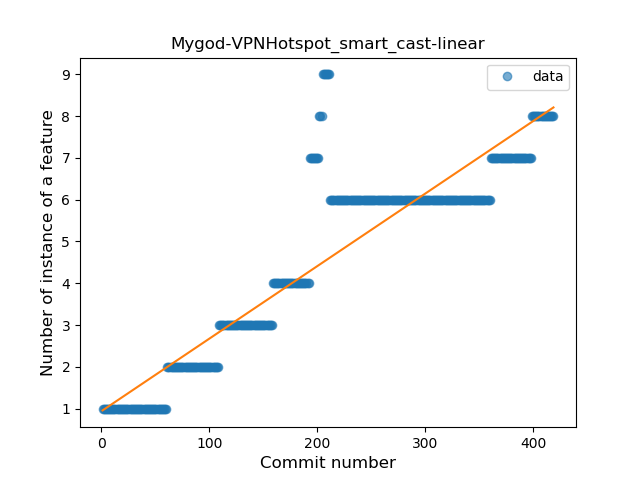

### <a name="range_expr">Range Expression</a>
----
#### Functions
* **Sudden Rise - Exponential:** 
    * **R_Squared:** 0.5966256
* **Constant Rise - Linear:** 
    * **R_Squared:** 0.48647789
* **Sudden Rise Plateau - Logarithm:** 
    * **R_Squared:** 0.29850217
* **Plateau Sudden Rise - Binary Sigmoid:** 
    * **R_Squared:** 0.06937598

**Plots** :chart_with_upwards_trend:
-----

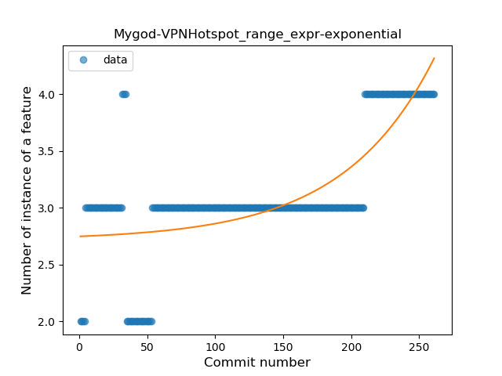
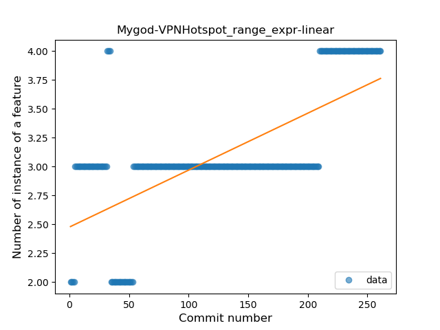
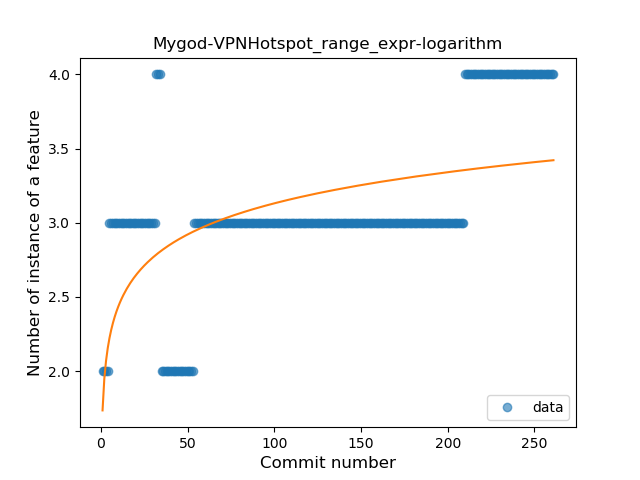
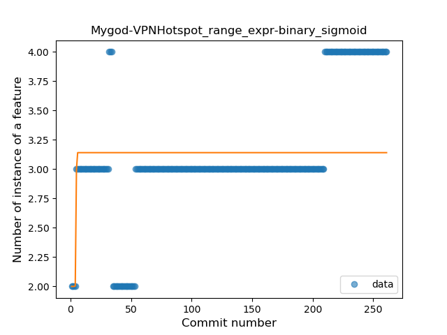
### <a name="func_call_with_named_arg">Function call with Named Argument</a>
----
#### Functions
* **Sudden Rise - Exponential:** 
    * **R_Squared:** 0.33320526
* **Constant Rise - Linear:** 
    * **R_Squared:** 0.0163341
* **Sudden Rise Plateau - Logarithm:** 
    * **R_Squared:** -0.0

**Plots** :chart_with_upwards_trend:
-----

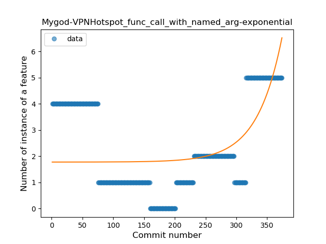
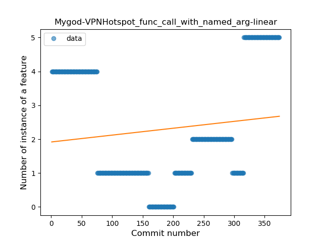
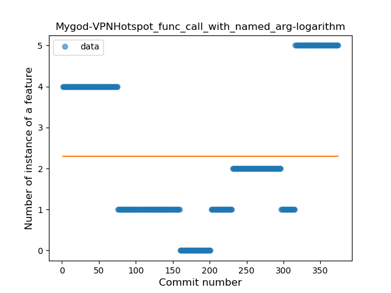
### <a name="data_class">Data Class</a>
----
#### Functions
* **Plateau Gradual Rise - Sigmoid:** 
    * **R_Squared:** 0.9826095
* **Sudden Rise - Exponential:** 
    * **R_Squared:** 0.83549968
* **Constant Rise - Linear:** 
    * **R_Squared:** 0.39984739
* **Sudden Rise Plateau - Logarithm:** 
    * **R_Squared:** 0.13356378

**Plots** :chart_with_upwards_trend:
-----

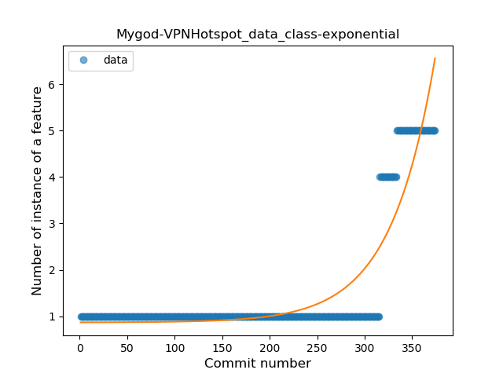
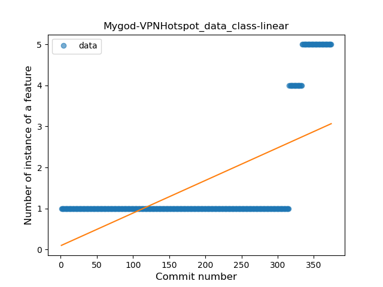
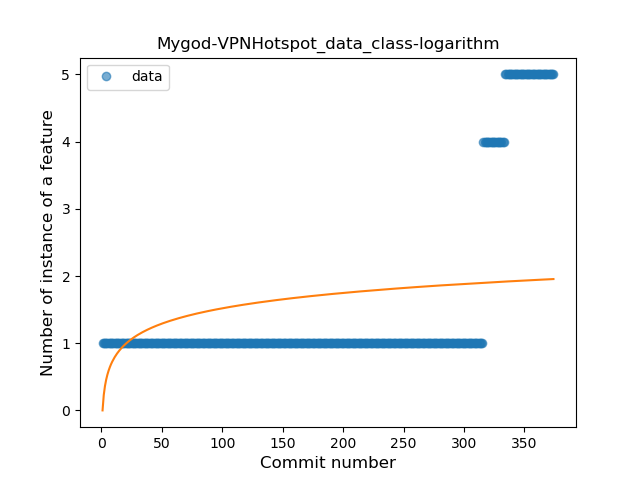
### <a name="extension_function">Extension Function</a>
----
#### Functions
* **Sudden Rise - Exponential:** 
    * **R_Squared:** 0.85347163
* **Constant Rise - Linear:** 
    * **R_Squared:** 0.71683746
* **Sudden Rise Plateau - Logarithm:** 
    * **R_Squared:** 0.25003123

**Plots** :chart_with_upwards_trend:
-----

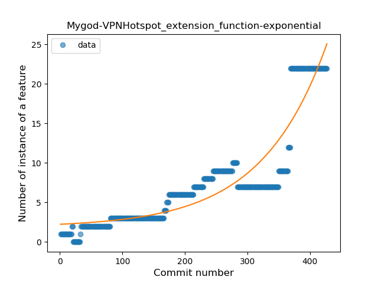
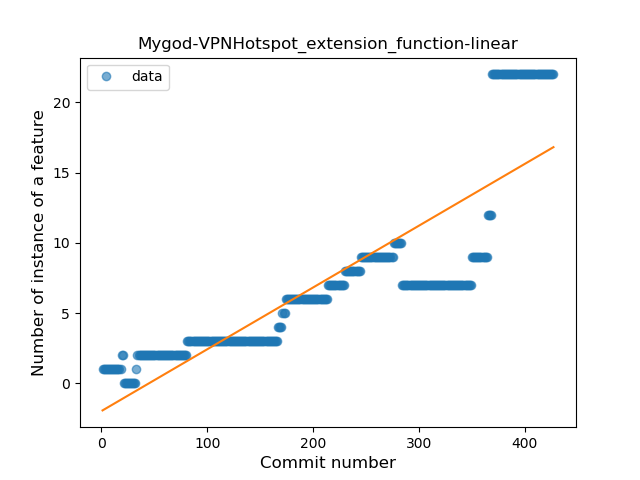
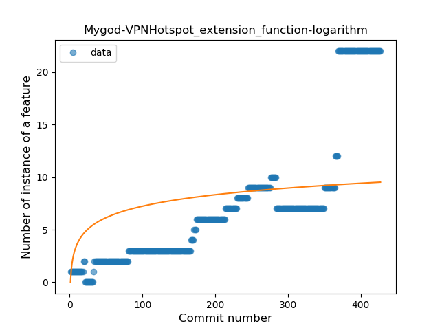
### <a name="property_delegation">Property Delegation</a>
----
#### Functions
* **Plateau Gradual Rise - Sigmoid:** 
    * **R_Squared:** 0.95888117
* **Constant Rise - Linear:** 
    * **R_Squared:** 0.93158731
* **Sudden Rise Plateau - Logarithm:** 
    * **R_Squared:** 0.42400357

**Plots** :chart_with_upwards_trend:
-----

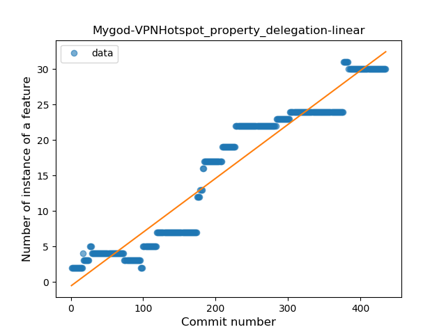
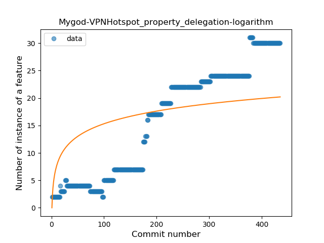
### <a name="destructuring_declaration">Destructuring Declaration</a>
----
#### Functions
* **Sudden Rise - Exponential:** 
    * **R_Squared:** 0.87632815
* **Constant Rise - Linear:** 
    * **R_Squared:** 0.862433
* **Sudden Rise Plateau - Logarithm:** 
    * **R_Squared:** 0.52417736

**Plots** :chart_with_upwards_trend:
-----

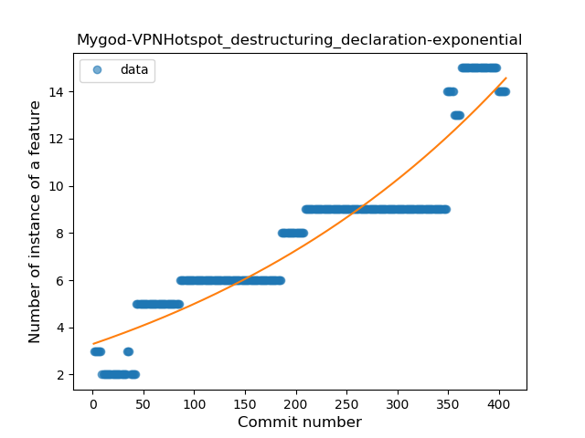
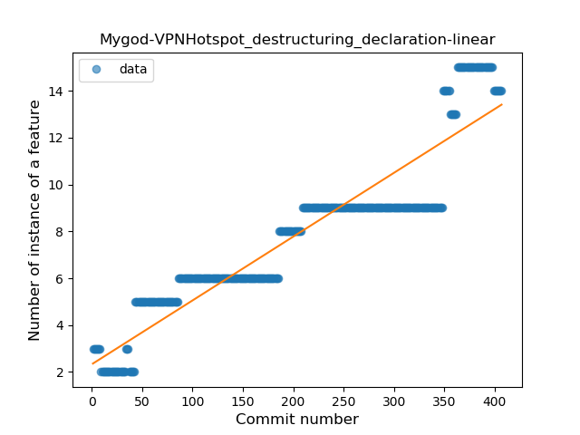

### <a name="inline_func">Inline Function</a>
----
#### Functions
* **Plateau Sudden Decline - Binary Sigmoid:** 
    * **R_Squared:** 1.0
* **Sudden Decline - Exponential:** 
    * **R_Squared:** 0.77629054
* **Constant Decline - Linear:** 
    * **R_Squared:** 0.50310559
* **Sudden Rise Plateau - Logarithm:** 
    * **R_Squared:** -0.0

**Plots** :chart_with_upwards_trend:
-----

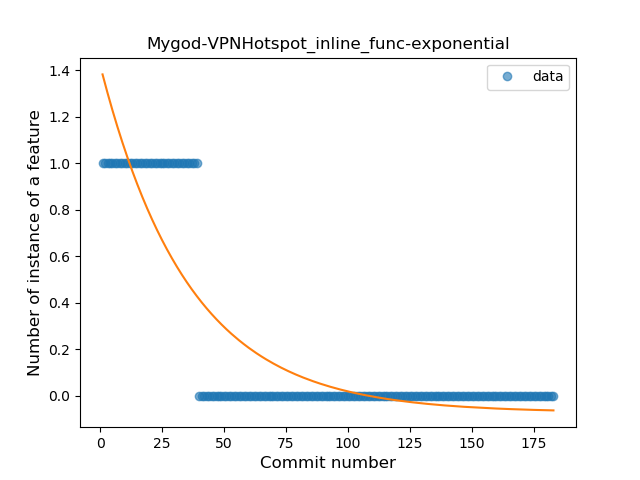
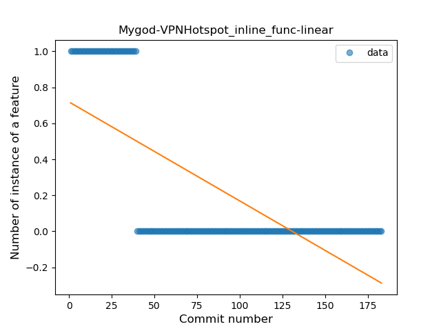
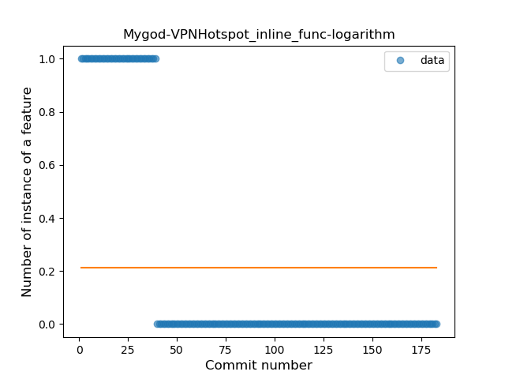
### <a name="overloaded_op">Overloaded Operator</a>
----
#### Functions
* **Plateau Sudden Rise - Binary Sigmoid:** 
    * **R_Squared:** 1.0
* **Sudden Rise - Exponential:** 
    * **R_Squared:** 0.7678604
* **Constant Rise - Linear:** 
    * **R_Squared:** 0.58541485
* **Sudden Rise Plateau - Logarithm:** 
    * **R_Squared:** 0.27964107

**Plots** :chart_with_upwards_trend:
-----

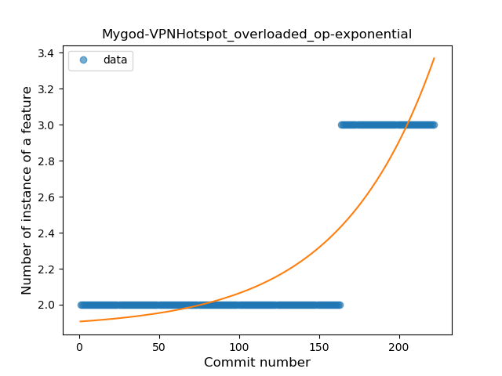
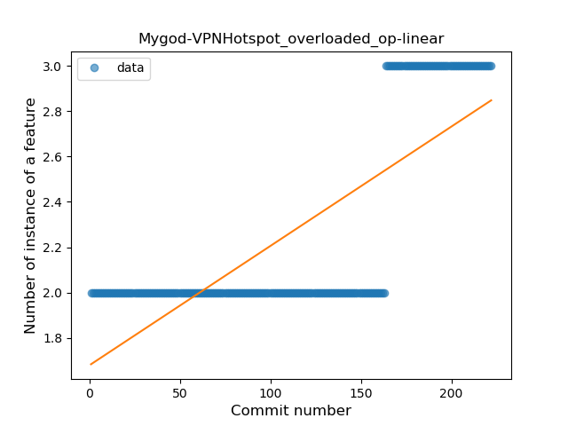
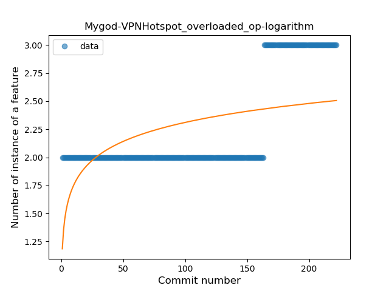
