## NyaaPantsu-NyaaPantsu-android-app
----
#### Metrics provided by Detekt
* Number of lines of code 2822
* Number of Kotlin files: 31
* Cyclomatic complexity: 416
* Cyclomatic complexity by thousands of lines: 283 

----
**14** features analyzed

*	<a href="#type_inference">Type Inference</a> 
*	<a href="#lambda">Lambda</a> 
*	<a href="#safe_call">Safe Call</a> 
*	<a href="#when_expr">When expression</a> 
*	<a href="#companion_object">Companion Object</a> 
*	<a href="#unsafe_call">Unsafe Call</a> 
*	<a href="#string_template">String Template</a> 
*	<a href="#singleton">Singleton</a> 
*	<a href="#smart_cast">Smart Cast</a> 
*	<a href="#range_expr">Range Expression</a> 
*	<a href="#func_call_with_named_arg">Function call with Named Argument</a> 
*	<a href="#data_class">Data Class</a> 
*	<a href="#property_delegation">Property Delegation</a> 
*	<a href="#destructuring_declaration">Destructuring Declaration</a> 

### <a name="type_inference">Type Inference</a>
----
#### Functions
* **Constant Rise - Linear:** 
    * **R_Squared:** 0.70399691
* **Sudden Rise Plateau - Logarithm:** 
    * **R_Squared:** 0.53692772

**Plots** :chart_with_upwards_trend:
-----

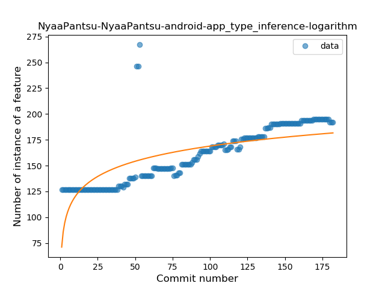
### <a name="lambda">Lambda</a>
----
#### Functions
* **Constant Rise - Linear:** 
    * **R_Squared:** 0.68888818
* **Sudden Rise Plateau - Logarithm:** 
    * **R_Squared:** 0.62559089

**Plots** :chart_with_upwards_trend:
-----

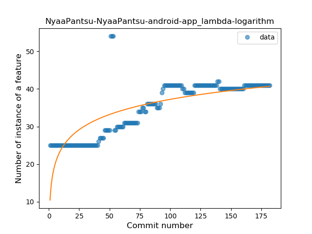
### <a name="safe_call">Safe Call</a>
----
#### Functions
* **Sudden Rise Plateau - Logarithm:** 
    * **R_Squared:** 0.0588925
* **Constant Rise - Linear:** 
    * **R_Squared:** 0.00267931

**Plots** :chart_with_upwards_trend:
-----

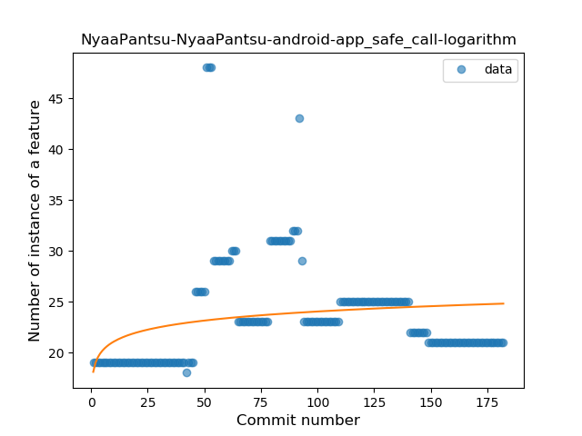
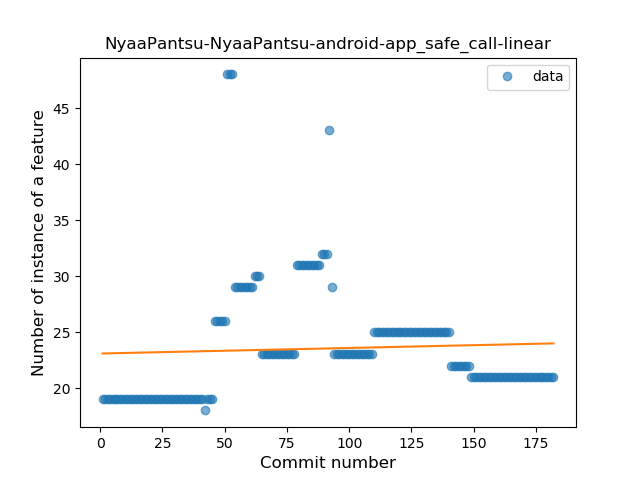
### <a name="when_expr">When expression</a>
----
#### Functions
* **Constant Rise - Linear:** 
    * **R_Squared:** 0.76331307
* **Sudden Rise - Exponential:** 
    * **R_Squared:** 0.76892315
* **Plateau Gradual Rise - Sigmoid:** 
    * **R_Squared:** 0.76910669
* **Sudden Rise Plateau - Logarithm:** 
    * **R_Squared:** 0.55657181

**Plots** :chart_with_upwards_trend:
-----

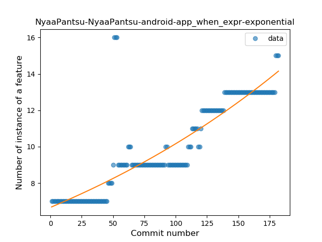
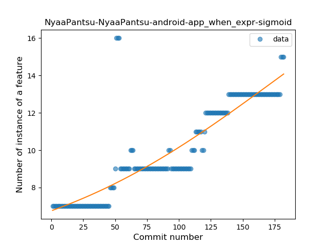
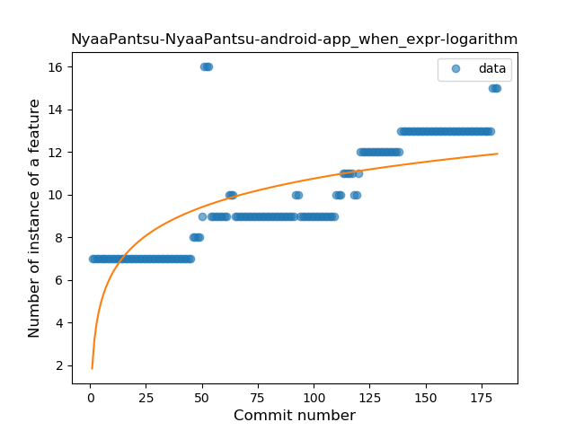
### <a name="companion_object">Companion Object</a>
----
#### Functions
* **Constant Rise - Linear:** 
    * **R_Squared:** 0.91862168
* **Sudden Rise Plateau - Logarithm:** 
    * **R_Squared:** 0.69515241
* **Plateau Sudden Rise - Binary Sigmoid:** 
    * **R_Squared:** 0.37101273

**Plots** :chart_with_upwards_trend:
-----

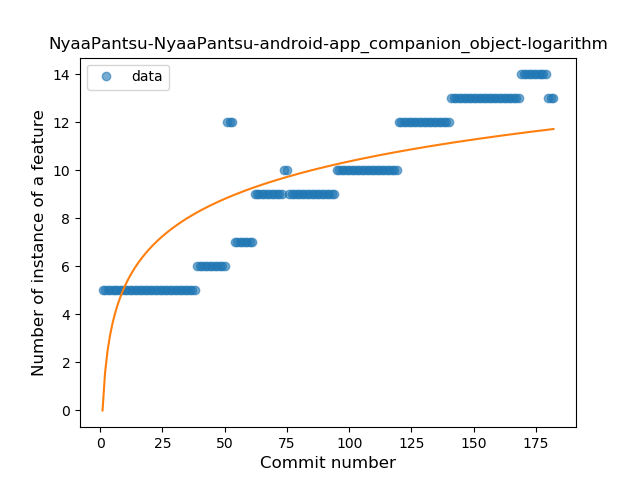
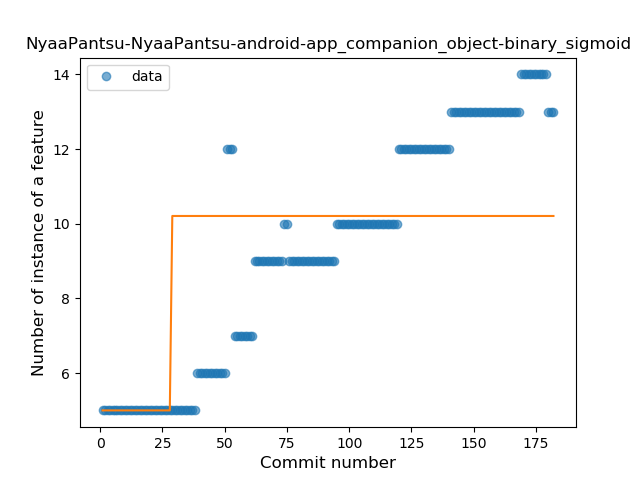
### <a name="unsafe_call">Unsafe Call</a>
----
#### Functions
* **Sudden Rise Plateau - Logarithm:** 
    * **R_Squared:** 0.58352884
* **Constant Rise - Linear:** 
    * **R_Squared:** 0.47759071

**Plots** :chart_with_upwards_trend:
-----

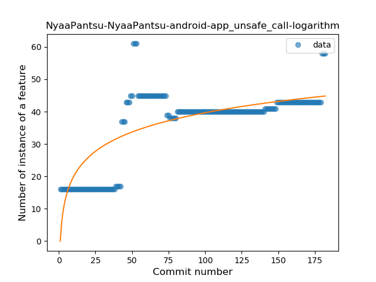
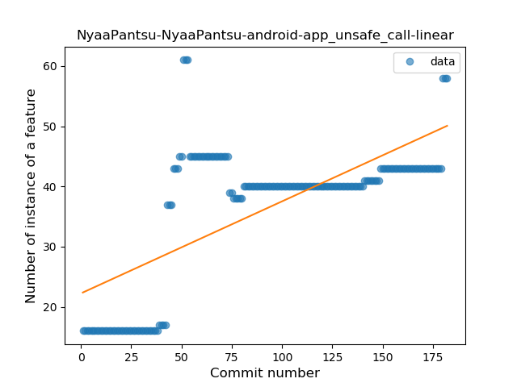
### <a name="string_template">String Template</a>
----
#### Functions
* **Plateau Gradual Rise - Sigmoid:** 
    * **R_Squared:** 0.95641287
* **Sudden Rise - Exponential:** 
    * **R_Squared:** 0.91295854
* **Constant Rise - Linear:** 
    * **R_Squared:** 0.89081707
* **Sudden Rise Plateau - Logarithm:** 
    * **R_Squared:** 0.38528381

**Plots** :chart_with_upwards_trend:
-----

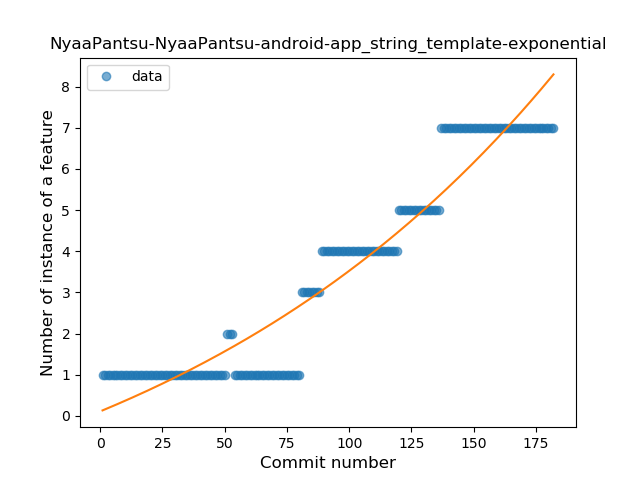
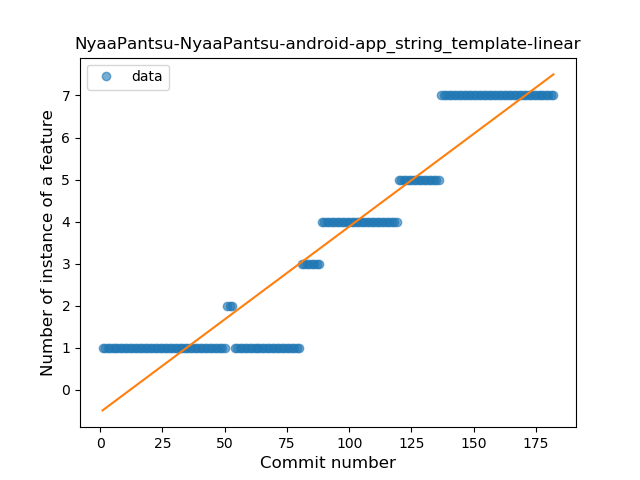
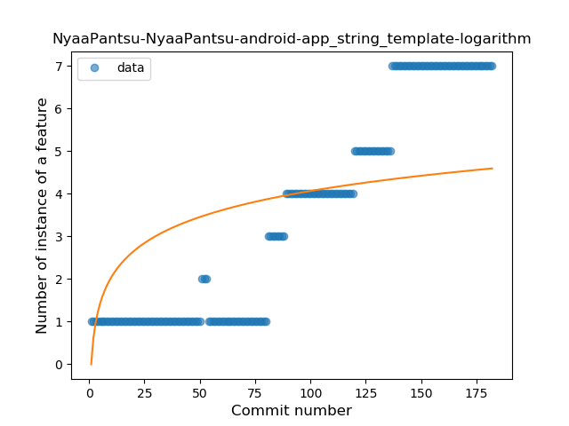
### <a name="singleton">Singleton</a>
----
#### Functions
* **Plateau Gradual Rise - Sigmoid:** 
    * **R_Squared:** 0.96047985
* **Constant Rise - Linear:** 
    * **R_Squared:** 0.90372061
* **Sudden Rise Plateau - Logarithm:** 
    * **R_Squared:** 0.63360372

**Plots** :chart_with_upwards_trend:
-----

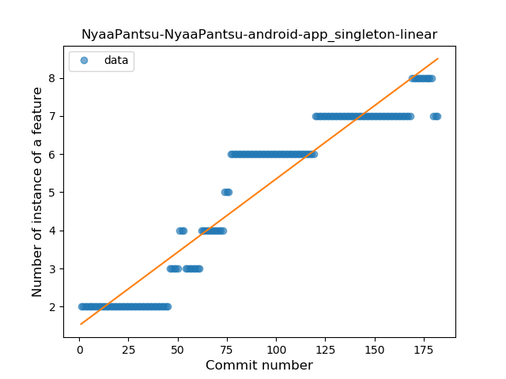
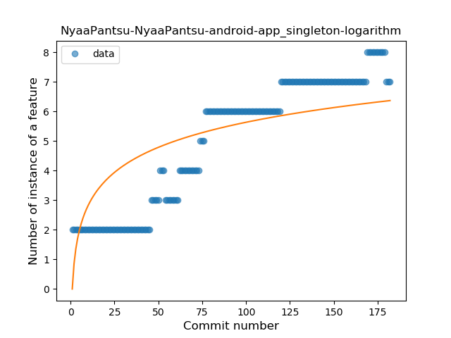
### <a name="smart_cast">Smart Cast</a>
----
#### Functions
* **Constant Rise - Linear:** 
    * **R_Squared:** 0.10524606
* **Sudden Rise - Exponential:** 
    * **R_Squared:** 0.11198285
* **Sudden Rise Plateau - Logarithm:** 
    * **R_Squared:** 0.0795351

**Plots** :chart_with_upwards_trend:
-----

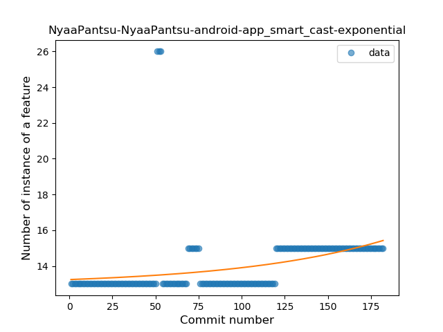
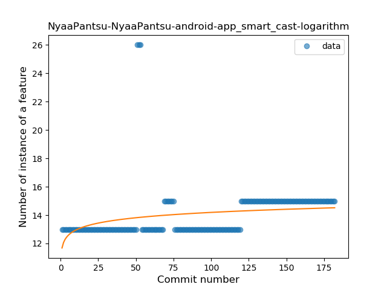
### <a name="range_expr">Range Expression</a>
----
#### Functions
* **Plateau Gradual Rise - Sigmoid:** 
    * **R_Squared:** 0.90165857
* **Constant Rise - Linear:** 
    * **R_Squared:** 0.6860483
* **Sudden Rise Plateau - Logarithm:** 
    * **R_Squared:** 0.52811166

**Plots** :chart_with_upwards_trend:
-----

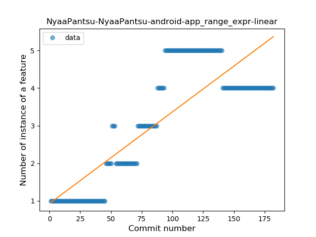
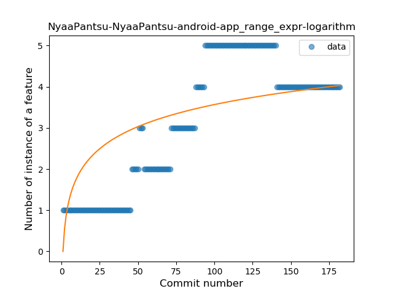
### <a name="func_call_with_named_arg">Function call with Named Argument</a>
----
#### Functions
* **Plateau Gradual Rise - Sigmoid:** 
    * **R_Squared:** 0.85818038
* **Sudden Rise Plateau - Logarithm:** 
    * **R_Squared:** 0.61985059
* **Constant Rise - Linear:** 
    * **R_Squared:** 0.48675998

**Plots** :chart_with_upwards_trend:
-----

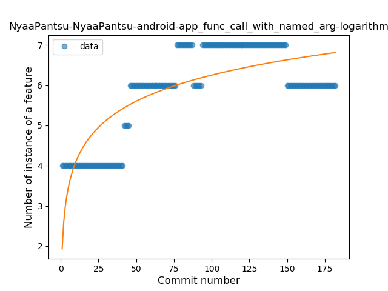
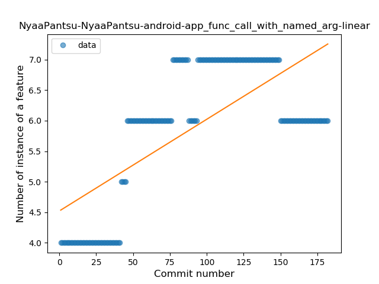
### <a name="data_class">Data Class</a>
----
#### Functions
* **Plateau Sudden Decline - Binary Sigmoid:** 
    * **R_Squared:** 0.88675927
* **Constant Decline - Linear:** 
    * **R_Squared:** 0.26856123
* **Sudden Rise Plateau - Logarithm:** 
    * **R_Squared:** -0.0

**Plots** :chart_with_upwards_trend:
-----

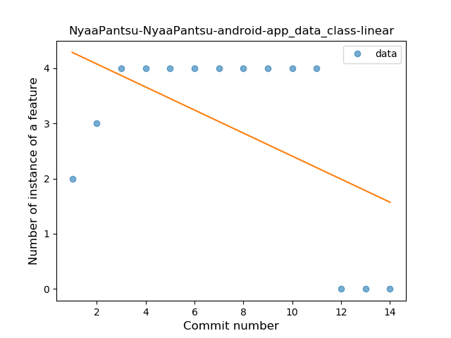
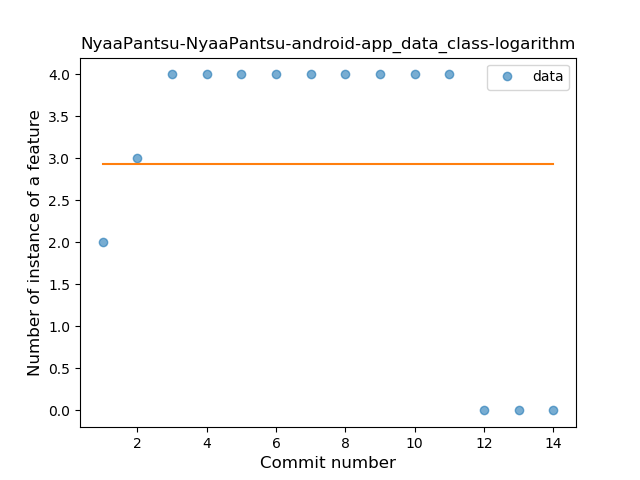
### <a name="property_delegation">Property Delegation</a>
----
#### Functions
* **Plateau Gradual Rise - Sigmoid:** 
    * **R_Squared:** 0.97589659
* **Constant Rise - Linear:** 
    * **R_Squared:** 0.88121761
* **Sudden Rise Plateau - Logarithm:** 
    * **R_Squared:** 0.7328432

**Plots** :chart_with_upwards_trend:
-----

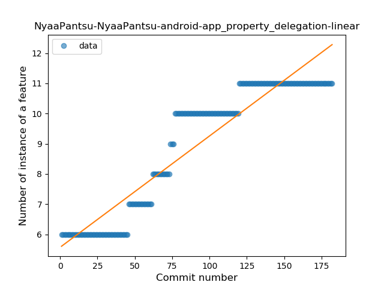
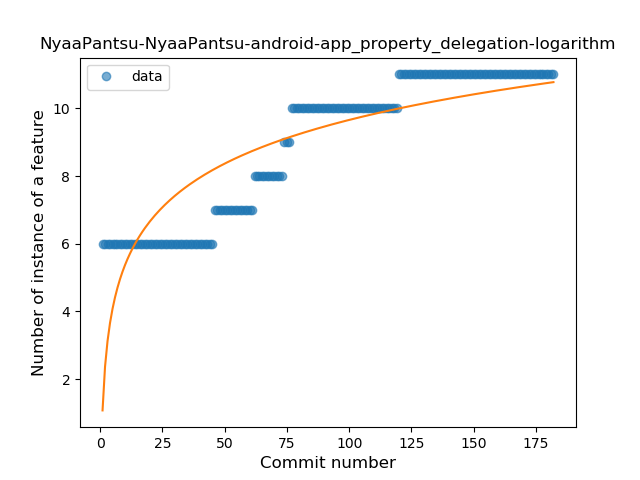
### <a name="destructuring_declaration">Destructuring Declaration</a>
----
#### Functions
* **Plateau Gradual Rise - Sigmoid:** 
    * **R_Squared:** 0.76031075
* **Sudden Rise - Exponential:** 
    * **R_Squared:** 0.66833592
* **Constant Rise - Linear:** 
    * **R_Squared:** 0.64585997
* **Sudden Rise Plateau - Logarithm:** 
    * **R_Squared:** 0.39521819

**Plots** :chart_with_upwards_trend:
-----

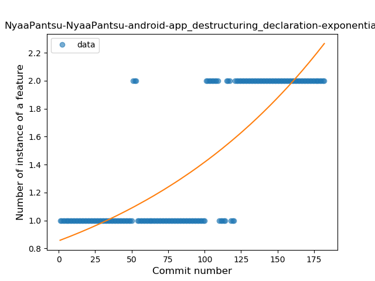
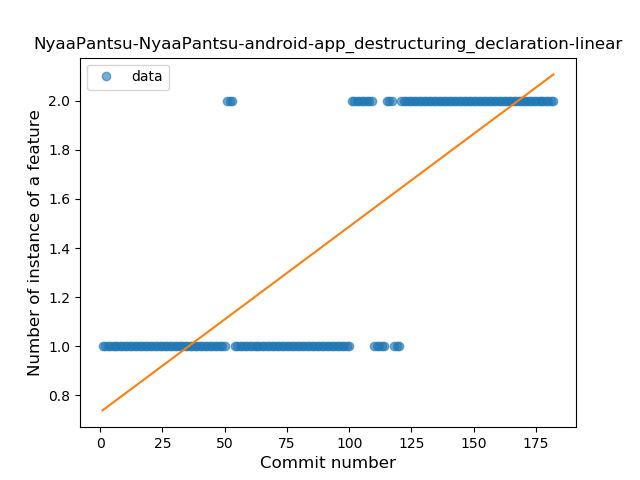
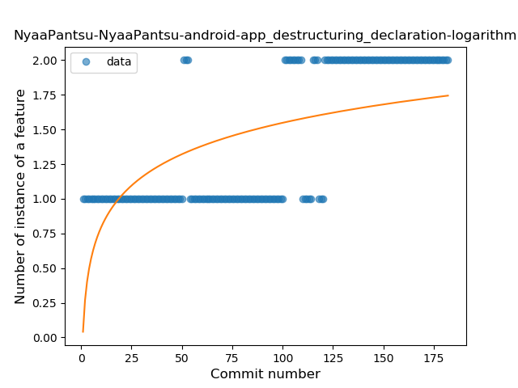
