## OpenLauncherTeam-openlauncher
----
#### Metrics provided by Detekt
* Number of lines of code 0
* Number of Kotlin files: 0
* Cyclomatic complexity: 0
* Cyclomatic complexity by thousands of lines: 0 

----
**13** features analyzed

*	<a href="#type_inference">Type Inference</a> 
*	<a href="#lambda">Lambda</a> 
*	<a href="#safe_call">Safe Call</a> 
*	<a href="#when_expr">When expression</a> 
*	<a href="#companion_object">Companion Object</a> 
*	<a href="#unsafe_call">Unsafe Call</a> 
*	<a href="#func_with_default_value">Function with Default Value</a> 
*	<a href="#singleton">Singleton</a> 
*	<a href="#smart_cast">Smart Cast</a> 
*	<a href="#range_expr">Range Expression</a> 
*	<a href="#data_class">Data Class</a> 
*	<a href="#extension_function">Extension Function</a> 
*	<a href="#destructuring_declaration">Destructuring Declaration</a> 

### <a name="type_inference">Type Inference</a>
----
#### Functions
* **Instability - Polinomial 3:** )
    * **R_Squared:** 0.77372312
* **Constant Decline - Linear:** 
    * **R_Squared:** 0.60575084
* **Sudden Decline - Exponential:** 
    * **R_Squared:** -0.0
* **Sudden Rise Plateau - Logarithm:** 
    * **R_Squared:** -0.0

**Plots** :chart_with_upwards_trend:
-----

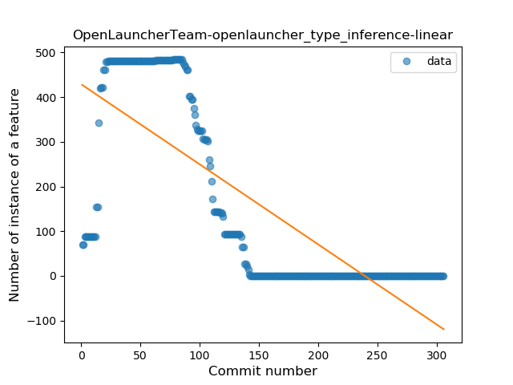

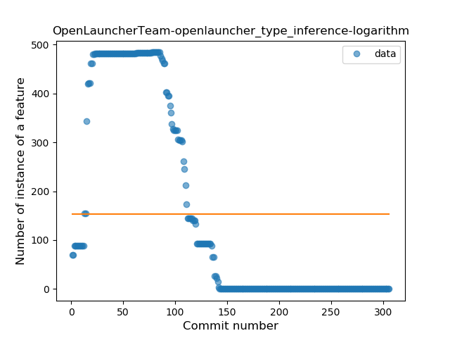
### <a name="lambda">Lambda</a>
----
#### Functions
* **Sudden Decline - Exponential:** 
    * **R_Squared:** 0.63434806
* **Constant Decline - Linear:** 
    * **R_Squared:** 0.61626808
* **Sudden Rise Plateau - Logarithm:** 
    * **R_Squared:** -0.0

**Plots** :chart_with_upwards_trend:
-----

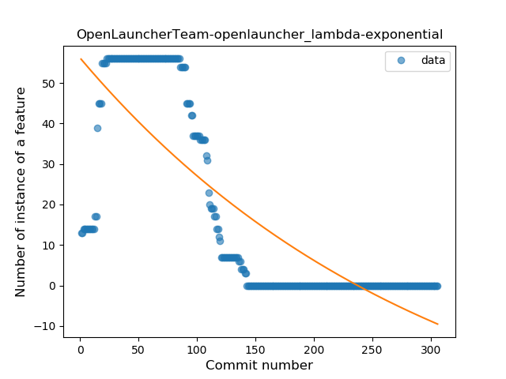
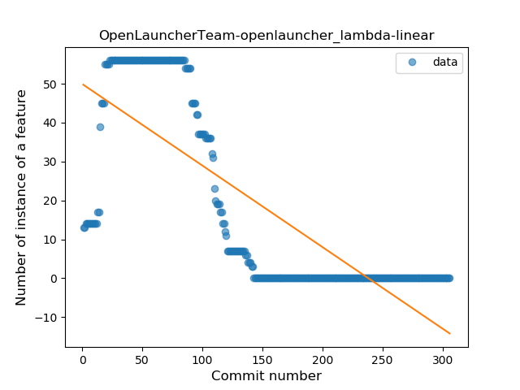
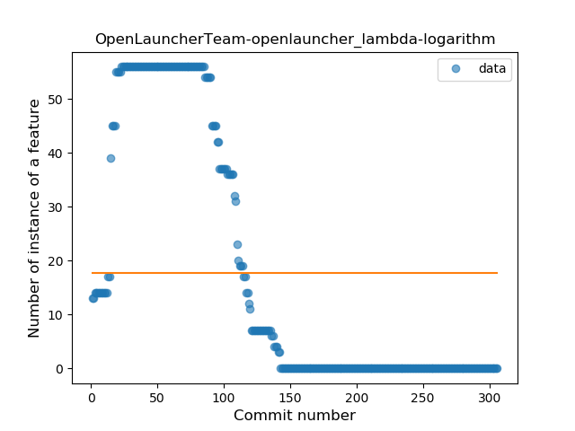
### <a name="safe_call">Safe Call</a>
----
#### Functions
* **Sudden Decline - Exponential:** 
    * **R_Squared:** 0.56872913
* **Constant Decline - Linear:** 
    * **R_Squared:** 0.55729662
* **Plateau Sudden Decline - Binary Sigmoid:** 
    * **R_Squared:** 0.15300289
* **Sudden Rise Plateau - Logarithm:** 
    * **R_Squared:** 0.0

**Plots** :chart_with_upwards_trend:
-----

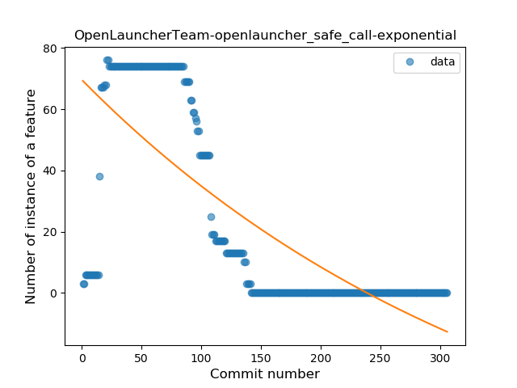
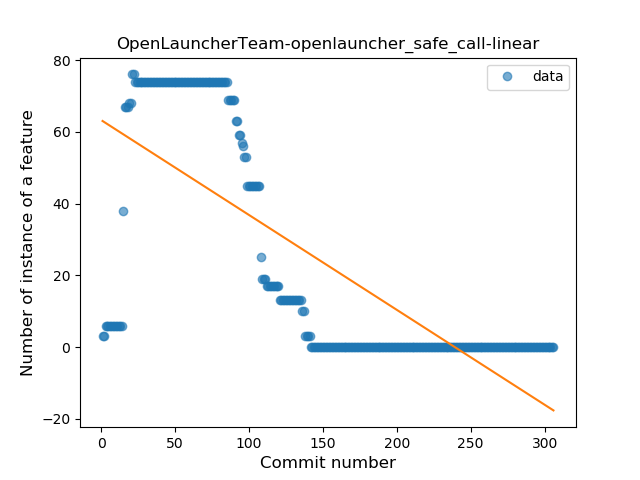
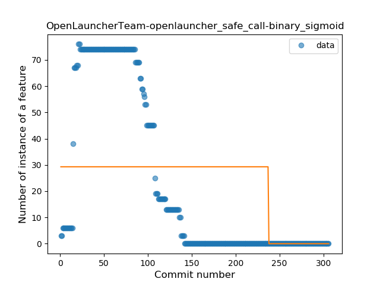
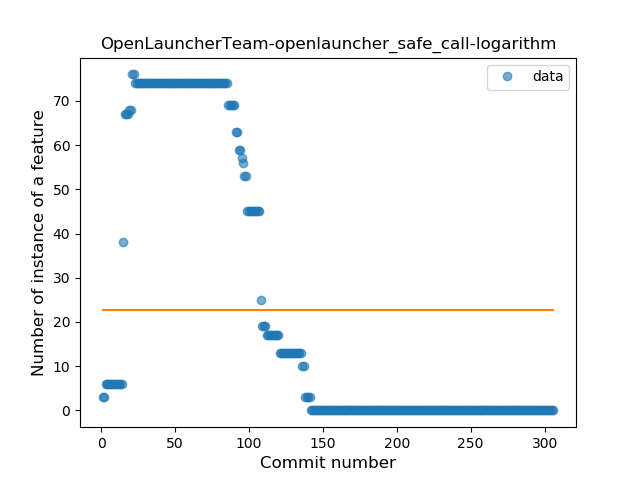
### <a name="when_expr">When expression</a>
----
#### Functions
* **Constant Decline - Linear:** 
    * **R_Squared:** 0.5740776
* **Sudden Decline - Exponential:** 
    * **R_Squared:** 0.57961013
* **Sudden Rise Plateau - Logarithm:** 
    * **R_Squared:** -0.0

**Plots** :chart_with_upwards_trend:
-----

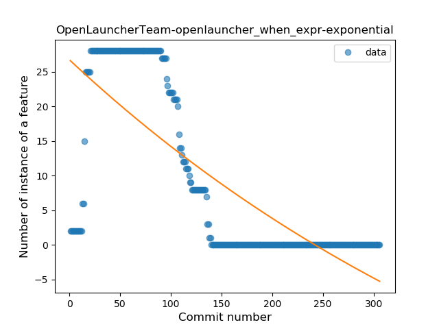
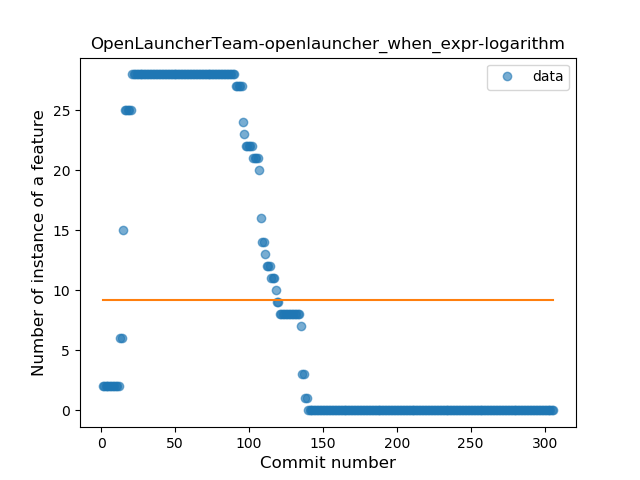
### <a name="companion_object">Companion Object</a>
----
#### Functions
* **Plateau Gradual Decline - Sigmoid:** 
    * **R_Squared:** 0.86951457
* **Constant Decline - Linear:** 
    * **R_Squared:** 0.64414222
* **Sudden Decline - Exponential:** 
    * **R_Squared:** 0.64766827
* **Sudden Rise Plateau - Logarithm:** 
    * **R_Squared:** -0.0

**Plots** :chart_with_upwards_trend:
-----

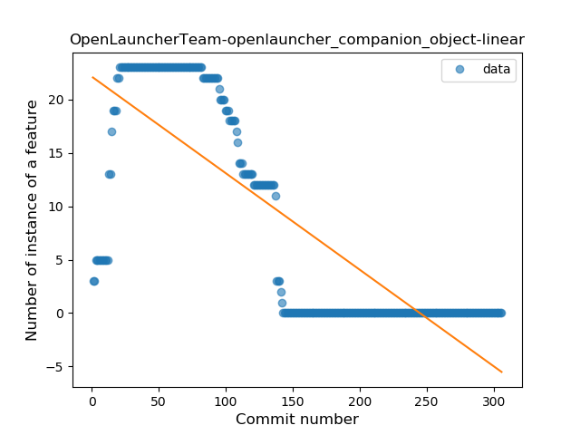
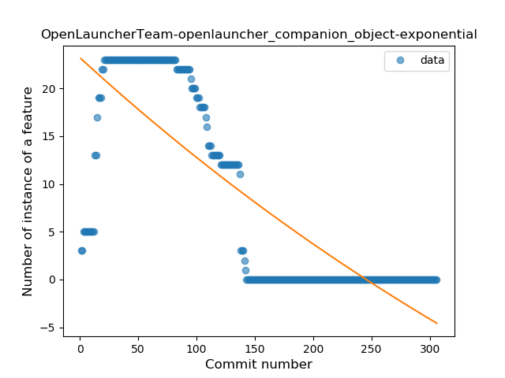

### <a name="unsafe_call">Unsafe Call</a>
----
#### Functions
* **Instability - Polinomial 3:** )
    * **R_Squared:** 0.77184457
* **Constant Decline - Linear:** 
    * **R_Squared:** 0.59998355
* **Sudden Decline - Exponential:** 
    * **R_Squared:** 0.0
* **Sudden Rise Plateau - Logarithm:** 
    * **R_Squared:** -0.0

**Plots** :chart_with_upwards_trend:
-----

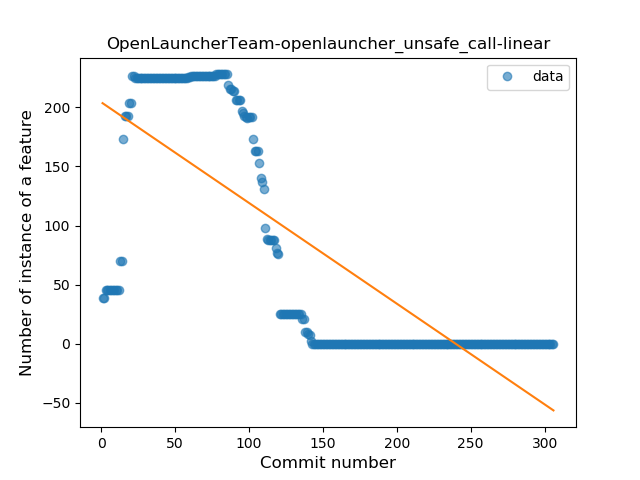
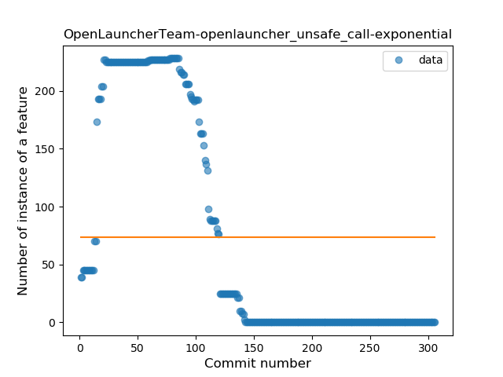
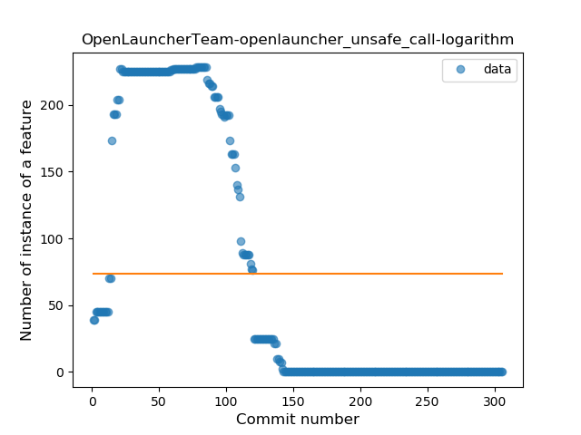
### <a name="func_with_default_value">Function with Default Value</a>
----
#### Functions
* **Constant Decline - Linear:** 
    * **R_Squared:** 0.57918333
* **Sudden Decline - Exponential:** 
    * **R_Squared:** 0.58800581
* **Sudden Rise Plateau - Logarithm:** 
    * **R_Squared:** -0.0
* **Plateau Sudden Rise - Binary Sigmoid:** 
    * **R_Squared:** 0.00682098

**Plots** :chart_with_upwards_trend:
-----

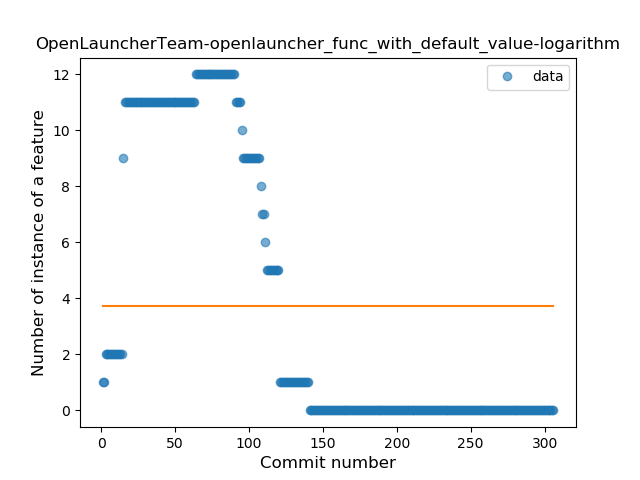
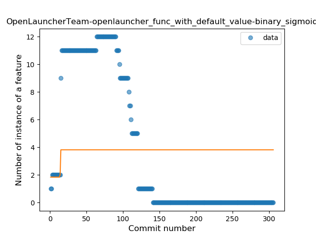
### <a name="singleton">Singleton</a>
----
#### Functions
* **Plateau Gradual Decline - Sigmoid:** 
    * **R_Squared:** 0.86742802
* **Sudden Decline - Exponential:** 
    * **R_Squared:** 0.57497805
* **Constant Decline - Linear:** 
    * **R_Squared:** 0.53993427
* **Sudden Rise Plateau - Logarithm:** 
    * **R_Squared:** -0.0

**Plots** :chart_with_upwards_trend:
-----

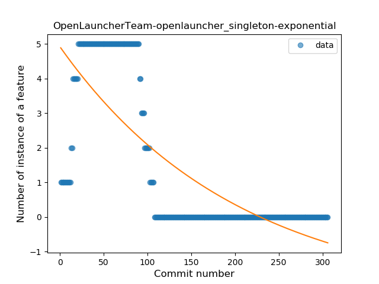
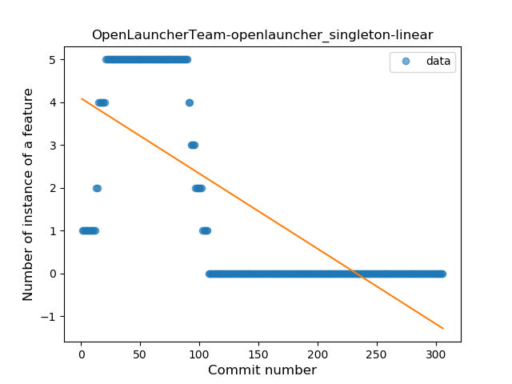
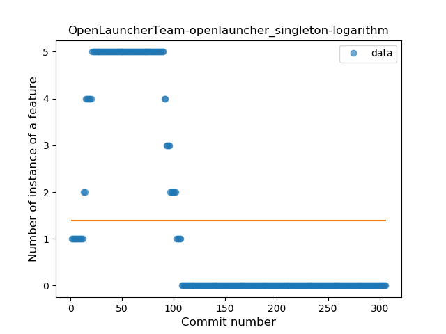
### <a name="smart_cast">Smart Cast</a>
----
#### Functions
* **Plateau Gradual Decline - Sigmoid:** 
    * **R_Squared:** 0.88629466
* **Sudden Decline - Exponential:** 
    * **R_Squared:** 0.66314138
* **Constant Decline - Linear:** 
    * **R_Squared:** 0.64595577
* **Sudden Rise Plateau - Logarithm:** 
    * **R_Squared:** -0.0

**Plots** :chart_with_upwards_trend:
-----

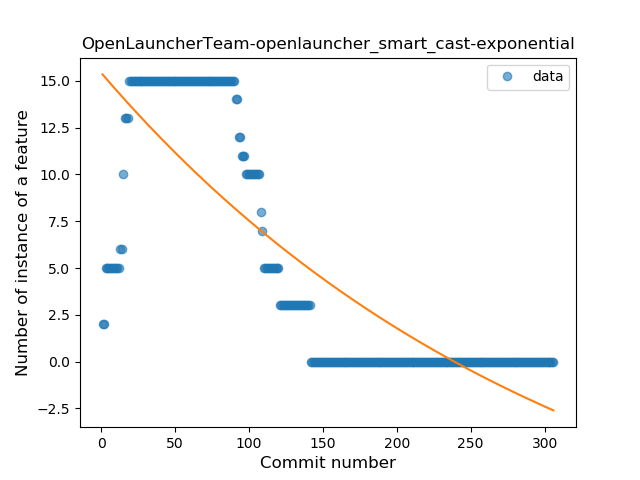
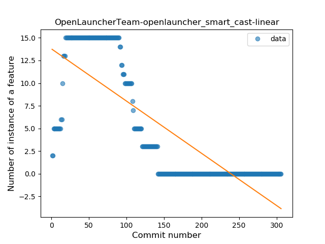
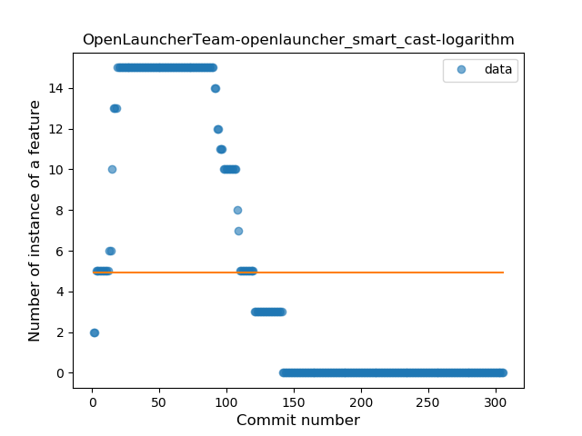
### <a name="range_expr">Range Expression</a>
----
#### Functions
* **Sudden Decline - Exponential:** 
    * **R_Squared:** 0.7025778
* **Constant Decline - Linear:** 
    * **R_Squared:** 0.6572723
* **Sudden Rise Plateau - Logarithm:** 
    * **R_Squared:** -0.0

**Plots** :chart_with_upwards_trend:
-----

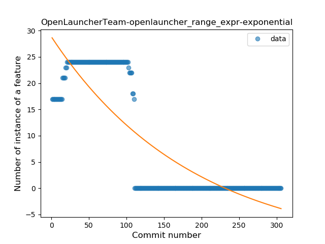
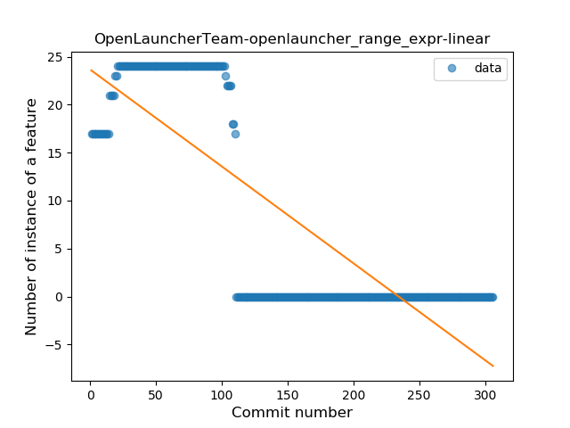
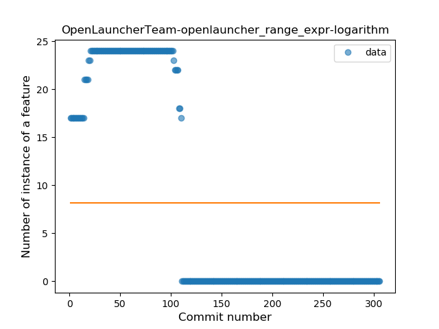
### <a name="data_class">Data Class</a>
----
#### Functions
* **Sudden Decline - Exponential:** 
    * **R_Squared:** 0.75724467
* **Constant Decline - Linear:** 
    * **R_Squared:** 0.59625837
* **Plateau Sudden Decline - Binary Sigmoid:** 
    * **R_Squared:** 0.12169427
* **Sudden Rise Plateau - Logarithm:** 
    * **R_Squared:** -0.0

**Plots** :chart_with_upwards_trend:
-----

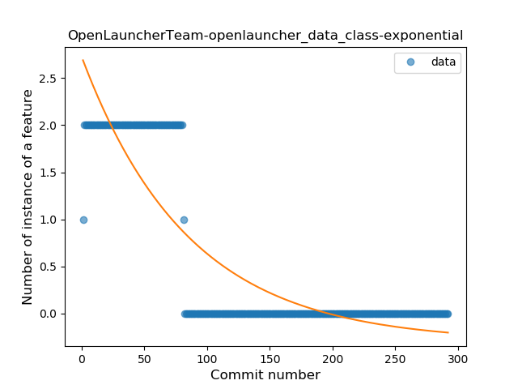
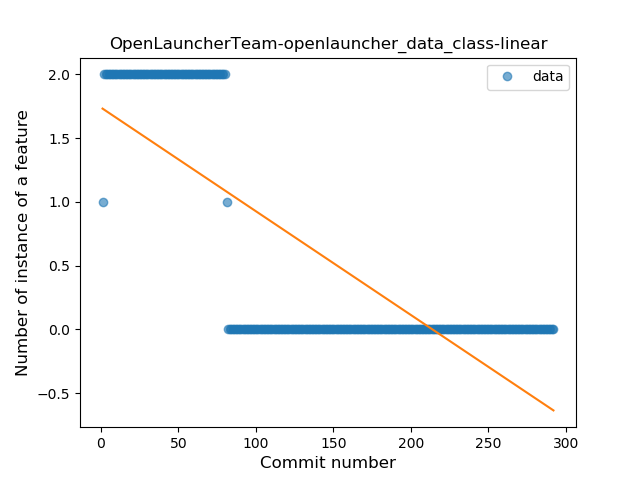
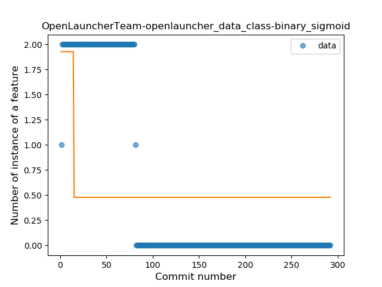
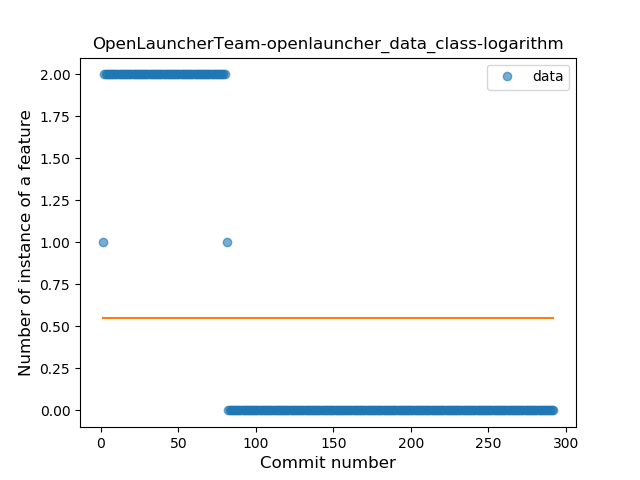
### <a name="extension_function">Extension Function</a>
----
#### Functions
* **Sudden Decline - Exponential:** 
    * **R_Squared:** 0.71079517
* **Plateau Sudden Decline - Binary Sigmoid:** 
    * **R_Squared:** 0.6002714
* **Constant Decline - Linear:** 
    * **R_Squared:** 0.55685598
* **Sudden Rise Plateau - Logarithm:** 
    * **R_Squared:** -0.0

**Plots** :chart_with_upwards_trend:
-----

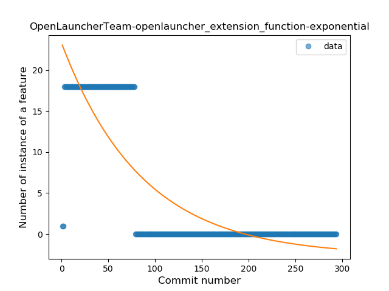
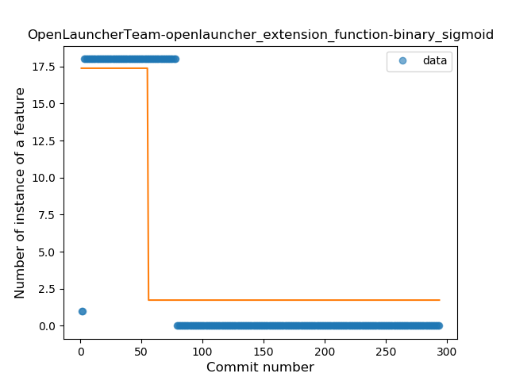
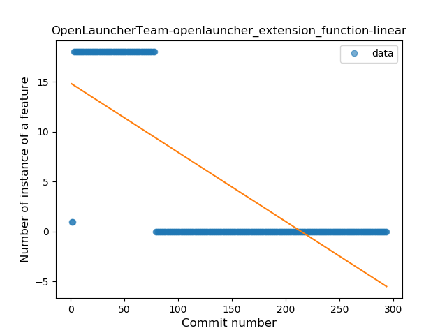
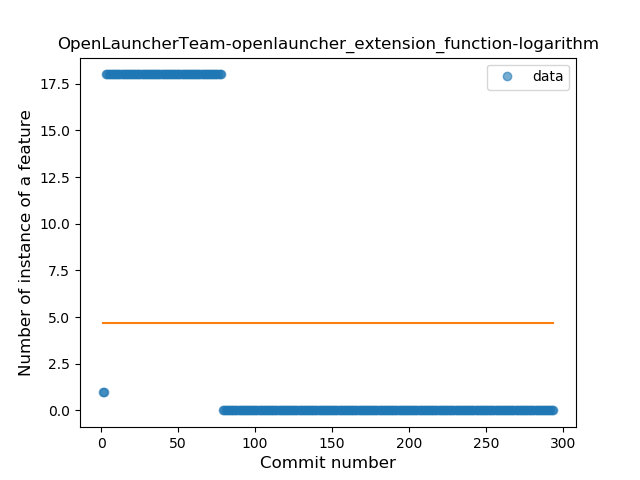
### <a name="destructuring_declaration">Destructuring Declaration</a>
----
#### Functions
* **Plateau Sudden Decline - Binary Sigmoid:** 
    * **R_Squared:** 1.0
* **Sudden Decline - Exponential:** 
    * **R_Squared:** 0.76114978
* **Constant Decline - Linear:** 
    * **R_Squared:** 0.64840915
* **Sudden Rise Plateau - Logarithm:** 
    * **R_Squared:** -0.0

**Plots** :chart_with_upwards_trend:
-----

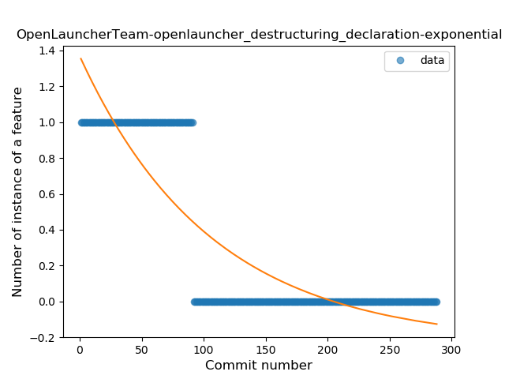

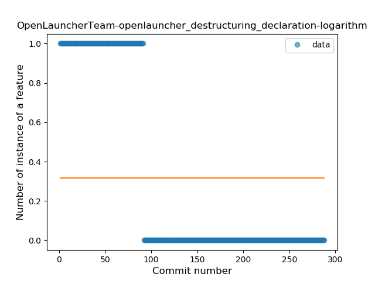
