## PaulWoitaschek-Voice
----
#### Metrics provided by Detekt
* Number of lines of code 16453
* Number of Kotlin files: 232
* Cyclomatic complexity: 1865
* Cyclomatic complexity by thousands of lines: 207 

----
**19** features analyzed

*	<a href="#type_inference">Type Inference</a> 
*	<a href="#lambda">Lambda</a> 
*	<a href="#safe_call">Safe Call</a> 
*	<a href="#when_expr">When expression</a> 
*	<a href="#companion_object">Companion Object</a> 
*	<a href="#unsafe_call">Unsafe Call</a> 
*	<a href="#string_template">String Template</a> 
*	<a href="#func_with_default_value">Function with Default Value</a> 
*	<a href="#singleton">Singleton</a> 
*	<a href="#smart_cast">Smart Cast</a> 
*	<a href="#range_expr">Range Expression</a> 
*	<a href="#func_call_with_named_arg">Function call with Named Argument</a> 
*	<a href="#data_class">Data Class</a> 
*	<a href="#extension_function">Extension Function</a> 
*	<a href="#property_delegation">Property Delegation</a> 
*	<a href="#destructuring_declaration">Destructuring Declaration</a> 
*	<a href="#inline_func">Inline Function</a> 
*	<a href="#overloaded_op">Overloaded Operator</a> 
*	<a href="#super_delegation">Super Delegation</a> 

### <a name="type_inference">Type Inference</a>
----
#### Functions
* **Constant Rise - Linear:** 
    * **R_Squared:** 0.77254057
* **Sudden Rise - Exponential:** 
    * **R_Squared:** 0.7769219
* **Sudden Rise Plateau - Logarithm:** 
    * **R_Squared:** 0.64824802
* **Plateau Sudden Rise - Binary Sigmoid:** 
    * **R_Squared:** 0.15094179

**Plots** :chart_with_upwards_trend:
-----

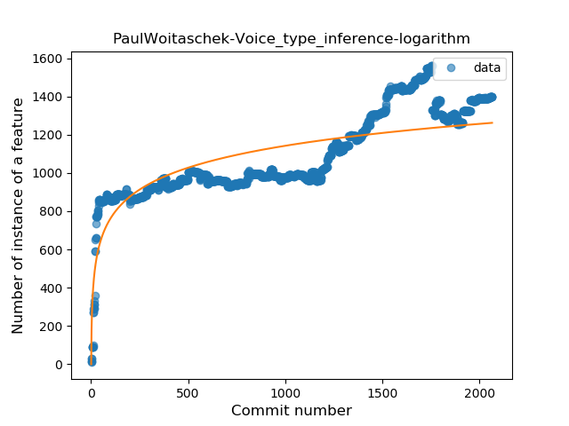
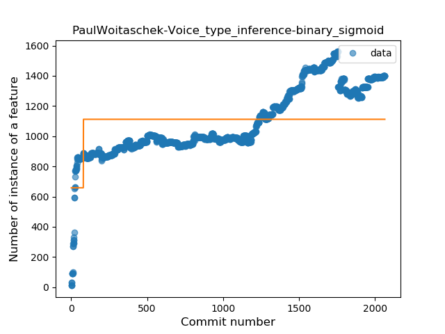
### <a name="lambda">Lambda</a>
----
#### Functions
* **Constant Rise - Linear:** 
    * **R_Squared:** 0.81730878
* **Sudden Rise Plateau - Logarithm:** 
    * **R_Squared:** 0.65898123
* **Plateau Sudden Rise - Binary Sigmoid:** 
    * **R_Squared:** 0.47838636

**Plots** :chart_with_upwards_trend:
-----

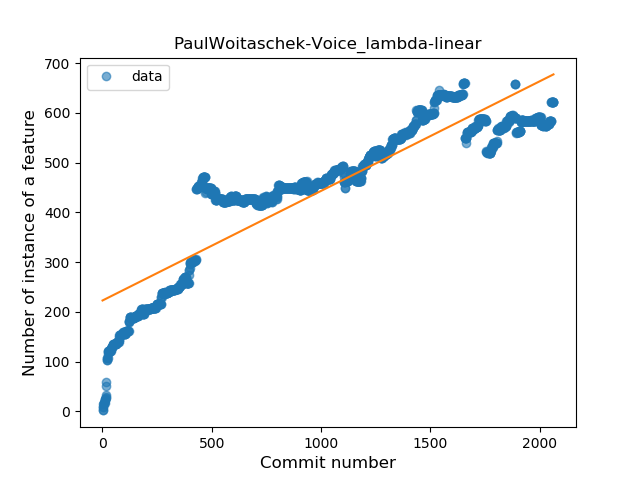

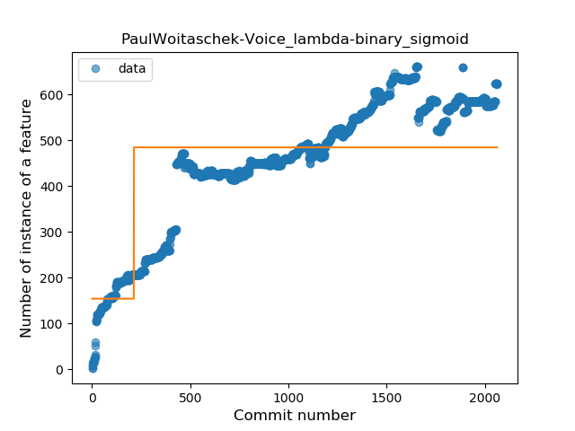
### <a name="safe_call">Safe Call</a>
----
#### Functions
* **Constant Rise - Linear:** 
    * **R_Squared:** 0.93276547
* **Sudden Rise - Exponential:** 
    * **R_Squared:** 0.94024536
* **Sudden Rise Plateau - Logarithm:** 
    * **R_Squared:** 0.41552326
* **Plateau Sudden Rise - Binary Sigmoid:** 
    * **R_Squared:** 0.07368622

**Plots** :chart_with_upwards_trend:
-----

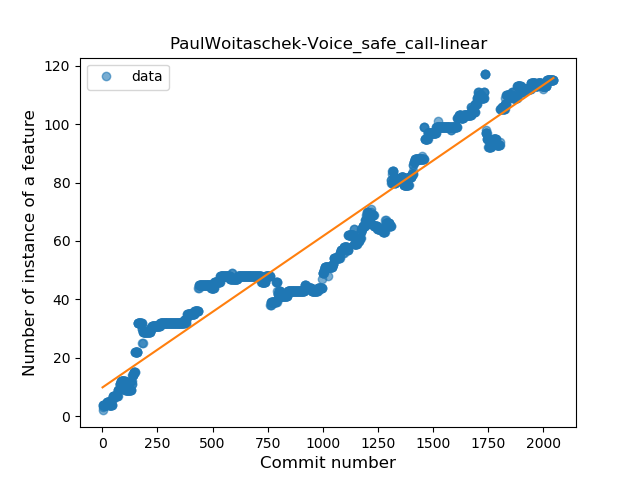
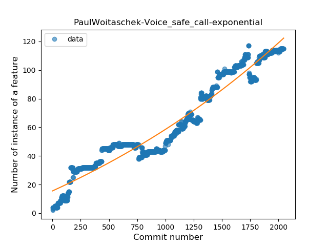
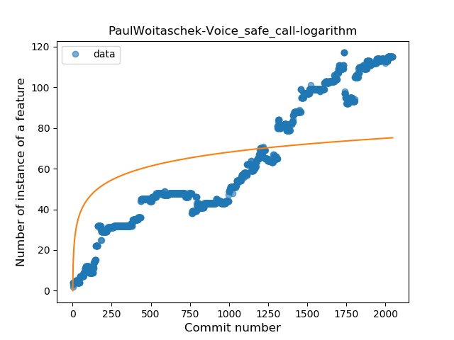
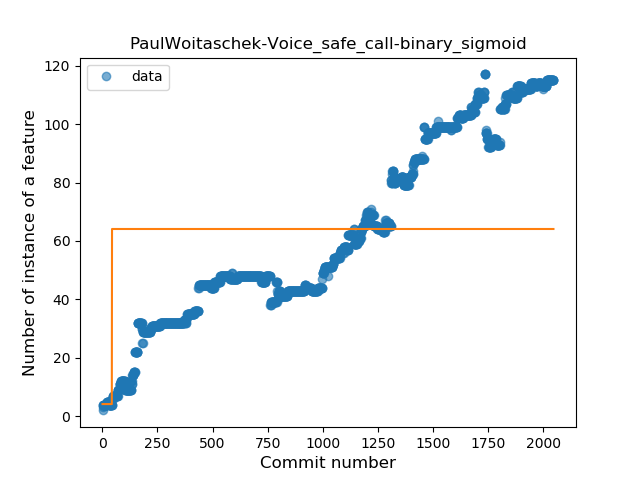
### <a name="when_expr">When expression</a>
----
#### Functions
* **Sudden Rise - Exponential:** 
    * **R_Squared:** 0.61779132
* **Constant Rise - Linear:** 
    * **R_Squared:** 0.56194531
* **Sudden Rise Plateau - Logarithm:** 
    * **R_Squared:** 0.46353669

**Plots** :chart_with_upwards_trend:
-----

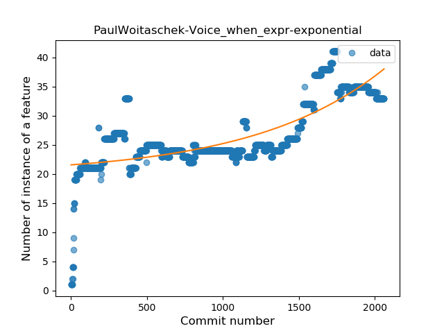
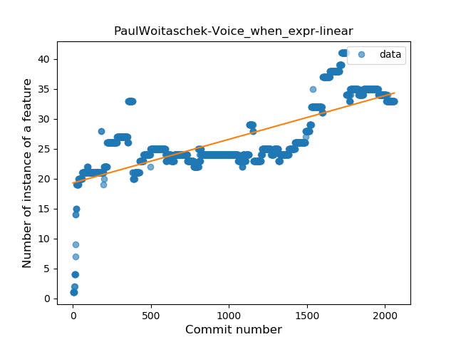
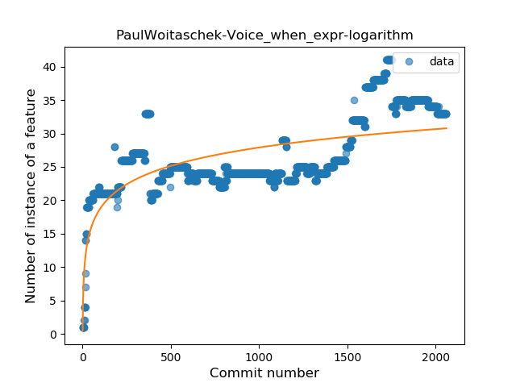
### <a name="companion_object">Companion Object</a>
----
#### Functions
* **Sudden Rise Plateau - Logarithm:** 
    * **R_Squared:** 0.70226634
* **Constant Rise - Linear:** 
    * **R_Squared:** 0.57777814
* **Plateau Sudden Rise - Binary Sigmoid:** 
    * **R_Squared:** 0.27370621

**Plots** :chart_with_upwards_trend:
-----

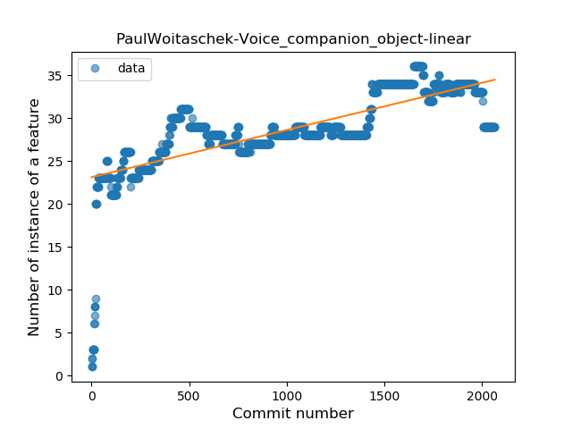

### <a name="unsafe_call">Unsafe Call</a>
----
#### Functions
* **Sudden Decline - Exponential:** 
    * **R_Squared:** 0.10313943
* **Constant Decline - Linear:** 
    * **R_Squared:** 0.00476833
* **Sudden Rise Plateau - Logarithm:** 
    * **R_Squared:** 0.0
* **Plateau Sudden Decline - Binary Sigmoid:** 
    * **R_Squared:** 8.308e-05

**Plots** :chart_with_upwards_trend:
-----

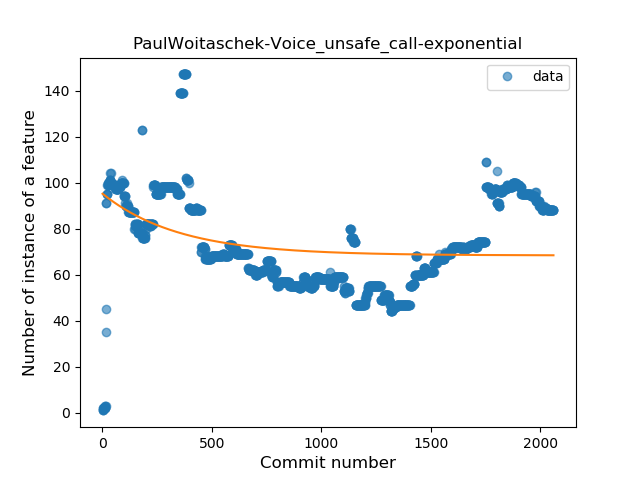

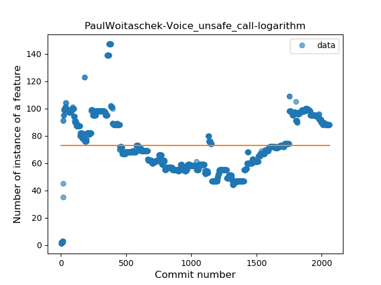
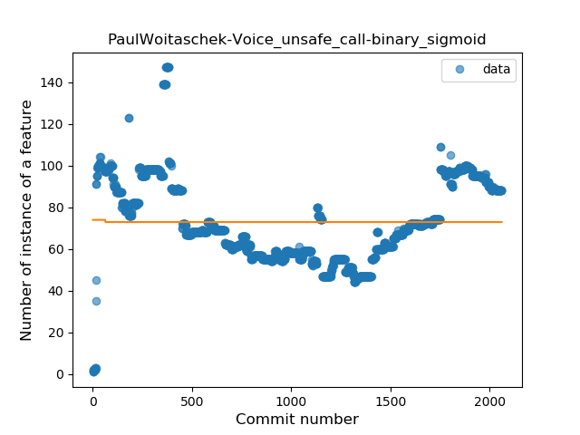
### <a name="string_template">String Template</a>
----
#### Functions
* **Sudden Rise Plateau - Logarithm:** 
    * **R_Squared:** 0.64998604
* **Plateau Sudden Rise - Binary Sigmoid:** 
    * **R_Squared:** 0.38116073
* **Constant Rise - Linear:** 
    * **R_Squared:** 0.34612624

**Plots** :chart_with_upwards_trend:
-----

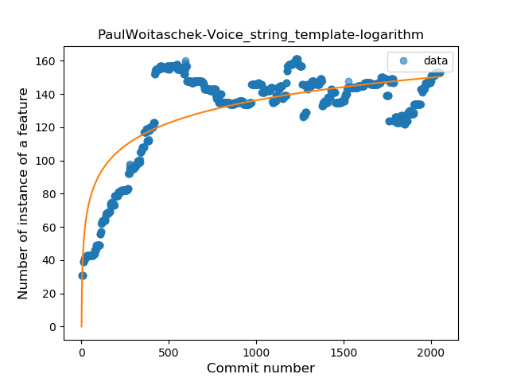
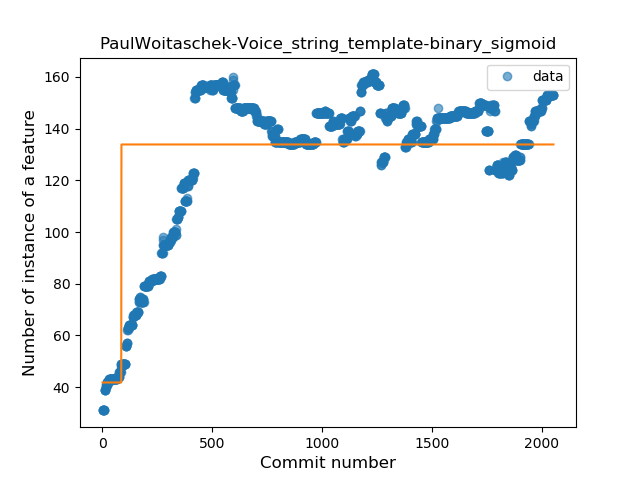
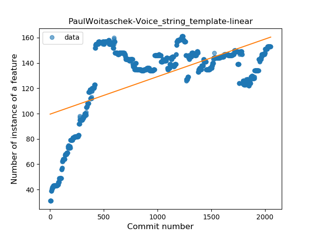
### <a name="func_with_default_value">Function with Default Value</a>
----
#### Functions
* **Sudden Rise - Exponential:** 
    * **R_Squared:** 0.96104751
* **Constant Rise - Linear:** 
    * **R_Squared:** 0.94894161
* **Sudden Rise Plateau - Logarithm:** 
    * **R_Squared:** 0.27766433

**Plots** :chart_with_upwards_trend:
-----

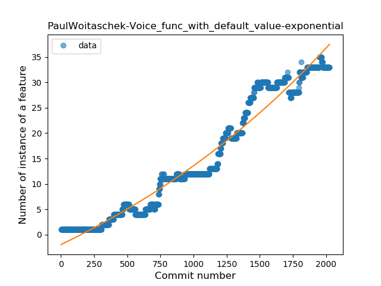
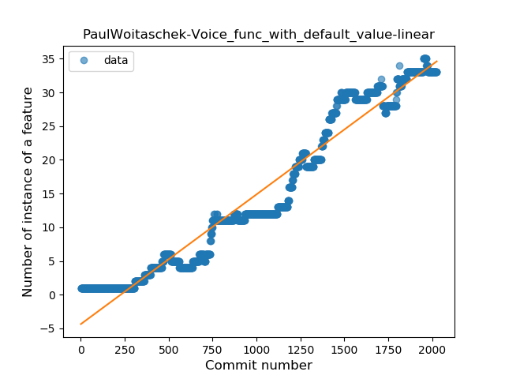
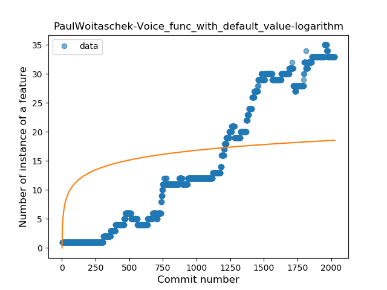
### <a name="singleton">Singleton</a>
----
#### Functions
* **Sudden Rise - Exponential:** 
    * **R_Squared:** 0.92326317
* **Plateau Gradual Rise - Sigmoid:** 
    * **R_Squared:** 0.92431338
* **Constant Rise - Linear:** 
    * **R_Squared:** 0.86927684
* **Sudden Rise Plateau - Logarithm:** 
    * **R_Squared:** 0.32653108

**Plots** :chart_with_upwards_trend:
-----

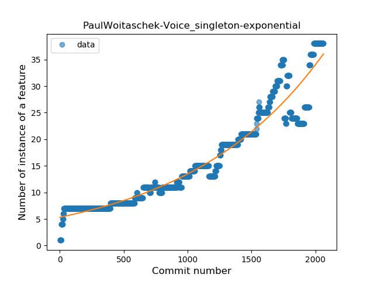

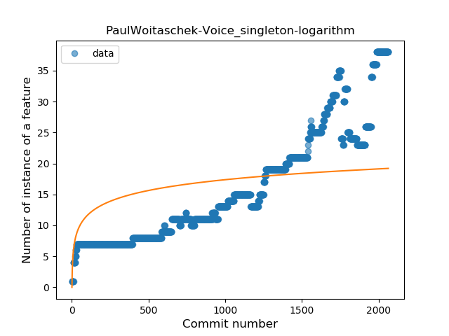
### <a name="smart_cast">Smart Cast</a>
----
#### Functions
* **Plateau Gradual Rise - Sigmoid:** 
    * **R_Squared:** 0.8956549
* **Sudden Rise - Exponential:** 
    * **R_Squared:** 0.79243563
* **Constant Rise - Linear:** 
    * **R_Squared:** 0.38812427
* **Sudden Rise Plateau - Logarithm:** 
    * **R_Squared:** 0.07452393

**Plots** :chart_with_upwards_trend:
-----

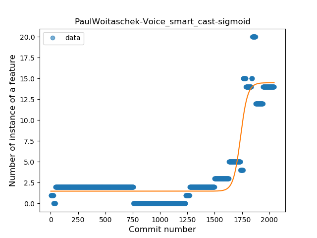
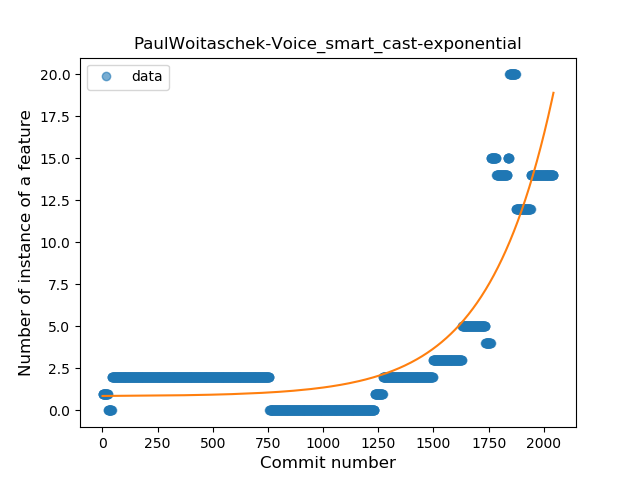
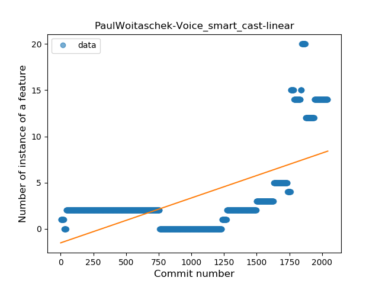
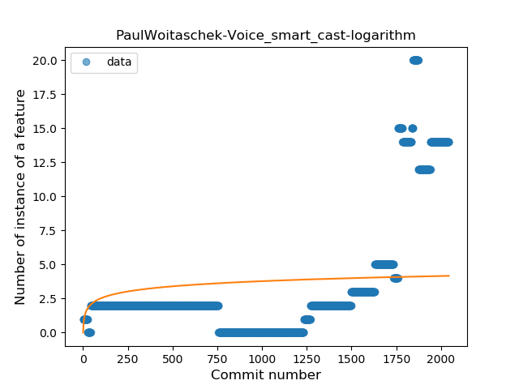
### <a name="range_expr">Range Expression</a>
----
#### Functions
* **Sudden Rise - Exponential:** 
    * **R_Squared:** 0.05813806
* **Constant Rise - Linear:** 
    * **R_Squared:** 0.00108266
* **Sudden Rise Plateau - Logarithm:** 
    * **R_Squared:** 0.0

**Plots** :chart_with_upwards_trend:
-----

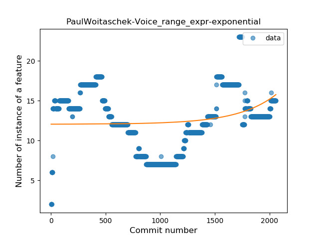
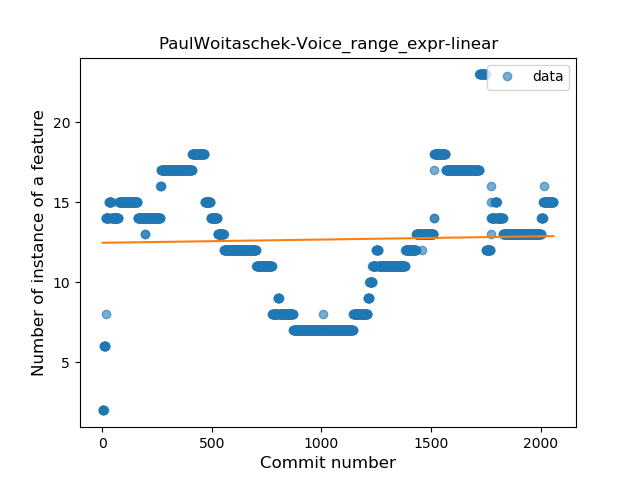
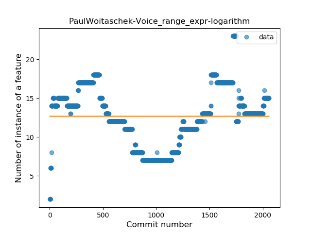
### <a name="func_call_with_named_arg">Function call with Named Argument</a>
----
#### Functions
* **Sudden Rise - Exponential:** 
    * **R_Squared:** 0.9704958
* **Constant Rise - Linear:** 
    * **R_Squared:** 0.79383905
* **Sudden Rise Plateau - Logarithm:** 
    * **R_Squared:** 0.20701581
* **Plateau Sudden Rise - Binary Sigmoid:** 
    * **R_Squared:** 0.01507844

**Plots** :chart_with_upwards_trend:
-----

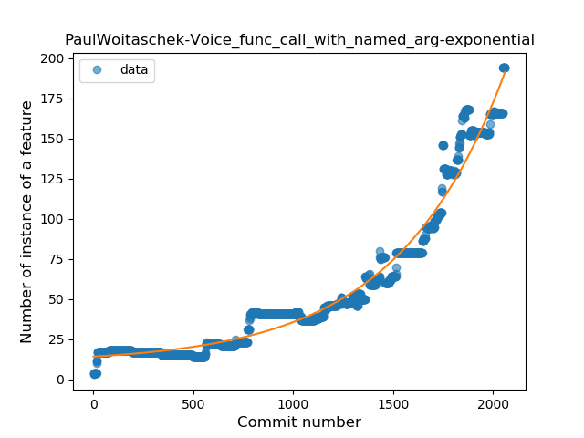
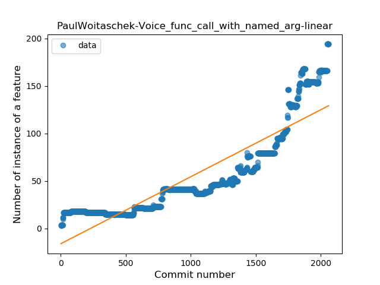
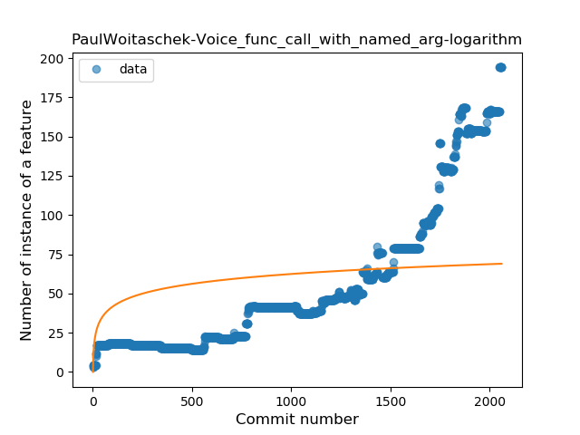
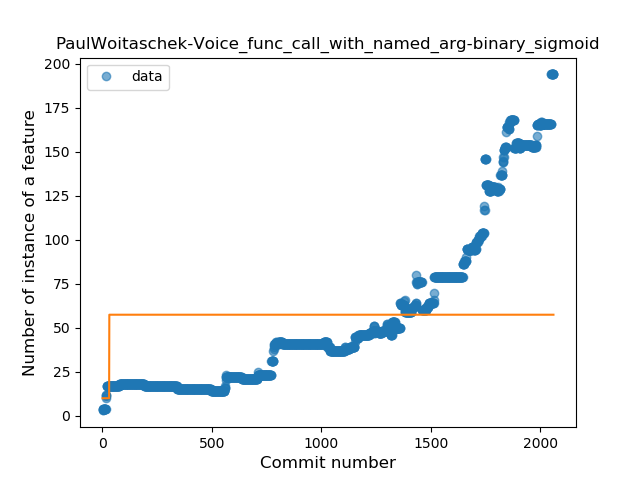
### <a name="data_class">Data Class</a>
----
#### Functions
* **Sudden Rise - Exponential:** 
    * **R_Squared:** 0.90993817
* **Constant Rise - Linear:** 
    * **R_Squared:** 0.8747908
* **Sudden Rise Plateau - Logarithm:** 
    * **R_Squared:** 0.33281041

**Plots** :chart_with_upwards_trend:
-----

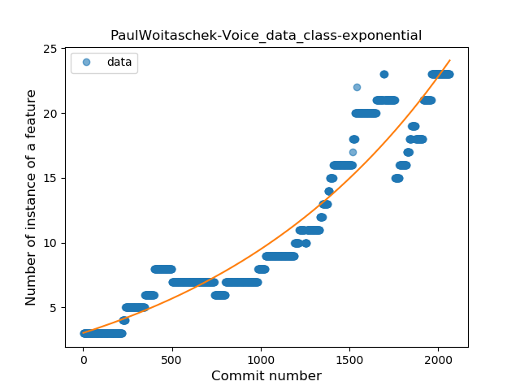
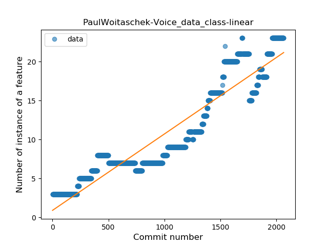
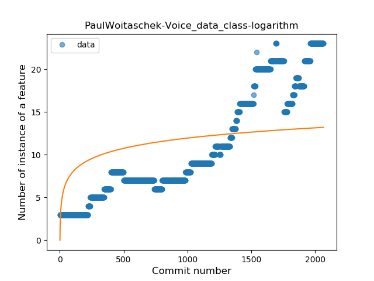
### <a name="extension_function">Extension Function</a>
----
#### Functions
* **Constant Rise - Linear:** 
    * **R_Squared:** 0.75717823
* **Sudden Rise Plateau - Logarithm:** 
    * **R_Squared:** 0.51708981
* **Plateau Sudden Rise - Binary Sigmoid:** 
    * **R_Squared:** 0.11582095

**Plots** :chart_with_upwards_trend:
-----

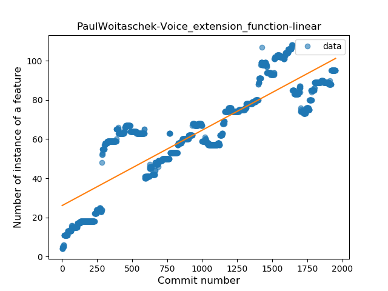
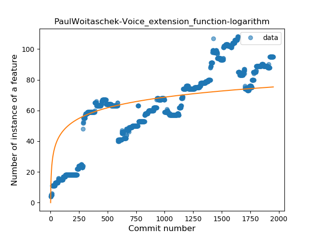
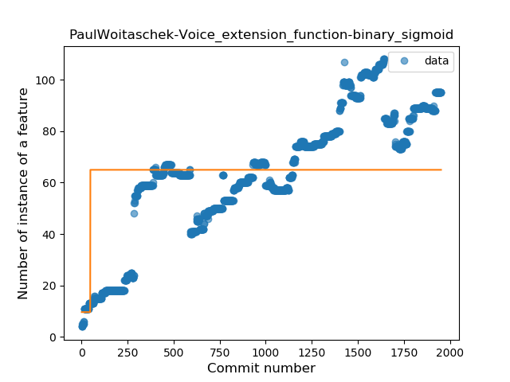
### <a name="property_delegation">Property Delegation</a>
----
#### Functions
* **Sudden Rise - Exponential:** 
    * **R_Squared:** 0.08954954
* **Sudden Rise Plateau - Logarithm:** 
    * **R_Squared:** 0.06386375
* **Constant Rise - Linear:** 
    * **R_Squared:** 0.0391284

**Plots** :chart_with_upwards_trend:
-----

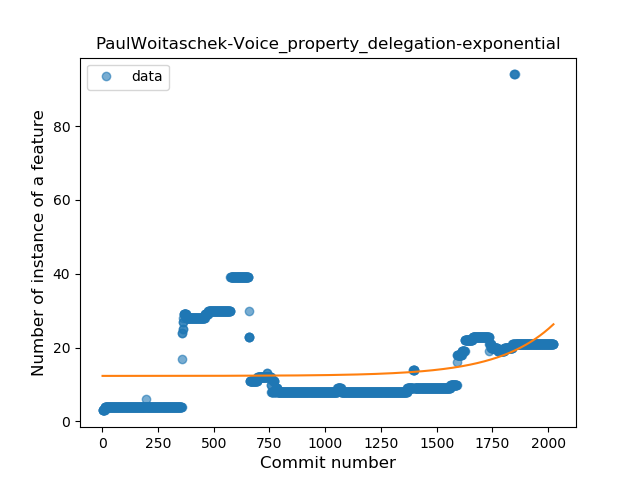
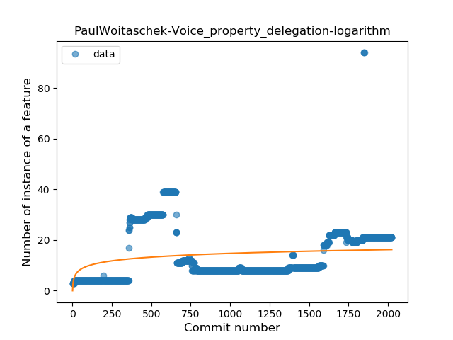
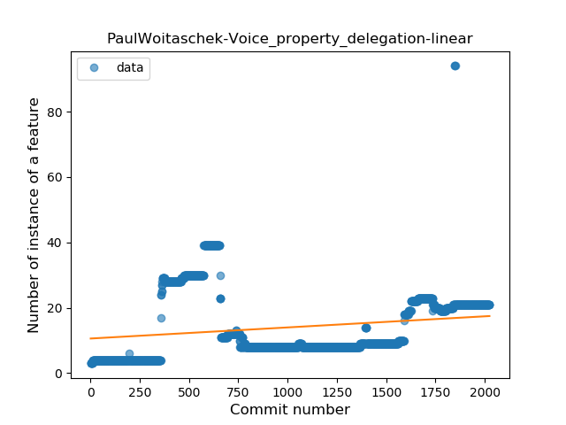
### <a name="destructuring_declaration">Destructuring Declaration</a>
----
#### Functions
* **Plateau Gradual Decline - Sigmoid:** 
    * **R_Squared:** 0.04361088
* **Constant Decline - Linear:** 
    * **R_Squared:** 0.00120771
* **Sudden Decline - Exponential:** 
    * **R_Squared:** 0.00119281
* **Sudden Rise Plateau - Logarithm:** 
    * **R_Squared:** -0.0

**Plots** :chart_with_upwards_trend:
-----

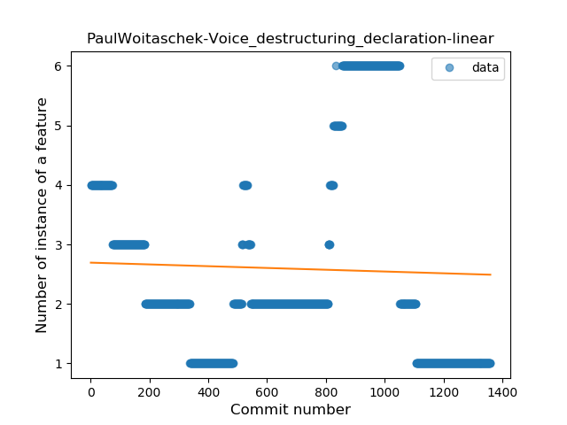
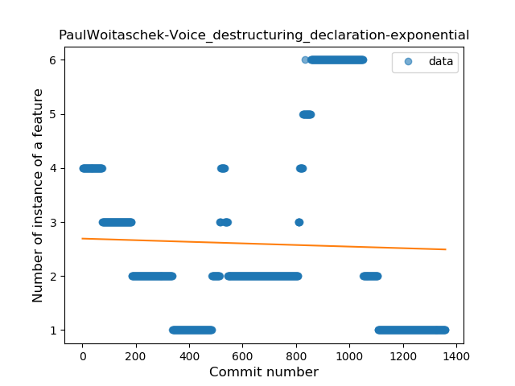

### <a name="inline_func">Inline Function</a>
----
#### Functions
* **Sudden Rise - Exponential:** 
    * **R_Squared:** 0.74209959
* **Constant Rise - Linear:** 
    * **R_Squared:** 0.73094212
* **Sudden Rise Plateau - Logarithm:** 
    * **R_Squared:** 0.30497866

**Plots** :chart_with_upwards_trend:
-----

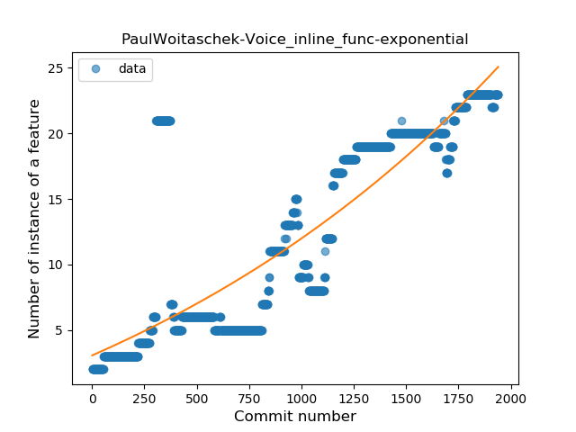
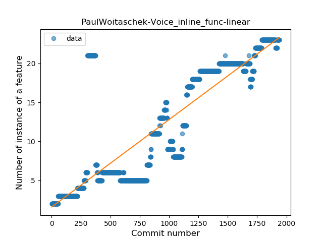
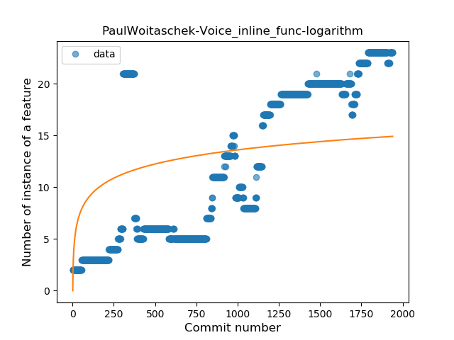
### <a name="overloaded_op">Overloaded Operator</a>
----
#### Functions
* **Plateau Gradual Rise - Sigmoid:** 
    * **R_Squared:** 0.92667089
* **Sudden Rise - Exponential:** 
    * **R_Squared:** 0.72981601
* **Constant Rise - Linear:** 
    * **R_Squared:** 0.52375155
* **Sudden Rise Plateau - Logarithm:** 
    * **R_Squared:** 0.09405228

**Plots** :chart_with_upwards_trend:
-----

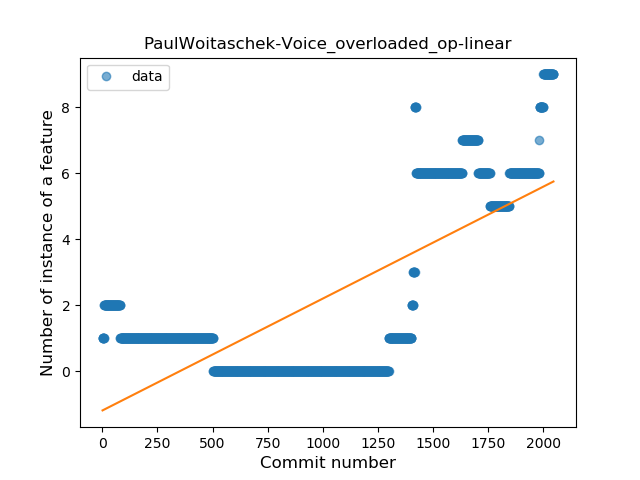
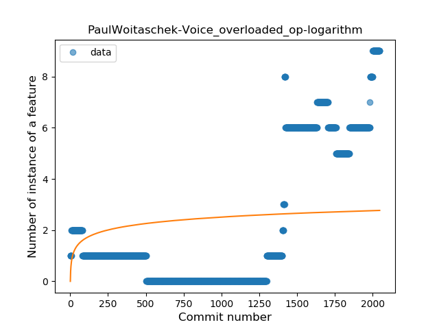
### <a name="super_delegation">Super Delegation</a>
----
#### Functions
* **Plateau Sudden Rise - Binary Sigmoid:** 
    * **R_Squared:** 1.0
* **Sudden Rise - Exponential:** 
    * **R_Squared:** 0.78773413
* **Constant Rise - Linear:** 
    * **R_Squared:** 0.3804579
* **Sudden Rise Plateau - Logarithm:** 
    * **R_Squared:** 0.15437456

**Plots** :chart_with_upwards_trend:
-----

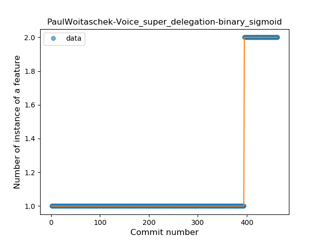
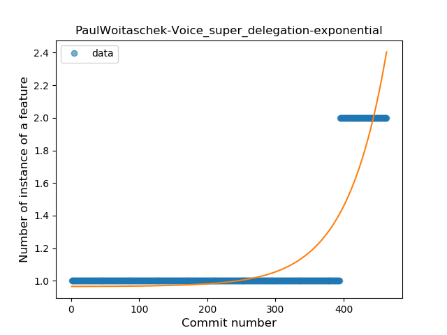
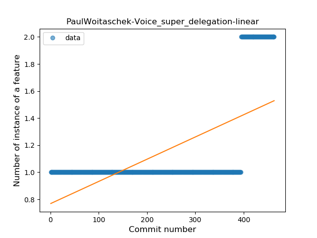
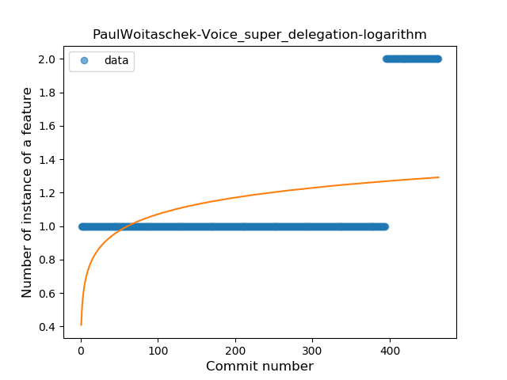
