## RocketChat-Rocket.Chat.Android
----
#### Metrics provided by Detekt
* Number of lines of code 30408
* Number of Kotlin files: 431
* Cyclomatic complexity: 4370
* Cyclomatic complexity by thousands of lines: 269 

----
**17** features analyzed

*	<a href="#type_inference">Type Inference</a> 
*	<a href="#lambda">Lambda</a> 
*	<a href="#safe_call">Safe Call</a> 
*	<a href="#when_expr">When expression</a> 
*	<a href="#companion_object">Companion Object</a> 
*	<a href="#unsafe_call">Unsafe Call</a> 
*	<a href="#string_template">String Template</a> 
*	<a href="#func_with_default_value">Function with Default Value</a> 
*	<a href="#singleton">Singleton</a> 
*	<a href="#smart_cast">Smart Cast</a> 
*	<a href="#range_expr">Range Expression</a> 
*	<a href="#func_call_with_named_arg">Function call with Named Argument</a> 
*	<a href="#data_class">Data Class</a> 
*	<a href="#extension_function">Extension Function</a> 
*	<a href="#property_delegation">Property Delegation</a> 
*	<a href="#destructuring_declaration">Destructuring Declaration</a> 
*	<a href="#inline_func">Inline Function</a> 

### <a name="type_inference">Type Inference</a>
----
#### Functions
* **Plateau Gradual Rise - Sigmoid:** 
    * **R_Squared:** 0.9834695
* **Constant Rise - Linear:** 
    * **R_Squared:** 0.94825019
* **Sudden Rise Plateau - Logarithm:** 
    * **R_Squared:** 0.31431447

**Plots** :chart_with_upwards_trend:
-----

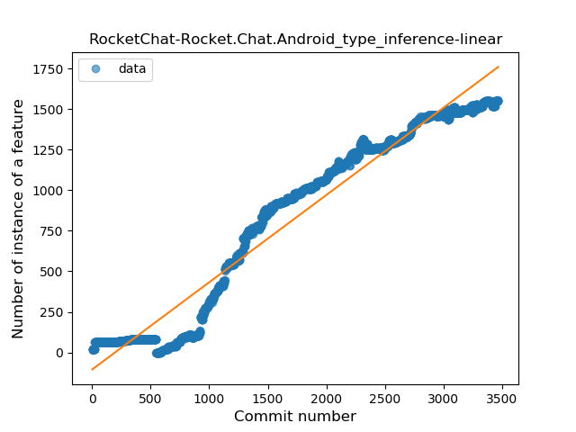
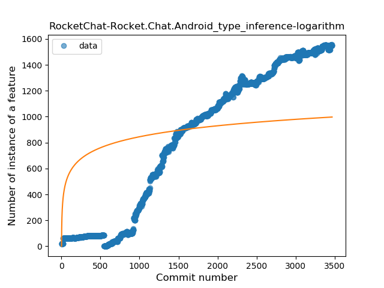
### <a name="lambda">Lambda</a>
----
#### Functions
* **Constant Rise - Linear:** 
    * **R_Squared:** 0.95908474
* **Sudden Rise - Exponential:** 
    * **R_Squared:** 0.95963735
* **Sudden Rise Plateau - Logarithm:** 
    * **R_Squared:** 0.26571275
* **Plateau Sudden Rise - Binary Sigmoid:** 
    * **R_Squared:** 0.05402545

**Plots** :chart_with_upwards_trend:
-----

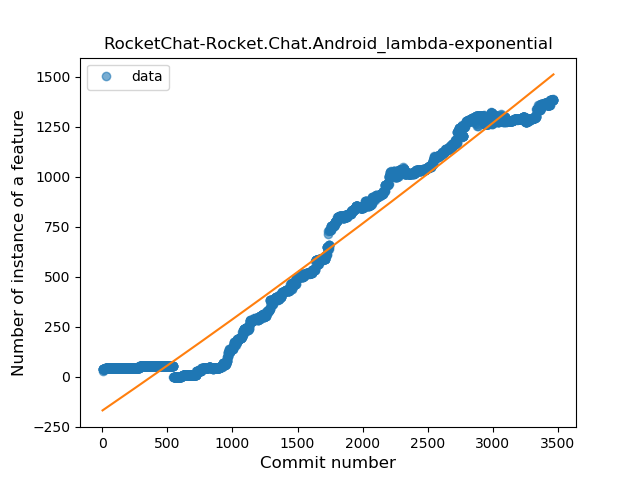
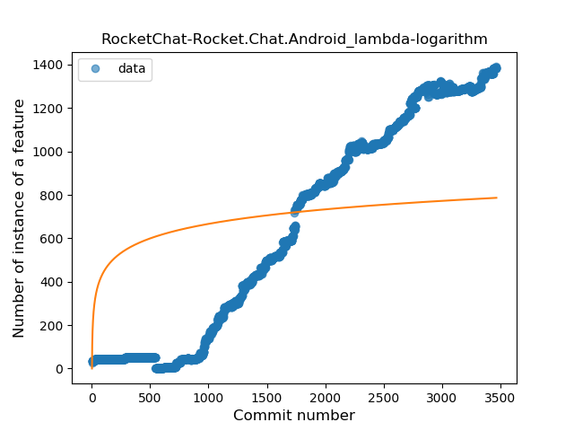

### <a name="safe_call">Safe Call</a>
----
#### Functions
* **Constant Rise - Linear:** 
    * **R_Squared:** 0.97957946
* **Sudden Rise - Exponential:** 
    * **R_Squared:** 0.98021172
* **Sudden Rise Plateau - Logarithm:** 
    * **R_Squared:** 0.28009123
* **Plateau Sudden Rise - Binary Sigmoid:** 
    * **R_Squared:** 0.20238227

**Plots** :chart_with_upwards_trend:
-----

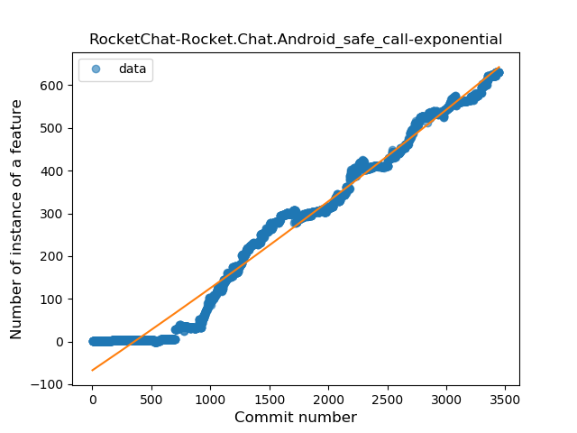
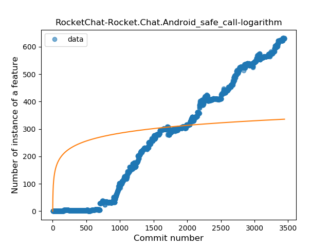
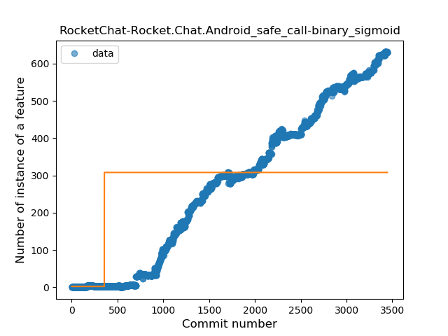
### <a name="when_expr">When expression</a>
----
#### Functions
* **Constant Rise - Linear:** 
    * **R_Squared:** 0.95250178
* **Sudden Rise Plateau - Logarithm:** 
    * **R_Squared:** 0.32709629
* **Plateau Sudden Rise - Binary Sigmoid:** 
    * **R_Squared:** 0.02509792

**Plots** :chart_with_upwards_trend:
-----

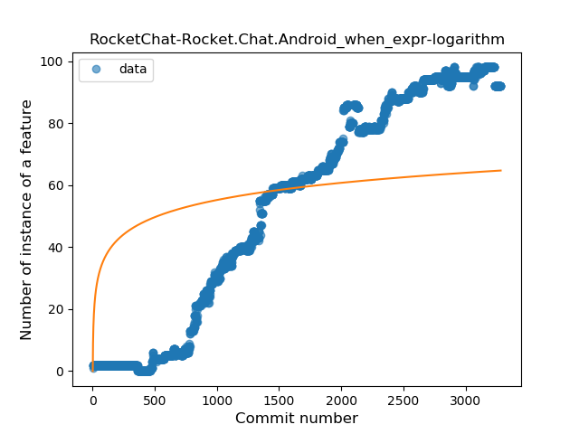
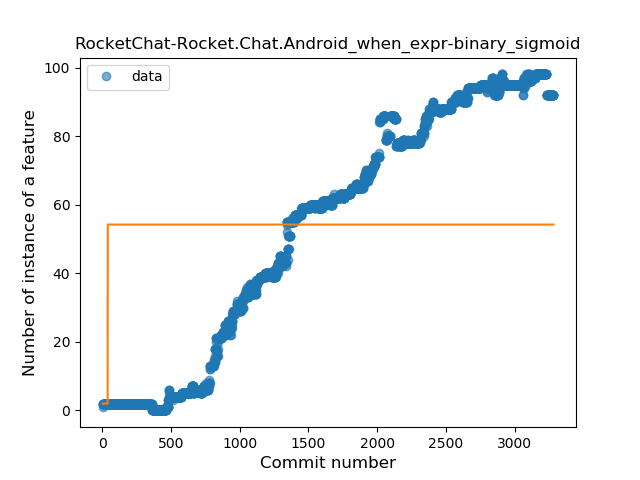
### <a name="companion_object">Companion Object</a>
----
#### Functions
* **Constant Rise - Linear:** 
    * **R_Squared:** 0.9007671
* **Sudden Rise Plateau - Logarithm:** 
    * **R_Squared:** 0.31113757
* **Plateau Sudden Rise - Binary Sigmoid:** 
    * **R_Squared:** 0.01191542

**Plots** :chart_with_upwards_trend:
-----

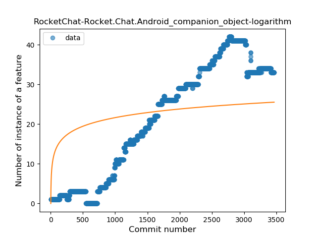
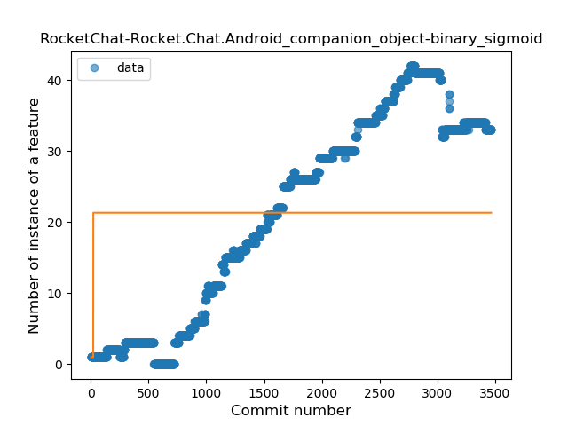
### <a name="unsafe_call">Unsafe Call</a>
----
#### Functions
* **Constant Rise - Linear:** 
    * **R_Squared:** 0.87283065
* **Sudden Rise Plateau - Logarithm:** 
    * **R_Squared:** 0.30206591
* **Plateau Sudden Rise - Binary Sigmoid:** 
    * **R_Squared:** 0.02844077

**Plots** :chart_with_upwards_trend:
-----

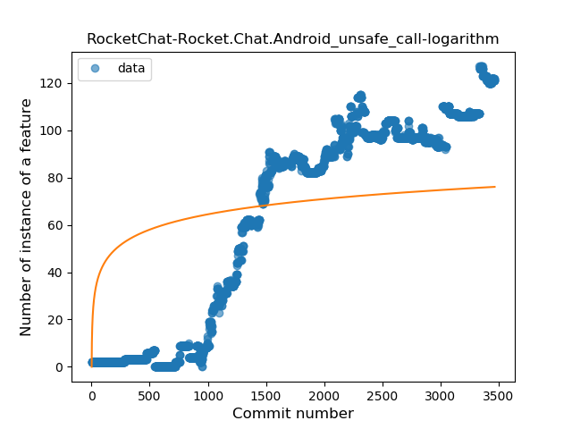
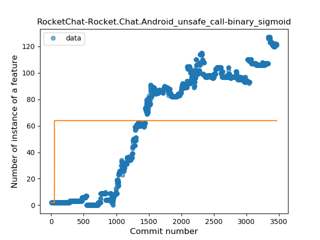
### <a name="string_template">String Template</a>
----
#### Functions
* **Constant Rise - Linear:** 
    * **R_Squared:** 0.96630048
* **Sudden Rise Plateau - Logarithm:** 
    * **R_Squared:** 0.29054043
* **Plateau Sudden Rise - Binary Sigmoid:** 
    * **R_Squared:** 0.06154356

**Plots** :chart_with_upwards_trend:
-----

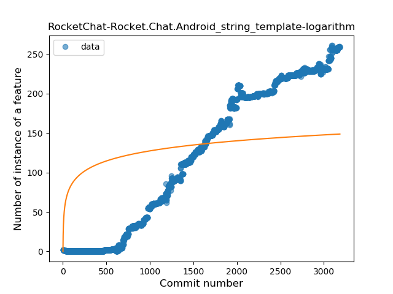
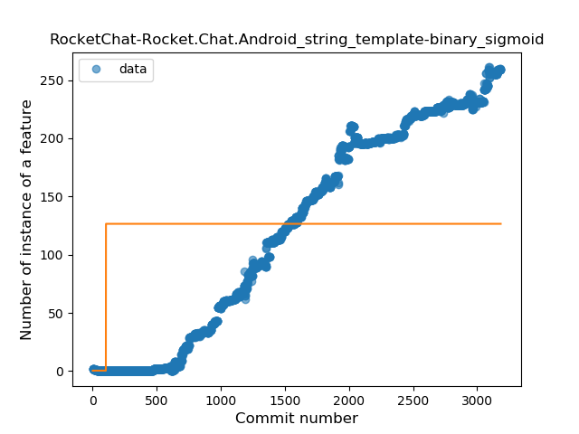
### <a name="func_with_default_value">Function with Default Value</a>
----
#### Functions
* **Constant Rise - Linear:** 
    * **R_Squared:** 0.93509017
* **Sudden Rise Plateau - Logarithm:** 
    * **R_Squared:** 0.26949054
* **Plateau Sudden Rise - Binary Sigmoid:** 
    * **R_Squared:** 0.01542834

**Plots** :chart_with_upwards_trend:
-----

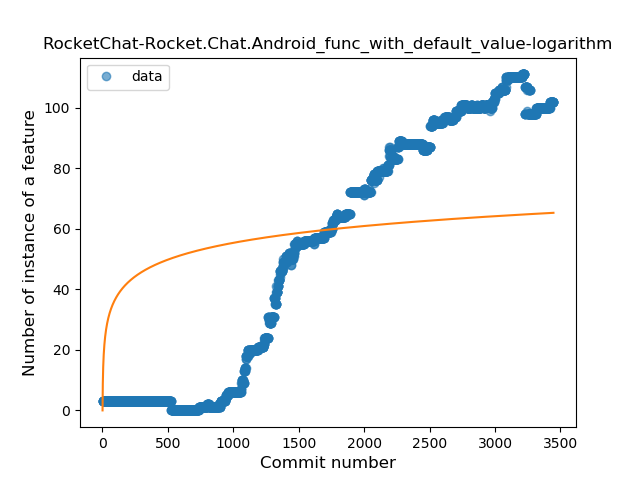

### <a name="singleton">Singleton</a>
----
#### Functions
* **Sudden Rise - Exponential:** 
    * **R_Squared:** 0.825697
* **Constant Rise - Linear:** 
    * **R_Squared:** 0.65214002
* **Sudden Rise Plateau - Logarithm:** 
    * **R_Squared:** 0.17462245
* **Plateau Sudden Rise - Binary Sigmoid:** 
    * **R_Squared:** 0.00723961

**Plots** :chart_with_upwards_trend:
-----

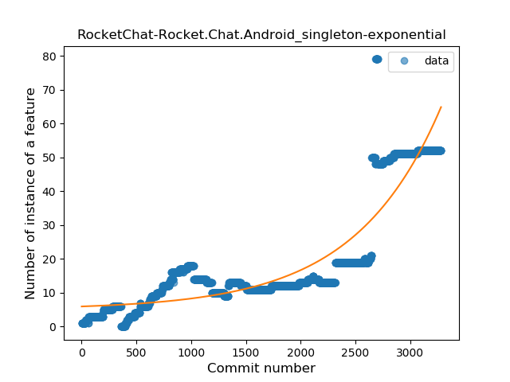
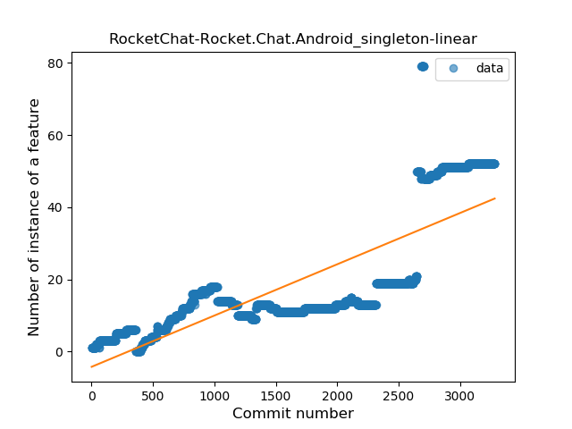
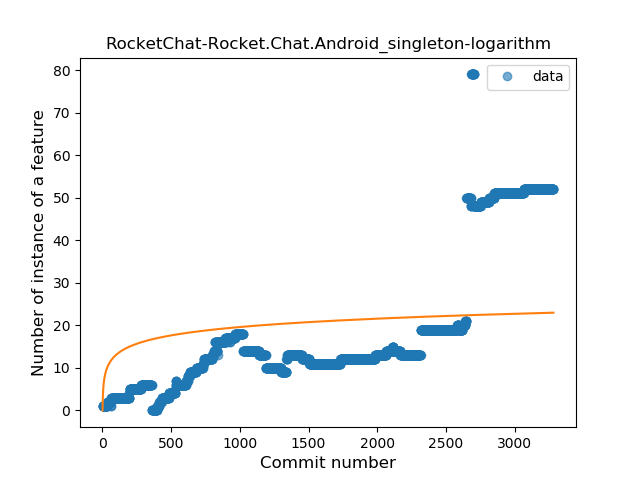
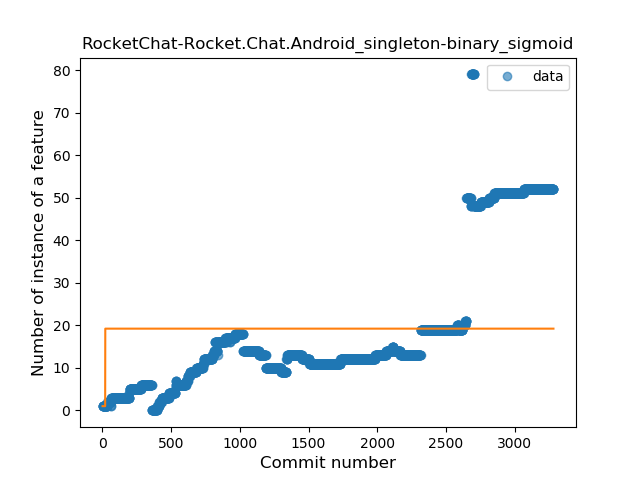
### <a name="smart_cast">Smart Cast</a>
----
#### Functions
* **Constant Rise - Linear:** 
    * **R_Squared:** 0.94582173
* **Sudden Rise Plateau - Logarithm:** 
    * **R_Squared:** 0.42127534
* **Plateau Sudden Rise - Binary Sigmoid:** 
    * **R_Squared:** 0.16277172

**Plots** :chart_with_upwards_trend:
-----

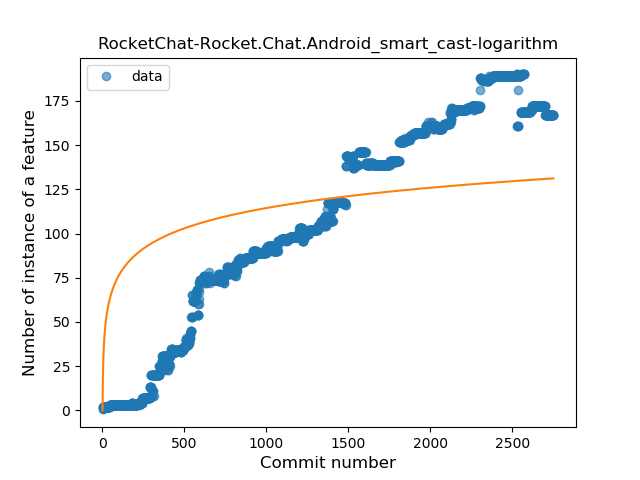

### <a name="range_expr">Range Expression</a>
----
#### Functions
* **Constant Rise - Linear:** 
    * **R_Squared:** 0.93731685
* **Sudden Rise - Exponential:** 
    * **R_Squared:** 0.94220368
* **Sudden Rise Plateau - Logarithm:** 
    * **R_Squared:** 0.27989447

**Plots** :chart_with_upwards_trend:
-----

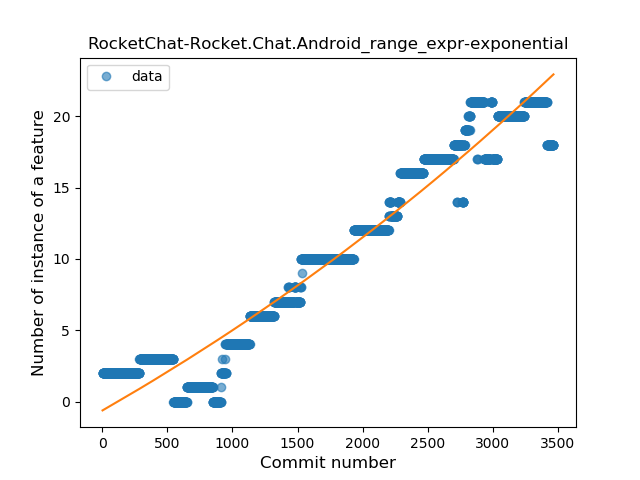
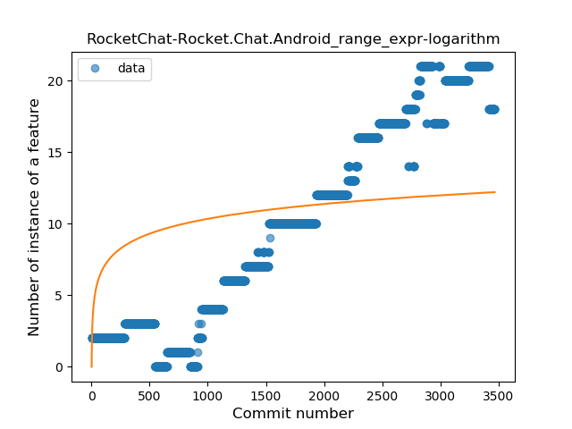
### <a name="func_call_with_named_arg">Function call with Named Argument</a>
----
#### Functions
* **Constant Rise - Linear:** 
    * **R_Squared:** 0.97546578
* **Sudden Rise - Exponential:** 
    * **R_Squared:** 0.97909303
* **Plateau Sudden Rise - Binary Sigmoid:** 
    * **R_Squared:** 0.77745269
* **Sudden Rise Plateau - Logarithm:** 
    * **R_Squared:** 0.27687888

**Plots** :chart_with_upwards_trend:
-----

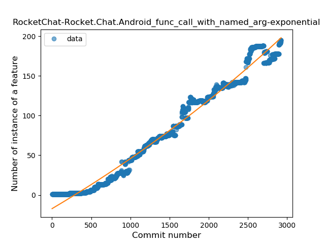
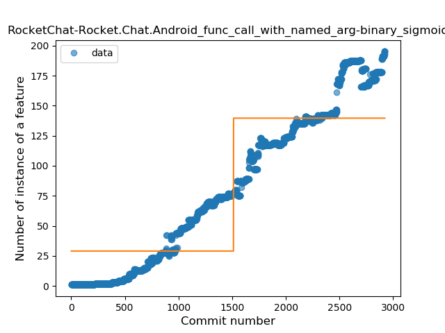
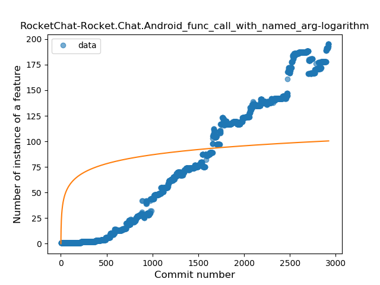
### <a name="data_class">Data Class</a>
----
#### Functions
* **Constant Rise - Linear:** 
    * **R_Squared:** 0.98495966
* **Sudden Rise - Exponential:** 
    * **R_Squared:** 0.98694228
* **Sudden Rise Plateau - Logarithm:** 
    * **R_Squared:** 0.33182081
* **Plateau Sudden Rise - Binary Sigmoid:** 
    * **R_Squared:** 0.02601117

**Plots** :chart_with_upwards_trend:
-----

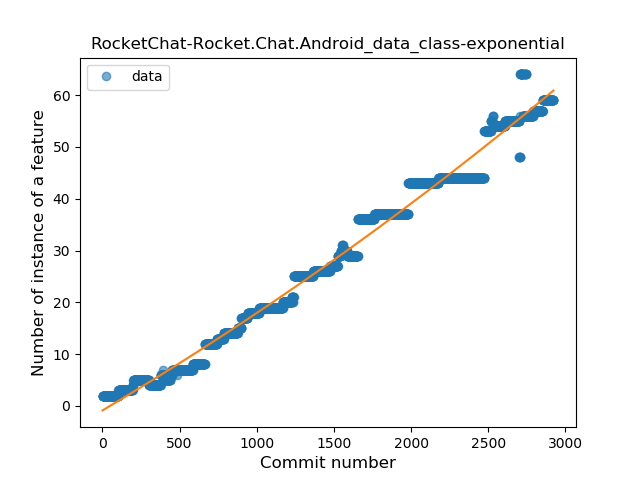
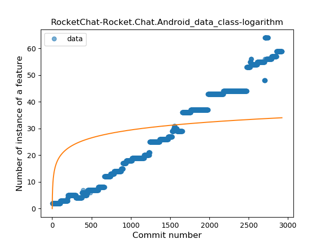

### <a name="extension_function">Extension Function</a>
----
#### Functions
* **Constant Rise - Linear:** 
    * **R_Squared:** 0.96326069
* **Plateau Gradual Rise - Sigmoid:** 
    * **R_Squared:** 0.80029735
* **Sudden Rise Plateau - Logarithm:** 
    * **R_Squared:** 0.28813614

**Plots** :chart_with_upwards_trend:
-----

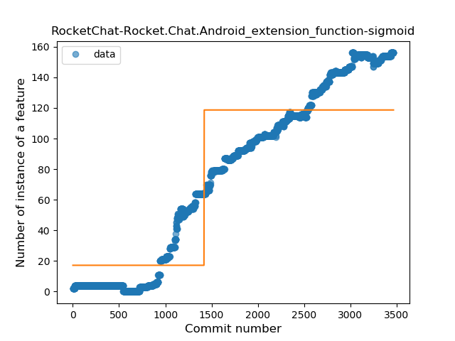
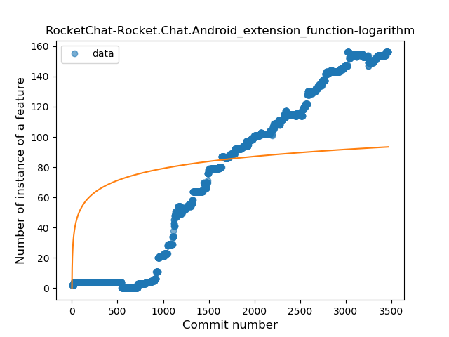
### <a name="property_delegation">Property Delegation</a>
----
#### Functions
* **Constant Rise - Linear:** 
    * **R_Squared:** 0.82661576
* **Sudden Rise - Exponential:** 
    * **R_Squared:** 0.8313009
* **Sudden Rise Plateau - Logarithm:** 
    * **R_Squared:** 0.37345942

**Plots** :chart_with_upwards_trend:
-----

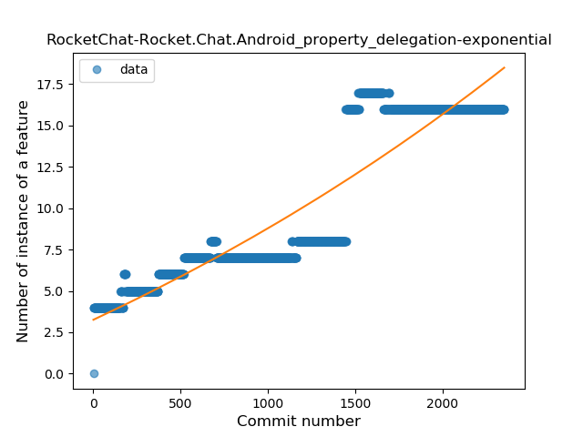
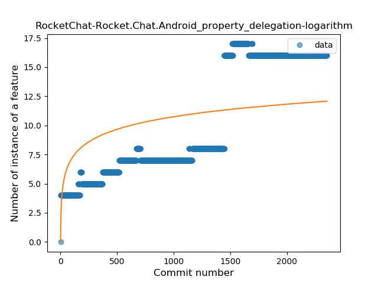
### <a name="destructuring_declaration">Destructuring Declaration</a>
----
#### Functions
* **Plateau Gradual Rise - Sigmoid:** 
    * **R_Squared:** 0.94773922
* **Constant Rise - Linear:** 
    * **R_Squared:** 0.83894904
* **Sudden Rise Plateau - Logarithm:** 
    * **R_Squared:** 0.23855394

**Plots** :chart_with_upwards_trend:
-----

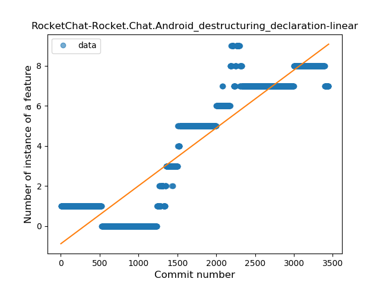
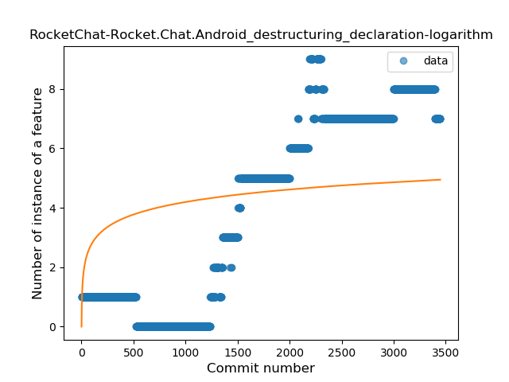
### <a name="inline_func">Inline Function</a>
----
#### Functions
* **Plateau Gradual Rise - Sigmoid:** 
    * **R_Squared:** 0.9579989
* **Constant Rise - Linear:** 
    * **R_Squared:** 0.81585133
* **Sudden Rise Plateau - Logarithm:** 
    * **R_Squared:** 0.43033695

**Plots** :chart_with_upwards_trend:
-----

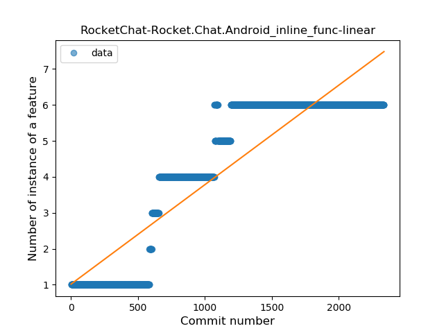
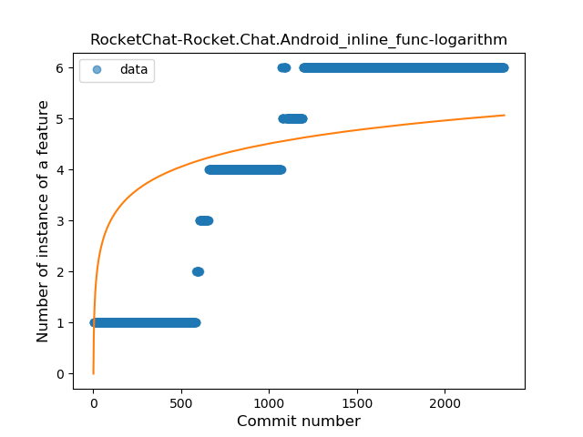
