## ScreamingHawk-phone-saver
----
#### Metrics provided by Detekt
* Number of lines of code 1901
* Number of Kotlin files: 19
* Cyclomatic complexity: 280
* Cyclomatic complexity by thousands of lines: 304 

----
**11** features analyzed

*	<a href="#type_inference">Type Inference</a> 
*	<a href="#lambda">Lambda</a> 
*	<a href="#safe_call">Safe Call</a> 
*	<a href="#when_expr">When expression</a> 
*	<a href="#companion_object">Companion Object</a> 
*	<a href="#unsafe_call">Unsafe Call</a> 
*	<a href="#string_template">String Template</a> 
*	<a href="#func_with_default_value">Function with Default Value</a> 
*	<a href="#singleton">Singleton</a> 
*	<a href="#smart_cast">Smart Cast</a> 
*	<a href="#data_class">Data Class</a> 

### <a name="type_inference">Type Inference</a>
----
#### Functions
* **Constant Rise - Linear:** 
    * **R_Squared:** 0.95015351
* **Sudden Rise Plateau - Logarithm:** 
    * **R_Squared:** 0.66835431
* **Plateau Sudden Rise - Binary Sigmoid:** 
    * **R_Squared:** 0.51339316

**Plots** :chart_with_upwards_trend:
-----

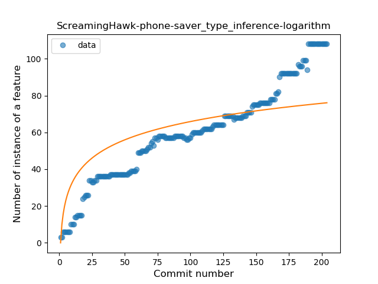
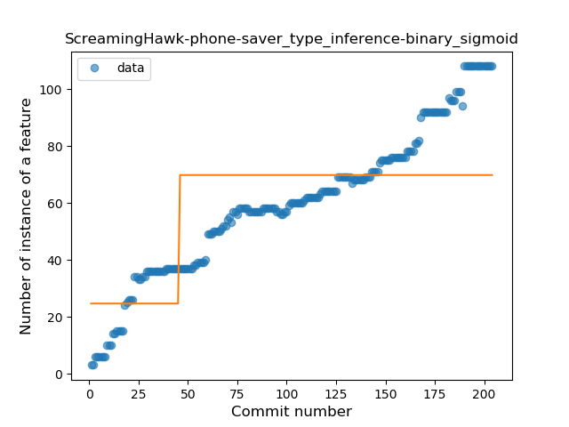
### <a name="lambda">Lambda</a>
----
#### Functions
* **Constant Rise - Linear:** 
    * **R_Squared:** 0.97470471
* **Sudden Rise - Exponential:** 
    * **R_Squared:** 0.97544288
* **Plateau Gradual Rise - Sigmoid:** 
    * **R_Squared:** 0.70809349
* **Sudden Rise Plateau - Logarithm:** 
    * **R_Squared:** 0.56616074

**Plots** :chart_with_upwards_trend:
-----

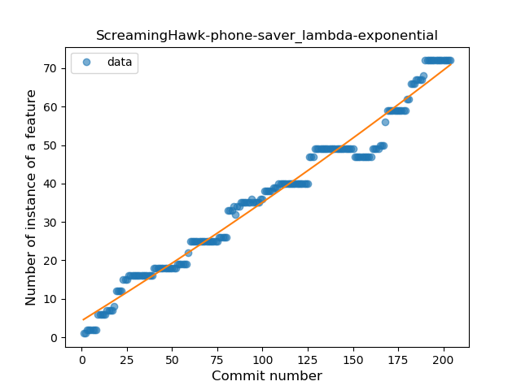
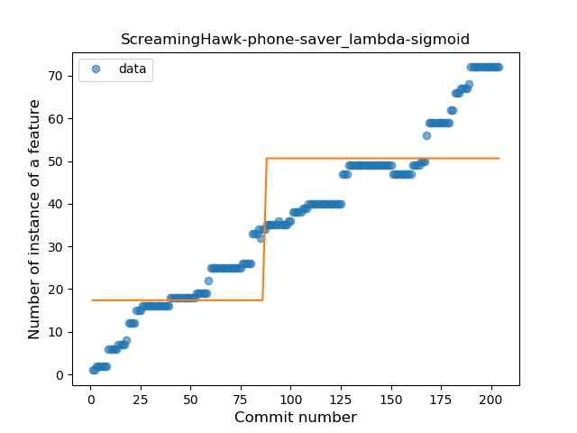
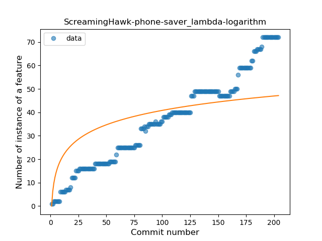
### <a name="safe_call">Safe Call</a>
----
#### Functions
* **Constant Rise - Linear:** 
    * **R_Squared:** 0.92915259
* **Sudden Rise Plateau - Logarithm:** 
    * **R_Squared:** 0.7474179
* **Plateau Sudden Rise - Binary Sigmoid:** 
    * **R_Squared:** 0.37287164

**Plots** :chart_with_upwards_trend:
-----

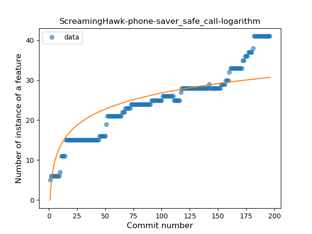
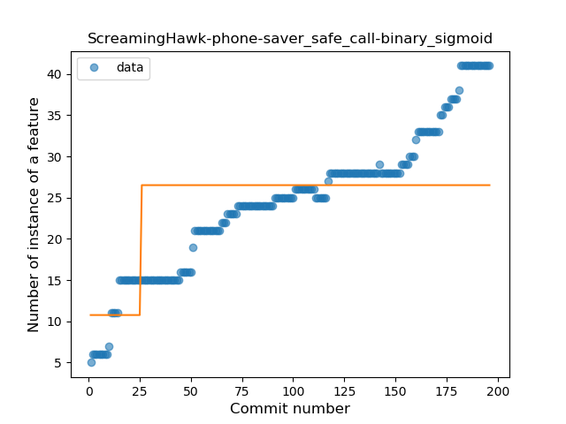
### <a name="when_expr">When expression</a>
----
#### Functions
* **Plateau Gradual Rise - Sigmoid:** 
    * **R_Squared:** 0.98389296
* **Sudden Rise - Exponential:** 
    * **R_Squared:** 0.83406356
* **Constant Rise - Linear:** 
    * **R_Squared:** 0.75966501
* **Sudden Rise Plateau - Logarithm:** 
    * **R_Squared:** 0.31736003

**Plots** :chart_with_upwards_trend:
-----

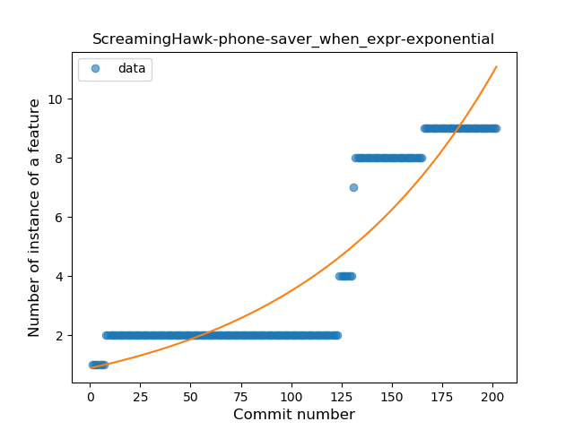
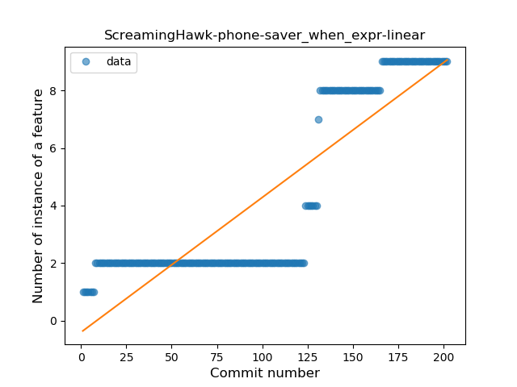
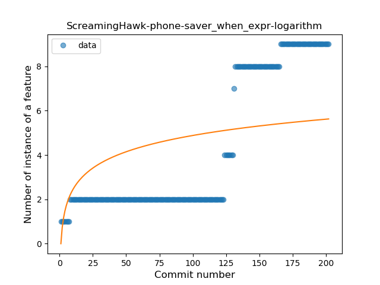
### <a name="companion_object">Companion Object</a>
----
#### Functions
* **Plateau Gradual Rise - Sigmoid:** 
    * **R_Squared:** 0.8280839
* **Sudden Rise - Exponential:** 
    * **R_Squared:** 0.68209508
* **Constant Rise - Linear:** 
    * **R_Squared:** 0.38604691
* **Sudden Rise Plateau - Logarithm:** 
    * **R_Squared:** 0.2503959

**Plots** :chart_with_upwards_trend:
-----

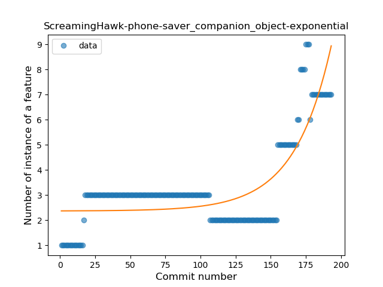
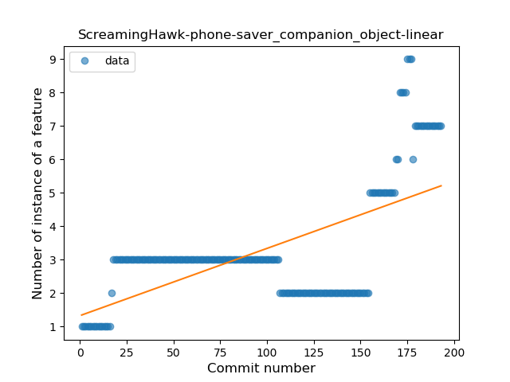
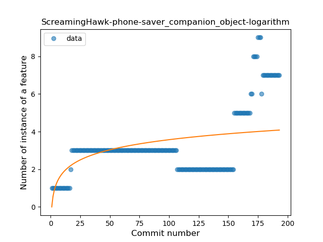
### <a name="unsafe_call">Unsafe Call</a>
----
#### Functions
* **Plateau Gradual Rise - Sigmoid:** 
    * **R_Squared:** 0.32952001
* **Sudden Rise - Exponential:** 
    * **R_Squared:** 0.22083887
* **Constant Rise - Linear:** 
    * **R_Squared:** 0.20659817
* **Sudden Rise Plateau - Logarithm:** 
    * **R_Squared:** 0.07424173

**Plots** :chart_with_upwards_trend:
-----

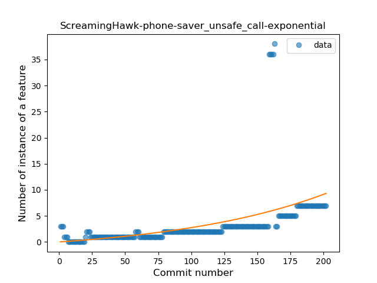
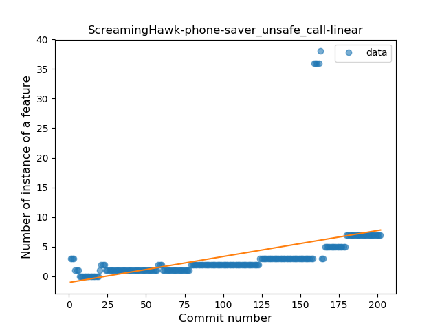
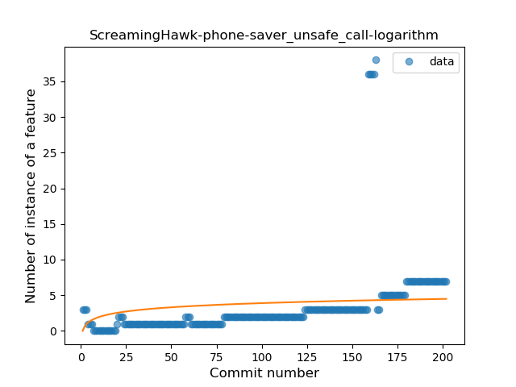
### <a name="string_template">String Template</a>
----
#### Functions
* **Sudden Rise - Exponential:** 
    * **R_Squared:** 0.95678528
* **Constant Rise - Linear:** 
    * **R_Squared:** 0.9261671
* **Sudden Rise Plateau - Logarithm:** 
    * **R_Squared:** 0.38535118

**Plots** :chart_with_upwards_trend:
-----

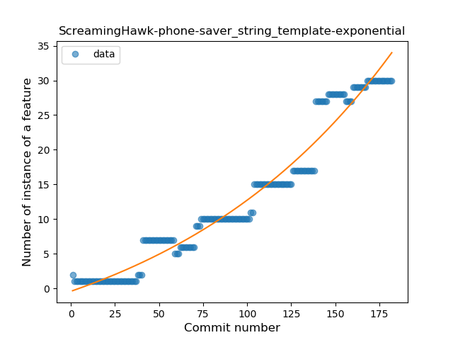
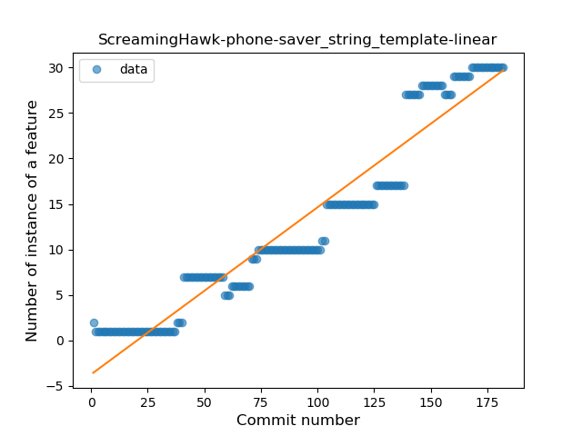
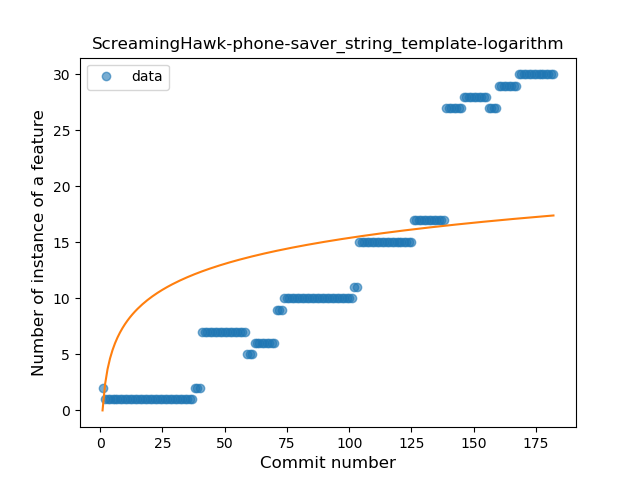
### <a name="func_with_default_value">Function with Default Value</a>
----
#### Functions
* **Plateau Gradual Rise - Sigmoid:** 
    * **R_Squared:** 0.95075568
* **Sudden Rise - Exponential:** 
    * **R_Squared:** 0.9372924
* **Constant Rise - Linear:** 
    * **R_Squared:** 0.90873308
* **Sudden Rise Plateau - Logarithm:** 
    * **R_Squared:** 0.43958328

**Plots** :chart_with_upwards_trend:
-----

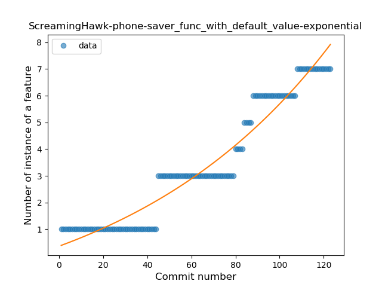
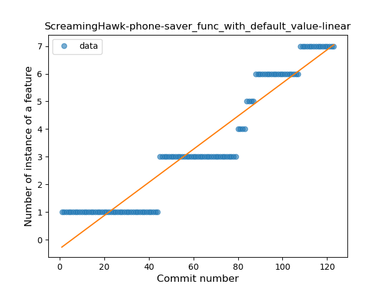

### <a name="singleton">Singleton</a>
----
#### Functions
* **Plateau Sudden Rise - Binary Sigmoid:** 
    * **R_Squared:** 1.0
* **Sudden Rise Plateau - Logarithm:** 
    * **R_Squared:** 0.1825907
* **Constant Rise - Linear:** 
    * **R_Squared:** 0.03174331

**Plots** :chart_with_upwards_trend:
-----

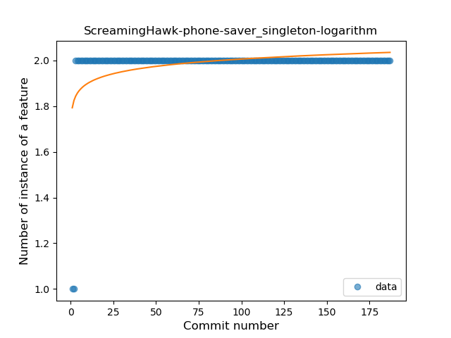
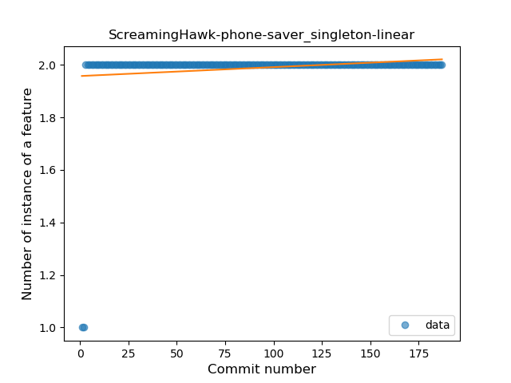
### <a name="smart_cast">Smart Cast</a>
----
#### Functions
* **Plateau Sudden Decline - Binary Sigmoid:** 
    * **R_Squared:** 0.4079814
* **Sudden Rise - Exponential:** 
    * **R_Squared:** 0.38231779
* **Constant Rise - Linear:** 
    * **R_Squared:** 0.00413453
* **Sudden Rise Plateau - Logarithm:** 
    * **R_Squared:** -0.0

**Plots** :chart_with_upwards_trend:
-----

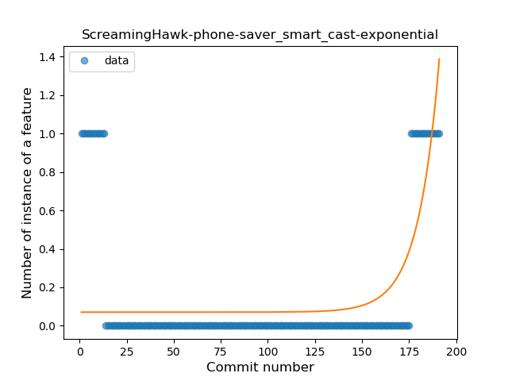
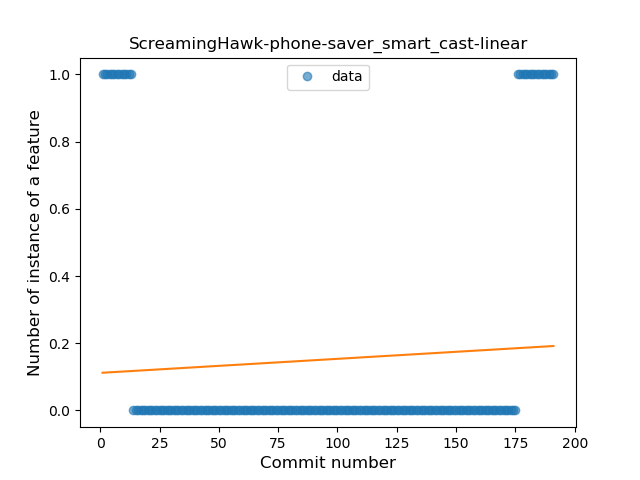
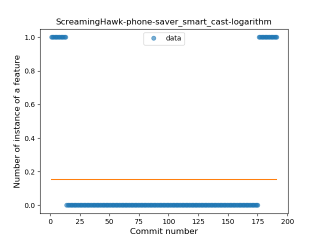
### <a name="data_class">Data Class</a>
----
#### Functions
* **Plateau Sudden Rise - Binary Sigmoid:** 
    * **R_Squared:** 1.0
* **Sudden Rise - Exponential:** 
    * **R_Squared:** 0.76352872
* **Constant Rise - Linear:** 
    * **R_Squared:** 0.62704918
* **Sudden Rise Plateau - Logarithm:** 
    * **R_Squared:** 0.3205505

**Plots** :chart_with_upwards_trend:
-----

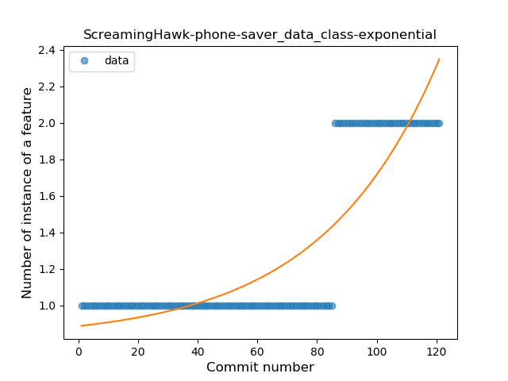

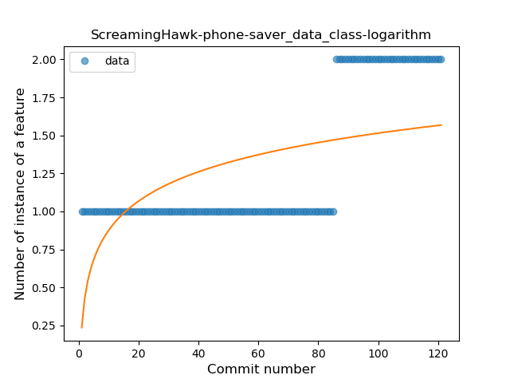
