## SimpleMobileTools-Simple-App-Launcher
----
#### Metrics provided by Detekt
* Number of lines of code 890
* Number of Kotlin files: 16
* Cyclomatic complexity: 142
* Cyclomatic complexity by thousands of lines: 304 

----
**11** features analyzed

*	<a href="#type_inference">Type Inference</a> 
*	<a href="#lambda">Lambda</a> 
*	<a href="#safe_call">Safe Call</a> 
*	<a href="#when_expr">When expression</a> 
*	<a href="#companion_object">Companion Object</a> 
*	<a href="#unsafe_call">Unsafe Call</a> 
*	<a href="#string_template">String Template</a> 
*	<a href="#func_with_default_value">Function with Default Value</a> 
*	<a href="#range_expr">Range Expression</a> 
*	<a href="#extension_function">Extension Function</a> 
*	<a href="#destructuring_declaration">Destructuring Declaration</a> 

### <a name="type_inference">Type Inference</a>
----
#### Functions
* **Sudden Rise Plateau - Logarithm:** 
    * **R_Squared:** 0.8160426
* **Constant Rise - Linear:** 
    * **R_Squared:** 0.56007719

**Plots** :chart_with_upwards_trend:
-----

### <a name="lambda">Lambda</a>
----
#### Functions
* **Constant Rise - Linear:** 
    * **R_Squared:** 0.83496938
* **Sudden Rise Plateau - Logarithm:** 
    * **R_Squared:** 0.80102573
* **Plateau Gradual Rise - Sigmoid:** 
    * **R_Squared:** 0.43022846

**Plots** :chart_with_upwards_trend:
-----

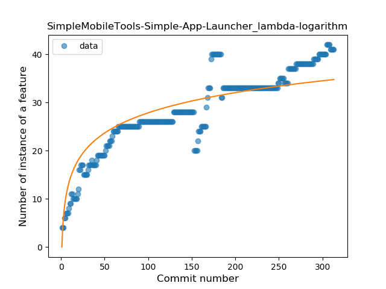
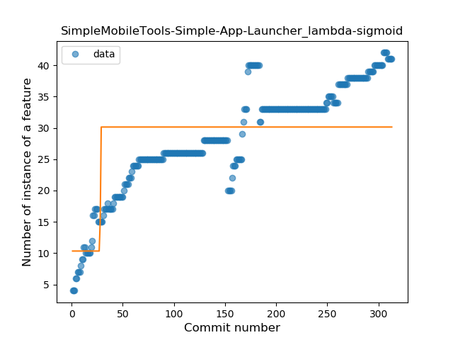
### <a name="safe_call">Safe Call</a>
----
#### Functions
* **Plateau Gradual Rise - Sigmoid:** 
    * **R_Squared:** 0.79165415
* **Sudden Rise Plateau - Logarithm:** 
    * **R_Squared:** 0.57208312
* **Constant Rise - Linear:** 
    * **R_Squared:** 0.39873757

**Plots** :chart_with_upwards_trend:
-----

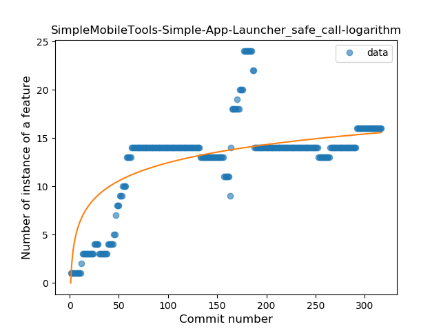
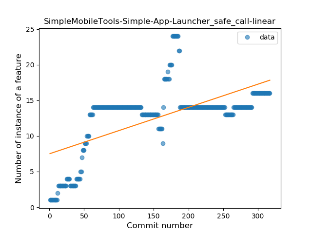
### <a name="when_expr">When expression</a>
----
#### Functions
* **Plateau Gradual Rise - Sigmoid:** 
    * **R_Squared:** 0.76722527
* **Sudden Rise Plateau - Logarithm:** 
    * **R_Squared:** 0.6443097
* **Constant Rise - Linear:** 
    * **R_Squared:** 0.33624306

**Plots** :chart_with_upwards_trend:
-----

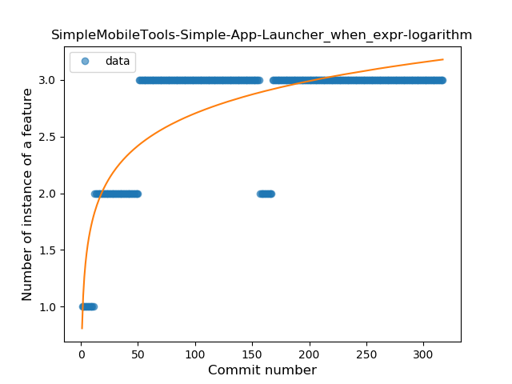
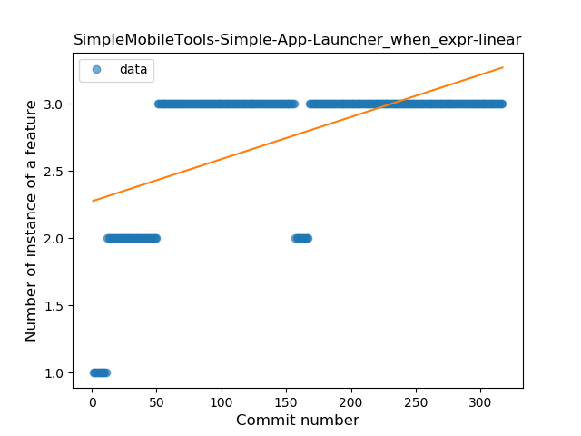
### <a name="companion_object">Companion Object</a>
----
#### Functions
* **Plateau Gradual Rise - Sigmoid:** 
    * **R_Squared:** 0.34848953
* **Constant Decline - Linear:** 
    * **R_Squared:** 0.06395511
* **Sudden Rise Plateau - Logarithm:** 
    * **R_Squared:** 0.01160695

**Plots** :chart_with_upwards_trend:
-----

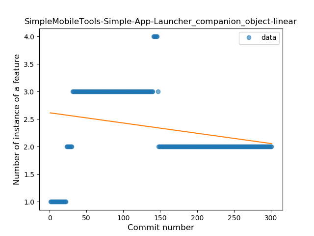
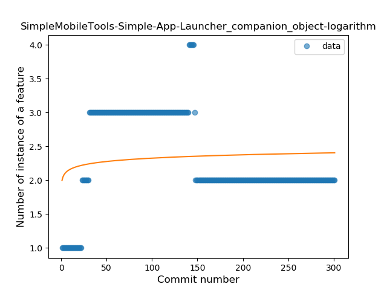
### <a name="unsafe_call">Unsafe Call</a>
----
#### Functions
* **Plateau Gradual Rise - Sigmoid:** 
    * **R_Squared:** 0.86371539
* **Sudden Rise Plateau - Logarithm:** 
    * **R_Squared:** 0.5342084
* **Constant Rise - Linear:** 
    * **R_Squared:** 0.27485418

**Plots** :chart_with_upwards_trend:
-----

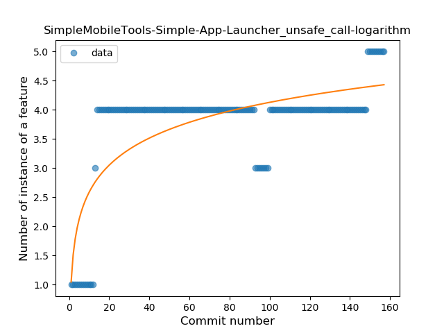
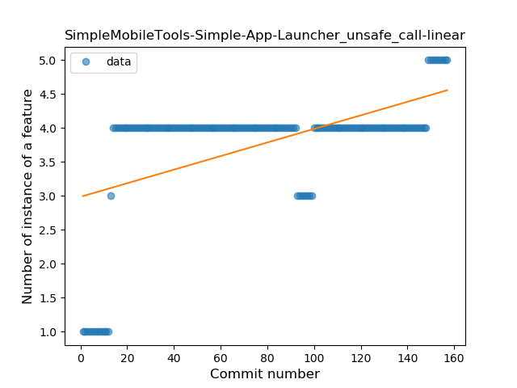
### <a name="string_template">String Template</a>
----
#### Functions
* **Sudden Rise Plateau - Logarithm:** 
    * **R_Squared:** 0.25643575
* **Constant Rise - Linear:** 
    * **R_Squared:** 0.02845551

**Plots** :chart_with_upwards_trend:
-----

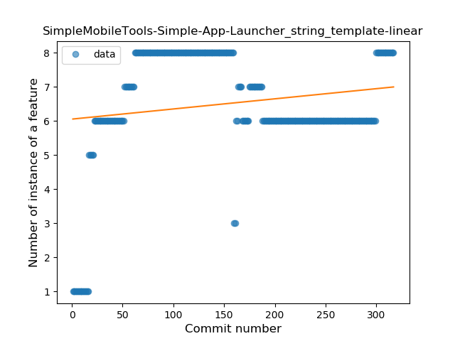
### <a name="func_with_default_value">Function with Default Value</a>
----
#### Functions
* **Constant Decline - Linear:** 
    * **R_Squared:** 0.13654013
* **Plateau Gradual Rise - Sigmoid:** 
    * **R_Squared:** 0.13701674
* **Sudden Rise Plateau - Logarithm:** 
    * **R_Squared:** 0.0

**Plots** :chart_with_upwards_trend:
-----

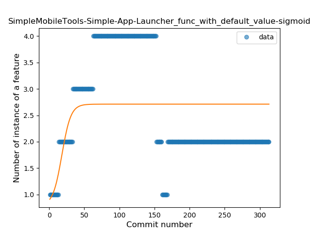
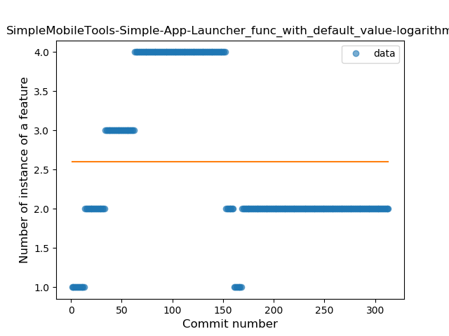
### <a name="range_expr">Range Expression</a>
----
#### Functions
* **Plateau Gradual Rise - Sigmoid:** 
    * **R_Squared:** 0.03054544
* **Constant Decline - Linear:** 
    * **R_Squared:** 0.00905375
* **Sudden Rise Plateau - Logarithm:** 
    * **R_Squared:** 0.00019053

**Plots** :chart_with_upwards_trend:
-----

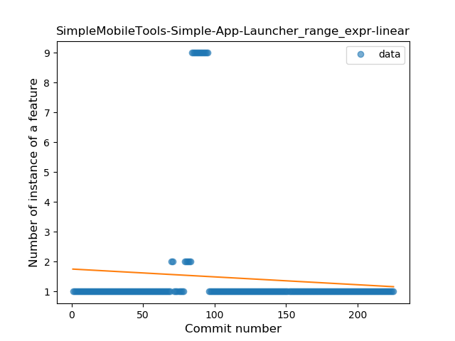
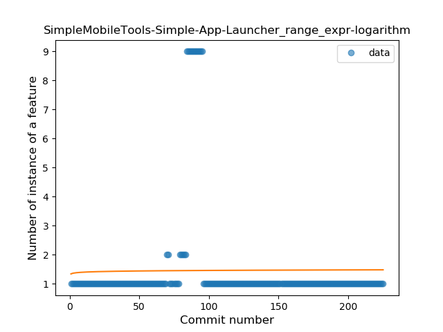
### <a name="extension_function">Extension Function</a>
----
#### Functions
* **Plateau Sudden Rise - Binary Sigmoid:** 
    * **R_Squared:** 0.17472089
* **Constant Decline - Linear:** 
    * **R_Squared:** 0.02219312
* **Sudden Rise Plateau - Logarithm:** 
    * **R_Squared:** 0.00774947

**Plots** :chart_with_upwards_trend:
-----

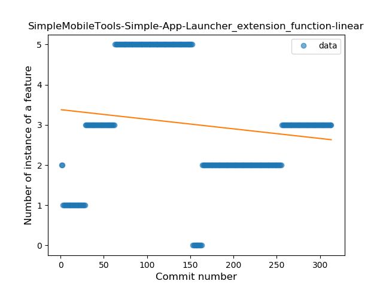
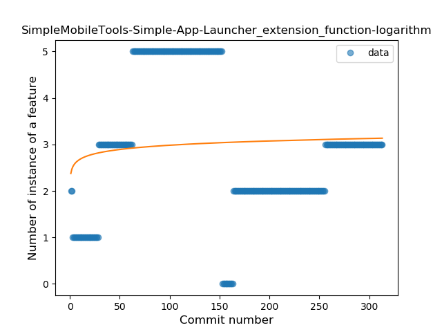
### <a name="destructuring_declaration">Destructuring Declaration</a>
----
#### Functions
* **Constant Decline - Linear:** 
    * **R_Squared:** 0.51050495
* **Sudden Rise Plateau - Logarithm:** 
    * **R_Squared:** -0.0

**Plots** :chart_with_upwards_trend:
-----

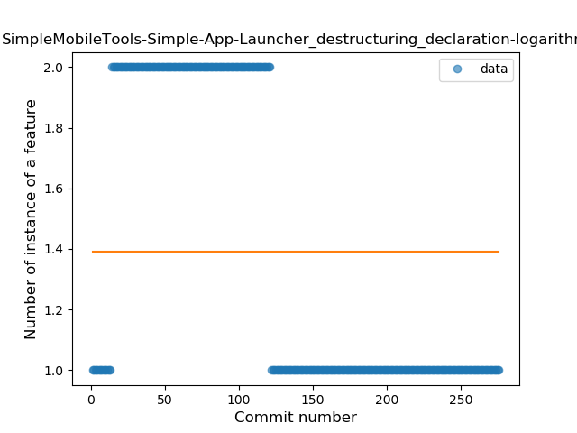
