## SimpleMobileTools-Simple-Calculator
----
#### Metrics provided by Detekt
* Number of lines of code 1310
* Number of Kotlin files: 28
* Cyclomatic complexity: 220
* Cyclomatic complexity by thousands of lines: 293 

----
**7** features analyzed

*	<a href="#type_inference">Type Inference</a> 
*	<a href="#lambda">Lambda</a> 
*	<a href="#when_expr">When expression</a> 
*	<a href="#companion_object">Companion Object</a> 
*	<a href="#unsafe_call">Unsafe Call</a> 
*	<a href="#string_template">String Template</a> 
*	<a href="#range_expr">Range Expression</a> 

### <a name="type_inference">Type Inference</a>
----
#### Functions
* **Sudden Rise - Exponential:** 
    * **R_Squared:** 0.75153699
* **Constant Rise - Linear:** 
    * **R_Squared:** 0.61723131
* **Sudden Rise Plateau - Logarithm:** 
    * **R_Squared:** 0.38175576

**Plots** :chart_with_upwards_trend:
-----

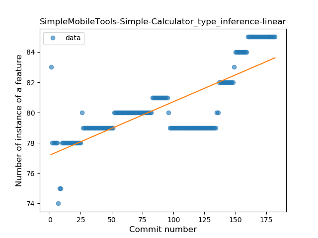
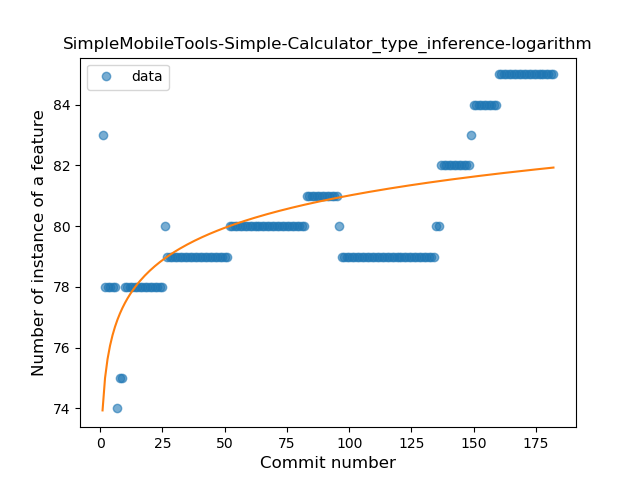
### <a name="lambda">Lambda</a>
----
#### Functions
* **Sudden Rise Plateau - Logarithm:** 
    * **R_Squared:** 0.91046515
* **Constant Rise - Linear:** 
    * **R_Squared:** 0.77976455

**Plots** :chart_with_upwards_trend:
-----

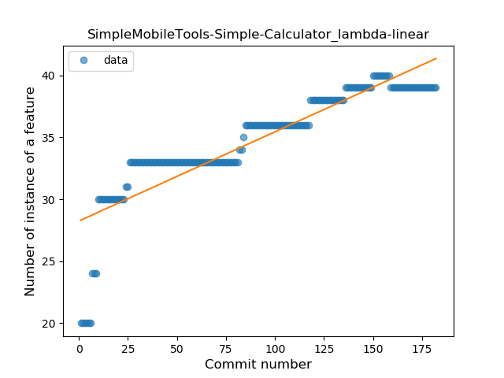
### <a name="when_expr">When expression</a>
----
#### Functions
* **Sudden Rise Plateau - Logarithm:** 
    * **R_Squared:** 0.45330546
* **Constant Rise - Linear:** 
    * **R_Squared:** 0.14101984

**Plots** :chart_with_upwards_trend:
-----

### <a name="companion_object">Companion Object</a>
----
#### Functions
* **Sudden Decline - Exponential:** 
    * **R_Squared:** 0.134415
* **Constant Decline - Linear:** 
    * **R_Squared:** 0.04233434
* **Sudden Rise Plateau - Logarithm:** 
    * **R_Squared:** -0.0

**Plots** :chart_with_upwards_trend:
-----

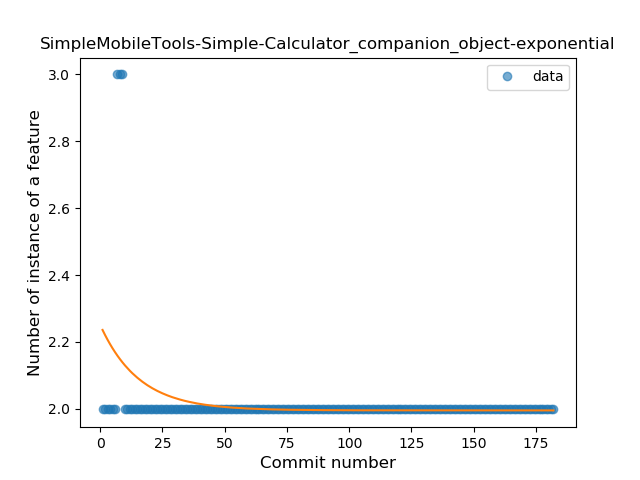
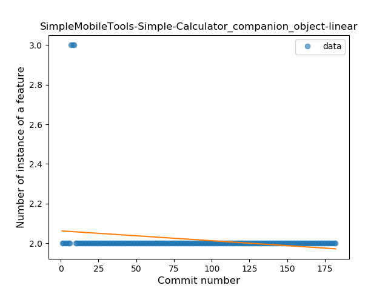
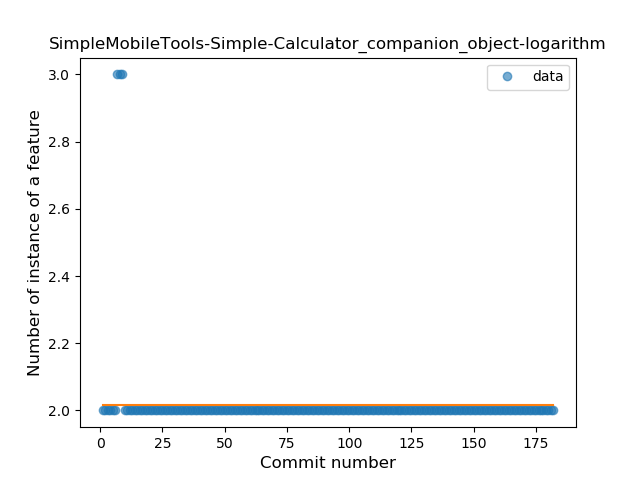
### <a name="unsafe_call">Unsafe Call</a>
----
#### Functions
* **Sudden Decline - Exponential:** 
    * **R_Squared:** 0.80741913
* **Constant Decline - Linear:** 
    * **R_Squared:** 0.14101984
* **Sudden Rise Plateau - Logarithm:** 
    * **R_Squared:** -0.0

**Plots** :chart_with_upwards_trend:
-----

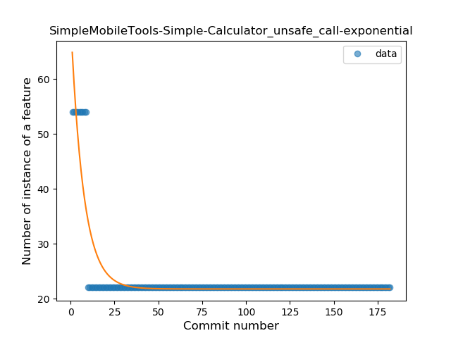
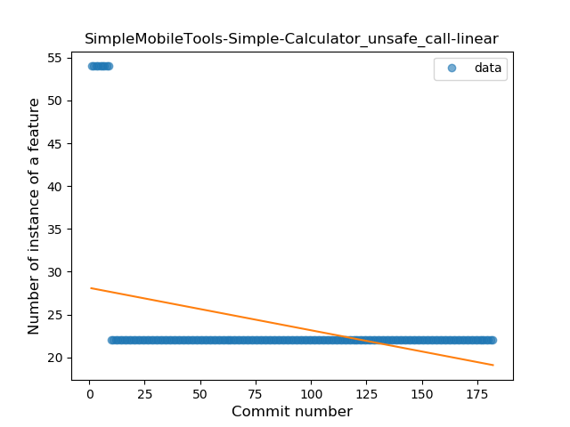
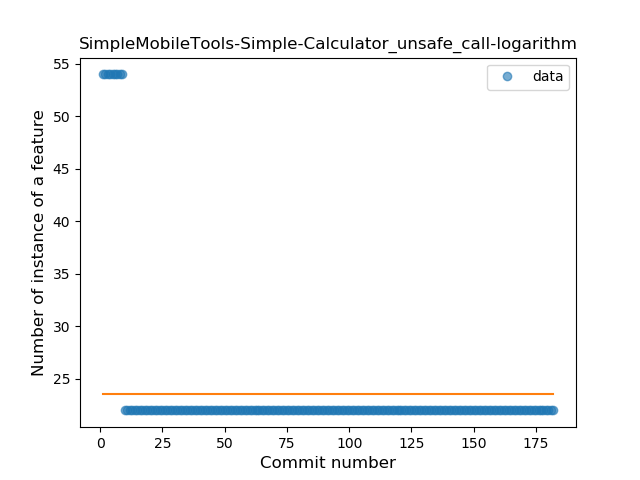
### <a name="string_template">String Template</a>
----
#### Functions
* **Sudden Decline - Exponential:** 
    * **R_Squared:** 1.0
* **Constant Decline - Linear:** 
    * **R_Squared:** 0.01724138
* **Sudden Rise Plateau - Logarithm:** 
    * **R_Squared:** -0.0

**Plots** :chart_with_upwards_trend:
-----

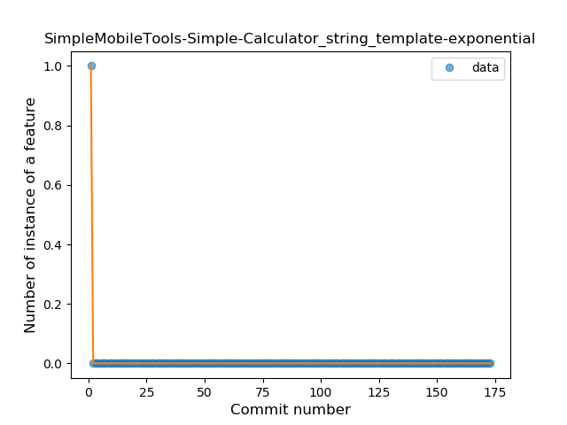
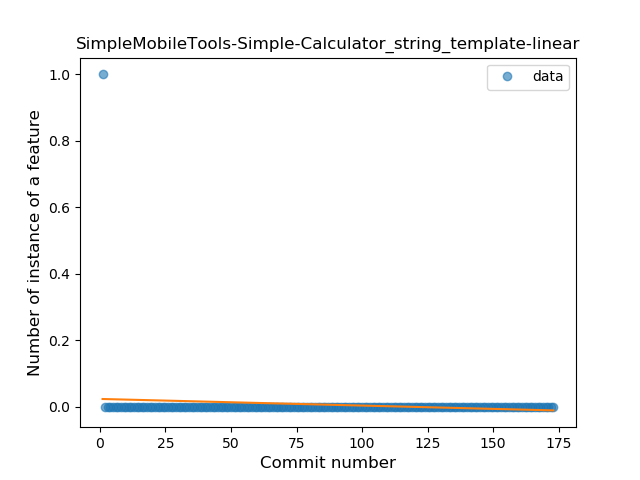
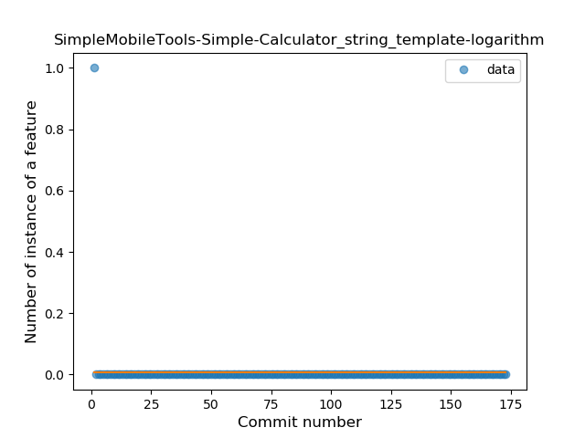
### <a name="range_expr">Range Expression</a>
----
#### Functions
* **Plateau Sudden Rise - Binary Sigmoid:** 
    * **R_Squared:** 1.0
* **Sudden Rise - Exponential:** 
    * **R_Squared:** 0.77918826
* **Constant Rise - Linear:** 
    * **R_Squared:** 0.47373697
* **Sudden Rise Plateau - Logarithm:** 
    * **R_Squared:** 0.21003499

**Plots** :chart_with_upwards_trend:
-----

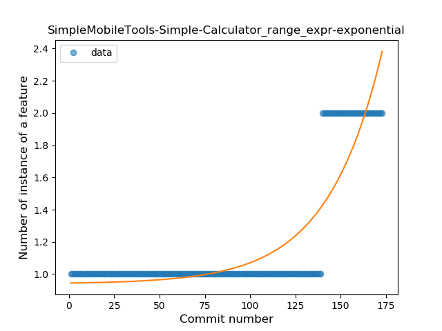
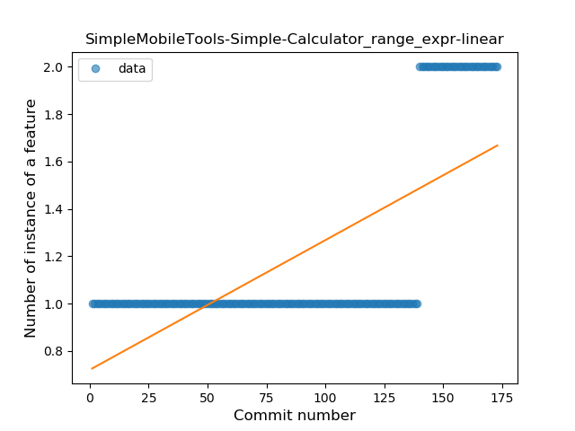
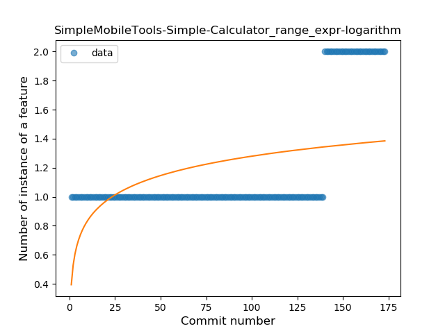
