## SimpleMobileTools-Simple-Calendar
----
#### Metrics provided by Detekt
* Number of lines of code 10673
* Number of Kotlin files: 94
* Cyclomatic complexity: 2046
* Cyclomatic complexity by thousands of lines: 329 

----
**15** features analyzed

*	<a href="#type_inference">Type Inference</a> 
*	<a href="#lambda">Lambda</a> 
*	<a href="#safe_call">Safe Call</a> 
*	<a href="#when_expr">When expression</a> 
*	<a href="#companion_object">Companion Object</a> 
*	<a href="#unsafe_call">Unsafe Call</a> 
*	<a href="#string_template">String Template</a> 
*	<a href="#func_with_default_value">Function with Default Value</a> 
*	<a href="#singleton">Singleton</a> 
*	<a href="#smart_cast">Smart Cast</a> 
*	<a href="#range_expr">Range Expression</a> 
*	<a href="#func_call_with_named_arg">Function call with Named Argument</a> 
*	<a href="#data_class">Data Class</a> 
*	<a href="#extension_function">Extension Function</a> 
*	<a href="#destructuring_declaration">Destructuring Declaration</a> 

### <a name="type_inference">Type Inference</a>
----
#### Functions
* **Constant Rise - Linear:** 
    * **R_Squared:** 0.91567368
* **Sudden Rise Plateau - Logarithm:** 
    * **R_Squared:** 0.54842512
* **Plateau Sudden Rise - Binary Sigmoid:** 
    * **R_Squared:** 0.14508919

**Plots** :chart_with_upwards_trend:
-----

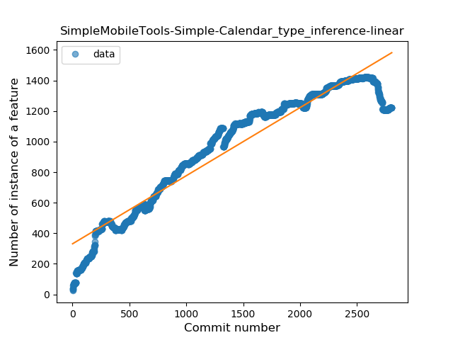
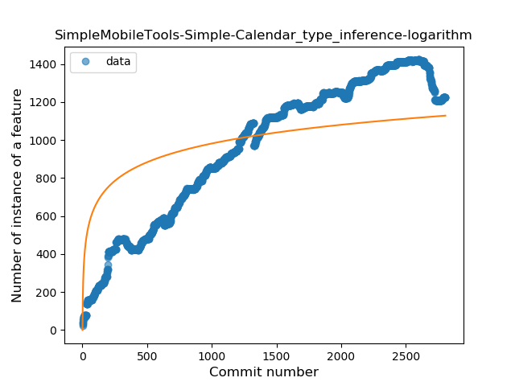
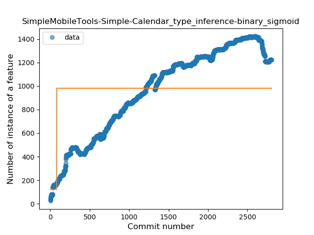
### <a name="lambda">Lambda</a>
----
#### Functions
* **Constant Rise - Linear:** 
    * **R_Squared:** 0.95151667
* **Sudden Rise Plateau - Logarithm:** 
    * **R_Squared:** 0.48501883
* **Plateau Sudden Rise - Binary Sigmoid:** 
    * **R_Squared:** 0.34924739

**Plots** :chart_with_upwards_trend:
-----

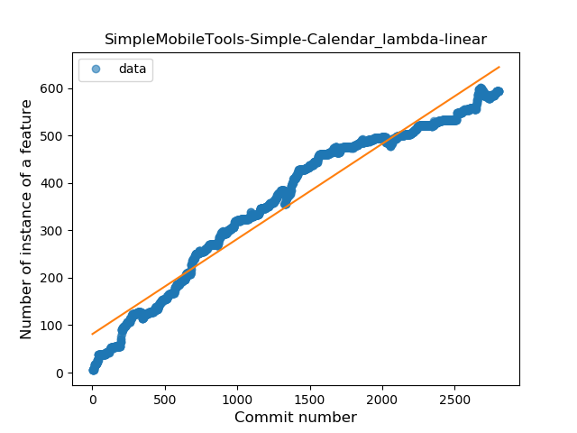
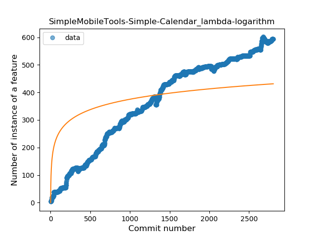
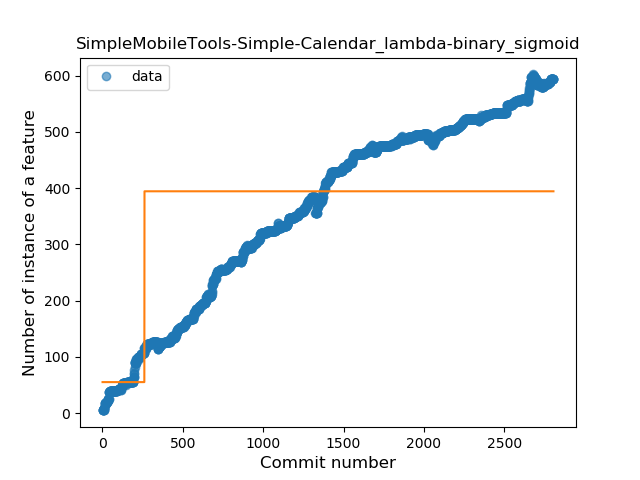
### <a name="safe_call">Safe Call</a>
----
#### Functions
* **Constant Rise - Linear:** 
    * **R_Squared:** 0.85314434
* **Sudden Rise Plateau - Logarithm:** 
    * **R_Squared:** 0.57902227
* **Plateau Sudden Rise - Binary Sigmoid:** 
    * **R_Squared:** 0.24223667

**Plots** :chart_with_upwards_trend:
-----

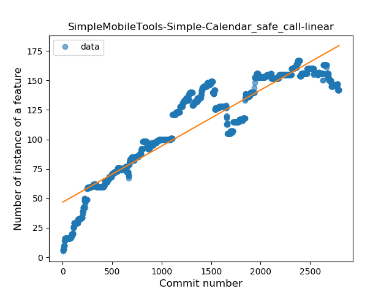
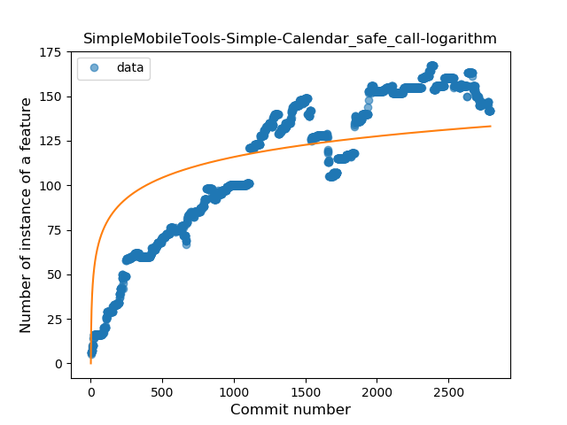

### <a name="when_expr">When expression</a>
----
#### Functions
* **Plateau Gradual Rise - Sigmoid:** 
    * **R_Squared:** 0.93930204
* **Constant Rise - Linear:** 
    * **R_Squared:** 0.90926983
* **Sudden Rise Plateau - Logarithm:** 
    * **R_Squared:** 0.42508748

**Plots** :chart_with_upwards_trend:
-----

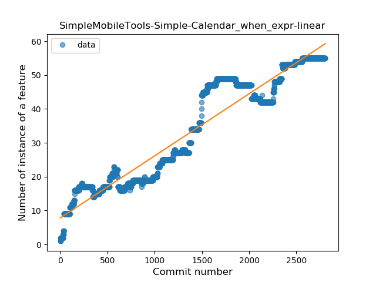
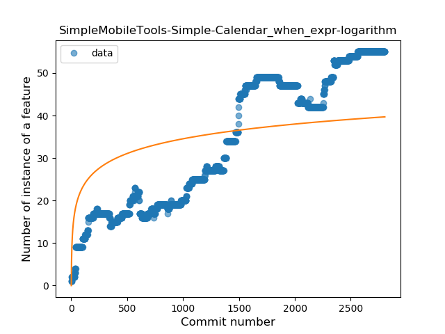
### <a name="companion_object">Companion Object</a>
----
#### Functions
* **Constant Decline - Linear:** 
    * **R_Squared:** 0.17484692
* **Sudden Rise Plateau - Logarithm:** 
    * **R_Squared:** -0.0

**Plots** :chart_with_upwards_trend:
-----

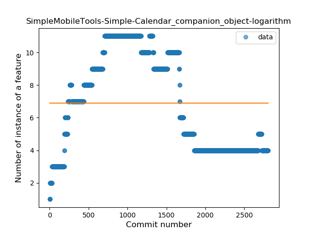
### <a name="unsafe_call">Unsafe Call</a>
----
#### Functions
* **Sudden Rise - Exponential:** 
    * **R_Squared:** 0.88241362
* **Constant Rise - Linear:** 
    * **R_Squared:** 0.82059111
* **Plateau Gradual Rise - Sigmoid:** 
    * **R_Squared:** 0.74206602
* **Sudden Rise Plateau - Logarithm:** 
    * **R_Squared:** 0.23087765

**Plots** :chart_with_upwards_trend:
-----

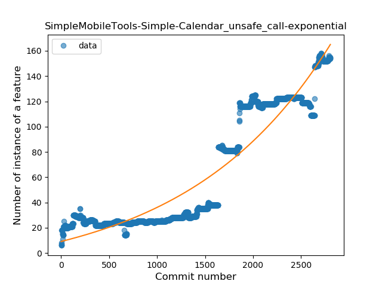
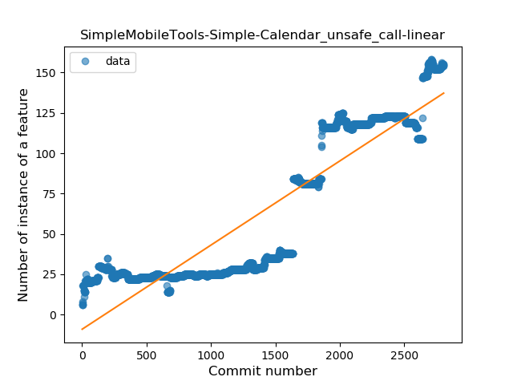
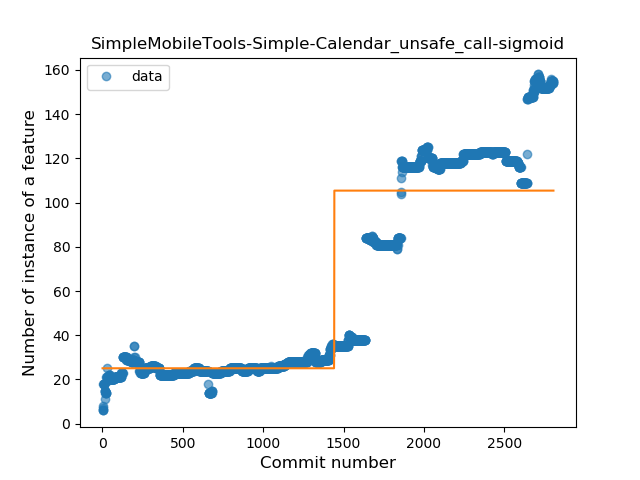
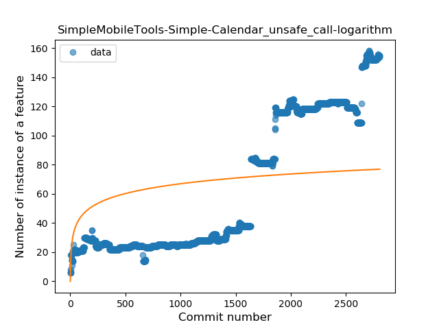
### <a name="string_template">String Template</a>
----
#### Functions
* **Constant Rise - Linear:** 
    * **R_Squared:** 0.69251791
* **Sudden Rise - Exponential:** 
    * **R_Squared:** 0.68896162
* **Sudden Rise Plateau - Logarithm:** 
    * **R_Squared:** 0.44286739
* **Plateau Sudden Rise - Binary Sigmoid:** 
    * **R_Squared:** 0.17400983

**Plots** :chart_with_upwards_trend:
-----

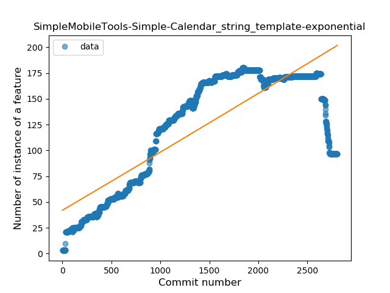
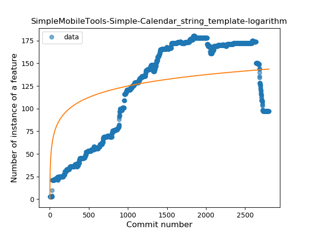
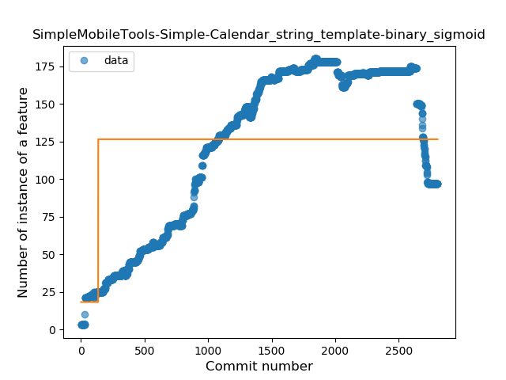
### <a name="func_with_default_value">Function with Default Value</a>
----
#### Functions
* **Constant Rise - Linear:** 
    * **R_Squared:** 0.80019412
* **Sudden Rise - Exponential:** 
    * **R_Squared:** 0.79755883
* **Sudden Rise Plateau - Logarithm:** 
    * **R_Squared:** 0.44952332
* **Plateau Sudden Rise - Binary Sigmoid:** 
    * **R_Squared:** 0.02198024

**Plots** :chart_with_upwards_trend:
-----

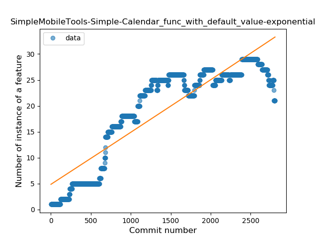
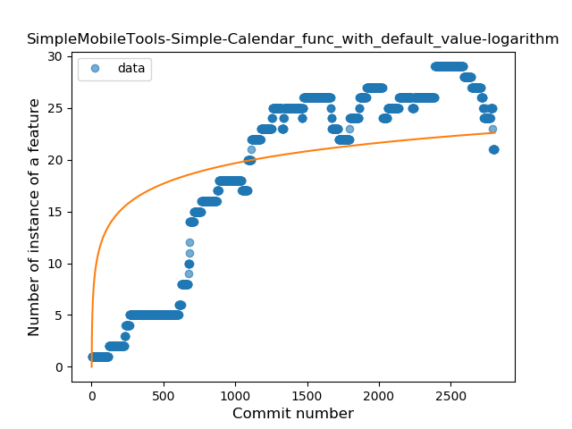
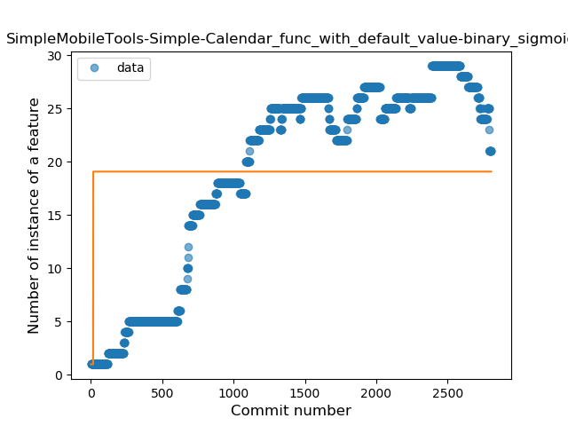
### <a name="singleton">Singleton</a>
----
#### Functions
* **Sudden Rise - Exponential:** 
    * **R_Squared:** 0.44995017
* **Constant Rise - Linear:** 
    * **R_Squared:** 0.00163225
* **Sudden Rise Plateau - Logarithm:** 
    * **R_Squared:** -0.0

**Plots** :chart_with_upwards_trend:
-----

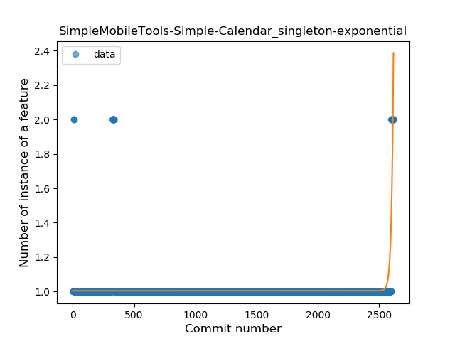
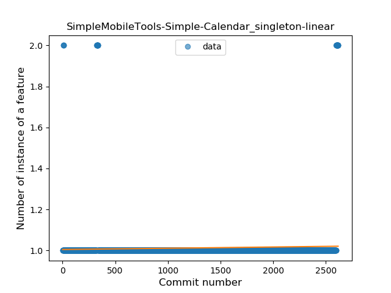
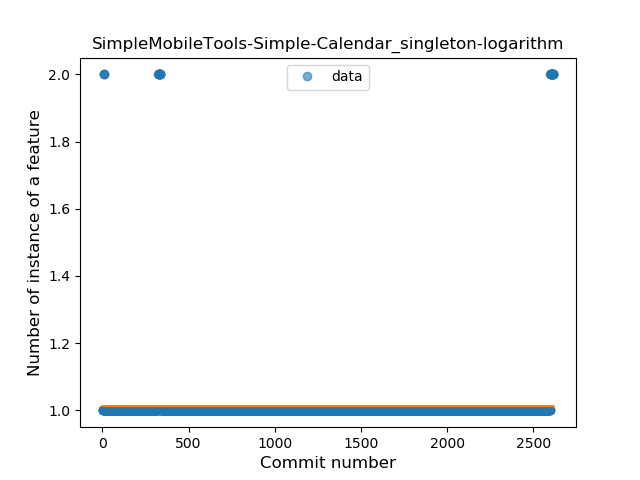
### <a name="smart_cast">Smart Cast</a>
----
#### Functions
* **Sudden Rise - Exponential:** 
    * **R_Squared:** 0.94211156
* **Constant Rise - Linear:** 
    * **R_Squared:** 0.91392399
* **Sudden Rise Plateau - Logarithm:** 
    * **R_Squared:** 0.3019183

**Plots** :chart_with_upwards_trend:
-----

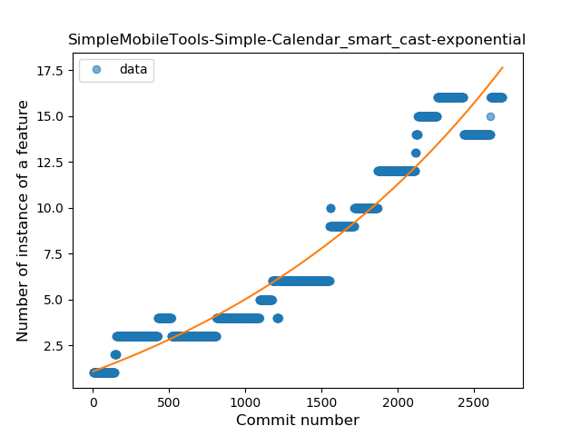
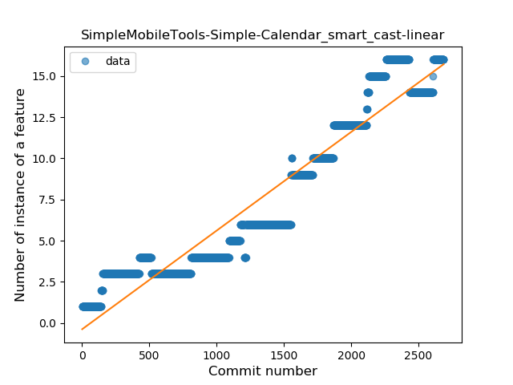
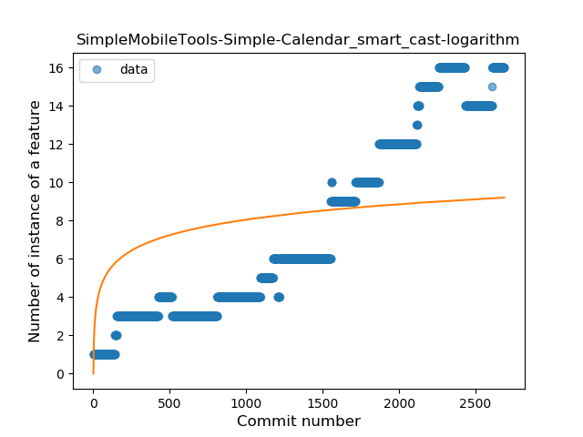
### <a name="range_expr">Range Expression</a>
----
#### Functions
* **Constant Rise - Linear:** 
    * **R_Squared:** 0.89836539
* **Sudden Rise Plateau - Logarithm:** 
    * **R_Squared:** 0.62336665

**Plots** :chart_with_upwards_trend:
-----

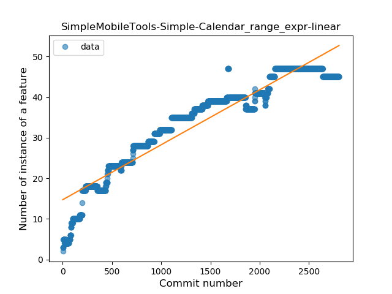
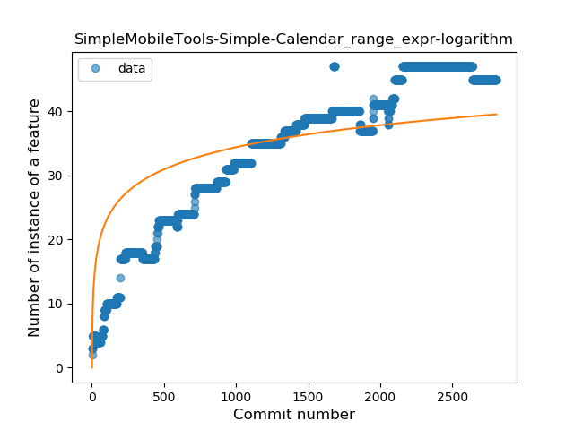
### <a name="func_call_with_named_arg">Function call with Named Argument</a>
----
#### Functions
* **Sudden Rise - Exponential:** 
    * **R_Squared:** 0.80591114
* **Constant Rise - Linear:** 
    * **R_Squared:** 0.73698836
* **Sudden Rise Plateau - Logarithm:** 
    * **R_Squared:** 0.17806406

**Plots** :chart_with_upwards_trend:
-----

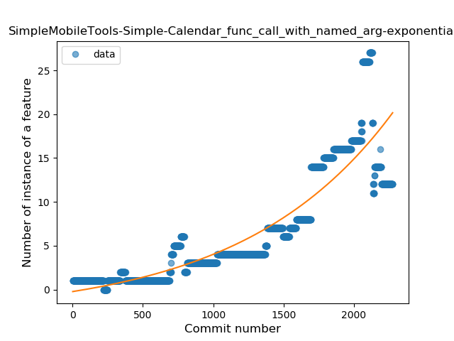
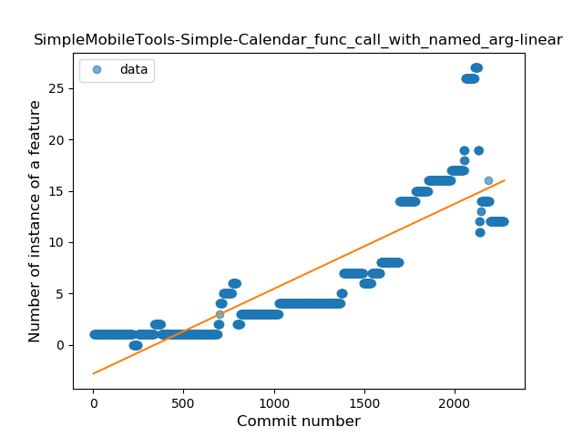

### <a name="data_class">Data Class</a>
----
#### Functions
* **Constant Rise - Linear:** 
    * **R_Squared:** 0.82814256
* **Sudden Rise Plateau - Logarithm:** 
    * **R_Squared:** 0.56062329
* **Plateau Sudden Rise - Binary Sigmoid:** 
    * **R_Squared:** 0.05852399

**Plots** :chart_with_upwards_trend:
-----

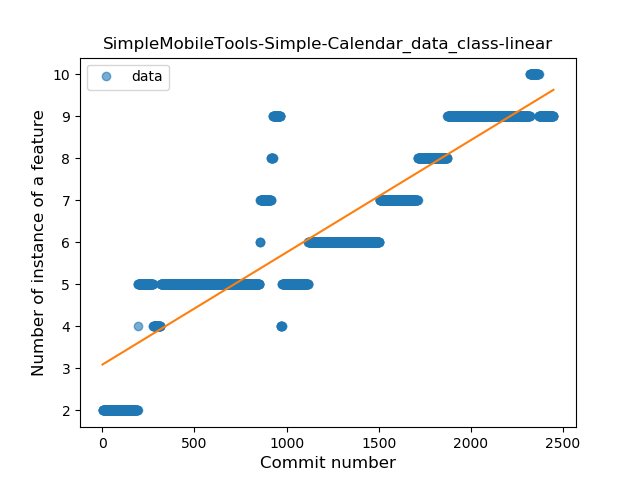
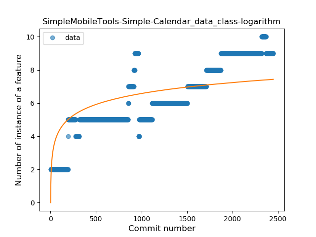
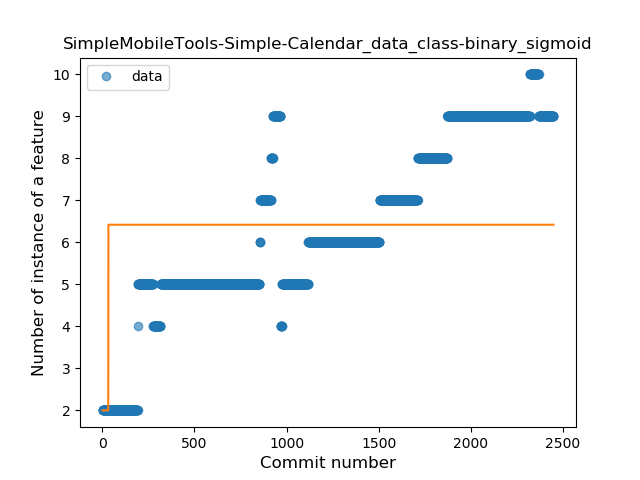
### <a name="extension_function">Extension Function</a>
----
#### Functions
* **Constant Rise - Linear:** 
    * **R_Squared:** 0.86206064
* **Sudden Rise Plateau - Logarithm:** 
    * **R_Squared:** 0.47662875
* **Plateau Sudden Rise - Binary Sigmoid:** 
    * **R_Squared:** 0.04790677

**Plots** :chart_with_upwards_trend:
-----

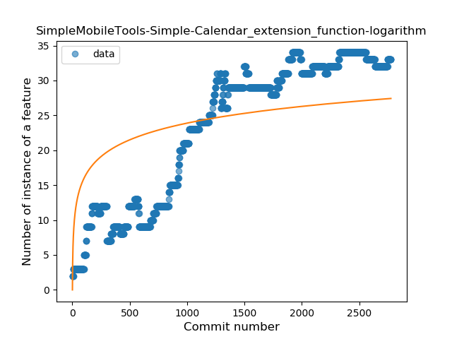
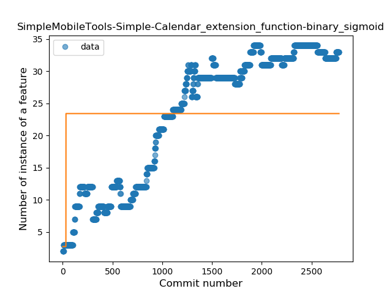
### <a name="destructuring_declaration">Destructuring Declaration</a>
----
#### Functions
* **Constant Decline - Linear:** 
    * **R_Squared:** 0.15107176
* **Plateau Gradual Rise - Sigmoid:** 
    * **R_Squared:** 0.01258398
* **Sudden Rise Plateau - Logarithm:** 
    * **R_Squared:** -0.0

**Plots** :chart_with_upwards_trend:
-----

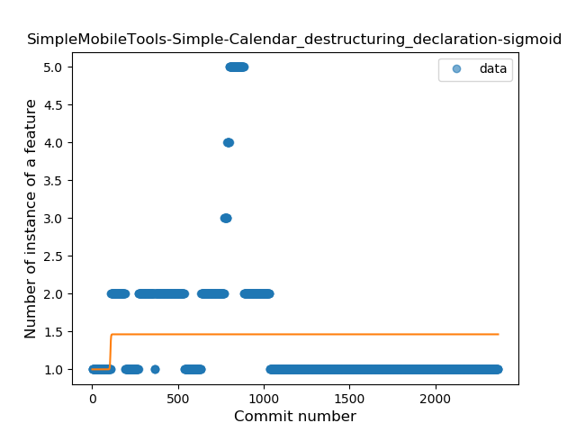
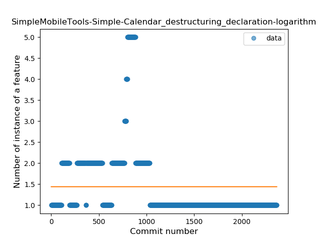
