## SimpleMobileTools-Simple-Camera
----
#### Metrics provided by Detekt
* Number of lines of code 2480
* Number of Kotlin files: 18
* Cyclomatic complexity: 487
* Cyclomatic complexity by thousands of lines: 315 

----
**13** features analyzed

*	<a href="#type_inference">Type Inference</a> 
*	<a href="#lambda">Lambda</a> 
*	<a href="#safe_call">Safe Call</a> 
*	<a href="#when_expr">When expression</a> 
*	<a href="#companion_object">Companion Object</a> 
*	<a href="#unsafe_call">Unsafe Call</a> 
*	<a href="#string_template">String Template</a> 
*	<a href="#func_with_default_value">Function with Default Value</a> 
*	<a href="#singleton">Singleton</a> 
*	<a href="#smart_cast">Smart Cast</a> 
*	<a href="#range_expr">Range Expression</a> 
*	<a href="#data_class">Data Class</a> 
*	<a href="#extension_function">Extension Function</a> 

### <a name="type_inference">Type Inference</a>
----
#### Functions
* **Constant Rise - Linear:** 
    * **R_Squared:** 0.84883894
* **Sudden Rise - Exponential:** 
    * **R_Squared:** 0.8561894
* **Sudden Rise Plateau - Logarithm:** 
    * **R_Squared:** 0.52021397
* **Plateau Sudden Rise - Binary Sigmoid:** 
    * **R_Squared:** 0.43494309

**Plots** :chart_with_upwards_trend:
-----

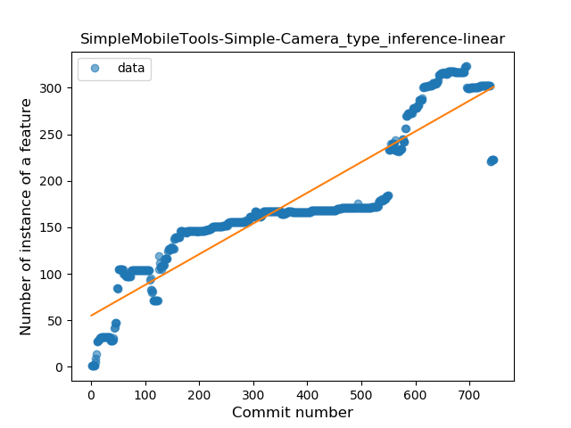
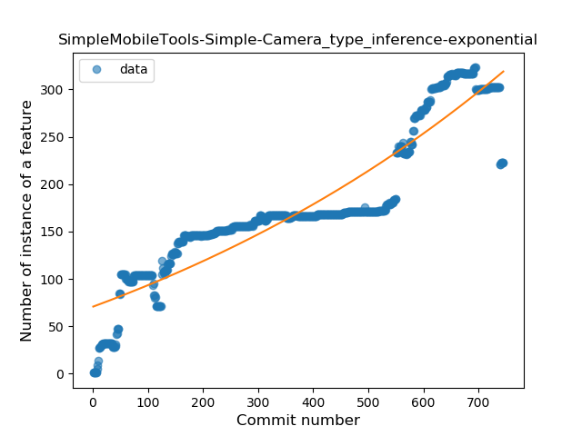
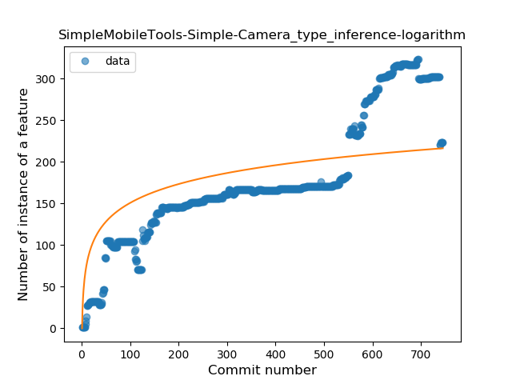
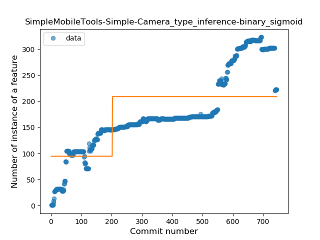
### <a name="lambda">Lambda</a>
----
#### Functions
* **Constant Rise - Linear:** 
    * **R_Squared:** 0.92148611
* **Sudden Rise Plateau - Logarithm:** 
    * **R_Squared:** 0.56843902
* **Plateau Gradual Rise - Sigmoid:** 
    * **R_Squared:** 0.33805689

**Plots** :chart_with_upwards_trend:
-----

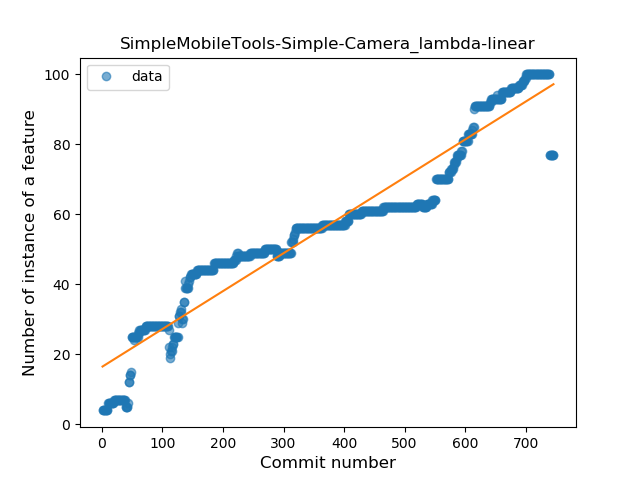
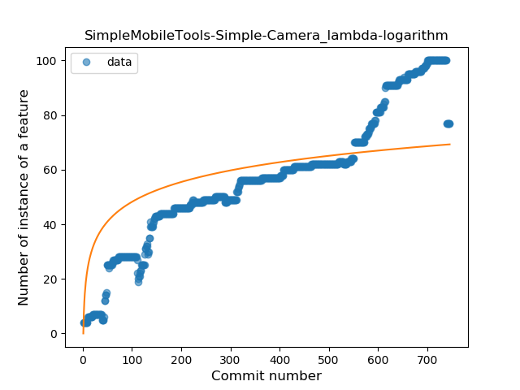
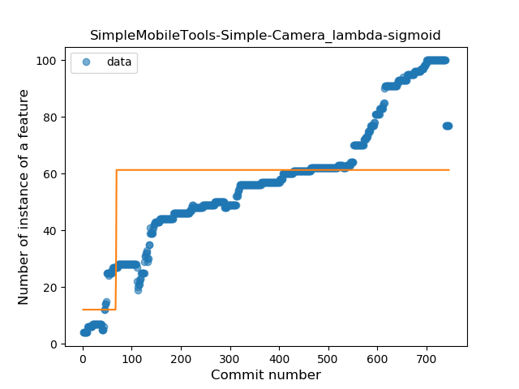
### <a name="safe_call">Safe Call</a>
----
#### Functions
* **Constant Rise - Linear:** 
    * **R_Squared:** 0.82502361
* **Sudden Rise Plateau - Logarithm:** 
    * **R_Squared:** 0.63888162
* **Plateau Sudden Rise - Binary Sigmoid:** 
    * **R_Squared:** 0.05805301

**Plots** :chart_with_upwards_trend:
-----

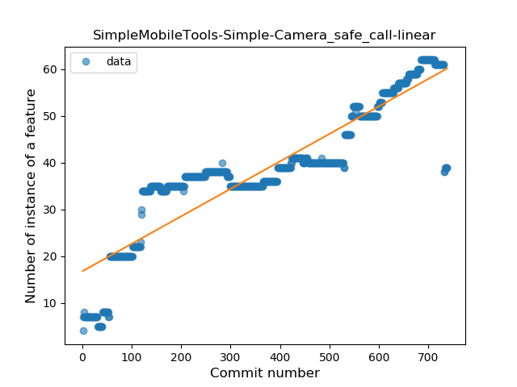
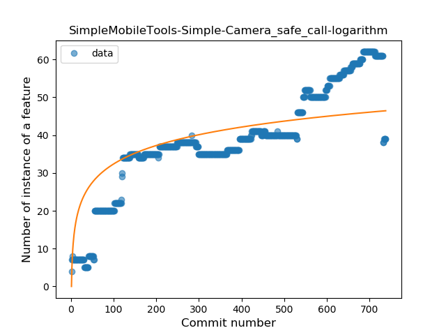
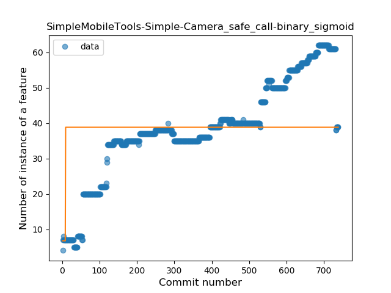
### <a name="when_expr">When expression</a>
----
#### Functions
* **Plateau Gradual Rise - Sigmoid:** 
    * **R_Squared:** 0.65182372
* **Sudden Rise - Exponential:** 
    * **R_Squared:** 0.64181377
* **Constant Rise - Linear:** 
    * **R_Squared:** 0.62431804
* **Sudden Rise Plateau - Logarithm:** 
    * **R_Squared:** 0.41344538

**Plots** :chart_with_upwards_trend:
-----

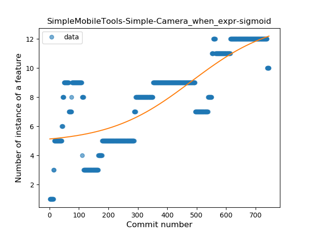
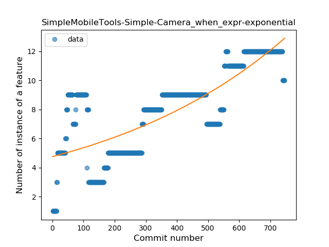
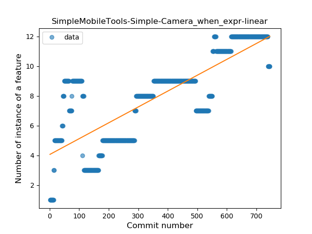
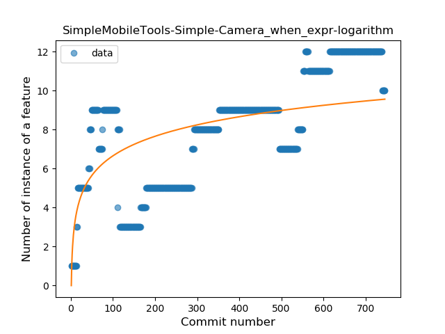
### <a name="companion_object">Companion Object</a>
----
#### Functions
* **Constant Decline - Linear:** 
    * **R_Squared:** 0.64519844
* **Sudden Rise Plateau - Logarithm:** 
    * **R_Squared:** 0.0
* **Plateau Sudden Rise - Binary Sigmoid:** 
    * **R_Squared:** 0.0070958

**Plots** :chart_with_upwards_trend:
-----

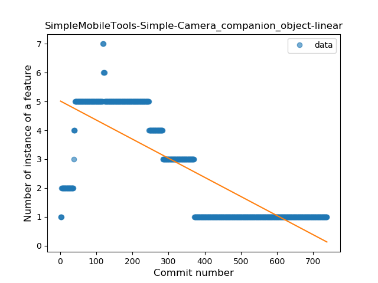

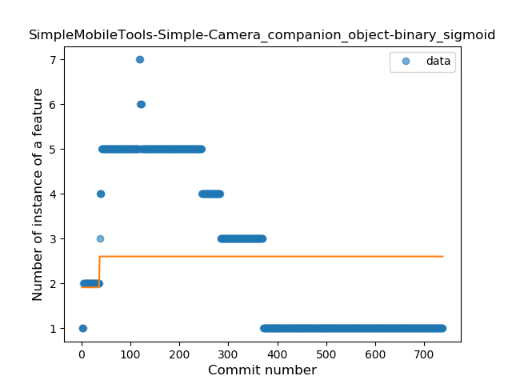
### <a name="unsafe_call">Unsafe Call</a>
----
#### Functions
* **Constant Rise - Linear:** 
    * **R_Squared:** 0.81822305
* **Sudden Rise - Exponential:** 
    * **R_Squared:** 0.81879908
* **Sudden Rise Plateau - Logarithm:** 
    * **R_Squared:** 0.46503968
* **Plateau Sudden Rise - Binary Sigmoid:** 
    * **R_Squared:** 0.3551654

**Plots** :chart_with_upwards_trend:
-----

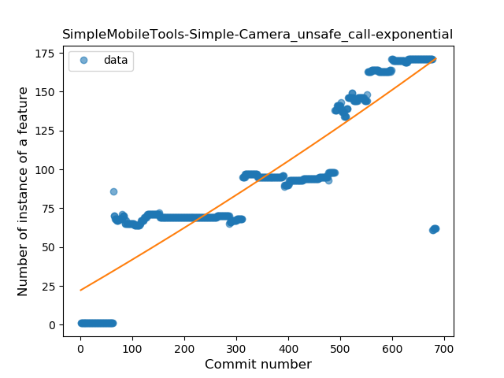
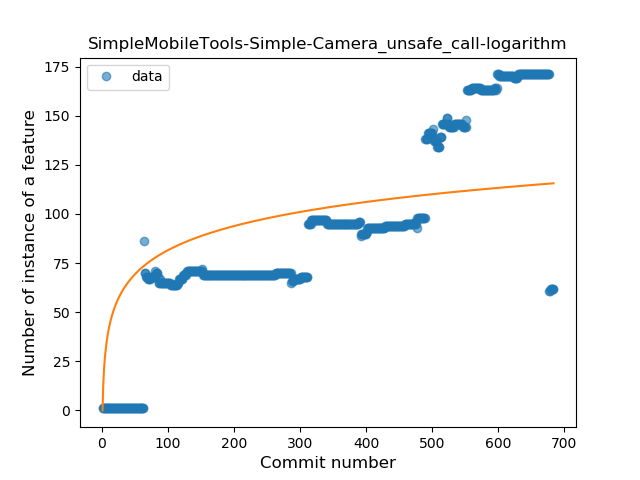

### <a name="string_template">String Template</a>
----
#### Functions
* **Plateau Gradual Decline - Sigmoid:** 
    * **R_Squared:** 0.35372491
* **Sudden Decline - Exponential:** 
    * **R_Squared:** 0.31880759
* **Constant Decline - Linear:** 
    * **R_Squared:** 0.07144043
* **Sudden Rise Plateau - Logarithm:** 
    * **R_Squared:** -0.0

**Plots** :chart_with_upwards_trend:
-----

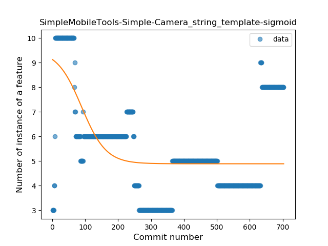
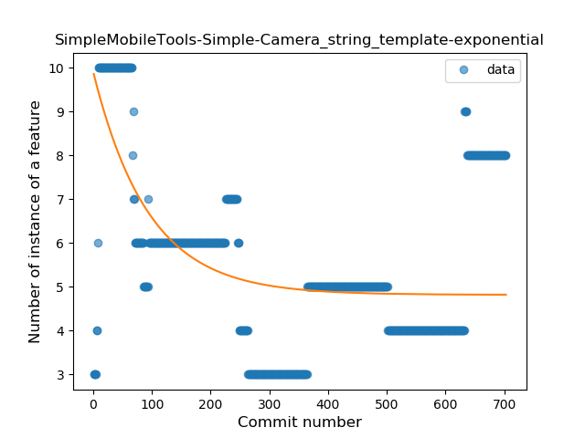
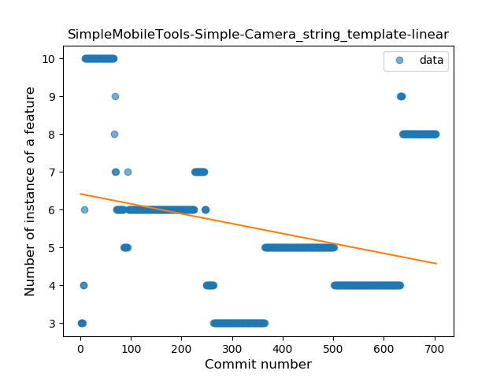
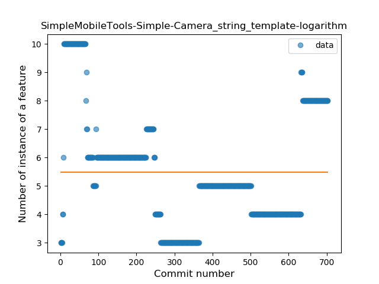
### <a name="func_with_default_value">Function with Default Value</a>
----
#### Functions
* **Plateau Gradual Rise - Sigmoid:** 
    * **R_Squared:** 0.92916866
* **Sudden Rise - Exponential:** 
    * **R_Squared:** 0.76757563
* **Constant Rise - Linear:** 
    * **R_Squared:** 0.72055556
* **Sudden Rise Plateau - Logarithm:** 
    * **R_Squared:** 0.31908689

**Plots** :chart_with_upwards_trend:
-----

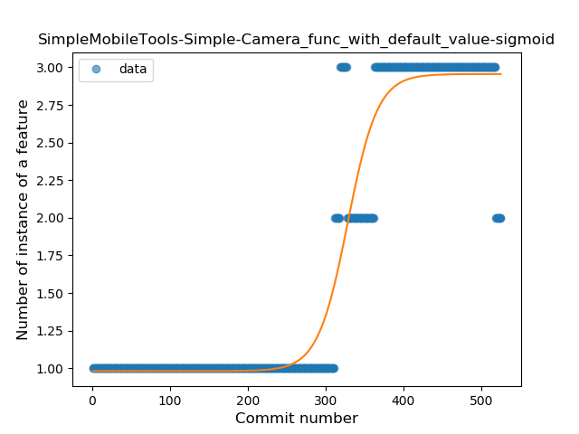
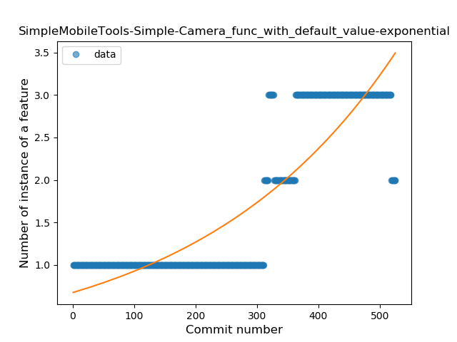
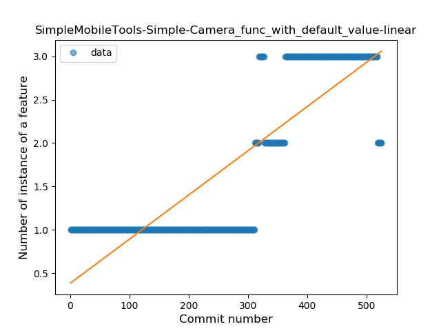
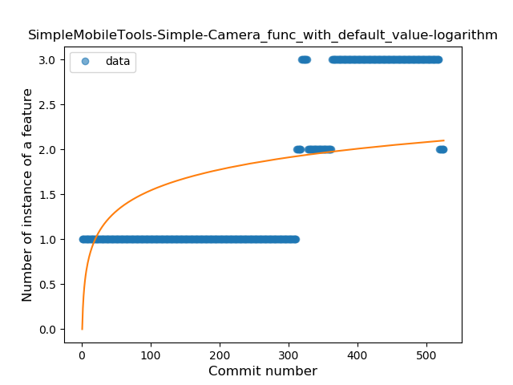
### <a name="singleton">Singleton</a>
----
#### Functions
* **Plateau Sudden Decline - Binary Sigmoid:** 
    * **R_Squared:** 1.0
* **Sudden Decline - Exponential:** 
    * **R_Squared:** 0.79486042
* **Constant Decline - Linear:** 
    * **R_Squared:** 0.29555053
* **Sudden Rise Plateau - Logarithm:** 
    * **R_Squared:** -0.0

**Plots** :chart_with_upwards_trend:
-----

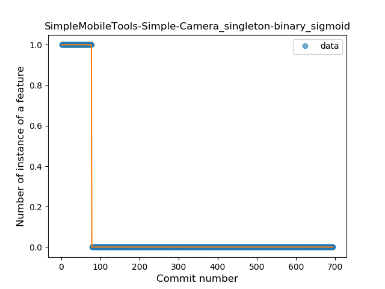
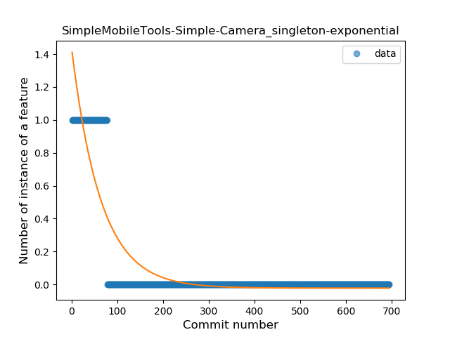

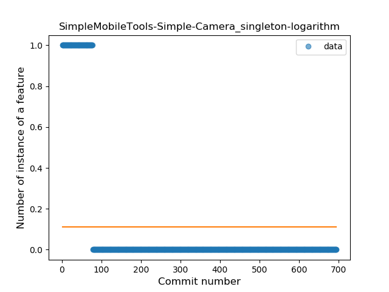
### <a name="smart_cast">Smart Cast</a>
----
#### Functions
* **Plateau Sudden Decline - Binary Sigmoid:** 
    * **R_Squared:** 0.88716602
* **Sudden Decline - Exponential:** 
    * **R_Squared:** 0.60638484
* **Constant Decline - Linear:** 
    * **R_Squared:** 0.22691801
* **Sudden Rise Plateau - Logarithm:** 
    * **R_Squared:** -0.0

**Plots** :chart_with_upwards_trend:
-----

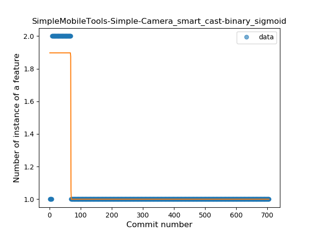
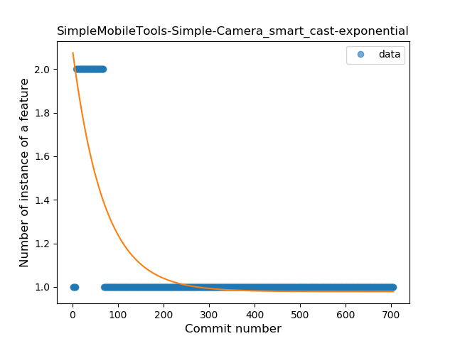
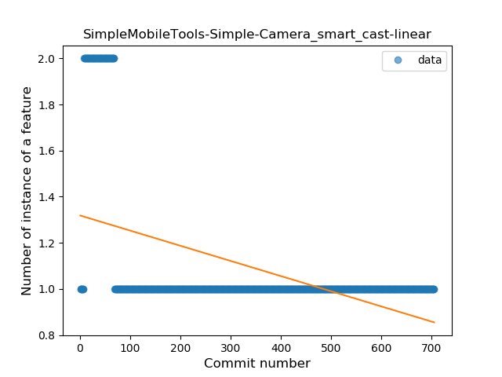
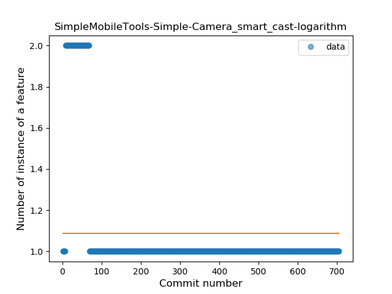
### <a name="range_expr">Range Expression</a>
----
#### Functions
* **Plateau Sudden Rise - Binary Sigmoid:** 
    * **R_Squared:** 0.89977174
* **Sudden Rise Plateau - Logarithm:** 
    * **R_Squared:** 0.51723481
* **Constant Rise - Linear:** 
    * **R_Squared:** 0.22549561

**Plots** :chart_with_upwards_trend:
-----

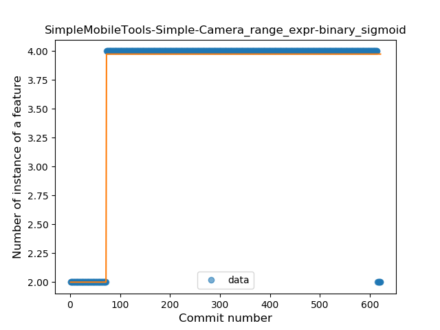
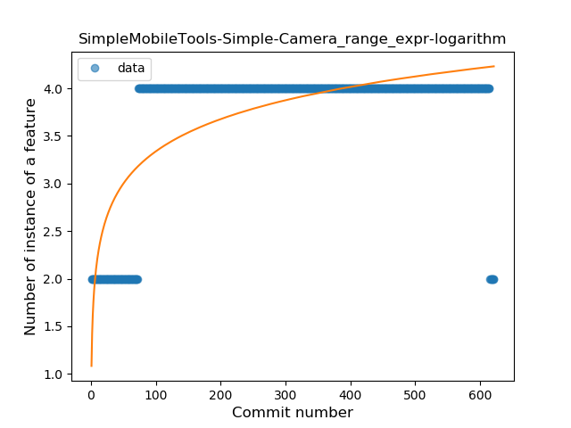
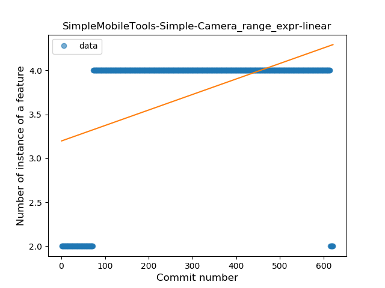
### <a name="data_class">Data Class</a>
----
#### Functions
* **Plateau Sudden Rise - Binary Sigmoid:** 
    * **R_Squared:** 1.0
* **Sudden Rise Plateau - Logarithm:** 
    * **R_Squared:** 0.56211526
* **Constant Rise - Linear:** 
    * **R_Squared:** 0.23295622

**Plots** :chart_with_upwards_trend:
-----

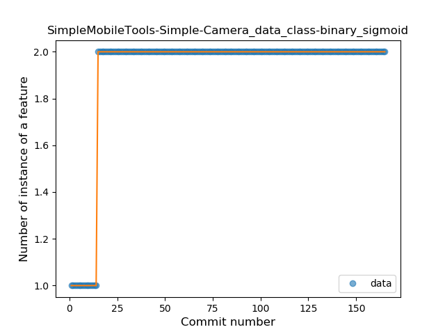
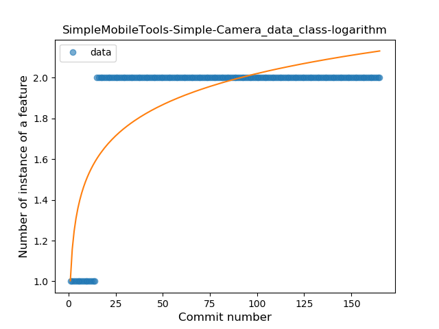
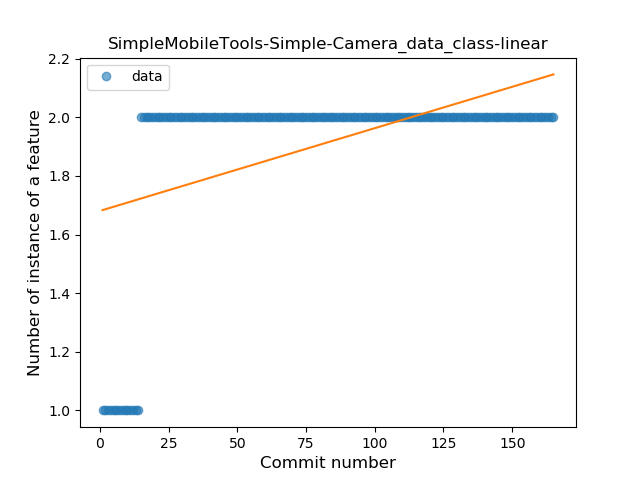
### <a name="extension_function">Extension Function</a>
----
#### Functions
* **Plateau Gradual Rise - Sigmoid:** 
    * **R_Squared:** 0.3504317
* **Sudden Rise Plateau - Logarithm:** 
    * **R_Squared:** 0.10527397
* **Constant Rise - Linear:** 
    * **R_Squared:** 0.00944556

**Plots** :chart_with_upwards_trend:
-----

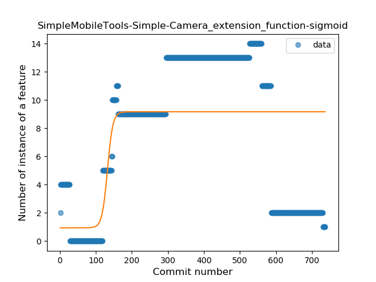
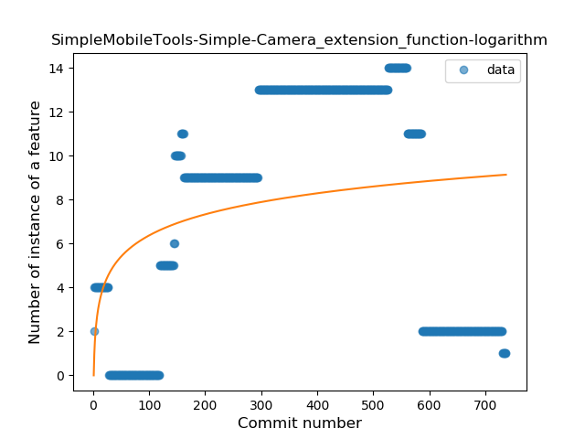
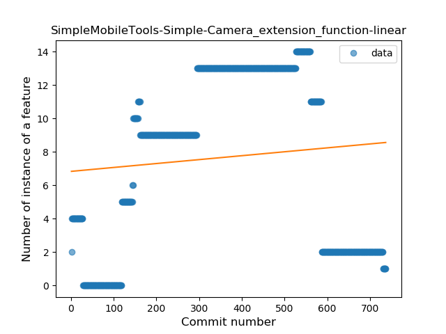
