## SimpleMobileTools-Simple-Clock
----
#### Metrics provided by Detekt
* Number of lines of code 3632
* Number of Kotlin files: 40
* Cyclomatic complexity: 574
* Cyclomatic complexity by thousands of lines: 273 

----
**12** features analyzed

*	<a href="#type_inference">Type Inference</a> 
*	<a href="#lambda">Lambda</a> 
*	<a href="#safe_call">Safe Call</a> 
*	<a href="#when_expr">When expression</a> 
*	<a href="#companion_object">Companion Object</a> 
*	<a href="#unsafe_call">Unsafe Call</a> 
*	<a href="#string_template">String Template</a> 
*	<a href="#smart_cast">Smart Cast</a> 
*	<a href="#range_expr">Range Expression</a> 
*	<a href="#func_call_with_named_arg">Function call with Named Argument</a> 
*	<a href="#data_class">Data Class</a> 
*	<a href="#extension_function">Extension Function</a> 

### <a name="type_inference">Type Inference</a>
----
#### Functions
* **Sudden Rise Plateau - Logarithm:** 
    * **R_Squared:** 0.81074878
* **Constant Rise - Linear:** 
    * **R_Squared:** 0.74774969
* **Plateau Sudden Rise - Binary Sigmoid:** 
    * **R_Squared:** 0.04868598

**Plots** :chart_with_upwards_trend:
-----

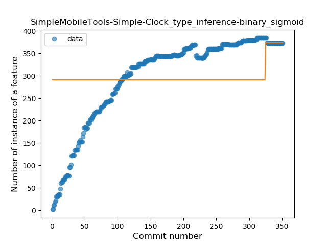
### <a name="lambda">Lambda</a>
----
#### Functions
* **Sudden Rise Plateau - Logarithm:** 
    * **R_Squared:** 0.8135954
* **Constant Rise - Linear:** 
    * **R_Squared:** 0.7236674
* **Plateau Sudden Rise - Binary Sigmoid:** 
    * **R_Squared:** 0.54096662

**Plots** :chart_with_upwards_trend:
-----

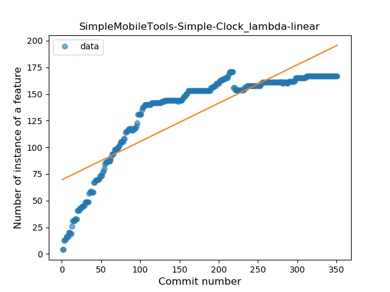
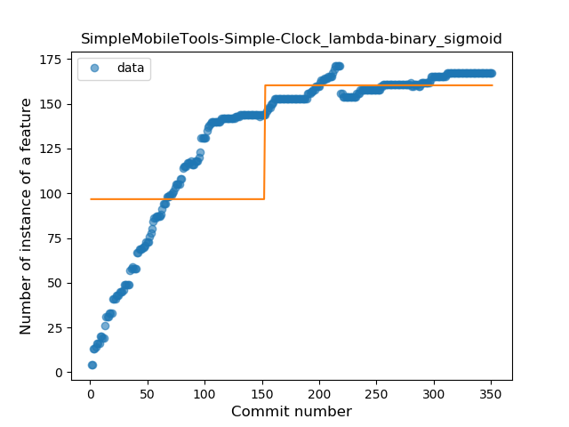
### <a name="safe_call">Safe Call</a>
----
#### Functions
* **Constant Rise - Linear:** 
    * **R_Squared:** 0.95965021
* **Sudden Rise - Exponential:** 
    * **R_Squared:** 0.96080561
* **Sudden Rise Plateau - Logarithm:** 
    * **R_Squared:** 0.6830488
* **Plateau Gradual Rise - Sigmoid:** 
    * **R_Squared:** 0.54391799

**Plots** :chart_with_upwards_trend:
-----

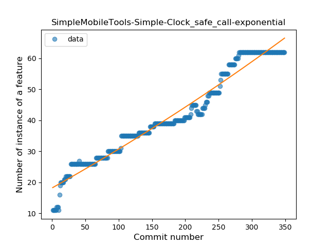
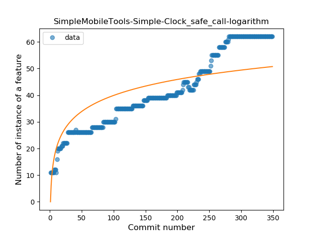
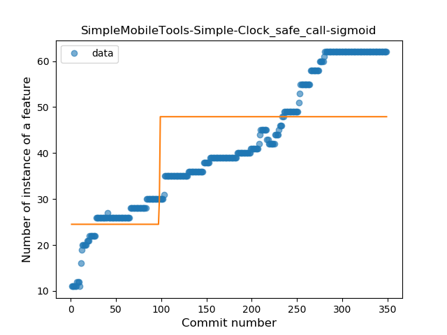
### <a name="when_expr">When expression</a>
----
#### Functions
* **Plateau Gradual Rise - Sigmoid:** 
    * **R_Squared:** 0.97067537
* **Constant Rise - Linear:** 
    * **R_Squared:** 0.76755482
* **Sudden Rise Plateau - Logarithm:** 
    * **R_Squared:** 0.72505822

**Plots** :chart_with_upwards_trend:
-----

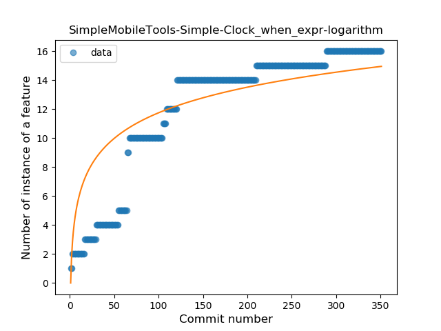
### <a name="companion_object">Companion Object</a>
----
#### Functions
* **Plateau Gradual Rise - Sigmoid:** 
    * **R_Squared:** 0.93929024
* **Sudden Rise Plateau - Logarithm:** 
    * **R_Squared:** 0.75705215
* **Constant Rise - Linear:** 
    * **R_Squared:** 0.41955613

**Plots** :chart_with_upwards_trend:
-----

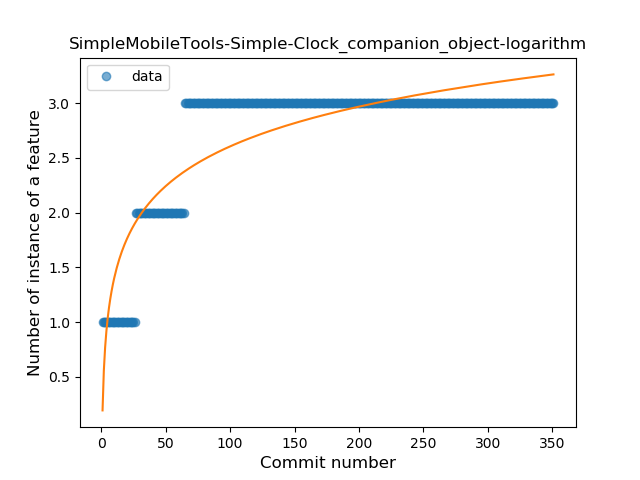
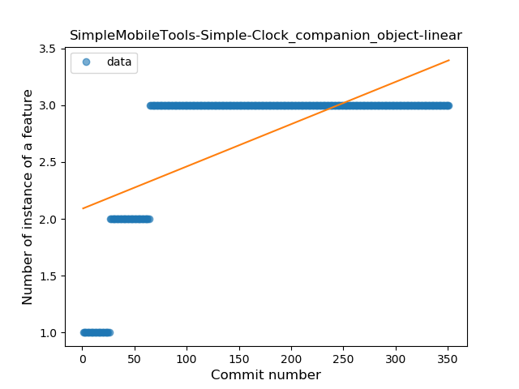
### <a name="unsafe_call">Unsafe Call</a>
----
#### Functions
* **Plateau Gradual Rise - Sigmoid:** 
    * **R_Squared:** 0.9855551
* **Sudden Rise Plateau - Logarithm:** 
    * **R_Squared:** 0.78067046
* **Constant Rise - Linear:** 
    * **R_Squared:** 0.76187697

**Plots** :chart_with_upwards_trend:
-----

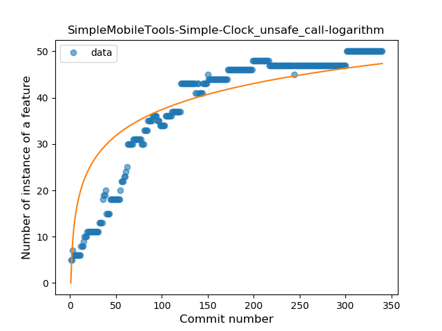
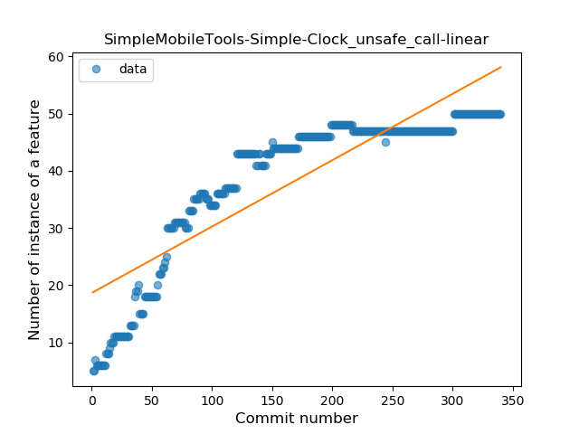
### <a name="string_template">String Template</a>
----
#### Functions
* **Sudden Rise Plateau - Logarithm:** 
    * **R_Squared:** 0.82037161
* **Constant Rise - Linear:** 
    * **R_Squared:** 0.69207851

**Plots** :chart_with_upwards_trend:
-----

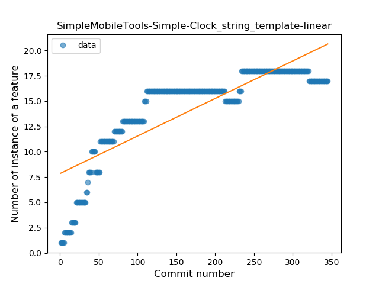
### <a name="smart_cast">Smart Cast</a>
----
#### Functions
* **Plateau Gradual Rise - Sigmoid:** 
    * **R_Squared:** 0.0709319
* **Constant Decline - Linear:** 
    * **R_Squared:** 0.0
* **Sudden Decline - Exponential:** 
    * **R_Squared:** -0.0
* **Sudden Rise Plateau - Logarithm:** 
    * **R_Squared:** 0.00783372

**Plots** :chart_with_upwards_trend:
-----

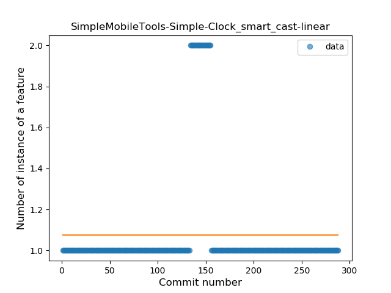
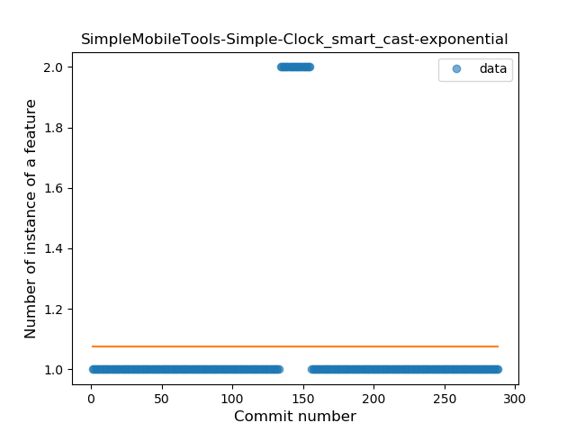
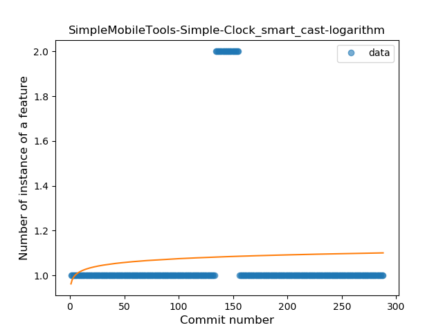
### <a name="range_expr">Range Expression</a>
----
#### Functions
* **Plateau Sudden Decline - Binary Sigmoid:** 
    * **R_Squared:** 0.85931953
* **Constant Decline - Linear:** 
    * **R_Squared:** 0.54969029
* **Sudden Rise Plateau - Logarithm:** 
    * **R_Squared:** -0.0

**Plots** :chart_with_upwards_trend:
-----

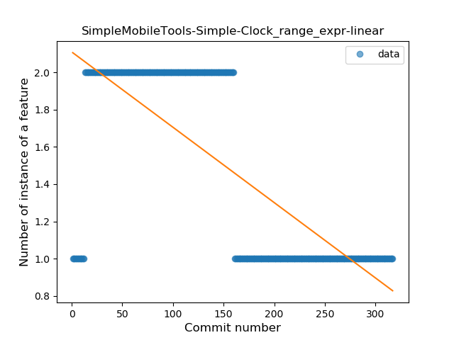
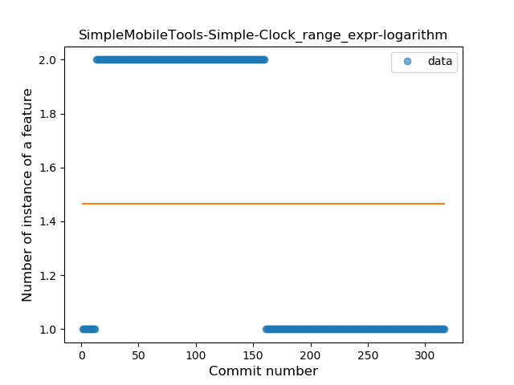
### <a name="func_call_with_named_arg">Function call with Named Argument</a>
----
#### Functions
* **Plateau Gradual Rise - Sigmoid:** 
    * **R_Squared:** 0.90602633
* **Constant Rise - Linear:** 
    * **R_Squared:** 0.88980279
* **Sudden Rise Plateau - Logarithm:** 
    * **R_Squared:** 0.59780812

**Plots** :chart_with_upwards_trend:
-----

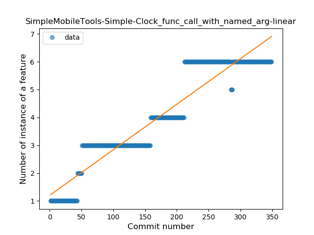
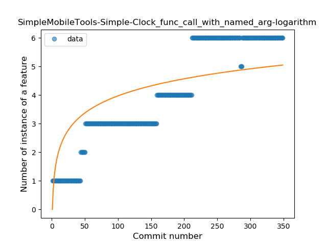
### <a name="data_class">Data Class</a>
----
#### Functions
* **Plateau Gradual Rise - Sigmoid:** 
    * **R_Squared:** 0.6253035
* **Sudden Rise Plateau - Logarithm:** 
    * **R_Squared:** 0.19879172
* **Constant Rise - Linear:** 
    * **R_Squared:** 0.00179013
* **Sudden Rise - Exponential:** 
    * **R_Squared:** 0.00175478

**Plots** :chart_with_upwards_trend:
-----

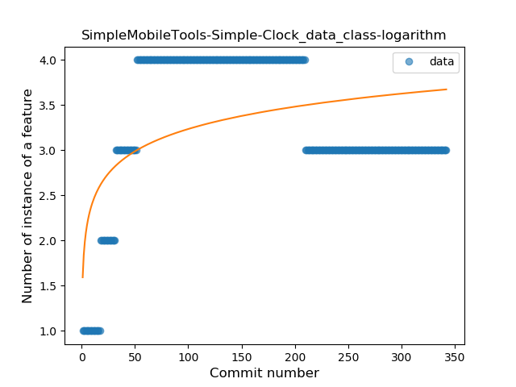
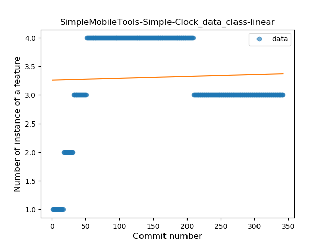
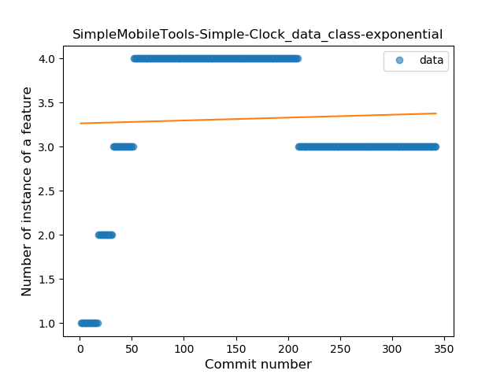
### <a name="extension_function">Extension Function</a>
----
#### Functions
* **Constant Rise - Linear:** 
    * **R_Squared:** 0.72698872
* **Sudden Rise Plateau - Logarithm:** 
    * **R_Squared:** 0.67595332
* **Plateau Sudden Rise - Binary Sigmoid:** 
    * **R_Squared:** 0.52657341

**Plots** :chart_with_upwards_trend:
-----

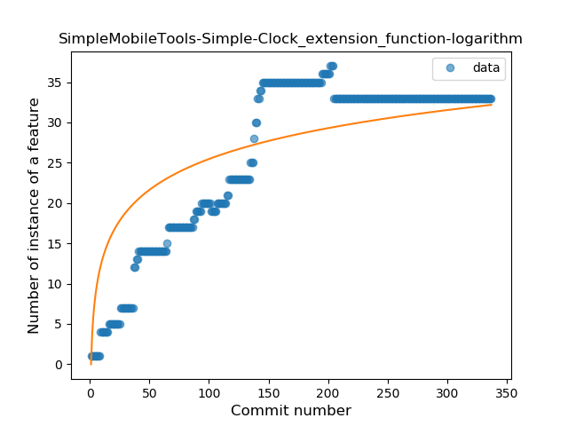
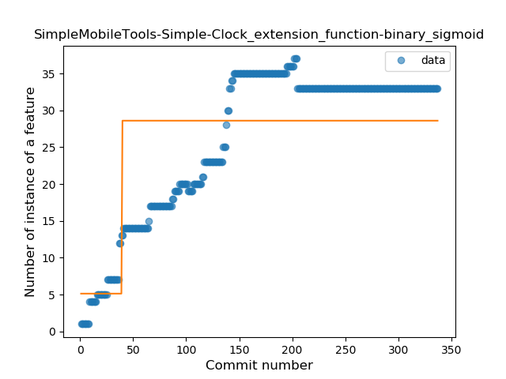
