## SimpleMobileTools-Simple-Contacts
----
#### Metrics provided by Detekt
* Number of lines of code 9025
* Number of Kotlin files: 68
* Cyclomatic complexity: 1788
* Cyclomatic complexity by thousands of lines: 326 

----
**15** features analyzed

*	<a href="#type_inference">Type Inference</a> 
*	<a href="#lambda">Lambda</a> 
*	<a href="#safe_call">Safe Call</a> 
*	<a href="#when_expr">When expression</a> 
*	<a href="#companion_object">Companion Object</a> 
*	<a href="#unsafe_call">Unsafe Call</a> 
*	<a href="#string_template">String Template</a> 
*	<a href="#func_with_default_value">Function with Default Value</a> 
*	<a href="#singleton">Singleton</a> 
*	<a href="#smart_cast">Smart Cast</a> 
*	<a href="#range_expr">Range Expression</a> 
*	<a href="#func_call_with_named_arg">Function call with Named Argument</a> 
*	<a href="#data_class">Data Class</a> 
*	<a href="#extension_function">Extension Function</a> 
*	<a href="#destructuring_declaration">Destructuring Declaration</a> 

### <a name="type_inference">Type Inference</a>
----
#### Functions
* **Constant Rise - Linear:** 
    * **R_Squared:** 0.90543516
* **Sudden Rise Plateau - Logarithm:** 
    * **R_Squared:** 0.53782061
* **Plateau Sudden Rise - Binary Sigmoid:** 
    * **R_Squared:** 0.46518159

**Plots** :chart_with_upwards_trend:
-----

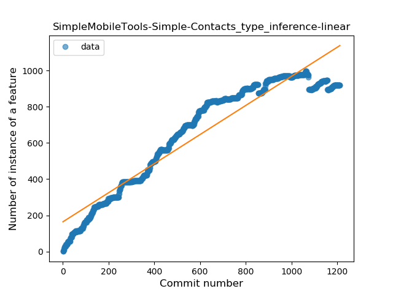
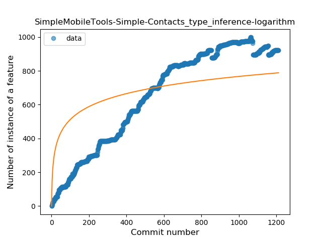
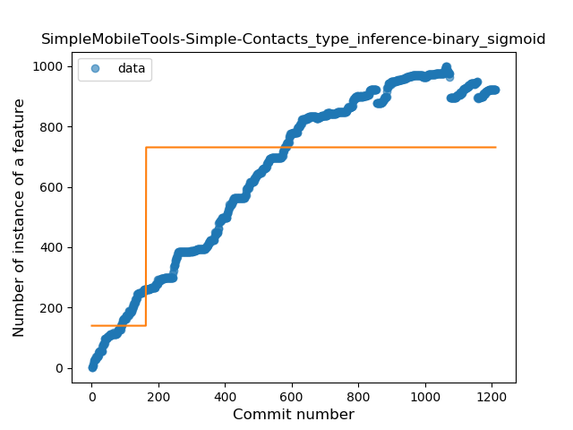
### <a name="lambda">Lambda</a>
----
#### Functions
* **Constant Rise - Linear:** 
    * **R_Squared:** 0.9806848
* **Plateau Sudden Rise - Binary Sigmoid:** 
    * **R_Squared:** 0.55624417
* **Sudden Rise Plateau - Logarithm:** 
    * **R_Squared:** 0.49818105

**Plots** :chart_with_upwards_trend:
-----

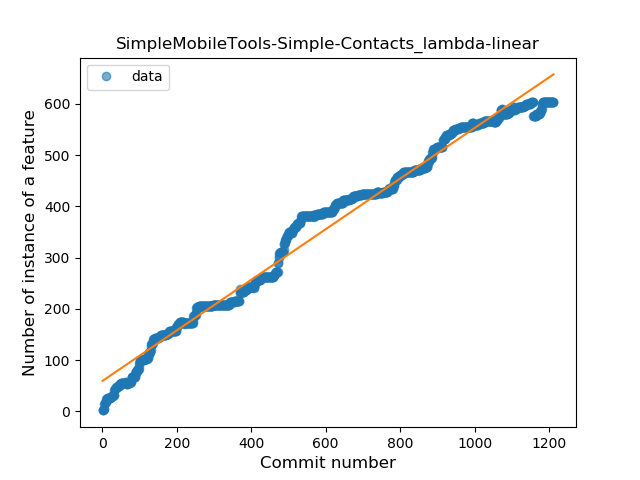
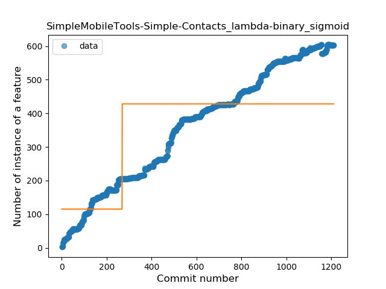
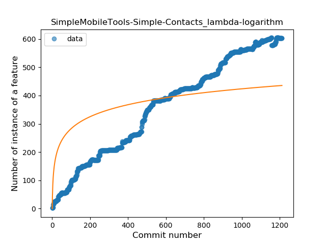
### <a name="safe_call">Safe Call</a>
----
#### Functions
* **Constant Rise - Linear:** 
    * **R_Squared:** 0.96381721
* **Sudden Rise Plateau - Logarithm:** 
    * **R_Squared:** 0.5622382
* **Plateau Sudden Rise - Binary Sigmoid:** 
    * **R_Squared:** 0.42561643

**Plots** :chart_with_upwards_trend:
-----

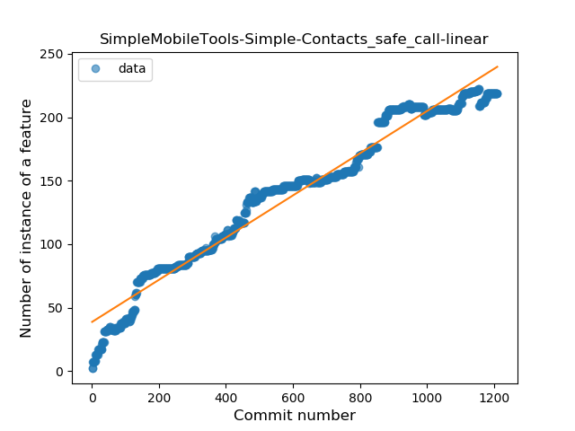
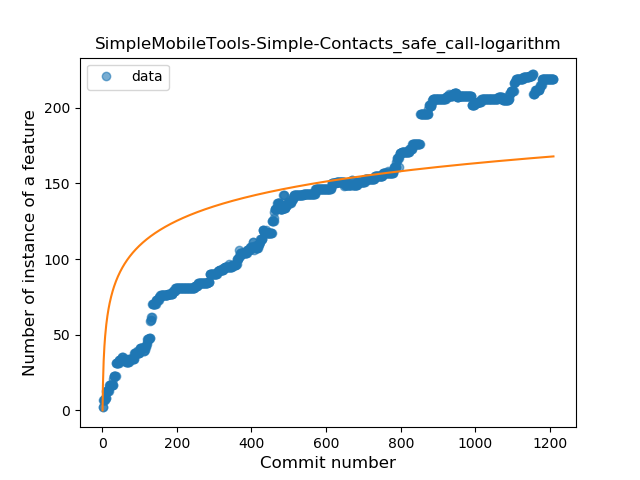
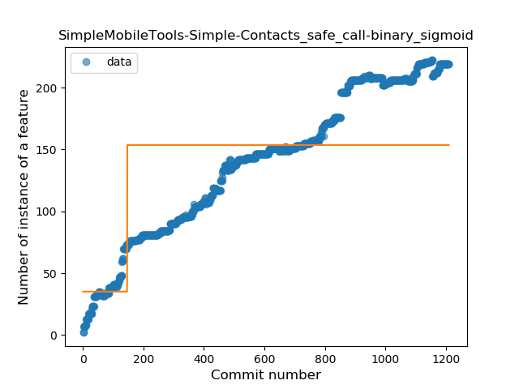
### <a name="when_expr">When expression</a>
----
#### Functions
* **Constant Rise - Linear:** 
    * **R_Squared:** 0.91427369
* **Sudden Rise Plateau - Logarithm:** 
    * **R_Squared:** 0.5926556
* **Plateau Sudden Rise - Binary Sigmoid:** 
    * **R_Squared:** 0.17457789

**Plots** :chart_with_upwards_trend:
-----

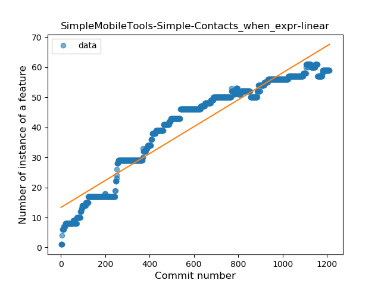
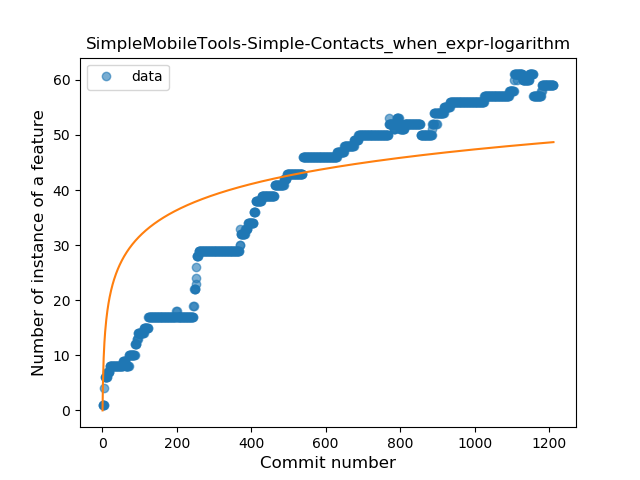
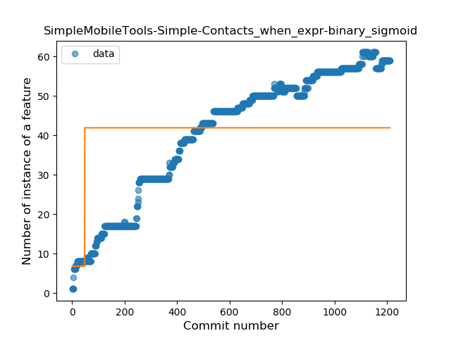
### <a name="companion_object">Companion Object</a>
----
#### Functions
* **Plateau Gradual Rise - Sigmoid:** 
    * **R_Squared:** 0.83286217
* **Constant Rise - Linear:** 
    * **R_Squared:** 0.5021119
* **Sudden Rise Plateau - Logarithm:** 
    * **R_Squared:** 0.50813463

**Plots** :chart_with_upwards_trend:
-----

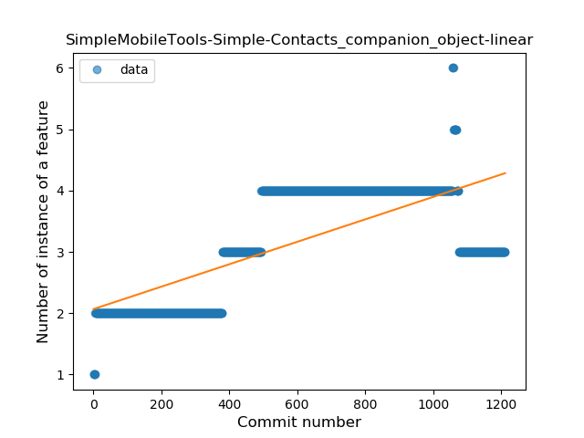
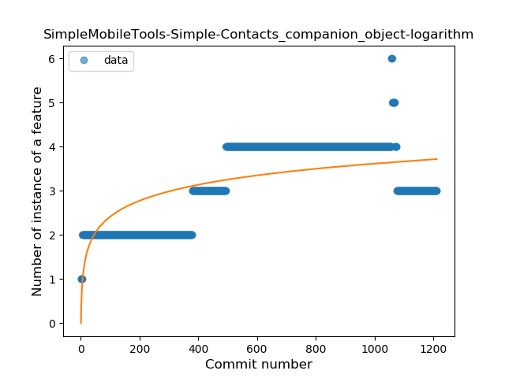
### <a name="unsafe_call">Unsafe Call</a>
----
#### Functions
* **Constant Rise - Linear:** 
    * **R_Squared:** 0.93206033
* **Sudden Rise Plateau - Logarithm:** 
    * **R_Squared:** 0.54134532
* **Plateau Sudden Rise - Binary Sigmoid:** 
    * **R_Squared:** 0.21959632

**Plots** :chart_with_upwards_trend:
-----

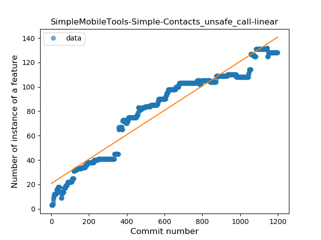
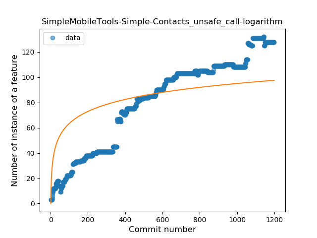
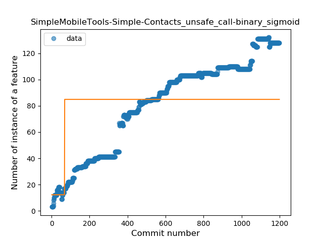
### <a name="string_template">String Template</a>
----
#### Functions
* **Constant Rise - Linear:** 
    * **R_Squared:** 0.50610313
* **Plateau Gradual Rise - Sigmoid:** 
    * **R_Squared:** 0.46141639
* **Sudden Rise Plateau - Logarithm:** 
    * **R_Squared:** 0.44293431

**Plots** :chart_with_upwards_trend:
-----

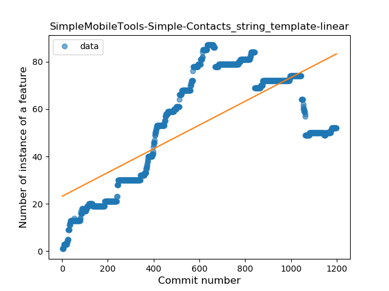
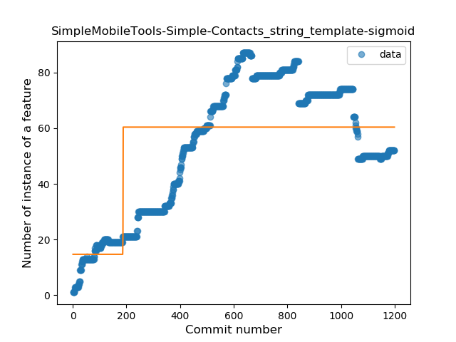

### <a name="func_with_default_value">Function with Default Value</a>
----
#### Functions
* **Constant Rise - Linear:** 
    * **R_Squared:** 0.83485365
* **Sudden Rise Plateau - Logarithm:** 
    * **R_Squared:** 0.54855842

**Plots** :chart_with_upwards_trend:
-----

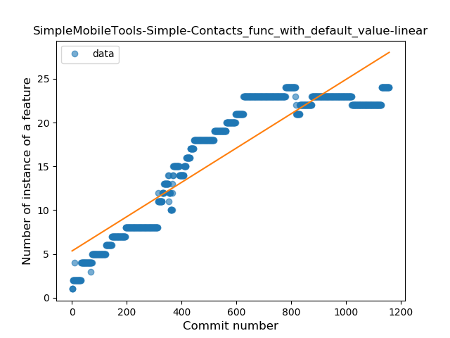
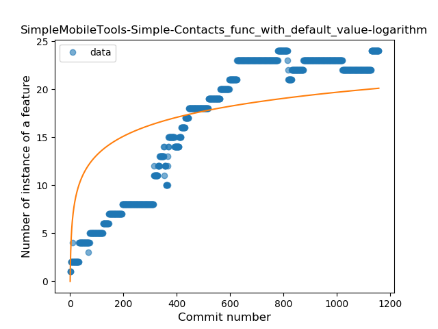
### <a name="singleton">Singleton</a>
----
#### Functions
* **Plateau Sudden Decline - Binary Sigmoid:** 
    * **R_Squared:** 0.59474327
* **Constant Decline - Linear:** 
    * **R_Squared:** 0.11502033
* **Sudden Rise Plateau - Logarithm:** 
    * **R_Squared:** -0.0

**Plots** :chart_with_upwards_trend:
-----

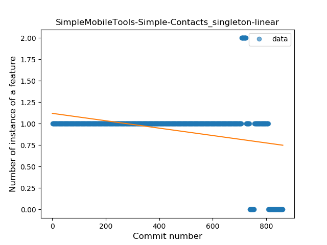
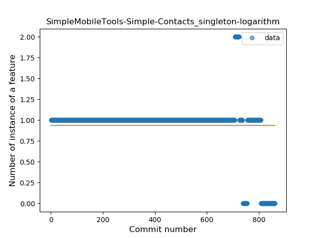
### <a name="smart_cast">Smart Cast</a>
----
#### Functions
* **Constant Rise - Linear:** 
    * **R_Squared:** 0.90542433
* **Sudden Rise Plateau - Logarithm:** 
    * **R_Squared:** 0.36819833

**Plots** :chart_with_upwards_trend:
-----

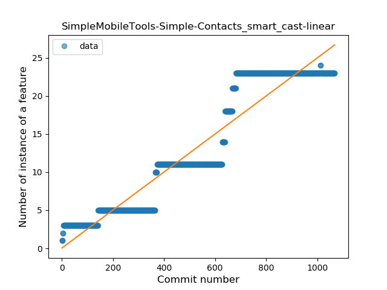
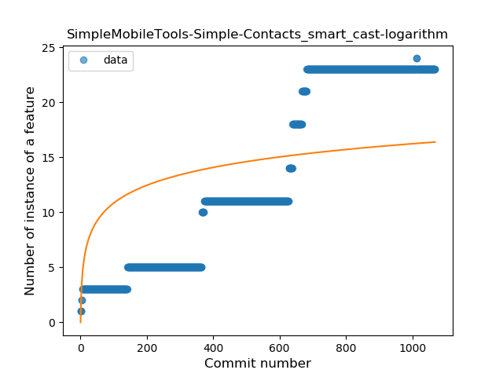
### <a name="range_expr">Range Expression</a>
----
#### Functions
* **Plateau Gradual Rise - Sigmoid:** 
    * **R_Squared:** 0.97150598
* **Constant Rise - Linear:** 
    * **R_Squared:** 0.94121706
* **Sudden Rise Plateau - Logarithm:** 
    * **R_Squared:** 0.55686388

**Plots** :chart_with_upwards_trend:
-----

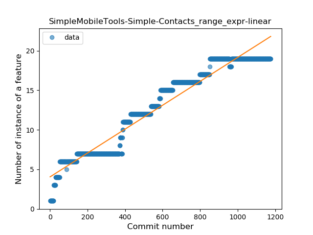
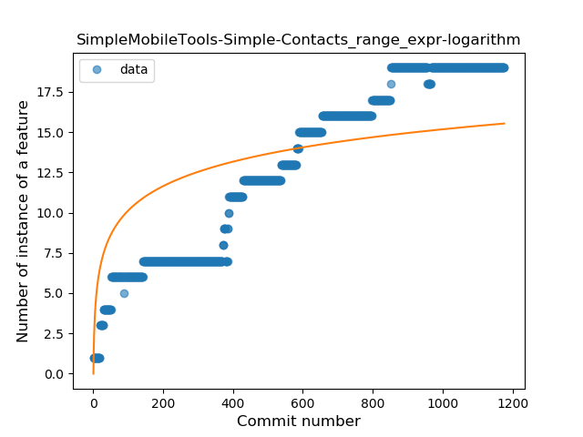
### <a name="func_call_with_named_arg">Function call with Named Argument</a>
----
#### Functions
* **Sudden Rise - Exponential:** 
    * **R_Squared:** 0.95432148
* **Constant Rise - Linear:** 
    * **R_Squared:** 0.94430574
* **Sudden Rise Plateau - Logarithm:** 
    * **R_Squared:** 0.42982233

**Plots** :chart_with_upwards_trend:
-----

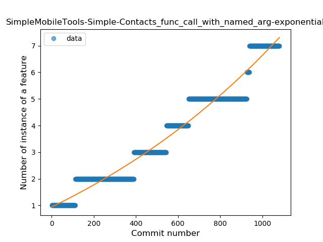

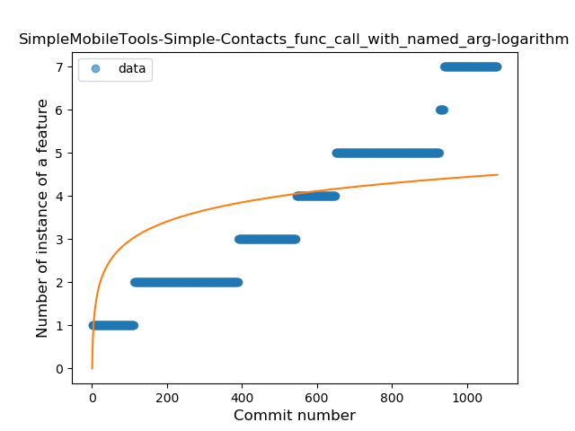
### <a name="data_class">Data Class</a>
----
#### Functions
* **Constant Rise - Linear:** 
    * **R_Squared:** 0.96495066
* **Sudden Rise Plateau - Logarithm:** 
    * **R_Squared:** 0.56443892

**Plots** :chart_with_upwards_trend:
-----

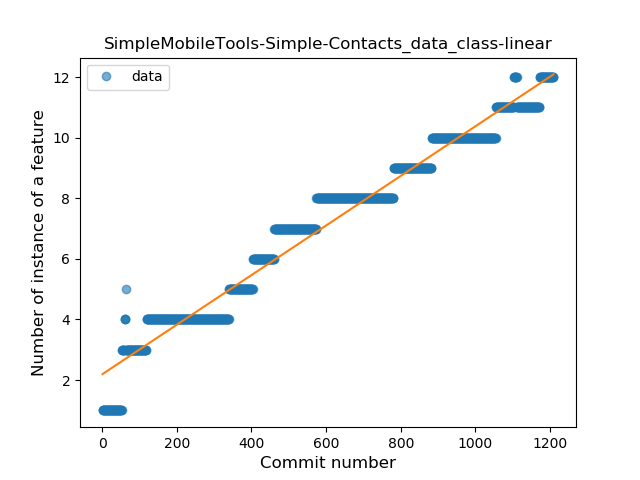
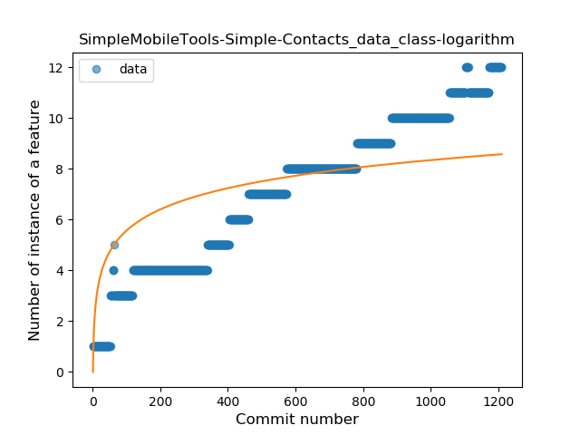
### <a name="extension_function">Extension Function</a>
----
#### Functions
* **Constant Rise - Linear:** 
    * **R_Squared:** 0.97424637
* **Sudden Rise Plateau - Logarithm:** 
    * **R_Squared:** 0.51986674
* **Plateau Sudden Rise - Binary Sigmoid:** 
    * **R_Squared:** 0.07360431

**Plots** :chart_with_upwards_trend:
-----

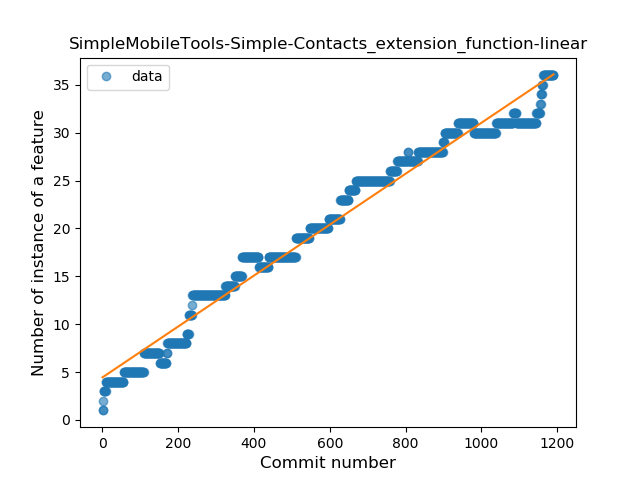
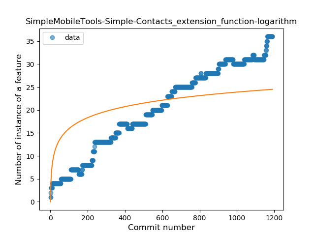
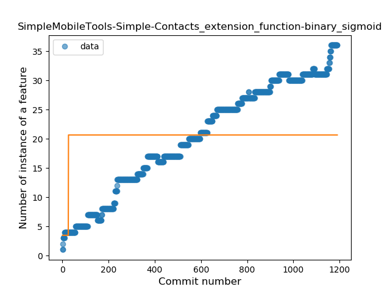
### <a name="destructuring_declaration">Destructuring Declaration</a>
----
#### Functions
* **Plateau Sudden Rise - Binary Sigmoid:** 
    * **R_Squared:** 1.0
* **Sudden Rise Plateau - Logarithm:** 
    * **R_Squared:** 0.6321561
* **Constant Rise - Linear:** 
    * **R_Squared:** 0.60411838

**Plots** :chart_with_upwards_trend:
-----

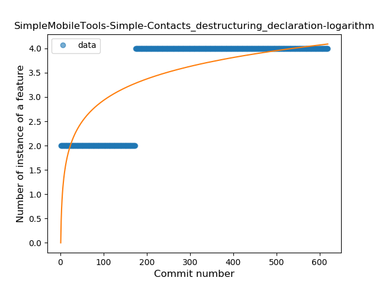
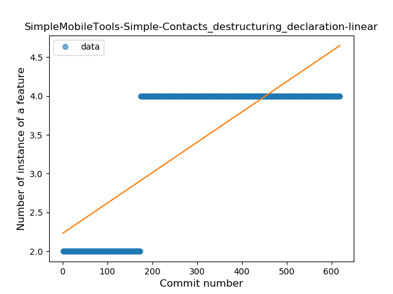
