## SimpleMobileTools-Simple-Draw
----
#### Metrics provided by Detekt
* Number of lines of code 1487
* Number of Kotlin files: 19
* Cyclomatic complexity: 242
* Cyclomatic complexity by thousands of lines: 280 

----
**9** features analyzed

*	<a href="#type_inference">Type Inference</a> 
*	<a href="#lambda">Lambda</a> 
*	<a href="#safe_call">Safe Call</a> 
*	<a href="#when_expr">When expression</a> 
*	<a href="#companion_object">Companion Object</a> 
*	<a href="#unsafe_call">Unsafe Call</a> 
*	<a href="#string_template">String Template</a> 
*	<a href="#smart_cast">Smart Cast</a> 
*	<a href="#destructuring_declaration">Destructuring Declaration</a> 

### <a name="type_inference">Type Inference</a>
----
#### Functions
* **Sudden Rise Plateau - Logarithm:** 
    * **R_Squared:** 0.93923487
* **Constant Rise - Linear:** 
    * **R_Squared:** 0.73369109
* **Plateau Gradual Rise - Sigmoid:** 
    * **R_Squared:** 0.53732317

**Plots** :chart_with_upwards_trend:
-----

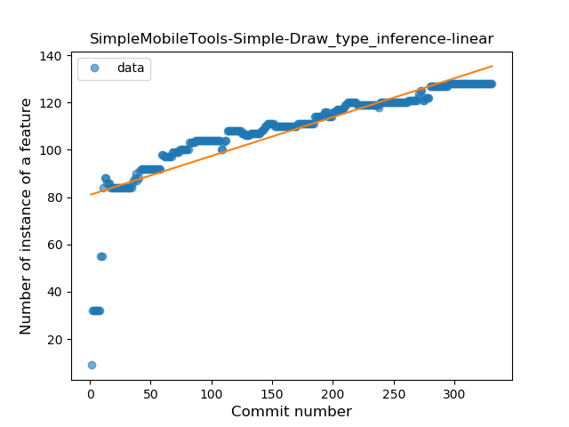
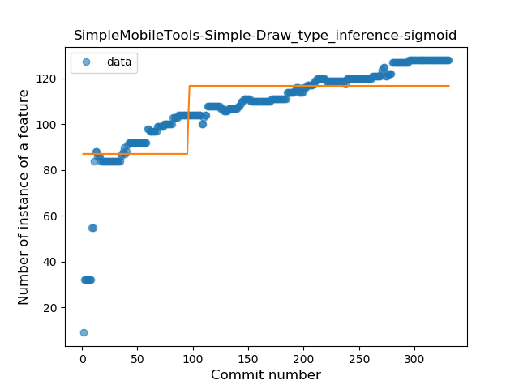
### <a name="lambda">Lambda</a>
----
#### Functions
* **Constant Rise - Linear:** 
    * **R_Squared:** 0.90032338
* **Sudden Rise Plateau - Logarithm:** 
    * **R_Squared:** 0.8506472

**Plots** :chart_with_upwards_trend:
-----

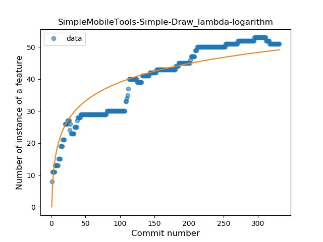
### <a name="safe_call">Safe Call</a>
----
#### Functions
* **Constant Rise - Linear:** 
    * **R_Squared:** 0.83668277
* **Sudden Rise Plateau - Logarithm:** 
    * **R_Squared:** 0.56783311

**Plots** :chart_with_upwards_trend:
-----

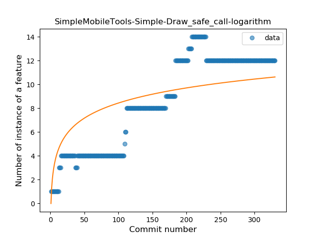
### <a name="when_expr">When expression</a>
----
#### Functions
* **Sudden Rise Plateau - Logarithm:** 
    * **R_Squared:** 0.81241735
* **Constant Rise - Linear:** 
    * **R_Squared:** 0.69039499

**Plots** :chart_with_upwards_trend:
-----

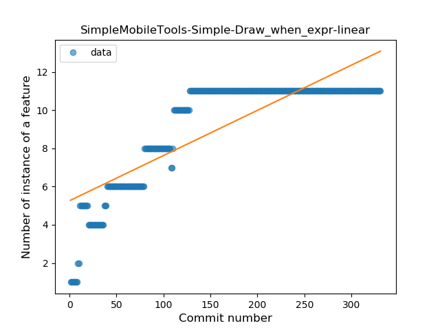
### <a name="companion_object">Companion Object</a>
----
#### Functions
* **Plateau Sudden Rise - Binary Sigmoid:** 
    * **R_Squared:** 0.23263683
* **Sudden Decline - Exponential:** 
    * **R_Squared:** 0.10546991
* **Constant Decline - Linear:** 
    * **R_Squared:** 0.02329556
* **Sudden Rise Plateau - Logarithm:** 
    * **R_Squared:** -0.0

**Plots** :chart_with_upwards_trend:
-----

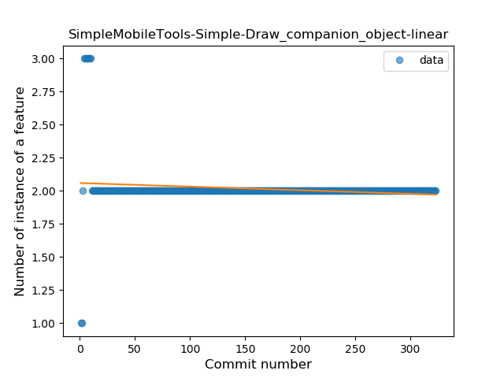
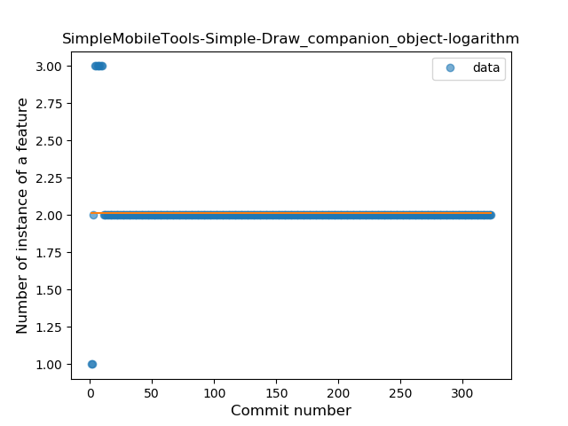
### <a name="unsafe_call">Unsafe Call</a>
----
#### Functions
* **Sudden Decline - Exponential:** 
    * **R_Squared:** 0.13437197
* **Constant Decline - Linear:** 
    * **R_Squared:** 0.01714272
* **Plateau Sudden Rise - Binary Sigmoid:** 
    * **R_Squared:** 0.01188629
* **Sudden Rise Plateau - Logarithm:** 
    * **R_Squared:** -0.0

**Plots** :chart_with_upwards_trend:
-----

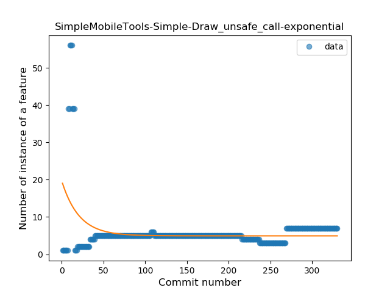
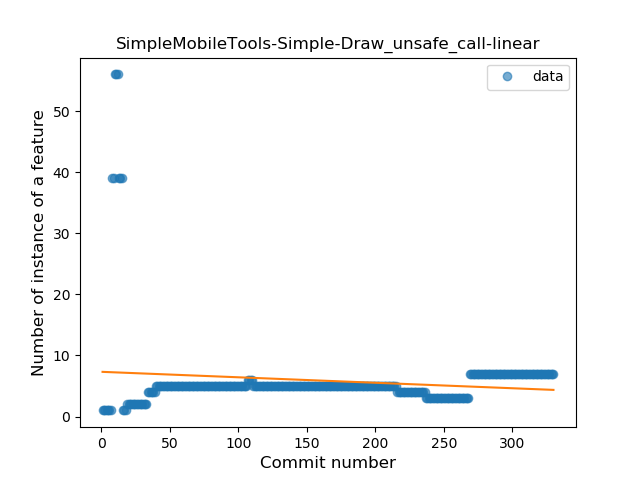
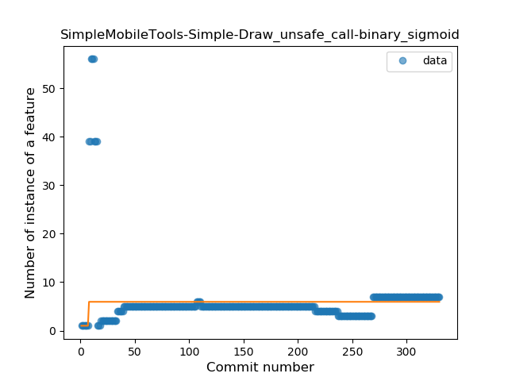
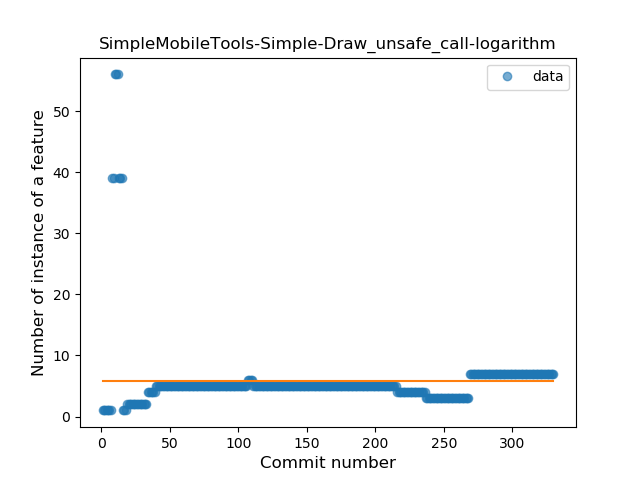
### <a name="string_template">String Template</a>
----
#### Functions
* **Sudden Rise Plateau - Logarithm:** 
    * **R_Squared:** 0.80549837
* **Constant Rise - Linear:** 
    * **R_Squared:** 0.54988724

**Plots** :chart_with_upwards_trend:
-----

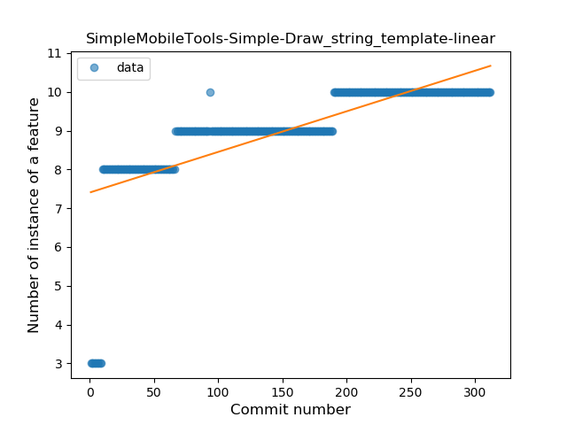
### <a name="smart_cast">Smart Cast</a>
----
#### Functions
* **Plateau Gradual Rise - Sigmoid:** 
    * **R_Squared:** 0.98835649
* **Constant Rise - Linear:** 
    * **R_Squared:** 0.67900814
* **Sudden Rise Plateau - Logarithm:** 
    * **R_Squared:** 0.68856239

**Plots** :chart_with_upwards_trend:
-----

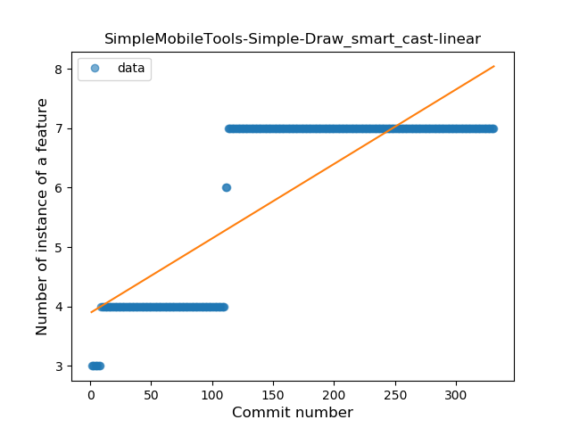
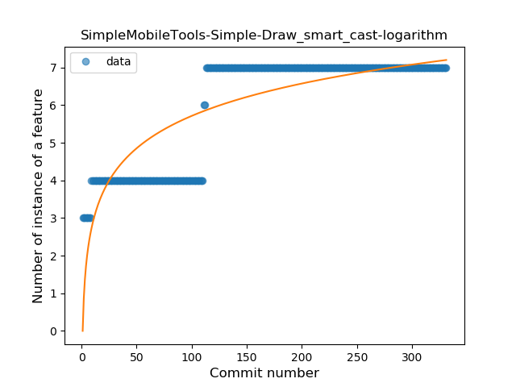
### <a name="destructuring_declaration">Destructuring Declaration</a>
----
#### Functions
* **Plateau Sudden Rise - Binary Sigmoid:** 
    * **R_Squared:** 1.0
* **Sudden Rise Plateau - Logarithm:** 
    * **R_Squared:** 0.29961261
* **Constant Rise - Linear:** 
    * **R_Squared:** 0.06228707

**Plots** :chart_with_upwards_trend:
-----

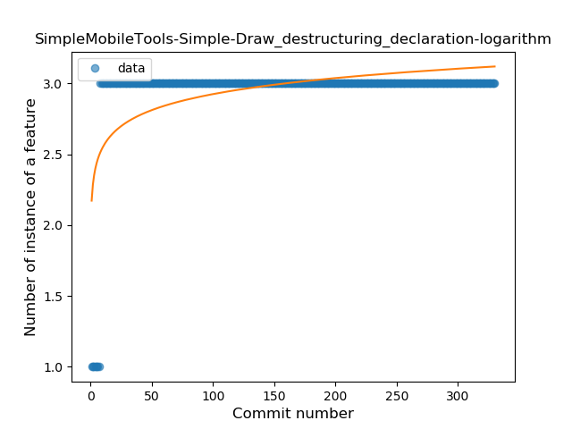
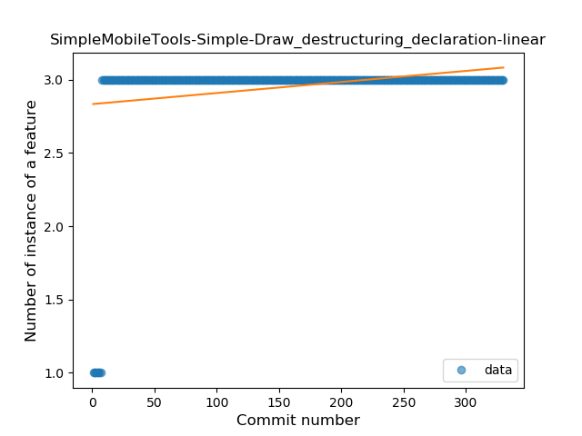
