## SimpleMobileTools-Simple-File-Manager
----
#### Metrics provided by Detekt
* Number of lines of code 2651
* Number of Kotlin files: 21
* Cyclomatic complexity: 568
* Cyclomatic complexity by thousands of lines: 359 

----
**12** features analyzed

*	<a href="#type_inference">Type Inference</a> 
*	<a href="#lambda">Lambda</a> 
*	<a href="#safe_call">Safe Call</a> 
*	<a href="#when_expr">When expression</a> 
*	<a href="#companion_object">Companion Object</a> 
*	<a href="#unsafe_call">Unsafe Call</a> 
*	<a href="#string_template">String Template</a> 
*	<a href="#func_with_default_value">Function with Default Value</a> 
*	<a href="#singleton">Singleton</a> 
*	<a href="#range_expr">Range Expression</a> 
*	<a href="#func_call_with_named_arg">Function call with Named Argument</a> 
*	<a href="#extension_function">Extension Function</a> 

### <a name="type_inference">Type Inference</a>
----
#### Functions
* **Sudden Rise - Exponential:** 
    * **R_Squared:** 0.93065246
* **Constant Rise - Linear:** 
    * **R_Squared:** 0.90940084
* **Sudden Rise Plateau - Logarithm:** 
    * **R_Squared:** 0.44636395

**Plots** :chart_with_upwards_trend:
-----

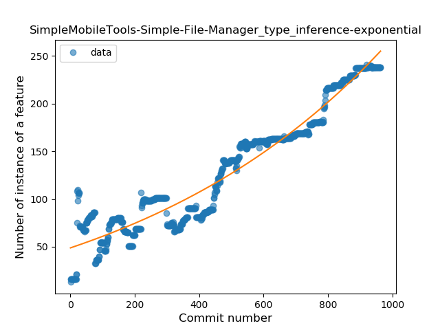
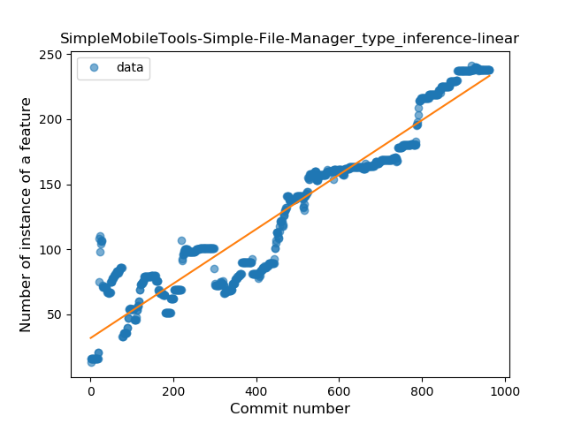
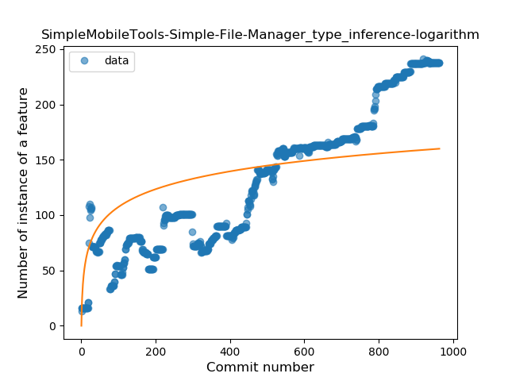
### <a name="lambda">Lambda</a>
----
#### Functions
* **Constant Rise - Linear:** 
    * **R_Squared:** 0.97801109
* **Sudden Rise Plateau - Logarithm:** 
    * **R_Squared:** 0.37271179
* **Plateau Sudden Rise - Binary Sigmoid:** 
    * **R_Squared:** 0.15910041

**Plots** :chart_with_upwards_trend:
-----

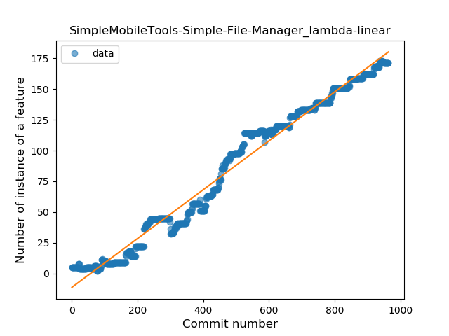
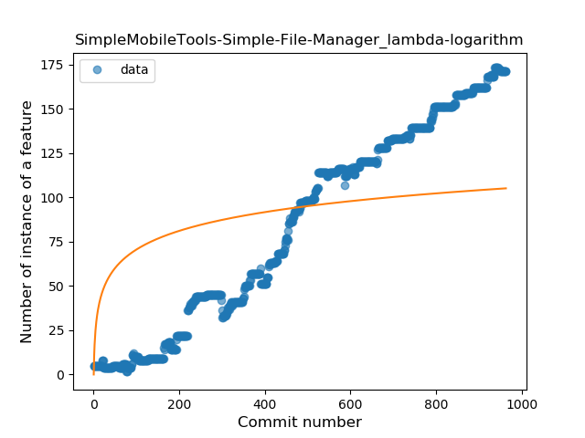
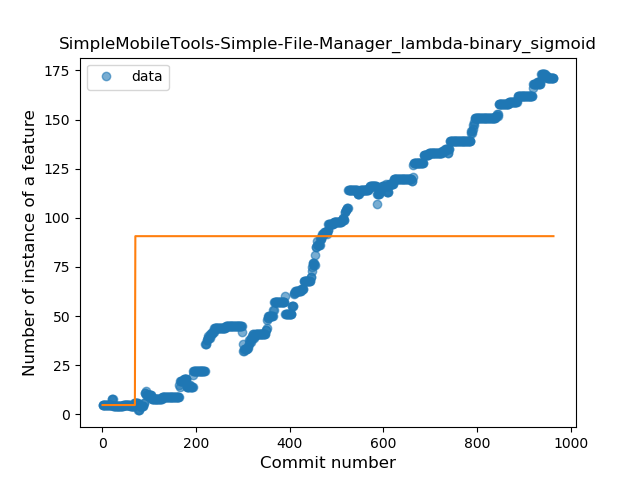
### <a name="safe_call">Safe Call</a>
----
#### Functions
* **Constant Rise - Linear:** 
    * **R_Squared:** 0.94904101
* **Sudden Rise - Exponential:** 
    * **R_Squared:** 0.94941484
* **Sudden Rise Plateau - Logarithm:** 
    * **R_Squared:** 0.37048969
* **Plateau Sudden Rise - Binary Sigmoid:** 
    * **R_Squared:** 0.07467679

**Plots** :chart_with_upwards_trend:
-----

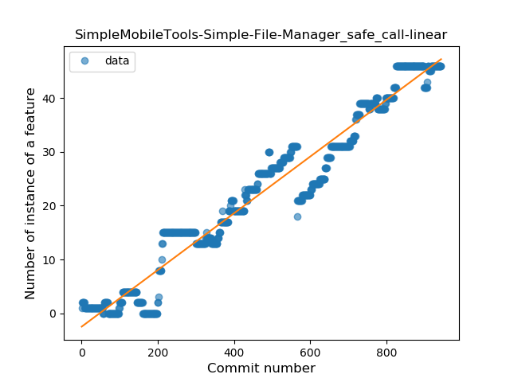

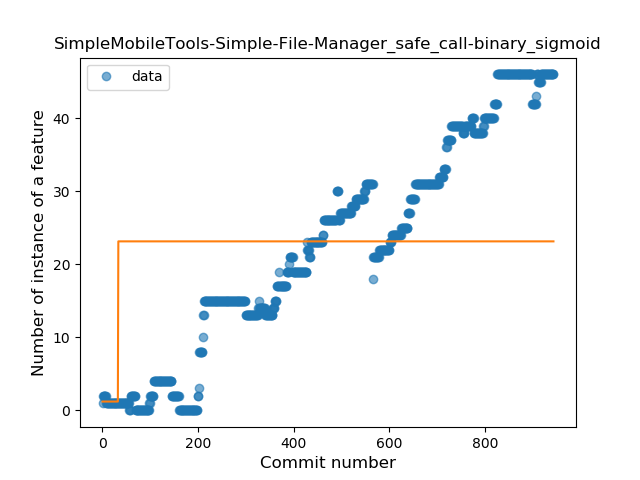
### <a name="when_expr">When expression</a>
----
#### Functions
* **Constant Rise - Linear:** 
    * **R_Squared:** 0.92965182
* **Sudden Rise Plateau - Logarithm:** 
    * **R_Squared:** 0.42383974

**Plots** :chart_with_upwards_trend:
-----

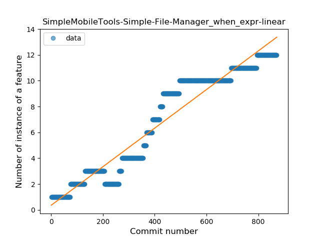
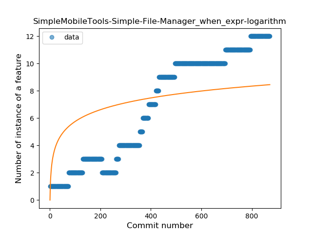
### <a name="companion_object">Companion Object</a>
----
#### Functions
* **Constant Decline - Linear:** 
    * **R_Squared:** 0.20972616
* **Sudden Rise Plateau - Logarithm:** 
    * **R_Squared:** -0.0
* **Plateau Sudden Rise - Binary Sigmoid:** 
    * **R_Squared:** 0.00974832

**Plots** :chart_with_upwards_trend:
-----

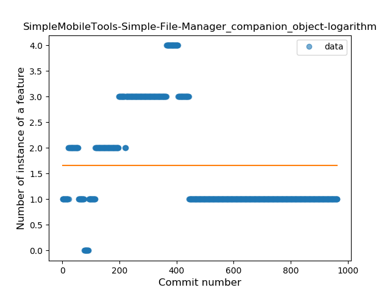
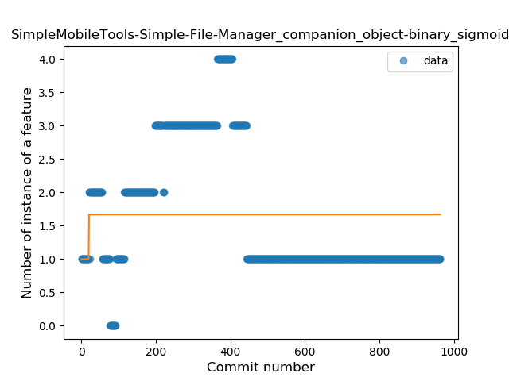
### <a name="unsafe_call">Unsafe Call</a>
----
#### Functions
* **Sudden Rise - Exponential:** 
    * **R_Squared:** 0.85623308
* **Constant Rise - Linear:** 
    * **R_Squared:** 0.83496397
* **Sudden Rise Plateau - Logarithm:** 
    * **R_Squared:** 0.32312771
* **Plateau Sudden Rise - Binary Sigmoid:** 
    * **R_Squared:** 0.0270378

**Plots** :chart_with_upwards_trend:
-----

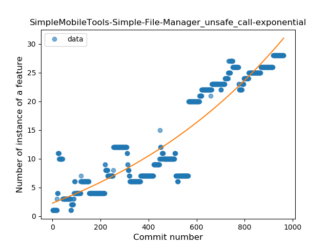
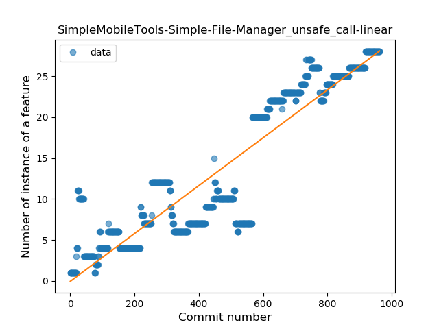
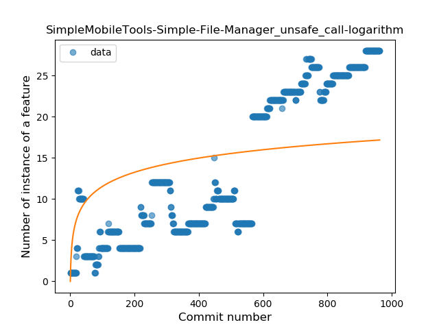
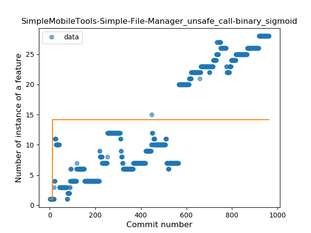
### <a name="string_template">String Template</a>
----
#### Functions
* **Sudden Rise - Exponential:** 
    * **R_Squared:** 0.91108874
* **Constant Rise - Linear:** 
    * **R_Squared:** 0.73799172
* **Sudden Rise Plateau - Logarithm:** 
    * **R_Squared:** 0.22146231
* **Plateau Sudden Rise - Binary Sigmoid:** 
    * **R_Squared:** 0.00116576

**Plots** :chart_with_upwards_trend:
-----

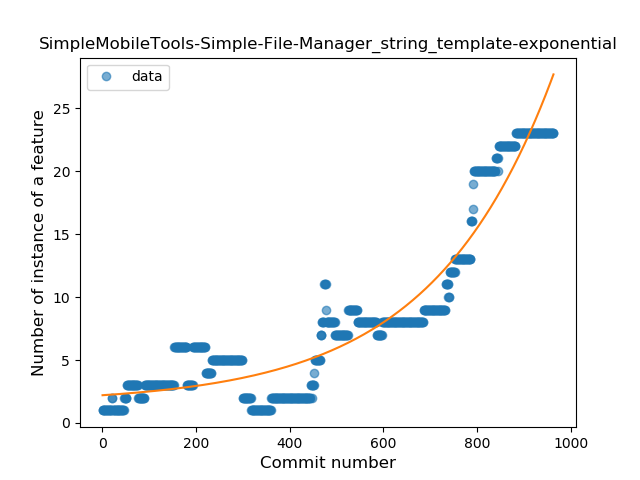
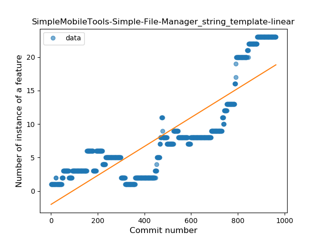
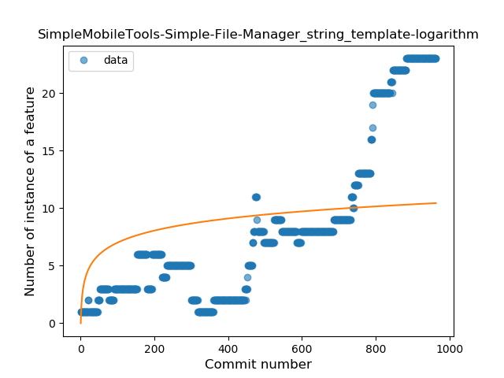
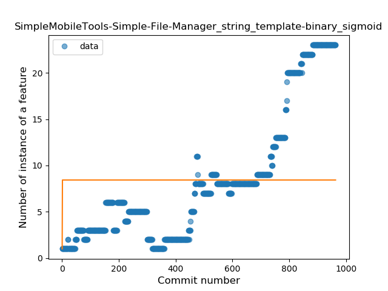
### <a name="func_with_default_value">Function with Default Value</a>
----
#### Functions
* **Plateau Gradual Rise - Sigmoid:** 
    * **R_Squared:** 0.95579718
* **Sudden Rise - Exponential:** 
    * **R_Squared:** 0.88503952
* **Constant Rise - Linear:** 
    * **R_Squared:** 0.55811435
* **Sudden Rise Plateau - Logarithm:** 
    * **R_Squared:** 0.12417554

**Plots** :chart_with_upwards_trend:
-----

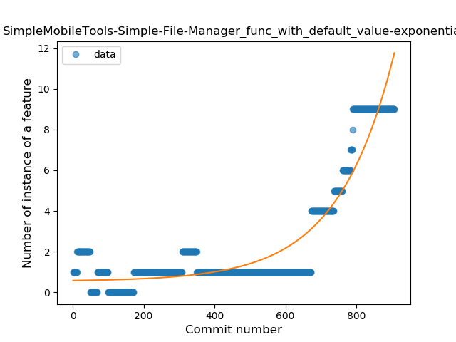
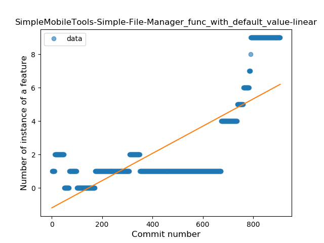
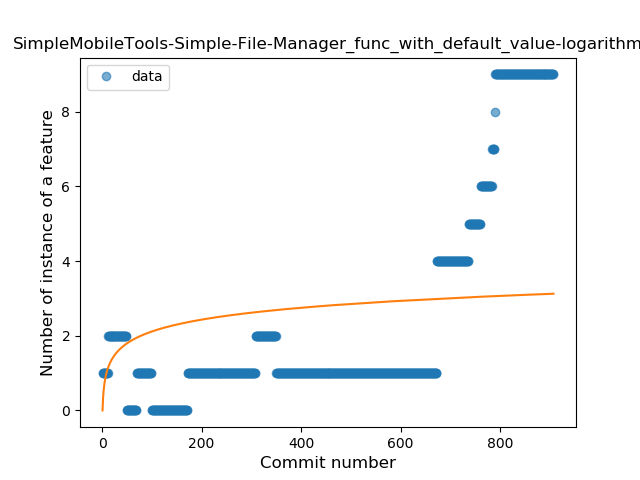
### <a name="singleton">Singleton</a>
----
#### Functions
* **Plateau Sudden Decline - Binary Sigmoid:** 
    * **R_Squared:** 0.21277686
* **Sudden Decline - Exponential:** 
    * **R_Squared:** 0.09412382
* **Constant Decline - Linear:** 
    * **R_Squared:** 0.05524997
* **Sudden Rise Plateau - Logarithm:** 
    * **R_Squared:** 0.0

**Plots** :chart_with_upwards_trend:
-----

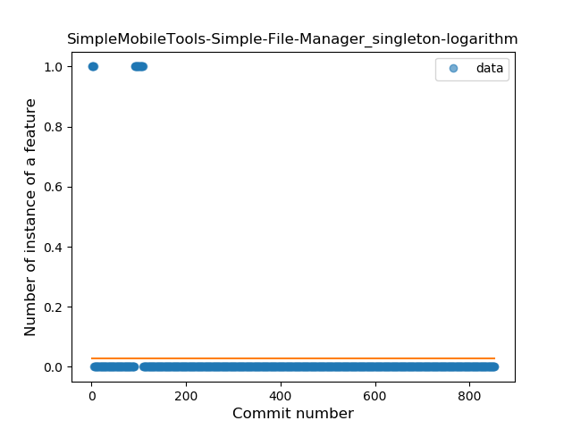
### <a name="range_expr">Range Expression</a>
----
#### Functions
* **Constant Decline - Linear:** 
    * **R_Squared:** 0.0105532
* **Sudden Rise Plateau - Logarithm:** 
    * **R_Squared:** -0.0

**Plots** :chart_with_upwards_trend:
-----

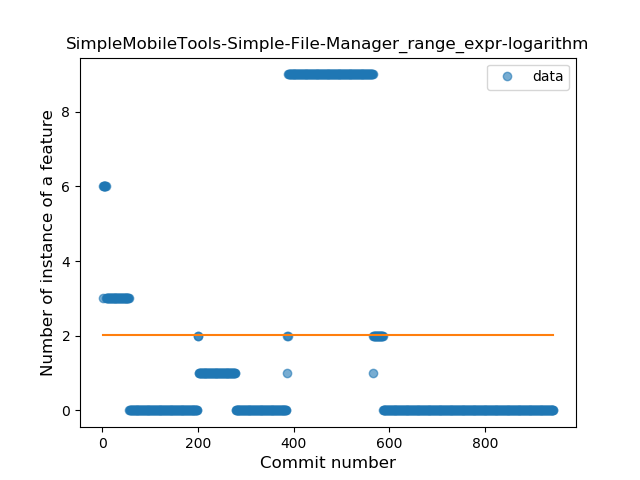
### <a name="func_call_with_named_arg">Function call with Named Argument</a>
----
#### Functions
* **Sudden Rise Plateau - Logarithm:** 
    * **R_Squared:** 0.40417118
* **Constant Rise - Linear:** 
    * **R_Squared:** 0.37917167
* **Plateau Gradual Decline - Sigmoid:** 
    * **R_Squared:** 0.00207455

**Plots** :chart_with_upwards_trend:
-----

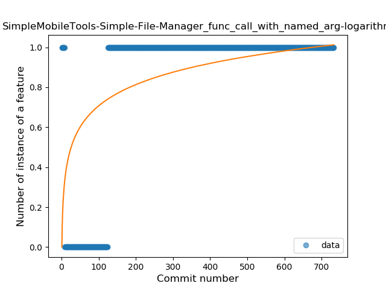
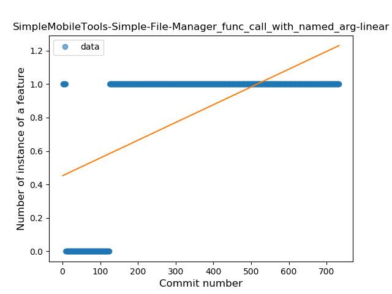
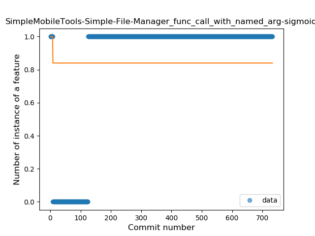
### <a name="extension_function">Extension Function</a>
----
#### Functions
* **Sudden Decline - Exponential:** 
    * **R_Squared:** 0.18140411
* **Constant Decline - Linear:** 
    * **R_Squared:** 0.01703445
* **Sudden Rise Plateau - Logarithm:** 
    * **R_Squared:** -0.0

**Plots** :chart_with_upwards_trend:
-----

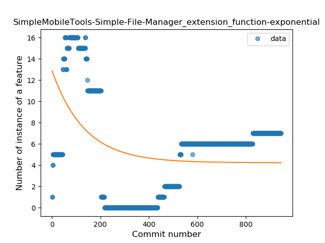
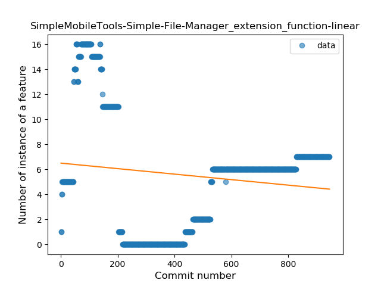
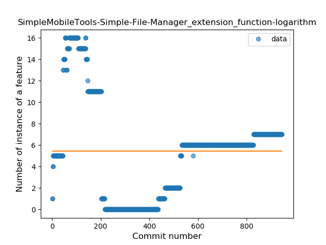
