## SimpleMobileTools-Simple-Flashlight
----
#### Metrics provided by Detekt
* Number of lines of code 1081
* Number of Kotlin files: 16
* Cyclomatic complexity: 177
* Cyclomatic complexity by thousands of lines: 301 

----
**9** features analyzed

*	<a href="#type_inference">Type Inference</a> 
*	<a href="#lambda">Lambda</a> 
*	<a href="#safe_call">Safe Call</a> 
*	<a href="#when_expr">When expression</a> 
*	<a href="#companion_object">Companion Object</a> 
*	<a href="#unsafe_call">Unsafe Call</a> 
*	<a href="#string_template">String Template</a> 
*	<a href="#singleton">Singleton</a> 
*	<a href="#extension_function">Extension Function</a> 

### <a name="type_inference">Type Inference</a>
----
#### Functions
* **Sudden Rise - Exponential:** 
    * **R_Squared:** 0.81655264
* **Constant Rise - Linear:** 
    * **R_Squared:** 0.73348197
* **Sudden Rise Plateau - Logarithm:** 
    * **R_Squared:** 0.4904725

**Plots** :chart_with_upwards_trend:
-----

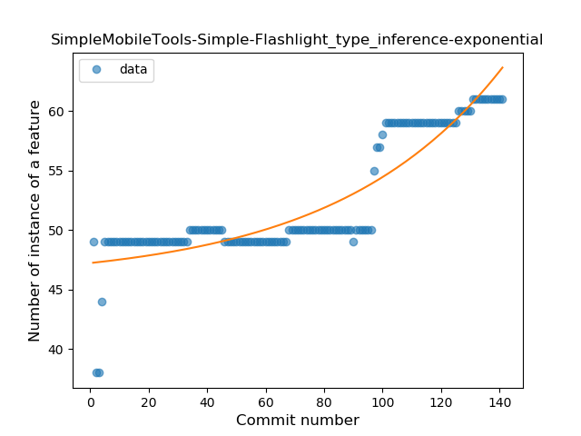
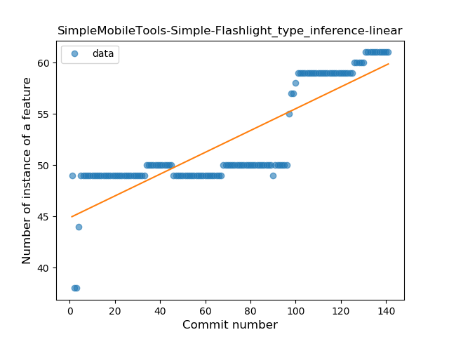
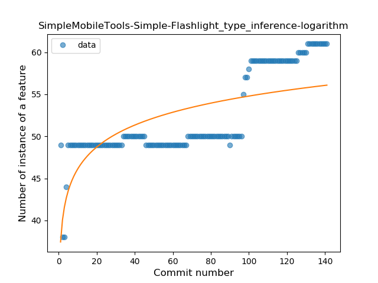
### <a name="lambda">Lambda</a>
----
#### Functions
* **Sudden Rise - Exponential:** 
    * **R_Squared:** 0.90759844
* **Constant Rise - Linear:** 
    * **R_Squared:** 0.84626573
* **Sudden Rise Plateau - Logarithm:** 
    * **R_Squared:** 0.60383568

**Plots** :chart_with_upwards_trend:
-----

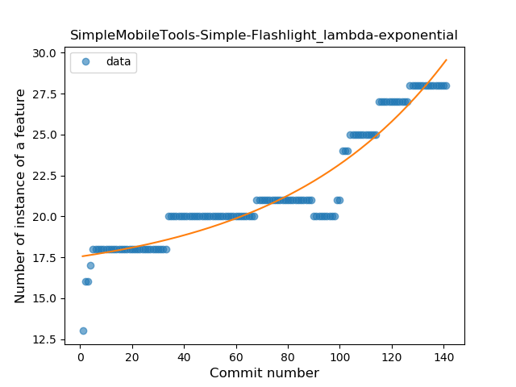
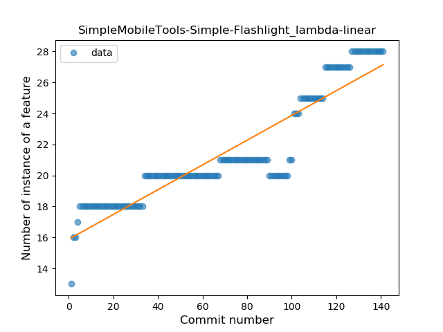
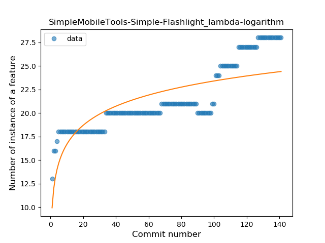
### <a name="safe_call">Safe Call</a>
----
#### Functions
* **Sudden Rise - Exponential:** 
    * **R_Squared:** 0.74742581
* **Constant Rise - Linear:** 
    * **R_Squared:** 0.51168823
* **Sudden Rise Plateau - Logarithm:** 
    * **R_Squared:** 0.33684484

**Plots** :chart_with_upwards_trend:
-----

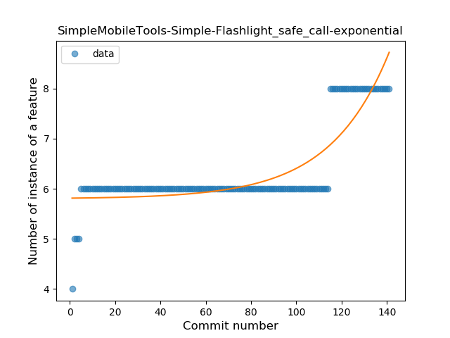
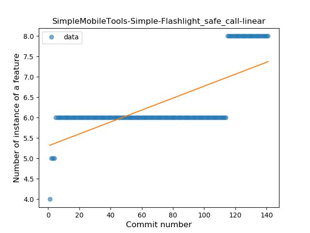
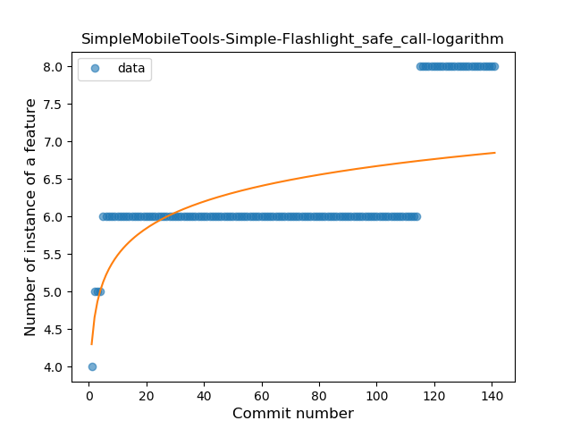
### <a name="when_expr">When expression</a>
----
#### Functions
* **Sudden Rise Plateau - Logarithm:** 
    * **R_Squared:** 0.12782397
* **Constant Rise - Linear:** 
    * **R_Squared:** 0.02112676
* **Sudden Rise - Exponential:** 
    * **R_Squared:** 0.02084379

**Plots** :chart_with_upwards_trend:
-----

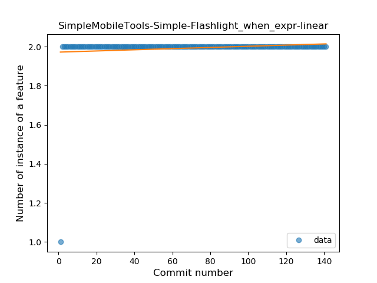
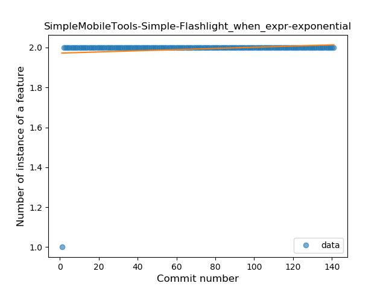
### <a name="companion_object">Companion Object</a>
----
#### Functions
* **Sudden Decline - Exponential:** 
    * **R_Squared:** 0.94158648
* **Constant Decline - Linear:** 
    * **R_Squared:** 0.07407444
* **Sudden Rise Plateau - Logarithm:** 
    * **R_Squared:** -0.0

**Plots** :chart_with_upwards_trend:
-----

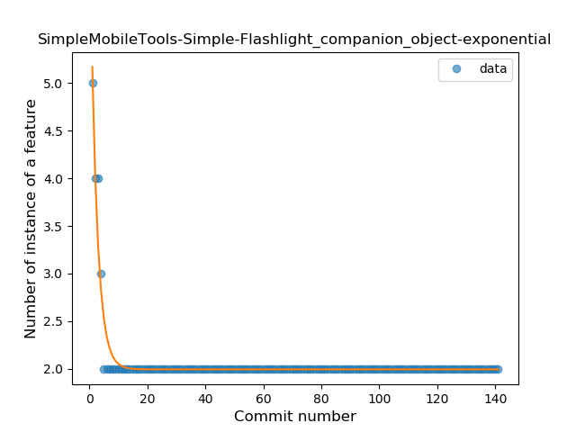
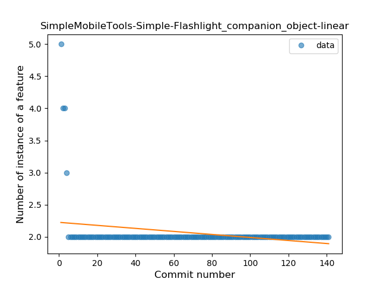
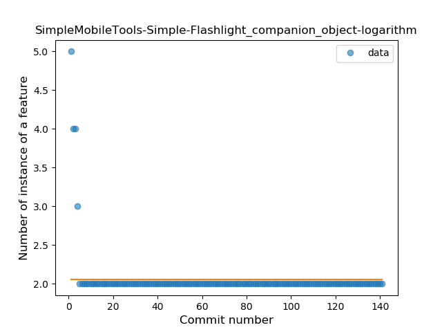
### <a name="unsafe_call">Unsafe Call</a>
----
#### Functions
* **Sudden Decline - Exponential:** 
    * **R_Squared:** 0.85642325
* **Constant Decline - Linear:** 
    * **R_Squared:** 0.00392776
* **Sudden Rise Plateau - Logarithm:** 
    * **R_Squared:** -0.0

**Plots** :chart_with_upwards_trend:
-----

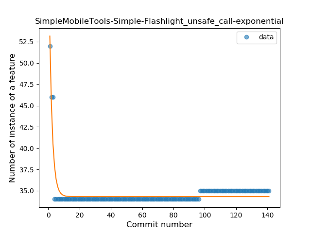
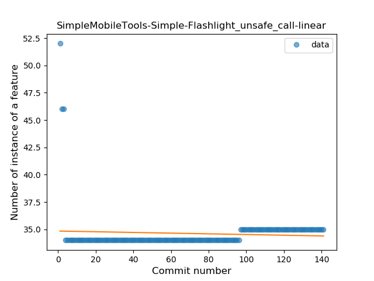
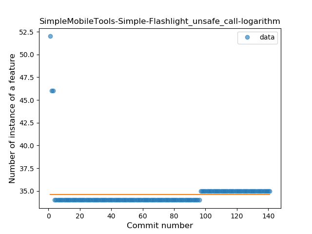
### <a name="string_template">String Template</a>
----
#### Functions
* **Sudden Decline - Exponential:** 
    * **R_Squared:** 1.0
* **Constant Decline - Linear:** 
    * **R_Squared:** 0.02158273
* **Sudden Rise Plateau - Logarithm:** 
    * **R_Squared:** -0.0

**Plots** :chart_with_upwards_trend:
-----

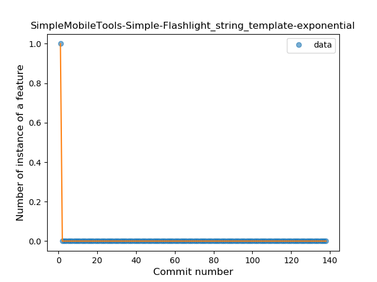
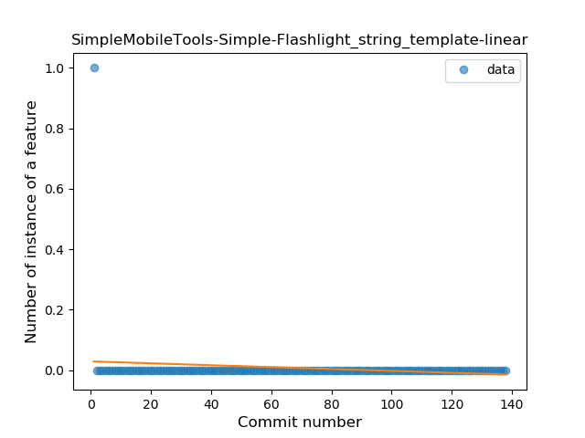
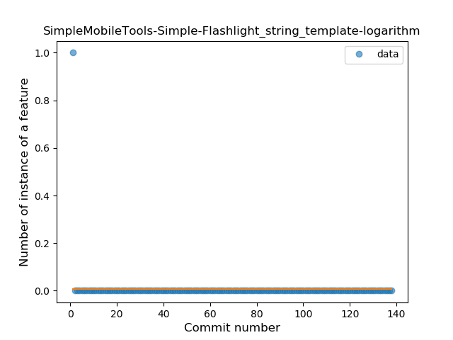
### <a name="singleton">Singleton</a>
----
#### Functions
* **Plateau Sudden Decline - Binary Sigmoid:** 
    * **R_Squared:** 1.0
* **Sudden Decline - Exponential:** 
    * **R_Squared:** 0.80829672
* **Constant Decline - Linear:** 
    * **R_Squared:** 0.1415493
* **Sudden Rise Plateau - Logarithm:** 
    * **R_Squared:** -0.0

**Plots** :chart_with_upwards_trend:
-----

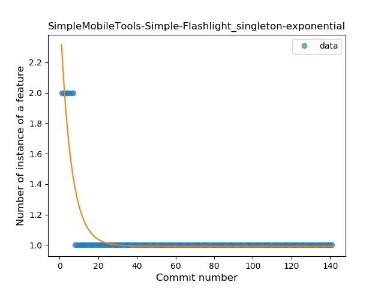
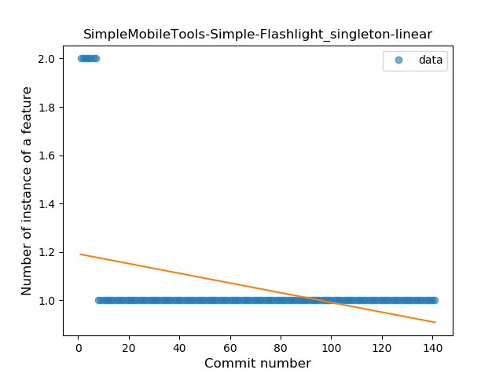

### <a name="extension_function">Extension Function</a>
----
#### Functions
* **Plateau Sudden Rise - Binary Sigmoid:** 
    * **R_Squared:** 1.0
* **Sudden Rise Plateau - Logarithm:** 
    * **R_Squared:** 0.33801841
* **Constant Rise - Linear:** 
    * **R_Squared:** 0.08444048

**Plots** :chart_with_upwards_trend:
-----

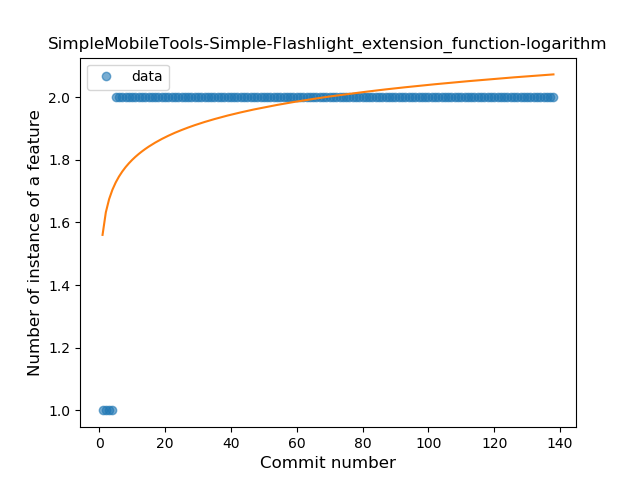
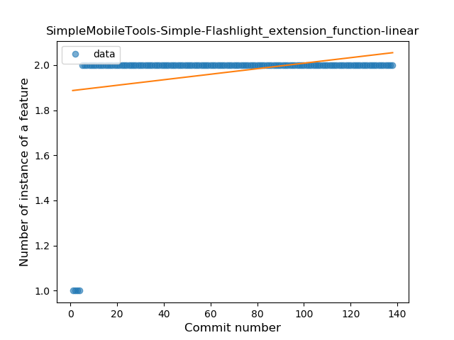
