## SimpleMobileTools-Simple-Gallery
----
#### Metrics provided by Detekt
* Number of lines of code 12417
* Number of Kotlin files: 75
* Cyclomatic complexity: 2553
* Cyclomatic complexity by thousands of lines: 347 

----
**15** features analyzed

*	<a href="#type_inference">Type Inference</a> 
*	<a href="#lambda">Lambda</a> 
*	<a href="#safe_call">Safe Call</a> 
*	<a href="#when_expr">When expression</a> 
*	<a href="#companion_object">Companion Object</a> 
*	<a href="#unsafe_call">Unsafe Call</a> 
*	<a href="#string_template">String Template</a> 
*	<a href="#func_with_default_value">Function with Default Value</a> 
*	<a href="#singleton">Singleton</a> 
*	<a href="#smart_cast">Smart Cast</a> 
*	<a href="#range_expr">Range Expression</a> 
*	<a href="#func_call_with_named_arg">Function call with Named Argument</a> 
*	<a href="#data_class">Data Class</a> 
*	<a href="#extension_function">Extension Function</a> 
*	<a href="#destructuring_declaration">Destructuring Declaration</a> 

### <a name="type_inference">Type Inference</a>
----
#### Functions
* **Constant Rise - Linear:** 
    * **R_Squared:** 0.9605533
* **Sudden Rise - Exponential:** 
    * **R_Squared:** 0.96478531
* **Sudden Rise Plateau - Logarithm:** 
    * **R_Squared:** 0.45680385
* **Plateau Sudden Rise - Binary Sigmoid:** 
    * **R_Squared:** 0.17481513

**Plots** :chart_with_upwards_trend:
-----

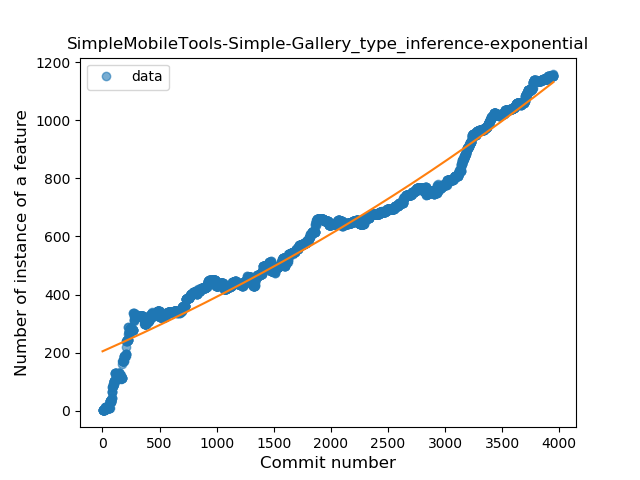
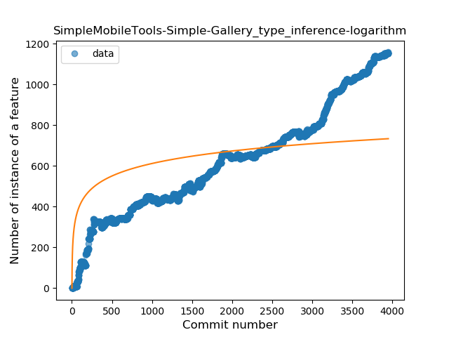
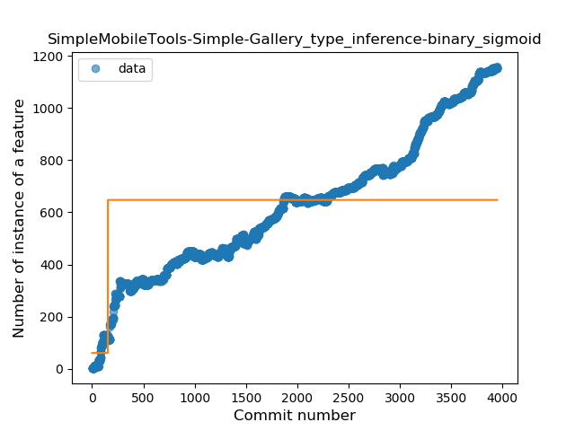
### <a name="lambda">Lambda</a>
----
#### Functions
* **Sudden Rise - Exponential:** 
    * **R_Squared:** 0.9811054
* **Constant Rise - Linear:** 
    * **R_Squared:** 0.95473827
* **Sudden Rise Plateau - Logarithm:** 
    * **R_Squared:** 0.32821726
* **Plateau Sudden Rise - Binary Sigmoid:** 
    * **R_Squared:** 0.19556549

**Plots** :chart_with_upwards_trend:
-----

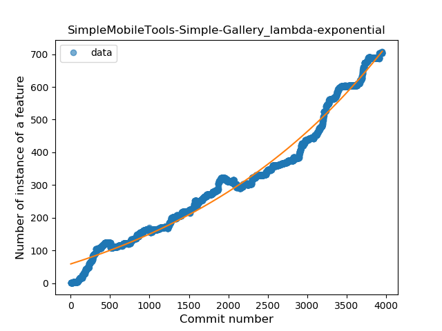
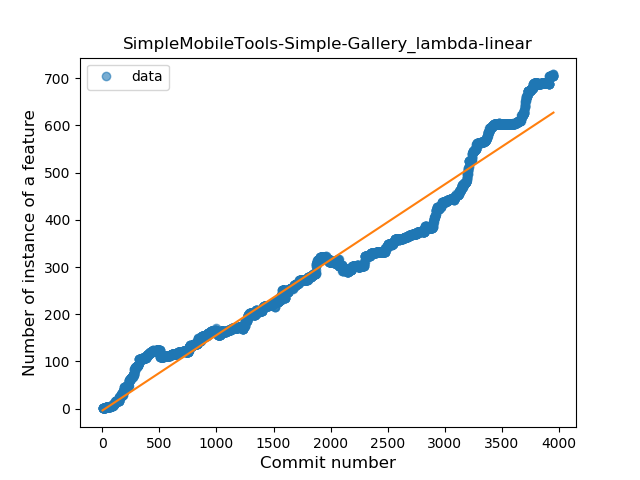

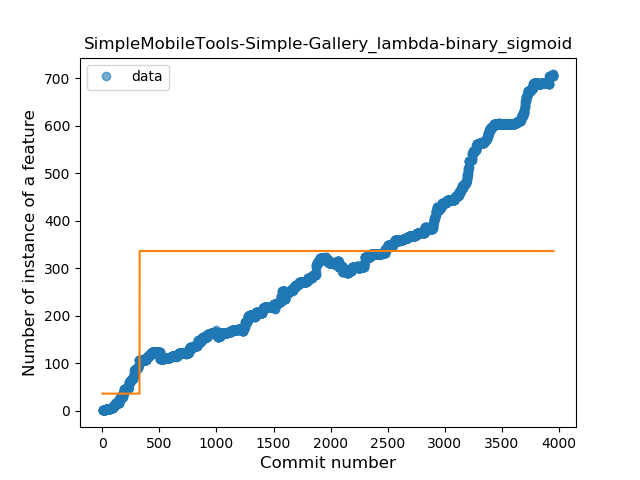
### <a name="safe_call">Safe Call</a>
----
#### Functions
* **Sudden Rise - Exponential:** 
    * **R_Squared:** 0.9475656
* **Constant Rise - Linear:** 
    * **R_Squared:** 0.93645446
* **Sudden Rise Plateau - Logarithm:** 
    * **R_Squared:** 0.40781913
* **Plateau Sudden Rise - Binary Sigmoid:** 
    * **R_Squared:** 0.14595044

**Plots** :chart_with_upwards_trend:
-----

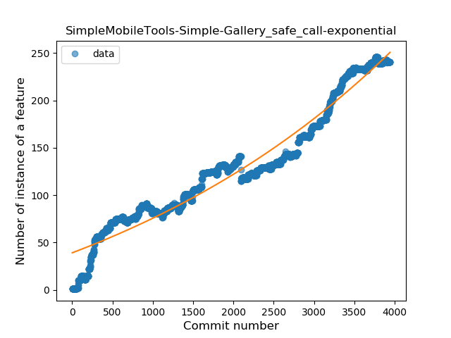
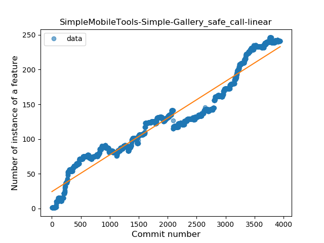
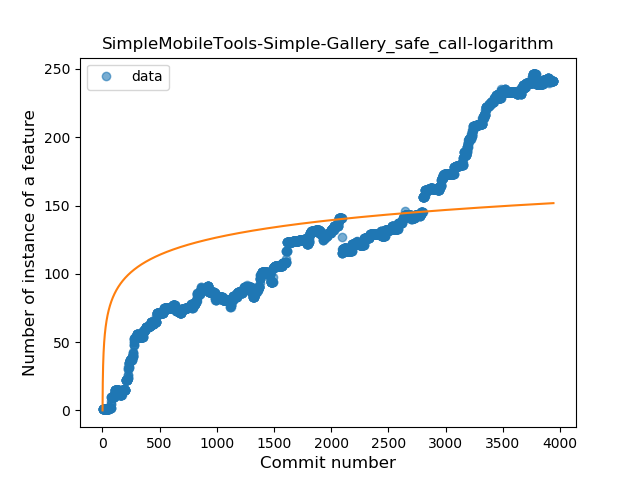
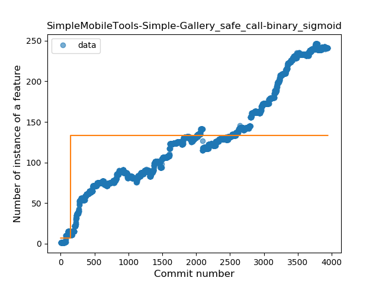
### <a name="when_expr">When expression</a>
----
#### Functions
* **Constant Rise - Linear:** 
    * **R_Squared:** 0.94737855
* **Sudden Rise - Exponential:** 
    * **R_Squared:** 0.95186674
* **Plateau Sudden Rise - Binary Sigmoid:** 
    * **R_Squared:** 0.81483834
* **Sudden Rise Plateau - Logarithm:** 
    * **R_Squared:** 0.34396481

**Plots** :chart_with_upwards_trend:
-----

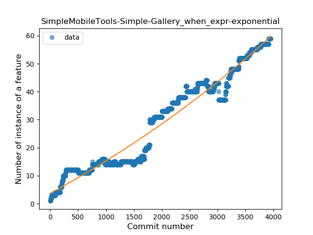
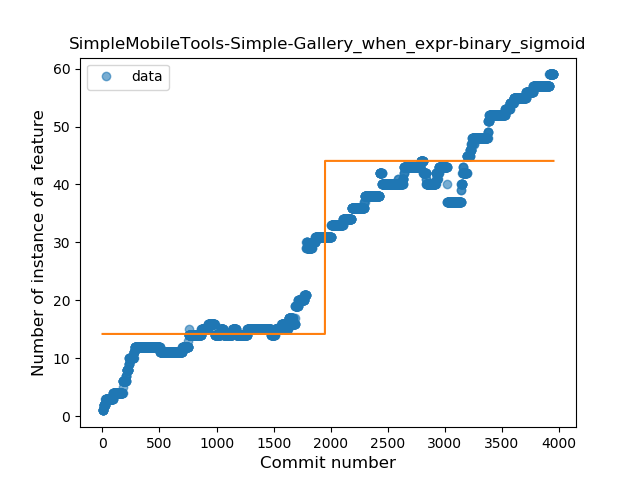
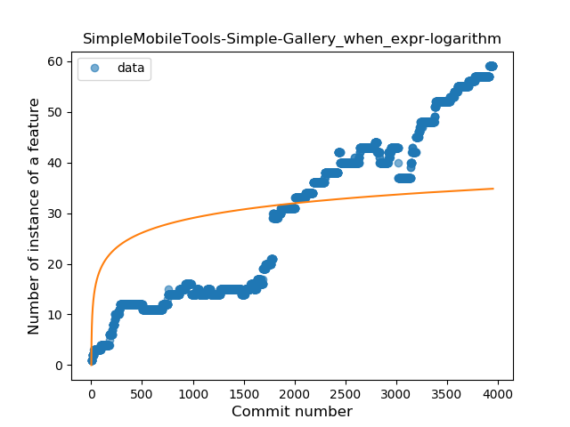
### <a name="companion_object">Companion Object</a>
----
#### Functions
* **Sudden Decline - Exponential:** 
    * **R_Squared:** 0.27195141
* **Constant Decline - Linear:** 
    * **R_Squared:** 0.2535202
* **Sudden Rise Plateau - Logarithm:** 
    * **R_Squared:** 0.0

**Plots** :chart_with_upwards_trend:
-----

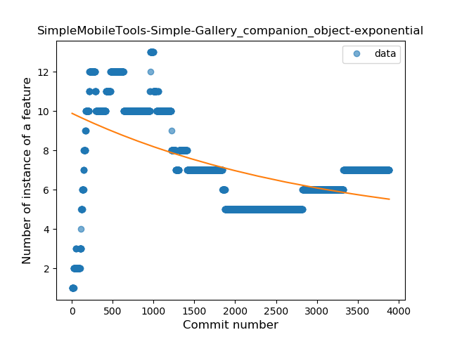

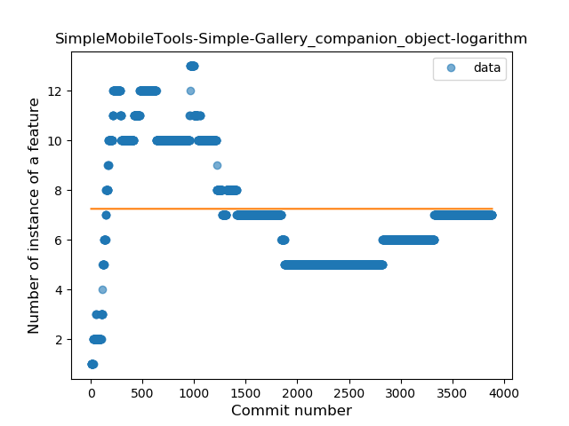
### <a name="unsafe_call">Unsafe Call</a>
----
#### Functions
* **Constant Rise - Linear:** 
    * **R_Squared:** 0.85780083
* **Sudden Rise Plateau - Logarithm:** 
    * **R_Squared:** 0.36196956
* **Plateau Sudden Rise - Binary Sigmoid:** 
    * **R_Squared:** 0.07266065

**Plots** :chart_with_upwards_trend:
-----

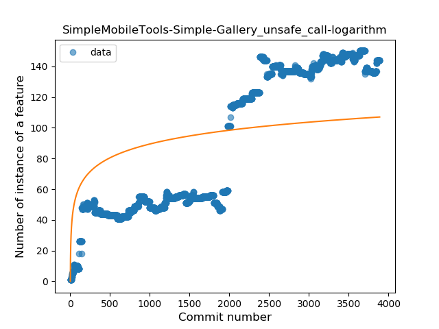
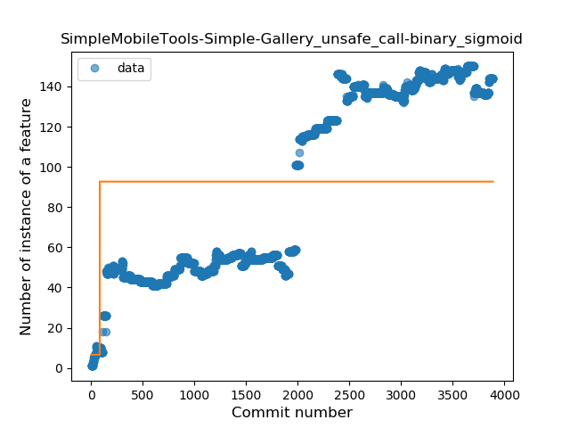
### <a name="string_template">String Template</a>
----
#### Functions
* **Constant Rise - Linear:** 
    * **R_Squared:** 0.8828492
* **Sudden Rise Plateau - Logarithm:** 
    * **R_Squared:** 0.47257468

**Plots** :chart_with_upwards_trend:
-----

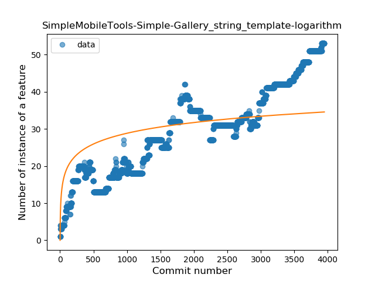
### <a name="func_with_default_value">Function with Default Value</a>
----
#### Functions
* **Sudden Rise - Exponential:** 
    * **R_Squared:** 0.92222054
* **Constant Rise - Linear:** 
    * **R_Squared:** 0.88369195
* **Sudden Rise Plateau - Logarithm:** 
    * **R_Squared:** 0.30545801

**Plots** :chart_with_upwards_trend:
-----

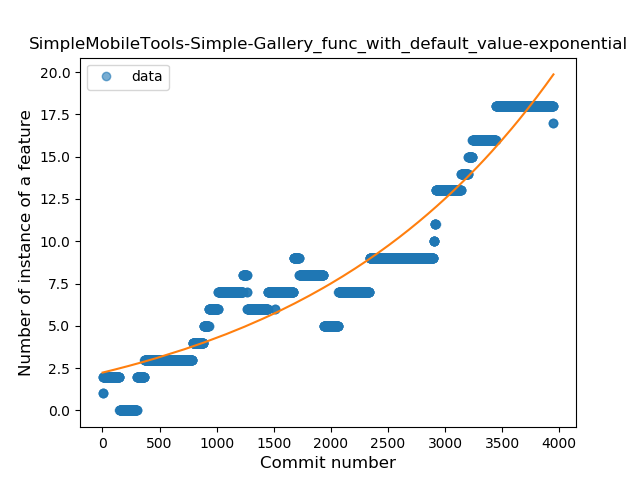
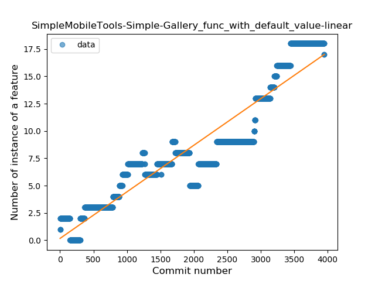
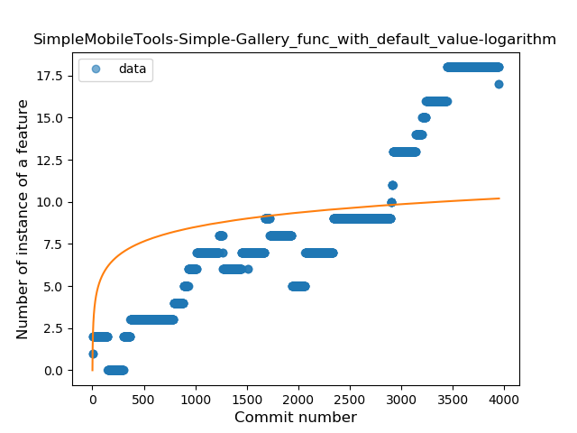
### <a name="singleton">Singleton</a>
----
#### Functions
* **Sudden Rise - Exponential:** 
    * **R_Squared:** 0.44981487
* **Plateau Sudden Decline - Binary Sigmoid:** 
    * **R_Squared:** 0.19725585
* **Constant Rise - Linear:** 
    * **R_Squared:** 0.02963293
* **Sudden Rise Plateau - Logarithm:** 
    * **R_Squared:** 0.0

**Plots** :chart_with_upwards_trend:
-----

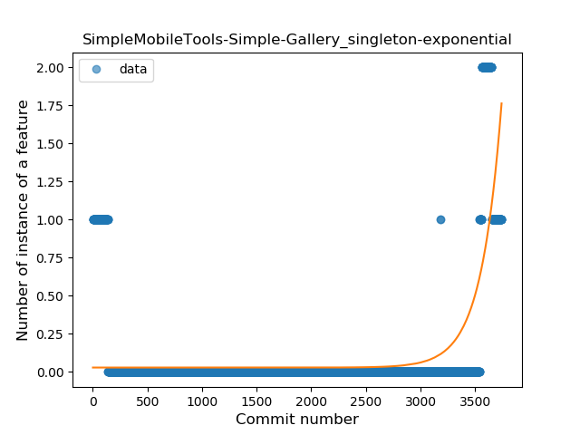
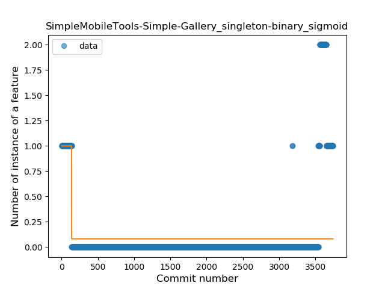
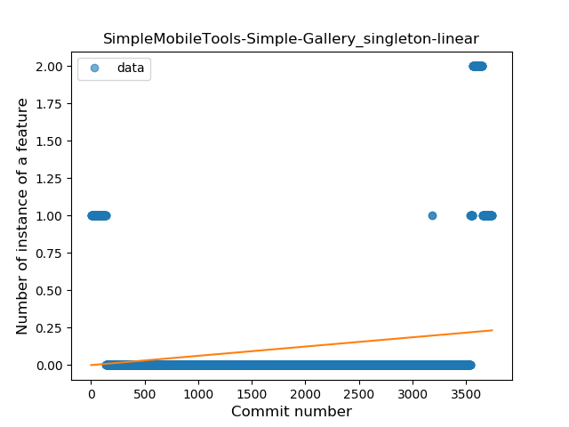
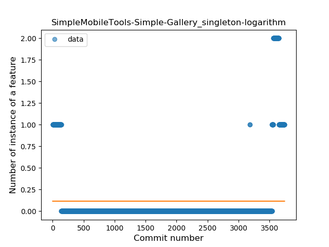
### <a name="smart_cast">Smart Cast</a>
----
#### Functions
* **Plateau Gradual Rise - Sigmoid:** 
    * **R_Squared:** 0.97771448
* **Sudden Rise - Exponential:** 
    * **R_Squared:** 0.79913328
* **Constant Rise - Linear:** 
    * **R_Squared:** 0.5472611
* **Sudden Rise Plateau - Logarithm:** 
    * **R_Squared:** 0.08914448

**Plots** :chart_with_upwards_trend:
-----

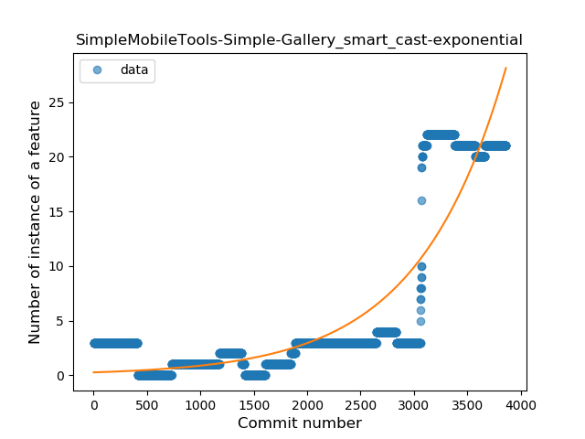
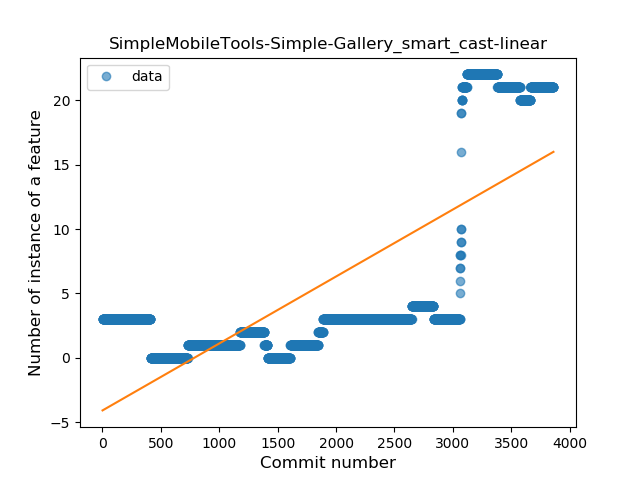
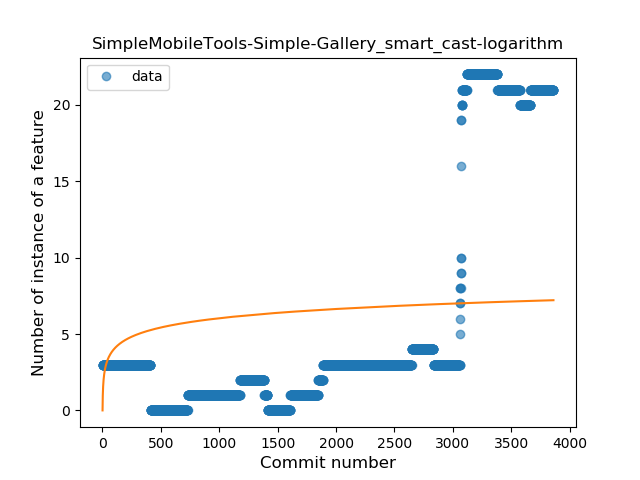
### <a name="range_expr">Range Expression</a>
----
#### Functions
* **Constant Decline - Linear:** 
    * **R_Squared:** 0.0631682
* **Plateau Gradual Rise - Sigmoid:** 
    * **R_Squared:** 0.05857501
* **Sudden Rise Plateau - Logarithm:** 
    * **R_Squared:** -0.0

**Plots** :chart_with_upwards_trend:
-----

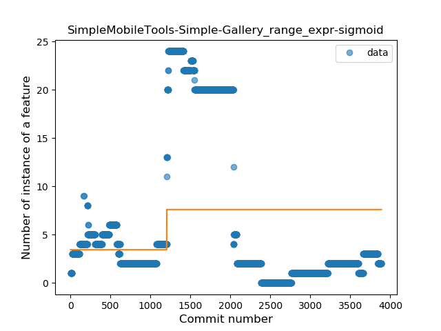
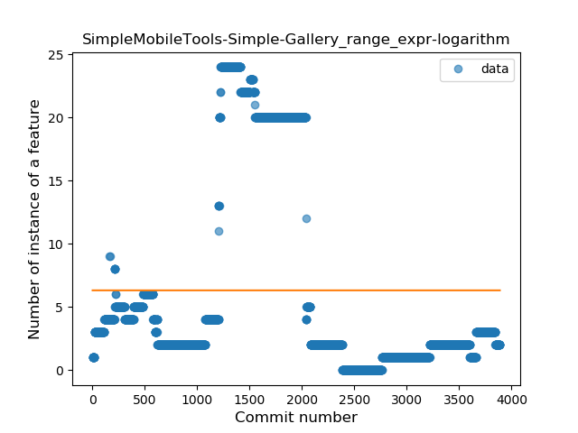
### <a name="func_call_with_named_arg">Function call with Named Argument</a>
----
#### Functions
* **Constant Rise - Linear:** 
    * **R_Squared:** 0.37677656
* **Sudden Rise Plateau - Logarithm:** 
    * **R_Squared:** 0.23876626

**Plots** :chart_with_upwards_trend:
-----

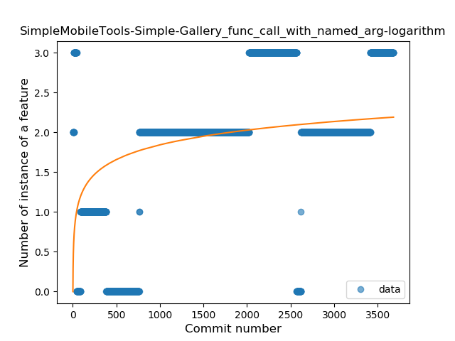
### <a name="data_class">Data Class</a>
----
#### Functions
* **Sudden Rise - Exponential:** 
    * **R_Squared:** 0.8608556
* **Constant Rise - Linear:** 
    * **R_Squared:** 0.800159
* **Sudden Rise Plateau - Logarithm:** 
    * **R_Squared:** 0.44018338

**Plots** :chart_with_upwards_trend:
-----

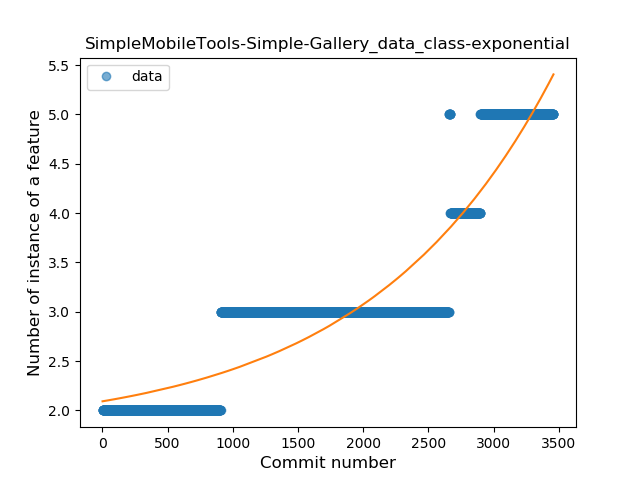
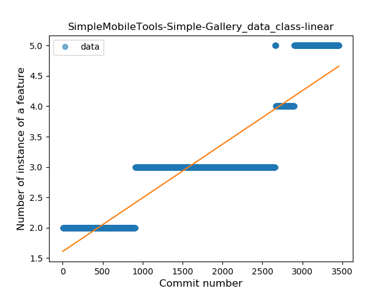
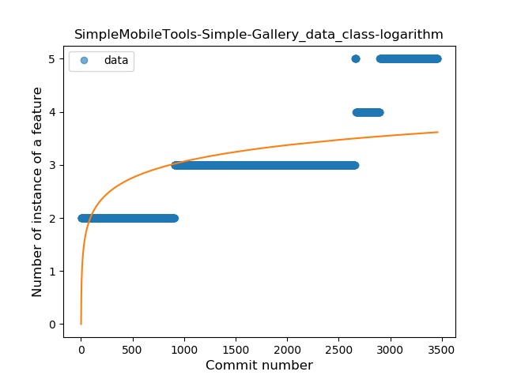
### <a name="extension_function">Extension Function</a>
----
#### Functions
* **Constant Rise - Linear:** 
    * **R_Squared:** 0.85749391
* **Sudden Rise Plateau - Logarithm:** 
    * **R_Squared:** 0.44077682
* **Plateau Sudden Rise - Binary Sigmoid:** 
    * **R_Squared:** 0.03345956

**Plots** :chart_with_upwards_trend:
-----

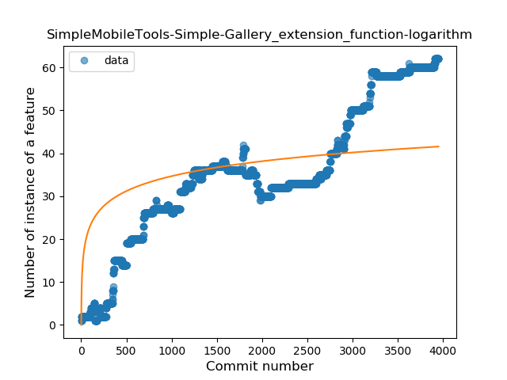
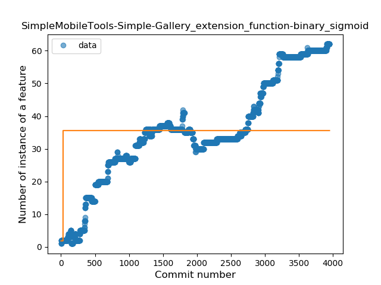
### <a name="destructuring_declaration">Destructuring Declaration</a>
----
#### Functions
* **Plateau Gradual Rise - Sigmoid:** 
    * **R_Squared:** 0.7996114
* **Constant Rise - Linear:** 
    * **R_Squared:** 0.5136571
* **Sudden Rise Plateau - Logarithm:** 
    * **R_Squared:** 0.32948923

**Plots** :chart_with_upwards_trend:
-----

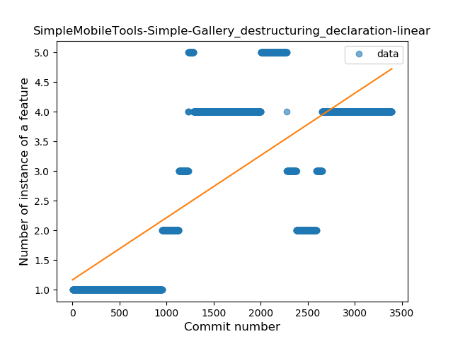
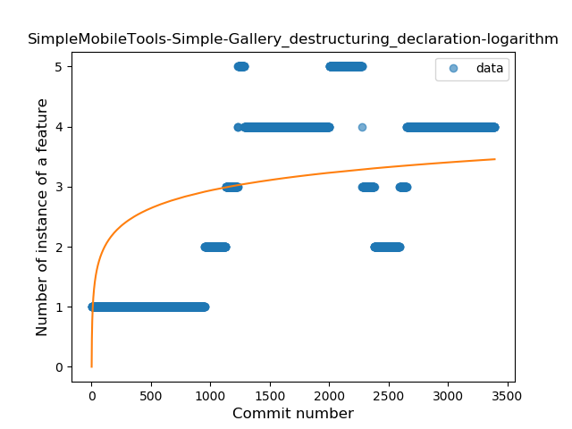
