## SimpleMobileTools-Simple-Music-Player
----
#### Metrics provided by Detekt
* Number of lines of code 3689
* Number of Kotlin files: 34
* Cyclomatic complexity: 724
* Cyclomatic complexity by thousands of lines: 332 

----
**12** features analyzed

*	<a href="#type_inference">Type Inference</a> 
*	<a href="#lambda">Lambda</a> 
*	<a href="#safe_call">Safe Call</a> 
*	<a href="#when_expr">When expression</a> 
*	<a href="#companion_object">Companion Object</a> 
*	<a href="#unsafe_call">Unsafe Call</a> 
*	<a href="#string_template">String Template</a> 
*	<a href="#func_with_default_value">Function with Default Value</a> 
*	<a href="#range_expr">Range Expression</a> 
*	<a href="#func_call_with_named_arg">Function call with Named Argument</a> 
*	<a href="#data_class">Data Class</a> 
*	<a href="#extension_function">Extension Function</a> 

### <a name="type_inference">Type Inference</a>
----
#### Functions
* **Sudden Rise Plateau - Logarithm:** 
    * **R_Squared:** 0.83708025
* **Constant Rise - Linear:** 
    * **R_Squared:** 0.80457089
* **Plateau Sudden Rise - Binary Sigmoid:** 
    * **R_Squared:** 0.58908921

**Plots** :chart_with_upwards_trend:
-----

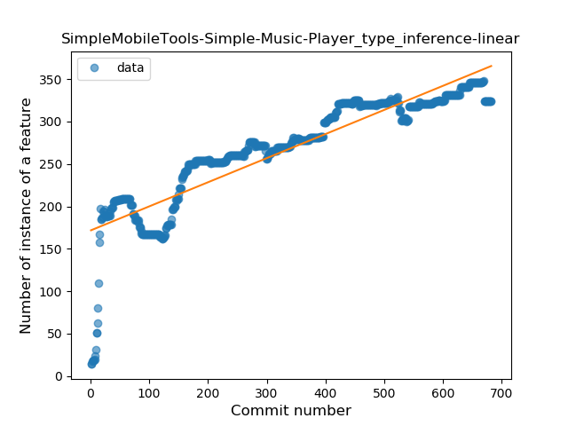

### <a name="lambda">Lambda</a>
----
#### Functions
* **Constant Rise - Linear:** 
    * **R_Squared:** 0.96919097
* **Sudden Rise Plateau - Logarithm:** 
    * **R_Squared:** 0.57210385
* **Plateau Sudden Rise - Binary Sigmoid:** 
    * **R_Squared:** 0.37796863

**Plots** :chart_with_upwards_trend:
-----

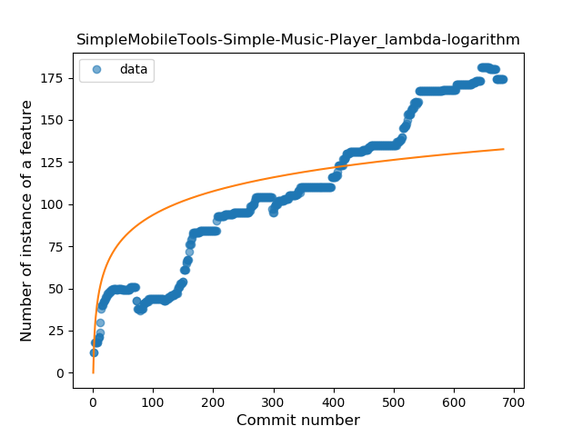
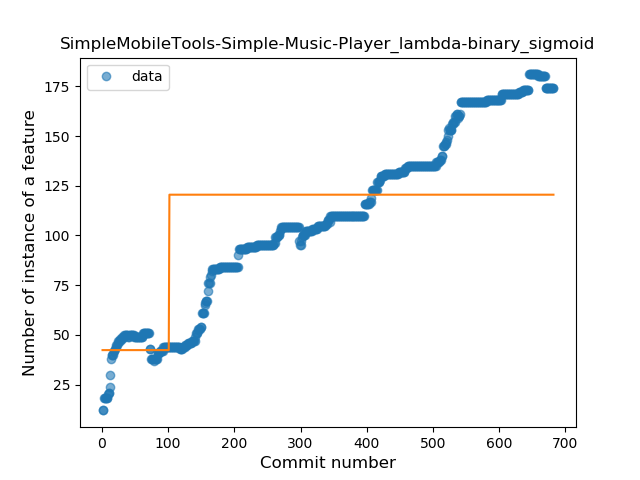
### <a name="safe_call">Safe Call</a>
----
#### Functions
* **Plateau Gradual Rise - Sigmoid:** 
    * **R_Squared:** 0.90305143
* **Constant Rise - Linear:** 
    * **R_Squared:** 0.87584049
* **Sudden Rise - Exponential:** 
    * **R_Squared:** 0.8792172
* **Sudden Rise Plateau - Logarithm:** 
    * **R_Squared:** 0.44108076

**Plots** :chart_with_upwards_trend:
-----

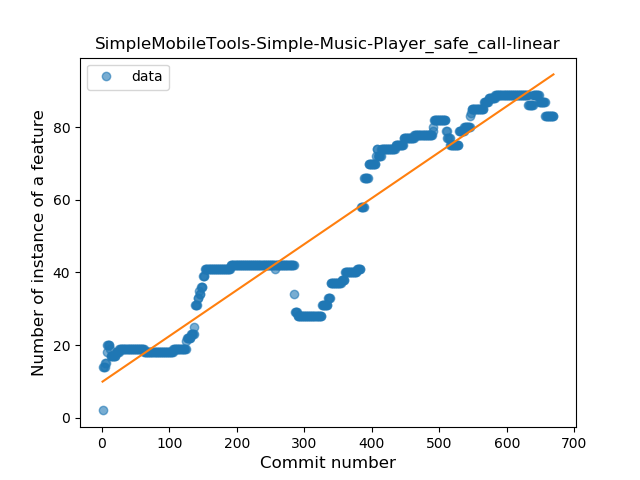
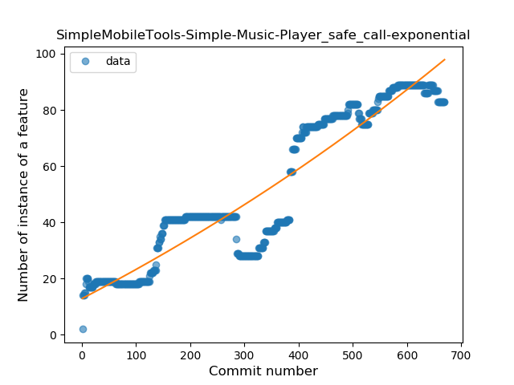
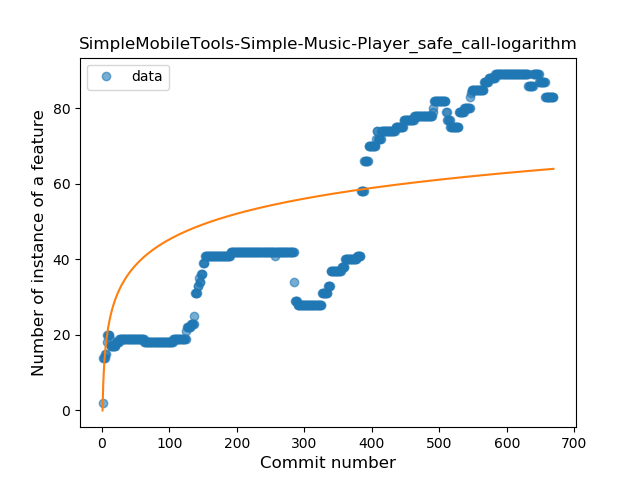
### <a name="when_expr">When expression</a>
----
#### Functions
* **Constant Rise - Linear:** 
    * **R_Squared:** 0.93784881
* **Sudden Rise Plateau - Logarithm:** 
    * **R_Squared:** 0.55248933

**Plots** :chart_with_upwards_trend:
-----

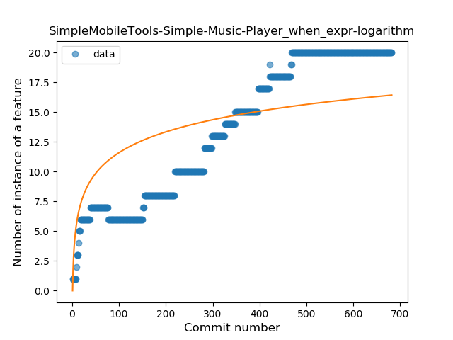
### <a name="companion_object">Companion Object</a>
----
#### Functions
* **Constant Decline - Linear:** 
    * **R_Squared:** 0.34132943
* **Sudden Decline - Exponential:** 
    * **R_Squared:** 0.34608103
* **Sudden Rise Plateau - Logarithm:** 
    * **R_Squared:** -0.0

**Plots** :chart_with_upwards_trend:
-----

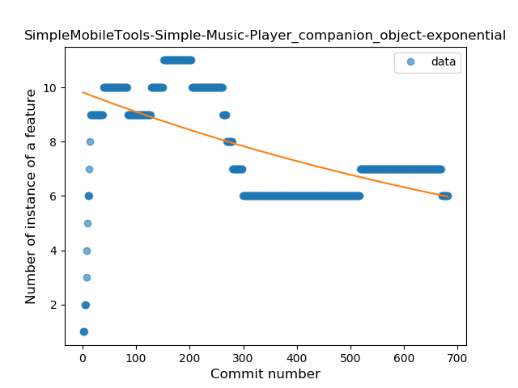
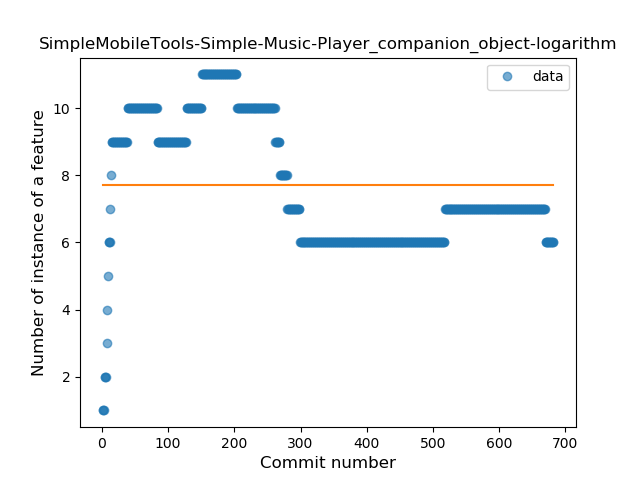
### <a name="unsafe_call">Unsafe Call</a>
----
#### Functions
* **Constant Decline - Linear:** 
    * **R_Squared:** 0.07553662
* **Sudden Decline - Exponential:** 
    * **R_Squared:** 0.07675474
* **Sudden Rise Plateau - Logarithm:** 
    * **R_Squared:** -0.0
* **Plateau Sudden Rise - Binary Sigmoid:** 
    * **R_Squared:** 0.00025696

**Plots** :chart_with_upwards_trend:
-----

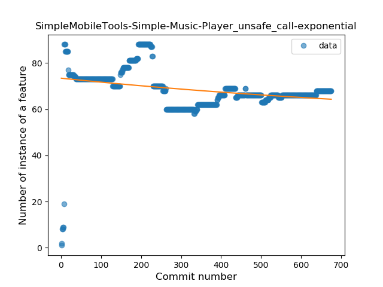

### <a name="string_template">String Template</a>
----
#### Functions
* **Sudden Rise Plateau - Logarithm:** 
    * **R_Squared:** 0.33107128
* **Constant Rise - Linear:** 
    * **R_Squared:** 0.12103228

**Plots** :chart_with_upwards_trend:
-----

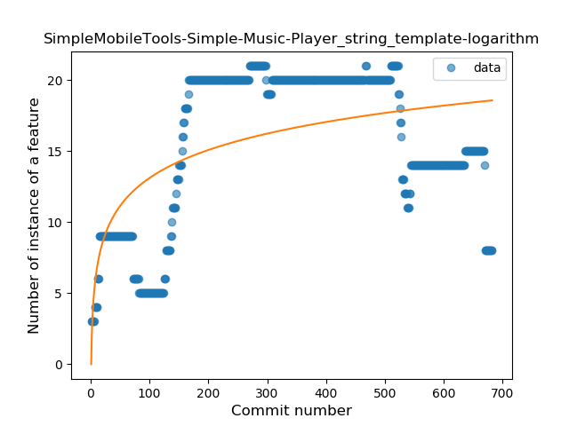
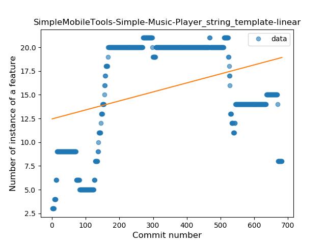
### <a name="func_with_default_value">Function with Default Value</a>
----
#### Functions
* **Plateau Gradual Rise - Sigmoid:** 
    * **R_Squared:** 0.92474298
* **Sudden Rise Plateau - Logarithm:** 
    * **R_Squared:** 0.52457212
* **Constant Rise - Linear:** 
    * **R_Squared:** 0.44238814

**Plots** :chart_with_upwards_trend:
-----

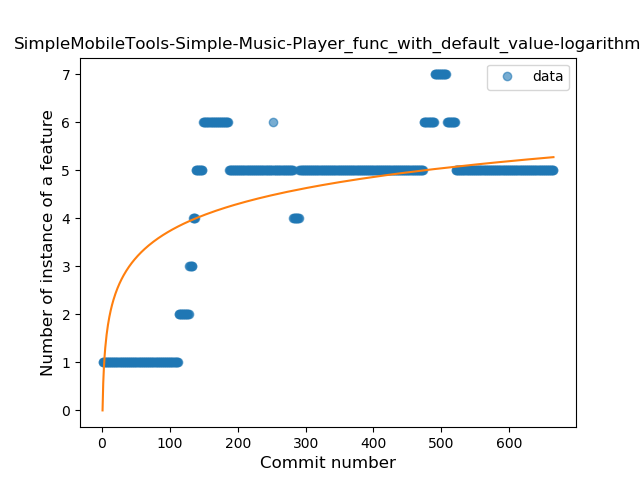
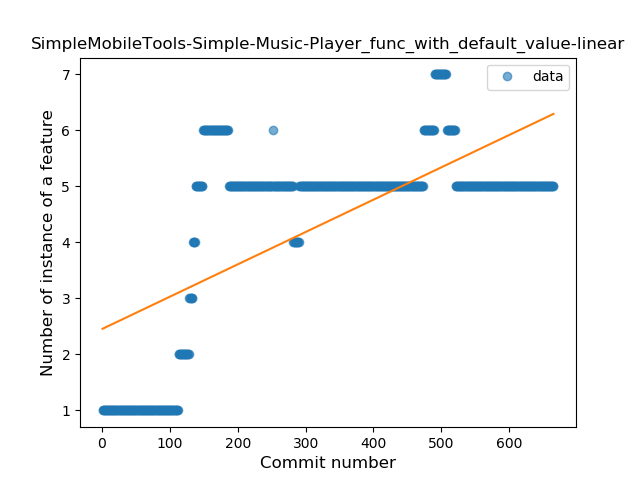
### <a name="range_expr">Range Expression</a>
----
#### Functions
* **Plateau Gradual Rise - Sigmoid:** 
    * **R_Squared:** 0.19979066
* **Sudden Rise Plateau - Logarithm:** 
    * **R_Squared:** 0.03174985
* **Constant Decline - Linear:** 
    * **R_Squared:** 0.00336231
* **Sudden Decline - Exponential:** 
    * **R_Squared:** 0.00120971

**Plots** :chart_with_upwards_trend:
-----

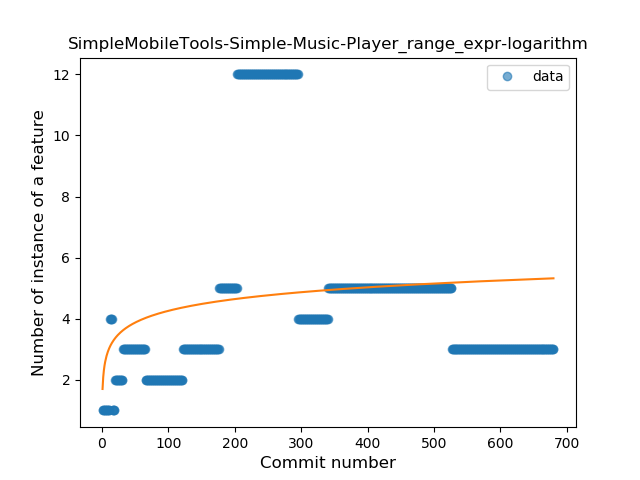
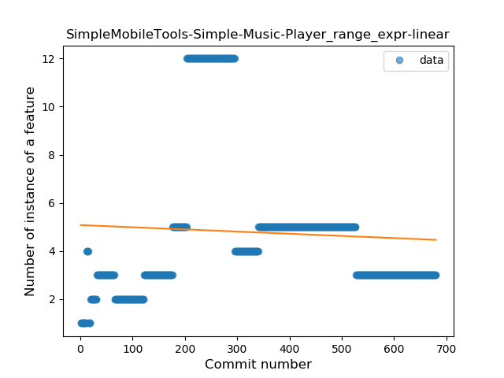

### <a name="func_call_with_named_arg">Function call with Named Argument</a>
----
#### Functions
* **Plateau Gradual Rise - Sigmoid:** 
    * **R_Squared:** 0.84300597
* **Constant Rise - Linear:** 
    * **R_Squared:** 0.69628035
* **Sudden Rise Plateau - Logarithm:** 
    * **R_Squared:** 0.39065623

**Plots** :chart_with_upwards_trend:
-----

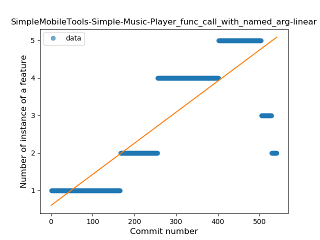
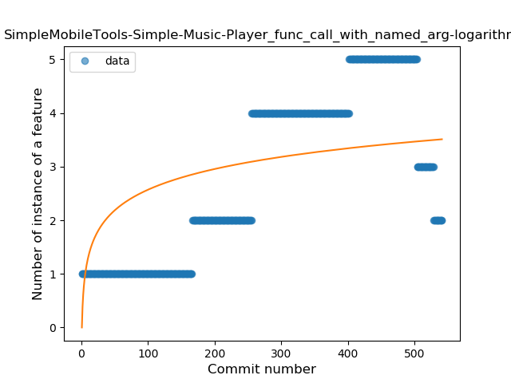
### <a name="data_class">Data Class</a>
----
#### Functions
* **Plateau Sudden Rise - Binary Sigmoid:** 
    * **R_Squared:** 1.0
* **Sudden Rise Plateau - Logarithm:** 
    * **R_Squared:** 0.55565317
* **Constant Rise - Linear:** 
    * **R_Squared:** 0.22046512

**Plots** :chart_with_upwards_trend:
-----

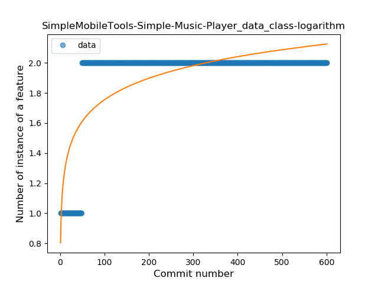
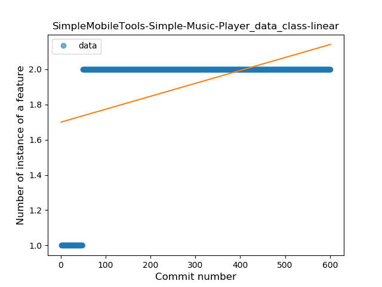
### <a name="extension_function">Extension Function</a>
----
#### Functions
* **Sudden Rise - Exponential:** 
    * **R_Squared:** 0.79270699
* **Constant Rise - Linear:** 
    * **R_Squared:** 0.64698907
* **Sudden Rise Plateau - Logarithm:** 
    * **R_Squared:** 0.22275971
* **Plateau Sudden Rise - Binary Sigmoid:** 
    * **R_Squared:** 0.00887519

**Plots** :chart_with_upwards_trend:
-----

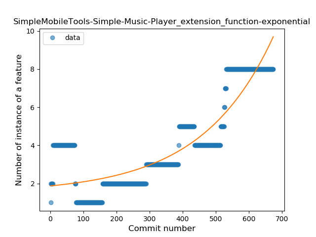
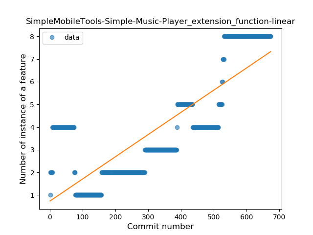

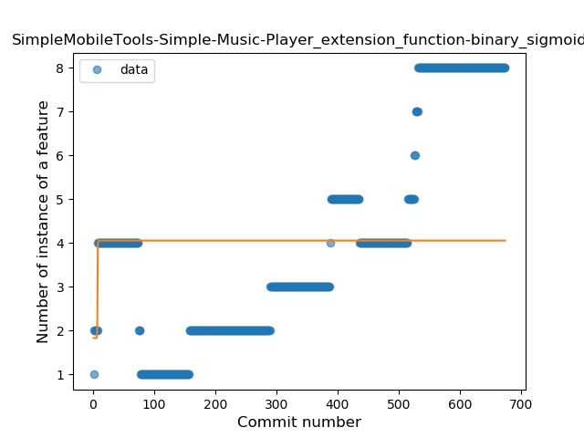
