## SimpleMobileTools-Simple-Notes
----
#### Metrics provided by Detekt
* Number of lines of code 3051
* Number of Kotlin files: 40
* Cyclomatic complexity: 538
* Cyclomatic complexity by thousands of lines: 322 

----
**13** features analyzed

*	<a href="#type_inference">Type Inference</a> 
*	<a href="#lambda">Lambda</a> 
*	<a href="#safe_call">Safe Call</a> 
*	<a href="#when_expr">When expression</a> 
*	<a href="#companion_object">Companion Object</a> 
*	<a href="#unsafe_call">Unsafe Call</a> 
*	<a href="#string_template">String Template</a> 
*	<a href="#func_with_default_value">Function with Default Value</a> 
*	<a href="#singleton">Singleton</a> 
*	<a href="#range_expr">Range Expression</a> 
*	<a href="#func_call_with_named_arg">Function call with Named Argument</a> 
*	<a href="#data_class">Data Class</a> 
*	<a href="#extension_function">Extension Function</a> 

### <a name="type_inference">Type Inference</a>
----
#### Functions
* **Constant Rise - Linear:** 
    * **R_Squared:** 0.78552523
* **Sudden Rise Plateau - Logarithm:** 
    * **R_Squared:** 0.67609829
* **Plateau Sudden Rise - Binary Sigmoid:** 
    * **R_Squared:** 0.33324577

**Plots** :chart_with_upwards_trend:
-----

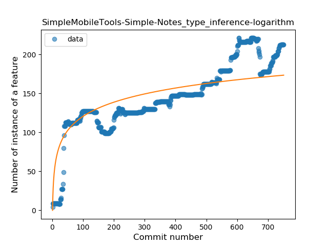
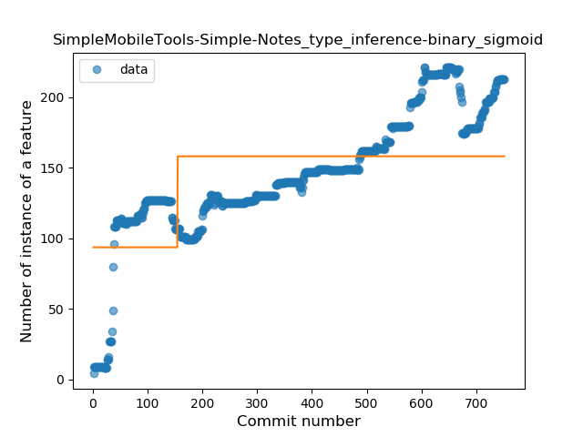
### <a name="lambda">Lambda</a>
----
#### Functions
* **Sudden Rise - Exponential:** 
    * **R_Squared:** 0.96557538
* **Constant Rise - Linear:** 
    * **R_Squared:** 0.95110051
* **Sudden Rise Plateau - Logarithm:** 
    * **R_Squared:** 0.43536355
* **Plateau Sudden Rise - Binary Sigmoid:** 
    * **R_Squared:** 0.2185862

**Plots** :chart_with_upwards_trend:
-----

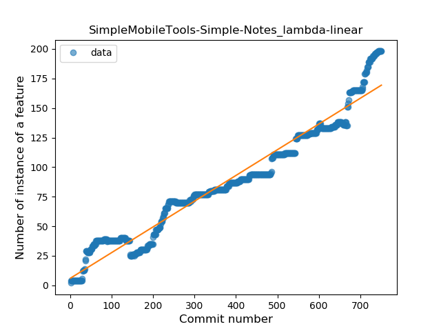

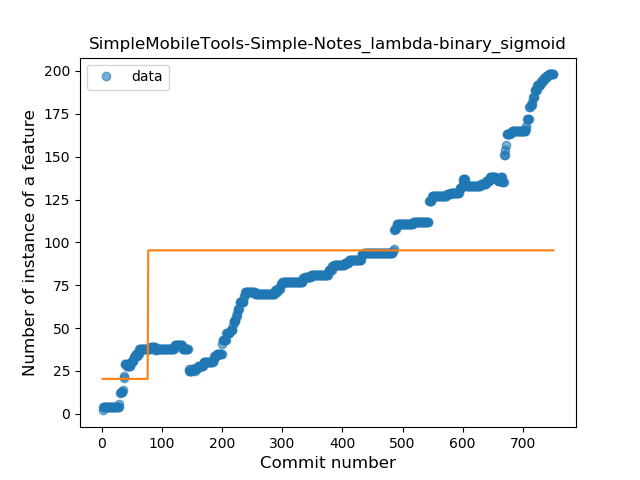
### <a name="safe_call">Safe Call</a>
----
#### Functions
* **Sudden Rise - Exponential:** 
    * **R_Squared:** 0.95701333
* **Constant Rise - Linear:** 
    * **R_Squared:** 0.94668015
* **Sudden Rise Plateau - Logarithm:** 
    * **R_Squared:** 0.36257217

**Plots** :chart_with_upwards_trend:
-----

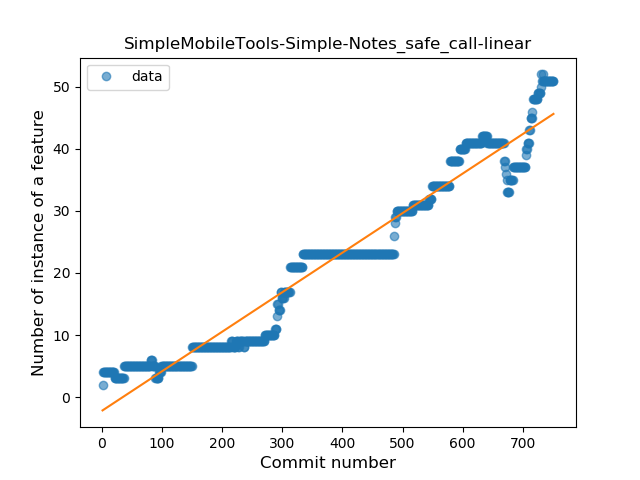
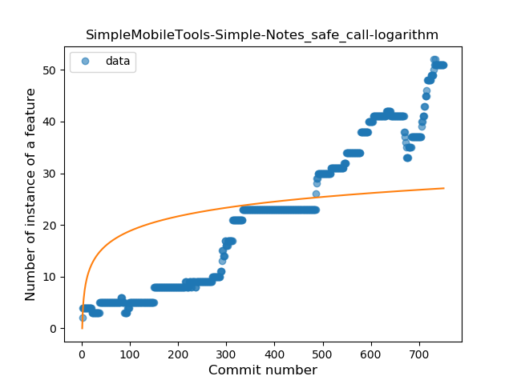
### <a name="when_expr">When expression</a>
----
#### Functions
* **Constant Rise - Linear:** 
    * **R_Squared:** 0.92643985
* **Plateau Gradual Rise - Sigmoid:** 
    * **R_Squared:** 0.93274401
* **Sudden Rise Plateau - Logarithm:** 
    * **R_Squared:** 0.61867399

**Plots** :chart_with_upwards_trend:
-----

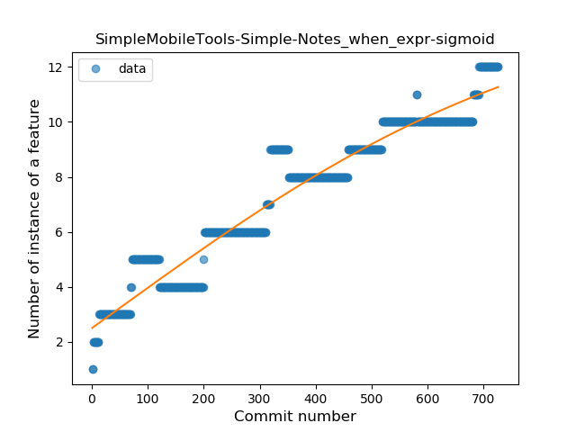

### <a name="companion_object">Companion Object</a>
----
#### Functions
* **Constant Rise - Linear:** 
    * **R_Squared:** 2.834e-05
* **Sudden Rise - Exponential:** 
    * **R_Squared:** 3.262e-05
* **Sudden Rise Plateau - Logarithm:** 
    * **R_Squared:** 0.0056707

**Plots** :chart_with_upwards_trend:
-----

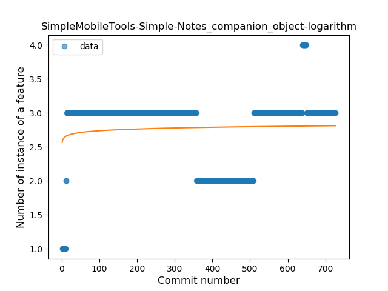
### <a name="unsafe_call">Unsafe Call</a>
----
#### Functions
* **Sudden Rise - Exponential:** 
    * **R_Squared:** 0.89553092
* **Constant Rise - Linear:** 
    * **R_Squared:** 0.60283033
* **Sudden Rise Plateau - Logarithm:** 
    * **R_Squared:** 0.16025738

**Plots** :chart_with_upwards_trend:
-----

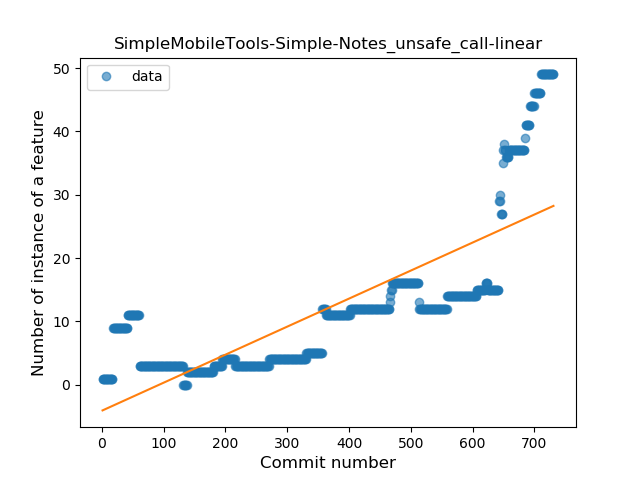
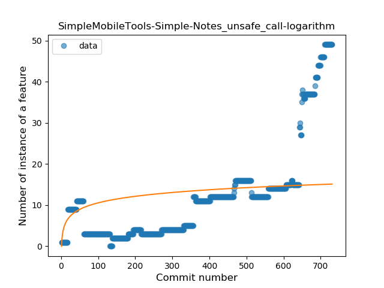
### <a name="string_template">String Template</a>
----
#### Functions
* **Sudden Rise Plateau - Logarithm:** 
    * **R_Squared:** 0.04458909
* **Constant Rise - Linear:** 
    * **R_Squared:** 0.00928839

**Plots** :chart_with_upwards_trend:
-----

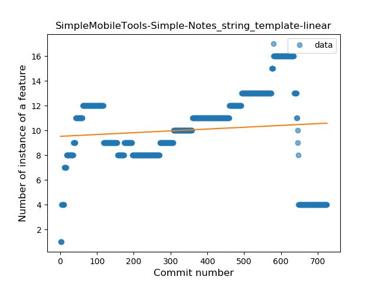
### <a name="func_with_default_value">Function with Default Value</a>
----
#### Functions
* **Sudden Rise - Exponential:** 
    * **R_Squared:** 0.88903726
* **Constant Rise - Linear:** 
    * **R_Squared:** 0.80489055
* **Sudden Rise Plateau - Logarithm:** 
    * **R_Squared:** 0.40896478

**Plots** :chart_with_upwards_trend:
-----

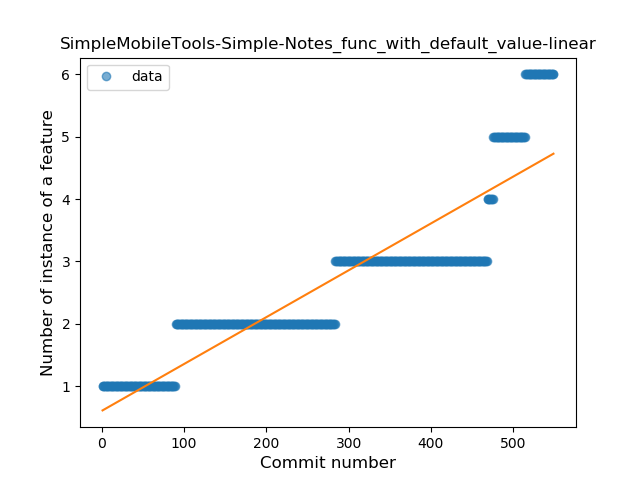
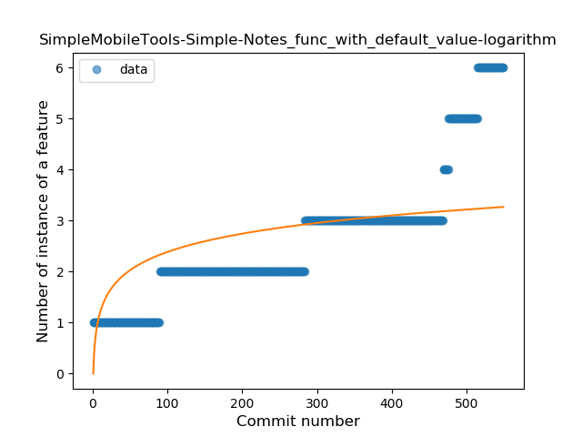
### <a name="singleton">Singleton</a>
----
#### Functions
* **Plateau Sudden Decline - Binary Sigmoid:** 
    * **R_Squared:** 0.70981429
* **Sudden Decline - Exponential:** 
    * **R_Squared:** 0.56332347
* **Constant Decline - Linear:** 
    * **R_Squared:** 0.04700952
* **Sudden Rise Plateau - Logarithm:** 
    * **R_Squared:** -0.0

**Plots** :chart_with_upwards_trend:
-----

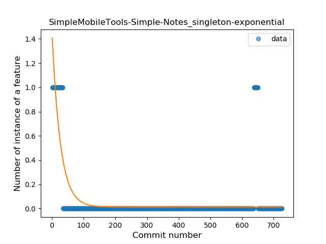
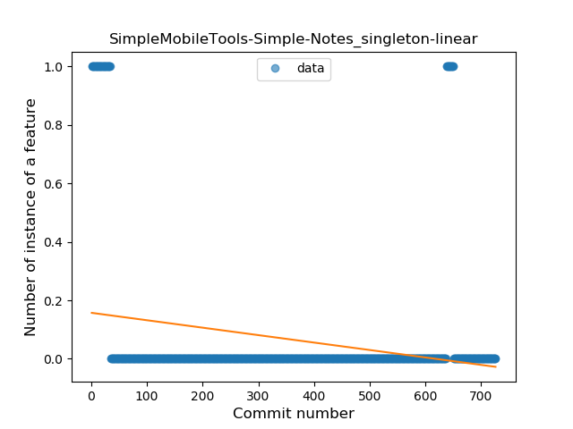
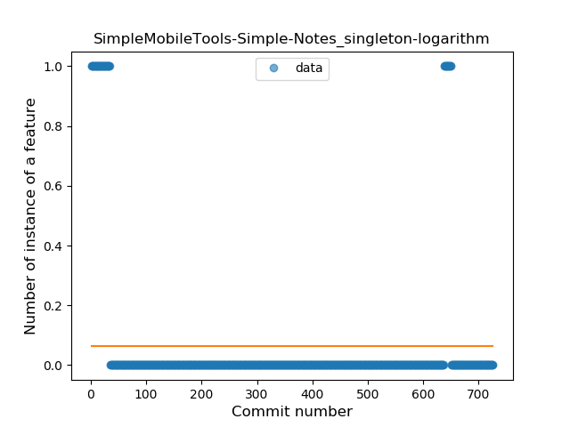
### <a name="range_expr">Range Expression</a>
----
#### Functions
* **Plateau Sudden Decline - Binary Sigmoid:** 
    * **R_Squared:** 0.99101294
* **Sudden Decline - Exponential:** 
    * **R_Squared:** 0.76000154
* **Constant Decline - Linear:** 
    * **R_Squared:** 0.49547177
* **Sudden Rise Plateau - Logarithm:** 
    * **R_Squared:** -0.0

**Plots** :chart_with_upwards_trend:
-----

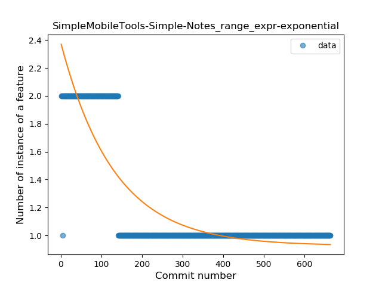
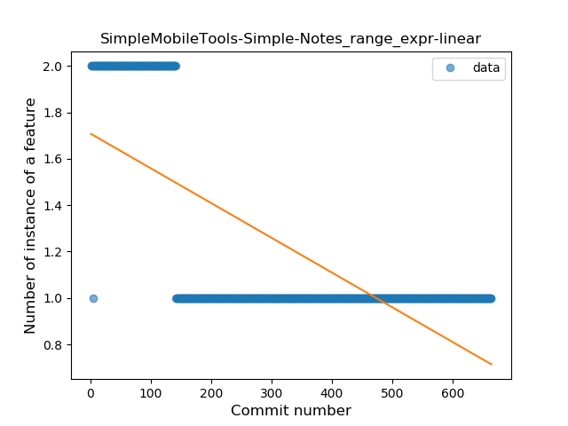
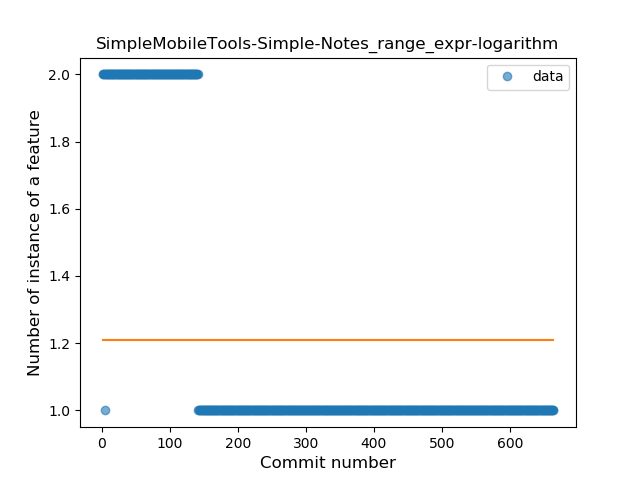
### <a name="func_call_with_named_arg">Function call with Named Argument</a>
----
#### Functions
* **Plateau Gradual Rise - Sigmoid:** 
    * **R_Squared:** 0.98005524
* **Constant Rise - Linear:** 
    * **R_Squared:** 0.80174715
* **Sudden Rise - Exponential:** 
    * **R_Squared:** 0.80842013
* **Sudden Rise Plateau - Logarithm:** 
    * **R_Squared:** 0.39084918

**Plots** :chart_with_upwards_trend:
-----

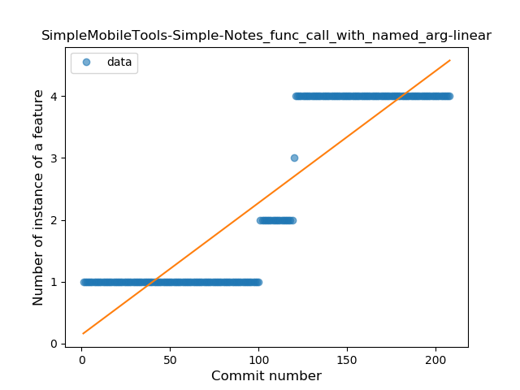
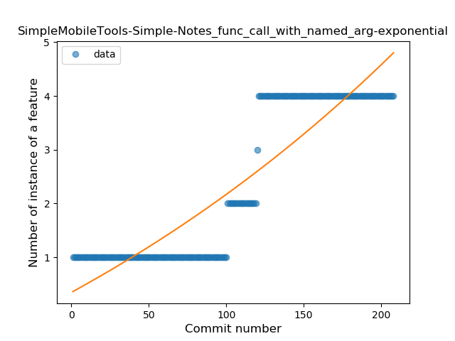
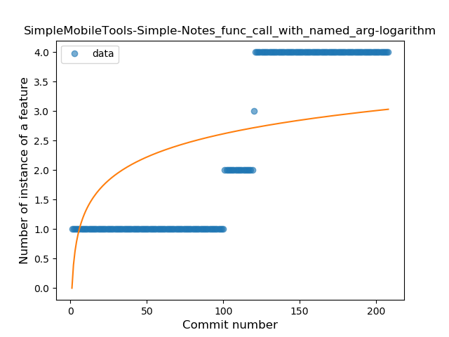
### <a name="data_class">Data Class</a>
----
#### Functions
* **Plateau Gradual Rise - Sigmoid:** 
    * **R_Squared:** 0.94713563
* **Sudden Rise - Exponential:** 
    * **R_Squared:** 0.88611329
* **Constant Rise - Linear:** 
    * **R_Squared:** 0.64053126
* **Sudden Rise Plateau - Logarithm:** 
    * **R_Squared:** 0.23302088

**Plots** :chart_with_upwards_trend:
-----

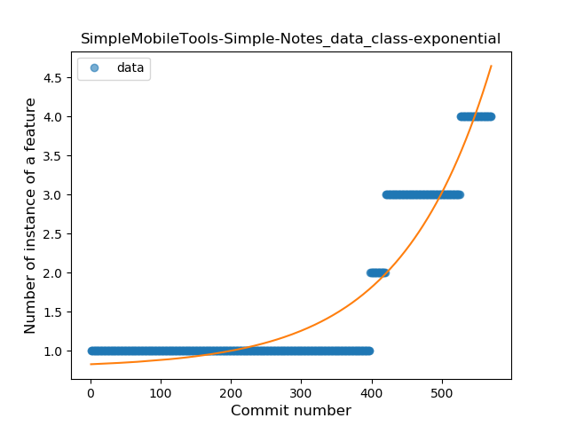
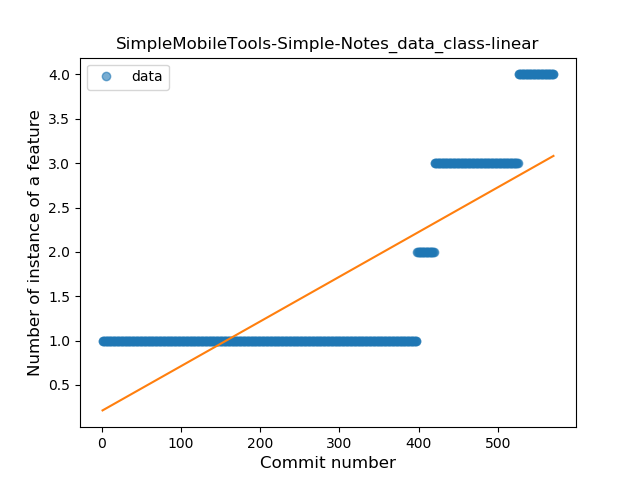
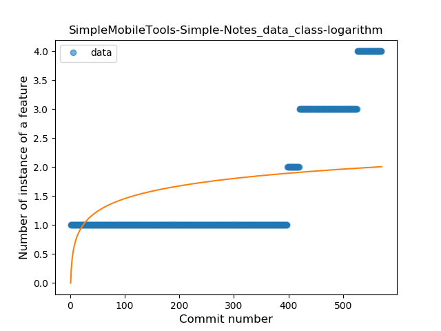
### <a name="extension_function">Extension Function</a>
----
#### Functions
* **Constant Decline - Linear:** 
    * **R_Squared:** 0.2536888
* **Plateau Sudden Rise - Binary Sigmoid:** 
    * **R_Squared:** 0.14397604
* **Sudden Rise Plateau - Logarithm:** 
    * **R_Squared:** -0.0

**Plots** :chart_with_upwards_trend:
-----

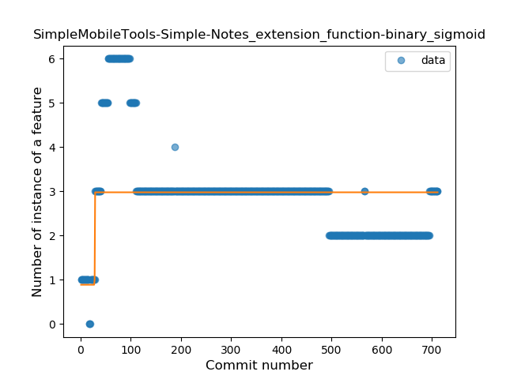

