## SimpleMobileTools-Simple-Thank-You
----
#### Metrics provided by Detekt
* Number of lines of code 322
* Number of Kotlin files: 10
* Cyclomatic complexity: 42
* Cyclomatic complexity by thousands of lines: 274 

----
**5** features analyzed

*	<a href="#type_inference">Type Inference</a> 
*	<a href="#lambda">Lambda</a> 
*	<a href="#when_expr">When expression</a> 
*	<a href="#companion_object">Companion Object</a> 
*	<a href="#string_template">String Template</a> 

### <a name="type_inference">Type Inference</a>
----
#### Functions
* **Constant Rise - Linear:** 
    * **R_Squared:** 0.32928046
* **Sudden Rise Plateau - Logarithm:** 
    * **R_Squared:** 0.27581432
* **Plateau Sudden Rise - Binary Sigmoid:** 
    * **R_Squared:** 0.07120184

**Plots** :chart_with_upwards_trend:
-----

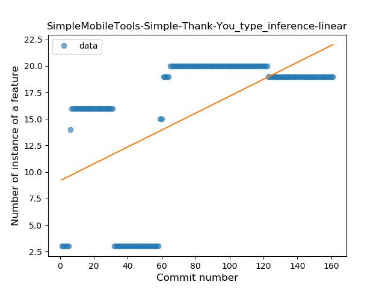
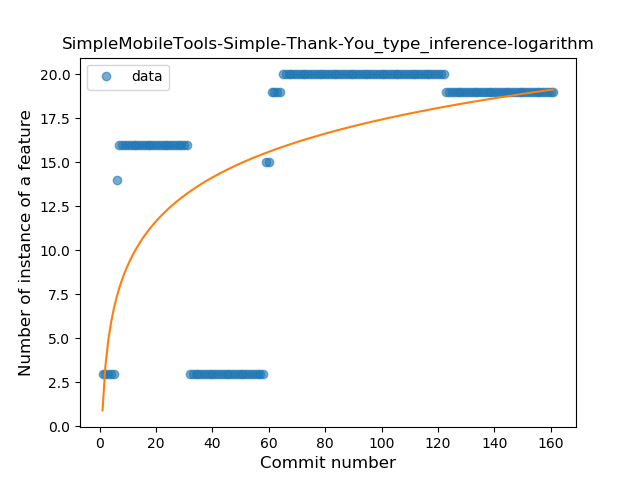
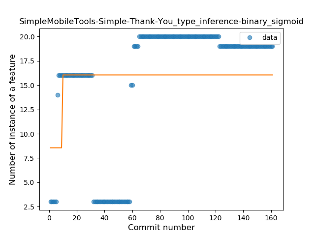
### <a name="lambda">Lambda</a>
----
#### Functions
* **Sudden Rise - Exponential:** 
    * **R_Squared:** 0.02954208
* **Constant Rise - Linear:** 
    * **R_Squared:** 0.00375203
* **Sudden Rise Plateau - Logarithm:** 
    * **R_Squared:** -0.0

**Plots** :chart_with_upwards_trend:
-----

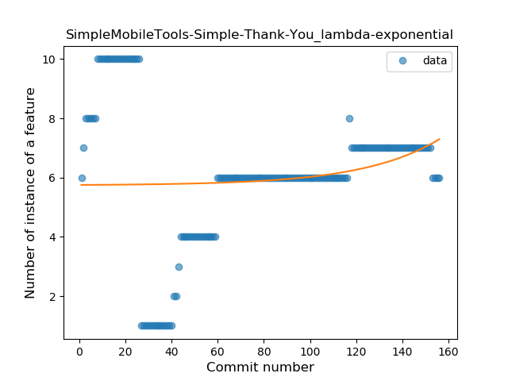
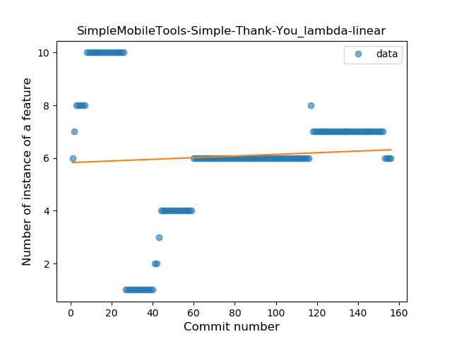

### <a name="when_expr">When expression</a>
----
#### Functions
* **Plateau Sudden Decline - Binary Sigmoid:** 
    * **R_Squared:** 0.88285229
* **Sudden Decline - Exponential:** 
    * **R_Squared:** 0.58586322
* **Constant Decline - Linear:** 
    * **R_Squared:** 0.39300682
* **Sudden Rise Plateau - Logarithm:** 
    * **R_Squared:** -0.0

**Plots** :chart_with_upwards_trend:
-----

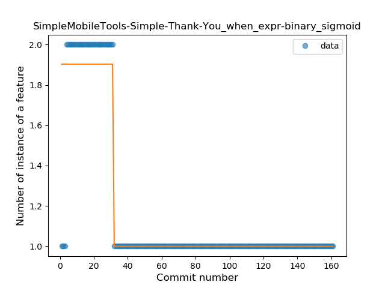
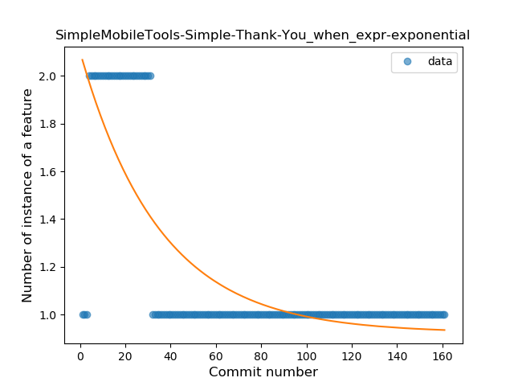
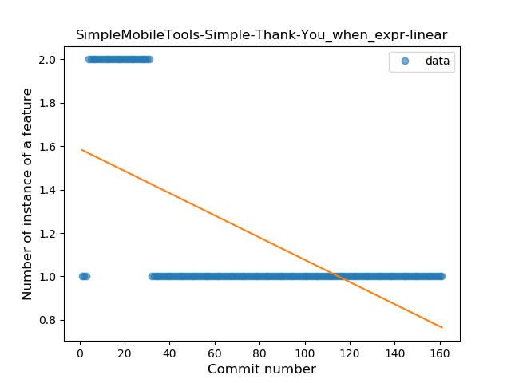
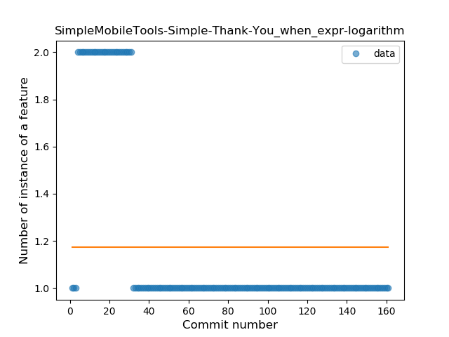
### <a name="companion_object">Companion Object</a>
----
#### Functions
* **Plateau Sudden Rise - Binary Sigmoid:** 
    * **R_Squared:** 1.0
* **Constant Rise - Linear:** 
    * **R_Squared:** 0.69143519
* **Sudden Rise Plateau - Logarithm:** 
    * **R_Squared:** 0.62079156

**Plots** :chart_with_upwards_trend:
-----

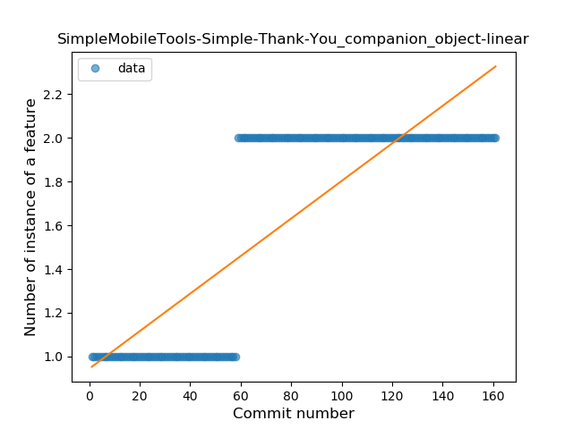
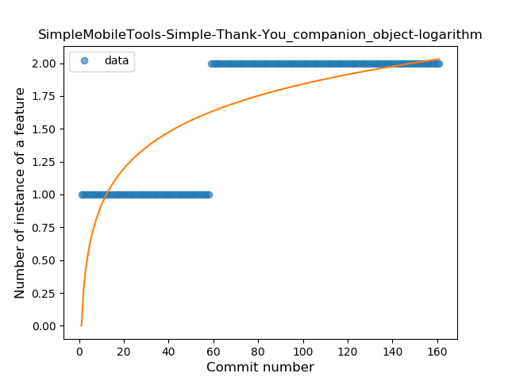
### <a name="string_template">String Template</a>
----
#### Functions
* **Plateau Gradual Rise - Sigmoid:** 
    * **R_Squared:** 0.78709825
* **Constant Rise - Linear:** 
    * **R_Squared:** 0.56077394
* **Sudden Rise - Exponential:** 
    * **R_Squared:** 0.56090869
* **Sudden Rise Plateau - Logarithm:** 
    * **R_Squared:** 0.31991271

**Plots** :chart_with_upwards_trend:
-----

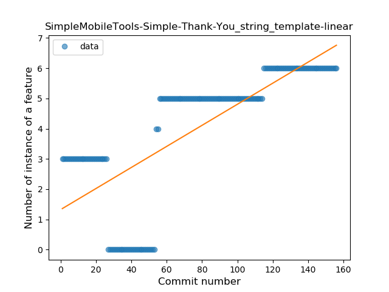
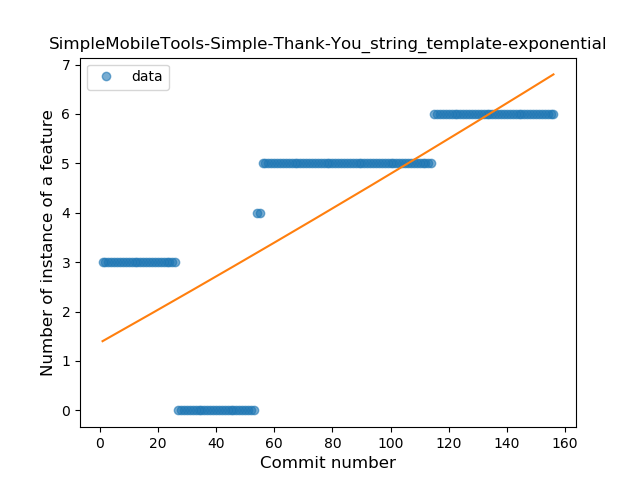
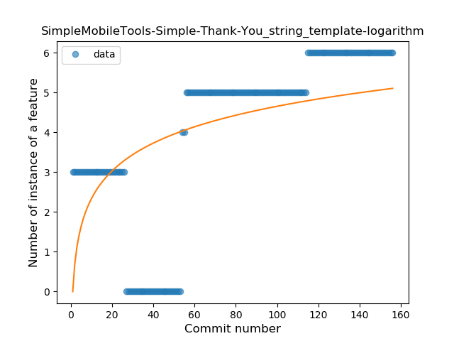
