## SpiritCroc-DarkCroc-Android-theme
----
#### Metrics provided by Detekt
* Number of lines of code 578
* Number of Kotlin files: 3
* Cyclomatic complexity: 102
* Cyclomatic complexity by thousands of lines: 306 

----
**7** features analyzed

*	<a href="#type_inference">Type Inference</a> 
*	<a href="#lambda">Lambda</a> 
*	<a href="#when_expr">When expression</a> 
*	<a href="#unsafe_call">Unsafe Call</a> 
*	<a href="#string_template">String Template</a> 
*	<a href="#singleton">Singleton</a> 
*	<a href="#func_call_with_named_arg">Function call with Named Argument</a> 

### <a name="type_inference">Type Inference</a>
----
#### Functions
* **Constant Decline - Linear:** 
    * **R_Squared:** 0.13605988
* **Plateau Gradual Decline - Sigmoid:** 
    * **R_Squared:** 0.08427107
* **Sudden Rise Plateau - Logarithm:** 
    * **R_Squared:** -0.0

**Plots** :chart_with_upwards_trend:
-----

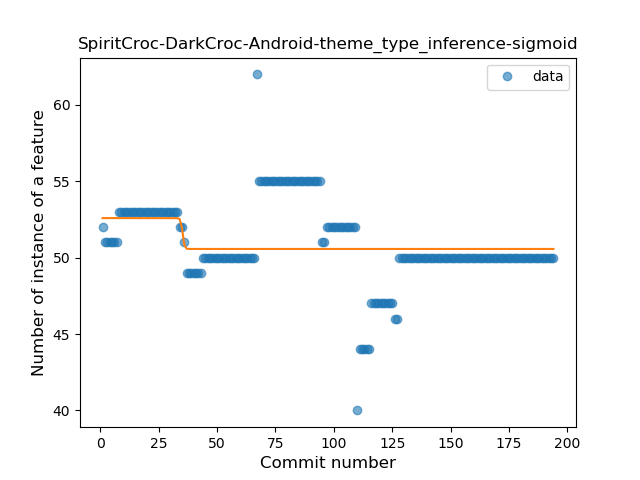
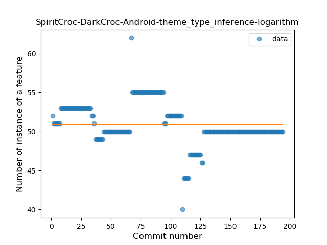
### <a name="lambda">Lambda</a>
----
#### Functions
* **Plateau Gradual Rise - Sigmoid:** 
    * **R_Squared:** 0.86662341
* **Sudden Rise Plateau - Logarithm:** 
    * **R_Squared:** 0.71838985
* **Constant Rise - Linear:** 
    * **R_Squared:** 0.67185829

**Plots** :chart_with_upwards_trend:
-----

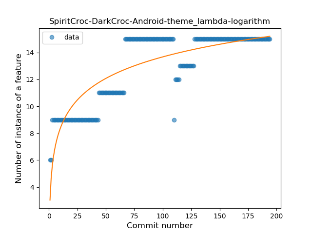

### <a name="when_expr">When expression</a>
----
#### Functions
* **Plateau Sudden Decline - Binary Sigmoid:** 
    * **R_Squared:** 1.0
* **Sudden Decline - Exponential:** 
    * **R_Squared:** 0.78778747
* **Constant Decline - Linear:** 
    * **R_Squared:** 0.38571429
* **Sudden Rise Plateau - Logarithm:** 
    * **R_Squared:** -0.0

**Plots** :chart_with_upwards_trend:
-----

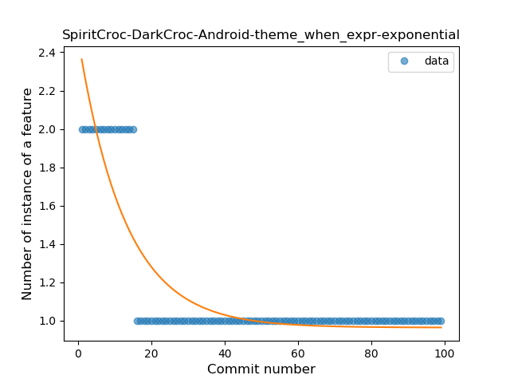
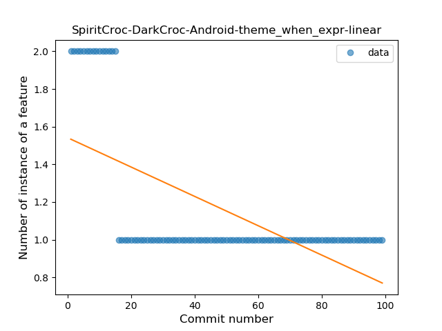
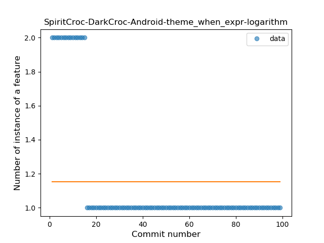
### <a name="unsafe_call">Unsafe Call</a>
----
#### Functions
* **Sudden Decline - Exponential:** 
    * **R_Squared:** 0.88694152
* **Constant Decline - Linear:** 
    * **R_Squared:** 0.82509491
* **Sudden Rise Plateau - Logarithm:** 
    * **R_Squared:** -0.0

**Plots** :chart_with_upwards_trend:
-----

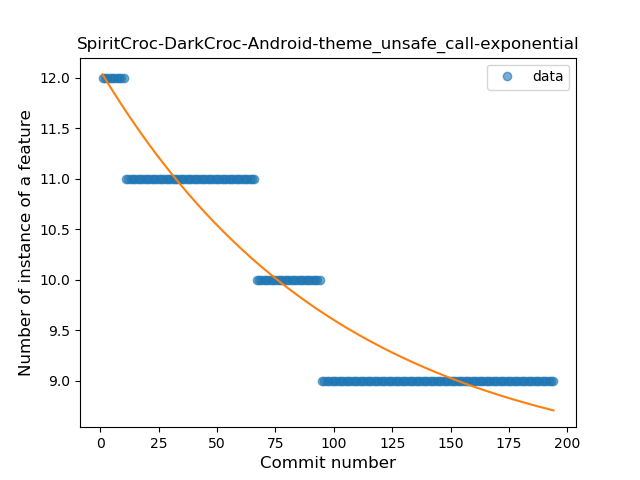
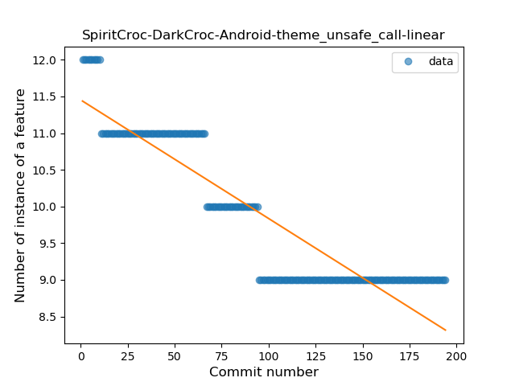
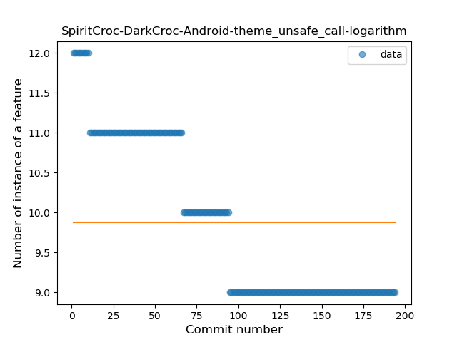
### <a name="string_template">String Template</a>
----
#### Functions
* **Plateau Sudden Rise - Binary Sigmoid:** 
    * **R_Squared:** 1.0
* **Constant Rise - Linear:** 
    * **R_Squared:** 0.74839773
* **Sudden Rise Plateau - Logarithm:** 
    * **R_Squared:** 0.53761041

**Plots** :chart_with_upwards_trend:
-----

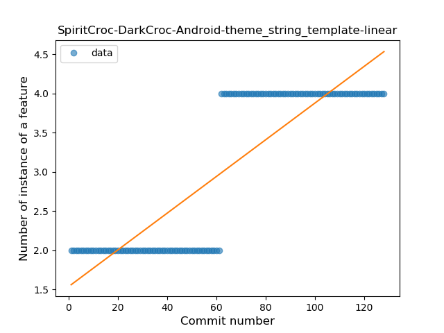
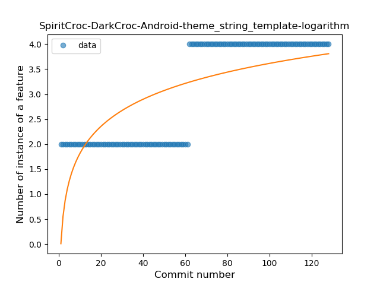
### <a name="singleton">Singleton</a>
----
#### Functions
* **Plateau Sudden Decline - Binary Sigmoid:** 
    * **R_Squared:** 1.0
* **Sudden Decline - Exponential:** 
    * **R_Squared:** 0.75845891
* **Constant Decline - Linear:** 
    * **R_Squared:** 0.6734157
* **Sudden Rise Plateau - Logarithm:** 
    * **R_Squared:** 0.0

**Plots** :chart_with_upwards_trend:
-----

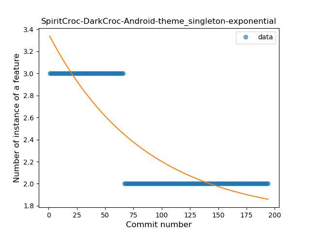
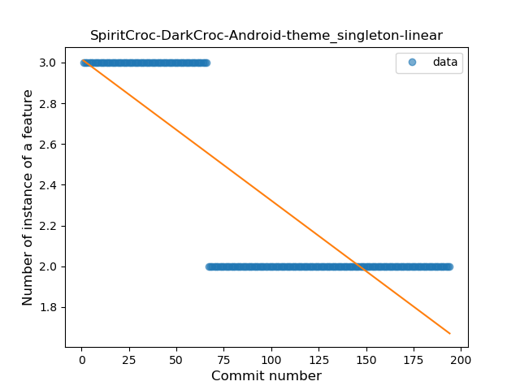
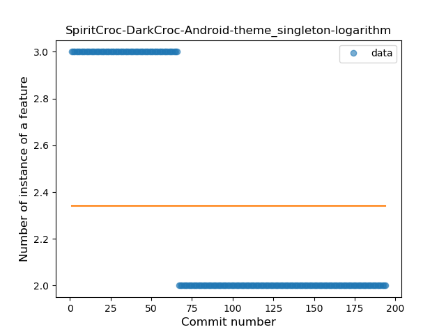
### <a name="func_call_with_named_arg">Function call with Named Argument</a>
----
#### Functions
* **Plateau Sudden Rise - Binary Sigmoid:** 
    * **R_Squared:** 1.0
* **Constant Rise - Linear:** 
    * **R_Squared:** 0.74839773
* **Sudden Rise Plateau - Logarithm:** 
    * **R_Squared:** 0.53761041

**Plots** :chart_with_upwards_trend:
-----

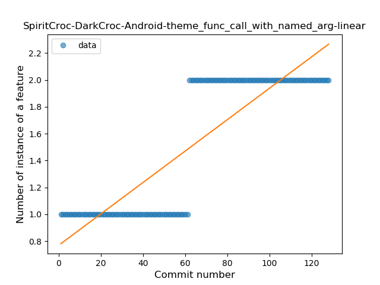
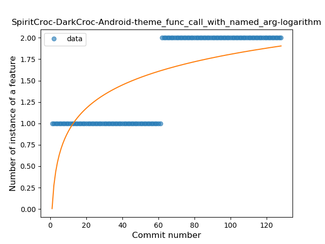
