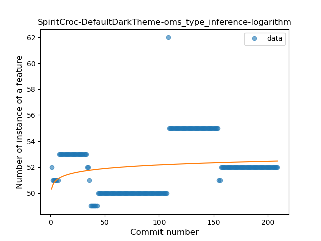
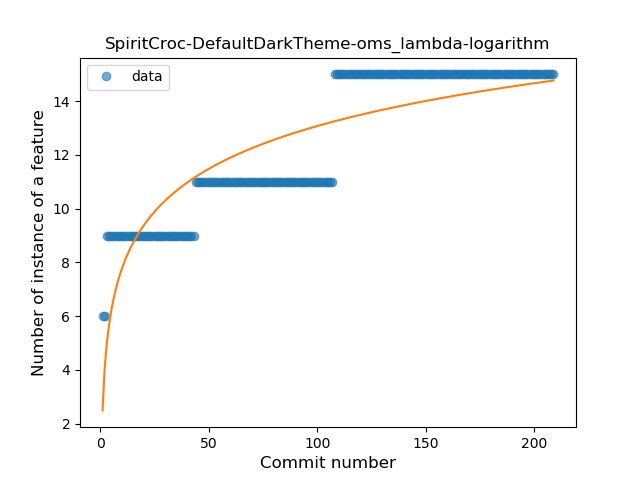
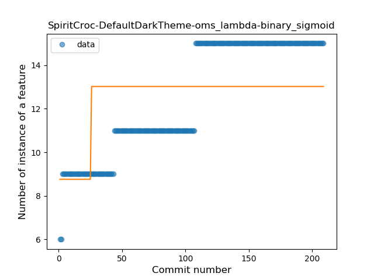
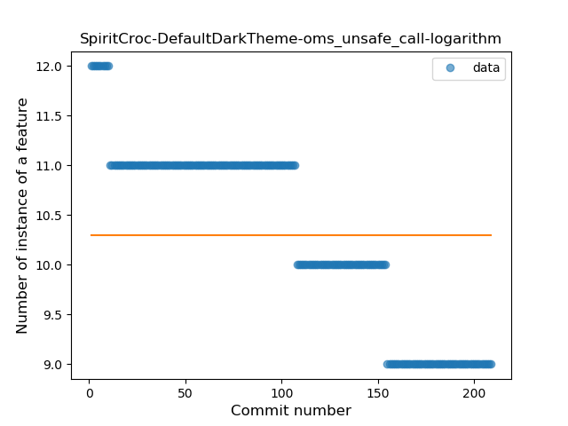
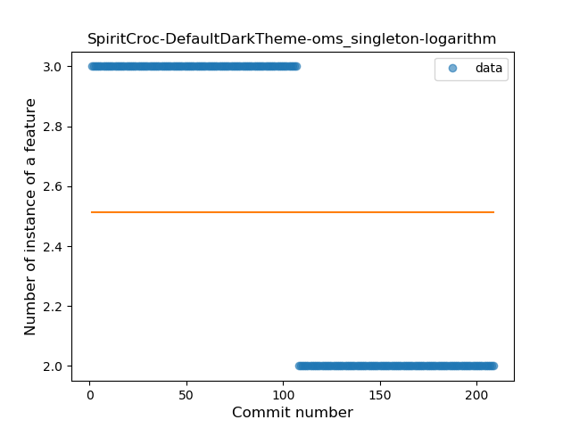

## SpiritCroc-DefaultDarkTheme-oms
----
#### Metrics provided by Detekt
* Number of lines of code 587
* Number of Kotlin files: 3
* Cyclomatic complexity: 107
* Cyclomatic complexity by thousands of lines: 307 

----
**4** features analyzed

*	<a href="#type_inference">Type Inference</a> 
*	<a href="#lambda">Lambda</a> 
*	<a href="#unsafe_call">Unsafe Call</a> 
*	<a href="#singleton">Singleton</a> 

### <a name="type_inference">Type Inference</a>
----
#### Functions
* **Constant Rise - Linear:** 
    * **R_Squared:** 0.07865967
* **Sudden Rise Plateau - Logarithm:** 
    * **R_Squared:** 0.03610734

**Plots** :chart_with_upwards_trend:
-----

### <a name="lambda">Lambda</a>
----
#### Functions
* **Constant Rise - Linear:** 
    * **R_Squared:** 0.84100432
* **Sudden Rise Plateau - Logarithm:** 
    * **R_Squared:** 0.73385951
* **Plateau Sudden Rise - Binary Sigmoid:** 
    * **R_Squared:** 0.29216575

**Plots** :chart_with_upwards_trend:
-----

### <a name="unsafe_call">Unsafe Call</a>
----
#### Functions
* **Constant Decline - Linear:** 
    * **R_Squared:** 0.86475897
* **Sudden Rise Plateau - Logarithm:** 
    * **R_Squared:** -0.0

**Plots** :chart_with_upwards_trend:
-----

### <a name="singleton">Singleton</a>
----
#### Functions
* **Plateau Sudden Decline - Binary Sigmoid:** 
    * **R_Squared:** 1.0
* **Constant Decline - Linear:** 
    * **R_Squared:** 0.74958791
* **Sudden Rise Plateau - Logarithm:** 
    * **R_Squared:** -0.0

**Plots** :chart_with_upwards_trend:
-----

