## Streetwalrus-android_usb_msd
----
#### Metrics provided by Detekt
* Number of lines of code 344
* Number of Kotlin files: 6
* Cyclomatic complexity: 44
* Cyclomatic complexity by thousands of lines: 234 

----
**5** features analyzed

*	<a href="#type_inference">Type Inference</a> 
*	<a href="#lambda">Lambda</a> 
*	<a href="#safe_call">Safe Call</a> 
*	<a href="#unsafe_call">Unsafe Call</a> 
*	<a href="#string_template">String Template</a> 

### <a name="type_inference">Type Inference</a>
----
#### Functions
* **Instability - Polinomial 3:** )
    * **R_Squared:** 0.94207752
* **Sudden Rise Plateau - Logarithm:** 
    * **R_Squared:** 0.85010033
* **Constant Rise - Linear:** 
    * **R_Squared:** 0.59284832
* **Plateau Sudden Rise - Binary Sigmoid:** 
    * **R_Squared:** 0.48271419

**Plots** :chart_with_upwards_trend:
-----

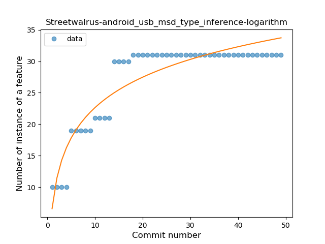
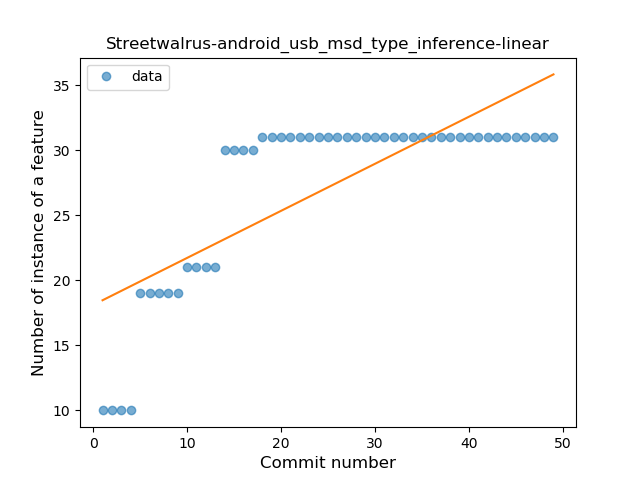
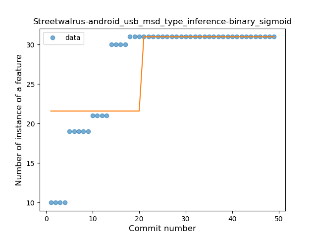
### <a name="lambda">Lambda</a>
----
#### Functions
* **Plateau Sudden Decline - Binary Sigmoid:** 
    * **R_Squared:** 1.0
* **Sudden Decline - Exponential:** 
    * **R_Squared:** 0.80229978
* **Instability - Polinomial 3:** )
    * **R_Squared:** 0.77602525
* **Constant Decline - Linear:** 
    * **R_Squared:** 0.2965251
* **Sudden Rise Plateau - Logarithm:** 
    * **R_Squared:** -0.0

**Plots** :chart_with_upwards_trend:
-----

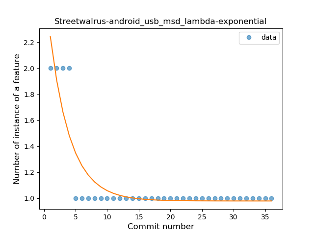
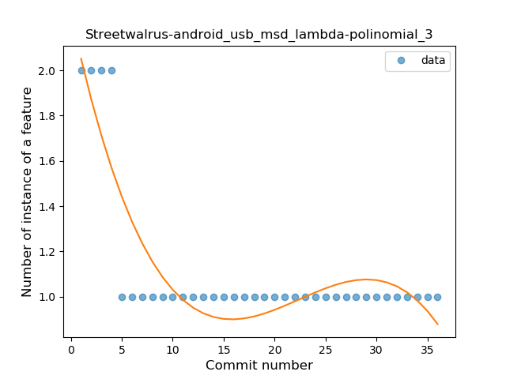
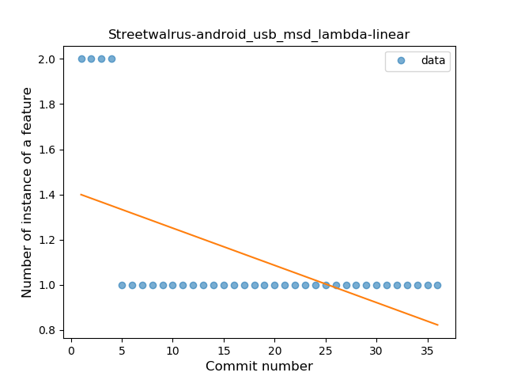
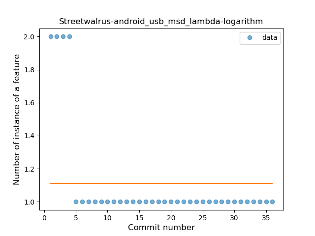
### <a name="safe_call">Safe Call</a>
----
#### Functions
* **Plateau Sudden Rise - Binary Sigmoid:** 
    * **R_Squared:** 1.0
* **Instability - Polinomial 3:** )
    * **R_Squared:** 0.83580776
* **Sudden Rise - Exponential:** 
    * **R_Squared:** 0.75376413
* **Constant Rise - Linear:** 
    * **R_Squared:** 0.72035573
* **Sudden Rise Plateau - Logarithm:** 
    * **R_Squared:** 0.4514065

**Plots** :chart_with_upwards_trend:
-----

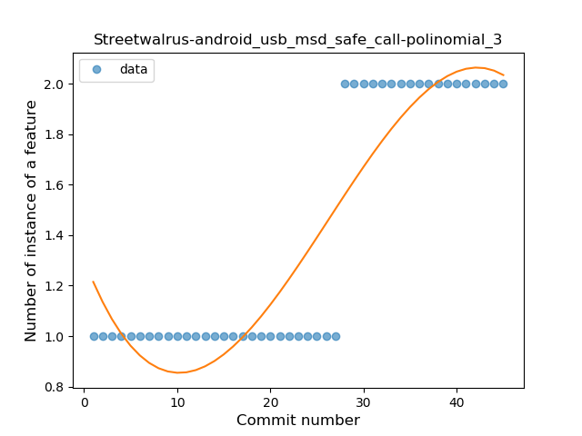
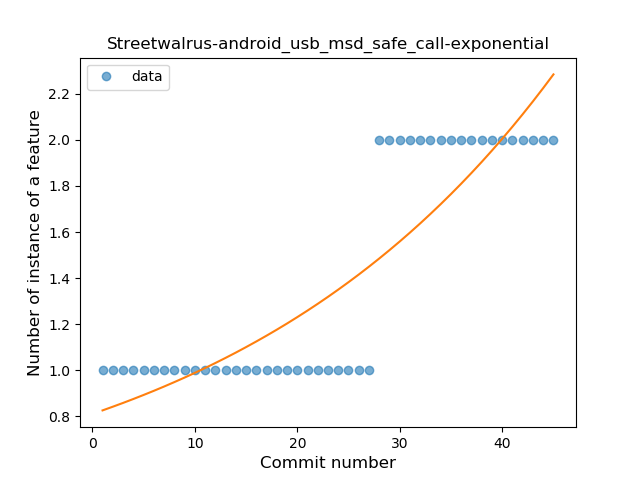
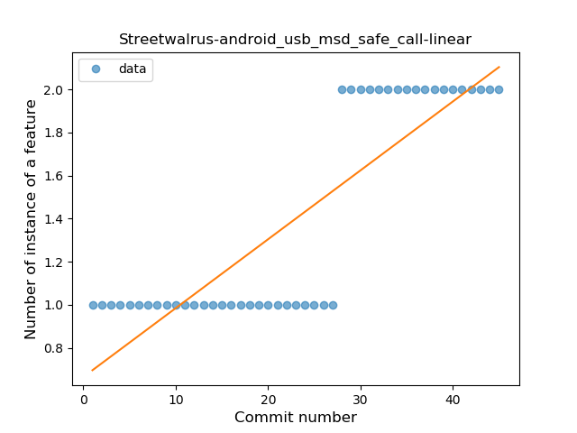
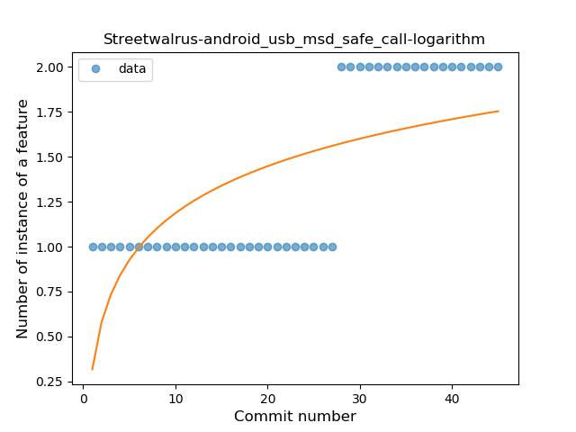
### <a name="unsafe_call">Unsafe Call</a>
----
#### Functions
* **Sudden Rise Plateau - Logarithm:** 
    * **R_Squared:** 0.51324379
* **Constant Rise - Linear:** 
    * **R_Squared:** 0.47353757

**Plots** :chart_with_upwards_trend:
-----

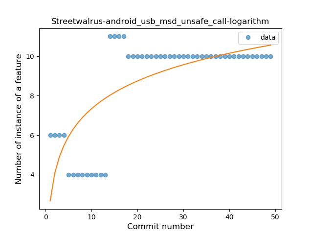
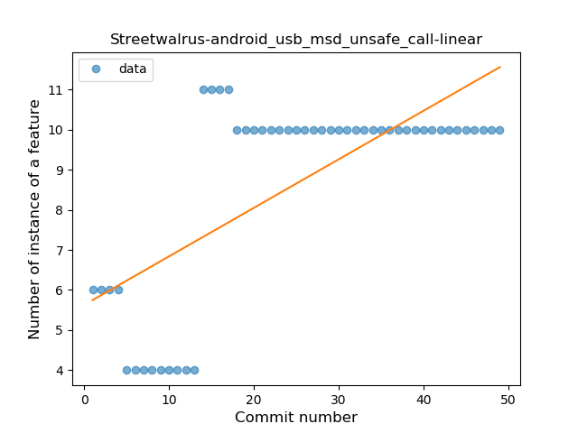
### <a name="string_template">String Template</a>
----
#### Functions
* **Instability - Polinomial 3:** )
    * **R_Squared:** 0.92841332
* **Sudden Rise Plateau - Logarithm:** 
    * **R_Squared:** 0.85667724
* **Constant Rise - Linear:** 
    * **R_Squared:** 0.53782133

**Plots** :chart_with_upwards_trend:
-----

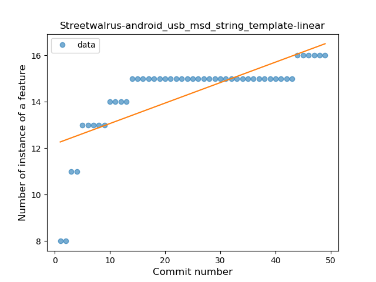
